# Algoritmia e Estruturas de Dados

> Jorge Santos

> Instituto Superior de Engenharia do Porto
>
> Departamento de Engenharia Informática
>
> Fevereiro de 2006

  **Aviso de licença de utilização:** Este documento pode ser utilizado livremente para fins não comerciais, é permitido aos seus utilizadores, copiar, distribuir e exibir publicamente os seus conteúdos, desde que sejam ressalvados os direitos de autor do mesmo, nomeadamente, de-verá ser sempre incluída esta página em todas as cópias.

<details>
<summary> INDICE E TABELAS </summary>

||||||
|-------------------------------------|-------------------------------------|--------------------------------------------|------------------------------------------------------|
| **1 Algoritmia e Programação**      |                                     |                                            |                                                      |
| 1.1.                                | Conceitos básicos                   |                                            |                                                      |
|                                     | 1.1.1.                              | Introdução                                 |                                                      |
|                                     | 1.1.2.                              | Programação estruturada                    |                                                      |
|                                     | 1.1.3.                              | Notação utilizada                          |                                                      |
|                                     | 1.1.4.                              | Operadores utilizados nos algoritmos       |                                                      |
| 1.2.                                | Instruções sequenciais              |                                            |                                                      |
|                                     | 1.2.1.                              | Saída de dados                             |                                                      |
|                                     | 1.2.2.                              | Entrada de dados                           |                                                      |
|                                     | 1.2.3.                              | Atribuição                                 |                                                      |
|                                     | 1.2.4.                              | Exercícios Resolvidos                      |                                                      |
|                                     |                                     | 1.2.4.1. Cambiar moedas                    |                                                      |
|                                     |                                     | 1.2.4.2.                                   | Distância euclidiana entre dois pontos               |
|                                     |                                     | 1.2.4.3.                                   | Determinar perímetro e área de circunferência        |
|                                     | 1.2.5.                              | Exercícios Propostos                       |                                                      |
|                                     |                                     | 1.2.5.1.                                   | Calcular índice de massa corpórea (IMC)              |
|                                     |                                     | 1.2.5.2.                                   | Converter horas, minutos e segundos                  |
|                                     |                                     | 1.2.5.3.                                   | Teorema de Pitágoras                                 |
|                                     |                                     | 1.2.5.4. Converter temperaturas            |                                                      |
| 1.3 Instruções de Decisão           |                                     |                                            |                                                      |
|                                     | 1.3.1.                              | Decisão binária                            |                                                      |
|                                     | 1.3.2.                              | Decisão múltipla                           |                                                      |
|                                     | 1.3.3.                              | Exercícios Resolvidos                      |                                                      |
|                                     |                                     | 1.3.3.1.                                   | Distância euclidiana entre dois pontos               |
|                                     |                                     | 1.3.3.2.                                   | Classificar em função da média                       |
|                                     |                                     | 1.3.3.3.                                   | Determinar o máximo de 3 valores                     |
|                                     |                                     | 1.3.3.4.                                   | Determinar triângulo válido                          |
|                                     | 1.3.4.                              | Exercícios Propostos                       |                                                      |
|                                     |                                     | 1.3.4.1. Classificar triângulo             |                                                      |
|                                     |                                     | 1.3.4.2.                                   | Divisão                                              |
|                                     |                                     | 1.3.4.3.                                   | Resolver equação da forma ax2 + bx + c = 0           |
|                                     |                                     | 1.3.4.4.                                   | Converter entre escalas de temperaturas              |
|                                     |                                     | 1.3.4.5.                                   | Calcular índice de massa corpórea (IMC)              |
|                                     |                                     | 1.3.4.6.                                   | Determinar ano bissexto                              |
|                                     |                                     | 1.3.4.7.                                   | Parque de estacionamento                             |
| 1.4 Instruções de Repetição (Ciclos)|                                     |                                            |                                                      |
|                                     | 1.41.                               | Ciclo condicional: repetir-até             |                                                      |
|                                     | 1.4.2.                              | Ciclo condicional: enquanto-fazer          |                                                      |
|                                     | 1.4.3.                              | Ciclo determinístico: para-fazer           |                                                      |
|                                     | 1.4.4.                              | Exercícios Resolvidos                      |                                                      |
|                                     |                                     | 1.4.4.1.                                   | Calcular somatório entre dois limites                |
|                                     |                                     | 1.4.4.2.                                   | Calcular factorial de um número                      |
|                                     |                                     | 1.4.4.3.                                   | Determinar se um número é primo                      |
|                                     |                                     | 1.4.4.4.                                   | Determinar nome e idade da pessoa mais nova de um    |
|                                     |                                     |                                            | grupo                                                |
|                                     |                                     | 1.445                                      | Determinar o aluno melhor classificado e a média das |
|                                     |                                     |                                            | notas de uma turma                                   |
|                                     | 1.45                                | Exercícios Propostos                       |                                                      |
|                                     |                                     | 1.4.5.1.                                   | Divisão através de subtracções sucessivas            |
|                                     |                                     | 1.4.5.2.                                   | Determinar o máximo e mínimo de uma série            |
|                                     |                                     | 1.4.5.3.                                   | Determinar quantidade de números primos              |
|                                     |                                     | 1.4.5.4.                                   | Determinar se um número é perfeito                   |
|                                     |                                     | 1.4.5.5.                                   | Calcular potência por multiplicações sucessivas      |
|                                     |                                     | 1.4.5.6.                                   | Maior número ímpar de uma sequência de valores       |
|                                     |                                     | 1.4.5.7.                                   | Algarismos de um número                              |
|                                     |                                     | 1.4.5.8.                                   | Apresentação gráfica de temperaturas                 |
|                                     |                                     | 1.4.5.9.                                   | Soma dos algarismo de um número                      |
|                                     |                                     | 1.4.5.1.                                   | Jogo de adivinhar o número                           |
|                                     |                                     | 1.4.5.1.1.                                 | Capicua de um número                                 |
|                                     |                                     | 1.4.5.1.2.                                 | Conversão de base numérica                           |
| 1.5.                                | Traçagens e Teste                   |                                            |                                                      |
| 1.6.                                | Programação modular                 |                                            |                                                      |
|                                     | 1.6.1.                              | Sub-rotinas, parâmetros e variáveis locais |                                                      |
|                                     |                                     | 1.6.1.1.                                   | Funções                                              |
|                                     |                                     | 1.6.1.2.                                   | Procedimentos                                        |
|                                     | 1.6.2                               | Exercícios resolvidos                      |                                                      |
|                                     |                                     | 1.6.2.1.                                   | Função que devolve o maior algarismo de um número    |
|                                     |                                     | 1.6.2.2.                                   | Função que indica se um número é perfeito            |
|                                     | 1.6.3                               | Exercícios propostos                       |                                                      |
|                                     |                                     | 1.631.                                     | Função média de dois números                         |
|                                     |                                     | 1.632                                      | Função lei de Ohm                                    |
|                                     |                                     | 1.633                                      | Função somatório                                     |
|                                     |                                     | 1.634                                      | Funções para codificar e descodificar números        |
|                                     |                                     | 1.635                                      | Números primos                                       |
| 1.7.                                | Recursividade                       |                                            |                                                      |
|                                     | 1.7.1.                              | Exercícios Resolvidos                      |                                                      |
|                                     | 1.7.2.                              | Exercícios Propostos                       |                                                      |
| **2 Estruturas de dados**           |                                     |                                            |                                                      |
| 2.1. Vectores                       |                                     |                                            |                                                      |
|                                     | 2.1.1.                              | Exercícios resolvidos                      |                                                      |
|                                     |                                     | 2.1.1.1.                                   | Funções manipulando vectores                         |
|                                     | 2.1.2.                              | Exercícios propostos                       |                                                      |
|                                     |                                     | 2.1.2.1.                                   | Determinar desvio padrão de uma série                |
|                                     |                                     | 2.1.2.2. Prova de atletismo                |                                                      |
|                                     | 2.2. Ordenação e pesquisa de vectores |                                          |                                                      |
|                                     | 2.2.1.                              | Ordenação por selecção                     |                                                      |
|                                     | 2.2.2.                              | Pesquisa Sequencial                        |                                                      |
|                                     | 2.2.3.                              | Exercicios resolvidos                      |                                                      |
|                                     |                                     | 2.2.3.1. Inverter um vector                |                                                      |
|                                     | 2.2.4.                              | Exercícios propostos                       |                                                      |
|                                     |                                     | 2.2.4.1. Junção ordenada de vectores       |                                                      |
|                                     |                                     | 2.2.4.2.                                   | Método de ordenação por troca directa                |
|                                     |                                     | 2.2.4.3.                                   | Filtro gráfico                                       |


|#|**Lista de Figuras**|
|-----|-------------------------------------------------------------------|
| 11  | Estrutura de um computador                                        |
| 12  | Notação dos Fluxogramas                                           |
| 13  | Fluxograma e sintaxe - Instruções sequenciais                     |
| 14  | Fluxograma e sintaxe - Saída de dados                             |
| 15  | Fluxograma e sintaxe - Entrada de dados                           |
| 16  | Fluxograma e sintaxe - Atribuição                                 |
| 17  | Fluxograma e sintaxe - Instrução decisão se-então                 |
| 18  | Fluxograma e sintaxe - Instrução decisão se-então-senão           |
| 19  | Fluxograma e sintaxe - Instrução decisão múltipla seleccione-caso |
| 110 | Fluxograma da determinação do máximo de 3 valores                 |
| 111 | Fluxograma e sintaxe - Instrução ciclo repetir-até                |
| 112 | Fluxograma e sintaxe - Instrução ciclo enquanto-fazer             |
| 113 | Fluxograma e sintaxe - Instrução ciclo para-fazer                 |
| 114 | Divisão inteira através de subtracções sucessivas                 |
| 115 | Fluxograma e sintaxe - Função                                     |
| 116 | Fluxograma e sintaxe - Procedimento                               |
| 117 | Ilustração da lei de Ohm                                          |
| 21  | Vector unidimensional: notas                                      |
| 22  | Vector bidimensional (matriz): imagem                             |
| 23  | Imagem vídeo - original                                           |
| 24  | Imagem vídeo - em tratamento                                      |


|#|**Lista de Tabelas**|
|-----|-------------------------------|
| 11  | Operadores relacionais        |
| 12  | Operadores aritméticos        |
| 13  | Operadores lógicos            |
| 14  | Tabela de verdade - conjunção |
| 15  | Tabela de verdade - disjunção |
| 16  | Tabela de verdade - negação   |
| 17  | Índice de massa corpórea      |
| 18  | Traçagem do algoritmo 114     |


|#|**Lista de Algoritmos**|
|-----|-------------------------------------------------------------------------|
| 11  | Cambiar euro para dólar                                                 |
| 12  | Calcular distância euclidiana entre pontos                              |
| 13  | Determinar perímetro e área de circunferência                           |
| 14  | Máquina de furação - decisão múltipla                                   |
| 15  | Máquina de furação - decisão binária                                    |
| 16  | Calcular distância euclidiana entre pontos                              |
| 17  | Classificar em função da média                                          |
| 18  | Calcular máximo de 3 números                                            |
| 19  | Calcular máximo de 3 números                                            |
| 110 | Validar triângulo                                                       |
| 111 | Calcular somatório entre dois limites                                   |
| 112 | Calcular factorial de um número                                         |
| 113 | Determinar se um número é primo                                         |
| 114 | Determinar se um número é primo                                         |
| 115 | Determinar nome/idade da pessoa mais nova                               |
| 116 | Determinar o aluno melhor classificado e a média das notas de uma turma |
| 117 | Divisão inteira através de subtracções sucessivas (numerado)            |
| 118 | Função maior(n) que devolve o maior algarismo de um número              |
| 119 | Função perfeito(N) que indica se um número é perfeito                   |
| 21  | Manipulação de Vectores (leitura, diferença entre máximo e mínimo e número de pares e ímpares)    |
| 22  | Utilizar a pesquisa sequencial)                                         |

</details>

</br>

**Resumo**

Estes apontamentos têm como objectivo principal apoiar os leitores que pretendam aprender programação de computadores

Os conteúdos propostos têm como objectivo fornecer bases sólidas de metodo-logias de programação que auxiliem a compreensão de programas computacionais simples, a sua adaptação e desenvolvimento de novas aplicações, e estimular a capa-cidade dos leitores para: analisar e resolver problemas de programação.

A estrutura destes apontamentos foi definida de acordo com a abordagem de *aprender-por-exemplo*, pelo que, os conceitos são apenas introduzidos de acordo com a necessidade de explicar a resolução de um determinado algoritmo.

Neste manual introduzem-se as bases da algoritmia de acordo com o paradigma da programação estruturada. Em cada secção é apresentada um pequena introdu-ção teórica sobre o tópico em destaque, apresentados problemas e propostas soluções para os mesmos, adicionalmente são propostos exercícios para resolução. Na codifi-cação/apresentação das soluções é geralmente *Pseudo-Código* e/ou *Fluxogramas*.

Este documento compila exercícios de vários anos de ensino de muitos docentes do departamento nos quais me incluo. Ao longo do manual poderão ser encontrados exemplos e exercícios propostos pelos docentes nas disciplinas de *Algoritmia e Progra-mação*, *Linguagens de Programação I* do curso de Engenharia Informática do Departa-mento de Engenharia Informática (DEI), bem como de *Programação I* e *Programação II* do curso Engenharia Electrotécnica do Departamento de Engenharia Electrotécnica (DEE), ambos do ISEP.

**Agradecimentos**

  Gostaria de agradecer aos colegas que permitiram a utilização do seu material peda-gógico, em particular, Alberto Sampaio, Ana Almeida Figueiredo, Ana Madureira, Carlos Vaz de Carvalho, Conceição Neves, Isabel Sampaio e José Avelino.
  Estou igualmente grato a todos aqueles que reviram o manual e deram inúmeras sugestões para o seu melhoramento, nomeadamente Berta Baptista, Paulo Ferreira e Nuno Silva.
  Pese embora a inúmeras sugestões/correções propostas pelos referidos colegas, quaisquer erros e gralhas que subsistam no documento são, naturalmente, da minha inteira responsabilidade.
  Porto, Fevereiro de 2006

  Jorge Santos

**Capítulo 1**

**Algoritmia e Programação**

**Objectivos**

- Familiarizar os alunos com os conceitos e a terminologia associados à Informática

- Programar com clareza usando a metodologia da Programação Estruturada

**1.1** **Conceitos básicos**

Nesta secção são introduzidos os conceitos básicos necessários à disciplina de algoritmia e programação. Em particular, os conceitos de programação estruturada, pro-grama, estrutura de dados e algoritmo.

**1.1.1** **Introdução**

Informática é a ciência que estuda a informação, em particular, preocupa-se com a estrutura, criação, gestão, armazenamento, pesquisa, disseminação e transferência de informação. Para além disso, a informática estuda a aplicação da informação nas organizações. A palavra informática é resultado da contracção das palavras: **informação automática**.

A matéria prima da informática é a informação, na sua forma mais simples, dados e a ferramenta básica é o computador.

> *O computador está para a informática assim como o telescópio para astronomia.*

Um computador é um conjunto de circuitos eléctricos e electrónicos capaz de re-alizar de modo autónomo uma determinada tarefa, por obediência a um programa armazenado internamente. Assim, um computador pode ser visto como um sistema de computação que compreende *hardware* e *software* (ver figura 1.1).

- **Hardware** - esta é a componente material/física do computador, que fornece a capacidade de:

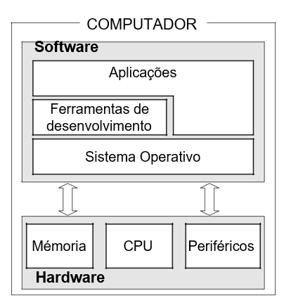

Figura 1.1: Estrutura de um computador

- executar um determinado tipo de instruções a uma determinada
velocidade;
- armazenar um conjunto de bytes;
- comunicar com um conjunto de periféricos.

Estas componentes físicas têm que receber ordens do que fazer e como se articular. Esta é a função do software.

- **Software** - esta é a componente lógica do computador, que consiste num con-junto de programas que dirigem o funcionamento do computador. 

Para uma melhor sistematização do software e as respectivas funções, este pode ser organizado nas seguintes categorias:

- Software de Sistema Operativo - conjunto de programas que comunica di-rectamente com o hardware e é responsável pela gestão de recursos e peri-féricos. Neste conjunto incluem-se o sistema operativo e os programas de controle do funcionamento do hardware, tais como programas de parame-trização, *drivers* e afins.

- Ferramentas de desenvolvimento - conjunto de aplicações utilizadas no de-senvolvimento de aplicações. Neste conjunto incluem-se as linguagens de programação (compiladores e interpretadores) e os sistemas de gestão de bases de dados.

- Aplicações - conjunto de aplicações que se destinam à utilização pelo utili-zador final do sistema de computação. Regra geral o nível de abstracção é mais elevado do que nas categorias anteriores. Neste conjunto incluem-se as aplicações por medida, ferramentas de gestão, folhas de cálculo, editores de texto, etc.

**1.1.2** **Programação estruturada**

Numa primeira fase, nas décadas de 50 e 60, o desenvolvimento do hardware era o responsável pela *expansão* dos computadores. A maioria do investimento era feito a este nível, sendo a programação vista como uma arte.

Na década de 70, incentivados pela melhoria das características de hardware (mi-niaturização e baixo custo) os informáticos foram confrontados com projectos cada vez mais sofisticados. Constata-se nessa altura a inversão dos custos dispendidos com hardware e software, para além do problema da fiabilidade do software passar a ser uma preocupação.

Surge então a necessidade de transformar a tarefa de construir software numa actividade com rigor comparável a uma disciplina de engenharia nascendo assim uma nova disciplina – a Engenharia de Software – cujo objectivo é a produção de Software de modo eficiente em custos controlados e segurança.

A produção de software, como de qualquer outro produto de engenharia passa por diferentes fases como sejam: planeamento, análise, projecto, programação, im-plementação e manutenção. Para cada uma das fases do desenvolvimento do soft-ware foram estudadas métodos e técnicas específicas. A programação estruturada enquadra-se num desses métodos e permite fasear o processo de construção de um programa descrevendo o processo computacional de um modo não ambíguo - **Algoritmo**.

A programação estruturada define um conjunto de regras para elaboração de pro-gramas. A programação estruturada baseia-se no desenho modular dos programas e no refinamento gradual do topo para a base.

De acordo com este paradigma um programa pode ser definido pela forma se-guinte:

`Programa = Estrutura de Dados + Algoritmo`

Um algoritmo manipula dados que podem ser de diversos tipos, designadamente: números (inteiros ou reais), caracteres, cadeias de caracteres, endereços (apontado-res), lógicos (verdadeiro e falso).

As estrutura de dados são o modo como os dados estão organizados, acedidos e alterados. De entre as mais relevantes destacam-se: variáveis simples, vectores mono e multi-dimensionais, listas, filas, árvores, grafos e ficheiros.

Um algoritmo consiste num conjunto finito e bem-definido de instruções que des-crevem os passos lógicos necessários à realização de uma tarefa ou resolução de um

problema, dado o estado inicial (único), a execução do algoritmo conduz ao estado final (único).

Considere-se por exemplo a seguinte receita para a confecção de uma omelete de queijo.

    OMELETE DE QUEIJO FRESCO
    Ingredientes:
    - 170 gr de queijo fresco
    - 6 ovos grandes
    - 30 gr de manteiga ou margarina
    - Sal q.b.

    Modo de Preparação:
    Ponha o queijo fresco numa tigela e esmague-o com uma colher de pau, até formar um puré espesso e cremoso. Bata os ovos e misture-os com o queijo, adicionando um pouco de água fria. Tempere a gosto. Derreta um pouco de gordura numa frigideira de base larga e adicione a mistura de ovos e queijo. Cozinhe em lume brando até que a omelete fique pronta mas não demasiado cozida.

Estabelecendo um paralelo entre esta receita culinária e um programa, os
ingredi-entes são as estruturas de dados e o modo de preparação é o
algoritmo. Naturalmente que uma receita culinária usa a linguagem
natural e como tal é muito difícil a sua in-terpretação por parte de um
computador.

De acordo com o paradigma da programação estruturada qualquer programa
pode ser descrito utilizando exclusivamente as três estruturas básicas
de controlo:

- **Instruções de Sequência** - as instruções de sequência são instruções atómicas (simples) permitem a leitura/escrita de dados, bem como o cálculo e atribuição de valores;

- **Instruções de Decisão** - as instruções de decisão, ou selecção, permitem a selec-ção em alternância de um ou outro conjunto de acções após a avaliação lógica de uma condição;

- **Instruções de Repetição** - as instruções de repetição, ou ciclos, permitem a exe-cução, de forma repetitiva, de um conjunto de instruções. Esta execução de-pende do valor lógico de uma condição que é testada em cada iteração para decidir se a execução do ciclo continua ou termina.

Na descrição de algoritmos são utilizados diferentes formalismos
conforme o ob-jectivo ou audiência. Entre os mais comuns encontram-se o
pseudo-código e fluxo-gramas.

- **Pseudo-código** - consiste na descrição do algoritmo numa linguagem parecida com a linguagem natural (português, inglês ou outra) de forma estruturada. O objectivo deste formalismo é centrar a atenção do programador na lógica ou fluxo do algoritmo, abstraindo-se das questões relacionadas com a sintaxe es-pecífica de uma determinada linguagem de programação;

- **Fluxograma** - consiste na descrição de um algoritmo de forma gráfica. Este for-malismo inclui um conjunto de símbolos gráficos que representação os diferen-tes tipos de instruções anteriormente descritas: sequência, decisão e repetição.

**1.1.3** **Notação utilizada**

Na representação de fluxogramas será utilizada a notação apresentada na figura 1.2:


Figura 1.2: Notação dos Fluxogramas

Na escrita dos programas em pseudo-código serão considerados as
seguintes opções:
- Os algoritmos são delimitados pelas etiquetas início e fim;
- As etiquetas Entrada: e Saída: são utilizadas na explicitação das entradas e saídas de dados, respectivamente, mais relevantes para o funcionamento do algoritmo;
- Os comentários são precedidos do caracter ’#’ e são meramente documentais, como tal, não são executados;
- As acções são descritas através de verbos no infinitivo;
- Foram utilizadas diferentes formatações para os conceitos a seguir  explicitados, com o objectivo de tornar a leitura dos algoritmos mais simples:

> **–** variável;

> **–** palavra chave;
>
> **–** *\# comentário*;

**1.1.4** **Operadores utilizados nos algoritmos**

Na escrita de algoritmos são utilizados os operadores relacionais, lógicos e aritmé-ticos. Na tabela 1.1 são apresentados os operadores relacionais considerados e res-pectiva semântica. Na explicitação dos operadores considerem-se as variáveis a e b apresentado os valores 13 e 5, respectivamente.

Tabela 1.1: Operadores relacionais

<table style="width:100%;">
  <colgroup>
    <col style="width: 19%" />
    <col style="width: 37%" />
    <col style="width: 19%" />
    <col style="width: 23%" />
  </colgroup>

  <thead>
    <tr class="header">
      <th><strong>Símbolo</strong></th>
      <th><blockquote>
      <p><strong>Nome</strong></p>
      </blockquote></th>
      <th><strong>Exemplo</strong></th>
      <th><blockquote>
      <p><strong>Resultado</strong></p>
      </blockquote></th>
    </tr>
  </thead>

  <tbody>
    <tr class="odd">
      <td><em>&lt;</em></td>
      <td><blockquote>
      <p>menor que</p>
      </blockquote></td>
      <td><em>a &lt; b</em></td>
      <td><blockquote>
      <p>falso</p>
      </blockquote></td>
    </tr>
    <tr class="even">
      <td><em>&gt;</em></td>
      <td><blockquote>
      <p>maior que</p>
      </blockquote></td>
      <td><em>a &gt; b</em></td>
      <td><blockquote>
      <p>verdadeiro</p>
      </blockquote></td>
    </tr>
    <tr class="odd">
      <td><em>‚</em></td>
      <td><blockquote>
      <p>maior ou igual que</p>
      </blockquote></td>
      <td><em>a ‚ b</em></td>
      <td><blockquote>
      <p>verdadeiro</p>
      </blockquote></td>
    </tr>
    <tr class="even">
      <td><em>•</em></td>
      <td><blockquote>
      <p>menor ou igual que</p>
      </blockquote></td>
      <td><em>a • b</em></td>
      <td><blockquote>
      <p>falso</p>
      </blockquote></td>
    </tr>
    <tr class="odd">
      <td>=</td>
      <td><blockquote>
      <p>igual a</p>
      </blockquote></td>
      <td><em>a</em> = <em>b</em></td>
      <td><blockquote>
      <p>falso</p>
      </blockquote></td>
    </tr>
    <tr class="even">
      <td><em>6</em>=</td>
      <td><blockquote>
      <p>diferente de</p>
      </blockquote></td>
      <td><em>a 6</em>= <em>b</em></td>
      <td><blockquote>
      <p>verdadeiro</p>
      </blockquote></td>
    </tr>
  </tbody>
</table>

Na tabela 1.2 são apresentados os operadores aritméticos considerados e respec-tiva semântica. Na explicitação dos operadores considerem-se as variáveis a e b apre-sentado os valores 13 e 5, respectivamente.

Tabela 1.2: Operadores aritméticos

<table>
  <colgroup>
    <col style="width: 18%" />
    <col style="width: 41%" />
    <col style="width: 18%" />
    <col style="width: 21%" />
  </colgroup>

  <thead>
  <tr class="header">
    <th><strong>Símbolo</strong></th>
    <th><blockquote>
    <p><strong>Nome</strong></p>
    </blockquote></th>
    <th><strong>Exemplo</strong></th>
    <th><blockquote>
    <p><strong>Resultado</strong></p>
    </blockquote></th>
  </tr>
  </thead>
  
  <tbody>
    <tr class="odd">
      <td>+</td>
      <td><blockquote>
      <p>soma</p>
      </blockquote></td>
      <td><em>a</em> + <em>b</em></td>
      <td>18</td>
    </tr>
    <tr class="even">
      <td>-</td>
      <td><blockquote>
      <p>subtracção</p>
      </blockquote></td>
      <td><em>a ¡ b</em></td>
      <td>8</td>
    </tr>
    <tr class="odd">
      <td>*</td>
      <td><blockquote>
      <p>multiplicação</p>
      </blockquote></td>
      <td><em>a ⁄ b</em></td>
      <td>65</td>
    </tr>
    <tr class="even">
      <td>/</td>
      <td><blockquote>
      <p>divisão</p>
      </blockquote></td>
      <td><em>a</em>/<em>b</em></td>
      <td>2.6</td>
    </tr>
    <tr class="odd">
      <td>div</td>
      <td><blockquote>
      <p>divisão inteira</p>
      </blockquote></td>
      <td><em>a</em> div <em>b</em></td>
      <td>2</td>
    </tr>
    <tr class="even">
      <td>%</td>
      <td><blockquote>
      <p>resto da divisão inteira</p>
      </blockquote></td>
      <td><em>a</em> % <em>b</em></td>
      <td>3</td>
    </tr>
  </tbody>
</table>

Na tabela 1.3 são apresentados os operadores lógicos considerados, a
conjunção, disjunção e negação.

Na avaliação das expressão lógicas é utilizada a lógica Boole de acordo
com as tabelas de verdade de cada operação, conjunção (tabela 1.4),
disjunção (1.5) e negação (1.6).

Tabela 1.3: Operadores lógicos

<table>
  <colgroup>
    <col style="width: 46%" />
    <col style="width: 53%" />
  </colgroup>

  <thead>
    <tr class="header">
    <th><strong>Símbolo</strong></th>
    <th><blockquote>
    <p><strong>Nome</strong></p>
    </blockquote></th>
    </tr>
  </thead>

  <tbody>
    <tr class="odd">
      <td>e , <em>^</em></td>
      <td><blockquote>
      <p>conjunção</p>
      </blockquote></td>
    </tr>
    <tr class="even">
      <td>ou , <em>_</em></td>
      <td><blockquote>
      <p>disjunção</p>
      </blockquote></td>
    </tr>
    <tr class="odd">
      <td>não, <em>:</em></td>
      <td><blockquote>
      <p>negação</p>
      </blockquote></td>
    </tr>
  </tbody>
</table>

Tabela 1.4: Tabela de verdade - conjunção

| **a**      | **b**      | **a** *^* **b** |
|------------|------------|-----------------|
| falso      | falso      | falso           |
| falso      | verdadeiro | falso           |
| verdadeiro | falso      | falso           |
| verdadeiro | verdadeiro | verdadeiro      |

Tabela 1.5: Tabela de verdade - disjunção

| **a**      | **b**      | **a** *\_* **b** |
|------------|------------|------------------|
| falso      | falso      | falso            |
| falso      | verdadeiro | verdadeiro       |
| verdadeiro | falso      | verdadeiro       |
| verdadeiro | verdadeiro | verdadeiro       |

Tabela 1.6: Tabela de verdade - negação

| **a**      | *:***a**   |
|------------|------------|
| falso      | verdadeiro |
| verdadeiro | falso      |

**1.2** **Instruções sequenciais**

As instruções do tipo sequencial são as mais simples de todas apresentando uma uma estrutura atómica. São responsáveis por permitirem fazer a entrada/saída de dados, execução de cálculos e atribuição de valores a variáveis. A noção de ordem/sequência é representada através da seta de fluxo (ver figura 1.3).

**1.2.1** **Saída de dados**

As instruções de escrita permitem fazer a saída de dados (tipicamente para o écran) sejam estes variáveis e/ou textos e/ou resultado de cálculos. Na figura 1.4 é apresen-tada sintaxe proposta para a escrita de uma ou várias variáveis.

Conforme os exemplos seguintes:

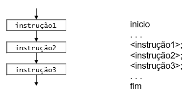

Figura 1.3: Fluxograma e sintaxe - Instruções sequenciais

![media](./media/ALG-EST-image4.png" style="width:5.04722in;height:1.5375in" />

Figura 1.4: Fluxograma e sintaxe - Saída de dados

> **início**

- *Escrever o conteúdo da variável x*; escrever x;

- *Escrever o conteúdo das variáveis nome e idade*; escrever nome,
  > idade;

- *Escrever um texto seguido do valor da variável x*; escrever "O valor
  > de x é:", x;

- *Escrever o resultado da operação 4\*4, 16*; escrever 4\*4;

- *Escrever 4\*4*;

> escrever "4\*4";
>
> **fim**

**1.2.2** **Entrada de dados**

As instruções de leitura permitem fazer a entrada de dados, tipicamente a partir de um teclado, colocando-os em variáveis. Na figura 1.5 é apresentada a sintaxe pro-posta para a leitura de uma ou várias variáveis.

No caso de se pretender ler mais do que uma variável, os nomes das variáveis separam-se por vírgulas. Considerem-se os seguintes exemplos:

![media](./media/ALG-EST-image5.png" style="width:4.5375in;height:1.4625in" />

Figura 1.5: Fluxograma e sintaxe - Entrada de dados

> **início**
- *ler a variável x*; ler x;
- *ler as variáveis nome e idade*; ler nome,idade;
> **fim**

**1.2.3** **Atribuição**

A instrução designada por atribuição permite atribuir o valor de uma expressão a uma variável. A variável que aparece no lado esquerdo da instrução vai assim rece-ber o valor da expressão que aparece no lado direito da mesma instrução. Do lado direito da atribuição podemos ter: um número, um texto, o resultado de um cálculo ou o conteúdo de uma outra qualquer variável. Na figura 1.6 é apresentada a sintaxe proposta para a atribuição.

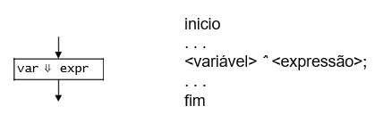

Figura 1.6: Fluxograma e sintaxe - Atribuição

Considerem-se os seguintes exemplos:

> **início**

- *Atribuir o valor 5 à variável x*; x *ˆ* 5;

- *Atribuir o resultado da operação 5\*5-2=23 à variável resultado*;
  > resultado *ˆ* 5\*5-2;

- *Atribuir o valor da variável n à variável maximo*;

> maximo *ˆ* n;

- *Atribuir o texto "Olá Mundo"à variável txt*; txt *ˆ* "Olá mundo";

> **fim**

No exemplo seguinte são realizados dois incrementos consecutivos da variável contador. De início é atribuído o valor 1 a contador e posteriormente esta tomará o valor 2 e 3.

> **início**
- *Inicialização da variável contador*; contador *ˆ* 1;
- *Incremento da variável contador*; contador *ˆ* contador+1;
- *O resultado desta instrução é 2*; escrever contador;
- *Incremento da variável contador*; contador *ˆ* contador+1;
- *O resultado desta instrução é 3*; escrever contador;
> **fim**

As linguagens de programação mais divulgadas utilizam o símbolo *=* para re-presentar a atribuição. A razão de ser dessa opção é de ordem prática: resulta da inexistência do símbolo ’*ˆ*’ nos teclados dos computadores. Note-se que caso fosse utilizado símbolo ’=’ o aspecto da instrução seria: contador=contador+1, o que constitui uma impossibilidade em termos estritamente matemáticos.

Chama-se a atenção para o facto de as linguagens estudadas normalmente pelos principiantes em informática serem linguagens imperativas. Isto é, o que o progra-mador escreve no programa não são expressões matemáticas mas ordens (daí o *impe-rativo*) para o computador cumprir. O computador vai ver a atribuição não como uma igualdade matemática (seja ela escrita com ’*ˆ*’ ou com ’*=*’), mas como uma ordem para primeiro calcular o valor da expressão à direita e depois guardar esse valor na variável indicada à esquerda.

**1.2.4** **Exercícios Resolvidos**

Nesta secção são apresentados alguns problemas e respectivas soluções
com o objec-tivo de ilustrar a utilização de instruções sequenciais.

**1.2.4.1** **Cambiar moedas**

O algoritmo 1.1 permite cambiar euros em dólares considerando a taxa de
conversão 1,17.

> **Entrada**: taxa, valorEuro
>
> **Saída**: valorDolar
>
> **início**
>
> taxa *ˆ* 1,17;
>
> *\# Ler valor em euros*;
>
> escrever "Introduza valor em euros=";
>
> ler valorEuro;

- *Calcular valor em dólar*; valorDolar *ˆ* valorEuro\*taxa;

- *Mostrar resultado*;

> escrever "Valor em dolar=", valorDolar;
>
> **fim**
>
> **Algoritmo 1.1**: Cambiar euro para dólar

**Sugestão:** Escreva uma variação deste algoritmo que permita câmbios entre quais-quer moedas.

**1.2.4.2** **Distância euclidiana entre dois pontos**

O algoritmo 1.2 permite realizar o cálculo da distância euclidiana entre dois pontos, sendo que cada ponto é definido pelas coordenadas (x,y). A distância pode ser calcu-lada de acordo com a fórmula 1.2.1.


> **Algoritmo 1.2**: Calcular distância euclidiana entre pontos

**1.2.4.3** **Determinar perímetro e área de circunferência**

O algoritmo 1.3 permite determinar o perímetro e área de uma circunferência, a partir do valor do raio.

> **Entrada**: raio
>
> **Saída**: perimetro, area
>
> **início**
>
> pi *ˆ* 3,1415;
>
> *\# Ler o valor do raio*;
>
> escrever "Introduza valor do raio:";
>
> ler raio;

- *Calcular perímetro e área*; area *ˆ* pi *⁄* raio<sup>2</sup>;
  > perimetro *ˆ* 2 *⁄* pi *⁄* raio;

- *Apresentar resultados*; escrever "Área=", area; escrever
  > "Perímetro=", perimetro;

> **fim**
>
> **Algoritmo 1.3**: Determinar perímetro e área de circunferência

**1.2.5** **Exercícios Propostos**

Nesta secção são propostos alguns problemas com vista à aplicação conjugada de instruções sequenciais.

**1.2.5.1** **Calcular índice de massa corpórea (IMC)**

O índice de massa corpórea (IMC) de um indivíduo é obtido dividindo-se o seu peso (em *Kg*) por sua altura (em *m*) ao quadrado. Assim, por exemplo, uma pessoa de 1,67m e pesando 55kg tem IMC igual a 20,14, já que:

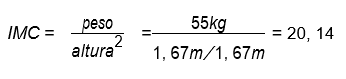

Escreva um programa que solicite ao utilizador o fornecimento do seu peso em *kg* e de sua altura em *m* e a partir deles calcule o índice de massa corpórea do utilizador.

**1.2.5.2** **Converter horas, minutos e segundos**

Descreva um algoritmo que a partir de um determinado número de segundos cal-cula o número de horas, minutos e segundos correspondentes. Conforme o seguinte exemplo:

8053*s* = 2*h* + 14*m* + 13*s*

**1.2.5.3** **Teorema de Pitágoras**

Descreva um algoritmo para determinar a hipotenusa de um triângulo rectângulo, dados os catetos.

**1.2.5.4** **Converter temperaturas**

Descreva um algoritmo que a partir de uma temperatura expressa em graus Fahre-nheit (tempF), calcule a temperatura expressa em graus Celsius (tempC). A conversão pode ser realizada de acordo com a fórmula 1.2.2.

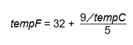

**1.3** **Instruções de Decisão**

As instruções de decisão, ou selecção, permitem a selecção em alternância de um ou outro conjunto de acções após a avaliação lógica de uma condição.

**1.3.1** **Decisão binária**

A decisão binária permite bifurcar a execução de um algoritmo em dois fluxos dis-tintos, para tal é utilizada instrução se. Esta instrução pode ser utilizada de duas formas: se-então e se-então-senão.

Na figura 1.7 é apresentada a sintaxe para o primeiro caso. se a condição for verdadeira é executado o bloco-instruções caso contrário nada acontece.

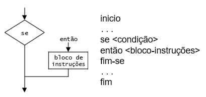

Figura 1.7: Fluxograma e sintaxe - Instrução decisão se-então

Considere-se o seguinte exemplo utilizando a forma se-então, no qual um aluno é aprovado se tem nota maior ou igual a 9,5:

> **Entrada**: nota
>
> **início**
>
> escrever "Introduza nota:";
>
> ler nota;
>
> **se** *nota ‚ 9,5* **então**
>
> escrever "O aluno foi aprovado";
>
> **fim-se**
>
> **fim**

Note-se que um bloco de instruções é delimitado pelas instruções então e fim-se.

No segundo caso (ver figura 1.8), em que a instrução tem a estrutura se-então-senão, se a condição for verdadeira é executado o bloco-instruções1 senão é executado o bloco-instruções2.

> ![media](./media/ALG-EST-image10.png"
> style="width:2.66042in;height:1.92431in" />
>
> Figura 1.8: Fluxograma e sintaxe - Instrução decisão se-então-senão
>
> Considere-se o seguinte exemplo utilizando a forma se-então-senão.
>
> **Entrada**: lado1, lado2
>
> **Saída**: area
>
> **início**
>
> *\# Ler as medidas dos lados*;
>
> escrever "Introduza medidas dos lados:";
>
> ler lado1, lado2;
>
> *\# Calcular área*;
>
> area *ˆ* lado1\*lado2;
>
> **se** *lado1 = lado2* **então**
>
> escrever "Área do quadrado=", area;
>
> **senão**
>
> escrever "Área do rectângulo=", area;
>
> **fim-se**
>
> **fim**

Neste exemplo são lidas as medidas dos lados de uma figura rectangular, sendo que no caso particular de os dois lados serem iguais estamos na presença de um quadrado. Em qualquer um dos casos é apresentada a mensagem correspondente.

**1.3.2** **Decisão múltipla**

A instrução de de decisão múltipla é um caso particular de instruções encadeadas do tipo se-então-senão. Normalmente é utilizada no teste de múltiplos valores de uma variável. A sintaxe proposta para a decisão múltipla encontra-se descrita na figura 1.9.

> :";
>
> ler letra;

- *Testar casos e escrever mensagem respectiva*; **seleccionar** *letra*

> **caso** *’L’* escrever "Ligar"; **caso** *’D’* escrever "Desligar";
> **caso** *’F’* escrever "Furar"; **senão**
>
> escrever "Operação inválida";
>
> **fim-seleccionar fim-seleccionar**
>
> **fim**
>
> **Algoritmo 1.4**: Máquina de furação - decisão múltipla

Note-se que tal como acontece no caso da instrução se-então a componente senão é opcional.

O algoritmo 1.5 tem um funcionamento idêntico ao 1.4 mas é implementado atra-vés da instrução se-então-senão.

> **Entrada**: letra
>
> **início**
>
> *\# Ler letra*;
>
> escrever "Introduza letra (L/D/F):";
>
> ler letra;
>
> *\# Testar casos e escrever mensagem respectiva*;
>
> **se** *letra=’L’* **então**
>
> escrever "Ligar";
>
> **senão**
>
> **se** *letra=’D’* **então**
>
> escrever "Desligar";
>
> **senão**
>
> **se** *letra=’F’* **então**
>
> escrever "Furar";
>
> **senão**
>
> escrever "Operação inválida";
>
> **fim-se**
>
> **fim-se**
>
> **fim-se**
>
> **fim**
>
> **Algoritmo 1.5**: Máquina de furação - decisão binária

**1.3.3** **Exercícios Resolvidos**

Nesta secção são apresentados alguns problemas e respectivas soluções com o objectivo de ilustrar a utilização de instruções de decisão.

**1.3.3.1** **Distância euclidiana entre dois pontos**

O algoritmo 1.6 permite realizar o cálculo da distância euclidiana entre dois pontos, sendo que cada ponto é definido pelas coordenadas (x,y). no cálculo da distância pode ser utilizada a fórmula 1.3.1.

> :";
>
> ler x1, y1;
>
> *\# Ler coordenadas do ponto 2*;
>
> escrever "Coordenadas ponto2 (x/y):";
>
> ler x2, y2;

- *Calcular distância e mostrar resultado*; distancia *ˆ*
  > <sup>p</sup>(x2 *¡* x1)<sup>2</sup> + (y2 *¡* y1)<sup>2</sup>;
  > **se** *distancia=0* **então**

> escrever "Os pontos são coincidentes"; **senão**
>
> escrever "Distância=", distancia;
>
> **fim-se**
>
> **fim**
>
> **Algoritmo 1.6**: Calcular distância euclidiana entre pontos

**1.3.3.2** **Classificar em função da média**

O algoritmo 1.7 permite ler as notas de um aluno às disciplinas de Matemática, Por-tuguês, Inglês e Geografia e calcular a média. Em função da média mostra uma men-sagem com o conteúdo *"Aprovado"* ou *"Reprovado"*. Consideram-se notas positivas as notas iguais ou superiores a 9,5.

> **Entrada**: mat, por, ing, geo
>
> **início**
>
> *\# Ler as notas do aluno*;
>
> escrever "Introduza notas (mat, por, ing, geo):"; ler mat, por, ing,
> geo;
>
> *\# Calcular média*;
>
> <sub>media *ˆ*</sub> <u>mat+por+ing+geo</u><sub>;</sub>
>
> 4
>
> **se** *media ‚ 9,5* **então**
>
> escrever "Aprovado";
>
> **senão**
>
> escrever "Reprovado";
>
> **fim-se**
>
> **fim**
>
> **Algoritmo 1.7**: Classificar em função da média

**1.3.3.3** **Determinar o máximo de 3 valores**

Considere-se o problema de ler três números e calcular o maior deles. O fluxograma 1.10 permite capturar com grande facilidade a noção de fluxo e passos alternativos. Na resolução do problema foi adoptada uma estratégia de isolamento dos vários ca-sos, primeiro é testado o número A, depois o número B e caso nenhum dos dois seja o máximo, por exclusão de partes, se concluí que o número C é o maior de todos.

Note-se que a utilização de fluxogramas está regra geral limitada à representação de pequenos programas ou processos com elevado grau de abstracção porque caso contrário o fluxograma estender-se-ia por inúmeras páginas tornando a sua interpre-tação muito difícil.

No algoritmo 1.8 foi codificado em pseudo-código a solução anteriormente deli-neada no fluxograma da figura 1.10.


Figura 1.10: Fluxograma da determinação do máximo de 3 valores

> **Entrada**: A, B, C
>
> **Saída**: maximo
>
> **início**
>
> *\# Ler números*;
>
> escrever "Introduza número1, número2 e número3:"; ler A, B, C;
>
> **se** *A ‚ B* **então**
>
> **se** *A ‚ C* **então**
>
> maximo *ˆ* A;
>
> **fim-se**
>
> **senão**
>
> **se** *B ‚ C* **então**
>
> maximo *ˆ* B;
>
> **senão**
>
> maximo *ˆ* C;
>
> **fim-se**
>
> **fim-se**
>
> escrever "O número maior é:", maximo;
>
> **fim**
>
> **Algoritmo 1.8**: Calcular máximo de 3 números

> O algoritmo 1.9 apresenta uma solução alternativa para o mesmo
> problema.
>
> **Entrada**: num1, num2, num3
>
> **Saída**: maximo
>
> **início**
>
> *\# Ler números*;
>
> escrever "Introduza número1, número2 e número3:"; ler num1, num2,
> num3;

- *Até prova em contrário o primeiro dos números é o maior*; maximo *ˆ*
  > num1;

> **se** *num2 ‚ maximo* **então**
>
> maximo *ˆ* num2;
>
> **fim-se**
>
> **se** *num3 ‚ maximo* **então**
>
> maximo *ˆ* num3;
>
> **fim-se**
>
> escrever "O número maior é:", maximo;
>
> **fim**
>
> **Algoritmo 1.9**: Calcular máximo de 3 números

**Sugestão:** Baseando-se nas soluções propostas escreva um algoritmo que permita a determinação do máximo entre 5 números. Qual é a solução mais elegante?

**1.3.3.4** **Determinar triângulo válido**

O algoritmo 1.10 permite ler três pontos geométricos e determinar se estes formam um triângulo. Pode ser utilizada a fórmula da distância entre dois pontos para cal-cular as medidas dos lados do triângulo. Note-se que um triângulo só é válido se a medida de cada um dos seus lados é menor que a soma dos lados restantes.

> **Entrada**: x1, y1, x2, y2, x3, y3
>
> **início**
>
> *\# Ler coordenadas do ponto 1*;
>
> escrever "Coordenadas ponto1 (x/y):";
>
> ler x1, y1;
>
> *\# Ler coordenadas do ponto 2*;
>
> escrever "Coordenadas ponto2 (x/y):";
>
> ler x2, y2;
>
> *\# Ler coordenadas do ponto 3*;
>
> escrever "Coordenadas ponto3 (x/y):";
>
> ler x3, y3;
>
> *\# Calcular a medida dos lados*;
>
> <sup>p</sup>
>
> a *ˆ* <sub>p</sub>(x2 *¡* x1)<sup>2</sup> + (y2 *¡* y1)<sup>2</sup>;
>
> b *ˆ* <sub>p</sub>(x3 *¡* x2)<sup>2</sup> + (y3 *¡* y2)<sup>2</sup>;
>
> *\# Validar triângulo de acordo com a fórmula*;
>
> **se** *(a \< b+c) e (b \< a+c) e (c \< a+b)* **então**
>
> *\# Triângulo válido*;
>
> escrever "Os três pontos formam um triângulo"; **senão**

- *Pelo menos 2 pontos são coincidentes ou os 3 são colineares*; escrever "Os pontos não formam um triângulo";

> **fim-se**
>
> **fim**
>
> **Algoritmo 1.10**: Validar triângulo

**1.3.4** **Exercícios Propostos**

Nesta secção são propostos alguns problemas com vista à aplicação de instruções de decisão.

**1.3.4.1** **Classificar triângulo**

Classificar um triângulo quanto aos lados, sendo que um triângulo com todos lados iguais é designado *Equilátero*, com todos os lados diferentes entre si é designado *Es-caleno* e caso tenha apenas dois lados iguais entre si, designa-se *Isósceles*.

**1.3.4.2** **Divisão**

Descreva um algoritmo que dados dois valores, divide o primeiro pelo segundo. Note que não é possível fazer a divisão por zero, neste caso deve ser apresentada a mensa-gem adequada.

**1.3.4.3** **Resolver equação da forma** *ax*<sup>2</sup> + *bx* + *c*
= 0

Calcular as raízes de uma equação na forma *ax*<sup>2</sup> + *bx* + *c*
= 0. Note que os valores a, b e c podem ser zero, podendo dar origem a equações sem solução ou equações de primeiro grau. Considere as fórmulas 1.3.2 e 1.3.3 na resolução do problema.

**1.3.4.4** **Converter entre escalas de temperaturas**

Escrever um programa que faça conversões entre as três escalas de temperaturas, Kelvin, Celsius e Fahrenheit, com base em três valores de entrada: a temperatura e escala actual e escala pretendida. Conforme o seguinte exemplo:

As entradas 38, ’C’ e ’K’, significam que o utilizador pretende converter a tem-peratura 38 Celsius para Kelvin. Considere as fórmulas 1.3.4 e 1.3.5 na resolução do programa.

|||
|-|-|
tempF	=	(32+9)⁄5 tempC|(1.3.4)
tempC	=	tempK + 273|(1.3.5)	


**Sugestão:** Tentar a resolução com as estruturas se-então-senão e alternativamente utilizar a estrutura de múltipla decisão.

**1.3.4.5** **Calcular índice de massa corpórea (IMC)**

O índice de massa corpórea (IMC) de um indivíduo é obtido dividindo-se o seu peso (em Kg) por sua altura (em m) ao quadrado. Assim, por exemplo, uma pessoa de 1,67 m e pesando 55 Kg tem IMC igual a 20,14, já que:

|IMC|Interpretação|
|-|-|
|Até 18,5 (inclusive)|Abaixo do peso normal|
|De 18,5 a 25 (inclusive)|Peso normal|
|De 25 a 30 (inclusive)|Acima do peso normal|
|Acima de 30|Obesidade|


Tabela 1.7: Índice de massa corpórea

Considerando a tabela 1.7, escreva um programa que leia o peso em *kg* e a altura em *m* de uma determinada pessoa de forma a calcular o índice de massa corpórea do mesmo e de seguida, estabeleça as comparações necessárias entre o IMC calculado e os valores da tabela 1.7 e escreva uma das frases, conforme for o caso:

- *Você está abaixo do peso normal.*

- *O seu peso está na faixa de normalidade.*

- *Você está acima do peso normal.*

- *Você precisa de perder algum peso.*

**1.3.4.6** **Determinar ano bissexto**

Um ano é bissexto se é divisível por 4, excepto se, além de ser divisível por 4, for também divisível por 100. Então ele só é bissexto se também for divisível por 400. Escrever um algoritmo que leia o valor de um ano e escreva se o ano é ou não bissexto.

**1.3.4.7** **Parque de estacionamento**

Considere um parque de estacionamento que pratica os preços seguintes:

- 1*<sup>a</sup>* hora: 2 e,
- 2*<sup>a</sup>* hora: 1,5 e,
- a partir da 2*<sup>a</sup>* hora: 1 e/hora

O tempo de permanência no parque é contabilizado em horas e minutos. Por exemplo, se uma viatura permanecer 2 horas e 30 minutos no parque, pagará 2 e (1*<sup>a</sup>* hora) + 1,5 e (2*<sup>a</sup>* hora) + 0,5 e (30 minutos a 1 e/hora) = 4 e.

Elabore um algoritmo que, lido o tempo que determinada viatura permaneceu estacionada no parque, diga a quantia que deve ser paga.

**1.4** **Instruções de Repetição (Ciclos)**

As instruções de repetição, ou ciclos, permitem a execução de forma repetitiva de um conjunto de instruções. Esta execução depende do valor lógico de uma condição que

- testada em cada iteração para decidir se a execução do ciclo continua ou termina. Note-se que as diferentes instruções de ciclos a seguir apresentadas consistem em variações da mesma estrutura.

**1.4.1** **Ciclo condicional: repetir-até**

O ciclo repetir-até executa um bloco de instruções até que uma determinada condi-ção lógica seja verdadeira. Este ciclo testa a condição lógica após a primeira iteração, ou seja, o teste é realizado à saída. Este ciclo deve ser utilizado sempre que se desejar que o código seja executado pelo menos uma vez. Na figura 1.11 é apresentada a sintaxe proposta para o ciclo repetir-até.

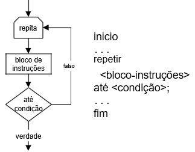

Figura 1.11: Fluxograma e sintaxe - Instrução ciclo repetir-até 
Considere-se o seguinte exemplo em que a utilização da estrutura repetir-até permite garantir que o valor da nota introduzida está situado entre 0 e 20.

> **Entrada**: nota
>
> **início**
>
> **repetir**
>
> escrever "Introduzir nota entre 0-20:";
>
> ler nota;
>
> **até** *nota ‚ 0 e nota • 20*;
>
> **fim**

**1.4.2** **Ciclo condicional: enquanto-fazer**

O ciclo enquanto executa um bloco de instruções enquanto uma determinada condi-ção lógica for verdadeira. Este ciclo testa a condição lógica à entrada. Na figura 1.12 é apresentada a sintaxe proposta para o ciclo enquanto-fazer.

Considere-se o seguinte exemplo em que a utilização da estrutura enquanto-fazer permite calcular e escrever a tabuada de um número.

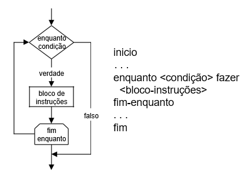

Figura 1.12: Fluxograma e sintaxe - Instrução ciclo enquanto-fazer

> **Entrada**: numero
>
> **início**

- *Ler o número para o qual será apresentada a tabuada* escrever
  > "Introduza número:";

> ler numero; i *ˆ* 1;
>
> **enquanto** *i • 10* **fazer** resultado *ˆ* numero\*i;
>
> escrever numero, "\*", i, "=", resultado;

- *Incrementar a variável i*

> i *ˆ* i+1;
>
> **fim-enquanto**
>
> **fim**

**1.4.3** **Ciclo determinístico: para-fazer**

O ciclo para-fazer executa um bloco de instruções com um número pré-determinado de vezes. Na figura 1.13 é apresentada a sintaxe proposta para o ciclo para-fazer.

- O bloco-início - é um conjunto de instruções que são executadas à *priori*;

- A condição é uma expressão lógica é testada em cada iteração do ciclo, sendo necessário que o seu valor lógico seja *verdade* para que o ciclo continue em execução;

- O bloco-iter é composto por um conjunto de instruções que são executadas em cada iteração.


Figura 1.13: Fluxograma e sintaxe - Instrução ciclo para-fazer

Considere-se o seguinte exemplo em que a utilização da estrutura para-fazer permite calcular a soma os 100 primeiros números inteiros.

> **Saída**: soma
>
> **início**
>
> soma *ˆ* 0;
>
> **para** *i ˆ 1; i\<100; i ˆ i+1* **fazer**
>
> soma *ˆ* soma + i;
>
> **fim-para**
>
> escrever soma;
>
> **fim**

Neste exemplo é introduzido um conceito importante para a programação, o con-ceito de acumulador. A variável soma em cada iteração é adicionada do valor da variável i, permitindo que no final:

soma = 1 + 2 + 3 + 4 + 5 + *¢ ¢ ¢* + 100 = 5050

Por outro lado, a instrução i *ˆ* i+1 faz com que a variável i tome todos os valores inteiros de 1 a 100.

Considere-se a resolução do problema de calcular a soma os 100 primeiros núme-ros inteiros utilizando para tal a o ciclo enquanto-fazer.

> **Saída**: soma
>
> **início**
>
> soma *ˆ* 0;

- *A iniciação da variável de iteração tem de ser realizada antes do início do ciclo* i *ˆ* 1;

**enquanto** *i • 100* **fazer**

soma *ˆ* soma + i;

- *Incremento da variável de iteração* i *ˆ* i+1;

> **fim-enquanto**
>
> escrever soma;
>
> **fim**

**1.4.4** **Exercícios Resolvidos**

Nesta secção são apresentados alguns problemas e respectivas soluções com o ob-jectivo de ilustrar a utilização de instruções cíclicas. Nas soluções são exploradas situações com utilização simples dos ciclos e/ou imbricados.

**1.4.4.1** **Calcular somatório entre dois limites**

O algoritmo 1.11 permite calcular a somatório dos números existentes num intervalo definido por limites inferior e superior. Note que o utilizador pode introduzir os li-mites na ordem que entender, desta forma os intervalos [5-10] e [10-5] são igualmente válidos.

> **Entrada**: limite1, limite2
>
> **Saída**: soma
>
> **início**
>
> *\# Ler intervalo*;
>
> escrever "Introduza número1:";
>
> ler limite1;
>
> escrever "Introduza número2:";
>
> ler limite2;

- *Determinar o limite inferior e superior*; **se** *limite1\>limite2*
  > **então**

> maximo *ˆ* limite1; minimo *ˆ* limite2;
>
> **senão**
>
> maximo *ˆ* limite2; minimo *ˆ* limite1;
>
> **fim-se**

- *Calcular soma propriamente dita*; soma *ˆ* 0;

> **para** *i ˆ minimo; i•maximo; i ˆ i+1* **fazer**
>
> soma *ˆ* soma + i;
>
> **fim-para**

- *Mostrar resultado*; escrever soma;

> **fim**
>
> **Algoritmo 1.11**: Calcular somatório entre dois limites

**1.4.4.2** **Calcular factorial de um número**

O algoritmo 1.12 permite calcular o factorial de um número sabendo que:

> Exemplo: factorial(5)=5\*4\*3\*2\*1=120

> **Entrada**: numero
>
> **Saída**: factorial
>
> **início**

- *Ler o número para o qual se pretende calcular o factorial*; escrever
  > "Introduza número:";

> ler numero;

- *Efectuar o cálculo*;

> factorial *ˆ* 1;
>
> **para** *i ˆ 1; i•numero; i ˆ i+1* **fazer**
>
> factorial *ˆ* factorial \* i;
>
> **fim-para**

- *Apresentar resultado*; escrever factorial;

> **fim**
>
> **Algoritmo 1.12**: Calcular factorial de um número

**1.4.4.3** **Determinar se um número é primo**

Um número é primo se for apenas divisível por si próprio e pela unidade, por exem-plo: 11 é número primo (visto que é apenas divisível por 11 e por 1), enquanto que 21 não é primo, pois tem os seguintes divisores: 1,3,7 e 21.

> **Entrada**: numero
>
> **início**
>
> escrever "Introduza número:";
>
> ler numero;

- *A variável ndiv será utilizada na contagem do número de divisores de um número*; ndiv *ˆ* 0;

> **para** *i ˆ 2; i\<numero; i ˆ i+1* **fazer**

- *Determinar se i é divisor do número*;

**se** *numero%i=0* **então**

ndiv *ˆ* ndiv+1;

> **fim-se**
>
> **fim-para**
>
> *\# Testar se existem divisores diferentes de 1 e do próprio número*;
>
> **se** *ndiv\>0* **então**
>
> escrever "O número ", numero, "não é primo"; **senão**
>
> escrever "O número ", numero, "é primo"; **fim-se**
>
> **fim**
>
> **Algoritmo 1.13**: Determinar se um número é primo

O algoritmo 1.13 permite determinar se um número é primo através da contagem de divisores diferentes da unidade e do próprio número. Esta solução necessita de

testar todos os números, sendo obviamente pouco eficiente não se recomenda a sua utilização na prática.

Por sua vez, o algoritmo 1.14 permite determinar se um número é primo de uma forma muito mais eficiente, visto que termina o processo assim que encontra um di-visor diferente da unidade e do próprio número. Por outro lado termina assim que o divisor atinge metade do valor do número, isto porque não é possível encontrar divisores inteiros entre metade do número e o próprio número.

> **Entrada**: numero
>
> **início**
>
> escrever "Introduza número:";
>
> ler numero;

- *Até prova em contrário um número é primo. Quando é encontrado um divisor deixa de o ser*;

> primo *ˆ* verdadeiro; i *ˆ* 2;
>
> **enquanto** *primo=verdadeiro **e** i•numero/2* **fazer**

- *Determinar se i é divisor do número*;

**se** *numero%i=0* **então**

primo *ˆ* falso;

> **fim-se**
>
> i *ˆ* i+1;
>
> **fim-enquanto**
>
> *\# Testar se foi um encontrado algum divisor*;
>
> **se** *primo=falso* **então**
>
> escrever "O número ", numero, "não é primo";
>
> **senão**
>
> escrever "O número ", numero, "é primo";
>
> **fim-se**
>
> **fim**
>
> **Algoritmo 1.14**: Determinar se um número é primo

**1.4.4.4** **Determinar nome e idade da pessoa mais nova de um grupo**

O algoritmo 1.15 permite ler o nome e a idade de uma série de pessoas. Este programa deve terminar quando for introduzido o nome da pessoa = "STOP". No final deve ser mostrado o nome e idade da pessoa mais nova.

Neste programa é utilizada uma variável com a função de servir de sentinela, a variável primeiro pode assumir os valores verdadeiro ou falso em função das neces-sidades.

Uma **sentinela** é regra geral uma variável do tipo booleano (*i.e.*, pode apresentar os valores verdadeiro ou falso) e é utilizada com o fito de controlar a execução de uma determinada secção do programa, este conceito é muito útil em programação.

> **Saída**: nomeMin, idadeMin
>
> **início**

- *Esta sentinela permite controlar o primeiro elemento a ser lido de forma a iniciar a variável idadeMin*;

> primeiro *ˆ* verdadeiro; **repetir**
>
> escrever "Introduza nome:"; ler nome;
>
> **se** *nome 6*= *"STOP"* **então** escrever "Introduza idade:"; ler
> idade;
>
> **se** *primeiro = verdadeiro* **então** idadeMin *ˆ* idade;

- *Após a primeira leitura a sentinela é alterada para falso* primeiro *ˆ* falso; **senão**

- *Se a idade acabada de ler for menor que o mínimo existente então actualiza o mínimo e guarda o nome da pessoa*;

> **se** *idade \< idadeMin* **então** idadeMin *ˆ* idade; nomeMin *ˆ*
> nome;
>
> **fim-se**
>
> **fim-se**
>
> **fim-se**
>
> **até** *nome="STOP"*;
>
> escrever "Nome e idade da pessoa mais nova:", nomeMin, idadeMin;
>
> **fim**
>
> **Algoritmo 1.15**: Determinar nome/idade da pessoa mais nova

**1.4.4.5** **Determinar o aluno melhor classificado e a média das notas de uma turma**

O algoritmo 1.16 permite ler as notas de português obtidas pelos elementos de uma turma. Este programa termina quando for introduzido o nome do aluno "STOP". No final deve ser mostrado o nome do aluno melhor classificado e a média de notas de turma. Neste programa são utilizados ciclos encadeados.

Note-se que este algoritmo lê pelo menos um nome, nem que o primeiro nome seja "STOP"graças à utilização do ciclo repetir-até. No caso de o nome introduzo ser válido (*i.e.*, diferente de "STOP") então são lidas notas do aluno.

> **Saída**: nomeMax, notaMax, media
>
> **início**
>
> soma *ˆ* 0;
>
> nAlunos *ˆ* 0;
>
> **repetir**
>
> escrever "Introduza nome:";
>
> ler nome;
>
> **se** *nome 6*= *"STOP"* **então**
>
> **repetir**
>
> escrever "Introduza nota de português do aluno", nome;
>
> **até** *nota‚0 e nota•100*;
>
> soma *ˆ* soma+nota;
>
> nAlunos *ˆ* nAlunos+1;
>
> **se** *nota \> notaMax* **então**
>
> notaMax *ˆ* nota;
>
> nomeMax *ˆ* nome;
>
> **fim-se**
>
> **fim-se**
>
> **até** *nome="STOP"*;
>
> **se** *nAlunos \> 0* **então**
>
> *\# Calcular média*;
>
> media *ˆ* soma/nAlunos;
>
> escrever "Nome do aluno melhor classificado:", nomeMax; escrever
> "Média obtida pela turma:", media;
>
> **senão**
>
> *\# Não pode calcular média*;
>
> escrever "Não foram inseridos dados."; **fim-se**
>
> **fim**
>
> **Algoritmo 1.16**: Determinar o aluno melhor classificado e a média
> das notas de uma turma
>
> **Sugestão:** Resolver o último exercício utilizando ciclos do tipo
> enquanto-fazer.

**1.4.5** **Exercícios Propostos**

Nesta secção são propostos alguns problemas com vista à aplicação dos diferentes tipos de instruções anteriormente introduzidas com particular ênfase na instruções cíclicas.

**1.4.5.1** **Divisão através de subtracções sucessivas**

O resultado da divisão inteira de um número inteiro por outro número inteiro pode sempre ser obtido utilizando-se apenas o operador de subtracção. Assim, se quiser-mos calcular 7/2, basta subtrair o dividendo (2) ao divisor (7), sucessivamente, até que o resultado seja menor do que o dividendo.

O número de subtracções realizadas corresponde ao quociente inteiro, conforme o exemplo seguinte:

| 7 *¡* 2 | = 5 |     |
|---------|-----|-----|
| 5 *¡* 2 | =   | 3   |
| 3 *¡* 2 | =   | 1   |

Descrever um algoritmo para o cálculo da divisão de um inteiro pelo outro. Note que se o dividendo for zero, esta é uma operação matematicamente indefinida.

**1.4.5.2** **Determinar o máximo e mínimo de uma série**

Ler 100 valores e determinar os valores máximo e mínimo da série.

**1.4.5.3** **Determinar quantidade de números primos**

Determinar quantos são os números primos existentes entre os valores 1 e 1000 (ex-cluindo os limites do intervalo).

**1.4.5.4** **Determinar se um número é perfeito**

Um número n é perfeito se a soma dos divisores inteiros de n (excepto o próprio n)

- igual ao valor de n. Por exemplo, o número 28 tem os seguintes divisores: 1, 2, 4, 7, 14, cuja soma é exactamente 28. (Os seguintes números são perfeitos: 6, 28, 496, 8128.)

> Escreva um algoritmo que verifique se um número é perfeito.

**1.4.5.5** **Calcular potência por multiplicações sucessivas**

Escrever um programa que permita calcular uma potência do tipo base<sup>expoente</sup> atra-vés de multiplicações sucessivas. Por exemplo: 2<sup>4</sup> = 2 *⁄* 2 *⁄* 2 *⁄* 2. Considere as dife-rentes situações relacionadas com os valores da base e/ou expoente iguais a zero.

**1.4.5.6** **Maior número ímpar de uma sequência de valores**

Descreva um algoritmo que lê uma sequência de números inteiros terminada pelo número zero e calcule o maior ímpar e a sua posição na sequência de valores.

**1.4.5.7** **Algarismos de um número**

Escreva um programa para extrair os algarismos que compõem um número e os vi-sualize individualmente.

**1.4.5.8** **Apresentação gráfica de temperaturas**

Escreva um algoritmo que lê a temperatura de N cidades portuguesas e que repre-sente a temperatura de cada uma delas com uma barra de asteriscos (\*), em que cada asterisco representa um intervalo de 2*<sup>–</sup>*C. De acordo com os exemplos seguintes:

> Porto 11 \*\*\*\*\*
>
> Lisboa 16 \*\*\*\*\*\*\*\*
>
> Faro 20 \*\*\*\*\*\*\*\*\*\*
>
> Chaves 8 \*\*\*\*

**1.4.5.9** **Soma dos algarismo de um número**

Escreva um programa que calcule a soma dos algarismos que compõem um número. Por exemplo: 7258 = 7+2+5+8 = 22

**1.4.5.10** **Jogo de adivinhar o número**

Escrever um programa para o o jogo de adivinhar um número. Este jogo consiste no seguinte: o programa sorteia um número e o jogador deve tentar adivinhar o número sorteado. Para isso o programa deve indicar se o palpite do jogador foi maior, menor ou se acertou no número sorteado. Caso o jogador acerte deve visualizado no écran o número de tentativas utilizadas.

**1.4.5.11** **Capicua de um número**

Escreva um programa que leia um número inteiro positivo e verifique se se trata de uma capicua, isto é, uma sequência de dígitos cuja leitura é a mesma nos dois senti-dos (exemplo:32523). Sugestão: Inverter a ordem dos dígitos e verificar se o número obtido coincide com o original. Por exemplo, 327 invertido é `((7*10)+2)*10+3=723`.

**1.4.5.12** **Conversão de base numérica**

Elaborar um programa para converter um número escrito em binário para o corres-pondente na base decimal. A conversão faz-se de acordo com o exemplo seguinte:

    10110011<sub>(2)</sub> =

    = 1⁄2<sup>7</sup> + 0⁄2<sup>6</sup> + 1⁄2<sup>5</sup> + 1⁄2<sup>4</sup> + 0⁄2<sup>3</sup> + 0⁄2<sup>2</sup> + 1⁄2<sup>1</sup> + 1⁄2<sup>0</sup> =

    = 128 + 0 + 32 + 0 + 16 + 0 + 0 + 2 + 1 =
    
    = 179<sub>(10)</sub>

Note que os expoentes das potências na fórmula de conversão correspondem, res-pectivamente, à posição ocupada por cada algarismo no número em binário. Sendo que o algarismo mais à direita corresponde à posição zero.

**1.5** **Traçagens e Teste**

A traçagem consiste em testar um algoritmo para um conjunto de valores de entrada, observando o comportamento interno do algoritmo para esses valores e ao longo dos vários passos que compõem o algoritmo.

Assim, a primeira fase consiste em numerar/etiquetar os passos do algoritmo. De seguida é necessário construir uma tabela colocando na primeira linha as entidades que queremos estudar ao longo dos passos do algoritmo, a saber, variáveis e condi-ções, pois são as únicas entidades cujo valor pode variar. A última fase consiste em executar o algoritmo passo-a-passo.

Considere-se o problema de calcular o quociente e resto da divisão inteira. O cálculo destes calores pode ser realizado com sucesso através da aplicação sucessiva de subtracções, de acordo com o exemplificado na figura 1.14.


Figura 1.14: Divisão inteira através de subtracções sucessivas

Note-se que o quociente corresponde ao número de vezes para o qual é possível subtrair o divisor ao dividendo, no exemplo é possível subtrair 4 vezes o número 7 do 33, sendo que 5 será o resto inteiro.

> **Entrada**: dividendo, divisor

```
# Entrada: dividendo, divisor

início
# Ler dividendo e divisor;

P1	escrever "Introduza o dividendo e divisor";

P2	ler dividendo,divisor;

P3	quociente ˆ 0;

#	Subtrair sucessivamente o divisor ao dividendo;

P4	enquanto dividendo ‚ divisor fazer

P5		dividendo ˆ dividendo - divisor;	
			
P6		quociente ˆ quociente+1;	
	fim-enquanto	
P7	resto ˆ dividendo;	
fim
```
> **Algoritmo 1.17**:

Divisão inteira através de subtracções sucessivas (numerado). Na tabela 1.8 são representados os passos nos quais as condições e/ou variáveis

podem mudar de valor (de *P2* a *P7* ) e possível perceber as (quatro) iterações realiza-das dentro do ciclo enquanto-fazer, sendo que em cada iteração do ciclo são execu-tadas os passos: *P4* , *P5* e *P6* .

<table>
  <colgroup>
  <col style="width: 12%" />
  <col style="width: 17%" />
  <col style="width: 12%" />
  <col style="width: 16%" />
  <col style="width: 9%" />
  <col style="width: 31%" />
  </colgroup>

  <thead>
    <tr class="header">
    <th><strong>Passos</strong></th>
    <th><strong>dividendo</strong></th>
    <th><strong>divisor</strong></th>
    <th><strong>quociente</strong></th>
    <th><strong>resto</strong></th>
    <th><strong>dividendo</strong> <em>‚</em> <strong>divisor</strong></th>
    </tr>
  </thead>

  <tbody>
    <tr class="odd">
      <td>P2</td>
      <td>33</td>
      <td>7</td>
      <td></td>
      <td></td>
      <td></td>
    </tr>
    <tr class="even">
      <td>P3</td>
      <td>33</td>
      <td>7</td>
      <td>0</td>
      <td></td>
      <td></td>
    </tr>
    <tr class="odd">
      <td>P4</td>
      <td>33</td>
      <td>7</td>
      <td>0</td>
      <td></td>
      <td>verdade</td>
    </tr>
    <tr class="even">
      <td>P5</td>
      <td>26</td>
      <td>7</td>
      <td>0</td>
      <td></td>
      <td>verdade</td>
    </tr>
    <tr class="odd">
      <td>P6</td>
      <td>26</td>
      <td>7</td>
      <td>1</td>
      <td></td>
      <td>verdade</td>
    </tr>
    <tr class="even">
      <td>P4</td>
      <td>26</td>
      <td>7</td>
      <td>1</td>
      <td></td>
      <td>verdade</td>
    </tr>
    <tr class="odd">
      <td>P5</td>
      <td>19</td>
      <td>7</td>
      <td>1</td>
      <td></td>
      <td>verdade</td>
    </tr>
    <tr class="even">
      <td>P6</td>
      <td>19</td>
      <td>7</td>
      <td>2</td>
      <td></td>
      <td>verdade</td>
    </tr>
    <tr class="odd">
      <td>P4</td>
      <td>19</td>
      <td>7</td>
      <td>2</td>
      <td></td>
      <td>verdade</td>
    </tr>
    <tr class="even">
      <td>P5</td>
      <td>12</td>
      <td>7</td>
      <td>2</td>
      <td></td>
      <td>verdade</td>
    </tr>
    <tr class="odd">
      <td>P6</td>
      <td>12</td>
      <td>7</td>
      <td>3</td>
      <td></td>
      <td>verdade</td>
    </tr>
    <tr class="even">
      <td>P4</td>
      <td>12</td>
      <td>7</td>
      <td>3</td>
      <td></td>
      <td>verdade</td>
    </tr>
    <tr class="odd">
      <td>P5</td>
      <td>5</td>
      <td>7</td>
      <td>3</td>
      <td></td>
      <td>verdade</td>
    </tr>
    <tr class="even">
      <td>P6</td>
      <td>5</td>
      <td>7</td>
      <td>4</td>
      <td></td>
      <td>verdade</td>
    </tr>
    <tr class="odd">
      <td>P4</td>
      <td>5</td>
      <td>7</td>
      <td>4</td>
      <td></td>
    <td>falso</td>
    </tr>
    <tr class="even">
      <td>P7</td>
      <td>5</td>
      <td>7</td>
      <td>4</td>
      <td>5</td>
      <td></td>
    </tr>
  </tbody>
</table>

Tabela 1.8: Traçagem do algoritmo 1.14

**1.6** **Programação modular**

De acordo com o paradigma da programação estruturada, a escrita de algoritmos (e programas) deve ser baseada no desenho modular dos mesmos passando-se depois a um refinamento gradual do topo para a base. A modularidade permite entre outros aspectos:

- Criar diferentes camadas de abstracção do programa codificado e que por sua vez facilitará a resolução de problemas complexos, leitura e manutenção do có-digo mais simples;

- Reduzir os custos ao desenvolvimento de *software* e correcção de erros;

- Reduzir o número de erros emergentes durante a codificação;
- Re-utilização de código de forma mais simples;

A noção de modularidade é crucial para a programação. A modularidade pode ser conseguida, por exemplo, através do recurso à utilização de sub-rotinas. A utilização de sub-rotinas permite modularizar os programas e encapsular processamento o que resulta em programas mais simples de desenvolver e ler.

Quanto mais independentes os módulos (sub-rotinas) mais atentamente o progra-mador se pode concentrar sobre cada uma ignorando os restantes. Com a chamada de uma sub-rotina num qualquer ponto de um programa é transferido o controlo para essa sub-rotina. isto é, passam a ser executadas do início ao fim as instruções presentes nessa sub-rotina, retornado-se depois ao programa principal, exactamente à instrução seguinte à da chamada da sub-rotina.

**1.6.1** **Sub-rotinas, parâmetros e variáveis locais**

Na programação estruturada são normalmente referidos dois tipos de sub-rotinas: as funções e os procedimentos. A diferença entre funções e procedimentos consiste no facto de as primeiras retornarem um valor, e os segundos não.

No contexto da programação uma função tem um funcionamento similar a fun-ção matemática, isto é, funciona como uma **caixa preta** que recebe valores (designada por parâmetros) e devolve um resultado. Por exemplo a função potencia (ver fór-mula 1.6.1) recebe a base e expoente, e devolve o resultado. Note-se que a lista de parâmetros passados para uma função pode ser vazia.

| resultado = potencia(base, expoente) | (1.6.1) |
|--------------------------------------|---------|

As variáveis definidas no âmbito das sub-rotinas são criadas no momento em que se inicia a execução da sub-rotina e destruídas no momento em que a sub-rotina ter-mina a sua execução, isto é, são **variáveis locais** (dentro do contexto da sub-rotina) por oposição às variáveis do programa que se designam por **variáveis globais**.

> Este conceito é muito importante e implica que:

- a forma correcta de se passar valores para dentro de uma sub-rotina é através dos parâmetros (e não recorrendo a uma variável com o mesmo nome fora e dentro da sub-rotina);

- a forma correcta de se obter valores de uma sub-rotina é recorrer a uma função (e não a um procedimento) que tem a possibilidade de devolver valores.

**1.6.1.1** **Funções**

A sintaxe e o fluxograma propostos para a definição de uma função são apresentados na figura 1.15.

A função é identificada por um nome (*nomeFuncao*), sendo a *listaParâmetros* constituída por zero ou mais variáveis passadas à função. A expressão representa o valor a retornar pela função.

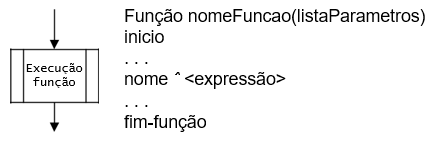

Figura 1.15: Fluxograma e sintaxe - Função

Considere-se no seguinte exemplo a definição e utilização da função potencia<sup>1</sup> na construção de um programa modular.

> **Função** potencia(base,expoente)
>
> **início**

- *A variável resultado é local*; resultado *ˆ* 1;

- *Calcular a potência através de multiplicações sucessivas*; **para**
  > *i ˆ 1; i • expoente; i ˆ i+1* **fazer**

> resultado *ˆ* resultado\*base;
>
> **fim-para**

- *O valor calculado é retornado através do nome da função*; potencia
  > *ˆ* resultado;

> **fim-função**
>
> A potencia é utilizada no programa seguinte:
>
> **início**

- *Ler base e expoente*; escrever "Introduza base="; ler base;

> escrever "Introduza expoente="; ler expoente;

- *Apresentar resultado*;

> escrever base," ˆ ",expoente,"=",potencia(base,expoente);
>
> **fim**

Executando o programa por exemplo para os valor 3 e 2, seria visualizado num monitor o seguinte texto:

> Introduza base=3
>
> Introduza expoente=2
>
> 3^2=8

> <sup>1</sup>Por uma questão de simplicidade são considerados apenas expoentes inteiros e positivos no cál-culo da potência.

**1.6.1.2** **Procedimentos**

A sintaxe e o fluxograma propostos para a definição de um procedimento são apre-sentados na figura 1.16:

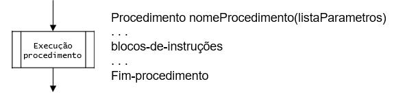

Figura 1.16: Fluxograma e sintaxe - Procedimento

Considere-se no seguinte exemplo a definição e utilização do procedimento prtNumeroInvertido que permite imprimir um número inteiro invertido.

> **Comentário: Explicar a razão de subtrair algarismo!!**
>
> **Procedimento** prtNumeroInvertido(numero)
>
> **início**
>
> **enquanto** *numero\>0* **fazer**

- *O algarismo mais à direita do número é calculado através*;

- *da divisão inteira do número por 10*;

> algarismo *ˆ* numero % 10;
>
> escrever algarismo;

- *Truncar o algarismo à direita*; numero *ˆ* (numero-algarismo)/10;

> **fim-enquanto**
>
> **fim-procedimento**

**1.6.2** **Exercícios resolvidos**

Nesta secção são apresentados alguns problemas e respectivas soluções com o objec-tivo de ilustrar a utilização de procedimentos e funções na produção de programas modulares.

**1.6.2.1** **Função que devolve o maior algarismo de um número**

Considere uma função que receba um número inteiro e devolva o maior algarismo contido nesse número.

> **Função** maior(N)
>
> **início**

- *max vai conter o maior algarismo*;

- *alg vai conter os algarismos do número, partindo das*;

- *unidades para as dezenas, centenas, etc*;

> max *ˆ* N%10;
>
> **enquanto** *N6*=*0* **fazer**
>
> alg *ˆ* N%10;

- *ˆ* (N - alg)/10; **se** *alg\>max* **então** max *ˆ* alg;

> **fim-se**
>
> **fim-enquanto**
>
> maior *ˆ* max;
>
> **fim-função**
>
> **Função** maior(*n*) que devolve o maior algarismo de um número

**1.6.2.2** **Função que indica se um número é perfeito**

Um número n é perfeito se a soma dos divisores inteiros de n (excepto o próprio

14) é igual ao valor de n. Por exemplo, o número 28 tem os seguintes divisores: 1, 2, 4, 7, 14, cuja soma é exactamente 28. (Os seguintes números são perfeitos: 6, 28, 496, 8128.). Consider a função que recebe um número inteiro e devolve os valores booleanos verdadeiro ou falso se o número é ou não perfeito, respectivamente.

> **Função** perfeito(N)
>
> **início**
>
> soma *ˆ* 0;
>
> **para** *x ˆ 1; x•(N/2); x ˆ x+1* **fazer**
>
> **se** *(N%x)=0* **então**
>
> soma *ˆ* soma+x;
>
> **fim-se**
>
> **fim-para**
>
> **se** *soma=N* **então**
>
> perfeito *ˆ* verdadeiro;
>
> **senão**
>
> perfeito *ˆ* falso;
>
> **fim-se**
>
> **fim-função**
>
> **Função** perfeito(*N*) que indica se um número é perfeito

**1.6.3** **Exercícios propostos**

Nesta secção são propostos alguns problemas relacionados com a utilização de pro-cedimentos e funções na escritas de programas modulares.

**1.6.3.1** **Função média de dois números**

Escreva uma função que, dados dois números reais, retorna a média deles arredon-dada para um inteiro, e devolve os números por ordem crescente. Faça um programa que permita testar a função anterior.

**1.6.3.2** **Função lei de Ohm**

A lei de Ohm é uma relação entre a corrente (I), a tensão (V) e a resistência (R), de acordo com o circuito eléctrico representado na
figura 1.17.

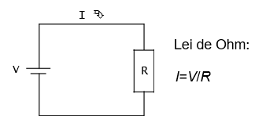

Figura 1.17: Ilustração da lei de Ohm

1)  Escreva uma função que recebe os valores de *V* e *R* como parâmetros, e calcule a corrente *I* .

2)  Escreva um programa que permita testar a função anterior.

**1.6.3.3** **Função somatório**

> **Sugestão:** crie uma função para determinar cada termo *i* da série.

**1.6.3.4** **Funções para codificar e descodificar números**

Uma empresa pretende enviar cifrada uma sequência de inteiros decimais de 4 dí-gitos (DigDigDigDig). A cifra consiste em: substituir cada dígito Dig por (Dig+8)%10 (*i.e.*, adiciona 8 e calcula o resto da divisão do resultado por 10); depois troca o terceiro dígito com o primeiro e troca o quarto dígito com o segundo.

1)  Escreva uma função que receba um inteiro decimal de 4 dígitos e o devolva cifrado.

2)  Escreva uma função que receba um inteiro cifrado e o decifre para o valor ori-ginal.

3)  Escreva uma função que apresente um «menu» com 2 opções, cifrar e decifrar número, peça ao utilizador para escolher uma das opções, e retorne a opção escolhida.

4)  Faça um programa que permita testar as funções anteriores.

**1.6.3.5** **Números primos**

Escreva um procedimento que imprima os números primos existentes entre dois nú-meros. Na resolução deste problema deve ser utilizada uma função que determina se um número é primo.

**1.7** **Recursividade**

Recursividade é uma característica comum a todas definições que
necessitam de re-correr a si próprias para se definirem. A recursividade
é largamente utilizada na ma-temática e nas ciências de computação. No contexto da computação a recursividade

- muito utilizada na resolução de uma gama variada de problemas e muito particu-larmente na manipulação de estruturas de dados recursivas (*e.g.*, e listas, árvores e grafos).

Considerem-se o exemplo da função factorial definido através da formula 1.7.1. Normalmente uma definição recursiva compreende casos particulares e casos gerais, neste caso, *n* = 1 é o caso particular e *n \>* 1 o caso geral. Note-se que no caso geral, a definição da função factorial é conseguida através da própria função factorial.

<table style="width:100%;">
  <colgroup>
  <col style="width: 27%" />
  <col style="width: 10%" />
  <col style="width: 6%" />
  <col style="width: 39%" />
  <col style="width: 16%" />
  <col style="width: 0%" />
  </colgroup>

  <thead>
    <tr class="header">
      <th rowspan="2">factorial(<em>n</em>) = <sup>‰</sup></th>
      <th><blockquote>
      <p><em>n</em> = 0</p>
      </blockquote></th>
      <th rowspan="2"><em>!<sup>!</sup></em></th>
      <th><blockquote>
      <p>1</p>
      </blockquote></th>
      <th rowspan="2">(1.7.1)</th>
      <th></th>
    </tr>
    <tr class="odd">
      <th><blockquote>
      <p><em>n &gt;</em> 1</p>
      </blockquote></th>
      <th><blockquote>
      <p>factorial(<em>n ¡</em> 1) <em>⁄ n</em></p>
      </blockquote></th>
      <th></th>
    </tr>
  </thead>

  <tbody>
  </tbody>
</table>

No dia-a-dia também se encontram inúmeras definições recursivas, por exemplo, o caso dos ascendentes familiares.

- **Caso particular** – os ascendentes de determinada pessoa são os seus pais;
- **Caso geral** – os ascendentes de uma pessoa são os ascendentes dos seus ascen-dentes;

**1.7.1** **Exercícios Resolvidos**

Nesta secção são apresentados alguns problemas e respectivas soluções com o objec-tivo de ilustrar a utilização de algoritmos recursivos.

**1.7.2** **Exercícios Propostos**

Nesta secção são propostos alguns problemas com vista a ilustrar a utilização de al-goritmos recursivos.

**Capítulo 2**

**Estruturas de dados**

**2.1** **Vectores**

No contexto da programação de computadores, um vector, é uma das estruturas de dados mais simples. Um vector é conjunto de dados consecutivos, usualmente do mesmo tamanho e tipo. Cada um dos elementos do vector é acedido através do índice (número inteiro) que define a posição na qual o elemento está guardado.

Considere que se pretende desenvolver um programa que dadas as notas de 4000 alunos, calcule o desvio de cada uma relativamente à média das notas. Para o cálculo dos desvios é necessário o cálculo prévio da média, o que implica manter as notas após o cálculo da média, ou seja, guardar as notas em variáveis. O problema pode ser decomposto em sub-problemas, como se segue:

- Calcular a média;
- Guardar as notas (para cálculos posteriores);
- Calcular o desvio de cada nota.

Uma solução para guardar cada uma das notas (desaconselhável!!), seria definir 4000 variáveis, por exemplo: nota1, nota2, nota3, nota4, nota5, nota6, . . . , nota4000

Assim, as instruções para a leitura das notas seriam repetir 4000 vezes algo de semelhante a:


> **início**
>
> **enquanto** *numero\>0* **fazer**
>
> escrever "Introduza a média do aluno número 1:"; ler nota1;
>
> escrever "Introduza a média do aluno número 2:";
>
> ler nota2;
>
> . . .
>
> escrever "Introduza a média do aluno número 4000:"; ler nota4000;
>
> **fim-enquanto**
>
> **fim**
>
> o que naturalmente se revela completamente impraticável.

A generalidade das linguagens de programação fornece este tipo de dados, cha-mado vector (ou *array*) que permite ultrapassar esta limitação. A solução consiste em definir um vector cujo tamanho corresponde ao número de elementos desejados e uma variável inteira para aceder a cada índice do referido vector.

Deste modo, para a leitura das 4000 notas poder-se-ia utilizar um ciclo, como a seguir se ilustra:

> **início**
>
> **para** *num ˆ 1; num\<4000; num ˆ num+1* **fazer** escrever
> "Introduza a nota do aluno número",num; ler nota(num);
>
> **fim-para**
>
> **fim**

Um **vector** pode então ser definido como um conjunto de tamanho fixo de ele-mentos do mesmo tipo ocupando posições contíguas.

Antes de se utilizar um vector é necessário proceder à sua declaração, cuja sintaxe proposta é :

> DIM nomeVector (início ATE fim)
>
> No qual:

- *nomeVector* - é o nome do vector (escolhido pelo programador);
- *inicio* - é o valor início do índice;
- fim – é o valor máximo do índice;

O número de posições do vector obedece à formula 2.1.1, não sendo obrigatório preencher todas as posições com valores.

| tamanho = fim *¡* inicio + 1 | (2.1.1) |
|------------------------------|---------|

> Por exemplo, a instruções seguinte:
>
> DIM notas(1 até 20)

*Capítulo 2. Estruturas de dados*

permite definir um vector unidimensional chamado notas com 20 posições nume-radas de 1 a 20. Na figura 2.1 é apresentada uma representação gráfica possível deste vector.

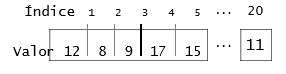

Figura 2.1: Vetor unidimensional: notas

> A sintaxe utilizada no acesso a cada posição do vector é a seguinte
> forma:
>
> nome-do-vector[índice]
>
> Como por exemplo:
>
> **início**

- *Declaração do vector*; DIM notas(1 até 20);

- *Atribuir o valor 5 à posição 3 do vector*; notas\[3\] *ˆ* 5;

- *Escrever no écran o valor da posição 1 do vector* ; escrever
  > notas\[1\];

> **fim**

Um vector pode ter as dimensões que se pretenderem<sup>1</sup>, fazendo-se a sua separação por vírgulas.

Considere-se ainda um outro exemplo, um vector bidimensional que permite re-presentar uma imagem, as duas dimensões da matriz definem o tamanho da imagem (largura e altura) e o valor guardado em cada posição, a cor do pixel.

> Na figura 2.2 é apresentada uma representação gráfica possível para esta matriz.

<table>
  <colgroup>
    <col style="width: 15%" />
    <col style="width: 17%" />
    <col style="width: 17%" />
    <col style="width: 15%" />
    <col style="width: 17%" />
    <col style="width: 15%" />
  </colgroup>
  <thead>
    <tr class="header">
    <th></th>
    <th>1</th>
    <th>2</th>
    <th>3 </th>
    <th>... </th>
    <th><blockquote>
    <p>800</p>
    </blockquote></th>
    </tr>
  </thead>
  <tbody>
    <tr class="odd">
      <td>1</td>
      <td>4</td>
      <td>56</td>
      <td>11</td>
      <td>...</td>
      <td><blockquote>
      <p>6</p>
      </blockquote></td>
    </tr>
    <tr class="even">
      <td>2</td>
      <td>12</td>
      <td>8</td>
      <td>1</td>
      <td>...</td>
      <td><blockquote>
      <p>5</p>
      </blockquote></td>
    </tr>
    <tr class="odd">
      <td>...</td>
      <td>...</td>
      <td>...</td>
      <td>...</td>
      <td>...</td>
      <td><blockquote>
      <p>...</p>
      </blockquote></td>
    </tr>
    <tr class="even">
      <td>640</td>
      <td>5</td>
      <td>83</td>
      <td>9</td>
      <td>...</td>
      <td><blockquote>
      <p>4</p>
      </blockquote></td>
    </tr>
  </tbody>
</table>

Figura 2.2: Vector bidimensional (matriz): imagem

> <sup>1</sup>Um vector também é designado matriz quando apresenta mais do que uma dimensão.

No seguinte exemplo é procedesse à declaração e consequente utilização deste vector bidimensional :

> **início**
>
> *\# Declaração da matriz*;
>
> DIM imagem(1 até 800, 1 até 640);

- *Atribuir o valor 5 à posição definida pela coluna 2 e linha 3 da matriz*; imagem\[2\]\[3\] *ˆ* 5;

- *Escrever no écran o valor da posição definida pela coluna 1 e linha 4 da matriz*; escrever notas\[1\]\[4\];

> **fim**

Para além da utilização descrita nesta secção, os vectores são muito utilizados de forma combinada com outras estruturas de dados (*e.g.*, registos) por forma a definir estruturas mais complexas como por exemplo: filas, pilhas e árvores.

Existem alguns aspectos a que é necessário prestar atenção quando se
manipula vectores em programação, nomeadamente:

- Os vectores têm dimensão fixa. O número de elementos é indicado na declara-ção e não pode ser alterado durante a execução do programa.

- Os vectores não se podem manipular como um todo, mas sim elemento a elemento. Isto significa que não se podem somar dois vectores directamente, mas sim os elementos de cada vector individualizados.

- Muitas linguagens de programação não avisam (isto é não dá erro) se o limite da dimensão de um vector for excedido. Neste caso os resultados da execução do programa podem ser imprevisíveis.

**2.1.1** **Exercícios resolvidos**

**2.1.1.1** **Funções manipulando vectores**

Faça um algoritmo que permita:

1)  Uma função que faça a leitura de 10 valores (inteiros), guardando-os num vector;

2)  Uma função que retorne a diferença entre o maior e o menor valor do vector;

3)  Uma função que devolva o número de valores pares e ímpares do vector;

No procedimento leituraVector apresentada de seguida é realizada a leitura do vector. Note-se que tanto o próprio vector como a respectiva dimensão são passados para o procedimento como argumentos.

> **Procedimento** leituraVector(vector,dim)
>
> **início**
>
> **para** *i ˆ 1; i• dim; i ˆ i+1* **fazer**
>
> escrever "Introduza o elemento", i;
>
> ler vector\[i\];
>
> **fim-para**
>
> **fim-procedimento**

A função contarPares apresentada de seguida contabiliza a quantidade de nú-meros existentes no vector. A função recebe próprio vector e a respectiva dimensão como parâmetros e retorna a quantidade de pares.

> **Função** contarPares(vector,dim)
>
> **início**
>
> soma *ˆ* 0;
>
> **para** *i ˆ 1; i• dim; i ˆ i+1* **fazer**
>
> **se** *vector\[i\] % 2* **então**
>
> soma *ˆ* soma+1;
>
> **fim-se**
>
> **fim-para**

- *Retornar resultado*; contarPares *ˆ* soma;

> **fim-função**

A função maiorDiferenca apresentada de seguida, recebe o próprio vector e a respectiva dimensão como parâmetros e retorna a diferença entre os valores máximo e mínimo existentes no vector.

> **Função** maiorDiferenca(vector,dim)
>
> **início**

- *Os valores máximo e mínimo são iniciados com o primeiro elemento do vector*; máximo *ˆ* vector\[1\];

> mínimo *ˆ* vector\[1\];
>
> **para** *i ˆ 1; i• dim; i ˆ i+1* **fazer se** *vector\[i\] \> máximo*
> **então** máximo *ˆ* vector\[i\];
>
> **senão**
>
> **se** *vector\[i\] \< mínimo* **então** mínimo *ˆ* vector\[i\];
>
> **fim-se**
>
> **fim-se fim-para**

- *Retornar resultado*;

> maiorDiferenca *ˆ* máximo-mínimo;
>
> **fim-função**

No seguinte extracto (algoritmo 2.1) é definido o vector e evocadas as funções e procedimento anteriormente definidos.

> **início**
>
> DIM vector (1 até 10);
>
> *\# Evocar o procedimento de leitura do vector*;
>
> lerVector(vector,10); *\# Calcular a diferença entre máximo e mínimo e
> apresentar resultado*;
>
> escrever "Diferença máxima=", maiorDiferenca(vector,10);
>
> *\# Contar os números pares e ímpares*;
>
> nPares *ˆ* maiorDiferenca(vector,10) escrever "Números pares=",
> nPares; escrever "Números ímpares=", 10-nPares;
>
> **fim**
>
> **Algoritmo 2.1**: Manipulação de Vectores (leitura, diferença entre
> máximo e mí-nimo e número de pares e ímpares)

**2.1.2** **Exercícios propostos**

**2.1.2.1** **Determinar desvio padrão de uma série**

Escreva um programa modular que permita determinar o desvio padrão de um sé-rie de números de acordo com a formula 2.1.2. Considere a definição de funções e procedimento para os diversos sub-problemas.

**2.1.2.2** **Prova de atletismo**

Faça a leitura das pontuações que 5 juízes de uma determinada prova atribuíram a um atleta (valores compreendidos entre 0 e 9 inclusive).
Determine e apresente com formato adequado, os seguintes valores:

- média obtida pelo atleta;

- a pior e a melhor pontuação;

- a percentagem de pontuações iguais ou superiores a 8 valores;

- supondo que a 1ª nota foi atribuída pelo juiz nº1 e assim
  > sucessivamente deter-mine os números dos juízes que atribuíram a
  > melhor nota do atleta.

**2.2** **Ordenação e pesquisa de vectores**

A ordenação de vectores e a pesquisa de um dado elemento num vector, são opera-ções muito comuns em programação. Existem inúmeros métodos para ordenar vec-tores e para pesquisar valores em vectores. Serão apresentados nesta secção apenas um exemplo de cada um. Também por uma questão de simplificação serão apenas utilizados vectores de números. No entanto estes métodos poder-se-iam adaptar fa-cilmente a vectores de outro tipo de dados.

**2.2.1** **Ordenação por selecção**

O algoritmo do método de ordenação por selecção consiste em seleccionar repetida-mente o menor elemento dos que ainda não foram tratados (daí o nome do método). Pretendendo-se uma ordenação por ordem crescente, primeiro selecciona-se o menor elemento do vector e faz-se a sua troca com o elemento na primeira posição do vector, em seguida selecciona-se o segundo menor elemento e faz-se a sua troca com o ele-mento na segunda posição do vector, repetindo-se o processo até que todo o vector fique ordenado.

De seguida é apresentado o algoritmo que implementa este método onde vector é o vector a ordenar e dim o número de elementos do vector. Este método é bastante eficiente para vectores de pequena e média dimensão.

> **Procedimento** ordenarVector(vector,dim)
>
> **início**
>
> **para** *i ˆ 1; i • dim-1; i ˆ i+1* **fazer**
>
> **para** *j ˆ i+1; j• dim; j ˆ j+1* **fazer**
>
> **se** *vector\[j\] \< vector\[i\]* **então**

- *Fazer a troca dos dois elementos utilizando uma variável auxiliar*;
  > temp *ˆ* vector\[j\];

> vector\[j\] *ˆ* vector\[i\]; vector\[i\] *ˆ* temp;
>
> **fim-se**
>
> **fim-para**
>
> **fim-para**
>
> **fim-procedimento**

No procedimento ordenarVector é necessário fazer a troca de valores entre duas variáveis. Este conceito é muito utilizado em programação e como tal merece uma análise atenta.

> **Comentário: Falta fazer desenhos!!!**

Considere-se o problema o problema de trocar os conteúdos de duas garrafas cheias contendo líquidos (*e.g.*, água e sumo de laranja). Para proceder à trocas dos conteúdos é necessário considerar uma terceira garrafa vazia que servira como auxi-liar do processo, pois não é possível proceder à trocar directa.

O problema de trocar os conteúdos de duas variáveis é similar e como tal o ex-tracto de código seguinte está errado, pois no final ambas as variáveis A e B conterão o mesmo valor, 5.

> **início**
>
> A*ˆ*10;
>
> B*ˆ*5;

- *Fazer a troca dos conteúdos - ERRADO!!!*;

> A*ˆ*B; B*ˆ*A;
>
> **fim**

No extracto seguinte é adoptado o procedimento adequado, conforme descrito anteriormente, a utilização de uma variável auxiliar. No final, as variáveis A e B conterão os valores 5 e 10, respectivamente.

> **início**
>
> A*ˆ*10;
>
> B*ˆ*5;

- *Fazer a troca dos conteúdos - CORRECTO!!!*; temp *ˆ* A;

> A*ˆ*B;
>
> B *ˆ* temp;
>
> **fim**

**2.2.2** **Pesquisa Sequencial**

A pesquisa sequencial é o método mais simples de implementar na procura de um elemento num vector. Este método consiste em pesquisar sequencial e exaustiva-mente um vector na procura de um dado valor. A pesquisa termina quando for en-contrado o valor a procurar ou quando tenha chegado ao fim do vector. Este método funciona em vectores ordenados e/ou desordenados.

No exemplo seguinte é considerado um vector notas com 100 elementos em que se pretende procurar um valor usando o método de pesquisa sequencial descrita.

> **início**
>
> DIM notas (1 até 100);
>
> escrever "Introduza o valor a pesquisar="; ler valor;
>
> *\# Evocar a função de pesquisa*;
>
> posicao *ˆ* pequisarValor(notas, 100, valor); **se** *posicao= -1*
> **então**
>
> escrever "O valor desejado não existe no vector";
>
> **fim-se**
>
> escrever "O valor desejado existe na posição=",posicao;
>
> **fim**
>
> **Algoritmo 2.2**: Utilizar a pesquisa sequencial)
>
> A pesquisa propriamente dita é realizada pela seguinte função:
>
> **Função** pequisarValor(vector,dim,valor)
>
> **início**
>
> encontrou *ˆ* falso;
>
> i *ˆ* 0;

- *Percorrer o vector até encontrar o elemento ou chegar ao fim do vector*; **enquanto** *encontrou=falso **e** i•dim* **fazer**

> **se** *valor = vector\[i\]* **então**
>
> encontrou *ˆ* verdade;
>
> **senão**
>
> i *ˆ* i+1;
>
> **fim-se**
>
> **fim-enquanto**
>
> **se** *encontrou = verdade* **então**

- *Caso encontre o valor retorna a posição*; pequisarValor *ˆ* i;

> **senão**

- *Caso não encontre o valor retorna -1*; pequisarValor *ˆ* -1;

> **fim-se**
>
> **fim-função**

**2.2.3** **Exercicios resolvidos**

**2.2.3.1** **Inverter um vector**

Considere o problema de inverter um vector para o qual é apresentada de seguida uma solução possível. Esta solução troca o primeiro elemento com o último, o se-gundo com o penúltimo, o terceiro com o antepenúltimo e assim sucessivamente até inverter a totalidade do vector. Note-se que o iterador do vector vai variar desde a primeira posição até metade da dimensão.

> **Procedimento** invertervector(vector,dim)
>
> **início**
>
> **para** *i ˆ 1; i • dim/2; i ˆ i+1* **fazer**

- *Fazer a troca dos dois elementos*; temp *ˆ* vector\[i\];

> vector\[i\] *ˆ* vector\[dim-i+1\]; vector\[dim-i+1\] *ˆ* temp;
>
> **fim-para**
>
> **fim-procedimento**

**2.2.4** **Exercícios propostos**

**2.2.4.1** **Junção ordenada de vectores**

Suponha que as notas dos alunos de duas turmas são lidas para dois vectores, um para cada turma. Considere que as notas foram inseridas em ambos os vectores or-denadamente, da menor para a maior.

Escreva um programa que faça a junção ordenada dos dois vectores de notas num terceiro vector.

**2.2.4.2** **Método de ordenação por troca directa**

Neste método compara-se cada posição do vector com todas as outras sucessiva-mente e troca sempre que encontrar um valor menor numa posição à frente. Escreva um algoritmo que implemente este método.

**2.2.4.3** **Filtro gráfico**

Uma unidade industrial na área da metalomecânica utiliza sistemas de vídeo para o reconhecimento automático de componentes que passam num tapete rolante. Após a captura de cada imagem, esta tem que ser tratada com filtros de *software* que permi-tem eliminar erros menores e suavizar a imagem.

Construa um programa que implementa um filtro que substitui cada *pixel* pela média dos valores das oito células que o rodeiam.

Na imagem 2.3 está representada a imagem conforme foi capturada em que cada célula representa o tom de cinzento de um *pixel*.

> Exemplo de cálculo das células:
>
> célula *B*2 = *A*1 + *A*2 + *A*3 + *B*1 + *B*3 + *C*1 + *C*2 + *C*3 =
> 108
>
> célula *C*2 = *B*1 + *B*2 + *B*3 + *C*1 + *C*3 + *D*1 + *D*2 + *D*3 =
> 114

Note-se que as células dos limites da imagem (assinalados a cinzento) não podem ser calculados pois não têm o número suficiente de vizinhos.

<table>
<colgroup>
<col style="width: 4%" />
<col style="width: 16%" />
<col style="width: 15%" />
<col style="width: 15%" />
<col style="width: 15%" />
<col style="width: 16%" />
<col style="width: 16%" />
<col style="width: 0%" />
</colgroup>
<thead>
<tr class="header">
<th></th>
<th><blockquote>
<p><strong>A</strong></p>
</blockquote></th>
<th><blockquote>
<p><strong>B</strong></p>
</blockquote></th>
<th><blockquote>
<p><strong>C</strong></p>
</blockquote></th>
<th><blockquote>
<p><strong>D</strong></p>
</blockquote></th>
<th><blockquote>
<p><strong>E</strong></p>
</blockquote></th>
<th><blockquote>
<p><strong>F</strong></p>
</blockquote></th>
<th></th>
</tr>
</thead>
<tbody>
<tr class="odd">
<td rowspan="2"><strong>1</strong></td>
<td></td>
<td></td>
<td></td>
<td></td>
<td></td>
<td></td>
<td></td>
</tr>
<tr class="even">
<td>29</td>
<td>28</td>
<td>70</td>
<td>47</td>
<td>65</td>
<td><blockquote>
<p>...</p>
</blockquote></td>
<td></td>
</tr>
<tr class="odd">
<td><strong>2</strong></td>
<td>214</td>
<td>84</td>
<td>18</td>
<td>175</td>
<td>118</td>
<td><blockquote>
<p>...</p>
</blockquote></td>
<td></td>
</tr>
<tr class="even">
<td><strong>3</strong></td>
<td>214</td>
<td>150</td>
<td>141</td>
<td>198</td>
<td>158</td>
<td><blockquote>
<p>...</p>
</blockquote></td>
<td></td>
</tr>
<tr class="odd">
<td><strong>4</strong></td>
<td>129</td>
<td>130</td>
<td>31</td>
<td>51</td>
<td>36</td>
<td><blockquote>
<p>...</p>
</blockquote></td>
<td></td>
</tr>
<tr class="even">
<td><strong>5</strong></td>
<td>...</td>
<td>...</td>
<td>...</td>
<td>...</td>
<td>...</td>
<td><blockquote>
<p>...</p>
</blockquote></td>
<td></td>
</tr>
<tr class="odd">
<td></td>
<td></td>
<td></td>
<td></td>
<td></td>
<td></td>
<td></td>
<td></td>
</tr>
</tbody>
</table>

Figura 2.3: Imagem vídeo - original

Na imagem 2.4 são apresentados os valores da células **B2** e **C2**
após serem calcu-ladas enquanto que as restantes células ainda não foram
calculadas.

<table>
<colgroup>
<col style="width: 4%" />
<col style="width: 16%" />
<col style="width: 15%" />
<col style="width: 15%" />
<col style="width: 15%" />
<col style="width: 16%" />
<col style="width: 16%" />
<col style="width: 0%" />
</colgroup>
<thead>
<tr class="header">
<th></th>
<th><blockquote>
<p><strong>A</strong></p>
</blockquote></th>
<th><blockquote>
<p><strong>B</strong></p>
</blockquote></th>
<th><blockquote>
<p><strong>C</strong></p>
</blockquote></th>
<th><blockquote>
<p><strong>D</strong></p>
</blockquote></th>
<th><blockquote>
<p><strong>E</strong></p>
</blockquote></th>
<th><blockquote>
<p><strong>F</strong></p>
</blockquote></th>
<th></th>
</tr>
</thead>
<tbody>
<tr class="odd">
<td rowspan="2"><strong>1</strong></td>
<td></td>
<td></td>
<td></td>
<td></td>
<td></td>
<td></td>
<td></td>
</tr>
<tr class="even">
<td>29</td>
<td>28</td>
<td>70</td>
<td>47</td>
<td>65</td>
<td><blockquote>
<p>...</p>
</blockquote></td>
<td></td>
</tr>
<tr class="odd">
<td><strong>2</strong></td>
<td>214</td>
<td><strong>108</strong></td>
<td><strong>114</strong></td>
<td>175</td>
<td>118</td>
<td><blockquote>
<p>...</p>
</blockquote></td>
<td></td>
</tr>
<tr class="even">
<td><strong>3</strong></td>
<td>214</td>
<td>150</td>
<td>141</td>
<td>198</td>
<td>158</td>
<td><blockquote>
<p>...</p>
</blockquote></td>
<td></td>
</tr>
<tr class="odd">
<td><strong>4</strong></td>
<td>129</td>
<td>130</td>
<td>31</td>
<td>51</td>
<td>36</td>
<td><blockquote>
<p>...</p>
</blockquote></td>
<td></td>
</tr>
<tr class="even">
<td><strong>5</strong></td>
<td>...</td>
<td>...</td>
<td>...</td>
<td>...</td>
<td>...</td>
<td><blockquote>
<p>...</p>
</blockquote></td>
<td></td>
</tr>
<tr class="odd">
<td></td>
<td></td>
<td></td>
<td></td>
<td></td>
<td></td>
<td></td>
<td></td>
</tr>
</tbody>
</table>

Figura 2.4: Imagem vídeo - em tratamento

**Bibliografia**

> [CCT, 2001] CCT. *C Programming -Foundation Level, Training Manual &
> Exercises*. Chel-tenham Computer Training, Gloucester/UK, 2001.
>
> [Kernighan e Ritchie, 1988] Brian W. Kernighan e Dennis M. Ritchie.
> *The C Program-ming Language, Second Edition*. Prentice Hall, Inc.,
> 1988.
>
> [Mosich, 1988] D. Mosich. *Advanced Turbo C Programmer’s Guide*.
> John Wiley & Sons, 1988.
>
> [Sampaio e Sampaio, 1998] Isabel Sampaio e Alberto Sampaio.
> *Fundamental da Pro-gramação em C*. FCA- Editora Informática, 1998.
