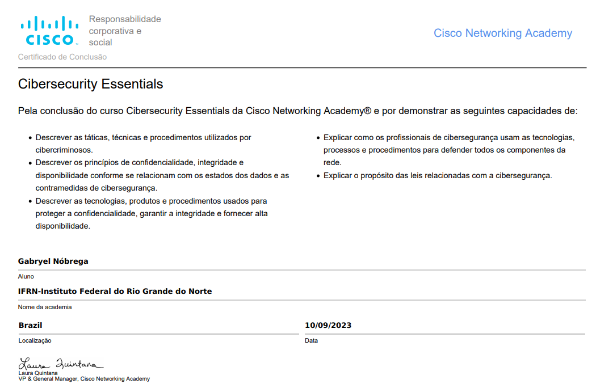

# [Course Homepage](https://lms.netacad.com/course/view.php?id=2049804)
> [Maratona CiberEducação Cisco Brasil - 7ª Onda - 2023](https://community.cisco.com/t5/programa-cibereduca%C3%A7%C3%A3o-cisco-do-brasil/maratona-cibereduca%C3%A7%C3%A3o-cisco-brasil-7%C2%AA-onda-2023/ba-p/4891262)

## [Index Completo](./full_index.md)
> Acredite em mim, é monstruoso

> [!INFO]
> Partes da linguagem utilizada no curso do mundo da cibersegurança e seus atores foram adaptados como resultado de uma parceria entre a Cisco Networking Academy e a Open University, Faculdade STEM - School of Computing and Communication. Os Contribuidores incluem Andrew Smith, Amel Bennaceur e Arosha Bandara.

## Progresso

| Capítulos                                                                        | Readed | [Grade](https://lms.netacad.com/grade/report/user/index.php?id=2049804) (/100) |
| -------------------------------------------------------------------------------- |:------:|:------------------------------------------------------------------------------:|
| [Capítulo 1](./cap1.md): Cibersegurança - Um Mundo de Especialistas e Criminosos |   ✔️   |                           [81.82](q1.md)                           |
| [Capítulo 2](./cap2.md): O Cubo de Segurança Cibersegurança                      |   ✔️   |                          [100.00](q2.md)                           |
| [Capítulo 3](./cap3.md): Ameaças, Vulnerabilidades e Ataques de Cibersegurança   |   ✔️   |                           [77.78](q3.md)                           |
| [Capítulo 4](./cap4.md): A Arte de Proteger os Segredos                          |   ✔️   |                           [95.00](q4.md)                           |
| [Capítulo 5](./cap5.md): A Arte de Garantir a Integridade                        |   ✔️   |                           [75.00](q5.md)                           |
| [Capítulo 6](./cap6.md): O Conceito de Cinco Noves                               |   ✔️   |                           [82.35](q6.md)                           |
| [Capítulo 7](./cap7.md): Proteção de um Domínio de Cibersegurança                |   ✔️   |                          [100.00](q7.md)                           |
| [Capítulo 8](./cap8.md): Tornar-se um Especialista em Cibersegurança             |   ✔️   |                           [89.47](q8.md)                           |
| **Média**                                                                        |        |                                   **87.68**                                    |

## [Final Exam](final.md)  `75.73%`

 

## Recursos do aluno

Use estes recursos no seu percurso:

-   Talent Bridge para conseguir um grande emprego
-   Redes sociais para se ligar e obter AJUDA dos seus colegas
-   Simulador de rede Packet Tracer 
-   Vouchers de Desconto para o exame de certificação Cisco

**Packet Tracer**

Pode utilizar o seu smartphone, tablet ou computador portátil ou de secretária para aceder ao curso. No entanto,  as atividades Packet

Tracer, bem como algumas outras atividades, questionários e exames  funcionam melhor num PC.

- [Recursos Packet Tracer](https://www.netacad.com/portal//resources/packet-tracer)
	O Packet Tracer simula o funcionamento interno de uma rede. Descarregue e instale a versão mais recente do Packet Tracer.
-  [Curso de Introdução ao Packet Tracer](https://www.netacad.com/courses/packet-tracer/introduction-packet-tracer)
	Se é novo no Packet Tracer, realize agora este curto curso on-line. É GRATUITO!

**Comunidades**

- [Facebook](http://www.facebook.com/cisconetworkingacademy)
- [Linkedin](https://www.linkedin.com/school/cisco-networking-academy1/)

**Arranjem um Emprego!**  

- [Consultoria de Carreira](https://www.netacad.com/careers/career-advice)
	Aceda ao recursos de carreira especificamente adaptados para ajudar os estudantes da NetACAD a serem bem-sucedidos no local de trabalho.
- [Talend Bridge](https://www.netacad.com/portal//careers/talent-bridge-program)
	Registe-se agora no Talent Bridge. Encontre ótimas oportunidades de trabalho na Cisco e em parceiros Cisco
- [Certificações e Vouchers](https://www.netacad.com/portal//content/cisco-certifications-exams-discount-vouchers)
	Economize dinheiro com os vouchers para exames de certificação Cisco!

[**Mais Cursos**](https://www.netacad.com/courses/all-courses)
Escolha um curso, pratique o que aprende e torne-se num profissional TI.

> **_Isenção de responsabilidade_**: Este curso inclui hiperligações externas a sites não-Cisco. O aparecimento de hiperlinks externos não constitui endosso da Cisco, nem a Cisco exerce qualquer controle editorial sobre a informação que pode encontrar nestes sites externos.

## Certificado

