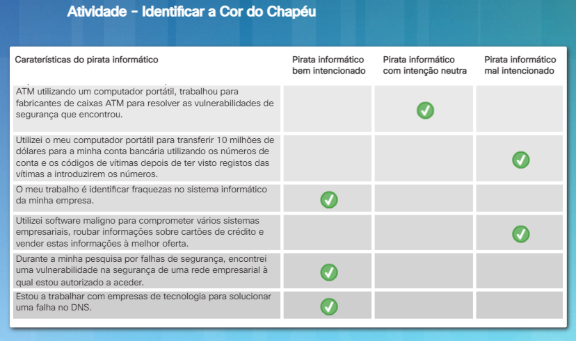
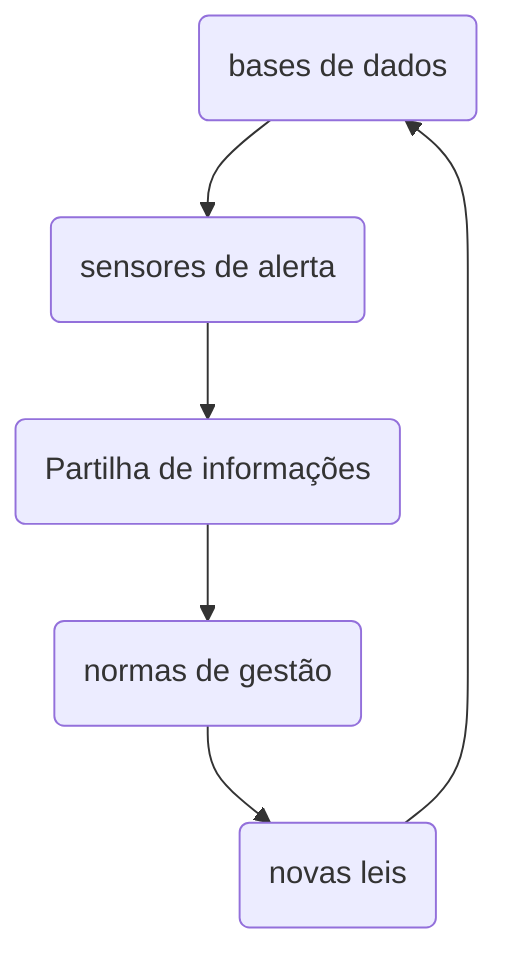
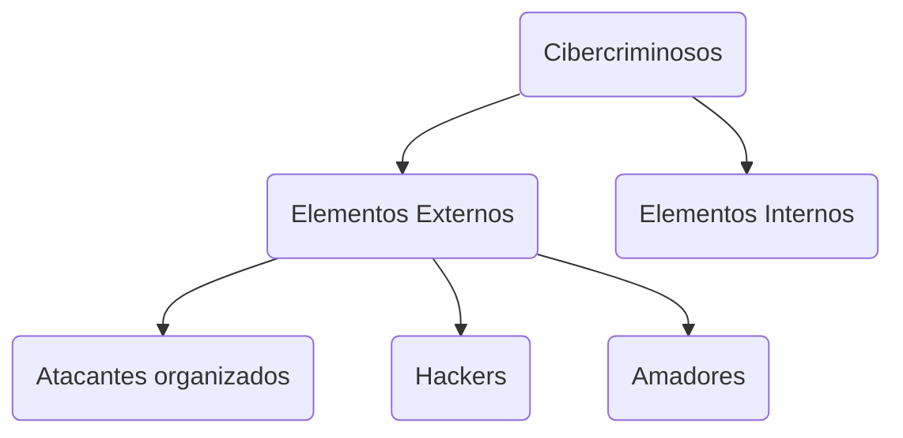
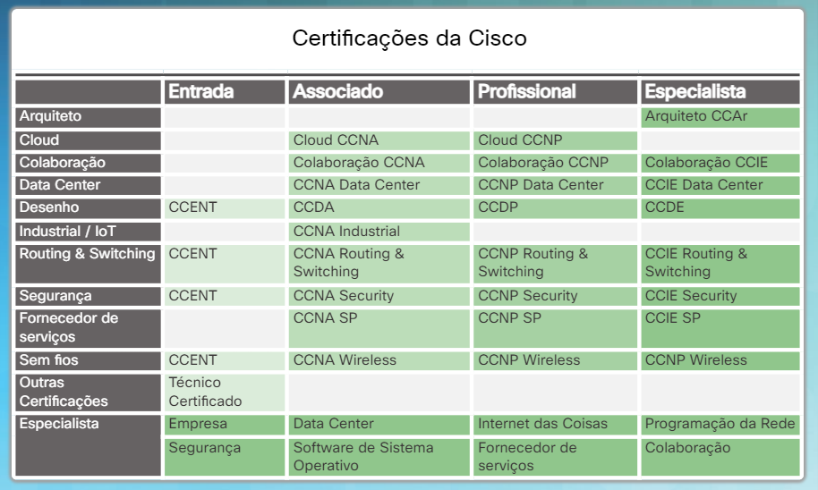

<datails>
Table of Contents 🔖

-

# Capítulo 1: Cibersegurança - Um Mundo de Especialistas e Criminosos

Muitos dos hackers originais, eram amadores, programadores e estudantes durante os anos 60. Originalmente, o termo **hacker** descrevia indivíduos com competências de programação avançadas. Os hackers usavam essas competências de programação para testar os limites e capacidades dos sistemas iniciais. Esses hackers também estiveram envolvidos no desenvolvimento dos primeiros jogos de computador. Muitos desses jogos incluíam feiticeiros e feitiçaria.

À medida que a cultura do hacking evoluiu, incorporou o léxico desses jogos na própria cultura. Mesmo o mundo exterior começou a associar a imagem de poderosos feiticeiros a esta cultura de hackers incompreendida. Livros como [*Where Wizards Stay up Late: The Origins of The Internet*]() publicado em 1996, adicionaram mística à cultura de hacking. A imagem e o léxico ficaram associados. Muitos grupos de hackers ainda hoje adotam essas imagens. Um dos grupos de hackers mais conhecidos foi o Legion of Doom. É importante compreender a cultura cibernética para entender os cibercriminosos e as suas motivações.

Sun Tzu foi um filósofo e guerreiro chinês do século VI AC. Sun Tzu escreveu o livro intitulado, _A Arte da Guerra_, que é um trabalho clássico sobre as estratégias para derrotar um inimigo. Este livro serviu de inspiração a muitos estrategas ao longo dos tempos. Um dos princípios orientadores de Sun Tzu era conhecer o adversário. Enquanto Sun Tzu se referia especificamente à guerra, grande parte dos seus conselhos podem aplicar-se a outros aspectos da vida, incluindo os desafios da cibersegurança. Este capítulo começa por explicar a estrutura do mundo da cibersegurança e a razão pela qual este continua a crescer.

Este capítulo discute o papel dos cibercriminosos e as suas motivações. Finalmente, o capítulo explica como se tornar num especialista em cibersegurança. Estes especialistas em cibersegurança ajudam a derrotar os cibercriminosos que ameaçam o cibermundo.

#### Visão geral dos domínios de cibersegurança

Existem muitos grupos que compõem os diferentes domínios do “cibermundo”. Quando os grupos são capazes de recolher e utilizar enormes quantidades de dados, eles acumulam poder e influência. Estes dados podem ser na forma de números, imagens, vídeo, áudio ou qualquer tipo de dados que possam ser digitalizados. Estes grupos podem ficar tão poderosos que operam como se fossem poderes separados, criando domínios de cibersegurança separados.

Empresas como a Google, Facebook e LinkedIn podem ser consideradas domínios de dados no nosso cibermundo. Estendendo ainda mais a analogia, as pessoas que trabalham nestas empresas podem ser consideradas especialistas em cibersegurança.

A palavra '**domínio**' tem muitos significados. Onde quer que haja controlo, autoridade ou proteção, pode-se considerar essa “área” como um domínio. Imagine como um animal selvagem protegeria o seu próprio território (domínio). Neste curso, **considere um domínio como uma área a ser protegida**. Pode ser limitado por um limite lógico ou físico. Isso irá depender do tamanho do sistema em causa. Os especialistas em cibersegurança precisam de proteger os seus domínios de acordo com as leis em vigor.

#### Exemplos de Domínios de Cibersegurança

Os especialistas da Google criaram um dos primeiros e mais poderosos domínios dentro da Internet. Biliões de pessoas usam, todos os dias, o motor de pesquisa da Google para efetuar pesquisas na Internet. A Google criou, provavelmente, a maior infraestrutura de recolha de dados do mundo. A Google desenvolveu o Android, o sistema operativo instalado em mais de 80% de todos os dispositivos móveis conectados à Internet. Cada dispositivo exige que os utilizadores criem contas da Google que podem gravar preferências e informações da conta, armazenar resultados de pesquisa e até localizar o dispositivo.
> Clique [aqui](https://www.google.com/intl/en/about/products/) para ver alguns dos muitos serviços que a Google oferece atualmente.

A Facebook criou outro domínio poderoso dentro da Internet. Especialistas da Facebook reconhecem que as pessoas criam contas pessoais todos os dias para comunicarem com a família e amigos. Ao fazê-lo, os utilizadores fornecem voluntariamente uma grande quantidade de dados pessoais. Os especialistas da Facebook criaram um domínio de dados massivo para permitir que as pessoas se conetem de diferentes formas, inimagináveis no passado. A Facebook afeta milhões de vidas diariamente e capacita empresas e organizações a comunicarem com as pessoas de uma maneira mais pessoal e focada.

O LinkedIn é mais um domínio de dados na Internet. Os especialistas do LinkedIn reconhecem que os seus utilizadores estão dispostos a partilhar informação quando constroem a sua rede de contactos profissionais. Os utilizadores do LinkedIn submetem essas informações para criar perfis online e conetarem-se com outros utilizadores. O LinkedIn conecta funcionários com empregadores e empresas a outras empresas em todo o mundo. Existem muitas semelhanças entre as plataformas LinkedIn e Facebook.

Um olhar para dentro destes domínios revela como eles são construídos. Fundamentalmente, estes domínios são poderosos devido à **capacidade de recolher dados do utilizador**, submetidos pelos próprios utilizadores. Estes dados geralmente incluem contexto, discussões, relações, locais, viagens, interesses, amigos e familiares, profissões, ocupações, horários de trabalho e pessoais. Especialistas criam um valor acrescentado sobre estes dados, para que as organizações possam melhor entender e comunicar com clientes e funcionários.

#### O Crescimento dos Domínios Cibernéticos

Os dados recolhidos na Internet são consideravelmente mais do que apenas os dados que os utilizadores contribuem voluntariamente. Os domínios cibernéticos continuam a crescer à medida que a ciência e a tecnologia evoluem, permitindo que os especialistas e os seus empregadores (Google, Facebook, LinkedIn, etc.) recolham dados de muitas outras formas. Especialistas cibernéticos agora têm a tecnologia para acompanhar previsões meteorológicas globais, monitorizar os oceanos, bem como o movimento e comportamento de pessoas, animais e objetos em tempo real.

Novas tecnologias, como os Sistemas de Informação Geográfica (SIG) e a Internet das Coisas (IoT), surgiram. Estas novas tecnologias podem rastrear a saúde das árvores numa zona geográfica. Elas podem fornecer a localização atualizada de veículos, dispositivos, indivíduos e materiais. Este tipo de informação pode contribuir para a poupar energia, melhorar a eficiência e reduzir os riscos de segurança. Cada uma destas tecnologias contribui para a expansão exponencial de **dados recolhidos, analisados** e usados para entender o mundo. Os dados recolhidos por sistemas SIG e IoT representam um tremendo desafio para os profissionais de cibersegurança no futuro. O tipo de dados gerados por dispositivos nestas tecnologias tem o potencial de permitir que os cibercriminosos tenham acesso a aspectos muito íntimos da vida quotidiana.

#### Quem são os cibercriminosos?

Nos primórdios da cibersegurança, os cibercriminosos eram tipicamente adolescentes ou amadores que operavam a partir de um PC doméstico, com ataques limitados principalmente a brincadeiras e vandalismo. Hoje, o mundo dos cibercriminosos tornou-se mais perigoso. Os atacantes são indivíduos ou grupos que tentam explorar vulnerabilidades para obter ganhos pessoais ou financeiros. Os cibercriminosos estão interessados em tudo, desde cartões de crédito a informações sobre novos produtos, ou qualquer coisa onde possam obter valor.

**Amadores**

**Amadores**, ou *script kiddies*, têm pouca ou nenhumas competências, geralmente usando ferramentas existentes ou instruções encontradas na Internet para lançar ataques. Alguns são apenas curiosos, enquanto outros tentam demonstrar suas habilidades e causar danos. Podem utilizar ferramentas básicas, mas os resultados podem, contudo, ser devastadores.

**Hackers**

Este grupo de criminosos invade sistemas ou redes informáticas para obter acesso por várias razões. A intenção do ataque determina a classificação dos atacantes como hackers de **chapéu branco**, **cinzento** ou **preto**.  
Os hackers de chapéu branco invadem sistemas ou redes informáticas para descobrir pontos fracos e melhorar a segurança desses sistemas. Os proprietários do sistema dão permissão para executar o ataque e recebem os resultados do teste.  
Por outro lado, os hackers de chapéu preto tiram partido de qualquer vulnerabilidade para proveito pessoal, financeiro ou político, ilegal.  
Os hackers de chapéu cinzento encontram-se entre os bem intencionados e os mal intencionados. Os hackers de chapéu cinzento podem encontrar uma vulnerabilidade e relatá-la aos proprietários do sistema se essa ação coincidir com sua agenda. Alguns hackers de chapéu cinzento publicam os detalhes sobre a vulnerabilidade na Internet, para que outros hackers possam explorá-la.

A figura fornece detalhes sobre os hackers the chapéu branco, hackers de chapéu preto e hackers de chapéu cinzento.
> Basicamente uma descrição melhorada do que está acima exposto.

**Hackers Organizados**

Estes criminosos incluem organizações de cibercriminosos, ativistas da pirataria informática (hacktivists), terroristas e hackers patrocinados por governos. Geralmente, os cibercriminosos são grupos de criminosos profissionais focados na obtenção de controlo, poder e riqueza. Estes criminosos são altamente sofisticados e organizados e podem inclusivamente fornecer o cibercrime como um serviço. Os ativistas da pirataria informática (hacktivists) fazem declarações políticas com o objetivo de sensibilizar a população para questões que lhes sejam relevantes. Os hacktivists publicam abertamente informações embaraçosas sobre as suas vítimas. Os atacantes patrocinados por governos recolhem informações ou cometem atos de sabotagem em nome do respetivo governo. Estes atacantes são, geralmente, altamente treinados e bem financiados. Os seus ataques concentram-se em objetivos específicos que são benéficos para o seu governo. Alguns atacantes patrocinados pelo governo são membros das forças armadas do respetivo país.

Clique [aqui](http://www.watchguard.com/tips-resources/hacker-profiles.asp) para ver uma imagem que ilustra os perfis dos hackers.

#### Motivos para o Cibercrime

Os perfis dos cibercriminosos e seus perfis mudaram ao longo dos anos. O hacking começou nos anos 60 com o **phreaking**, que se refere ao uso de várias frequências de áudio para manipular sistemas telefónicos. Em meados dos anos 80, os criminosos usavam modems telefónicos (dial-up) para conectar computadores a redes remotas e usavam programas de quebra de palavras-passe para obter acesso a dados privados.  
Hoje em dia, os criminosos vão além do roubo de informações. Os criminosos podem atualmente usar malware e vírus como armas de alta tecnologia. No entanto, a maior motivação para a maioria dos cibercriminosos é financeira. O cibercrime tornou-se mais lucrativo do que o tráfico ilegal de drogas.

Os perfis e motivações dos hackers mudaram consideravelmente. A figura exibe termos modernos de hacking e uma breve descrição para cada um.

- Script kiddies, O termo surgiu na década de 1990 e refere-se a adolescentes ou hackers inexperientes que executam scripts, ferramentas e aplicações existentes que podem causar danos. Tipicamente não era feito para fins lucrativos.
  
- Corretor de vulnerabilidades, Estes geralmente são hackers de chapéu cinzento que tentam descobrir falhas e relatá-las aos fabricantes, às vezes para prémios ou recompensas.
  
- Hacktivists, Estes são hackers de chapéu cinzento que se reúnem e protestam contra diferentes ideias políticas e sociais. Protestam publicamente contra organizações ou governos publicando artigos, vídeos, divulgando informação sensível, e executando ataques de negação de serviço distribuídos (DDoS).
  
- Cibercriminosos, Estes são hackers de chapéu preto que são trabalhadores independentes ou trabalham para grandes organizações criminosas. Todos os anos, os cibercriminosos são responsáveis por roubar biliões de euros a consumidores e empresas.
  
- Patrocinados pelo Governo, Dependendo da perspectiva, estes são hackers de chapéu branco ou chapéu preto que roubam segredos do governo, reúnem inteligência e sabotam redes. Os alvos são governos estrangeiros, grupos terroristas e corporações.

#### Porquê tornar-se um especialista em cibersegurança?

A procura por especialistas em cibersegurança cresceu mais do que a procura por outros empregos em TI. Toda a tecnologia que transforma e melhora o nível de vida das pessoas também o torna mais vulnerável a ataques. A tecnologia por si só não consegue prevenir, detectar, responder e recuperar de incidentes de cibersegurança. Considere o seguinte:

- O nível de competências necessário para um especialista eficaz em cibersegurança e a escassez de profissionais qualificados nesta área, traduz-se num maior potencial de ganhos.

- As tecnologias de informação estão constantemente em mudança. Isto também é verdade para a cibersegurança. A natureza altamente dinâmica da área da cibersegurança pode ser desafiadora e fascinante.

- A carreira de um especialista em cibersegurança também é altamente portável. Há empregos em quase todas as localizações geográficas.

- Especialistas em cibersegurança fornecem um serviço necessário para as suas organizações, países e sociedades, tal como polícias e médicos.

Tornar-se um especialista em cibersegurança é uma oportunidade de carreira gratificante.

#### Impedindo Cibercriminosos

Impedir os cibercriminosos é uma tarefa difícil e não existe uma “bala de prata”. No entanto, empresas, governos e organizações internacionais já iniciaram ações coordenadas para limitar ou defender contra ciberataques. As ações coordenadas incluem:

- **Criação de bases de dados de vulnerabilidades** conhecidas e assinaturas de ataques (um conjunto exclusivo de informações usado para identificar a tentativa de um atacante explorar uma vulnerabilidade conhecida). As organizações partilham publicamente estas bases de dados, para ajudar a preparar e defender contra ataques conhecidos.
  > A National Common Vulnerabilities and Exposures (CVE) é um exemplo de uma base de dados desenvolvida nos EUA. A CVE é uma base de dados pública que fornece informação sobre todas as vulnerabilidades conhecidas. https://www.cvedetails.com/

- **Estabelecer sensores de alerta precoce e redes de alerta**. Devido ao custo e à impossibilidade de monitorizar cada sistema existente, as organizações optam geralmente por monitorizar apenas alvos importantes, ou criam impostores que se fazem passar como alvos importantes. Como esses alvos importantes são mais propensos a sofrer ataques, estes servem de alerta a outros sistemas sobre potenciais ataques que estejam a ocorrer.
  > O projeto Honeynet é um exemplo de um Sistema de Alerta Antecipado. O projeto providencia um mapa (HoneyMap) que mostra a visualização dos ataques em tempo real. https://www.honeynet.org/node/960

- **Partilha de informações de ciberinteligência**. Empresas, agências governamentais e países colaboram atualmente na partilha de informações críticas sobre ataques graves a alvos considerados críticos, a fim de evitar ataques semelhantes em outros sistemas. Muitos países estabeleceram agências de ciberinteligência, que colaboram globalmente no combate aos ciberataques.
  > O InfraGard é um exemplo de partilha, em grande escala, de ciberinteligência. O programa InfraGard é uma parceria entre o FBI e o setor privado. Os participantes compromentem-se a partilhar informação e inteligência para prevenir ciberataques. https://www.infragard.org/

- Estabelecer normas de gestão da segurança da informação entre organizações nacionais e internacionais. As normas ISO 27000 são um bom exemplo desses esforços internacionais.
  > As normas ISO/IEC 27000 são um exemplo de normas para Sistema de Gestão de Segurança da Informação As normas providenciam um quadro de referência para implementar medidas de cibersegurança numa organização. http://www.27000.org/

- Promulgar novas leis para desencorajar ciberataques e violações de dados. Estas leis consideram penalidades severas para punir os cibercriminosos capturados a realizar ações ilegais.
  > O grupo ISACA rastreia leis promulgadas relacionadas com a cibersegurança. Estas leis podem endereçar a privacidade individual para fins de proteção de propriedade intelectual. Exemplos destas leis, nos EUA, incluem: o Cybersecurity Act, o Federal Exchange Data Breach Notification Act e o Data Accountability and Trust Act. https://www.isaca.org/pages/cybersecurity-global-status-report.aspx

#### Laboratório - Caça ao Emprego em Cibersegurança

Neste laboratório, serão usados locais na Internet para procura de emprego na área da cibersegurança e assimilar as qualificações exigidas para esta profissão.

[Laboratório - Caça ao Emprego em Cibersegurança](https://contenthub.netacad.com/legacy/CyberEss/1.1/pp/course/files/1.2.2.4%20Lab%20-%20Cybersecurity%20Job%20Hunt.pdf)

#### Ameaças comuns aos utilizadores finais

Como descrito anteriormente, existem especialistas que são inovadores e visionários. Eles constroem os diferentes domínios cibernéticos da Internet. Eles têm a capacidade de reconhecer o valor dos dados e saber explorá-lo. De seguida, para além de proteger as pessoas contra ciberataques, eles criam as suas organizações e fornecem serviços. Idealmente, os profissionais em cibersegurança devem reconhecer a ameaça que os dados representam se forem usados contra pessoas.

Ameaças e vulnerabilidades são a principal preocupação dos profissionais de cibersegurança. Duas situações são especialmente críticas:

- Quando uma ameaça é a possibilidade de que um evento nocivo, como um ataque, ocorra.
- Quando uma vulnerabilidade torna um alvo suscetível a um ataque.

Por exemplo, os dados nas mãos erradas podem resultar em uma perda de privacidade para os proprietários, podem afetar a sua reputação ou comprometer a sua carreira ou relacionamentos pessoais.

Roubo de identidade é um grande negócio. No entanto, não são necessariamente os serviços semelhantes ao Google e Facebook que representam o maior risco. Escolas, hospitais, instituições financeiras, agências governamentais, locais de trabalho e comércio eletrônico podem representar riscos maiores.  
Organizações como a Google e a Facebook têm os recursos para contratar os melhores especialistas em cibersegurança para proteger os seus domínios. À medida que mais organizações criam grandes bases de dados contendo grandes volumes de dados pessoais, a necessidade de profissionais de cibersegurança aumenta. Isto deixa empresas e organizações de menor dimensão a competir pelos restantes profissionais de cibersegurança. As ciberameaças são particularmente perigosas para certas indústrias e as informações que estas guardam.

#### Tipos de Registos Pessoais

Os seguintes são apenas alguns exemplos de fontes de dados que provenientes de organizações reconhecidas.

**Registos médicos**

Ir a uma consulta médica pode resultar na adição de mais informações a um **Registo de Saúde eletrônico** (RSE). A receita passada por um médico de família passa a fazer parte do RSE. Um RSE inclui saúde física, mental e outras informações pessoais que podem não estar relacionadas com o médico. Por exemplo, uma criança vai a uma consulta de aconselhamento devido a um problema familiar. Esta informação ficará registada no RSE. Além do histórico médico e informações pessoais, o RSE também pode incluir informações sobre a família dessa pessoa. Várias leis abordam a proteção dos registos dos pacientes.

Dispositivos médicos, tais como pulseiras de fitness, armazenam online, em plataformas na cloud, informações como frequência cardíaca, pressão sanguínea, níveis de glicemia, entre outros. Estes dispositivos podem gerar uma enorme quantidade de dados clínicos que podem fazer parte de um registo médico.

**Registos Escolares**

Os registos académicos incluem informações sobre notas, pontuações de testes, frequência, cursos realizados, prémios, diplomas concedidos e relatórios disciplinares. Este registo também pode incluir informações de contato, registos de saúde e imunização e registos de educação especial, incluindo o plano educacional individualizado (PEI).

**Registos Profissionais e Financeiros**

As informações sobre empregos podem incluir empregos anteriores e desempenho. Registos de emprego também podem incluir informações salariais e seguros. Registos financeiros podem incluir informações sobre receitas e despesas. Registos fiscais podem incluir recibos por via de cheques, extratos de cartão de crédito, classificação de crédito e informações bancárias.

#### Ameaças aos Serviços da Internet

Existem muitos serviços técnicos essenciais necessários para que uma rede e, em última análise, a Internet funcionem. Entre outros, estes serviços incluem **encaminhamento**, **endereçamento**, **nomes de domínios** e **gestão de bases de dados**. Para os cibercriminosos, estes serviços tornam-se alvos principais.

Os criminosos usam ferramentas de captura de pacotes para capturar fluxos de dados numa rede. Isto significa que todos os dados confidenciais, como nomes de utilizador, senhas e números de cartão de crédito, podem estar estão em risco. As aplicações de captura de pacotes funcionam analisando e armazenando toda a informação que capturam da rede. Os criminosos também podem usar dispositivos não autorizados, como pontos de acesso WiFi impostores, não protegidos. Se o criminoso configurar isto junto a um lugar público, como um café, utilizadores desprevenidos podem efetuar acesso e o atacante, através de um analisador de pacotes, pode capturar as credencias de acesso e outra informação relevante.

O **Domain Name System** (DNS) traduz um nome de domínio, como www.facebook.com, no seu endereço IP numérico. Se um servidor DNS não souber o endereço IP, a pergunta será reencaminhada para outro servidor DNS.  
Com a falsificação de DNS (ou envenenamento por **cache DNS**), o criminoso introduz dados falsos na cache de um servidor de DNS. Estes ataques de envenenamento exploram uma fraqueza no software DNS que faz com que os servidores DNS redirecionem o tráfego de um domínio específico para o computador do criminoso, em vez de o direcionarem para o legítimo proprietário do domínio.

Os pacotes transportam dados através de uma rede, como por exemplo a Internet. A falsificação de pacotes (ou injeção de pacotes) interfere com uma comunicação de rede estabelecida, construindo pacotes para parecer como se fossem parte de uma comunicação ativa. A falsificação de pacotes permite que um criminoso interrompa ou intercepte pacotes. Este processo permite ao criminoso sequestrar uma conexão autorizada ou negar a capacidade de um utilizador usar determinados serviços de rede. Os especialistas em cibersegurança chamam isto de **ataque de homem-no-meio**.

Os exemplos dados apenas riscam a superfície dos vários tipos de ameaças que os criminosos podem lançar contra a Internet e os serviços de rede.

#### Ameaças aos Principais Setores da Indústria

Os setores chave da indústria oferecem infraestruturas de rede como fabrico, energia, comunicações e transporte. Por exemplo, a rede elétrica inteligente é uma melhoria do sistema de geração e distribuição de energia elétrica. A rede elétrica transporta energia para um grande número de clientes. Uma rede elétrica inteligente usa informação para criar uma rede avançada e automatizada de distribuição de energia. Os líderes mundiais reconhecem que proteger esta infraestrutura é fundamental para proteger a economia.

Na última década, ciberataques como o Stuxnet mostraram que um ciberataque pode destruir ou interromper infraestruturas críticas. Especificamente, **o ataque Stuxnet visou o sistema SCADA** (Supervisory Control and Data Acquisition) usado para controlar e monitorizar processos industriais. O SCADA pode fazer parte de vários processos industriais, incluindo sistemas de fabrico, produção, energia e comunicação. Clique [aqui](https://www.ted.com/talks/ralph_langner_cracking_stuxnet_a_21st_century_cyberweapon?language=en) para ver mais informações sobre o ataque Stuxnet.

Um ciberataque pode derrubar ou interromper setores da indústria como o das telecomunicações, transporte ou geração de energia elétrica e sistemas de distribuição. Poderia também interromper o setor dos serviços financeiros. Um dos problemas com ambientes que incorporam o SCADA é o fato de que os designers não conceberam o SCADA para interconexão com sistemas tradicionais de TI e a Internet. Não foram, portanto, considerados adequadamente aspetos de cibersegurança durante a fase de desenvolvimento desses sistemas. Como em outros setores, as organizações que usam sistemas SCADA reconhecem o valor da recolha de dados para melhorar as operações e diminuir os custos. A tendência resultante é conectar sistemas SCADA aos sistemas tradicionais de TI. No entanto, isto aumenta a vulnerabilidade das indústrias que usam sistemas SCADA.

O potencial avançado de ameaças que existe hoje, exige uma geração especial de especialistas em cibersegurança.

#### Ameaças ao Modo de Vida das Pessoas

A cibersegurança é o esforço contínuo para proteger os sistemas informáticos e os dados contra o acesso não autorizado. A nível pessoal, todos precisam de proteger a sua identidade, dados e dispositivos informáticos.
- Ao **nível corporativo**, é responsabilidade dos funcionários proteger a reputação, os dados e os clientes da organização.
- Ao **nível governamental**, a segurança nacional e a segurança e o bem-estar dos cidadãos estão em jogo.

Os profissionais de cibersegurança estão frequentemente envolvidos em trabalho com agências governamentais na identificação e recolha de dados.

Nos EUA, a Agência de Segurança Nacional (NSA) é a responsável pelas atividades de recolha e vigilância de inteligência. A NSA criou um novo datacenter especificamente para processar o volume cada vez maior de informações. Em 2015, o Congresso dos EUA aprovou a **Lei da Liberdade** dos EUA, terminando a prática de recolher em massa os registos telefónicos dos seus cidadãos. O programa forneceu metadados que forneceram à NSA informações sobre comunicações enviadas e recebidas.

*Os esforços para proteger o modo de vida das pessoas muitas vezes entram em conflito com o seu direito à privacidade*. Será interessante ver o que acontece com o equilíbrio entre esses direitos e a segurança dos utilizadores da Internet.

#### Laboratório - Identificação de Ameaças

Neste laboratório serão examinadas as ameaças que os cibercriminosos representam e identificados as características e requisitos necessários para que se torne num especialista em cibersegurança.

[Laboratório - Identificação de Ameaças](https://contenthub.netacad.com/legacy/CyberEss/1.1/pp/course/files/1.3.1.6%20Lab%20-%20Threat%20identification.pdf)

#### Ameaças Internas e Externas 

**Ameaças à Segurança Interna**

Os ataques podem ter origem dentro ou fora da organização, conforme mostrado na figura. Um utilizador interno como, por exemplo, um funcionário ou parceiro contratado, pode, de modo acidental ou intencional:

- Manusear dados confidenciais de forma incorreta
- Ameaçar as operações de servidores internos ou de dispositivos da infraestrutura de rede
- Facilitar ataques externos, ligando suportes de dados USB infetados ao sistema informático da empresa
- Permitir acidentalmente a instalação de software maligno na rede através de e-mails ou acesso a locais malignos na Internet

As **ameaças internas têm o potencial de provocar danos maiores do que as ameaças externas** porque os utilizadores internos têm acesso direto ao edifício e aos dispositivos da infraestrutura do mesmo. Os atacantes internos geralmente têm conhecimento da rede empresarial, incluindo recursos e dados confidenciais. Eles também podem ter mais previlégios administrativos e ter conhecimento de contramedidas de segurança e políticas de acesso.

**Ameaças à Segurança Externa**

Ameaças externas, sejam de amadores ou atacantes qualificados, podem explorar vulnerabilidades em sistemas ou podem usar engenharia social, como burlas, para obter acesso. Ataques externos exploram fraquezas ou vulnerabilidades para obter acesso a recursos internos.

**Dados Tradicionais**

Os dados corporativos incluem informações pessoais, propriedade intelectual e dados financeiros. As informações de funcionários incluem formulários de inscrição, folhas de pagamento, cartas de apresentação, contratos e qualquer outra informação usada na tomada de decisões de emprego. A propriedade intelectual como, por exemplo, patentes, marcas comerciais e novos planos de produtos, permitem que uma empresa tenha vantagem económica sobre os seus concorrentes. Considere esta propriedade intelectual como um segredo comercial; perder estas informações pode ser desastroso para o futuro da empresa. Os dados financeiros, como declarações de faturação, balanços e declarações de tesouraris, fornecem uma visão sobre a saúde da empresa.

#### As Vulnerabilidades dos Dispositivos Móveis

No passado, os funcionários costumavam usar computadores fornecidos pela empresa conectados a uma LAN corporativa. Os administradores monitorizam e atualizam continuamente estes computadores para cumprir com os requisitos de segurança.

Hoje, dispositivos móveis como iPhones, smartphones, tablets e milhares de outros dispositivos, são poderosos substitutos ou adições ao PC tradicional. Cada vez mais pessoas usam estes dispositivos para aceder a informações corporativas. O paradigma BYOD (traga o seu próprio dispositivo) é uma tendência em crescimento.  
A dificuldade de gerir e atualizar centralmente dispositivos móveis, representa uma ameaça crescente para as empresas que permitem que os dispositivos móveis dos seus funcionários se conetem às suas redes.

#### O Advento da Internet das Coisas

A **Internet das Coisas** (IoT) é o conjunto de tecnologias que permite a conexão de vários dispositivos à Internet. A evolução tecnológica associada ao advento da IoT está a mudar os ambientes comerciais e de consumo. As tecnologias de IoT permitem que as pessoas conectem biliões de dispositivos à Internet. Estes dispositivos incluem diversos tipos de máquinas, fechaduras, motores, dispositivos de entretenimento, entre outros. Esta tecnologia influencia a quantidade de dados que precisam de proteção. Os utilizadores acedem a estes dispositivos remotamente, o que aumenta o número de redes que necessitam de proteção.

Com o aparecimento da IoT, há muito mais dados a gerir e que requerem proteção. Todas estas ligações, aliadas a uma maior capacidade de armazenamento e serviços de armazenamento oferecidos pelas tecnologias de cloud e virtualização, facilitaram o crescimento exponencial dos dados. Esta expansão de dados criou uma nova área de interesse em tecnologia e negócios chamada “Big Data”.

#### O impacto da Big Data

A necessidade de Big Data **resulta de conjuntos de dados grandes e complexos que tornam as aplicações tradicionais de processamento de dados inadequadas**. A Big Data apresenta desafios e oportunidades com base em três dimensões:

- O volume ou a quantidade de dados
- A velocidade ou rapidez dos dados
- A variedade ou amplitude de tipos de dados e fontes

Existem inúmeros exemplos de notícias que relatam ataques a grandes empresas. Empresas como Target, Home Depot e PayPal são alvo de ataques bastante divulgados. Como resultado, os sistemas empresariais necessitam de mudanças substanciais na concessão de produtos de segurança e de atualizações substanciais nas tecnologias e práticas usadas.  
Além disso, governos e indústrias estão a introduzir regulamentos e mandatos que exigem melhor proteção de dados e controlo de segurança para ajudar a proteger a big data.

#### Usando armas avançadas

Atualmente, as vulnerabilidades do software são causadas por erros de programação, vulnerabilidades de protocolos ou configurações incorretas do sistema. O cibercriminoso só tem que explorar uma destas vulnerabilidades. Por exemplo, um ataque comum consiste em enviar para um programa um conjunto de dados contrafeitos, com o objetivo de o sabotar, fazendo-o funcionar incorretamente. Este funcionamento incorreto pode criar uma entrada não autorizada ou fazer com que o programa divulgue informações sensíveis.
> Esse tipo de ataque chama-se [fault injection]() 

Nos dias de hoje, tem-se verificado uma crescente sofisticação nos ciberataques. Uma **ameaça persistente avançada** (APT) é uma invasão a um sistema informático que persiste e não é detetada. Por motivos relacionados com negócios ou políticos, as APTs são a escolha dos cibercriminosos. Uma APT ocorre durante um longo período com um elevado grau de sigilo usando malware sofisticado.

Ataques baseados em algoritmos podem analisar registos do sistema, como por exemplo o consumo de energia, e usar essa informação para identificar alvos ou ativar falsos alertas. Os ataques baseados em algoritmos também podem desativar um computador forçando-o a usar memória ou a sobrecarregar o seu processador. **Os ataques baseados em algoritmos são mais insidiosos porque exploram funcionalidades criadas para, por exemplo, melhorar o consumo energético ou aumentar a resiliência e eficiência de um sistema**.

Por último, **a nova geração de ataques envolve a seleção inteligente de vítimas**. No passado, e em analogia, poderíamos dizer que os ataques selecionariam os frutos mais acessíveis ou as vítimas mais vulneráveis (e.g. [supply chain attack]() ). No entanto, com maior atenção dedicada à detecção e isolamento de ciberataques, os cibercriminosos devem ficar mais cautelosos. Eles não podem arriscar a detecção precoce, caso contrário os especialistas em cibersegurança fecham as portas de acesso. Como resultado, muitos dos ataques mais sofisticados só serão executados caso o atacante verifique uma correspondência de assinatura com o alvo.

#### Âmbito mais Amplo e Efeito em Cascata

A gestão de identidades federadas permite às empresas que os seus utilizadores possam usar as mesmas credenciais de acesso para acederem às várias redes das empresas do grupo. Isto amplia e aumenta a probabilidade de ocorrência de um **efeito em cascata**, caso ocorra um ataque.

Uma **identidade federada** associa a **identidade digital** de um utilizador a diferentes sistemas de gestão de identidade. Por exemplo, um utilizador pode efetuar login no Yahoo! com as credenciais do Google ou do Facebook. Este é um exemplo de login social.

**O objetivo da gestão de identidades federadas é a partilha automática de informações de identidade, limitada a um domínio**. Do ponto de vista do utilizador individual, isso significa credenciais de acesso únicas para a Web.

É imperativo que as empresas examinem cuidadosamente as informações de identidade que são partilhadas com os seus parceiros. Através de um parceiro, os atacantes podem aceder a números de segurança social, nomes e endereços com o objetivo de roubar a identidade e efetuar fraudes. **A maneira mais comum de proteger a identidade federada é limitar a capacidade de login a um dispositivo autorizado.**

#### Implicações de Segurança

Nos EUA, os call centers de emergência são vulneráveis a ciberataques que podem encerrar as redes 911, comprometendo a segurança pública. Um **ataque de negação de serviço por telefone** (TDoS) satura uma rede telefônica com chamadas, bloqueando recursos da rede, e impedindo chamadas legítimas.  
Os call centers 911, ditos de próxima geração, são vulneráveis porque usam **sistemas de voz sobre IP** (VoIP) em vez de telefones fixos tradicionais. Além dos ataques TDoS, estes call centers também são vulneráveis a ataques de negação de serviço distribuídos (DDoS), que recorrem ao uso de sistemas informáticos para saturar os recursos do sistema ou rede alvo, tornando o alvo indisponível para utilizadores legítimos. Hoje em dia, há muitas maneiras de solicitar ajuda do 911, desde o uso de uma aplicação num smartphone até o uso de um sistema de segurança doméstica.

#### Reconhecimento Melhorado de Ameaças à Cibersegurança

As defesas contra ciberataques no início da era cibernética eram baixas. Um estudante inteligente do ensino secundário, ou script kiddie, conseguiria obter acesso a sistemas informáticos. Globalmente, os países têm maior consciência sobre a ameaça dos ciberataques. Os ciberataques lideram a lista das maiores ameaças à segurança nacional e econômica na maior parte dos países.

#### Abordando a Escassez de Especialistas em Cibersegurança

Nos EUA, o National Institute of Standards and Technologies (NIST) criou um quadro de referência para empresas e organizações que necessitam de profissionais em cibersegurança. Este modelo permite às empresas identificarem os principais tipos de responsabilidades, cargos e competências necessáros para a força de trabalho.

O [National Cybersecurity Workforce Framework](https://www.nist.gov/cyberframework) (Quadro de Referência Nacional para a Força de Trabalho em Cibersegurança) categoriza e descreve o trabalho em cibersegurança.  
Fornece uma linguagem comum que define o trabalho de cibersegurança, juntamente com um conjunto comum de tarefas e competências necessárias para que um indivíduo se torne num especialista em cibersegurança. O modelo ajuda a definir os requisitos profissionais na área da cibersegurança.

#### O Quadro de Referência Nacional para a Força de Trabalho em Cibersegurança

O Quadro de Referência da Força de Trabalho categoriza o trabalho em cibersegurança em sete categorias.

| Area/Atividade                   | Descrição                                                                                                                                       |
| -------------------------------- | ----------------------------------------------------------------------------------------------------------------------------------------------- |
| **Operar e Manter**              | fornecimento de suporte, administração e manutenção necessários para garantir o desempenho e a segurança de um sistema de TI           |
| **Proteger e Defender**          | identificação, análise e mitigação de ameaças a sistemas e redes internas                                                              |
| **Investigar**                   | investigação de eventos cibernéticos e/ou cibercrimes que envolvem sistemas de TI                                                      |
| **Recolher e Operar**            | operações especializadas de negação e engano, e a recolha de informações de cibersegurança                                               |
| **Analisar**                     | análise altamente especializada e a avaliação de informações de cibersegurança recebidas para determinar se é útil para a inteligência |
| **Supervisão e Desenvolvimento** | fornecem liderança, gestão e orientação para conduzir o trabalho de cibersegurança de forma eficaz                                              |
| **Providenciar com Segurança**   | conceitualizar, projetar e construir sistemas de TI seguros                                                                               |

Dentro de cada categoria, existem várias áreas especializadas. As áreas especializadas definem tipos de trabalho comuns de cibersegurança.

A figura exibe cada uma das categorias e providencia uma breve descrição de cada uma.

#### Organizações Profissionais

Especialistas em cibersegurança devem frequentemente colaborar com colegas de profissão. Organizações internacionais, na área da tecnologia, muitas vezes patrocinam workshops e conferências. Estas organizações mantêm os profissionais de cibersegurança inspirados e motivados.

- CERT
- SANS
- MITRE
- FIRST
- INFOSYSSEC
- ISC2
- MULTI-STATE

#### Organizações e Competições Estudantis de Cibersegurança

Os especialistas em cibersegurança devem ter as mesmas capacidades dos hackers, especialmente as dos hackers de chapéu preto, para conseguirem proteger sistemas e redes contra ataques. Como pode um indivíduo construir e praticar as competências necessárias para se tornar um especialista em cibersegurança? As competições de habilidades dos alunos são uma ótima maneira de construir conhecimento e adquirir competências em cibersegurança. Existem muitas competições de conhecimento em cibersegurança, disponíveis para estudantes da área.

- CyberPatriot
- SkillsUSA
- USCC
- NCL

#### Certificações do setor

No mundo das ciberameaças, há uma grande necessidade de profissionais qualificados e experientesde em segurança da informação. A indústria de TI estabeleceu regras para obtenção de certificações profissionais em cibersegurança que comprovam competências e nível de conhecimento adquirido.

**CompTIA Security+**

O Security+ é um programa de certificações patrocinado pela CompTIA que certifica a competência dos administradores de TI na garantia da informação. A certificação Security+ abrange os princípios mais importantes na proteção de rede e gestão de riscos, incluindo preocupações associadas à computação em cloud.

**Hacker Ético certificado pelo EC-Council (CEH)**

Esta certificação de nível intermédio atesta que os especialistas em cibersegurança que a possuam, têm as competências e conhecimentos de várias técnicas usadas pelos hackers. Estes especialistas em cibersegurança usam as mesmas competências e técnicas usadas pelos cibercriminosos para identificar vulnerabilidades e pontos de acesso em sistemas.

**SANS GIAC Security Essentials (GSEC)**

A certificação GSEC é uma boa escolha para uma certificação de nível básico em cibersegurança, que atesta que quem a possui entende a terminologia e os conceitos de segurança e têm as competências e conhecimentos necessários para funções "práticas" de segurança. O programa SANS GIAC oferece uma série de certificações adicionais de segurança nos campos de administração, forensica e auditoria.

**( ISC)^2** **Certified Information Systems Security Professional (CISSP)**

A certificação CISSP é uma certificação independente de fabricantes, para especialistas em cibersegurança com muita experiência técnica e de gestão. Também é formalmente aprovada pelo Departamento de Defesa dos EUA (DoD) e é uma certificação da indústria mundialmente reconhecida no campo da segurança.

**ISACA Certified Information Security Manager (CISM)**

Podem-se qualificar para o CISM os heróis cibernéticos responsáveis por gerir, desenvolver e supervisionar sistemas de segurança da informação a nível empresarial, ou para aqueles que desenvolvem as melhores práticas de segurança. Os detentores de certificações possuem competências avançadas em gestão de riscos de segurança.

#### Certificações Patrocinadas por Empresas

Outras credenciais importantes para especialistas em cibersegurança são as certificações patrocinadas por empresas. Estas certificações medem o conhecimento e a competência na instalação, configuração e manutenção de produtos desse fabricante. Cisco e Microsoft são exemplos de empresas com certificações que testam o conhecimento dos seus produtos. Clique [aqui](https://learningnetwork.cisco.com/community/certifications) para explorar a matriz das certificações ds Cisco mostradas na figura.

**Cisco Certified Network Associate Security (CCNA Security)**

A certificação CCNA Security valida que um especialista em cibersegurança tem o conhecimento e as competências necessárias para proteger as redes Cisco.

Clique [aqui](https://learningnetwork.cisco.com/community/certifications/security_ccna) para saber mais sobre a certificação CCNA Security.

#### Como se Tornar num Especialista em Cibersegurança

Para se tornar num especialista em cibersegurança bem-sucedido, o potencial candidato deve olhar para alguns dos requisitos exclusivos. Os heróis devem ser capazes de responder a ameaças logo que estas ocorram. Isto significa que as horas de trabalho podem não ser convencionais.

Os heróis cibernéticos também analisam políticas, tendências e inteligência para entender como pensam os cibercriminosos. Muitas vezes isto envolve uma grande quantidade de trabalho de detetive.

As recomendações que se seguem ajudarão aspirantes a especialistas em cibersegurança a atingir os seus objetivos:

- **Estudar**: Aprenda o básico concluindo cursos em TI. Seja um aprendiz ao longo da vida. A cibersegurança é um campo em constante mudança e os especialistas em cibersegurança devem manter-se atualizados.

- **Prosseguir Certificações**: As certificações patrocinadas pela indústria e empresas, como a Microsoft e a Cisco, comprovam perante terceiros que se possui o conhecimento necessário para procurar emprego como especialista em cibersegurança.

- **Procurar Estágios**: A procura de um estágio na área da segurança informática, como estudante, pode criar oportunidades de emprego.

- **Faça parte de Organizações Profissionais**: Junte-se a organizações de segurança informática, participe em reuniões e conferências, e participe em fórums e blogs para adquir conhecimento providenciado por especialistas da área.

#### Laboratório - Explorando o Mundo dos Profissionais de Cibersegurança

Neste laboratório serão examinadas as responsabilidades diárias de um profissional de cibersegurança, com o objetivo de descobrir os tipos de controlo e precauções de segurança que as grandes organizações devem acautelar para proteger a sua informação e os seus sistemas de informação.

[Laboratório - Explorando o Mundo dos Profissionais de Cibersegurança](https://contenthub.netacad.com/legacy/CyberEss/1.1/pp/course/files/1.5.3.4%20Lab%20-%20Exploring%20the%20World%20of%20Cybersecurity%20Professionals.pdf)

#### Packet Tracer - Criar um Cibermundo

Nesta atividade Packet Tracer, os seguintes objetivos serão alcançados:

- Configurar o servidor FTP
- Configurar o servidor Web
- Configurar o servidor de Email
- Configurar o servidor DNS
- Configurar o servidor NTP
- Configurar o servidor AAA

[1.5.3.5 Packet Tracer - Criar um Cibermundo.pdf](https://contenthub.netacad.com/legacy/CyberEss/1.1/pp/course/files/1.5.3.5%20Packet%20Tracer%20-%20Creating%20a%20Cyber%20World.pdf)

[1.5.3.5 Packet Tracer - Criar um Cibermundo.pka](https://contenthub.netacad.com/legacy/CyberEss/1.1/pp/course/files/1.5.3.5%20Packet%20Tracer%20-%20Creating%20a%20Cyber%20World.pka)

#### Packet Tracer - Comunicar no Cibermundo

Nesta atividade Packet Tracer deverão ser completados os seguintes objetivos:

- Enviar Email entre utilizadores
- Fazer Upload e Download de Ficheiros usando o FTP
- Aceder Remotamente a um Router Empresarial usando o Telnet
- Aceder remotamente a um Router Empresarial usando o SSH

[1.5.3.6 Packet Tracer - Comunicar no Cibermundo.pdf](https://contenthub.netacad.com/legacy/CyberEss/1.1/pp/course/files/1.5.3.6%20Packet%20Tracer%20-%20Communicating%20in%20a%20Cyber%20World.pdf)

[1.5.3.6 Packet Tracer - Comunicar no Cibermundo.pka](https://contenthub.netacad.com/legacy/CyberEss/1.1/pp/course/files/1.5.3.6%20Packet%20Tracer%20-%20Communicating%20in%20a%20Cyber%20World.pka)

## Conlusão: Capítulo 1

Este capítulo explicou a estrutura do mundo da cibersegurança e as razões pelas quais continua a crescer.

Este capítulo também discutiu o papel dos cibercriminosos analisando o que os motiva. Foi explicado que a disseminação de ameaças se deve às constantes transformações e evoluções técnicas que ocorrem em todo o mundo.

Finalmente, o capítulo explicou como se pode tornar num especialista em cibersegurança para ajudar a derrotar os cibercriminosos que desenvolvem as ameaças. Também apresentou os recursos disponíveis para ajudar a criar mais especialistas em cibersegurança. Os especialistas em cibersegurança devem cumprir a Lei, no entanto, devem ter as mesmas competências que os cibercriminosos.

Se quiser explorar mais aprofundadamente os conceitos deste capítulo, por favor veja a página "Recursos e Atividades Adicionais" em "Recursos dos Alunos"