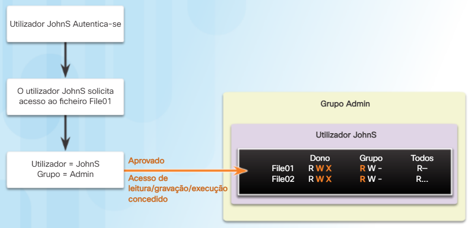
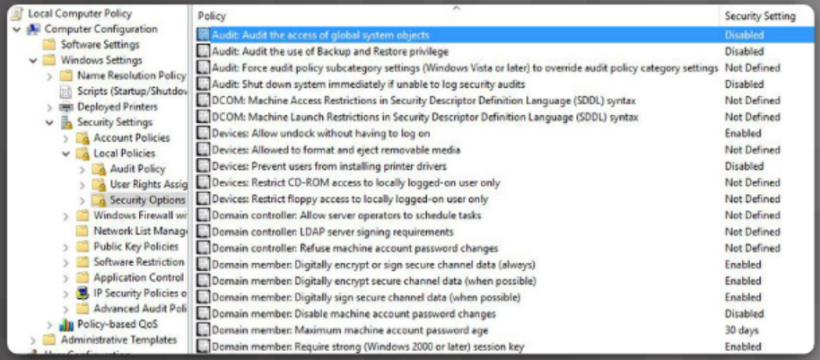
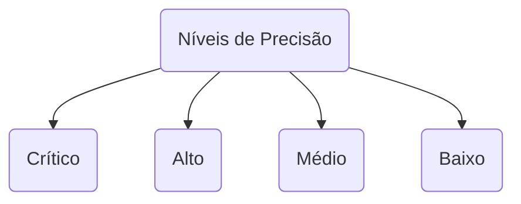
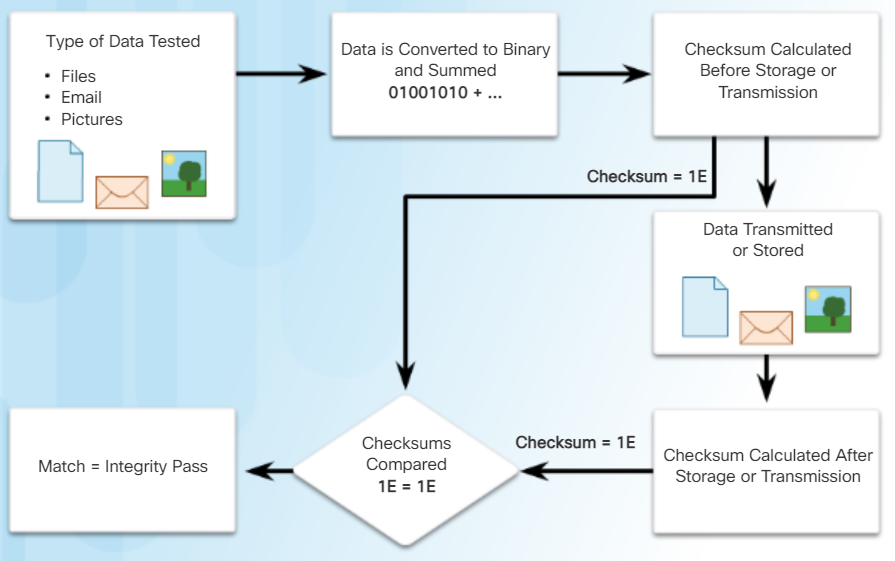
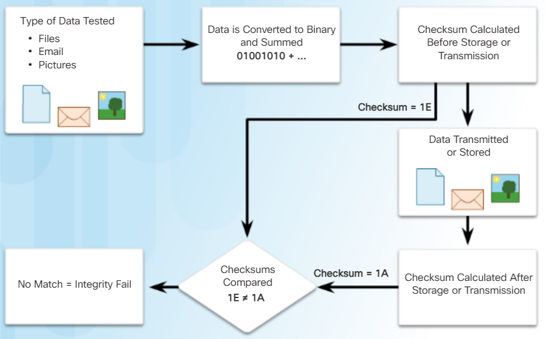
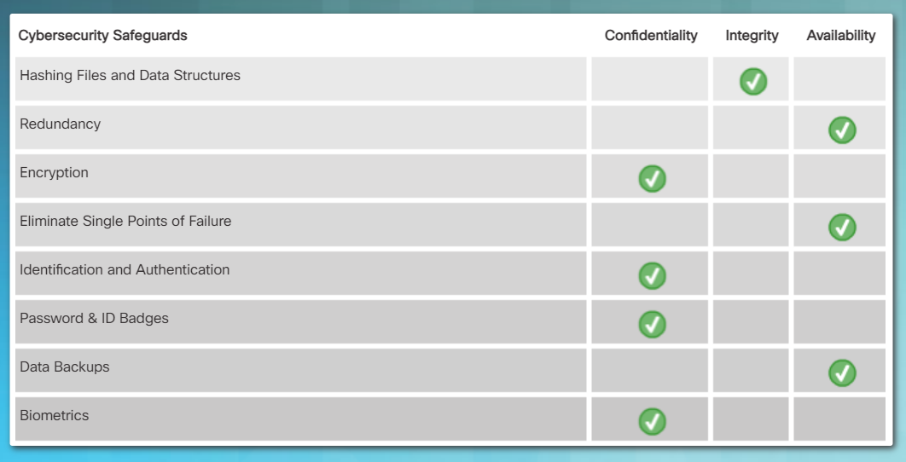
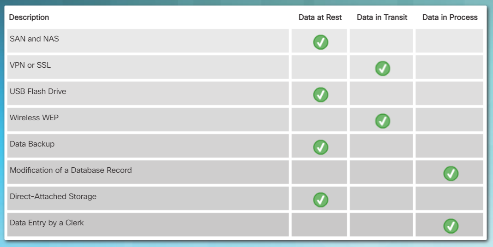
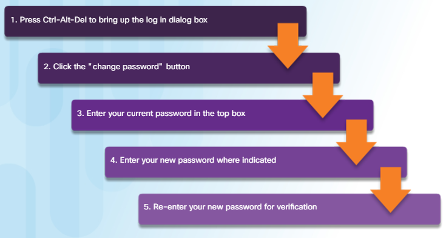

<datails>
Table of Contents 🔖

-

# Capítulo 2: O Cubo de Cibersegurança

Os profissionais de cibersegurança podem ser descritos como especialistas encarregados da proteção do ciberespaço. John McCumber é um dos primeiros especialistas em cibersegurança, desenvolvendo uma estrutura comummente usada chamada **Cubo de McCumber** ou **cubo de cibersegurança**. Isto é usado como ferramenta para gerir a proteção de redes, domínios e da Internet. O Cubo de cibersegurança parece-se um pouco como um Cubo de Rubik.

- A primeira dimensão do Cubo de cibersegurança inclui os três princípios de segurança da informação. Os profissionais de cibersegurança referem-se aos três princípios como a **Tríade CIA**.  
- A segunda dimensão **identifica os três estados da informação** ou dados.  
- A terceira dimensão do cubo **identifica a perícia necessária para fornecer proteção**. Estas são muitas vezes chamadas as três categorias de salvaguardas de cibersegurança.

O capítulo também discute o modelo de cibersegurança ISO. O modelo representa um quadro internacional para normalizar a gestão dos sistemas de informação.

#### Os Princípios da Segurança

A primeira dimensão do cubo de cibersegurança identifica os objetivos para proteger o ciberespaço. Os objetivos identificados na primeira dimensão são os princípios fundamentais. Estes três princípios são:

- **confidencialidade**, impede a divulgação de informações a pessoas, recursos ou processos não autorizados.
- **integridade**, refere-se à precisão, consistência e confiabilidade dos dados.
- **disponibilidade**, assegura que as informações sejam acessíveis por utilizadores autorizados quando necessário.

> Use a sigla CIA para se lembrar destes três princípios.

Os princípios fornecem foco e permitem que o especialista em cibersegurança priorize ações ao proteger qualquer sistema em rede.

#### Os Estados dos Dados

O ciberespaço é um domínio que contém uma quantidade considerável de dados críticos; portanto, os especialistas em cibersegurança concentram-se na proteção de dados. A segunda dimensão do Cubo de cibersegurança foca-se nos problemas de proteção de todos os estados de dados no ciberespaço. Os dados têm três estados possíveis:

- em trânsito
- em repouso ou em armazenamento
- em processamento

A proteção do ciberespaço exige que os profissionais de cibersegurança respondam pela salvaguarda dos dados nos três estados.

#### Salvaguardas de Cibersegurança

A terceira dimensão do Cubo de cibersegurança define as competências e a disciplina a que um profissional de cibersegurança pode recorrer para proteger o ciberespaço. Os profissionais de cibersegurança devem usar uma variedade de diferentes competências e disciplinas disponíveis ao proteger os dados no ciberespaço. Eles devem fazer isso, permanecendo no “lado certo” da lei.

O Cubo de cibersegurança identifica os três tipos de competências e disciplinas usadas para **fornecer proteção** ou realizar **contramedidas**:

A primeira competência inclui as **tecnologias**, dispositivos e produtos disponíveis para proteger sistemas de informação e afastar cibercriminosos.
Os profissionais de cibersegurança têm a reputação de dominar as ferramentas tecnológicas à sua disposição. No entanto, McCumber lembra que as ferramentas tecnológicas não são suficientes para derrotar cibercriminosos. 

Os profissionais de cibersegurança também devem construir uma defesa forte, estabelecendo **políticas**, **procedimentos** e **diretrizes** que permitam que os utilizadores do ciberespaço se mantenham seguros e sigam boas práticas.

Finalmente, os utilizadores do ciberespaço devem esforçar-se para se tornarem mais informados sobre as ameaças do ciberespaço e estabelecer uma cultura de **aprendizagem** e **consciêncialização**.

#### O Princípio da Confidencialidade

A confidencialidade impede a divulgação de informações a pessoas, recursos e processos não autorizados. Um outro termo para confidencialidade é **privacidade**. As organizações restringem o acesso para assegurar que apenas operadores autorizados possam usar dados ou outros recursos da rede.

> Por exemplo, um programador não deve ter acesso à informação pessoal de todos os funcionários.

As organizações precisam de treinar os funcionários sobre as melhores práticas para proteger informações confidenciais, para se protegerem contra ataques a eles próprios e à organização. **Os métodos usados para assegurar a confidencialidade incluem criptografia de dados, autenticação e controlo de acesso**.

#### Protegendo a Privacidade dos Dados

As organizações recolhem uma grande quantidade de dados. Muitos destes dados não são sensíveis porque estão disponíveis publicamente, como nomes e números de telefone. Outros dados recolhidos, no entanto, são delicados. Informações delicadas são dados protegidos contra acesso não autorizado para proteger um indivíduo ou uma organização. Existem três tipos de informações delicadas:

- As informações pessoais são **informações pessoalmente identificáveis** (PII) que são ligáveis a um indivíduo. A exemplo:
	- Número Segurança Social
	- Registros médicos
	- Número do de crédito
	- Registros financeiros
- **Informação comercial** é informação que inclui qualquer coisa que representa um risco para a organização se for descoberto pelo público ou por um concorrente. A exemplo:
	- Segredos comerciais
	- Planos de aquisição
	- Dados financeiros
	- Informações de clientes
- Informações **classificadas** são informações pertencentes a um órgão governamental classificado pelo seu nível de sensibilidade. A exemplo:
	- Ultra secreto
	- Secreto
	- Confidencial
	- Restrito

#### Controlando o Acesso

O controlo de acesso define vários esquemas de proteção que impedem o acesso não autorizado a um computador, rede, base de dados ou outros recursos de dados. Os **conceitos de AAA** envolvem três serviços de segurança: **Autenticação**, **Autorização** e **Registo**. Esses serviços fornecem a estrutura principal para controlar o acesso.

O primeiro “A” no AAA representa a autenticação. A **_autenticação_** verifica a identidade de um utilizador para impedir o acesso não autorizado. Os utilizadores provam a sua identidade com um nome de utilizador ou ID. Além disso, como mostrado a seguir, os utilizadores precisam de verificar a sua identidade fornecendo um dos seguintes:

- Algo que eles **sabem** (como por exemplo uma senha)
- Algo que eles **têm** (como por exemplo um token ou cartão)
- Algo que eles **são** (como por exemplo a impressão digital)

> Por exemplo, se for a uma caixa multibanco para levantar dinheiro, precisará do seu cartão bancário (algo que você tem) e precisa de saber o respetivo PIN. Este também é um exemplo de **autenticação multifator**. A autenticação multifator requer mais de um tipo de autenticação. A forma mais popular de autenticação é o uso de senhas.

Os serviços de **_autorização_** determinam quais os recursos a que os utilizadores podem aceder, juntamente com as operações que os utilizadores podem executar, conforme mostrado a seguir. 

Alguns sistemas implementam isto usando uma **lista de controlo de acesso**, ou uma ACL. Uma ACL determina se um utilizador tem determinados privilégios de acesso depois de se autenticar.

> Só porque você pode fazer login na rede corporativa não significa que tenha permissão para usar a impressora a cores de alta velocidade.

A autorização também pode controlar quando um utilizador tem acesso a um recurso específico.

> Por exemplo, os funcionários podem ter acesso a uma base de dados de vendas durante o horário de trabalho, mas serem bloqueados pelo sistema depois desse horário.

O **_registo_** rastreia o que os utilizadores fazem, incluindo ao que acedem, o tempo que demoram em cada recurso e quaisquer alterações feitas.

> Por exemplo, um banco mantém o rastreio de cada conta de cliente. Uma auditoria desse sistema pode revelar o tempo e a quantidade de todas as transações e o funcionário ou sistema que executou as transações.
 
Os serviços de registo de cibersegurança funcionam da mesma maneira. O sistema rastreia cada transação de dados e fornece resultados de auditoria. Um administrador pode configurar políticas de computador, conforme mostrado a seguir para ativar a auditoria do sistema.

O conceito de AAA é semelhante ao uso de um cartão de crédito. O cartão de crédito identifica quem pode usá-lo, quanto esse utilizador pode gastar e regista os itens ou serviços que o utilizador comprou.

O registo de cibersegurança rastreia e monitoriza em tempo real. Sites, como o Norse, mostram ataques em tempo real com base em dados recolhidos como parte de um sistema de registo ou rastreamento. Clique [aqui](http://map.norsecorp.com/) para visitar o site de rastreamento em tempo real Norse.

#### Leis e Responsabilidade

A confidencialidade e a privacidade parecem intercambiáveis, mas do ponto de vista legal, significam coisas diferentes. A maioria dos dados de privacidade é confidencial, mas nem todos os dados confidenciais são privados. O acesso a informações confidenciais ocorre após a confirmação da autorização adequada.

Instituições financeiras, hospitais, profissionais médicos, escritórios de advocacia e empresas lidam com informações confidenciais, elas têm uma condição "não público". Manter a confidencialidade é mais um dever ético.

A privacidade é o uso adequado dos dados. Quando as organizações recolhem informações fornecidas por clientes ou funcionários, elas devem usar esses dados apenas para o propósito pretendido. A maioria das organizações exigirá que o cliente ou o funcionário assinem um formulário de consentimento dando permissão à organização para usar os dados.

Todas as leis listadas incluem uma disposição para lidar com a privacidade começando com as leis dos EUA e uma amostragem de esforços internacionais. A maioria dessas leis é uma resposta ao crescimento massivo na recolha de dados.

- Lei de Privacidade de 1974
- Lei da Liberdade de Informação (FOIA)
- Lei dos Registos de Educação e Privacidade (FERPA)
- Lei de Fraude e Abuso por Computador dos EUA (CFAA)
- Lei de Proteção de Privacidade Online para Crianças dos EUA (COPPA)
- Lei de Proteção da Privacidade Vídeo (VPPA)
- Lei de Portabilidade e Responsabilização de Seguros de Saúde
- Lei Gramm-Leach-Bliley (GLBA)
- Projeto de Lei do Senado da California 1386 (SB 1386)
- Regras e Regulamentos Bancários dos EUA
- Norma de Segurança de Dados da Indústria de Cartões de Pagamento (PCI DSS)
- Lei de Relatórios de Crédito Justo (FCRA)

- A Lei de Proteção de Dados Pessoais e Documentos Electrónicos (Canada)
- Lei de Proteção de Informações Pessoais Processadas por Computador (China)
- Lei sobre a Proteção de Informações Pessoais (Japão)
- Convenção para a Proteção das Pessoas no que diz respeito ao Tratamento Automático de Dados Pessoais (Rússia)
 - Artigo 8.2 Convenção Europeia dos Direitos do Homem (Reino Unido)

O número crescente de estatutos relacionados com privacidade cria uma enorme carga de trabalho para as organizações que recolhem e analisam dados. As políticas são a melhor forma de uma organização cumprir com o crescente número de leis relacionadas com privacidade. As políticas permitem que as organizações imponham regras, procedimentos e processos específicos ao recolher, armazenar e partilhar dados.

#### Princípio da Integridade dos Dados

Integridade é a **precisão**, **consistência** e **confiabilidade** dos dados durante todo o seu ciclo de vida. Outro termo para integridade é a **qualidade**. Os dados passam por várias operações, como captura, armazenamento, recuperação, atualização e transferência. Os dados devem permanecer inalterados por entidades não autorizadas durante todas essas operações.

Os métodos usados para garantir a integridade dos dados incluem *hashing*, verificações de validação de dados, verificações de consistência de dados e controlos de acesso. Os sistemas de integridade de dados podem incluir um ou mais dos métodos listados acima.

#### Necessidade de Integridade de Dados

A integridade dos dados é um componente fundamental da segurança da informação. A necessidade de integridade dos dados varia de acordo com a forma como uma organização usa os dados.

> Por exemplo, o Facebook não verifica os dados que um utilizador publica num perfil. Um banco ou organização financeira atribui uma importância maior à integridade dos dados do que o Facebook. Transações e contas de clientes devem ser precisas. Numa organização de saúde, a integridade dos dados pode ser uma questão de vida ou morte. As informações das receitas médicas devem ser precisas.

Proteger a integridade dos dados é um desafio constante para a maioria das organizações. A perda de integridade dos dados pode tornar recursos inteiros de dados não confiáveis ou inutilizáveis.

- Crítico (serviços de saúde)
	- Todos os dados são validados e testados
	- Os dados são verificados para fornecer confiabilidade
	- Exemplos incluem registos de saúde e registos financeiros
- Alto (comércio eletrônico e análise de dados)
	- Todos os dados são validados
	- Os dados são verificados para fornecer confiabilidade
	- Exemplos incluem bases de dados das organizações
- Médio (vendas online e motores de busca)
	- Pouca verificação é realizada
	- Dados não totalmente confiáveis
	- Os dados são coletados com formulários publicados de forma pública
- Baixo (blogs e sites de postagens)
	- Os dados podem não ser verificados
	- Baixo nível de confiança nos conteúdos
	- Exemplos incluem a opinião pública e contribuição aberta

#### Verificações de Integridade

Uma verificação de integridade é uma maneira de medir a consistência de uma coleção de dados (um ficheiro, uma imagem ou um registo). A verificação de integridade executa um processo chamado função de *hashing* para tirar uma síntese (*hash*) dos dados num instante no tempo. A verificação de integridade usa essa síntese para garantir que os dados permanecem inalterados.

Uma soma de verificação é um exemplo de uma função de hashing. Uma soma de verificação verifica a integridade de ficheiros, ou cadeias de caracteres, antes e depois de serem transferidos de um dispositivo para outro através de uma rede local ou da Internet. As somas de verificação simplesmente convertem cada parte de informação num valor e somam para calcular o total. Para testar a integridade dos dados, o sistema de recepção repete o processo. Se as duas somas forem iguais, os dados são válidos (Figura 1). Se não forem iguais, ocorreu uma mudança ao longo da linha (Figura 2).

As funções de *hashing* comuns incluem **MD5**, **SHA-1**, **SHA-256** e **SHA-512**. Essas funções de hashing usam algoritmos matemáticos complexos. O valor do hash está presente apenas para comparação.

> Por exemplo, depois de descarregar um ficheiro, o utilizador pode verificar a integridade desse ficheiro comparando o valor do hash calculado pela origem com o hash calculado localmente.

As organizações usam o **controlo de versões** para evitar mudanças acidentais por utilizadores autorizados. Dois utilizadores não podem atualizar o mesmo objeto. Os objetos podem ser ficheiros, registos de base de dados ou transações.

> Por exemplo, o primeiro utilizador a abrir um documento tem a permissão para alterar esse documento; a segunda pessoa tem uma versão somente de leitura.

**Backups** precisos ajudam a manter a integridade dos dados se os dados forem corrompidos. Uma organização precisa de verificar o seu processo de backup para garantir a integridade do backup antes que ocorra a perda de dados.

A **autorização** determina quem tem acesso aos recursos de uma organização com base na sua necessidade de saber.

> Por exemplo, as permissões de ficheiros e os controlos de acesso do utilizador garantem que apenas determinados utilizadores possam modificar dados. Um administrador pode definir permissões para um ficheiro como apenas leitura. Assim, um utilizador a aceder a esse ficheiro não pode fazer alterações.

#### O Princípio da Disponibilidade

A disponibilidade de dados é o princípio usado para descrever a necessidade de manter a disponibilidade de sistemas e serviços de informação em todos os momentos. Ciberataques e falhas no sistema podem impedir o acesso a sistemas e serviços de informação.

> Por exemplo, interromper a disponibilidade do site de um concorrente, colocando-o baixo, pode proporcionar uma vantagem para o seu rival. Esses ataques de negação de serviço (DoS) ameaçam a disponibilidade do sistema e impedem que os utilizadores legítimos acedam e usem os sistemas de informação quando necessário.

Os métodos usados para garantir a disponibilidade incluem **redundância dos sistemas**, **backups** dos sistemas, **maior resiliência** dos sistemas, **manutenção de equipamentos**, **sistemas operativos e software atualizados** e planos para recuperação rápida de desastres imprevistos.

#### Cinco Noves

As pessoas usam vários sistemas de informação no seu dia-a-dia. Computadores e sistemas de informação controlam comunicações, transportes e fabrico de produtos. A disponibilidade contínua de sistemas de informação é essencial para a vida moderna. O termo "**alta disponibilidade**", descreve os sistemas projetados para evitar tempo de inatividade. A alta disponibilidade garante um nível de desempenho por um período superior ao normal. Os sistemas de alta disponibilidade geralmente incluem três princípios de concepção:

- **Eliminar pontos únicos de falha**
	Identificar todos os dispositivos e componentes num sistema que resultaria numa falha do sistema se esse dispositivo ou componente falhar. Métodos para eliminar pontos únicos de falha incluem dispositivos hot standby, componentes redundantes e múltiplas ligações ou caminhos.

- **Fornecer uma transição confiável**
	Fontes de alimentação redundantes, sistemas de energia de backup e sistemas de comunicação de backup fornecem uma transição confiável.

- **Detetar falhas à medida que ocorrem**
	Monitorização activa de dispositivos e sistemas detecta muitos tipos de eventos, incluindo falhas de sistemas e dispositivos. Os sistemas de monitorização podem mesmo desencadear o sistema de backup no caso de uma falha.

O objetivo é a capacidade de continuar a operar sob condições extremas, como durante um ataque. Uma das práticas de alta disponibilidade mais populares é a chamada "cinco noves". Os cinco noves referem-se a 99,999%. Isso significa que o tempo de inatividade é inferior a 5,26 minutos por ano. A seguir três abordagens para cinco noves:

- Sistemas Normalizados
	A normalização de sistemas assegura sistemas que usam os mesmos componentes. Inventários de peças são mais fáceis de manter e é possível a troca de componentes durante uma emergência.

- Sistemas de componentes partilhados
	Os sistemas são construídos de modo a que um sistema de backup possa substituir totalmente um outro que falhou.

- Agrupamento
	Vários dispositivos agrupados fornecem um serviço que para o utilizador parece ser uma única entidade. Se um dispositivo falhar, os outros dispositivos mantêm-se disponíveis.

#### Garantir Disponibilidade

As organizações podem assegurar a disponibilidade implementando o seguinte:

- Manutenção de equipamentos
	A manutenção regular do equipamento pode melhorar imenso o tempo de bom funcionamento do sistema. A manutenção inclui a substituição de componentes, limpeza e alinhamento.

- Atualizações de sistema operativo e sistema
	Os sistemas operativos modernos, as aplicações e os programas de software são continuamente atualizados para corrigir erros e eliminar vulnerabilidades. Todos os sistemas, aplicações e software devem ser atualizados de forma regular. Os profissionais de cibersegurança podem subscrever alertas que anunciam novas versões de atualizações.

- Teste de backups
	O backup de dados da organização, dados de configuração e dados pessoais assegura a disponibilidade do sistema. Os sistemas de backup também devem ser testados para assegurar que estes sistemas funcionam devidamente e que os dados podem ser recuperados em caso de perda de dados.

- Planeamento para desastres
	O planeamento para desastres é uma parte crítica para melhorar a disponibilidade do sistema. Os empregados e clientes devem saber como responder a um desastre. A equipa de cibersegurança deve praticar a resposta e testar os sistemas de backup e conhecer os procedimentos para restaurar sistemas críticos.

- Implementação de novas tecnologias
	Alta disponibilidade requer continuamente a avaliação e teste de novas tecnologias para enfrentar novas ameaças e ataques. Cibercriminosos usam as ferramentas e truques mais recentes. Os profissionais de cibersegurança também devem usar as novas tecnologias, produtos e dispositivos.

- Monitorização de atividades invulgares
	A monitorização contínua do sistema aumenta a disponibilidade do sistema. A monitorização de registos de eventos, alertas do sistema e registos de acesso fornecem ao profissional de cibersegurança informações do sistema em tempo real. Esta informação pode identificar ataques depois do evento ocorrer e permitir ao profissional de cibersegurança afastar os ataques à medida que eles ocorrem.

- Testes de disponibilidade
	Todos os sistemas devem ser testados para procurar vulnerabilidades. O teste pode incluir varrimento de portos, varrimento de vulnerabilidades e testes de penetração.

### Dados em Repouso 

#### Tipos de Armazenamento de Dados

Os dados armazenados referem-se a dados em repouso. Os dados em repouso **significam que um tipo de dispositivo de armazenamento retém os dados quando nenhum utilizador ou processo os está a usar**. Um dispositivo de armazenamento pode ser:

- **local** (num dispositivo de computação) ou
- **centralizado**/**remoto** (na rede).

Existem várias opções para armazenar dados. O **armazenamento de ligação direta** (DAS) é o armazenamento ligado a um computador. Um disco rígido ou uma unidade flash USB é um exemplo de armazenamento de ligação direta. Por norma, os sistemas não são configurados para partilhar o armazenamento de ligação direta.

A **matriz redundante de discos independentes** (RAID) usa vários discos rígidos numa matriz, que é um método de combinar vários discos para que o sistema operativo os veja como um único disco. O RAID fornece desempenho melhorado e tolerância a falhas.

Um **dispositivo de armazenamento ligado à rede** (NAS) é um dispositivo de armazenamento ligado a uma rede que permite o armazenamento e a recuperação de dados por utilizadores de rede autorizados, através da rede. Os dispositivos NAS são flexíveis e escaláveis, o que significa que os administradores podem aumentar a capacidade conforme necessário.

Uma **arquitetura de rede de área de armazenamento** (SAN) é um sistema de armazenamento baseado em rede. Os sistemas SAN ligam-se à rede usando interfaces de alta velocidade, permitindo melhor desempenho e a capacidade de ligar vários servidores a um repositório centralizado de armazenamento em disco.

O armazenamento em nuvem é uma opção de armazenamento remoto que usa espaço num centro de dados e é acessível a partir de qualquer computador com acesso à Internet. Google Drive, iCloud e Dropbox são exemplos de fornecedores de armazenamento em nuvem.

#### Desafios da Proteção de Dados Armazenados

As organizações têm uma tarefa desafiante na tentativa de proteger os dados armazenados. Para melhorar o armazenamento de dados, as organizações podem automatizar e centralizar os backups de dados.

O armazenamento de ligação direta pode ser um dos tipos mais difíceis de gerir e controlar, é vulnerável a ataques maliciosos no computador local. 

Os dados armazenados também podem incluir dados de backup, estes podem ser manuais ou automáticos. As organizações devem limitar os tipos de dados guardados em armazenamento de ligação direta. Em particular, uma organização não armazenaria dados críticos em dispositivos de armazenamento de ligação direta.

Os sistemas de armazenamento em rede oferecem uma opção mais segura. Os sistemas de armazenamento de rede, incluindo RAID, SAN e NAS, proporcionam maior desempenho e redundância. No entanto, os sistemas de armazenamento em rede são mais complicados de configurar e gerir. Também lidam com mais dados, representando um risco maior para a organização se o dispositivo falhar. **Os desafios exclusivos dos sistemas de armazenamento em rede incluem configurar, testar e monitorizar o sistema**.

### Dados em Trânsito 

#### Métodos de Transmissão de Dados

A transmissão de dados envolve o envio de informações de um dispositivo para outro. Existem vários métodos para transmitir informações entre dispositivos, incluindo:

- **Rede de sapatos** — usa media removível (e pessoas para os transportar) para mover fisicamente dados de um computador para outro
- **Redes com fios** — usa cabos para transmitir dados
- **Redes sem fios** — usa ondas de rádio para transmitir dados

> As organizações nunca serão capazes de eliminar o uso de uma rede de sapatos.

As redes com fios incluem media com fio de cobre (coaxial) e fibra ótica. As redes com fios podem servir uma área geográfica local (**Rede de Área Local**) ou podem abranger grandes distâncias (**Rede de Área Alargada**).

As redes sem fios estão a substituir as redes com fios, tornando-se mais rápidas e capazes de lidar com mais largura de banda. As redes sem fios expandem o número de utilizadores convidados com **dispositivos móveis em pequenos escritórios domésticos** (SOHO) e redes empresariais.

Tanto as redes com fios como as redes sem fios usam pacotes ou unidades de dados. O termo pacote refere-se a uma unidade de dados que viaja entre uma origem e um destino na rede. Protocolos normalizados como o **Internet Protocol** (IP) e o **Hypertext Transfer Protocol** (HTTP) definem a estrutura e a formação de pacotes de dados. Estas normas são de código aberto e estão disponíveis para o público. **Proteger a confidencialidade, integridade e disponibilidade dos dados transmitidos é uma das responsabilidades mais importantes de um profissional de cibersegurança**.

#### Desafios da Proteção de Dados em Trânsito

A proteção dos dados transmitidos é uma das tarefas mais desafiantes de um profissional de cibersegurança. Com o crescimento dos dispositivos móveis e sem fios, os profissionais de cibersegurança são responsáveis por proteger enormes quantidades de dados que atravessam a sua rede diariamente. O profissional de cibersegurança deve lidar com vários desafios na proteção desses dados:

- **Proteger a confidencialidade dos dados** — os cibercriminosos podem capturar, guardar e roubar dados em trânsito. Os profissionais de cibersegurança devem tomar medidas para combater essas ações.

- **Proteger a integridade dos dados** — os cibercriminosos podem interceptar e alterar dados em trânsito. Os profissionais de cibersegurança implementam sistemas de integridade de dados que testam a integridade e a autenticidade dos dados transmitidos para combater essas ações.

- **Proteger a disponibilidade de dados** - os cibercriminosos podem usar dispositivos intrusores ou não autorizados para interromper a disponibilidade de dados. Um dispositivo móvel simples pode apresentar-se como um ponto de acesso sem fios local e enganar utilizadores incautos a associar-se com esse dispositivo intrusor. O cibercriminoso pode sequestrar uma ligação autorizada a um serviço ou dispositivo protegido. Os profissionais de segurança de rede podem implementar sistemas de autenticação mútua para combater essas ações. Os sistemas de autenticação mútua exigem que o utilizador se autentique no servidor e solicita que o servidor se autentique ao utilizador.

#### Formas de Computação e Processamento de Dados

O terceiro estado dos dados são dados em processamento. Isto refere-se a dados durante a entrada inicial, modificação, computação ou saída.

A proteção da integridade dos dados começa com a **entrada inicial de dados**. As organizações usam vários métodos para recolher dados:

- entrada manual de dados,
- digitalização de formulários,
- uploads de ficheiros e,
- dados recolhidos de sensores.

Cada um desses métodos representa potenciais ameaças à integridade dos dados.

> Um exemplo de corrupção de dados durante o processo de entrada inclui erros de entrada de dados ou sensores desligados, com defeito ou inoperacionais. Outros exemplos podem incluir erros de rotulagem e formatos de dados incorretos ou incompatíveis.

A modificação de dados refere-se a quaisquer alterações nos dados originais.

> Como por exemplo, utilizadores que modificam manualmente dados, programas de processamento e alteração de dados e falha do equipamento, resultando em modificação de dados. Processos como codificação/descodificação, compressão/descompressão e encriptação/desencriptação são exemplos de modificação de dados. Código malicioso também resulta em corrupção de dados.

A corrupção de dados também ocorre durante o processo de saída de dados. A saída de dados refere-se à saída de dados para impressoras, displays eletrônicos ou diretamente para outros dispositivos. A precisão dos dados de saída é fundamental porque a saída fornece informações e influencia a tomada de decisões.

> Exemplos de corrupção de dados de saída incluem o uso incorreto de delimitadores de dados, configurações de comunicação incorretas e impressoras configuradas incorretamente.

#### Desafios de Proteger os Dados em Processamento

A proteção contra modificações inválidas de dados durante o processamento pode ter um impacto adverso. Erros de software são a razão para muitos percalços e desastres. 

> Por exemplo, apenas duas semanas antes do Natal, alguns dos retalhistas da Amazon experimentaram uma mudança no preço anunciado em seus itens para apenas um centavo. A falha durou uma hora. O erro resultou em milhares de compradores obtendo o negócio de uma vida e a empresa perdendo receita. Em 2016, o termostato Nest funcionou mal e deixou os utilizadores sem aquecimento. O termostato Nest é uma tecnologia inteligente propriedade da Google. Uma falha de software deixou os utilizadores, literalmente, ao frio. Uma atualização de software correu mal, forçando as baterias do dispositivo a esgotar e deixando-o incapaz de controlar a temperatura. Como resultado, os clientes não conseguiram aquecer as suas casas ou obter água quente num dos fins de semana mais frios do ano.

A proteção de dados durante o processamento requer sistemas bem projetados. Os profissionais de cibersegurança projetam políticas e procedimentos que exigem testes, manutenção e atualização de sistemas para mantê-los a operar com a menor quantidade de erros.

### Tecnologias 

#### Salvaguardas Tecnológicas baseadas em Software

As salvaguardas de software incluem programas e serviços que protegem Sistemas operativos, bases de dados e outros serviços que operam em estações de trabalho, dispositivos portáteis e servidores. Os administradores instalam contramedidas ou proteções baseadas em software em computadores individuais ou servidores. Existem várias tecnologias baseadas em software usadas para proteger os ativos de uma organização:

- Os **firewalls de software** controlam o acesso remoto a um sistema. Os sistemas operativos geralmente incluem um firewall ou um utilizador pode comprar ou instalar software de outro fornecedor.

- Os **scanners de rede** e portas descobrem e monitorizam portas abertas num computador ou servidor.

- Os **analisadores de protocolos**, ou analisadores de assinatura, são dispositivos que recolhem e examinam o tráfego de rede. Eles identificam problemas de desempenho, detectam configurações incorretas, identificam aplicações com comportamento incorreto, estabelecem padrões para o tráfego de base e normal e depuram problemas de comunicação.

- Os **analisadores de protocolos** são programas de computador projetados para avaliar fraquezas em computadores ou redes.

- Os **sistemas de detecção de intrusão** (IDS) baseados em anfitrião examinam somente a atividade nesse anfitrião. Um IDS gera ficheiros de log e mensagens de alarme quando detecta atividades incomuns. Um sistema que armazena dados delicados ou o fornecimento de serviços críticos é um candidato para IDS baseados em anfitrião.

#### Salvaguardas Tecnológicas baseadas em Hardware

Existem várias tecnologias baseadas em hardware usadas para proteger os ativos de uma organização:

- Os dispositivos de firewall bloqueiam tráfego indesejado. Os firewalls contêm regras que definem o tráfego permitido para dentro e para fora de uma rede.
- Os Sistemas Dedicados de detecção de Intrusão (IDS) detectam sinais de ataques ou tráfego incomum numa rede e enviam um alerta.
- Os Sistemas de Prevenção de Intrusão (IPS) detectam sinais de ataques ou tráfego incomum numa rede, geram um alerta e tomam ações corretivas.
- Os serviços de filtragem de conteúdo controlam o acesso e a transmissão de conteúdo censurável ou ofensivo.

#### Salvaguardas Tecnológicas baseadas em Rede

Existem várias tecnologias baseadas em rede usadas para proteger os ativos da organização:

- **Rede Privada Virtual (VPN)** é uma rede virtual segura que usa a rede pública (ou seja, a Internet). A segurança de uma VPN reside na criptografia do conteúdo dos pacotes entre os pontos terminais que definem a VPN. Funciona como um túnel que liga um desses pontos ao outro, promentendo a segurança dos dados em transmissão.

- O **controlo de acesso de rede (NAC)** exige um conjunto de verificações antes de permitir que um dispositivo se ligue a uma rede. Algumas verificações comuns incluem software antivírus atualizado ou atualizações do sistema operativo instaladas.

- A **segurança do ponto de acesso sem fios** inclui a implementação de autenticação e criptografia.

#### Salvaguardas Tecnológicas baseadas na Nuvem

As tecnologias baseadas em nuvem mudam o componente tecnológico da organização para o fornecedor de nuvem. Os três principais serviços de computação em nuvem incluem:

- **Software como Serviço (SaaS)** permite que os utilizadores obtenham acesso a aplicações e bases de dados. Os fornecedores de nuvem gerem a infraestrutura. Os utilizadores armazenam dados nos servidores do fornecedor de nuvem.

- **Infraestrutura como Serviço (IaaS)** fornece recursos virtualizados de computação pela Internet. O fornecedor hospeda os componentes de hardware, software, servidores e armazenamento.

- **Plataforma como Serviço (PaaS)** fornece acesso às ferramentas e serviços de desenvolvimento usados para criar as aplicações.

Os fornecedores de serviços de nuvem estenderam essas opções para incluir IT como Serviço (ITaaS), que fornece suporte de IT para modelos de serviço IaaS, PaaS e SaaS. No modelo ITaaS, uma organização contrata com o fornecedor de nuvem para serviços individuais ou compostos.

Os fornecedores de serviços de nuvem usam dispositivos virtuais de segurança que são executados dentro de um ambiente virtual com um sistema operativo pré-preparado e com segurança reforçada, correndo em hardware virtualizado.

### Educação, Sensibilização e Formação

#### Implementação de Educação e Formação em Cibersegurança

Investir muito dinheiro em tecnologia não fará diferença se as  pessoas dentro da organização forem o elo mais fraco na cibersegurança. Um programa de consciencialização de segurança é extremamente importante para uma organização. Um empregado pode não ser propositadamente malicioso, mas apenas ignorante sobre quais são os procedimentos adequados. Existem várias maneiras de implementar um programa formal de formação:

- Faça da formação em consciencialização de segurança parte do processo de integração do funcionário
- Ligue a consciencialização de segurança aos requisitos de trabalho ou avaliações de desempenho
- Realize sessões de formação presenciais
- Recomende cursos online

A **consciencialização** sobre a segurança deve ser um processo contínuo, uma vez que novas ameaças e técnicas estão sempre no horizonte.

#### Estabeleça uma Cultura de Consciencialização sobre Segurança

Os membros de uma organização devem estar cientes das políticas de segurança e ter o conhecimento para tornar a segurança parte das suas atividades diárias.

Um programa ativo de consciencialização de segurança depende de:

- O ambiente da organização
- O nível de ameaça

A criação de uma cultura de consciencialização de cibersegurança é um esforço contínuo que requer a liderança da gestão superior e o compromisso de todos os utilizadores e funcionários. Promover a cultura de cibersegurança de uma organização começa com o estabelecimento de políticas e procedimentos pela gestão. 

> Por exemplo, muitas organizações têm dias de consciencialização sobre cibersegurança. As organizações também podem afixar cartazes e sinalização para aumentar a consciencialização geral sobre cibersegurança.

A criação de workshops e seminários de orientação para cibersegurança ajuda a aumentar a consciencialização.

### Políticas e Procedimentos de Cibersegurança

#### Políticas

Uma política de segurança é um conjunto de objetivos de segurança para uma empresa, que inclui regras de comportamento para utilizadores e administradores e especifica os requisitos do sistema. Estes objetivos, regras e requisitos, coletivamente garantem a segurança de uma rede, os dados e os sistemas informáticos dentro de uma organização.

Uma política de segurança abrangente realiza várias tarefas:

- Demonstra o compromisso de uma organização com a segurança.
- Define as regras para o comportamento esperado.
- Garante consistência nas operações do sistema, aquisição e uso de software e hardware, e manutenção.
- Define as consequências legais das violações.
- Dá à equipa de segurança o apoio da gestão.

As políticas de segurança informam os utilizadores, funcionários e gestores sobre os requisitos de uma organização para proteger ativos de tecnologia e informação. Uma política de segurança também especifica os mecanismos necessários para cumprir os requisitos de segurança.

Uma política de segurança inclui tipicamente:

| Políticas                       | Descrição                                                                                                                                   |
| ------------------------------- | ------------------------------------------------------------------------------------------------------------------------------------------- |
| de identificação e autenticação | Especifica pessoas autorizadas que podem ter acesso a recursos de rede e descreve procedimentos de verificação.                             |
| de senha                        | Garante que as senhas cumprem os requisitos mínimos e são alteradas regularmente                                                            |
| de uso aceitável                | Identifica recursos de rede e usos que são aceitáveis para a organização. Também pode identificar ramificações para violações de políticas. |
| de acesso remoto                | Identifica como os utilizadores remotos podem aceder a uma rede e o que é acessível remotamente.                                            |
| de manutenção de rede           | Especifica os sistemas operativos de dispositivo de rede e os procedimentos de atualização das aplicações do utilizador final.              |
| de tratamento de incidentes     | Descreve como os incidentes de segurança são tratados.                                                                                      |

Um dos componentes mais comuns da política de segurança é a **política de uso aceitável** (AUP). Este componente define o que os utilizadores podem e não podem fazer nos vários componentes do sistema. A AUP deve ser o mais explícita possível para evitar mal-entendidos.

> Por exemplo, uma AUP lista sites específicos, grupos de notícias ou aplicações com uso intensivo de largura de banda que os utilizadores não podem aceder usando computadores da empresa ou a rede da empresa.

#### Normas

As normas **ajudam uma equipe de TI a manter a consistência na operação da rede**. Os documentos de normas fornecem as tecnologias que utilizadores ou programas específicos precisam, além de quaisquer requisitos de programa ou critérios que uma organização deve seguir. Isso ajuda a equipa de TI a melhorar a eficiência e a simplicidade no projeto, manutenção e resolução de problemas.

Um dos princípios de segurança mais importantes é a consistência. Por esta razão, é necessário que as organizações estabeleçam normas. Cada organização desenvolve normas para apoiar o seu ambiente operativo exclusivo. 

> Por exemplo, uma organização estabelece uma política para as senhas. A norma é que as senhas requerem um mínimo de oito caracteres alfanuméricos maiúsculas e minúsculas, incluindo pelo menos um caractere especial. Um utilizador deve alterar a senha a cada 30 dias, e um histórico de senha de 12 senhas anteriores garante que o utilizador crie senhas exclusivas por um ano.

#### Diretrizes

As diretrizes **são uma lista de sugestões sobre como fazer as coisas de forma mais eficiente e segura**. Elas são semelhantes às normas, mas são mais flexíveis e geralmente não são obrigatórias. As diretrizes definem como os padrões são desenvolvidos e garantem a adesão às políticas gerais de segurança.

Algumas das diretrizes mais úteis compõem as melhores práticas de uma organização. Além das práticas recomendadas definidas por uma organização, há outras diretrizes disponíveis em:

- National Institute of Standards and Technology (NIST) Centro de Recursos de Segurança de Computadores
- Guias de configuração de segurança da Agência de Segurança Nacional (NSA)
- A norma Common Criteria

> Usando o exemplo de política de senhas, uma diretriz é uma sugestão de que o utilizador tome uma frase como “I have a dream” e converta-a numa senha forte, Ihv@dr3@m. O utilizador pode criar outras senhas a partir desta frase alterando o número, movendo o símbolo ou alterando o sinal de pontuação.

#### Procedimentos

Os documentos de procedimentos são mais longos e mais detalhados do que as normas e diretrizes. Documentos de procedimentos **incluem detalhes de implementação que geralmente contêm instruções passo a passo e gráficos**.

A figura mostra um exemplo do procedimento usado para alterar uma senha. As grandes organizações devem usar documentos de procedimentos para manter a consistência necessária para um ambiente seguro.

### Atividade - Identificar a categoria de contramedida

| Tecnológico                             | Administrativo                  | Educacional                                     |
| --------------------------------------- | ------------------------------- | ----------------------------------------------- |
| Equipamento IDS/IPS                     | Senhas alteradas a cada 30 dias | Formação de consciencialização para a Segurança |
| Scanner biométrico de impressão digital | Procedimentos de login remoto   | Cartazes de Sensibilização no Escritório        |
| Sistema de crachá eletrônico            | Politica de Uso Aceitável       | "Protegendo a sua área de trabalho' Video       |

### 2.5.1

#### Visão geral do Modelo

**Os profissionais de segurança precisam proteger informações de *ponta a ponta* dentro da organização**. Esta é uma tarefa monumental, e não é razoável esperar que um indivíduo tenha todo o conhecimento necessário.

A Organização Internacional de Normalização (ISO) / Comissão Eletrotécnica Internacional (IEC) desenvolveu uma estrutura abrangente para orientar a gestão da segurança da informação. O modelo de cibersegurança ISO/IEC é para profissionais de cibersegurança o que o modelo de rede OSI é para engenheiros de rede. Ambos **fornecem uma estrutura para compreender e abordar tarefas complexas**.

#### Domínios de Cibersegurança

A ISO/IEC 27000 é uma norma de segurança da informação publicada em 2005 e revista em 2013. A ISO publica as normas ISO 27000. Embora as normas não sejam obrigatórias, a maioria dos países usa-as como uma referência "de facto" para a implementação da segurança da informação.

Os padrões ISO 27000 descrevem a implementação de um sistema abrangente de gestão da segurança da informação (ISMS). Um ISMS consiste em todos os controlos administrativos, técnicos e operacionais para manter as informações seguras dentro de uma organização. Doze domínios independentes representam os componentes da norma ISO 27000. Estes doze domínios servem para organizar, em alto nível, as vastas áreas de informação sob o guarda-chuva da segurança da informação.

A estrutura do modelo de cibersegurança ISO é diferente do modelo OSI, pois ele usa domínios em vez de camadas para descrever as categorias de segurança. A razão para isso é que o modelo de cibersegurança ISO não é uma relação hierárquica. É um modelo de pares no qual cada domínio tem uma relação direta com os outros domínios. O modelo de cibersegurança ISO 27000 é muito semelhante ao modelo OSI, na medida em que é vital para que os especialistas em cibersegurança entendam ambos os modelos para serem bem-sucedidos.

- Avaliação de risco, Este é o primeiro passo no processo de gestão de risco.  Determina o valor quantitativo e qualitativo do risco associado a uma situação específica ou ameaça reconhecida.

- Política de Segurança, Um documento que aborda as restrições e comportamentos dos membros de uma organização e muitas vezes especifica como os dados podem ser acedidos e que dados são acessíveis por quem.

- Organização da Segurança da Informação, Este é o modelo de governança estabelecido por uma organização para a segurança da informação.

- Gestão de ativos, É um inventário e esquema de classificação para ativos de informação.

- Segurança de Recursos Humanos, Aborda os procedimentos de segurança relacionados com funcionários que entram, se movimentam internamente e saem de uma organização.

- Segurança física e ambiental, Descreve a proteção das instalações de computadores dentro de uma organização.

- Gestão de Comunicações e Operações, Descreve a gestão de controlos técnicos de segurança em sistemas e redes.

- Aquisição, Desenvolvimento e Manutenção de Sistemas de Informação, Descreve a integração de segurança em aplicações.

- Controlo de Acesso, Descreve a restrição de direitos de acesso a redes, sistemas, aplicações, funções e dados.

- Gestão de incidentes de segurança da informação, Descreve como antecipar e responder a violações de segurança da informação.

- Gestão da Continuidade de Negócio, Descreve a proteção, a manutenção e a recuperação de processos e sistemas críticos para os negócios.

- Conformidade, Descreve o processo de garantir a conformidade com as políticas, normas e regulamentos de segurança da informação.

- Avaliação de Risco, Este é o primeiro passo no processo de gestão de risco. Determina o valor quantitativo e qualitativo do risco associado a uma situação específica ou ameaça reconhecida.

**Os doze domínios servem como base comum para o desenvolvimento de normas de segurança organizacional e práticas eficazes de gestão de segurança**. Eles também ajudam a facilitar a comunicação entre as organizações.

#### Objetivos de Controlo

Os doze domínios consistem em objetivos de controlo definidos na parte 27001 da norma. Os objetivos de controlo **definem os requisitos de alto nível para implementar um ISM abrangente**. A equipe de gestão de uma organização usa os objetivos de controlo ISO 27001 para definir e publicar as políticas de segurança da organização. Os objetivos de controlo fornecem uma lista de verificação para usar durante as auditorias de gestão de segurança. Muitas organizações precisam de passar por uma auditoria do ISMS para obter uma declaração de conformidade com a ISO 27001.

A **certificação** e a **conformidade** fornecem a confiança para que duas organizações possam confiar uma na outra no que respeita a dados confidenciais e operações. As auditorias de conformidade e segurança comprovam que as organizações estão a melhorar continuamente o seu sistema de gestão de segurança da informação.

Veja a seguir um exemplo de um objetivo de controlo:

> _Controlar o acesso às redes, utilizando os mecanismos adequados de autenticação para utilizadores e equipamentos_

#### Controlos

A ISO/IEC 27002 define controlos do sistema de gestão da segurança da informação. Os controlos são mais detalhados do que os objetivos. **Objetivos de controlo dizem à organização o que fazer. Os controlos definem como realizar o objetivo.**

Com base no objetivo de controlo, controlar o acesso às redes utilizando os mecanismos adequados de autenticação para utilizadores e equipamentos, o controlo seria:

> _Use senhas fortes. Uma senha forte consiste em pelo menos oito caracteres que são uma combinação de letras, números e símbolos (@, #, $,%, etc.) se permitido. As senhas diferenciam maiúsculas e minúsculas, portanto, uma senha forte contém letras em maiúsculas e minúsculas._

Os profissionais de cibersegurança reconhecem o seguinte, os controlos:

- **não são obrigatórios**, mas são amplamente aceites e adotados.
- **devem manter a neutralidade** do fornecedor para evitar a aparência de favorecer um produto ou empresa específica.
- **são como diretrizes.** Isso significa que pode haver mais de uma maneira de cumprir o objetivo.

### Atividade - Identificar os Domínios e controlos ISO/IEC 27000

| Resposta                          | Descrição                                                                                |
| --------------------------------- | ---------------------------------------------------------------------------------------- |
| Gestão de Risco                   | Avaliação de ameaças individuais à organização.                                          |
| Controlo de Acesso                | Implementação do sistema de autenticação multifator.                                     |
| Política de Segurança             | Definição de requisitos fortes de senha.                                                 |
| Gestão de ativos                  | Implementação de marcação, inventário e rastreamento de computadores portáteis e móveis. |
| Segurança Física/Ambiental        | Instalação de sistemas de iluminação, cercas e guardas de segurança.                     |
| Gestão da Continuidade de Negócio | Operação de sistemas de backup e restauração de dados.                                   |

### 2.5.2

#### O Modelo ISO de Cibersegurança e a Tríade CIA

A ISO 27000 é uma estrutura universal para todos os tipos de organização. Para usar a estrutura de forma eficaz, uma organização deve restringir que domínios, objetivos de controlo e controlos se aplicam ao seu ambiente e operações.

Os objetivos de controlo ISO 27001 servem como uma lista de verificação. A primeira etapa que uma organização toma é determinar se esses objetivos de controlo são aplicáveis à organização. 
A maioria das organizações gera um documento chamado **Declaração de Aplicabilidade** (SOA). O SOA define quais os objetivos de controlo que a organização precisa de usar.

Diferentes organizações priorizam de forma diferente a confidencialidade, integridade e disponibilidade, dependendo do setor de atividade. 

> Por exemplo, a Google coloca o valor mais alto na confidencialidade e disponibilidade dos dados do utilizador e menos na integridade. O Google não verifica os dados do utilizador. A Amazon coloca grande ênfase na disponibilidade. Se o site não estiver disponível, a Amazon não vende nada. Isso não significa que a Amazon ignora a confidencialidade a favor da disponibilidade. A Amazon apenas coloca uma prioridade maior na disponibilidade. Portanto, a Amazon pode gastar mais recursos garantindo que haja mais servidores disponíveis para lidar com compras de clientes.

Uma organização adapta o seu uso dos objetivos de controlo e controlos disponíveis para melhor atender às suas prioridades no que diz respeito à confidencialidade, integridade e disponibilidade.

#### O modelo ISO de Cibersegurança e os Estados dos Dados

**Diferentes grupos dentro de uma organização podem ser responsáveis por dados em cada um dos vários estados**.

> Por exemplo, o grupo de segurança de rede é responsável pelos dados durante a transmissão. Programadores e o pessoal da entrada de dados são responsáveis pelos dados durante o processamento. Os especialistas em suporte de hardware e servidores são responsáveis pelos dados armazenados. Os controlos ISO abordam especificamente os objetivos de segurança para dados em cada um dos três estados.

Neste exemplo, representantes de cada um dos três grupos ajudam a identificar os controlos aplicáveis e a prioridade de cada controlo na sua área. O representante do grupo de segurança de rede identifica os controlos que garantem confidencialidade, integridade e disponibilidade de todos os dados transmitidos.

#### O modelo de Cibersegurança ISO e Salvaguardas

**Os objetivos de controlo da ISO 27001 relacionam-se diretamente com as políticas, procedimentos e diretrizes de cibersegurança** da organização que a gestão superior determina. Os controlos ISO 27002 fornecem orientações técnicas. 

> Por exemplo, a gestão superior estabelece uma política especificando a proteção de todos os dados que entram ou saem da organização. A implementação da tecnologia para atingir os objetivos da política não envolveria a gestão superior. É da responsabilidade dos profissionais de TI implementar e configurar adequadamente os equipamentos utilizados para cumprir as diretrizes das políticas estabelecidas pela gestão superior.

#### Laboratório - Instalar uma Máquina Virtual num Computador Pessoal

Um ficheiro de imagem de máquina virtual foi criado para você instalar no seu computador. Neste laboratório, você vai descarregar e importar esse ficheiro de imagem usando uma aplicação de virtualização de desktop, como o VirtualBox.

[Laboratório - Instalar uma Máquina Virtual num Computador Pessoal](https://contenthub.netacad.com/legacy/CyberEss/1.1/pp/course/files/2.5.2.4%20Lab%20-%20Install%20a%20Virtual%20Machine%20on%20a%20Personal%20Computer.pdf)

[Imagem VM (2,5 GB)](https://www.netacad.com/portal/content/cybersecurity-essentials-virtual-machine-vm)

#### Laboratório - Explorar Autenticação, Autorização e Registo

Nesta atividade, você examinará, identificará e configurará os controlos apropriados de autenticação, autorização ou acesso. Você também instalará e configurará controlos de segurança.

[Laboratório - Autenticação, Autorização e Registo](https://contenthub.netacad.com/legacy/CyberEss/1.1/pp/course/files/2.5.2.5%20Lab%20-%20Authentication%20Authorization%20Accounting.pdf)

#### Packet Tracer - Explorando criptografia de ficheiros e dados

Nesta atividade Packet Tracer, vai completar os seguintes objetivos:

- Localizar as credenciais da conta FTP para o laptop de Mary
- Fazer upload de dados confidenciais usando FTP
- Localizar as credenciais da conta FTP para o PC de Bob
- Descarregar Dados Confidenciais usando FTP
- Desencriptar o conteúdo do ficheiro clientinfo.txt

[Packet Tracer - Explorando a encriptação de ficheiros e Dados - Instruções](https://contenthub.netacad.com/legacy/CyberEss/1.1/pp/course/files/2.5.2.6%20Packet%20Tracer%20-%20Exploring%20File%20and%20Data%20Encryption.pdf)

[Packet Tracer - Explorando a encriptação de ficheiros e Dados - Actividade](https://contenthub.netacad.com/legacy/CyberEss/1.1/pp/course/files/2.5.2.6%20Packet%20Tracer%20-%20Exploring%20File%20and%20Data%20Encryption.pka)

#### Packet Tracer - Usando verificações de integridade de ficheiros e dados

Nesta atividade Packet Tracer, vai completar os seguintes objetivos:

- Descarregar os ficheiros do cliente para o PC do Mike
- Descarregar os ficheiros do cliente, a partir do servidor de ficheiros de backup, para o PC do Mike
- Verificar a integridade dos ficheiros do cliente usando Hashing
- Verificar a integridade dos ficheiros críticos usando o HMAC

[Packet Tracer - Usando verificações de integridade de ficheiros e dados - Instruções](https://contenthub.netacad.com/legacy/CyberEss/1.1/pp/course/files/2.5.2.7%20Packet%20Tracer%20-%20Using%20File%20and%20Data%20Integrity%20Checks.pdf)

[Packet Tracer - Usando Verificações de Integridade de ficheiros e Dados - Atividade](https://contenthub.netacad.com/legacy/CyberEss/1.1/pp/course/files/2.5.2.7%20Packet%20Tracer%20-%20Using%20File%20and%20Data%20Integrity%20Checks.pka)

### Conclusão: Capítulo 2: O Cubo de Cibersegurança

Este capítulo discutiu as **três dimensões do cubo de cibersegurança.** A responsabilidade central de um profissional de cibersegurança é proteger os sistemas e dados de uma organização. O capítulo explicou como cada uma das três dimensões contribui para esse esforço.

O capítulo também discutiu o **modelo de cibersegurança ISO**. O modelo representa um quadro internacional para normalizar a gestão dos sistemas de informação. Este capítulo explorou **os doze domínios**. O modelo fornece **objetivos de controlo** que orientam o projeto de alto nível e **implementação de um sistema abrangente de gestão de segurança da informação** (ISMS). O capítulo também discutiu como os profissionais de segurança usam controlos para identificar as tecnologias, dispositivos e produtos para proteger a organização. 