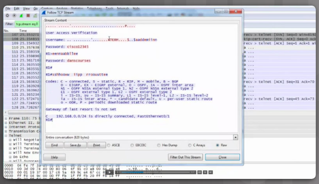

<datails>
Table of Contents 🔖

- [Capítulo 3: Ameaças, Vulnerabilidades e Ataques de Cibersegurança](#capítulo-3-ameaças-vulnerabilidades-e-ataques-de-cibersegurança)
	- [3.1 Malware e Código Malicioso](#31-malware-e-código-malicioso)
		- [3.1.1 Tipos de software malicioso](#311-tipos-de-software-malicioso)
			- [3.1.1.1 O que é Malware?](#3111-o-que-é-malware)
			- [3.1.1.2 Vírus, Worms e Cavalos de Tróia](#3112-vírus-worms-e-cavalos-de-tróia)
			- [3.1.1.3 Bombas Lógicas](#3113-bombas-lógicas)
			- [3.1.1.4 Ransomware](#3114-ransomware)
			- [3.1.1.5 Backdoors e Rootkits](#3115-backdoors-e-rootkits)
			- [3.1.1.6 Defesa contra Malware](#3116-defesa-contra-malware)
			- [3.1.1.7 Atividade - Identifique os Tipos de Código Malicioso](#3117-atividade---identifique-os-tipos-de-código-malicioso)
		- [3.1.2 Descrição dos Ataques de Email e de Navegador](#312-descrição-dos-ataques-de-email-e-de-navegador)
			- [3.1.2.1 Spam](#3121-spam)
			- [3.1.2.2 Spyware, Adware e Scareware](#3122-spyware-adware-e-scareware)
			- [3.1.2.3 Phishing](#3123-phishing)
			- [3.1.2.4 Vishing, Smishing, Pharming, e Whaling](#3124-vishing-smishing-pharming-e-whaling)
			- [3.1.2.5 Plugins do Navegador e Envenenamento do Navegador](#3125-plugins-do-navegador-e-envenenamento-do-navegador)
			- [3.1.2.6 Defesa contra Ataques de E-mail e de Navegador](#3126-defesa-contra-ataques-de-e-mail-e-de-navegador)
			- [3.1.2.7 Atividade - Identificar Ataques de Email e de Navegador](#3127-atividade---identificar-ataques-de-email-e-de-navegador)
	- [3.2 Fraude](#32-fraude)
		- [3.2.1 A Arte de Enganar](#321-a-arte-de-enganar)
			- [3.2.1.1 Engenharia social](#3211-engenharia-social)
			- [3.2.1.2 Tácticas de Engenharia Social](#3212-tácticas-de-engenharia-social)
			- [3.2.1.3 Atividade — Identificar Ameaças de Engenharia Social](#3213-atividade--identificar-ameaças-de-engenharia-social)
		- [3.2.2 Métodos Fraudulentos](#322-métodos-fraudulentos)
			- [3.2.2.1 Navegação no Ombro e Mergulhar no Lixo](#3221-navegação-no-ombro-e-mergulhar-no-lixo)
			- [3.2.2.2 Imitação e Hoaxes](#3222-imitação-e-hoaxes)
			- [3.2.2.3 Piggybacking e Tailgating](#3223-piggybacking-e-tailgating)
			- [3.2.2.4 Fraude Online, por E-mail e baseada na Web](#3224-fraude-online-por-e-mail-e-baseada-na-web)
			- [3.2.2.5 Defesa Contra a Fraude](#3225-defesa-contra-a-fraude)
			- [3.2.2.6 Atividade — Identificar Ameaças de Engenharia Social](#3226-atividade--identificar-ameaças-de-engenharia-social)
	- [3.3 Ataques](#33-ataques)
		- [3.3.1 Tipos de Ciberataques](#331-tipos-de-ciberataques)
			- [3.3.1.1 Negação de Serviço](#3311-negação-de-serviço)
			- [3.3.1.2 Sniffing](#3312-sniffing)
			- [3.3.1.3 Spoofing](#3313-spoofing)
			- [3.3.1.4 Man-in-the-Middle](#3314-man-in-the-middle)
			- [3.3.1.5 Ataques Dia Zero](#3315-ataques-dia-zero)
			- [3.3.1.6 Registo de Teclado](#3316-registo-de-teclado)
			- [3.3.1.7 Atividade - Identificar Tipos de Ciberataques](#3317-atividade---identificar-tipos-de-ciberataques)
			- [3.3.1.8 Defesa Contra Ataques](#3318-defesa-contra-ataques)
			- [3.3.1.9 Laboratório — Detecção de Ameaças e Vulnerabilidades](#3319-laboratório--detecção-de-ameaças-e-vulnerabilidades)
		- [3.3.2 Ataques a Dispositivos Móveis e Sem fios](#332-ataques-a-dispositivos-móveis-e-sem-fios)
			- [3.3.2.1 Grayware e SMiShing](#3321-grayware-e-smishing)
			- [3.3.2.2 Ponto de Acesso Não Autorizado](#3322-ponto-de-acesso-não-autorizado)
			- [3.3.2.3 Bloqueio de RF](#3323-bloqueio-de-rf)
			- [3.3.2.4 Bluejacking e Bluesnarfing](#3324-bluejacking-e-bluesnarfing)
			- [3.3.2.5 Ataques WEP e WPA](#3325-ataques-wep-e-wpa)
			- [3.3.2.6 Defesa contra Ataques a Dispositivos Móveis e a Dispositivos Sem Fios](#3326-defesa-contra-ataques-a-dispositivos-móveis-e-a-dispositivos-sem-fios)
			- [3.3.2.7 Packet Tracer – WEP/WPA2 PSK/WPA2 RADIUS](#3327-packet-tracer--wepwpa2-pskwpa2-radius)
		- [3.3.3 Ataques de Aplicações](#333-ataques-de-aplicações)
			- [3.3.3.1 Cross-Site Scripting (XSS)](#3331-cross-site-scripting-xss)
			- [3.3.3.2 Injecção de Código](#3332-injecção-de-código)
			- [3.3.3.3 Capacidade da Memória Intermédia Excedida](#3333-capacidade-da-memória-intermédia-excedida)
			- [3.3.3.4 Execuções Remotas de Código](#3334-execuções-remotas-de-código)
			- [3.3.3.5 Controlos ActiveX e Java](#3335-controlos-activex-e-java)
			- [3.3.3.6 Defesa contra Ataques de Aplicações](#3336-defesa-contra-ataques-de-aplicações)
			- [3.3.3.7 Atividade - Identificar os Tipos de Ataques de Aplicação e Web](#3337-atividade---identificar-os-tipos-de-ataques-de-aplicação-e-web)
	- [3.4 Conclusão:  Capítulo 3: Ameaças, Vulnerabilidades e Ataques de Cibersegurança](#34-conclusão--capítulo-3-ameaças-vulnerabilidades-e-ataques-de-cibersegurança)

# Capítulo 3: Ameaças, Vulnerabilidades e Ataques de Cibersegurança

As ameaças, vulnerabilidades e ataques são o foco central dos profissionais de cibersegurança.

- Uma **ameaça** é a possibilidade de que um evento prejudicial, como um ataque, ocorra.
- Uma **vulnerabilidade** é um ponto fraco que torna um alvo suscetível a um ataque.
- Um **ataque** é uma exploração deliberada de um ponto fraco descoberto em sistema informáticos, sejam estes alvos específicos ou meramente como alvos de uma oportunidade.

Os cibercriminosos podem ter motivações diferentes para selecionar um alvo de um ataque. Os cibercriminosos são bem-sucedidos através da procura contínua e identificação de sistemas com claras vulnerabilidades. As vítimas comuns incluem sistemas sem *patches* ou sistemas sem sistema de detecção de vírus ausentes e *spam*.

Este capítulo examina os ataques de cibersegurança mais comuns. Os profissionais de cibersegurança devem compreender como funciona cada ataque, o que explora e como afeta a vítima. O capítulo começa explicando a ameaça de malware e código malicioso e depois explica os tipos de engano envolvidos com a engenharia social. Um ataque de cibersegurança é qualquer tipo de manobra ofensiva usada por cibercriminosos para direcionar sistemas de informação informática, redes de computadores ou outros dispositivos de computador. Os cibercriminosos lançam manobras ofensivas contra redes com e sem fios.

## 3.1 Malware e Código Malicioso 

### 3.1.1 Tipos de software malicioso

#### 3.1.1.1 O que é Malware?

Software malicioso, ou **malware**, é um termo usado para descrever software **concebido para interromper as operações do computador, ou obter acesso a sistemas computacionais, sem o conhecimento ou permissão do utilizador**. 

Malware tornou-se um termo guarda-chuva usado para descrever todos os softwares hostis ou intrusivos. O termo malware inclui *vírus de computador*, *worms*,* cavalos de Tróia*, *ransomware*, *spyware*, *adware*, *scareware* e outros programas maliciosos. Malware pode ser óbvio e simples de identificar ou pode ser muito furtivo e quase impossível de detectar.

#### 3.1.1.2 Vírus, Worms e Cavalos de Tróia

Os cibercriminosos tem como alvo os dispositivos finais do utilizador através da instalação de malware.

**Vírus**

Um vírus **consiste num código executável mal-intencionado que é anexado a outros ficheiros executáveis**, como programas legítimos. A maioria dos vírus requer ativação pelo utilizador final e podem ser ativados numa hora ou data específicas.

Os vírus de computador geralmente espalham-se de uma de três maneiras:
- por suporte removível;
- por downloads da Internet; e
- por anexos de e-mail.

Os vírus podem ser inofensivos e apresentar apenas uma imagem ou podem ser destrutivos, tais como os que modificam ou eliminam dados. A fim de evitar a detecção, um vírus muta. O simples ato de abrir um ficheiro pode desencadear um vírus. Um vírus do setor de arranque ou do sistema de ficheiros, infecta unidades de flash USB e pode propagar-se para o disco rígido do sistema.
A execução de um programa específico pode ativar o vírus. Depois que o vírus do programa esteja ativo, geralmente infecta outros programas no computador ou outros computadores na rede. O vírus Melissa foi um exemplo de um vírus difundido por e-mail. Melissa afetou dezenas de milhares de utilizadores e causou um dano estimado de US $1,2 bilhão. Clique [aqui](http://www.whoishostingthis.com/blog/2015/06/01/8-worst-viruses/) para ler mais sobre vírus.

**Worms**

Os worms são código malicioso que **se replica, explorando vulnerabilidades nas redes de forma independente**. Geralmente, os worms tornam as redes lentas. Enquanto um vírus requer a execução de um programa host (hospedeiro), os worms podem ser executados de forma independente.

**Após a infeção inicial, os worms não precisam mais da participação do utilizador**. Uma vez infetado um host, o worm consegue propagar-se muito rapidamente por toda a rede. Os worms partilham padrões semelhantes. Todos possuem uma vulnerabilidade de ativação, uma forma de se propagarem e todos contêm um payload.

Os worms são responsáveis por alguns dos ataques mais devastadores na Internet. Por exemplo, em 2001, o worm Code Red infectou 658 servidores. No período de 19 horas, o worm havia infetado mais de 300.000 servidores.

**Cavalo de tróia**

Um **trojan**, ou cavalo de troia, **consiste em software malicioso que realiza operações mal-intencionadas sob a aparência de uma operação desejada**, como um jogo on-line. Este código malicioso explora os privilégios do utilizador que o executa. Um trojan difere de um vírus na medida em que se liga a ficheiros não executáveis, como ficheiros de imagem, ficheiros de áudio, ou jogos.

#### 3.1.1.3 Bombas Lógicas

Uma bomba lógica **é um programa malicioso que usa um gatilho ou accionador para despertar o código malicioso**.

> Por exemplo, os gatilhos podem ser datas, horas, outros programas em execução ou a exclusão de uma conta de utilizador.

A bomba lógica permanece inativa até que o evento de disparo aconteça. Uma vez ativada, uma bomba lógica implementa um código malicioso que causa danos a um computador. 

Uma bomba lógica pode sabotar registos de bases de dados, apagar ficheiros e atacar sistemas operativos ou aplicações. Especialistas em cibersegurança descobriram recentemente bombas lógicas que atacam e destroem os componentes de hardware numa estação de trabalho ou servidor, incluindo ventiladores de refrigeração, CPU, memória, discos rígidos e fontes de alimentação. A bomba lógica sobrecarregam estes dispositivos até que sobreaqueçam ou falhem.

#### 3.1.1.4 Ransomware

Ransomware **mantém um sistema computacional, ou os dados que este contém, reféns até que o alvo faça um pagamento**. Normalmente, o ransomware funciona cifrando os dados no computador com uma chave desconhecida pelo utilizador. O utilizador tem que pagar um resgate aos criminosos para remover a restrição.

Outras versões de ransomware podem tirar partido de vulnerabilidades específicas do sistema para bloquear o sistema. O Ransomware propaga-se como um cavalo de Tróia e é o resultado da descarga de um ficheiro ou alguma vulnerabilidade no software.

O pagamento através de um sistema de pagamento irrastreável é sempre o objetivo do criminoso. Uma vez que a vítima pague o resgate, o criminoso fornece um programa que decifra os ficheiros ou envia um código de desbloqueio. Clique [aqui](http://www.exterminate-it.com/malpedia/ransomware-category) para ler mais sobre ransomware.

#### 3.1.1.5 Backdoors e Rootkits

Um backdoor refere-se ao programa ou código introduzido por um criminoso que comprometeu um sistema. Então contorna a autenticação normal usada para aceder a esse sistema.
Alguns dos programas comuns de backdoor são o Netbus e o Back Orifice, ambos os quais permitem o acesso remoto a utilizadores não autorizados do sistema.

O **objetivo do backdoor é conceder aos cibercriminosos acesso futuro ao sistema, mesmo que a organização corrija a vulnerabilidade original usada**. Usualmente, os criminosos adquirem autorização quando os utilizadores inconscientemente executam um programa de cavalo de Tróia na sua máquina para instalar o backdoor.

**Um rootkit modifica o sistema operativo para criar um backdoor**. Os atacantes utilizam a backdoor para aceder remotamente ao computador. A maioria dos rootkits tira partido de vulnerabilidades de software para realizar a escalação de privilégios e modificar ficheiros do sistema.
A escalação de privilégios aproveita os erros de programação ou falhas de projeto para conceder ao criminoso acesso elevado a recursos e dados de rede. Também é comum que os rootkits modifiquem elementos forenses e ferramentas de monitorização do sistema, tornando-os muito difíceis de detetar. Muitas vezes, um utilizador deve limpar e reinstalar o sistema operativo de um computador infectado por um rootkit.

#### 3.1.1.6 Defesa contra Malware

Alguns passos simples podem ajudar a defender contra todas as formas de malware:

- **Programa Antivírus -** A maioria dos pacotes de antivírus detecta as formas mais comuns de malware. No entanto, os cibercriminosos desenvolvem e implementam diariamente novas ameaças. Portanto, a chave para uma solução antivírus eficaz é manter as assinaturas atualizadas. Uma assinatura é como uma impressão digital. Esta identifica as características de um pedaço de código malicioso.

- **Software Atualizado -** Muitas formas de malware atingem os seus objetivos através da exploração de vulnerabilidades no software, tanto no sistema operativo com em aplicações. Embora as vulnerabilidades de sistema operativo tenham sido a principal fonte de problemas, as atuais vulnerabilidades de nível aplicacional representam o maior risco. Infelizmente, enquanto os fornecedores de sistemas operativos estejam cada vez mais responsivos aos patches, a maioria dos fornecedores de aplicações não o faz.

#### 3.1.1.7 Atividade - Identifique os Tipos de Código Malicioso

| Malware      | Descrição                                                                                                       |
| ------------ | --------------------------------------------------------------------------------------------------------------- |
| Trojan Horse | Malware that carries out malicious operations under the disguise of a desired operation.                        |
| Logic Bomb   | Malicious program that uses a trigger to awaken the malicious code.                                             |
| Virus        | Malicious executable code that is attached to another executable file, such as a legitimate program.            |
| Rootkit      | Malicious code that is used to compromise a system using backdoors.                                             |
| Ransomware   | Malicious code that holds a computer system, or the data it contains, captive until the target makes a payment. |
| Worm         | Malicious code that replicates itself by independently exploiting vulnerabilities in networks.                  |

### 3.1.2 Descrição dos Ataques de Email e de Navegador

#### 3.1.2.1 Spam

O e-mail é um serviço universal usado por biliões de pessoas no mundo. Sendo um dos serviços mais populares, o e-mail tornou-se numa grande vulnerabilidade para utilizadores e organizações. O Spam, também conhecido como lixo eletrônico, é uma mensagem de e-mail não solicitada. Na maioria dos casos, o spam é um método de envio de anúncios de publicidade.

No entanto, o spam pode enviar hiperligações perigosos, malware ou conteúdo fraudulento. O objetivo final é obter informações confidenciais, como o número de segurança social ou informações de um conta bancária. A maioria do spam tem origem em vários computadores de redes infectadas por um vírus ou worm. Estes computadores comprometidos enviam o máximo de e-mails em massa possível.

Mesmo com funcionalidades de segurança implementadas, algum spam pode ainda conseguir passar. Observe alguns dos indicadores mais comuns de spam:

- O e-mail não tem a linha de assunto.
- Um e-mail está solicitando uma atualização para uma conta.
- O texto de e-mail tem palavras com erros ortografados ou pontuação estranha.
- Os hiperligações dentro do e-mail são longos e/ou enigmáticos.
- Um e-mail parece correspondência de um negócio legítimo.
- O e-mail solicita que o utilizador abra um anexo.

Clique [aqui](https://www.onguardonline.gov/articles/0038-spam) para informações adicionais sobre spam.

Se um utilizador receber um e-mail que contém um ou mais desses indicadores, ele ou ela não deve abrir o e-mail ou quaisquer anexos. É muito comum que a política de e-mail de uma organização exija que um utilizador que receba este tipo de e-mails os reporte à equipa de cibersegurança. Quase todos os fornecedores de e-mail filtram o spam. Infelizmente, o spam ainda consome largura de banda, e o servidor do destinatário ainda precisa processar a mensagem.

#### 3.1.2.2 Spyware, Adware e Scareware

**Spyware é um software que permite que um criminoso obtenha informações sobre as atividades de um utilizador no computador**. O spyware inclui frequentemente monitores de atividade, registo do que é digitado e captura de dados. Numa tentativa de ultrapassar as medidas de segurança, o spyware modifica muitas vezes as definições de segurança. Frequentemente, o spyware vem incluído em software legítimo ou com cavalos de Tróia. Muitos sites de shareware estão cheios de spyware.

**O Adware normalmente exibe pop-ups irritantes para gerar receita para os seus autores**. O malware pode analisar os interesses do utilizador, rastreando os sites visitados. De seguida, poderá enviar anúncios pop-up relacionados com esses sites. Algumas versões do software instalam automaticamente Adware. Algum adware é concebido apenas para apresentar anúncios, mas também é comum conter spyware.

**O Scareware induz o utilizador a realizar uma ação específica com base no medo**. O Scareware imita janelas de pop-up que se assemelham a janelas de caixa de diálogo do sistema operativo. Estas janelas apresentam mensagens falsificadas que indicam que o sistema está em risco ou que requer a execução de um programa específico para regressar ao funcionamento normal. Na realidade, não existem problemas e, se o utilizador concordar e permitir que o programa mencionado seja executado, o malware infecta o seu sistema 

#### 3.1.2.3 Phishing

Phishing **é uma forma de fraude**. Os cibercriminosos usam o e-mail, mensagens instantâneas ou outras formas de media social para tentar obter informações, como credenciais de login ou informações da conta disfarçando-se como uma entidade ou pessoa de confiança.

O phishing ocorre quando uma parte mal-intencionada envia um e-mail fraudulento pretendendo-se passar como sendo originário de uma fonte legítima e fiável. A mensagem tem a intenção de ludibriar o destinatário a fim de instalar software malicioso no dispositivo ou partilhar informações pessoais ou financeiras.

> Um exemplo de phishing é um e-mail forjado para parecer ter sido enviado por uma loja, no qual se pede ao utilizador para clicar numa hiperligação para reclamar um premio. A ligação pode apontar para um site falso onde são solicitadas informações pessoais ou pode instalar um vírus.

**Spear phishing é um ataque de phishing altamente direcionado**. Embora tanto o phishing como o spear phishing utilizem e-mails para alcançar às vítimas, os e-mails de spear phishing são personalizados para um indivíduo específico. O atacante pesquisa os interesses do alvo antes de enviar o e-mail.

> Por exemplo, um atacante descobre que o alvo tem interesse em automóveis e que está a pensar comprar um modelo de automóvel específico. O atacante inscreve-se no mesmo fórum de discussão sobre automóveis de que o alvo é membro, falsifica uma oferta para venda de um automóvel e envia um e-mail ao alvo. O e-mail contém uma hiperligação para fotografias do automóvel. Quando o alvo clica na hiperligação, é instalado malware no computador.

Clique [aqui](https://www.consumer.ftc.gov/scam-alerts) para saber mais sobre fraudes por e-mail.

#### 3.1.2.4 Vishing, Smishing, Pharming, e Whaling

**Vishing é phishing usando tecnologia de comunicação de voz**. Os criminosos podem falsificar chamadas de fontes legítimas usando a tecnologia **Voice over IP** (VoIP). As vítimas também podem receber uma mensagem gravada que parece ser legítima. Os criminosos querem obter números de cartão de crédito ou outras informações para roubar a identidade da vítima. Vishing aproveita-se do fato de que as pessoas confiam na rede telefónica.

**Smishing** (phishing de Short Message Service) **é phishing usando mensagens de texto de telemóveis**. Os criminosos imitam uma fonte legítima na tentativa de ganhar a confiança da vítima.

> Por exemplo, um ataque smishing pode enviar à vítima uma hiperligação do website. Quando a vítima visita o website, o malware é instalado no telemóvel.

**Pharming é a imitação de um site legítimo na tentativa de enganar os utilizadores a introduzir as suas credenciais**. Pharming mal direciona os utilizadores para um website falso que parece ser oficial. As vítimas, de seguida, inserem a sua informação pessoal pensando que estavam ligados a um site legítimo.

**Whaling**, com referência à pesca da baleia, um peixe graúdo, **é um ataque de phishing que visa alvos de alto perfil dentro de uma organização**, como executivos seniores. Alvos adicionais incluem políticos ou celebridades.

Clique [aqui](https://www.rsa.com/content/dam/rsa/PDF/h11933-wp-phishing-vishing-smishing.pdf) para ler um artigo da RSA sobre phishing, smishing, vishing e whaling.

#### 3.1.2.5 Plugins do Navegador e Envenenamento do Navegador

As violações de segurança podem afetar os navegadores Web exibindo pop-ups publicitários, colhendo informação pessoalmente identificáveis ou instalando adware, vírus ou spyware. Um criminoso pode hackear o ficheiro executável de um navegador, os componentes de um navegador ou os seus plugins.

**Plugins**

Os plugins Flash e Shockwave da Adobe permitem o desenvolvimento de animações gráficas e desenhos animados atrativos que melhoram muito a aparência de uma página web. Os plugins exibem o conteúdo desenvolvido usando o software apropriado.

Até recentemente, os plugins tinham um registo de segurança notável. À medida que o conteúdo baseado em Flash cresceu e se tornou mais popular, os criminosos examinaram os plugins e o software do Flash, determinaram vulnerabilidades e exploraram o Flash Player. A exploração bem-sucedida pode causar um crash do sistema ou permitir que um criminoso assumam o controle do sistema afetado. O expectável aumento das perdas de dados ocorre à medida que os criminosos continuam investigando os plugins e protocolos mais populares por vulnerabilidades.

**Envenenamento SEO**

Os motores de pesquisa, como o Google, funcionam através da classificação de páginas e da apresentação de resultados relevantes com base nas consultas de pesquisa dos utilizadores. Dependendo da relevância do conteúdo do website, este pode surgir numa posição mais alta ou mais baixa na lista de resultados da pesquisa.

SEO, a abreviatura de **Search Engine Optimization** (otimização de motores de pesquisa), é um conjunto de técnicas utilizadas para melhorar a classificação de um Web site por motor de pesquisa. Embora muitas empresas legítimas sejam especializadas na otimização de Web sites para um melhor posicionamento dos mesmos, SEO poisoning usa SEO para colocar um Web site malicioso numa posição mais alta nos resultados de pesquisa.

O objetivo mais comum do envenenamento SEO é o aumento do tráfego para sites maliciosos que podem alojar software malicioso ou realizar engenharia social. Para forçar um site malicioso a atingir uma classificação mais alta nos resultados de pesquisa, os atacantes tiram partido de termos de pesquisa populares.

**Sequestro de Navegador Web**

Um sequestro de navegador **é uma modificação por um malware das configurações do navegador de um computador para redirecionar o utilizador para sites pagos pelos clientes dos cibercriminosos**. Os sequestradores de navegador usualmente são instalados sem a permissão do utilizador e geralmente fazem parte de um download drive-by.

> Um download drive-by é um programa que transfere automaticamente para o computador quando um utilizador visita um website ou visualiza uma mensagem de e-mail HTML. Leia sempre os contratos de utilizador atentamente quando transfere programas por forma a evitar este tipo de malware.

#### 3.1.2.6 Defesa contra Ataques de E-mail e de Navegador

Métodos para lidar com o spam incluem a **filtragem de e-mails**, a educação do utilizador para ser cauteloso com e-mails desconhecidos, e a **usar filtros no dispositivo / servidor**. É difícil parar o spam, mas existem formas de diminuir os seus efeitos.

> Por exemplo, a maioria dos ISPs filtram spam antes de que chegue à caixa de entrada do utilizador. Muitos antivírus e programas de software de e-mail executam automaticamente a filtragem de e-mail. Isto significa que detectam e removem spam de uma caixa de entrada de e-mail.

As organizações também devem conscientizar os funcionários sobre os perigos de abrir anexos de e-mail que podem conter um vírus ou um worm. Não assuma que os anexos de e-mail são seguros, mesmo quando vêm de um contato confiável. Um vírus pode estar a tentar propagar-se usando o computador do remetente. Faça sempre o scan dos anexos de e-mail antes dos abrir.

O **Grupo de Trabalho Anti-Phishing** (APWG) é uma associação do setor focada em eliminar o roubo de identidade e a fraude resultantes de phishing e falsificação de e-mail.

Manter o software atualizado assegura que o sistema tenha todos os patches de segurança mais recentes aplicados para resolver as vulnerabilidades conhecidas. Clique [aqui](http://www.howtogeek.com/228828/7-ways-to-secure-your-web-browser-against-attacks/) para saber mais sobre como evitar ataques de navegador 

#### 3.1.2.7 Atividade - Identificar Ataques de Email e de Navegador

| Malware                    | Descrição                                                                                                                                                                                        |
| -------------------------- | ------------------------------------------------------------------------------------------------------------------------------------------------------------------------------------------------ |
| Whaling                    | O uso de email, mensagens instantâneas ou outro mídia sociais, para tentar recolher informações privadas, como credenciais de login, de executivos seniores.                                     |
| Sequestro de Navegador Web | Código malicioso que modifica as configurações do navegador.                                                                                                                                     |
| Phishing                   | O uso de email, mensagens instantâneas ou outro midia sociais, para tentar recolher informações privadas, como credenciais de login, disfarçando-se como uma pessoa de boa reputação             |
| Pharming                   | O uso de um website para tentar obter informações privadas, como credenciais de login, disfarçando-se como um website de boa reputação.                                                          |
| Spyware/Adware             | Código malicioso que é transmitido por email ou descarregado da web, que pode obter informações do utilizador ou instalar banners publicitários em programas, navegadores web ou páginas da web. |
| Spam                       | Lixo eletrônico, ou email não solicitado, que é usado para enviar anúncios, hiperligações prejudiciais, malware ou conteúdo fraudulento.                                                         |
| Vishing                    | O uso de comunicações de voz para tentar obter informações privadas, como credenciais de login, disfarçando-se como uma pessoa de boa reputação.                                                 |

## 3.2 Fraude

### 3.2.1 A Arte de Enganar

#### 3.2.1.1 Engenharia social

A engenharia social é um meio completamente não técnico para um criminoso obter informações sobre um alvo. A engenharia social é um ataque que tenta manipular indivíduos a realizarem ações ou a divulgarem informações confidenciais.

Muitas vezes, os engenheiros sociais baseiam-se na vontade que as pessoas têm de ajudar, mas também tiram partido das suas fraquezas.

> Por exemplo, um atacante pode contactar um funcionário autorizado relativamente a um problema urgente que requer o acesso imediato à rede. O atacante pode apelar à vaidade do funcionário, invocar autoridade utilizando técnicas de citação de nomes ou apelar à ganância do funcionário.

Alguns tipos de ataques de engenharia social são:

- **Pretexting** – Ocorre quando um atacante contacta um indivíduo e lhe mente no sentido de obter acesso a dados privilegiados. Um exemplo envolve um atacante que finge necessitar de dados pessoais ou financeiros para confirmar a identidade do destinatário.

- **Something for Something (Quid pro quo)** - Ocorre quando um atacante solicita informações pessoais de alguém em troca de algo como, por exemplo, um presente ou oferta.

#### 3.2.1.2 Tácticas de Engenharia Social

Engenheiros sociais contam com várias táticas. As táticas de engenharia social incluem:

- **Autoridade** — as pessoas são mais propensas a cumprir quando instruídas por “uma autoridade”
- **** — os criminosos intimidam uma vítima a realizar uma ação
- **Consenso/Prova Social** — as pessoas irão realizar uma ação se acharem que outras pessoas também gostam
- **Escassez** — as pessoas irão realizar uma ação quando acham que há uma quantidade limitada
- **Urgência** — as pessoas irão realizar uma ação quando pensam que há um tempo limitado
- **Familiaridade/Liking** — os criminosos constroem um relacionamento com a vítima para estabelecer uma relação
- **Confiança** — os criminosos constroem uma relação de confiança com uma vítima, sendo que pode requerer-se mais tempo para a estabelecer

Os profissionais de cibersegurança são responsáveis por educar os outros na organização sobre as táticas dos engenheiros sociais. Clique [aqui](http://www.informit.com/articles/article.aspx?p=1350956) para saber mais sobre táticas de engenharia social.

#### 3.2.1.3 Atividade — Identificar Ameaças de Engenharia Social

| Tática                   | Descrição                                                                           |
| ------------------------ | ----------------------------------------------------------------------------------- |
| Urgência                 | Coaxing (persuadir) como resultado de acreditar que há um tempo limitado para agir. |
| Intimidação              | Uso de bullying ou ameaças para persuadir.                                          |
| Autoridade               | Uso de poder ou a capacidade de persuadir.                                          |
| Familiaridade/Liking     | Uso de relacionamento com a vítima para estabelecer um relacionamento e confiança.  |
| Escassez                 | Coaxing como resultado de acreditar que há uma quantidade limitada disponível       |
| Consenso ou Prova Social | Coaxing baseado na crença e nas ações dos outros.                                   |

### 3.2.2 Métodos Fraudulentos

#### 3.2.2.1 Navegação no Ombro e Mergulhar no Lixo

Um criminoso observa, ou "**navega no ombro**", para obter PINs, códigos de acesso ou números de cartão de crédito.

> Um atacante pode estar na proximidade da sua vítima ou o atacante pode usar binóculos ou câmeras de circuito fechado para descobrir as informações.

Esta é uma razão pela qual uma pessoa apenas pode ver o ecrã de uma ATM de certos ângulos. Estes tipos de salvaguardas tornam o surf no ombro muito mais difícil.

“O lixo de um homem é o tesouro de outro homem”. Esta frase pode ser especialmente verdadeira no mundo do mergulho de lixo, que **é o processo de passar pelo lixo de um alvo para ver que informação uma organização descarta**.
Considere proteger o caixote do lixo. Qualquer informação sensível deve ser devidamente eliminada através de trituração ou utilização de sacos de queima, um recipiente que guarda os documentos classificados ou sensíveis para posterior destruição por queima.

#### 3.2.2.2 Imitação e Hoaxes

**A imitação ou representação é a ação de fingir ser outra pessoa**.

> Por exemplo, um golpe recente por telefone tinha como alvos os contribuintes. Um criminoso, disfarçado como funcionário das finanças, dizia às vítimas que deviam dinheiro ao fisco. As vítimas deviam pagar imediatamente através de uma transferência bancária. O imitador ameaçava que a falha no pagamento resultaria em prisão.

Os criminosos também usam imitação para atacar outros. Eles podem prejudicar a credibilidade dos indivíduos usando postagens em websites ou redes sociais.

**Uma hoax, ou fraude por mentira ou boato, é um ato destinado a enganar ou iludir**. Uma fraude cibernética deste tipo pode causar tanta interrupção quanto uma violação real causaria. Uma fraude provoca uma reação do utilizador. A reação pode criar medo desnecessário e comportamento irracional. Os utilizadores passam estas fraudes por e-mail e nos meios sociais 

#### 3.2.2.3 Piggybacking e Tailgating

**Piggybacking ou Tailgating ocorre quando um criminoso acompanha um pessoa autorizada para conseguir entrar num local seguro ou numa área restrita**. Os criminosos usam vários métodos para realizar o piggybacking:

- Eles podem dar a aparência de ser escoltados pelo indivíduo autorizado
- Eles podem juntar-se a uma grande multidão fingindo ser um membro
- Eles podem ter como alvo uma vítima descuidada sobre as regras do estabelecimento

Um **mantrap** é um dispositivo que evita piggybacking usando dois conjuntos de portas. Depois de os indivíduos entrarem através de uma porta externa, essa porta deve fechar-se antes de entrar pela porta interna.

#### 3.2.2.4 Fraude Online, por E-mail e baseada na Web

O encaminhamento de e-mails fraudulentos e outras piadas, filmes engraçados e e-mails, não relacionados com o trabalho, no local de trabalho podem violar a política de uso aceitável da empresa e resultar em processos disciplinares. Clique [aqui](http://www.snopes.com/) para visitar um website que publica rumores e informações sobre verificações de fatos.

#### 3.2.2.5 Defesa Contra a Fraude

As organizações precisam de promover a conscientização sobre as táticas de engenharia social e educar adequadamente os funcionários sobre medidas de prevenção, como as seguintes:

- Nunca fornecer informações confidenciais ou credenciais via e-mail, sessões de chat, em pessoa ou por telefone a partes desconhecidas.
- Resistir ao desejo de clicar em e-mails atraentes e hiperligações de websites.
- Ficar atento aos downloads não iniciados ou automáticos.
- Estabelecer políticas e educar os funcionários sobre essas políticas.
- Quando se trata de segurança, dê aos funcionários uma sensação de propriedade.
- Não ceder à pressão de indivíduos desconhecidos.

Clique [aqui](https://niccs.us-cert.gov/awareness/protect-yourself-against-cyber-threats) para saber mais sobre a conscientização sobre cibersegurança.

#### 3.2.2.6 Atividade — Identificar Ameaças de Engenharia Social

| Ameaça               | Descrição                                                                                  |
| -------------------- | ------------------------------------------------------------------------------------------ |
| Roubo de Identidade  | Fingindo ser outra pessoa para ganhar confiança ou acesso a áreas ou dados não autorizados |
| Surf no Ombro        | Observar uma vitima a Introduzir o PIN numa máquina ATM                                    |
| Hoaxes               | uso do engano para provocar uma reação irracional de um utilizador                         |
| Tailgating           | Seguir uma pessoa autorizada para entrar num local seguro ou numa área restrita            |
| Mergulhar na Lixeira | Recuperação de documentos do lixo ou dos contentores de reciclagem                         |

## 3.3 Ataques

### 3.3.1 Tipos de Ciberataques

#### 3.3.1.1 Negação de Serviço

Os **ataques de negação de serviço** (Denial-of-Service, **DoS**) são um tipo de ataque de rede. Um ataque DoS resulta nalgum tipo de interrupção dos serviços de rede para os utilizadores, dispositivos ou aplicações. Existem dois tipos principais de ataque DoS:

- **Enorme Quantidade de Tráfego –** O atacante enviar uma enorme quantidade de dados a uma velocidade que a rede, um dispositivo anfitrião ou aplicação não consegue processar. Esta situação provoca um abrandamento da transmissão ou da resposta, ou o bloqueio de um dispositivo ou serviço.

- **Pacotes com Formatação Maliciosa –** O atacante envia um pacote com formatação maliciosa a um dispositivo anfitrião ou a uma aplicação e o receptor não consegue processá-lo.
	> Por exemplo, uma aplicação não consegue identificar pacotes contendo erros ou pacotes formatados incorretamente encaminhados pelo atacante. Esta situação faz com que o dispositivo receptor tor funcione de forma muito lenta ou bloqueie.

Os ataques DoS são considerados um risco grave, na medida em que podem interromper facilmente a comunicação e provocar perdas significativas de tempo e dinheiro. Estes ataques são relativamente fáceis de realizar, mesmo por um atacante com poucas aptidões.

O objetivo de um ataque de negação de serviço é negar acesso a utilizadores autorizados, tornando a rede indisponível (relembre-se dos três princípios de segurança subjacentes: confidencialidade, integridade e disponibilidade).

Um **ataque DoS Distribuído** (Distributed DoS Attack, **DDoS**) é semelhante a um ataque DoS, mas **tem origem em múltiplas fontes coordenadas**. 

> Por exemplo, um ataque DDoS pode ocorrer da seguinte forma:

Um atacante cria uma rede de dispositivos anfitrião infetados, denominada **botnet**, composta por zombies. Os dispositivos infetados são designados por **zombies**. O atacante usa sistemas de controlo para controlar os zombies. Os computadores zombies analisam constantemente e infetam mais hosts, criando mais zombies. Quando estiver pronto, o pirata informático dá ordem aos sistemas de controlo para que façam com que a botnet de zombies realize um ataque DDoS.

#### 3.3.1.2 Sniffing

Sniffing é **semelhante a escutar ou espiar alguém às escondidas**. Ocorre quando os atacantes examinam todo o tráfego de rede enquanto este passa através das suas **interfaces de rede** (NIC), independentemente de o tráfego lhes ser ou não endereçado. 

Os criminosos realizam sniffing de rede com uma ferramenta de software, um dispositivo de hardware ou uma combinação de ambos. Como se mostra na figura, o sniffing visualiza todo o tráfego de rede ou pode atingir um protocolo específico, serviço, ou até mesmo sequência de caracteres, como um login ou palavra-passe. Alguns sniffers de rede observam todo o tráfego e também podem modificar parte ou todo o tráfego.

Sniffing também tem os seus benefícios. Os administradores de rede também podem usar sniffers para analisar o tráfego de rede, identificar problemas de largura de banda e solucionar outros problemas de rede.

A segurança física é importante na prevenção da introdução de sniffers na rede interna.

#### 3.3.1.3 Spoofing

Spoofing, ou falsificação, **é um ataque de imitação, que se aproveita de uma relação confiável entre dois sistemas**. Se dois sistemas aceitarem a autenticação realizada um pelo outro, um indivíduo logado a um sistema poderá não ter que passar por um novo processo de autenticação para aceder ao outro sistema. Um atacante tirar vantagem deste arranjo através do envio de um pacote para um sistema como se parecesse ter vindo de um sistema confiável. Como o relacionamento confiável está em vigor, o sistema destino pode executar a tarefa solicitada sem autenticação.

Existem vários tipos de ataques de spoofing.

- **MAC address spoofing** é a falsificação de [endereços MAC](https://pt.wikipedia.org/wiki/Endere%C3%A7o_MAC) e ocorre quando um computador aceita pacotes de dados com base no endereço MAC de outro computador.

- **IP spoofing**, ou falsificação IP, envia pacotes IP de um endereço de origem falsificado para se disfarçar.

- O **Address Resolution Protocol** (ARP) é um protocolo que resolve endereços IP para os correspondentes endereços MAC para transmitir dados. ARP spoofing baseia-se no envio de mensagens ARP falsificadas numa rede LAN para associar o MAC address do criminoso com o endereço IP de um membro autorizado da rede.

- O Domain Name System (DNS) associa nomes de domínio a endereços IP. A falsificação por **DNS server spoofing** modifica o servidor DNS para redirecionar um nome de domínio específico para um endereço IP diferente controlado pelo criminoso.

#### 3.3.1.4 Man-in-the-Middle

Um criminoso realiza um ataque man-in-the-middle (**MiTM**), ou homem-no-meio, **interceptando as comunicações entre computadores para roubar as informações que atravessam a rede. O criminoso pode também optar por manipular mensagens e retransmitir informações falsas entre dispositivos, uma vez que os dispositivos não sabem que ocorreu uma modificação às mensagens**. Um ataque MitM permite que o atacante assuma o controlo de um dispositivo sem conhecimento do utilizador.

**Man-In-The-Mobile** (MitMO) é uma variação do man-in-middle. Num MitMO, **objectivo é assumir o controlo de um dispositivo móvel**. O dispositivo móvel infectado envia informação sensível do utilizador aos invasores. *ZeuS*, um exemplo de exploit com funcionalidades de MitMO, permite que os atacantes capturem silenciosamente mensagens SMS de verificação em 2 passos enviadas aos utilizadores. 

> Por exemplo, quando um utilizador configura um Apple ID, deve fornecer um número de telefone compatível com SMS para receber um código de verificação temporária numa mensagem de texto para provar a identidade do utilizador. O malware espia este tipo de comunicação e retransmite a informação de volta para os criminosos.

**Um ataque de retransmissão (replay attack) ocorre quando um invasor captura uma parte de uma comunicação entre dois dispositivos anfitrião e, posteriormente, retransmite a mensagem capturada**. Os ataques de retransmissão contornam os mecanismos de autenticação.

#### 3.3.1.5 Ataques Dia Zero

Um ataque Zero-Day, ou de Dia Zero, às vezes referido como uma ameaça de dia zero, é um ataque de computador que **tenta explorar vulnerabilidades de software que são desconhecidas ou não divulgadas pelo fornecedor de software**.

**O termo hora zero descreve o momento em que alguém descobre a exploração das vulnerabilidades**. Durante o tempo que o fornecedor de software leva para desenvolver e disponibilizar um patch, a rede está vulnerável a essas explorações, como se mostra na figura.

Defender contra esses ataques rápidos exige que os profissionais de segurança de rede adotem uma visão mais sofisticada da arquitetura de rede. Não é mais possível conter intrusões em alguns pontos da rede.

#### 3.3.1.6 Registo de Teclado

**Keyboard Logging**, ou registo de teclado, ou **keylogger**, é um programa de software que **regista as teclas digitadas pelo utilizador do sistema**. Os criminosos podem implementar registadores de teclas (keystroke loggers) através do software instalado num computador ou através de hardware fisicamente ligado a um computador. O criminoso configura o software do registo de teclas para enviar por e-mail o ficheiro de log. As teclas digitadas e registadas no ficheiro log podem revelar nomes de utilizador, palavras-passe de acesso, websites visitados e outra informação confidencial.

Os registadores de teclas podem ser software comercial legítimo. Frequentemente, os pais de crianças compram software key logger para rastrear os websites e o comportamento das crianças usando a Internet. Muitas aplicações anti-spyware são capazes de detectar e remover registadores de teclas não autorizados. Embora o software keylogging seja legal, os criminosos usam o software para fins ilegais.

#### 3.3.1.7 Atividade - Identificar Tipos de Ciberataques

| Ciberataques      | Descrição                                                                                                                                                        |
| ----------------- | ---------------------------------------------------------------------------------------------------------------------------------------------------------------- |
| Zero-day          | Um ataque que tenta explorar vulnerabilidades de software que são desconhecidas ou não divulgadas pelo fornecedor do software.                                   |
| Sniffing          | Tipo dc ataque que examina todo o tráfego dc rede à medida que passa através da interface  de rede (NIC), mesmo quando não seja endereçado ao sistema de ataque. |
| Man-in-the-Middle | Tipo de ataque que intercepta as comunicações entre computadores para roubar informações enquanto viajam pela rede.                                              |
| Keylogger         | Programa usado para gravar ou registar as teclas digitadas do utilizador num sistema.                                                                            |
| DoS e DDoS        | Tipo de ataque que nega o acesso a utilizadores autorizados que tornam a rede, os serviços de rede ou os dados na rede indisponíveis.                            |
| Spoofing          | Tipo de ataque que usa a impersonalização para tirar vantagem de uma relação confiávelentre dois sistemas.                                                       |

#### 3.3.1.8 Defesa Contra Ataques

Uma organização pode tomar uma série de medidas para se defender contra vários ataques. Configurar **firewalls** para descartar todos os pacotes vindos de fora da rede que tenham endereços indicando que tiveram origem de dentro da rede. Esta situação normalmente não ocorre, e indica que um cibercriminoso tentou um ataque de falsificação.

Para evitar ataques DoS e DDoS, certifique-se de que os patches e upgrades são os atuais, distribua a carga de trabalho entre sistemas de servidor e bloqueie na fronteira pacotes **Internet Control Message Protocol** (ICMP) do exterior. O ICMP é usado por dispositivos de rede para enviar mensagens de erro.

> Por exemplo, o comando ping usa pacotes ICMP para verificar se um dispositivo pode comunicar com outro na rede.

Os sistemas podem impedir que sejam vítimas de um ataque de retransmissão cifrando o tráfego, fornecendo autenticação criptográfica e incluindo uma etiqueta temporal da data/hora com cada parte da mensagem. Clique [aqui](http://www.theguardian.com/public-leaders-network/2015/oct/14/how-to-stop-cyber-attacks-on-your-organisation) para saber mais sobre formas de prevenção de ciberataques.

#### 3.3.1.9 Laboratório — Detecção de Ameaças e Vulnerabilidades

Este laboratório apresenta ferramentas que podem detectar ameaças e remover vulnerabilidades de um dispositivo anfitrião.

[Laboratório — detecção de Ameaças e Vulnerabilidades](https://contenthub.netacad.com/legacy/CyberEss/1.1/pp/course/files/3.3.1.9%20Lab%20-%20Detecting%20Threats%20and%20Vulnerabilities.pdf)

### 3.3.2 Ataques a Dispositivos Móveis e Sem fios

#### 3.3.2.1 Grayware e SMiShing

O Grayware está a tornar-se num problema na segurança móvel com a popularidade dos smartphones. O Grayware **inclui aplicações que se comportam de forma irritante ou indesejável**. O Grayware pode não ter malware reconhecível oculto, mas ainda pode representar um risco para o utilizador.

> Por exemplo, o Grayware pode rastrear a localização do utilizador. Os autores do grayware geralmente mantêm legitimidade, incluindo as capacidades de uma aplicação na pequena impressão do contrato da licença de software. Os utilizadores instalam muitas aplicações móveis sem realmente considerar as suas capacidades.

SMiShing é abreviatura de phishing por SMS. SMiShing **usa o Serviço de Mensagens Curtas (SMS) para enviar mensagens de texto falsas**. Os criminosos enganam o utilizador para ele visitar um site ou ligar para um número de telefone. Vítimas inocentes podem então fornecer informação sensível, como os dados de um cartão de crédito. Visitar um website pode resultar em o utilizador inconscientemente descarregar malware que infecta o dispositivo.
SMiShing pode ser também uma ferramenta utilizada durante um [MitMO](#3314-man-in-the-middle).

#### 3.3.2.2 Ponto de Acesso Não Autorizado

Um ponto de acesso não autorizado **é um ponto de acesso sem fios instalado numa rede segura sem autorização explícita**. Um ponto de acesso não autorizado pode ser configurado de duas formas:
- A primeira é quando um funcionário bem intencionado tenta ser útil, facilitando a ligação de dispositivos móveis.
- A segunda maneira é quando um criminoso ganha acesso físico a uma organização, esgueirando-se e instala o ponto de acesso não autorizado. Uma vez que ambos não são autorizados, ambos representam riscos para a organização.

Um ponto de acesso não autorizado também pode referir-se ao ponto de acesso de um criminoso. Neste exemplo, o criminoso configura o ponto de acesso como um dispositivo MiTM para capturar a informação de login dos utilizadores.

Um ataque Twin Evil usa o ponto de acesso do criminoso melhorado com antenas de maior potência e maior ganho para se apresentar com uma melhor opção de ligação para os utilizadores. Depois que os utilizadores se ligarem ao ponto de acesso falso, os criminosos podem analisar o tráfego e executar ataques MiTM.

#### 3.3.2.3 Bloqueio de RF

Os sinais sem fios são suscetíveis à interferência eletromagnética (EMI), interferência de radiofrequência (RFI), e podem até ser suscetíveis a relâmpagos ou ao ruído de luzes fluorescentes.
Os sinais sem fios também são suscetíveis as interferências deliberada. O **bloqueio de radiofrequência** (RF) interrompe a transmissão de uma estação de rádio ou satélite para que o sinal não atinja a estação receptora.

A frequência, a modulação, e a potência do jammer RF precisam de ser iguais às do dispositivo que o criminoso pretende interromper a fim de interromper com sucesso o sinal sem fios.

#### 3.3.2.4 Bluejacking e Bluesnarfing

O Bluetooth é um protocolo de curto alcance e baixa potência. O Bluetooth transmite dados numa rede de área pessoal, ou PAN, e pode incluir dispositivos como telemóveis, portáteis e impressoras. Várias versões do Bluetooth já foram lançadas. A fácil configuração é uma característica do Bluetooth, não havendo a necessidade de endereços de rede. O Bluetooth usa o emparelhamento para estabelecer a relação entre dispositivos. Ao estabelecer o emparelhamento, ambos os dispositivos usam a mesma chave de acesso (passkey).

As vulnerabilidades Bluetooth tem surgido, mas devido ao alcance limitado de Bluetooth, a vítima e o atacante precisam de estar dentro do alcance um do outro.

- Bluejacking é o termo usado para enviar mensagens não autorizadas para outro dispositivo Bluetooth. Uma variação disso é enviar uma imagem chocante para o outro dispositivo.

- Bluesnarfing ocorre quando o atacante copia informações da vítima do seu dispositivo. Estas informações podem incluir e-mails e listas de contatos.

#### 3.3.2.5 Ataques WEP e WPA

**Wired Equivalent Privacy** (WEP) é um protocolo de segurança que tentou fornecer uma **rede de área local sem fios** (WLAN) com o mesmo nível de segurança que uma LAN com fios. Como as medidas de segurança física ajudam a proteger uma LAN com fios, a WEP procura fornecer proteção semelhante para dados transmitidos pela WLAN com criptografia.

O WEP usa uma chave para criptografia. Não há um mecanismo de gestão de chaves com o WEP, portanto, o número de pessoas que partilham a chave crescerá continuamente. Como todos estão usando a mesma chave, o criminoso tem acesso a uma grande quantidade de tráfego para ataques analíticos.

O **WEP tem vários problemas com o seu vetor de inicialização** (IV), que é um dos componentes do sistema criptográfico:

- É um campo de 24 bits, o que é muito pequeno.
- É texto claro, o que significa que é legível.
- É estático, de modo que fluxos de chave idênticos irão se repetir numa rede carregada.

O **WiFi Protected Access** (WPA) e, depois, o **WPA2** surgiram como protocolos melhorados para substituir o WEP. O WPA2 não tem os mesmos problemas de criptografia porque um invasor não pode recuperar a chave através da observação do tráfego.
O WPA2 é suscetível ao ataque porque os cibercriminosos podem analisar os pacotes que viagem entre o ponto de acesso e um utilizador legítimo. Os cibercriminosos usam um **packet sniffer** e depois executam ataques offline à frase-passe secreta.

#### 3.3.2.6 Defesa contra Ataques a Dispositivos Móveis e a Dispositivos Sem Fios

Existem várias medidas a serem tomadas para se defender contra ataques a dispositivos móveis e sem fios. A maioria dos produtos WLAN usa as configurações padrão. Aproveite os recursos básicos de segurança sem fios, como autenticação e criptografia alterando as configurações padrão.

Restringir o posicionamento do ponto de acesso na rede colocando estes dispositivos fora do firewall ou dentro de uma **zona desmilitarizada** (DMZ) que contenha outros dispositivos não confiáveis, como servidores de e-mail e Web.

Ferramentas de WLANs, como o **NetStumbler**, podem descobrir pontos de acesso não autorizados ou estações de trabalho não autorizadas. Desenvolva uma política de convidado para atender às necessidades quando os convidados legítimos precisam se ligar à Internet durante a visita. Para funcionários autorizados, utilize uma rede privada virtual (VPN) de acesso remoto para acesso WLAN.

#### 3.3.2.7 Packet Tracer – WEP/WPA2 PSK/WPA2 RADIUS

Este laboratório packettracer introduz as medidas de segurança usadas para prevenir ataques a dispositivos móveis e sem fio.

- Configurar o WEP para o Healthcare at Home
- Configurar WPA2 PSK para Gotham Healthcare Branch
- Configurar do WPA2 RADIUS para o Metropolis Bank HQ.

[Packet Tracer – WEP/WPA2 PSK/WPA2 RADIUS - Instruções](https://contenthub.netacad.com/legacy/CyberEss/1.1/pp/course/files/3.3.2.7%20Packet%20Tracer%20-%20WEP%20WPA2%20PSK%20WPA2%20RADIUS.pdf)

[Packet Tracer – WEP/WPA2 PSK/WPA2 RADIUS - Atividade](https://contenthub.netacad.com/legacy/CyberEss/1.1/pp/course/files/3.3.2.7%20Packet%20Tracer%20-%20WEP%20WPA2%20PSK%20WPA2%20RADIUS.pka)

### 3.3.3 Ataques de Aplicações

#### 3.3.3.1 Cross-Site Scripting (XSS)

**Cross-site scripting** (XSS), ou scripts entre sites, é uma vulnerabilidade encontrada em aplicações web. O XSS permite que os criminosos injetem scripts nas páginas web visualizadas pelos utilizadores. Estes scripts podem conter código malicioso.

Cross-site scripting tem três participantes: o criminoso, a vítima e o website. O cibercriminoso não tem diretamente como alvo uma vítima. O criminoso explora vulnerabilidades dentro de um website ou aplicação web. Os criminosos injetam scripts do lado do cliente em páginas web visualizadas pelos utilizadores, as vítimas. O script malicioso passa inconscientemente para o navegador do utilizador. Um script malicioso deste tipo pode aceder a quaisquer cookies, tokens de sessão ou outras informações confidenciais. Se os criminosos obtiverem o cookie de sessão da vítima, podem imitar esse utilizador.

#### 3.3.3.2 Injecção de Código

Uma forma de armazenar dados num website é usar uma base de dados. Existem vários tipos diferentes de bases de dados, como uma base de dados SQL (Structured Query Language) ou uma base de dados XML (Extensible Markup Language). Ambos os ataques de **injeção XML e SQL** exploram vulnerabilidades no código do programa, como a não validação das consultas -as queries- à base de dados corretamente.

**Injeção XML**

Ao usar uma base de dados XML, uma injeção XML é um ataque que pode corromper os dados. Após o utilizador fornecer a entrada, o sistema acede aos dados requeridos através de uma query. O problema ocorre quando o sistema não examina corretamente o pedido de entrada fornecido pelo utilizador. Os criminosos podem manipular a query programando-a para atender às suas necessidades, podendo aceder às informações na base de dados.

Todos os dados confidenciais armazenados na base de dados ficam acessíveis aos criminosos e podem efetuar um qualquer número de alterações ao website. Um ataque de injeção XML ameaça a segurança do website.

**Injeção SQL**

O cibercriminoso explora uma vulnerabilidade inserindo uma instrução SQL maliciosa num campo de entrada. Mais uma vez, o sistema não filtra corretamente os caracteres na entrada do utilizador numa instrução SQL. Os criminosos usam injeção SQL em websites ou em qualquer base de dados SQL.

Os criminosos podem falsificar uma identidade, modificar dados existentes, destruir dados ou tornarem-se administradores do servidor de base de dados.

#### 3.3.3.3 Capacidade da Memória Intermédia Excedida

Esgotamento do Buffer ou transbordamento de dados (**Buffer Overflow**) ocorre quando os dados ultrapassam os limites de um buffer. As memórias intermédias são áreas da memória atribuídas a uma aplicação. Ao alterar dados para além dos limites de uma memória intermédia, a aplicação acede à memória atribuída a outros processos. Tal pode levar a uma falha do sistema, ao comprometimento de dados ou disponibilizar escalação de privilégios.

O CERT/CC da Universidade Carnegie Mellon estima que quase metade de todas os exploits de programas de computador são historicamente provenientes de alguma forma de buffer overflow. A classificação genérica buffer overflows inclui muitas variantes, como buffer overflows estáticos, erros de indexação, bugs no formato de strings, incompatibilidades de tamanho de buffer para Unicode e ANSI, e excesso do tamanho da pilha (heap size).

#### 3.3.3.4 Execuções Remotas de Código

As vulnerabilidades permitem que um cibercriminoso execute código malicioso e assuma o controlo de um sistema com os privilégios do utilizador que esta a executar a aplicação. A execução remota de código **permite que um criminoso execute um qualquer comando na máquina alvo do ataque**.

> Considere, por exemplo, o Metasploit. O Metasploit é uma ferramenta de desenvolvimento e execução de código de exploração contra um alvo remoto. Meterpreter é um módulo de exploração dentro do Metasploit que fornece funcionalidades avançadas. O Meterpreter permite que os criminosos escrevam as suas próprias extensões como um objeto partilhado. Os criminosos carregam e injetam estes ficheiros num processo em execução no destino. O Meterpreter carrega e executa todas as extensões da memória, para que eles nunca envolvam o disco rígido. Isto também significa que estes ficheiros voam sobre o radar da detecção de antivírus. O Meterpreter possui um módulo para controlar a webcam de um sistema remoto. Uma vez que um criminoso instale o Meterpreter no sistema da vítima, pode visualizar e capturar as imagens da webcam da vítima.

#### 3.3.3.5 Controlos ActiveX e Java

Ao navegar na Web, algumas páginas podem não funcionar corretamente, a menos que o utilizador instale um controlo ActiveX. Os controlos ActiveX fornecem a capacidade de um plugin para o Internet Explorer. Os controlos ActiveX são pedaços de software instalados pelos utilizadores para fornecer capacidades estendidas. São entidades terceiras que escrevem alguns controlos ActiveX, e que podem, portanto, ser maliciosos. Estes podem monitorizar os hábitos de navegação, instalar malware ou registar as teclas digitadas. Os controlos Active X também funcionam noutras aplicações da Microsoft.

O Java opera por meio de um interpretador, a **Máquina Virtual Java** (JVM). A JVM ativa a funcionalidade do programa Java. A JVM coloca em caixas de proteção (sandboxes) ou isola o código não confiável do resto do sistema operativo.
Existem vulnerabilidades, que permitem que código não confiável contorne as restrições impostas pela sandbox. **Há também vulnerabilidades na biblioteca de classes Java**, que uma aplicação usa para a sua segurança. **O Java é a segunda maior vulnerabilidade de segurança a par do plug-in Flash da Adobe**.

#### 3.3.3.6 Defesa contra Ataques de Aplicações

**A primeira linha de defesa contra um ataque de aplicação é escrever código sólido**. Independentemente da linguagem utilizada, ou a fonte de entrada externa, a prática de programação prudente é tratar todas as entradas externas como uma função hostil. **Valide todas as entradas como se fossem hostis**.

Mantenha todo o software, incluindo sistemas operativos e aplicações atualizados, e não ignore os prompts de atualização. Nem todos os programas são atualizados automaticamente. No mínimo, selecione a opção de atualização manual. As atualizações manuais permitem que os utilizadores vejam exatamente as atualizações que ocorrem.

#### 3.3.3.7 Atividade - Identificar os Tipos de Ataques de Aplicação e Web

| Ataque                      | Descrição                                                                                                                                 |
| --------------------------- | ----------------------------------------------------------------------------------------------------------------------------------------- |
| Transbordamento de Buffer   | Ataque de aplicação ou web que propositadamente submete dados em excesso para esgotar a memória definida para receber a entrada de dados. |
| Execuções Remotas de Código | Um ataque de aplicação ou web que estabelece o acesso remoto a um programa, serviço ou dispositivo.                                       |
| Injeções XML/SQL            | Um ataque de aplicaçào ou web que explora a falha em validar as consultas ao banco de dados.                                              |
| Controlos ActiveX e Java    | Um ataque de aplicação ou web que explora um host remoto através da instalação de plugins de programas maliciosos.                        |

## 3.4 Conclusão:  Capítulo 3: Ameaças, Vulnerabilidades e Ataques de Cibersegurança

As ameaças, vulnerabilidades e ataques são o foco central dos profissionais de cibersegurança. Este capítulo discutiu os vários ataques de cibersegurança lançados por cibercriminosos. O capítulo explicou a ameaça do malware e do código malicioso. O capítulo discutiu os tipos de disfarces envolvidos na engenharia social. Também foram cobertos os tipos de ataques que ambas as redes com e sem fios experimentam. Finalmente, o capítulo discutiu as vulnerabilidades alvo dos ataques de aplicações.

Compreender os tipos de ameaças possíveis permite que uma organização identifique as vulnerabilidades que a tornam num alvo. A organização pode então aprender a como se defender contra fraudes e manobras de cibersegurança.