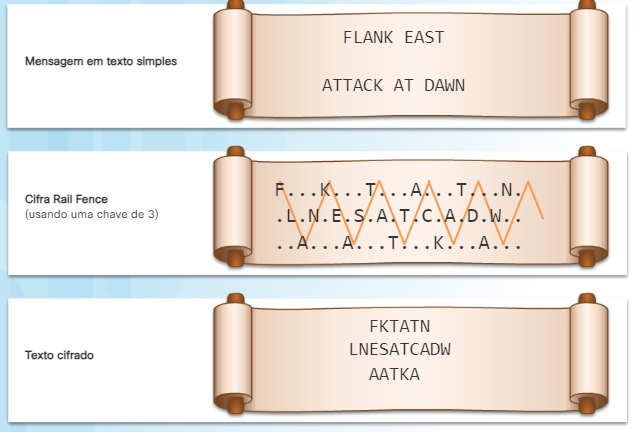
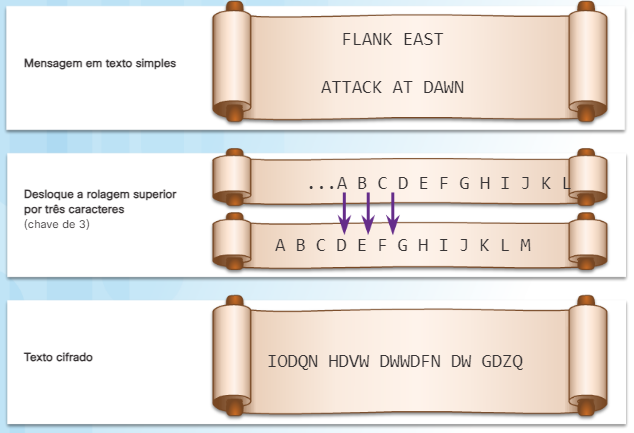
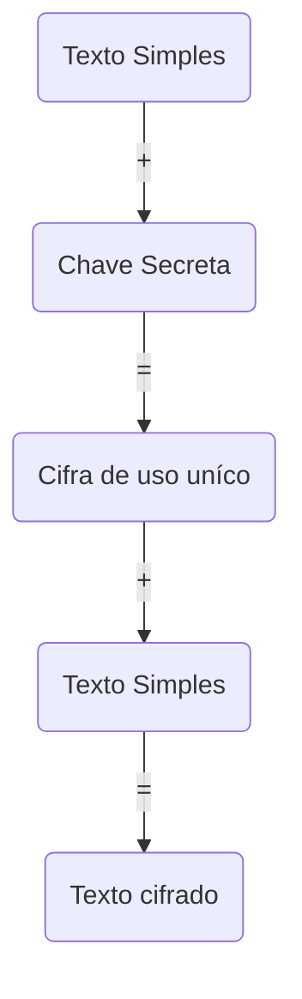
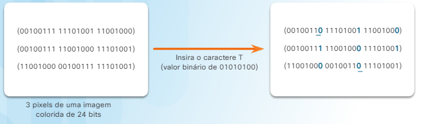

Table of Contents 🔖

- [Capítulo 4: A Arte de Proteger Segredos](#capítulo-4-a-arte-de-proteger-segredos)
  - [4.1 Criptografia](#41-criptografia)
    - [4.1.1 Descrição Geral](#411-descrição-geral)
      - [4.1.1.1 O que é Criptografia?](#4111-o-que-é-criptografia)
      - [4.1.1.2 A História da Criptografia](#4112-a-história-da-criptografia)
      - [4.1.1.3 Criando Texto Cifrado](#4113-criando-texto-cifrado)
      - [4.1.1.4 Atividade — Explorando a Cifra Vigenère](#4114-atividade--explorando-a-cifra-vigenère)
      - [4.1.1.5 Os Dois tipos de Cifragem](#4115-os-dois-tipos-de-cifragem)
    - [4.1.2 Criptografia de Chave Privada](#412-criptografia-de-chave-privada)
      - [4.1.2.1 O processo de Criptografia Simétrica](#4121-o-processo-de-criptografia-simétrica)
      - [4.1.2.2 Tipos de Criptografia](#4122-tipos-de-criptografia)
      - [4.1.2.3 Algoritmos de Criptografia Simétrica](#4123-algoritmos-de-criptografia-simétrica)
      - [4.1.2.4 Atividade - Usando Criptografia Simétrica](#4124-atividade---usando-criptografia-simétrica)
    - [4.1.3 Criptografia de Chave Pública](#413-criptografia-de-chave-pública)
      - [4.1.3.1 O processo de Criptografia Assimétrica](#4131-o-processo-de-criptografia-assimétrica)
      - [4.1.3.2 Algoritmos de Criptografia Assimétrica](#4132-algoritmos-de-criptografia-assimétrica)
      - [4.1.3.3 Atividade - Usando Criptografia Assimétrica](#4133-atividade---usando-criptografia-assimétrica)
    - [4.1.4 Criptografia Simétrica versus Assimétrica](#414-criptografia-simétrica-versus-assimétrica)
      - [4.1.4.1 Gestão de Chaves](#4141-gestão-de-chaves)
      - [4.1.4.2 Comparando Tipos de Criptografia](#4142-comparando-tipos-de-criptografia)
      - [4.1.4.3 Aplicações](#4143-aplicações)
      - [4.1.4.4 Atividade - Comparar Criptografia Simétrica Versus Assimétrica](#4144-atividade---comparar-criptografia-simétrica-versus-assimétrica)
    - [4.2 controlos de Acesso](#42-controlos-de-acesso)
      - [4.2.1 Tipos de controlos de Acesso](#421-tipos-de-controlos-de-acesso)
      - [4.2.1.1 controlos de Acesso Físico](#4211-controlos-de-acesso-físico)
      - [4.2.1.2 controlos de Acesso Lógico](#4212-controlos-de-acesso-lógico)
      - [4.2.1.3 Controlos de Acesso Administrativo](#4213-controlos-de-acesso-administrativo)
    - [4.2.2 Estratégias de Controlo de Acesso](#422-estratégias-de-controlo-de-acesso)
      - [4.2.2.1 Controlo de Acesso Obrigatório](#4221-controlo-de-acesso-obrigatório)
      - [4.2.2.2 Controlo de Acesso Discricionário](#4222-controlo-de-acesso-discricionário)
      - [4.2.2.3 Controlo de Acesso baseado na Função](#4223-controlo-de-acesso-baseado-na-função)
      - [4.2.2.4 controlo de acesso baseado em regras](#4224-controlo-de-acesso-baseado-em-regras)
      - [4.2.2.5 Atividade - Identifique Estratégias de controlo de Acesso](#4225-atividade---identifique-estratégias-de-controlo-de-acesso)
    - [4.2.3 Identificação](#423-identificação)
      - [4.2.3.1 O que é Identificação?](#4231-o-que-é-identificação)
      - [4.2.3.2 Controlos de Identificação](#4232-controlos-de-identificação)
    - [4.2.4 Métodos de Autenticação](#424-métodos-de-autenticação)
      - [4.2.4.1 O que se Sabe](#4241-o-que-se-sabe)
      - [4.2.4.2 O que se Tem](#4242-o-que-se-tem)
      - [4.2.4.3 Quem se É](#4243-quem-se-é)
      - [4.2.4.4 Autenticação Multifator](#4244-autenticação-multifator)
      - [4.2.4.5 Atividade - Identificar Métodos de Autenticação](#4245-atividade---identificar-métodos-de-autenticação)
    - [4.2.5 Autorização](#425-autorização)
      - [4.2.5.1 O que é Autorização?](#4251-o-que-é-autorização)
      - [4.2.5.2 Usando a Autorização](#4252-usando-a-autorização)
    - [4.2.6 Responsabilidade](#426-responsabilidade)
      - [4.2.6.1 O que é Registo?](#4261-o-que-é-registo)
      - [4.2.6.2 Implementando Registo](#4262-implementando-registo)
    - [4.2.7 Tipos de controlos de Segurança](#427-tipos-de-controlos-de-segurança)
      - [4.2.7.1 controlos Preventivos](#4271-controlos-preventivos)
      - [4.2.7.2 controlos Dissuasores](#4272-controlos-dissuasores)
      - [4.2.7.3 controlos de Detetive](#4273-controlos-de-detetive)
      - [4.2.7.4 controlos Corretivos](#4274-controlos-corretivos)
      - [4.2.7.5 controlos de Recuperação](#4275-controlos-de-recuperação)
      - [4.2.7.6 controlos Compensativos](#4276-controlos-compensativos)
      - [4.2.7.7 Atividade — Comparar Tipos de controlos de Segurança](#4277-atividade--comparar-tipos-de-controlos-de-segurança)
    - [4.3 Obscurecendo dados](#43-obscurecendo-dados)
      - [4.3.1 Mascaramento de Dados](#431-mascaramento-de-dados)
      - [4.3.1.1 O que é Mascaramento de Dados?](#4311-o-que-é-mascaramento-de-dados)
      - [4.3.1.2 Técnicas de Mascaramento de Dados](#4312-técnicas-de-mascaramento-de-dados)
    - [4.3.2 Esteganografia](#432-esteganografia)
      - [4.3.2.1 O que é Esteganografia?](#4321-o-que-é-esteganografia)
      - [4.3.2.2 Técnicas de Esteganografia](#4322-técnicas-de-esteganografia)
      - [4.3.2.3 Laboratório — Usando Esteganografia](#4323-laboratório--usando-esteganografia)
      - [4.3.2.4 Esteganografia Social](#4324-esteganografia-social)
      - [4.3.2.5 Detecção](#4325-detecção)
    - [4.3.3 Ofuscação de dados](#433-ofuscação-de-dados)
      - [4.3.3.1 Ofuscação](#4331-ofuscação)
      - [4.3.3.2 Aplicações](#4332-aplicações)
      - [4.3.3.3 Packet Tracer - Configurando o Modo de Transporte VPN](#4333-packet-tracer---configurando-o-modo-de-transporte-vpn)
      - [4.3.3.4 Packet Tracer — Configurando o modo de túnel VPN](#4334-packet-tracer--configurando-o-modo-de-túnel-vpn)
  - [Conclusão: Capítulo 4: A Arte de Proteger os Segredos](#conclusão-capítulo-4-a-arte-de-proteger-os-segredos)

# Capítulo 4: A Arte de Proteger Segredos

Os princípios da criptografia explicam como os protocolos e algoritmos modernos protegem as comunicações. **Criptologia é a ciência de fazer e quebrar códigos secretos**. O desenvolvimento e uso de códigos é a criptografia. **Estudar e quebrar códigos é criptoanálise**. A sociedade usa criptografia há vários séculos para proteger documentos secretos.

> Por exemplo, Júlio César usou uma simples cifra alfabética para cifrar mensagens para os seus generais no campo. Os seus generais teriam conhecimento da chave de cifra necessária para decifrar as mensagens.

Hoje, os métodos criptográficos modernos garantem comunicações seguras.

O controlo de acesso é, como o próprio nome sugere, uma maneira de controlar o acesso a um edifício, uma sala, um sistema, uma base de dados, um ficheiro e informações. As organizações empregam uma variedade de técnicas de controlo de acesso para proteger a confidencialidade. Este capítulo examinará as quatro etapas no processo de controlo de acesso: 

1. identificação, 
2. autenticação, 
3. autorização e
4. registo.

Além disso, o capítulo descreve os diferentes modelos de controlo de acesso e tipos de controlo de acesso.

O capítulo conclui discutindo as várias maneiras como os utilizadores mascaram dados. A **ofuscação dos dados** e a **esteganografia** são duas técnicas utilizadas para realizar o mascaramento de dados.

## 4.1 Criptografia

### 4.1.1 Descrição Geral

#### 4.1.1.1 O que é Criptografia?

A criptografia é uma maneira de armazenar e transmitir dados para que somente o destinatário pretendido possa lê-los ou processá-los. A criptografia moderna usa algoritmos computacionalmente seguros para garantir que os cibercriminosos não possam comprometer facilmente informações protegidas.

A confidencialidade dos dados garante a privacidade para que somente o destinatário pretendido possa ler a mensagem. As partes conseguem isso através de criptografia. A criptografia é o processo de embaralhar dados para que uma parte não autorizada não possa lê-los facilmente.

Ao habilitar a criptografia, os dados legíveis são texto simples ou texto em claro, enquanto a versão cifrada é texto criptografado ou texto cifrado. A criptografia converte a mensagem legível de texto simples em texto cifrado, que é a mensagem ilegível e disfarçada. A desencriptação inverte o processo. A criptografia também requer uma chave, que desempenha um papel fundamental na encriptação e desencriptação de uma mensagem. A pessoa que possui a chave pode decifrar o texto cifrado para texto simples.

Historicamente, as partes usaram vários algoritmos e métodos de criptografia. Um algoritmo é o processo ou fórmula usada para resolver um problema. Diz-se que Júlio César protegeu as mensagens colocando dois conjuntos do alfabeto, lado a lado, e depois deslocando um deles em um número específico de posições. O número de posições no turno serve como a chave. Ele converteu texto simples em texto cifrado usando esta chave, e apenas os seus generais, que também tinham a chave, sabiam como decifrar as mensagens. Este método é a cifra César. A figura mostra uma mensagem secreta usando a cifra César.

#### 4.1.1.2 A História da Criptografia

A história da criptografia começou em círculos diplomáticos há milhares de anos. Mensageiros da corte de um rei levavam mensagens criptografadas para outras cortes. Ocasionalmente, outras cortes não envolvidas na comunicação, tentavam roubar mensagens enviadas para um reino que eles consideravam um adversário. Pouco tempo depois, comandantes militares começaram a usar criptografia para proteger mensagens.

Ao longo dos séculos, vários métodos de criptografia, dispositivos físicos e ajudas, cifraram e decifraram texto:

Scytale

Cifra César

Cifra Vigenère

Máquina Enigma

Todos os métodos de cifra usam uma chave para cifrar ou decifrar uma mensagem. A chave é um componente importante no algoritmo de criptografia. Um algoritmo de criptografia é tão bom quanto a chave usada. Quanto mais complexidade envolvida, mais seguro o algoritmo. A gestão de chaves é uma peça importante no processo.

#### 4.1.1.3 Criando Texto Cifrado

Cada método de criptografia usa um algoritmo específico, chamado cifra, para cifrar e decifrar mensagens. Uma cifra é uma série de etapas bem definidas usadas para cifrar e decifrar mensagens. Existem vários métodos para criar texto cifrado:

Transposição — as letras são reorganizadas

Substituição — as letras são substituídas

Bloco único — texto simples combinado com uma chave secreta cria um novo caractere, em seguida, combina com o texto simples para produzir texto cifrado

Algoritmos de criptografia antigos, como a cifra César ou a máquina Enigma, dependiam do sigilo do algoritmo para alcançar a confidencialidade. Com a tecnologia moderna, onde a **engenharia reversa** é muitas vezes simples, as partes usam algoritmos de domínio público. Com a maioria dos algoritmos modernos, a decifragem bem-sucedida requer conhecimento das chaves criptográficas apropriadas. Isso significa que **a segurança da criptografia reside no sigilo das chaves, não no algoritmo**.

> Alguns algoritmos de criptografia modernos ainda usam transposição como parte do algoritmo.

A gestão de chaves é a parte mais difícil de projetar um sistema de criptografia. Muitos sistemas criptográficos falharam por causa de erros em seu gerenciamento de chaves, e todos os algoritmos criptográficos modernos exigem procedimentos de gerenciamento chave. Na prática, a maioria dos ataques a sistemas criptográficos envolve atacar o sistema de gestão de chaves, em vez do próprio algoritmo criptográfico.

#### 4.1.1.4 Atividade — Explorando a [Cifra Vigenère](https://pt.wikipedia.org/wiki/Cifra_de_Vigen%C3%A8re)

#### 4.1.1.5 Os Dois tipos de Cifragem

A cifragem criptográfica pode fornecer confidencialidade incorporando várias ferramentas e protocolos. Existem duas abordagens para garantir a segurança dos dados ao usar criptografia:

A primeira é **proteger o algoritmo**. Se a segurança de um sistema de criptografia depende do sigilo do próprio algoritmo, o aspecto mais importante é proteger o algoritmo a todo custo. Toda vez que alguém descobre os detalhes do algoritmo, todas as partes envolvidas precisam de mudar o algoritmo. Essa abordagem não parece muito segura ou gerenciável.

A segunda abordagem é **proteger as chaves**. Com a criptografia moderna, os algoritmos são públicos. As chaves criptográficas garantem o sigilo dos dados. As chaves criptográficas são palavras-passe que fazem parte da entrada num algoritmo de criptografia juntamente com os dados que exigem criptografia.

Existem duas classes de algoritmos de criptografia:

Algoritmos **simétricos**- Esses algoritmos usam a mesma chave pré-compartilhada, às vezes chamada de par de chaves secretas, para cifrar e decifrar dados. Tanto o remetente quanto o receptor conhecem a chave pré-compartilhada antes que qualquer comunicação criptografada comece. 

Como mostrado na acima, algoritmos simétricos usam a mesma chave para cifrar e decifrar o texto simples. Os algoritmos de criptografia que usam uma chave comum são mais simples e precisam de menos poder computacional.

Algoritmos **assimétricos** - Algoritmos de criptografia assimétricos usam uma chave para cifrar dados e uma chave diferente para decifrar dados. Uma chave é pública e a outra é privada. Num sistema de criptografia de chave pública, qualquer pessoa pode cifrar uma mensagem usando a chave pública do receptor, e o receptor é o único que pode decifra-la usando sua chave privada. As partes trocam mensagens seguras sem precisar de uma chave pré-compartilhada, conforme mostrado na figura seguir.

Algoritmos assimétricos são mais complexos. Esses algoritmos consomem muitos recursos e são mais lentos para executar.

### 4.1.2 Criptografia de Chave Privada

#### 4.1.2.1 O processo de Criptografia Simétrica

Algoritmos simétricos usam a mesma chave pré-compartilhada para cifrar e decifrar dados, um método também conhecido como criptografia de **chave privada**, usa um algoritmo simétrico.

> Por exemplo, Alice e Bob vivem em locais diferentes e querem trocar mensagens secretas entre si através do sistema de correio. Alice quer enviar uma mensagem secreta para Bob.
> 
> Eles têm chaves idênticas a um único cadeado. A troca de chaves aconteceu antes de enviar mensagens secretas. Alice escreve uma mensagem secreta e coloca em uma pequena caixa que ela bloqueia usando o cadeado. Ela envia a caixa para Bob. A mensagem é segura dentro da caixa, pois a caixa faz o seu caminho através do sistema de correios. Quando Bob recebe a caixa, ele usa sua chave para desbloquear o cadeado e recuperar a mensagem. Bob pode usar a mesma caixa e cadeado para enviar uma resposta secreta de volta para Alice.
> 
> Se Bob quiser falar com Carol, ele precisa de uma nova chave pré-compartilhada para essa comunicação, a fim de mantê-la em segredo de Alice. Quanto mais pessoas Bob quer se comunicar com segurança, mais chaves ele vai precisar de gerir.

#### 4.1.2.2 Tipos de Criptografia

Os tipos mais comuns de criptografia são cifras de bloco e cifras de fluxo. Cada método difere na forma como agrupa bits de dados para criptografá-los.

- Cifras de bloco

    As cifras de bloco **transformam um bloco de comprimento fixo de texto simples num bloco comum de texto cifrado de 64 ou 128 bits**. O tamanho do bloco é a quantidade de dados criptografados a qualquer momento. Para decifrar esse texto cifrado, aplique a transformação inversa ao bloco de texto cifrado, usando a mesma chave secreta.
	
    As cifras de bloco geralmente resultam em dados de saída maiores que os dados de entrada, porque o texto cifrado deve ser um múltiplo do tamanho do bloco. 
    > Por exemplo, **Data Encryption Standard** (DES) é um algoritmo simétrico que criptografa blocos em blocos de 64 bits usando uma chave de 56 bits. Para fazer isso, o algoritmo de bloco leva dados um pedaço de cada vez, por exemplo, 8 bytes por pedaço, até que o bloco inteiro esteja cheio. Se houver menos dados de entrada do que um bloco completo, o algoritmo adiciona dados artificiais, ou espaços em branco, até usar os 64 bits completos.

- Cifras de fluxo

    Ao contrário das cifras de bloco, as cifras de fluxo **criptografam texto simples um byte ou um bit de cada vez**. Pense em cifras de fluxo como uma cifra de bloco com um tamanho de bloco de um bit. Com uma cifra de fluxo, a transformação dessas unidades de texto simples menores varia, dependendo de quando elas são encontradas durante o processo de criptografia. As cifras de fluxo podem ser muito mais rápidas do que as cifras de bloco, e geralmente não aumentam o tamanho da mensagem, porque podem cifrar um número arbitrário de bits.
	> A5 é uma cifra de fluxo que fornece privacidade de voz e cifra comunicações de telefone celular. Também é possível usar DES no modo de cifra de fluxo, com um bit por vez.

Sistemas criptográficos complexos podem combinar bloco e fluxo no mesmo processo.

#### 4.1.2.3 Algoritmos de Criptografia Simétrica

Numerosos sistemas de criptografia usam criptografia simétrica. Alguns dos padrões comuns de criptografia que usam criptografia simétrica incluem o seguinte:

- DES, opera sempre em blocos de igual tamanho e usa permutações e substituições no algoritmo. Uma permutação é uma maneira de organizar todos os elementos de um conjunto.

- **DES triplo** (3DES) criptografa dados três vezes e usa uma chave diferente para pelo menos uma das três passagens, dando-lhe um tamanho de chave cumulativo de 112-168 bits. O 3DES é resistente ao ataque, mas é muito mais lento que o DES.

    O ciclo de criptografia 3DES é o seguinte:

    1. Dados criptografados pelo primeiro DES
    2. Dados descriptografados pelo segundo DES
    3. Dados recriptografados pelo terceiro DES

    O processo inverso decifra o texto cifrado.

- **International Data Encryption Algorithm** (IDEA) usa blocos de 64 bits e chaves de 128 bits. IDEA executa oito rodadas de transformações em cada um dos 16 blocos que resultam da divisão de cada bloco de 64 bits.
IDEA foi o substituto para DES, e agora o PGP (Pretty Good Privacy) usa-o. PGP é um programa que fornece privacidade e autenticação para comunicação de dados. GNU Privacy Guard (GPG) é uma versão licenciada e gratuita do PGP.

- **Advanced Encryption Standard** (AES) tem um tamanho de bloco fixo de 128 bits com um tamanho de chave de 128, 192 ou 256 bits. O National Institute of Standards and Technology (NIST) aprovou o algoritmo AES em dezembro de 2001. O governo dos EUA usa AES para proteger informações confidenciais.
AES é um algoritmo forte que usa comprimentos de chave mais longos. O AES é mais rápido que o DES e o 3DES, por isso fornece uma solução para aplicações de software, bem como o uso de hardware em firewalls e routers.

Outras cifras de bloco incluem **Skipjack** (desenvolvido pela NSA), **Blowfish** e **Twofish**.

#### 4.1.2.4 Atividade - Usando Criptografia Simétrica

> Uso do site http://des.online-domain-tools.com para rodar encriptagens.

### 4.1.3 Criptografia de Chave Pública

#### 4.1.3.1 O processo de Criptografia Assimétrica

A criptografia assimétrica, também chamada de criptografia de chave pública, usa uma chave para cifrar diferente da chave usada para decifrar. Um criminoso não pode calcular a chave de decifrar com base no conhecimento da chave de cifrar, e vice-versa, em qualquer período razoável de tempo. Usando Bob e Alice do exemplo passado:

> Desta vez eles não trocam chaves antes de enviar mensagens secretas. Em vez disso, têm um cadeado separado com chaves correspondentes separadas.  
> Para Alice enviar uma mensagem secreta para Bob, ela deve primeiro entrar em contato com ele e pedir-lhe para enviar seu cadeado aberto para ela. Bob manda o cadeado, mas mantém a chave dele.
> 
> Quando Alice recebe o cadeado, ela escreve a sua mensagem secreta e coloca numa pequena caixa. Ela também coloca seu cadeado aberto na caixa, mas mantém sua chave.  
> Ela então tranca a caixa com o cadeado do Bob. Quando Alice tranca a caixa, ela não é mais capaz de entrar porque ela não tem uma chave para esse cadeado. Ela envia a caixa para Bob e, à medida que a caixa viaja pelo sistema de correio, ninguém é capaz de abri-lo. Quando Bob recebe a caixa, ele pode usar sua chave para desbloquear a caixa e recuperar a mensagem de Alice.
> 
> Para enviar uma resposta segura, Bob coloca sua mensagem secreta na caixa, juntamente com seu cadeado aberto, e bloqueia a caixa usando o cadeado de Alice. Bob envia a caixa segura de volta para Alice.

Em resumo:
1. Alice solicita e obtém a chave pública de Bob.
2. Alice usa a chave pública de Bob para cifrar uma mensagem usando um algoritmo acordado.
3. Alice envia a mensagem criptografada para Bob, e Bob então usa sua chave privada para decifrar a mensagem.

#### 4.1.3.2 Algoritmos de Criptografia Assimétrica

Algoritmos assimétricos usam fórmulas que qualquer um pode procurar. O par de chaves não relacionadas é o que torna esses algoritmos seguros. Os algoritmos assimétricos incluem:

- **RSA** (Rivest-Shamir-Adleman) - usa o produto de dois números primos muito grandes com um comprimento igual entre 100 e 200 dígitos. Os navegadores usam o RSA para estabelecer uma conexão segura.

- **Diffie-Hellman** - fornece um método de troca eletrónica para compartilhar a chave secreta. Protocolos seguros, como **Secure Sockets Layer** (SSL), Transport Layer Security (TLS), Secure Shell (SSH) e **Internet Protocol Security** (IPsec), usam Diffie-Hellman.

- **ElGamal** - usa o padrão do governo dos EUA para assinaturas digitais. Este algoritmo é gratuito para uso porque ninguém detém a patente.

- **Elliptic Curve Cryptograph** (ECC) - usa curvas elípticas como parte do algoritmo. Nos EUA, a Agência de Segurança Nacional usa a ECC para geração de assinaturas digitais e troca de chaves.

#### 4.1.3.3 Atividade - Usando Criptografia Assimétrica

Chaves:

1. Privada Bob
2. Pública Bob
3. Pública Jane
4. Privada Jane

### 4.1.4 Criptografia Simétrica versus Assimétrica

#### 4.1.4.1 Gestão de Chaves

A gestão de chaves inclui a geração, troca, armazenamento, uso e substituição de chaves usadas num algoritmo de criptografia.

A gestão de chaves é a parte mais difícil de projetar um sistema de criptografia. Muitos sistemas criptográficos falharam por causa de erros nos seus procedimentos de gestão de chaves. **Na prática, a maioria dos ataques a sistemas criptográficos visa o nível de gestão de chaves, em vez do próprio algoritmo criptográfico**.

- Geração de Chaves
- Verificação de Chaves
- Troca de Chaves
- Armazenamento de Chaves
- Tempo de vida de chave
- Revogação e Destruição de Chaves

Dois termos usados para descrever chaves são:

- Comprimento da chave - Também chamado de tamanho da chave, esta é a medida em bits.
- Keyspace - Este é o número de possibilidades que um comprimento de chave específico pode gerar.

À medida que o comprimento da chave aumenta, o keyspace aumenta exponencialmente. O espaço chave de um algoritmo é o conjunto de todos os valores-chave possíveis. Chaves mais longas são mais seguras; no entanto, elas também consomem mais recursos.

Quase todos os algoritmos têm algumas chaves fracas no seu keyspace que permitem que um criminoso quebre a criptografia através de um atalho.

#### 4.1.4.2 Comparando Tipos de Criptografia

É importante entender as diferenças entre métodos de criptografia simétrica e assimétrica. **Os sistemas de criptografia simétrica são mais eficientes e podem lidar com mais dados**. No entanto, a gestão de chaves com sistemas de criptografia simétricos **é mais problemático e mais difícil de gerir**.

**A criptografia assimétrica é mais eficiente na proteção da confidencialidade de pequenas quantidades de dados**, e o seu tamanho e velocidade tornam-a **mais segura para tarefas como troca eletrónica de chaves**, que é uma pequena quantidade de dados em vez de criptografar grandes blocos de dados.

Manter a confidencialidade é importante tanto para os dados em repouso quanto para os dados em movimento. Em ambos os casos, a criptografia simétrica é favorecida devido à sua velocidade e à simplicidade do algoritmo. Alguns algoritmos assimétricos podem aumentar significativamente o tamanho do objeto criptografado.

Portanto, **no caso de dados em movimento, use criptografia de chave pública para trocar a chave secreta e, em seguida, criptografia simétrica para garantir a confidencialidade dos dados enviados**.

#### 4.1.4.3 Aplicações

Existem muitas aplicações para algoritmos simétricos e assimétricos.

Um **token** gerador de senha única **é um dispositivo de hardware que usa criptografia para gerar uma palavra-passe de uso único**, é uma sequência de caracteres numérica ou alfanumérica gerada automaticamente que autentica um utilizador para uma transação de apenas uma sessão. O número muda a cada 30 segundos ou mais. A palavra-passe da sessão aparece em uma tela e o utilizador insere a senha.

A indústria de pagamentos eletrônicos utiliza 3DES. Os sistemas operativos usam o DES para proteger os ficheiros do utilizador e os dados do sistema com senhas. A maioria dos sistemas de ficheiros de criptografia, como NTFS, usa AES.

Quatro protocolos usam algoritmos de chave assimétrica:

- **Internet Key Exchange** (IKE), que é um componente fundamental das Redes Privadas Virtuais IPsec (VPNs).
- **Secure Socket Layer** (SSL), que é um meio de implementar criptografia em um navegador da web.
- **Secure Shell** (SSH), que é um protocolo que fornece uma conexão segura de acesso remoto aos dispositivos de rede.
- **Pretty Good Privacy** (PGP), que é um programa de computador que fornece privacidade criptográfica e autenticação para aumentar a segurança das comunicações por e-mail.

Uma VPN é uma rede privada que usa uma rede pública, geralmente a Internet, para criar um canal de comunicação seguro. Uma VPN conecta dois endpoints, como dois escritórios remotos pela Internet para formar a conexão.
As VPNs usam **IPsec, que é um conjunto de protocolos desenvolvidos para alcançar serviços seguros através de redes**. **Permitem autenticação, integridade, controlo de acesso e confidencialidade**. Com o IPsec, os locais remotos podem trocar informações criptografadas e verificadas.

Os dados em uso são uma preocupação crescente para muitas organizações. Quando em uso, os dados não têm mais nenhuma proteção porque o utilizador precisa abrir e alterar os dados. A memória do sistema mantém os dados em uso e pode conter dados confidenciais, como a chave de criptografia. Se os criminosos comprometerem os dados em uso, eles terão acesso aos dados em repouso e em movimento.

#### 4.1.4.4 Atividade - Comparar Criptografia Simétrica Versus Assimétrica

| Descriçáo do Tipo de Criptografia                                                    | Simétrico | Assimétrico |
| ------------------------------------------------------------------------------------ |:---------:|:-----------:|
| Compartilhe uma chave comum para cifrar e decifrar.                                  |     x     |             |
| Mais rápido e usa menos recursos de processamento.                                   |     x     |             |
| O gerenciamento de chaves pode ser um problema à medida que o número de utilizadores |     x     |             |
| aumenta.                                                                             |           |      x      |
| Lisa RSA (Rivest-Shamir-Adleman).                                                    |     x     |             |
| Usa Digital Encryption Standard (DES).                                               |           |      x      |
| Usado por aplicativos como IKE, SSH, PGP e SSL.                                      |           |      x      |
| Normalmente requer um serviço de gerenciamento de chaves de terceiros.               |           |      x      |
| Use uma chave pública para cifrar e chave privada para decifrar.                     |           |      x      |

### 4.2 controlos de Acesso

#### 4.2.1 Tipos de controlos de Acesso

#### 4.2.1.1 controlos de Acesso Físico

Os controlos de acesso físico **são barreiras reais implantadas para evitar o contato direto com os sistemas**. O objetivo é impedir que utilizadores não autorizados obtenham acesso físico a instalações, equipamentos e outros ativos organizacionais.

O controlo de acesso físico determina quem pode entrar (ou sair), onde eles podem entrar (ou sair) e quando eles podem entrar (ou sair).

Exemplos de controlos de acesso físico incluem o seguinte:

> Guardas monitoram a instalação
> Cercas protegem o perímetro
> Detectores de movimento detectam objetos em movimento
> Fechaduras para computadores portáteis salvaguardam equipamentos portáteis
> Portas trancadas impedem acesso não autorizado
> Cartões magnéticos permitem acesso a áreas restritas
> Cães de guarda protegem a instalação
> Câmeras de vídeo monitoram uma instalação coletando e gravando imagens
> As armadilhas permitem o acesso à área protegida após o fecho da porta 1
> Alarmes detectam intrusão

#### 4.2.1.2 controlos de Acesso Lógico

controlos de acesso lógicos **são as soluções de hardware e software usadas para gerir o acesso a recursos e sistemas**. Essas soluções baseadas em tecnologia incluem ferramentas e protocolos que os sistemas de computador usam para identificação, autenticação, autorização e registo.

Os controlos de acesso lógico incluem o seguinte:

> Criptografia é o processo de tomada de texto simples e criação de texto cifrado  
> Os cartões inteligentes têm um microchip incorporado  
> Palavras-passe são sequências de caracteres protegidos  
> Biometria são características físicas dos utilizadores  
> As listas de controlo de acesso (ACLs) definem o tipo de tráfego permitido numa rede  
> Protocolos são um conjunto de regras que regem a troca de dados entre dispositivos  
> Firewalls impedem tráfego de rede indesejado  
> Routers conectam pelo menos duas redes  
> Sistemas de Detecção de Intrusão monitoram uma rede em busca de atividades suspeitas  
> Níveis de corte são determinados limites permitidos para erros antes de acionar um sinalizador vermelho  

#### 4.2.1.3 Controlos de Acesso Administrativo

controlos de acesso administrativo **são as políticas e procedimentos definidos pelas organizações para implementar e aplicar todos os aspectos do controlo de acesso não autorizado**. Os controlos administrativos concentram-se em pessoal e práticas comerciais. Os controlos administrativos incluem o seguinte:

> Políticas são declarações de intenções  
> Procedimentos são as etapas detalhadas necessárias para realizar uma atividade  
> As práticas de contratação envolvem as etapas que uma organização toma para encontrar funcionários qualificados  
> A verificação de antecedentes é uma triagem de emprego que inclui informações de verificação de emprego anterior, histórico de crédito e histórico criminal  
> A classificação de dados categoriza os dados com base na sua sensibilidade  
> Treino em segurança educa os funcionários sobre as políticas de segurança de uma organização  
> As análises avaliam o desempenho do trabalho de um funcionário  

### 4.2.2 Estratégias de Controlo de Acesso

#### 4.2.2.1 Controlo de Acesso Obrigatório

O controlo de acesso obrigatório (MAC) **restringe as ações que um sujeito pode executar em um objeto**. Um sujeito pode ser um utilizador ou um processo. Um objeto pode ser um ficheiro, uma porta ou um dispositivo de entrada/saída. Uma regra de autorização impõe se um sujeito pode ou não aceder ao objeto.

As organizações usam o MAC onde existem diferentes níveis de classificações de segurança. Cada objeto tem um rótulo e cada assunto tem uma autorização. Um sistema MAC restringe um assunto com base na classificação de segurança do objeto e na etiqueta anexada ao utilizador.

> Por exemplo, considere as classificações de segurança militar Secret e Top secret. Se um ficheiro (um objeto) for considerado secreto, ele será classificado (rotulado) Top Secret. As únicas pessoas (sujeitos) que podem visualizar o ficheiro (objeto) são aqueles com uma autorização Top Secret. Cabe ao mecanismo de controlo de acesso garantir que um indivíduo (sujeito) com apenas uma autorização secreta, nunca tenha acesso a um arquivo rotulado como Top Secret.  
> Da mesma forma, um utilizador (sujeito) autorizado para acesso Top Secret não pode alterar a classificação de um ficheiro (objeto) rotulado Top Secret para Secret. Além disso, um utilizador Top Secret não pode enviar um ficheiro Top Secret para um utilizador com autorização apenas para ver as informações Secret.

#### 4.2.2.2 Controlo de Acesso Discricionário

O proprietário de um objeto determina se deve permitir o acesso a um objeto com controlo de acesso discricionário (DAC). O DAC **concede ou restringe o acesso ao objeto determinado pelo proprietário do objeto**. Como o nome indica, os controlos são discricionários porque um proprietário de objeto com certas permissões de acesso pode transmitir essas permissões para outro sujeito.

Em sistemas que empregam controlos de acesso discricionários, o proprietário de um objeto pode decidir quais sujeitos podem aceder esse objeto e que acesso específico eles podem ter. 

> Um método comum para realizar isso é com permissões, onde o Administrador pode conceder uma série de atribuições (leitura/gravação/execução/...) ao(s) usuário(s) desejado(s).

As listas de controlo de acesso são outro mecanismo comum usado para implementar o controlo de acesso discricionário. Uma lista de controlo de acesso usa regras para determinar que tráfego pode entrar ou sair de uma rede

#### 4.2.2.3 Controlo de Acesso baseado na Função

O controlo de acesso baseado na função (RBAC) **depende do papel do sujeito**. Cargos são funções de trabalho dentro de uma organização. Funções específicas exigem permissões para executar determinadas operações. Os utilizadores adquirem permissões através de sua função.

O RBAC pode trabalhar em combinação com DAC ou MAC aplicando as políticas de qualquer um. O RBAC ajuda a implementar a administração de segurança em grandes organizações com centenas de utilizadores e milhares de permissões possíveis. As organizações aceitam amplamente o uso do RBAC para gerir permissões de computador dentro de um sistema ou aplicação como uma prática recomendada.

#### 4.2.2.4 controlo de acesso baseado em regras

O controlo de acesso baseado em regras usa listas de controlo de acesso (ACLs) para ajudar a determinar se deve conceder acesso. Uma série de regras está contida na ACL, como mostrado a seguir:

- Hora do Dia
- Membros do Grupo
- Necessidade de Saber
- Propriedades do Objeto
- Classifcação do Assunto

**A determinação da concessão de acesso depende dessas regras**.

> Um exemplo de tal regra é aquele que afirma que nenhum funcionário pode ter acesso ao ficheiro de folha de pagamento após o expediente ou nos fins de semana.

Tal como acontece com o MAC, os utilizadores não podem alterar as regras de acesso. As organizações podem combinar controlo de acesso baseado em regras com outras estratégias para implementar restrições de acesso. Por exemplo, os métodos MAC podem utilizar uma abordagem baseada em regras para implementação.

#### 4.2.2.5 Atividade - Identifique Estratégias de controlo de Acesso

> [!WARNING]
> Duas opções repetidas.

### 4.2.3 Identificação

#### 4.2.3.1 O que é Identificação?

A identificação **impõe as regras estabelecidas pela política de autorização**. Um sujeito solicita acesso a um recurso do sistema. Toda a vez que o sujeito solicita acesso a um recurso, os controlos de acesso determinam se deve conceder ou negar acesso.

> Por exemplo, a política de autorização determina quais atividades um utilizador pode executar em um recurso.

Um identificador único garante a associação adequada entre atividades permitidas e sujeitos. **Um nome de utilizador é o método mais comum usado para identificar um utilizador**. Um nome de utilizador **pode ser uma combinação alfanumérica, um número de identificação pessoal (PIN), um cartão inteligente ou biométrico, como uma impressão digital, análise de retina ou reconhecimento de voz**.

Um identificador exclusivo garante que um sistema possa identificar cada utilizador individualmente; portanto, permitindo que um utilizador autorizado execute as ações apropriadas num recurso específico.

#### 4.2.3.2 Controlos de Identificação

As políticas de segurança cibernética determinam quais controlos de identificação devem ser usados. A sensibilidade da informação e dos sistemas de informação determina o quão rigorosos são os controlos. O aumento das violações de dados obrigou muitas organizações a fortalecer os seus controlos de identificação.

> Por exemplo, a indústria de cartões de crédito nos Estados Unidos exige que todos os fornecedores convertam em sistemas de identificação de cartões inteligentes.

### 4.2.4 Métodos de Autenticação

#### 4.2.4.1 O que se Sabe

Palavras-passe, frases-senha ou PINs são exemplos de **algo que o utilizador conhece**. As palavras-passe são o método mais popular usado para autenticação. Os termos frase de acesso, senha, chave de acesso ou PIN são genericamente chamados de password.

Uma palavra-passe é uma cadeia de caracteres usada para provar a identidade de um utilizador. Se essa sequência de caracteres se relacionar de volta a um utilizador (como um nome, data de nascimento ou endereço), será mais fácil para criminosos cibernéticos adivinhar a senha de um utilizador.

Várias publicações recomendam que uma palavra-passe tenha pelo menos oito caracteres. Os utilizadores não devem criar uma senha tão longa que seja difícil memorizar, ou inversamente, tão curta que se torna vulnerável à quebra de senha. As palavras-passe devem conter uma combinação de letras maiúsculas e minúsculas, números e caracteres especiais. Clique [aqui](https://howsecureismypassword.net) para testar as palavras-passe atuais.

Os utilizadores necessitam de usar palavras-passe diferentes para diferentes sistemas, porque se um criminoso quebrar a palavra-passe do utilizador uma vez, o criminoso terá acesso a todas as contas de um utilizador. Um gestor de palavras-passe pode ajudar um utilizador a criar e lembrar senhas fortes. Clique [aqui](http://strongpasswordgenerator.com) para ver um gerador de palavras-passe forte.

#### 4.2.4.2 O que se Tem

Os cartões inteligentes e as chaves de segurança são exemplos de algo que os utilizadores têm em sua posse.

- Smart Card Security — Um cartão inteligente é um pequeno cartão de plástico, do tamanho de um cartão de crédito, com um pequeno chip embutido nele. O chip é um portador de dados inteligente, capaz de processar, armazenar e proteger dados. Os cartões inteligentes armazenam informações privadas, como números de contas bancárias, identificação pessoal, registos médicos e assinaturas digitais. Os cartões inteligentes fornecem autenticação e criptografia para manter os dados seguros.

- Chave de segurança Fob — Um chaveiro de segurança é um dispositivo que seja pequeno o suficiente para anexar a um chaveiro. Ele usa um processo chamado autenticação de dois fatores, que é mais seguro do que uma combinação de nome de utilizador e palavra-passe. Primeiro, o utilizador insere um número de identificação pessoal (PIN). Se digitado corretamente, o fob da chave de segurança exibirá um número. Este é o segundo fator, que o utilizador deve inserir para fazer login no dispositivo ou na rede.

#### 4.2.4.3 Quem se É

**Uma característica física única, como uma impressão digital, retina ou voz, que identifica um utilizador específico é chamada biometria**. A segurança biométrica compara características físicas com perfis armazenados para autenticar utilizadores. Um perfil é um ficheiro de dados contendo características conhecidas de um indivíduo. O sistema concede ao utilizador acesso se suas características corresponderem às configurações guardadas. Um leitor de impressões digitais é um dispositivo biométrico comum.

Existem dois tipos de identificadores biométricos:

- Características fisiológicas — incluem impressões digitais, DNA, rosto, mãos, retina ou características da orelha
- Características comportamentais - incluem padrões de comportamento, como gestos, voz, ritmo de digitação ou a forma como um utilizador caminha

A biometria está se tornando cada vez mais popular em sistemas de segurança pública, produtos eletrônicos de consumo e aplicações de ponto de venda. A implementação da biometria usa um leitor ou dispositivo de digitalização, software que converte as informações digitalizadas em formato digital e uma base de dados que armazena dados biométricos para comparação.

#### 4.2.4.4 Autenticação Multifator

A autenticação multifator usa pelo menos dois métodos de verificação. Um chaveiro de segurança é um bom exemplo. Os dois fatores são algo que você sabe, como uma palavra-passe, e algo que você tem, como uma chave de segurança fob. Dê um passo adiante adicionando algo que você é, como uma verificação de impressão digital.

A autenticação multifator pode reduzir a incidência de roubo de identidade on-line porque conhecer a palavra-passe não daria acesso a criminosos cibernéticos às informações do utilizador. 

> Por exemplo, um site bancário on-line pode exigir uma palavra-passe e um PIN que o utilizador recebe no seu smartphone.  
> Ou, retirar dinheiro de um ATM é outro exemplo de autenticação multifator. O utilizador deve ter o cartão bancário e saber o PIN antes que o ATM liberte o dinheiro ou talvez usar uma validação biométrica em conjunto.

#### 4.2.4.5 Atividade - Identificar Métodos de Autenticação

| Método          | Descrição                                                             |
| --------------- | --------------------------------------------------------------------- |
| Multi-fator     | Um comando controle remoto e PIN é um bom exemplo                     |
| O que você sabe | Usa senhas, frase de acesso, código de acesso, chave de acesso ou PIN |
| Quem é você     | Usa características fisiológicas                                      |
| O que você tem  | Usa cartões de identificação, crachás e chaves                        |

### 4.2.5 Autorização

#### 4.2.5.1 O que é Autorização?

A autorização **controla o que um utilizador pode e não pode fazer na rede após a autenticação bem-sucedida**. Depois de um utilizador comprovar a sua identidade, o sistema verifica a que recursos de rede o utilizador pode aceder e o que o utilizador pode fazer com os recursos:

- Criar 
- Ler / Copiar
- Atualizar / Editar
- Remover

A autorização usa um conjunto de atributos que descreve o acesso do utilizador à rede. O sistema compara esses atributos à informação contida na base de dados de autenticação, determina um conjunto de restrições para esse usuário e entrega-o ao router local onde o utilizador está conectado.

A autorização é automática e não exige que os utilizadores executem etapas adicionais após a autenticação. Implemente a autorização imediatamente após o utilizador se autenticar.

#### 4.2.5.2 Usando a Autorização

**Definir regras de autorização é a primeira etapa no controlo do acesso**. Uma política de autorização estabelece essas regras.

Uma política de associação de grupo define autorização com base na associação em um grupo específico. Por exemplo, todos os funcionários de uma organização têm um cartão magnético, que fornece acesso à instalação. Se o trabalho de um funcionário não exigir que tenha acesso à sala do servidor, o seu cartão de segurança não permitirá que entre nessa sala.

Uma política de nível de autoridade define permissões de acesso com base na posição de um funcionário dentro da organização. Por exemplo, apenas funcionários de nível superior num departamento de TI podem aceder à sala do servidor.

### 4.2.6 Responsabilidade

#### 4.2.6.1 O que é Registo?

O registo **rastreia uma ação de volta para uma pessoa ou processo que faz a alteração num sistema, coleta essas informações e relata os dados de uso**. A organização pode usar esses dados para fins como auditoria ou faturamento.

Os dados coletados podem incluir o tempo de login de um utilizador, se o login do utilizador foi um sucesso ou falha, ou quais recursos de rede o utilizador acedeu. Isso permite que uma organização rastreie ações, erros e erros durante uma auditoria ou investigação.

#### 4.2.6.2 Implementando Registo

A implementação do registo **consiste em tecnologias, políticas, procedimentos e educação**. Os **arquivos de log** fornecem a informação detalhada baseada nos parâmetros escolhidos.

> Por exemplo, uma organização pode examinar o log para falhas e sucessos de login. Falhas de login podem indicar que um criminoso tentou hackear uma conta. Os sucessos de login informam a uma organização quais utilizadores estão usando que recursos e quando. É normal que um utilizador autorizado aceda à rede corporativa às 3:00 da manhã? As políticas e procedimentos da organização explicam quais ações devem ser gravadas e como os arquivos de log são gerados, revistos e armazenados.

Retenção de dados, eliminação de mídia e requisitos de conformidade fornecem responsabilidade. Muitas leis exigem a implementação de medidas para proteger diferentes tipos de dados. Essas leis orientam uma organização sobre a maneira correta de manipular, armazenar e descartar dados. A educação e a conscientização das políticas, procedimentos e leis relacionadas de uma organização também podem contribuir para a responsabilização.

### 4.2.7 Tipos de controlos de Segurança

#### 4.2.7.1 controlos Preventivos

Prevenir **significa evitar que algo aconteça**. controlos de acesso preventivos impedem que atividades indesejadas ou não autorizadas aconteçam. Para um utilizador autorizado, um controlo de acesso preventivo significa restrições. Atribuir privilégios específicos do utilizador num sistema é um exemplo de controlo preventivo. Mesmo que um utilizador seja um utilizador autorizado, o sistema coloca limites para impedir que o utilizador acesse e execute ações não autorizadas. Uma firewall que bloqueia o acesso a uma porta ou serviço que os criminosos cibernéticos podem explorar também é um controlo preventivo.

#### 4.2.7.2 controlos Dissuasores

Um **dissuasor é o oposto de uma recompensa**. Uma recompensa incentiva os indivíduos a fazer a coisa certa, enquanto um dissuasor **desencoraja-os de fazer a coisa errada**. 

Profissionais de segurança cibernética e organizações usam dissuasores para limitar ou mitigar uma ação ou comportamento, mas os dissuasores não os impedem. O controlo de acesso impede que os criminosos cibernéticos obtenham acesso não autorizado a sistemas de informação e dados confidenciais. Os dissuasores de controlo de acesso desencorajam sistemas de ataque, roubo de dados ou disseminação de código malicioso. As organizações usam dissuasores de controlo de acesso para aplicar políticas de segurança cibernética.

Os dissuasores fazem com que potenciais criminosos cibernéticos pensem duas vezes antes de cometerem um crime. A seguir, uma lista dos dissuasores comuns de controlo de acesso usados no mundo da segurança cibernética:

- Fechaduras 
- Cercas 
- Crachás 
- Guardas
- Armadilhas
- Câmeras
- Alarmes de intrusão
- Separação de responsabilidades
- Ações de sensibilização
- Encriptação
- Auditoria 
- Firewalls

#### 4.2.7.3 controlos de Detetive

A detecção é o **ato ou processo de perceber ou descobrir algo**. Detecções de controlo de acesso identificam diferentes tipos de atividade não autorizada. Os sistemas de detecção podem ser muito simples, como um detetor de movimento ou um guarda de segurança. Eles também podem ser mais complexos, como um sistema de detecção de intrusão.

Todos os sistemas de detetives têm várias coisas em comum; eles **procuram atividades incomuns ou proibidas, estas sendo encontradas, fornecem métodos para registrar ou alertar os operadores de sistemas de acesso potencial não autorizado**. controlos de detetive não impedem que nada aconteça; eles são mais uma medida após o fato.

#### 4.2.7.4 controlos Corretivos

Corretivo **neutraliza algo que é indesejável**. As organizações colocam controlos de acesso corretivos em vigor depois de um sistema experienciar uma ameaça. Os controlos corretivos **restauram o sistema de volta a um estado de confidencialidade, integridade e disponibilidade**.

#### 4.2.7.5 controlos de Recuperação

A recuperação é um retorno a um estado normal. Os controlos de acesso de recuperação **restauram recursos, funções e recursos após uma violação de uma política de segurança**. Os controlos de recuperação podem reparar danos, além de parar qualquer dano adicional. Esses controlos **têm recursos mais avançados em relação aos controlos de acesso corretivos**.

#### 4.2.7.6 controlos Compensativos

Compensar significa suprir algo. Os controlos de acesso compensativos **fornecem opções para outros controlos para reforçar a aplicação em apoio de uma política de segurança**.

Um controlo compensador também pode ser uma substituição utilizada no lugar de um controlo que não é possível nas circunstâncias. Por exemplo, uma organização pode não ser capaz de ter um cão de guarda, então, em vez disso, então, em vez disso, implementa um detetor de movimento com um refletor e um som de latido.

#### 4.2.7.7 Atividade — Comparar Tipos de controlos de Segurança

| Tipo         | Descrição                                                                                                                                                                                                                     |
| ------------ | ----------------------------------------------------------------------------------------------------------------------------------------------------------------------------------------------------------------------------- |
| Recuperação  | Controles que restauram recursos, funçóes e capacidades após uma violaçào da política de segurança.                                                                                                                           |
| Corretivo    | Controles que restauram o sistema de volta a um estado de confidencialidade, integridade e disponibilidade, e retornam os sistemas ao normal após a ocorrência de atividades não autorizadas.                                 |
| Dissuasor    | Controles que desencorajam os cibercriminosos de obter acesso não autorizado a sistemas de informação e/ou dados confidenciais.                                                                                               |
| Preventivo   | Controles que restringem ou impedem que atividades indesejadas ou não autorizadas aconteçam.                                                                                                                                  |
| Detetive     | Controles que podem ser muito simples, como um detector de movimento ou um guarda de segurança. Também podem ser mais complexos, como um sistema de detecção de intrusão.                                                     |
| Compensativo | Controles que fornecem opções para outros controles para reforçar a aplicação e o suporte de uma política de segurança. Também pode ser uma substituição usada em lugar de controle que nào é possível sob as circunstâncias. |

### 4.3 Obscurecendo dados

#### 4.3.1 Mascaramento de Dados

#### 4.3.1.1 O que é Mascaramento de Dados?

A tecnologia de mascaramento de dados **protege os dados substituindo informações confidenciais por uma versão não confidencial**. A versão não sensível parece e age como o original. Isso significa que um processo de negócios pode usar dados não confidenciais e não há necessidade de alterar as aplicações de suporte ou instalações de armazenamento de dados. No caso de uso mais comum, o mascaramento limita a propagação de dados confidenciais em sistemas de TI distribuindo conjuntos de dados substitutos para testes e análises. As informações podem ser mascaradas dinamicamente se o sistema ou aplicação determinar que uma solicitação de utilizador para informações confidenciais é arriscada.

#### 4.3.1.2 Técnicas de Mascaramento de Dados

O mascaramento de dados pode substituir dados confidenciais em ambientes que não sejam de produção para proteger as informações subjacentes.

Existem várias técnicas de mascaramento de dados que podem garantir que os dados permaneçam significativos, mas alterados o suficiente para protegê-los.

- A substituição substitui dados por valores de aparência autênticos para aplicar o anonimato aos registos de dados.
- O embaralhamento deriva um conjunto de substituição da mesma coluna de dados que um utilizador deseja mascarar.
  > Esta técnica funciona bem para informações financeiras numa base de dados de teste, por exemplo.
- A anulação aplica um valor nulo a um campo específico, o que impede completamente a visibilidade dos dados.

### 4.3.2 Esteganografia

#### 4.3.2.1 O que é Esteganografia?

A esteganografia **oculta dados (a mensagem) em outro ficheiro como um gráfico, áudio ou outro ficheiro de texto**. A vantagem da esteganografia sobre a criptografia é que a mensagem secreta não atrai nenhuma atenção especial. Ninguém jamais saberia que uma imagem na verdade continha uma mensagem secreta, visualizando o ficheiro eletronicamente ou em cópia impressa.

Existem vários componentes envolvidos na ocultação de dados. Primeiro, há os dados incorporados, que é a mensagem secreta. O texto da capa (ou capa-imagem ou capa-áudio) oculta os dados incorporados que produzem o stego-text (ou stego-image ou stego-audio). Um stego-key controla o processo de ocultação.

#### 4.3.2.2 Técnicas de Esteganografia

A abordagem usada para incorporar dados em uma imagem de capa utiliza **Bits Menos Significativos** (LSB). Este método usa bits de cada pixel na imagem. Um pixel é a unidade básica de cor programável em uma imagem de computador.

A cor específica de um pixel é uma mistura de três cores: vermelho, verde e azul (RGB). Três bytes de dados especificam a cor de um pixel (um byte para cada cor). Oito bits compõem um byte. Um sistema de cores de 24 bits usa todos os três bytes. LSB usa um bit de cada um dos componentes de cor vermelha, verde e azul. Cada pixel pode armazenar 3 bits.

A figura mostra três pixels de uma imagem colorida de 24 bits. Uma das letras na mensagem secreta é a letra T, e inserir o caractere T muda apenas dois bits da cor. O olho humano não pode reconhecer as mudanças feitas nos pedaços menos significativos. O resultado é um character oculto.

Em média, não mais da metade dos bits de uma imagem precisarão mudar para ocultar uma mensagem secreta de forma eficaz.

#### 4.3.2.3 Laboratório — Usando Esteganografia

O objetivo deste laboratório é usar esteganografia para ocultar um documento dentro de um arquivo JPEG.

[Laboratório - Usando Esteganografia](https://contenthub.netacad.com/legacy/CyberEss/1.1/pp/course/files/4.3.2.3%20Lab%20-%20Using%20Steganography.pdf)

#### 4.3.2.4 Esteganografia Social

A esteganografia social esconde informações à vista, criando uma mensagem que pode ser lida de uma certa maneira por alguns para receber a mensagem. Outros que o veem de uma maneira normal não verão a mensagem. Adolescentes nas redes sociais usam essa tática para comunicar com seus amigos mais próximos, mantendo os outros, como os seus pais, sem saber o que a mensagem realmente significa.

> Por exemplo, a frase “ir ao cinema” pode significar “ir à praia”.

Indivíduos em países que censuram a mídia também usam a esteganografia social para divulgar suas mensagens, escrevendo palavras incorretamente de propósito ou fazendo referências obscuras. Na verdade, eles comunicam com diferentes públicos simultaneamente.

#### 4.3.2.5 Detecção

**Esteganálise é a descoberta de que a informação oculta existe**. O objetivo da esteganálise é descobrir a informação oculta. Padrões no stego-image criam suspeitas. 

> Por exemplo, um disco pode ter áreas não utilizadas que ocultam informações. Os utilitários de análise de disco podem relatar informações ocultas em clusters não utilizados de dispositivos de armazenamento. Os filtros podem capturar pacotes de dados que contêm informações ocultas em cabeçalhos de pacotes de informação. Ambos os métodos usam assinaturas de esteganografia.

Ao comparar uma imagem original com a stego-image, um analista pode captar visualmente padrões repetitivos.

### 4.3.3 Ofuscação de dados

#### 4.3.3.1 Ofuscação

A ofuscação de dados é o uso e a prática de técnicas de mascaramento de dados e esteganografia na profissão de cibersegurança e inteligência cibernética. A ofuscação **é a arte de tornar a mensagem confusa, ambígua ou mais difícil de entender**. Um sistema pode propositadamente embaralhar mensagens para impedir o acesso não autorizado a informações confidenciais.

#### 4.3.3.2 Aplicações

A marca d'água de software protege o software contra acesso ou modificação não autorizados. A marca d'água de software insere uma mensagem secreta no programa como prova de propriedade. A mensagem secreta é a marca d'água do software. Se alguém tentar remover a marca d'água, o resultado é código não funcional.

A ofuscação de software traduz o software em uma versão equivalente ao original, mas que é mais difícil para os invasores analisarem. Tentar fazer a engenharia reversa do software fornece resultados ininteligíveis de um software que ainda funciona.

#### 4.3.3.3 Packet Tracer - Configurando o Modo de Transporte VPN

Nesta atividade, você observará a transferência de tráfego FTP não criptografado e criptografado entre um cliente e um site remoto.

- Enviando tráfego FTP não criptografado
- Configurando o cliente VPN dentro do Metropolis
- Enviando tráfego FTP criptografado

[Packet Tracer - Configurando o Modo de Transporte VPN - Instruções](https://contenthub.netacad.com/legacy/CyberEss/1.1/pp/course/files/4.3.3.3%20Packet%20Tracer%20-%20Configuring%20VPN%20Transport%20Mode.pdf)

[Packet Tracer - Configurando o Modo de Transporte VPN - Atividade](https://contenthub.netacad.com/legacy/CyberEss/1.1/pp/course/files/4.3.3.3%20Packet%20Tracer%20-%20Configuring%20VPN%20Transport%20Mode.pka)

#### 4.3.3.4 Packet Tracer — Configurando o modo de túnel VPN

Nesta atividade, você observará a transferência de tráfego FTP não criptografado entre dois sites geográficos. Em seguida, você configurará um túnel VPN entre dois sites geográficos e enviará tráfego FTP criptografado.

- Enviando tráfego FTP não cifrado
- Configurando o túnel VPN entre Metropolis e Gotham
- Enviando tráfego FTP cifrado

[Packet Tracer - Configurando o Modo de Túnel VPN - Instruções](https://contenthub.netacad.com/legacy/CyberEss/1.1/pp/course/files/4.3.3.4%20Packet%20Tracer%20-%20Configuring%20VPN%20Tunnel%20Mode.pdf)

[Packet Tracer - Configurando o Modo de Túnel VPN - Atividade](https://contenthub.netacad.com/legacy/CyberEss/1.1/pp/course/files/4.3.3.4%20Packet%20Tracer%20-%20Configuring%20VPN%20Tunnel%20Mode.pka)

## Conclusão: Capítulo 4: A Arte de Proteger os Segredos

Este capítulo discutiu os princípios da criptografia usados para proteger as comunicações. O capítulo explicou algoritmos de criptografia simétricos e assimétricos, comparou os dois algoritmos e forneceu exemplos do seu uso.

O capítulo explicou como o controlo de acesso impede o acesso não autorizado a um prédio, uma sala, um sistema ou um ficheiro usando identificação, autenticação, autorização e registo. Além disso, o capítulo também descreveu os diferentes modelos de controlo de acesso e tipos de controlo de acesso.

O capítulo concluiu discutindo as várias maneiras como os utilizadores mascaram dados. Ofuscação de dados e esteganografia são duas técnicas usadas para realizar o mascaramento de dados.