<datails>
Table of Contents 🔖

- [Capítulo 5: A Arte de Garantir a Integridade](#capítulo-5-a-arte-de-garantir-a-integridade)
	- [5.1 Tipos de Controlo de Integridade de Dados](#51-tipos-de-controlo-de-integridade-de-dados)
		- [5.1.1 Algoritmo de Hash](#511-algoritmo-de-hash)
			- [5.1.1.1 O que é um Hash?](#5111-o-que-é-um-hash)
			- [5.1.1.2 Propriedades do Hashing](#5112-propriedades-do-hashing)
			- [5.1.1.3 Algoritmo de Hash](#5113-algoritmo-de-hash)
			- [5.1.1.4 Algoritmos Modernos de Hashing](#5114-algoritmos-modernos-de-hashing)
			- [5.1.1.5 Hash de Ficheiros e de Suporte Digital](#5115-hash-de-ficheiros-e-de-suporte-digital)
			- [5.1.1.6 Hash de Palavras-passe](#5116-hash-de-palavras-passe)
			- [5.1.1.7 Aplicações](#5117-aplicações)
			- [5.1.1.8 Decifrar ou Quebrar Hashes](#5118-decifrar-ou-quebrar-hashes)
			- [5.1.1.9 Atividade – Identificar Terminologia Relacionada com os Hashs](#5119-atividade--identificar-terminologia-relacionada-com-os-hashs)
		- [5.1.2 O uso de Sal](#512-o-uso-de-sal)
			- [5.1.2.1 O que é o uso de Sal?](#5121-o-que-é-o-uso-de-sal)
			- [5.1.2.2 Prevenção de Ataques](#5122-prevenção-de-ataques)
			- [5.1.2.3 Implementação do uso de Sal](#5123-implementação-do-uso-de-sal)
			- [5.1.2.4 Lab - Decifrar Palavras-passe](#5124-lab---decifrar-palavras-passe)
		- [5.1.3 HMAC](#513-hmac)
			- [5.1.3.1 O que é um HMAC?](#5131-o-que-é-um-hmac)
			- [5.1.3.2 Operação HMAC](#5132-operação-hmac)
			- [5.1.3.3 Aplicação do HMAC](#5133-aplicação-do-hmac)
	- [5.2 Assinaturas Digitais](#52-assinaturas-digitais)
		- [5.2.1 Assinaturas e a Lei](#521-assinaturas-e-a-lei)
			- [5.2.1.1 O que é uma Assinatura Digital?](#5211-o-que-é-uma-assinatura-digital)
			- [5.2.1.2 Não-Repúdio](#5212-não-repúdio)
		- [5.2.2 Como Funciona a Tecnologia de Assinatura Digital](#522-como-funciona-a-tecnologia-de-assinatura-digital)
			- [5.2.2.1 Adicionar o glossário de termos e conceitos](#5221-adicionar-o-glossário-de-termos-e-conceitos)
			- [5.2.2.2 Utilização de Assinaturas Digitais](#5222-utilização-de-assinaturas-digitais)
			- [5.2.2.3 Comparação entre Algoritmos de Assinatura Digital](#5223-comparação-entre-algoritmos-de-assinatura-digital)
			- [5.2.2.4 Laboratório - Utilização de Assinaturas Digitais](#5224-laboratório---utilização-de-assinaturas-digitais)
	- [5.3 Certificados](#53-certificados)
		- [5.3.1 Noções básicas de certificados digitais](#531-noções-básicas-de-certificados-digitais)
			- [5.3.1.1 O que é um Certificado Digital?](#5311-o-que-é-um-certificado-digital)
			- [5.3.1.2 Utilização de Certificados Digitais](#5312-utilização-de-certificados-digitais)
			- [5.3.1.3 O que é uma Autoridade de Certificação](#5313-o-que-é-uma-autoridade-de-certificação)
		- [5.3.2 Criação de um Certificado Digital](#532-criação-de-um-certificado-digital)
			- [5.3.2.1 O que contém um Certificado Digital?](#5321-o-que-contém-um-certificado-digital)
			- [5.3.2.2 O Processo de Validação](#5322-o-processo-de-validação)
			- [5.3.2.3 O Caminho do Certificado](#5323-o-caminho-do-certificado)
			- [5.3.2.4 Atividade - Passos do Processo de um Certificado Digital](#5324-atividade---passos-do-processo-de-um-certificado-digital)
	- [5.4 Imposição da Integridade da Base de Dados](#54-imposição-da-integridade-da-base-de-dados)
		- [5.4.1 Integridade da Base de Dados](#541-integridade-da-base-de-dados)
			- [5.4.1.1 Integridade de dados](#5411-integridade-de-dados)
			- [5.4.1.2 Controlo da Entrada de Dados](#5412-controlo-da-entrada-de-dados)
		- [5.4.2 Validação da Base de Dados](#542-validação-da-base-de-dados)
			- [5.4.2.1 Regras de Validação](#5421-regras-de-validação)
			- [5.4.2.2 Validação do Tipo de Dados](#5422-validação-do-tipo-de-dados)
			- [5.4.2.3 Validação de Entrada](#5423-validação-de-entrada)
			- [5.4.2.4 Verificação de Anomalias](#5424-verificação-de-anomalias)
			- [5.4.2.5 Atividade - Identifique os Controlos de Integridade da Base de Dados](#5425-atividade---identifique-os-controlos-de-integridade-da-base-de-dados)
		- [5.4.3 Requisitos de Integridade da Base de Dados](#543-requisitos-de-integridade-da-base-de-dados)
			- [5.4.3.1 Integridade da Entidade](#5431-integridade-da-entidade)
			- [5.4.3.2 Integridade Referencial](#5432-integridade-referencial)
			- [5.4.3.3 Integridade Domínio](#5433-integridade-domínio)
			- [5.4.3.4 Laboratório — Acesso Remoto](#5434-laboratório--acesso-remoto)
	- [5.5 Conclusão: Capítulo 5: A Arte de Garantir a Integridade](#55-conclusão-capítulo-5-a-arte-de-garantir-a-integridade)

# Capítulo 5: A Arte de Garantir a Integridade

A integridade **garante que os dados permaneçam inalterados e confiáveis por qualquer pessoa ou qualquer coisa durante todo o seu ciclo de vida**. A integridade dos dados é um componente essencial para o projeto, implementação e uso de qualquer sistema que armazene, processe ou transmita dados.

Este capítulo começa por discutir os **tipos de controlo** de integridade de dados usados, como algoritmos de **hash**, o uso de sal (*salt*) para transformação de palavras-passe, e **códigos de autenticação de mensagem** (HMAC) protegidos por uma chave. O uso de assinaturas e certificados digitais incorpora o controlo de integridade de dados e fornece aos utilizadores uma maneira de verificar a autenticidade de mensagens e documentos.

O capítulo conclui com uma discussão sobre a aplicação da **integridade em bases de dados**. Ter um sistema de integridade de dados bem controlado e bem definido aumenta a estabilidade, o desempenho e a capacidade de manutenção de um sistema de base de dados.

## 5.1 Tipos de Controlo de Integridade de Dados

### 5.1.1 Algoritmo de Hash

#### 5.1.1.1 O que é um Hash?

Os utilizadores precisam saber que os seus dados permanecem inalterados estando em repouso ou trânsito. Hashing **é um processo que garante a integridade dos dados que permite obter, a partir dos dados binários (a mensagem), uma representação de tamanho fixo chamada de hash**, ou resumo da mensagem, como se mostra na figura.

O cálculo de um hash recorre ao uso de uma **função de dispersão criptográfica** para verificar e garantir a integridade dos dados. Também pode verificar a autenticação.

> Essas funções são usadas, por ex., para substituírem palavras-passe em texto claro (plain text), ou chaves de criptografia, porque são funções unidirecionais.

**Uma função de hashing sempre deve produzir o mesmo resultado (hash digest dado o mesmo input**. Isto significa que, se uma palavra-passe é usada com um algoritmo de hashing específico, o resultado será sempre o mesmo. É considerada unidirecional pelo fato de uma vez feito o processo é extremamente difícil de reverter sem o uso da função.

Sempre que os dados são modificados, o valor do hash também muda. Devido a esta característica, os valores de hash, quando produzidos com recurso a uma palavra-passe, são muitas vezes chamados de impressões digitais. Podem detetar ficheiros duplicados, diferentes versões de um ficheiro, e outras aplicações semelhantes. Estes valores protegem contra uma mudança acidental ou intencional nos dados, ou corrupção acidental dos dados. O recurso ao hashing também é muito eficiente. O hash de um simples ficheiro ou o hash da totalidade do conteúdo de um disco, resultam num valor de hash com exatamente o mesmo tamanho.

#### 5.1.1.2 Propriedades do Hashing

Hashing **é uma função matemática unidirecional que é relativamente fácil de calcular, mas extremamente difícil de reverter**. Moer café é uma boa analogia de uma função unidirecional. É fácil moer grãos de café, mas é quase impossível colocar todas as pequenas peças juntas de volta para reconstruir os grãos originais.

Uma função de hash criptográfica tem as seguintes propriedades:

- A entrada pode ser de qualquer comprimento.
- A saída tem um comprimento fixo.
- A função de hash tem um único sentido e não é reversível.
- Dois valores de entrada diferentes quase nunca resultarão no mesmo valor de hash.

#### 5.1.1.3 Algoritmo de Hash

As funções de hash **são úteis para garantir que um erro do utilizador, ou de transmissão, não altere os dados acidentalmente**.

> Por exemplo, um remetente pode querer ter certeza de que ninguém altera uma mensagem no caminho até ao destinatário. O dispositivo de envio introduz a mensagem num algoritmo de hash e calcula o resumo da mensagem de comprimento fixo (hash) ou impressão digital.

**Algoritmo de Hash Simples (Soma de Controlo de 8 bits)**

A soma de controlo de 8 bits é um dos primeiros algoritmos de hash, e é a forma mais simples de uma função de hash. Uma soma de controlo de 8 bits calcula o hash começando por converter a mensagem em binário e, de seguida, organizando a string binária em grupos de 8 bits. O algoritmo soma os valores de 8 bits. No passo final é convertido o resultado usando um processo chamado complemento de 2. O complemento do 2 converte um binário para o seu valor reverso e, de seguida, adiciona um. Isto significa que um 0 é convertido em 1, e 1 é convertido em zero. O passo final é somar 1, resultando num valor de hash de 8 bits.

Clique [aqui](http://easyonlineconverter.com/converters/checksum_converter.html) para calcular o hash de 8 bits para a mensagem **BOB**.

1. Converta BOB para binário usando a tabela ASCII, mostrado a seguir:
	B = 01000010
	O = 01001111
	B = 01000010
2. Converta os números binários em hexadecimal, mostrado a seguir:
	B = 01000010 = `42 `(Hex)
	O = 01001111 = `4F`
	B = 01000010 = `42`
	________________________
	Sum = 11010011 = `D3`
3. Digite os números hexadecimais na calculadora (`42` `4F` `42`).
4. Clique no botão **Calculate**. O resultado é o valor de hash **`2D`**.
	Sum = 11010011 = `D3`
	Opposite = 00101100 = `2C`
	Adicionar Um = 00101101 = `2D`

Experimente o seguinte exemplo:

1. SECRET = “S” = `53` “E” = `45` “C” = `43` “R” = `52` “E” = `45` “T” = `54`
2. VALOR DE HASH = `3A`
3. MESSAGE = “M” = `4D` “E” = `45` “S” = `53` “S” = `53` “A” = `41` “G” = `47` “E” = `45`
4 .VALOR DE HASH = `FB`

#### 5.1.1.4 Algoritmos Modernos de Hashing

Existem muitos algoritmos de hash modernos que são hoje amplamente utilizados. Dois dos mais populares são o **MD5** e o **SHA**.

**Algoritmo do Message Digest 5 (MD5)**

Ron Rivest desenvolveu o algoritmo de hash MD5 e, na Internet, ainda há várias aplicações que o utilizam. O MD5 é uma função unidirecional que facilita o cálculo de um hash a partir dos dados de entrada fornecidos, mas que torna muito difícil calcular os dados de entrada usando apenas o valor de hash.

O MD5 **produz um valor de hash de 128 bits**. O malware Flame comprometeu a segurança do MD5 em 2012. Os autores do malware Flame usaram uma colisão MD5 para forjar um certificado de assinatura de código, no Windows. Clique [aqui](https://blogs.technet.microsoft.com/srd/2012/06/06/flame-malware-collision-attack-explained/) para ler uma explicação do ataque de colisão do malware Flame.

**Algoritmo Seguro de Hash (SHA)**

O instituto de normas dos, EUA National Institute of Standards and Technology (NIST), desenvolveu o SHA, o algoritmo especificado na norma **Secure Hash Standard** (SHS). O NIST publicou o SHA-1 em 1994. O SHA-2 substituiu SHA-1, criando uma família de quatro novas funções de hash:

- SHA-224 (224 bits)
- SHA-256 (256 bits)
- SHA-384 (384 bits)
- SHA-512 (512 bits)

O SHA-2 é um algoritmo mais forte, e está a substituir o MD5. Os SHA-256, SHA-384 e SHA-512 são os algoritmos da próxima geração.

#### 5.1.1.5 Hash de Ficheiros e de Suporte Digital

A integridade assegura que os dados e a informação estejam completos e inalterados no momento da aquisição. Isto é importante saber quando, por ex., um utilizador descarrega um ficheiro da Internet, ou um investigador forense procura provas num suporte digital.

Para verificar a integridade de todas as imagens IOS, a Cisco fornece somas de controlo MD5 e SHA no website do software da transferência da Cisco. O utilizador pode fazer uma comparação deste resumo MD5 contra o resumo MD5 de uma imagem IOS instalada num dispositivo, tal como indicado pela figura. O utilizador pode agora estar confiante de que ninguém adulterou ou modificou o ficheiro da imagem IOS.

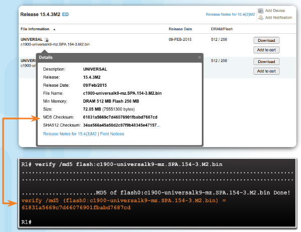

> [!INFO]
> O comando **verify /md5**, mostrado na figura, está fora do âmbito deste curso.

A área forense digital recorre ao uso de hashing na verificação dos ficheiros constantes num suporte digital.

> Por exemplo, o investigador cria um hash e uma cópia bit-a-bit do suporte que contém os ficheiros para produzir um clone digital. O investigador compara o hash do suporte digital original com a cópia. Se os dois valores corresponderem, as cópias são idênticas. **O fato de o conjunto de bits obtido ser idêntico ao conjunto original de bits, estabelece a fixidez**. A fixidez ajuda a responder a várias perguntas:

- O investigador tem os ficheiros que espera?
- Os dados estão corrompidos ou alterados?
- O investigador pode provar que os ficheiros não estão corrompidos?

Agora, o perito forense pode usar a cópia para procurar qualquer prova digital, deixando o original intacto e intocado.

#### 5.1.1.6 Hash de Palavras-passe

Os algoritmos de hash transformam qualquer quantidade de dados numa impressão ou hash digital, de comprimento fixo. Um criminoso não consegue reverter um hash digital para descobrir a entrada original. Se a entrada for alterada, resulta num hash diferente. Isto funciona para proteger as palavras-passe. Um sistema precisa de armazenar uma palavra-passe num formato que a proteja e ainda conseguir verificar que esta corresponde a um utilizador.

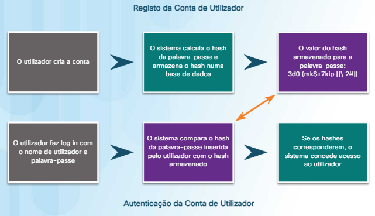

A figura mostra um possível fluxo de eventos para o registo e autenticação de uma conta de utilizador usando um sistema baseado em funções de hash. O sistema nunca grava a palavra-passe no disco local, só armazena o hash digital.

#### 5.1.1.7 Aplicações

Utilize funções de hash criptográficas nas seguintes situações:

- Para **fornecer prova de autenticidade** quando é usado com uma chave de autenticação secreta simétrica, como no protocolo IP Security (IPsec), ou na autenticação de protocolos de encaminhamento.

- Para **fornecer autenticação**, gerando respostas únicas e unidirecionais aos desafios (challenges) nos protocolos de autenticação

- Para **fornecer prova de verificação de integridade de mensagens**, como os usados em contratos assinados digitalmente, e *certificados de infraestrutura de chave pública* (PKI), como os aceites no acesso a um site seguro usando um navegador.

Durante a escolha de um algoritmo de hash, utilize o SHA-256 ou superior, pois são **atualmente** os mais seguros. Evite o SHA-1 e MD5 devido a de falhas de segurança já descobertas. Nas redes que se encontram em produção (em uso), implemente o SHA-256 ou superior.

Embora o hash possa detectar alterações acidentais, não consegue proteger contra mudanças deliberadas. Não há nenhuma informação de identificação única do remetente no procedimento de hash. Isto significa que **qualquer um pode calcular um hash para quaisquer dados, desde que tenha a função de hash correta**.

> Por exemplo, quando uma mensagem atravessa a rede, um atacante pode interceptar a mensagem, alterá-la, recalcular o hash e anexar o novo hash à mensagem modificada. O dispositivo receptor só irá validar a mensagem recebida contra o hash anexado.

Portanto, **o processo de hashing é vulnerável a ataques man-in-the-middle e não fornece segurança aos dados transmitidos**.

#### 5.1.1.8 Decifrar ou Quebrar Hashes

**Para quebrar um hash, um atacante tem de adivinhar a palavra-passe**. Os dois primeiros ataques usados para adivinhar palavras-passe são **ataques de dicionário** e **ataques de força bruta**.

Um ataque de dicionário **usa um ficheiro contendo palavras, frases e palavras-passe comuns**. O ficheiro tem os hashes calculados. Um ataque de dicionário compara os hashes constantes no ficheiro com os hashes guardados das palavra-passe dos vários utilizadores. Se um hash corresponder, há uma forte probabilidade do atacante recuperar a palavra-passe.

Um ataque de força bruta **tenta todas as combinações possíveis de caracteres até um determinado comprimento**. Um ataque de força bruta pode consumir muito tempo do processador, mas para alguns hashes é apenas uma questão de tempo até que este método descubra a palavra-passe. As palavras-passe precisam ser longas o suficiente para dificultar o sucesso dos ataque de força bruta. O Hash de palavras-passe torna mais difícil a recuperação das palavras passe pelo criminoso.

#### 5.1.1.9 Atividade – Identificar Terminologia Relacionada com os Hashs

### 5.1.2 O uso de Sal

#### 5.1.2.1 O que é o uso de Sal?

O uso de Sal torna o hashing de palavras-passe mais seguro. Se dois utilizadores tiverem a mesma palavra-passe, eles também terão os mesmos hashes de palavra-passe. Um sal, é um conjunto aleatório de carateres que serve como parâmetro adicional usado no cálculo de um hash de uma palavra-passe. Isto cria um resultado de hash diferente para as duas palavras-passe idênticas, conforme se observa na figura. Uma base de dados armazena tanto o hash como o sal.

Na figura, a mesma palavra-passe gera um hash diferente porque o sal em cada instância é diferente. O sal não precisa ser secreto, uma vez que é um número aleatório.

#### 5.1.2.2 Prevenção de Ataques

O uso de Sal impede que um atacante use um ataque de dicionário para tentar adivinhar palavras-passe. O uso de Sal também torna impossível usar tabelas de procura e tabelas de arco-íris para quebrar um hash.

**Tabelas de Procura**

Uma tabela de procura **contém os hashes pré-calculados das palavras de um dicionário de palavras-passe juntamente com a palavra-passe correspondente**. Uma tabela de procura é uma estrutura de dados que permite processar centenas de hash por segundo. Clique [aqui](https://crackstation.net/) para ver o quão rápido é uma tabela de procura para quebrar um hash.

**Tabela de Procura Reversa**

Este ataque permite que o cibercriminoso **inicie um ataque de dicionário ou ataque de força bruta a muitos hashes sem recorrer a uma tabela de procura pré-calculada**. O cibercriminoso cria uma tabela de procura onde faz corresponder cada hash constante na base de dados violada, para uma lista de utilizadores. Para cada palavra-passe de suposição, o cibercriminoso determina o seu hash e compara-o com os que constam na tabela de procura criada, para verificar se existem utilizadores cuja palavra-passe corresponda ao palpite do cibercriminoso, como apresentado na figura. Como muitos utilizadores têm a mesma palavra-passe, o ataque funciona bem.

**Tabelas Arco-íris**

As tabelas do arco-íris sacrificam a velocidade de quebra de hashes para tornar as tabelas de procura menores Uma tabela menor significa que a tabela pode armazenar as soluções para mais hashes na mesma quantidade de espaço.

#### 5.1.2.3 Implementação do uso de Sal

O uso de um **Cryptographically Secure Pseudo-Random Number Generator** (CSPRNG) é uma boa opção para se gerar o sal. CSPRNGs gera um número aleatório que tem um alto nível de aleatoriedade e é completamente imprevisível, e portanto é criptograficamente seguro.

Para implementar o sal com sucesso, siga as seguintes recomendações:

- O sal deve ser único para cada palavra-passe de utilizador.
- Nunca reutilize um sal.
- O comprimento do sal deve corresponder ao comprimento da saída da função de hash.
- Calcule sempre o hash no servidor, usando uma aplicação web.

O uso da técnica chamada de **alongamento da chave** também ajuda a proteger contra ataques. O alongamento de chaves *torna a função de hash muito lenta*. Isto impede que hardware de alto desempenho que pode calcular biliões de hashes por segundo, seja menos eficaz.

Os passos que uma aplicação da base de dados realiza para armazenar e validar uma palavra-passe salgada são mostrados na figura.

#### 5.1.2.4 Lab - Decifrar Palavras-passe

Neste laboratório, alcançará o seguinte objetivo:

- Utilizar uma ferramenta para quebrar palavras-passe e recuperar a palavra-passe de um utilizador.

[Lab - Decifrar Palavras-passe](https://contenthub.netacad.com/legacy/CyberEss/1.1/pp/course/files/5.1.2.4%20Lab%20-%20Password%20Cracking.pdf)

### 5.1.3 HMAC

#### 5.1.3.1 O que é um HMAC?

O próximo passo para impedir que um cibercriminoso lance um ataque de dicionário ou um ataque de força bruta a um hash é adicionar uma chave secreta ao hash. Somente a pessoa que conhece o hash pode validar uma palavra-passe. Uma forma de fazer isto é incluir a chave secreta no cálculo do hash, produzindo um **keyed-hash message authentication code** (HMAC or KHMAC) Os HMACs **usam uma chave secreta adicional como entrada para a função de hash**. A utilização do HMAC vai mais além do que apenas a garantia de integridade, visto que adiciona autenticação. Um HMAC usa um algoritmo específico que combina uma função de hash criptográfica com uma chave secreta, como se mostra na figura.

Somente o remetente e o receptor conhecem a chave secreta, e a saída da função de hash agora depende dos dados de entrada e da chave secreta. **Somente as partes que têm acesso a essa chave secreta podem calcular o resumo de uma função HMAC. Esta característica trava ataques de man-in-the-middle e fornece autenticação da origem dos dados**.

#### 5.1.3.2 Operação HMAC

Considere um exemplo em que um remetente queira garantir que uma mensagem em trânsito permaneça inalterada e deseja oferecer uma forma para que o receptor autentique a origem da mensagem.

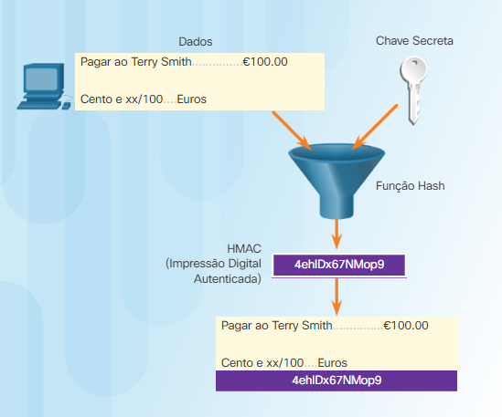

Como se mostra na Figura 1, o dispositivo de envio insere os dados (como o pagamento de Terry Smith de US $100 e a chave secreta) no algoritmo de hash e calcula o resumo HMAC de comprimento fixo ou impressão digital. O receptor obtém a impressão digital autenticada anexada à mensagem.

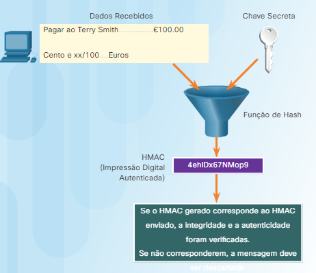

Na Figura 2, o dispositivo receptor remove a impressão digital da mensagem e usa a mensagem de texto simples com sua chave secreta como entrada para a mesma função de hash. Se o dispositivo receptor calcular uma impressão digital igual à impressão digital enviada, a mensagem não sofreu alterações. Além disso, o receptor sabe a origem da mensagem porque só ele e o remetente possuem uma cópia da chave secreta partilhada. A função HMAC provou a autenticidade da mensagem.

#### 5.1.3.3 Aplicação do HMAC

Os HMACs **também podem autenticar um utilizador Web**. Muitos serviços web usam a autenticação básica, que não cifra o nome de utilizador e a palavra-passe durante a transmissão. Usando o HMAC, o utilizador envia um identificador de chave privada e um HMAC. O servidor procura a chave privada do utilizador e cria um HMAC. O HMAC do utilizador deve corresponder ao calculado pelo servidor.

**As VPNs que usam IPsec usam funções HMAC para autenticar a origem de cada pacote e verificar a integridade de dados**.

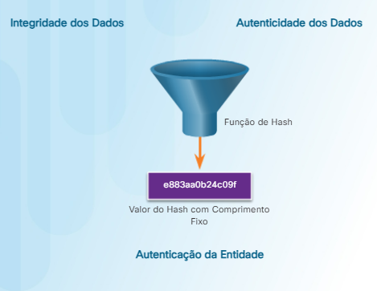

Conforme apresentado na figura, os produtos da Cisco usam o hashing para fins da autenticação da entidade, da integridade dos dados, e da autenticidade dos dados:

- Os routers Cisco IOS permitem o uso de hashes com chaves secretas de uma forma semelhante a um HMAC para adicionar informação de autenticação nos updates enviados pelos protocolos de encaminhamento.

- Gateways e clientes IPsec usam algoritmos de hash, como o MD5 e o SHA-1 no modo HMAC, para fornecer integridade e autenticidade de pacotes.

- As imagens do software Cisco, disponíveis em Cisco.com, têm uma soma de controlo baseada em MD5 que permite que clientes possam verificar a integridade das imagens transferidas.

> [!INFO]
> O termo entidade pode referir-se a dispositivos ou sistemas dentro de uma organização.

## 5.2 Assinaturas Digitais

### 5.2.1 Assinaturas e a Lei

#### 5.2.1.1 O que é uma Assinatura Digital?

As assinaturas manuscritas e selos estampados **comprovam a autoria do conteúdo de um documento**. As assinaturas digitais podem fornecer a mesma funcionalidade que as assinaturas manuscritas.

Documentos digitais desprotegidos são muito fáceis de mudar por qualquer pessoa. Uma assinatura digital pode determinar se alguém edita um documento após ter sido assinado pelo utilizador. **Uma assinatura digital é um método matemático usado para verificar a autenticidade e integridade de uma mensagem, documento digital ou software**.

Em muitos países, as assinaturas digitais têm o mesmo valor legal de um documento assinado manualmente. As assinaturas eletrónicas são vinculativas para contratos, negociações ou qualquer outro documento que exija uma assinatura manuscrita. Uma trilha de auditoria permite o rastreio do histórico do documento eletrônico para fins regulamentares e de defesa legal.

Uma assinatura digital ajuda a estabelecer autenticidade, integridade e não-repúdio. As assinaturas digitais têm propriedades específicas que permitem a autenticação da entidade e a integridade dos dados, conforme se mostra na figura.

As assinaturas digitais são uma alternativa ao HMAC.

#### 5.2.1.2 Não-Repúdio

Repudiar significa negar. Não-repúdio **é uma maneira de garantir que o remetente de uma mensagem ou documento não possa negar ter enviado a mensagem ou documento e que o destinatário não pode negar ter recebido a mensagem ou documento**.

Uma assinatura digital garante que o remetente assinou eletronicamente a mensagem ou documento. Uma vez que uma assinatura digital é única para o indivíduo que a cria, esse indivíduo não pode negar mais tarde que forneceu a assinatura.

### 5.2.2 Como Funciona a Tecnologia de Assinatura Digital

#### 5.2.2.1 Adicionar o glossário de termos e conceitos

**A criptografia assimétrica é a base para as assinaturas digitais**. Um algoritmo de chave pública como o RSA gera duas chaves: uma privada e outra pública. As chaves estão matematicamente relacionadas.

> A Alice quer enviar ao Bob um e-mail que contém informações importantes para a implantação de um novo produto. A Alice quer ter certeza de que Bob sabe que a mensagem veio dela, e que a mensagem não foi modificada desde que foi enviada.
> 
> A Alice cria a mensagem junto com um resumo da mensagem. De seguida, ela cifra o resumo com sua chave privada. A Alice empacota a mensagem, o resumo cifrado da mensagem, e a sua chave pública, para criar o documento assinado. Alice envia este conjunto de informação para Bob.
> 
> O Bob recebe a mensagem e lê-a. Para se certificar de que a mensagem veio de Alice, o Bob cria um resumo da mensagem. Pega no resumo cifrado da mensagem da Alice recebida e decifra-o usando a chave pública da Alice. O Bob compara o resumo da mensagem da Alice recebido com o que gerou. Se ambos corresponderem, o Bob fica a saber que ninguém alterou a mensagem original da Alice.

Clique [aqui](https://www.youtube.com/watch?v=E5FEqGYLL0o) para ver um vídeo que explica o processo de criação de um certificado digital.

#### 5.2.2.2 Utilização de Assinaturas Digitais

Assinar um hash em vez de todo o documento fornece eficiência, compatibilidade e integridade. As organizações podem querer substituir documentos em papel e assinaturas de tinta por uma solução que garanta que o documento eletrônico cumpra com todos os requisitos legais.

As duas situações seguintes fornecem exemplos de uso de assinaturas digitais:

- **Assinatura de código** - Usado para verificar a integridade dos ficheiros executáveis transferidos de um website de um fabricante. A assinatura de código também usa certificados digitais assinados para autenticar e verificar a identidade do site.
	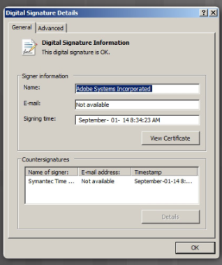

- **Certificados Digitais** - Usados para verificar a identidade de uma organização ou indivíduo para autenticar um site de fornecedor e estabelecer uma ligação cifrada para trocar dados confidenciais.
	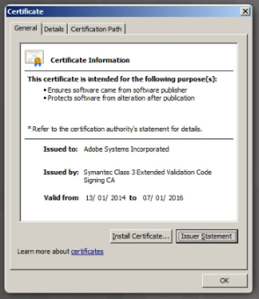

#### 5.2.2.3 Comparação entre Algoritmos de Assinatura Digital

Os três algoritmos comuns de assinatura digital são: 

- **Digital Signature Algorithm** (DSA),
- **Rivest-Shamir-Adleman** (RSA), e 
- **Elliptic Curve Digital Signature Algorithm** (ECDSA).

Todos os três geram e verificam assinaturas digitais. Estes algoritmos **dependem da criptografia assimétrica e de técnicas de chave pública**. As assinaturas digitais exigem duas operações:

1. Geração de chaves
2. Verificação de chave

Ambas as operações precisam de chaves de cifra e de decifra.

O DSA usa fatorização de grandes números. Os governos usam o DSA para assinar para criar assinaturas digitais. O DSA não se estende para lá da assinatura da própria mensagem.

O RSA é, atualmente, o algoritmo de criptografia de chave pública mais comum. O RSA foi criado em 1977 e recebeu o nome dos seus criadores: Ron Rivest, Adi Shamir e Leonard Adleman. O RSA depende da criptografia assimétrica. O RSA abrange a assinatura da mensagem e a cifra do seu conteúdo.

**O DSA é mais rápida do que o RSA como serviço de assinatura para um documento digital. O RSA é mais adequado para as aplicações que exijam a assinatura e verificação de documentos eletrônicos, e a cifragem de mensagens**.

Como na maioria das áreas de criptografia, o algoritmo RSA é baseado em dois princípios matemáticos: o módulo e a fatorização de números primos. Clique [aqui](https://www.youtube.com/watch?v=wXB-V_Keiu8) para saber mais sobre como o RSA utiliza o módulo e a fatorização de números primos.

O ECDSA é o mais recente algoritmo de assinatura digital e está gradualmente a substituir o RSA. A vantagem deste novo algoritmo é que ele pode usar tamanhos de chave muito menores para a mesma segurança e requer menos esforço de computação que o RSA.

#### 5.2.2.4 Laboratório - Utilização de Assinaturas Digitais

Neste laboratório, irá alcançar os seguintes objetivos:

- Compreender os conceitos relativos às assinaturas digitais.
- Demonstrar a utilização de assinaturas digitais.
- Demonstrar a verificação de uma assinatura digital.

[Laboratório - Utilização de Assinaturas Digitais](https://contenthub.netacad.com/legacy/CyberEss/1.1/pp/course/files/5.2.2.4%20Lab%20-%20Using%20Digital%20Signatures.pdf)

## 5.3 Certificados

### 5.3.1 Noções básicas de certificados digitais

#### 5.3.1.1 O que é um Certificado Digital?

Um certificado digital **é equivalente a um passaporte eletrônico**. Eles permitem que os utilizadores, dispositivos e organizações troquem informações com segurança pela Internet. Mais especificamente, um certificado digital **autentica e verifica se os utilizadores que enviam uma mensagem são quem eles afirmam ser**.

Os certificados digitais também podem fornecer confidencialidade ao destinatário, providenciando os meios para cifrar uma resposta. Os certificados digitais são semelhantes aos certificados físicos.

> Por exemplo, o certificado de papel Cisco Certified Network Associate Security (CCNA-S) identifica o indivíduo, a Autoridade de Certificação (que autorizou o certificado), e a validade do certificado. Observe como o certificado digital a seguir também identifica elementos semelhantes.

#### 5.3.1.2 Utilização de Certificados Digitais

Para compreender como usar um certificado digital, observe a figura a segui. Neste cenário, o Bob está a confirmar uma encomenda à Alice. O servidor web da Alice usa um certificado digital para assegurar a realização de uma transação segura.

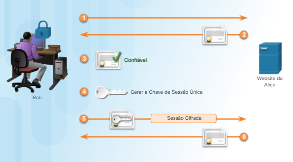

**Passo 1:** Bob acede ao site da Alice. Um navegador requer uma ligação segura mostrando um ícone com um cadeado na barra de estado de segurança.

**Passo 2:** O servidor web da Alice envia um certificado digital para o navegador do Bob.

**Passo 3:** O navegador do Bob verifica o certificado armazenado nas configurações do navegador. Somente certificados confiáveis permitem que a transação siga em frente.

**Passo 4:** O Bob ainda precisa de se autenticar e fornecer uma palavra-passe. Isto cria uma sessão segura em segundo plano entre o computador do Bob e o servidor web da Alice.

**Passo 5:** O navegador Web do Bob cria uma única chave de sessão única.

**Passo 6:** O navegador do Bob usa a chave pública do servidor web, constante no certificado recebido, para cifrar a sessão. O resultado é que somente o servidor web da Alice pode ler as transações enviadas pelo navegador de Bob.

#### 5.3.1.3 O que é uma Autoridade de Certificação

Na Internet, a troca contínua da identificação entre todas as partes seria impraticável. Por conseguinte, os indivíduos concordam em aceitar a palavra de uma terceira parte, que é considerada neutra. Assume-se que esta terceira parte faz uma profunda investigação antes da emissão das credenciais. Após esta profunda investigação, a terceira parte emite as credenciais que são difíceis de forjar. A partir deste ponto em diante, todos os indivíduos que confiam na terceira parte aceitam as credenciais emitidas por esta.

> Por exemplo, candidata-se a tirar a carta de condução. Nesse processo, ela envia as provas da sua identidade, como a certidão de nascimento, uma imagem de identificação entre outras para a Direção-Geral dos Serviços de Viação. A Direção-Geral dos Serviços de Viação, valida a identidade da Alice e permite que esta se submeta a um exame de condução. Após a conclusão bem-sucedida, a Direção-Geral dos Serviços de Viação emite a carta de condução para a Alice. Mais tarde, a Alice precisa de levantar um cheque no banco. Ao apresentar o cheque ao funcionário do banco, este pede a identificação. O banco, porque confia na Direção-Geral dos Serviços de Viação do governo, validade da identidade da Alice e aceita pagar o cheque.

Uma **autoridade de certificação** (CA) funciona da mesma forma que Direção-Geral dos Serviços de Viação neste exemplo. **Uma CA emite certificados digitais que autenticam a identidade de organizações, dispositivos e utilizadores. Estes certificados também permitem assinar mensagens para garantir que ninguém as adulterou**.

### 5.3.2 Criação de um Certificado Digital

#### 5.3.2.1 O que contém um Certificado Digital?

Como um certificado digital segue uma estrutura padrão, qualquer entidade pode lê-lo e compreendê-lo independentemente do emissor. A norma X.509 especifica uma infraestrutura de chaves públicas (PKI), para gestão de certificados digitais. A PKI são as políticas, as funções e os procedimentos necessários para criar, gerir, distribuir, usar, armazenar e revogar certificados digitais. A norma X.509 especifica que os certificados digitais contêm as informações padrão mostradas na figura.

#### 5.3.2.2 O Processo de Validação

Os navegadores e aplicações validam os certificados antes de confiarem na informação que transmitem, para garantir que sejam válidos. Os três processos incluem:

- A **Cadeia de Certificação** valida o caminho de certificação, verificando cada certificado começando pelo certificado da CA raiz
- A **Validação do Caminho** seleciona um certificado da autoridade de certificação emissora para cada certificado na cadeia
- A **Revogação** determina se o certificado foi revogado e porque razão o foi.

#### 5.3.2.3 O Caminho do Certificado

Um indivíduo recebe um certificado para uma chave pública de uma CA comercial. O certificado pertence a uma cadeia de certificados chamada **cadeia de confiança**. O número de certificados na cadeia depende da estrutura hierárquica da CA.

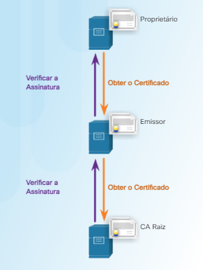

A figura mostra uma cadeia de certificados para uma CA de dois níveis. Existe uma CA raiz offline e uma CA subordinada online. A razão para a estrutura de dois nível é que a assinatura X.509 permite uma recuperação mais fácil em caso de comprometimento Se há uma CA offline (modelo de 2 níveis) e a CA subordinada online fica comprometida, a CA raiz pode assinar um novo certificado para uma nova CA subordinada online. Caso não existisse um modelo de 2 níveis, o comprometimento da CA que emitiu os certificados implicaria que um utilizador teria que instalar um novo certificado de CA raiz em cada máquina cliente, telemóvel ou tablet.

#### 5.3.2.4 Atividade - Passos do Processo de um Certificado Digital

## 5.4 Imposição da Integridade da Base de Dados

### 5.4.1 Integridade da Base de Dados

#### 5.4.1.1 Integridade de dados

As bases de dados oferecem uma forma eficiente de armazenar, recuperar e analisar dados. À medida que a recolha de dados aumenta e estes se tornam mais sensíveis, é importante que os profissionais de cibersegurança protejam o crescente número de bases de dados. **Pense numa base de dados como um sistema de armazenamento eletrônico. A integridade dos dados refere-se à precisão, consistência e confiabilidade dos dados armazenados numa base de dados**. A responsabilidade da integridade dos dados recai sobre os criadores da base de dados, os programadores e gestão da organização.

As quatro regras ou restrições da integridade de dados são as seguintes:

- **Integridade da entidade**: todas as entradas devem ter um identificador único chamado Chave Primária (Figura 1).
	
	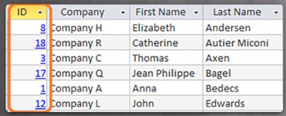

- **Integridade do domínio**: Todos os dados armazenados numa coluna devem ter o mesmo formato e definição (Figura 2).
	
	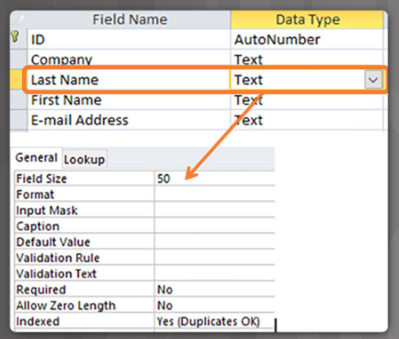

- **Integridade referencial**: Os relacionamentos de tabela devem permanecer consistentes. Por conseguinte, um utilizador não pode eliminar um registo relacionado com outro (Figura 3).
	
	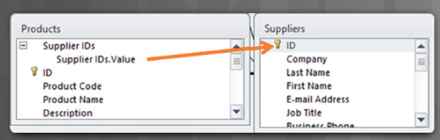

- **Integridade definida pelo utilizador**: um conjunto de regras definidas por um utilizador que não pertence a uma das outras categorias. Por exemplo, um utilizador faz uma nova encomenda, como se mostra na Figura 4. O sistema primeiro verifica se este é um novo cliente. Se for, o sistema adiciona o novo cliente à tabela de clientes.
	
	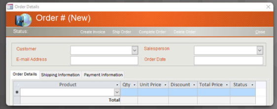

#### 5.4.1.2 Controlo da Entrada de Dados

A entrada de dados envolve a introdução de dados num sistema. Um conjunto de controlos garante que os utilizadores insiram os dados corretos.

**Controlos Drop Down para Dados Mestre**

**Devem usar uma opção drop down para as tabelas-mestre em vez de pedir aos utilizadores para inserir os dados**. 

> Um exemplo do uso de controlos de dados mestre é recorrer à lista oficial de locais (ex., providenciada pelo serviço de correio postal) para normalizar os endereços dos utilizadores.

**Controlos de Validação dos Campo de Dados**

As regras de verificações básicas, incluem:

- A **entrada obrigatória** garante que um campo obrigatório contenha dados

- As **máscaras de entrada** impedem que os utilizadores insiram dados inválidos ou ajudam a garantir que eles insiram dados de forma consistente (como um número de telefone, por exemplo)

- Montantes positivos em Euros

- Os **intervalos de dados** garantem que um utilizador insira dados dentro de um determinado intervalo (como uma data de nascimento inserida como 01-18-1820, por exemplo)

- **Aprovação obrigatória de uma segunda pessoa** (um funcionário bancário recebe um pedido de depósito ou levantamento superior a um dado valor desencadeia uma segunda ou terceira aprovação)

- Alerta do **número máximo de modificações** do registo (se o número de registos modificados excede um número predeterminado dentro de um determinado período de tempo, bloqueia um utilizador até que um gestor identifique se as transações foram legítimas ou não)

- **Trigger de atividade incomum** (sistema bloqueia quando reconhece a existência de atividade suspeita).

### 5.4.2 Validação da Base de Dados

#### 5.4.2.1 Regras de Validação

Uma regra de validação v**erifica se os dados estão dentro dos parâmetros definidos pelo programador da base de dados**. Uma regra de validação ajuda a garantir a integridade, a precisão e a consistência dos dados. Os critérios usados numa regra de validação incluem o seguinte:

- **Tamanho** — verifica o número de caracteres num campo de dados
- **Formato** — verifica se os dados estão em conformidade com um formato especificado
- **Consistência** — verifica a consistência dos códigos em dados que se encontram relacionados
- **Intervalo** — verifica se os dados estão dentro de um valor mínimo e máximo
- **Dígito de verificação** — fornece um cálculo extra para gerar um dígito de verificação para detecção de erros

> [!INFO]
> Ler sobre cálculo do dígito de verificação para um IBSN de x dígitos

#### 5.4.2.2 Validação do Tipo de Dados

A validação do tipo de dados **é a validação de dados mais simples, a qual verifica se um utilizador insere dados consistentes com o tipo de caracteres esperado**. 

> Por exemplo, um número de telefone não deve conter letras. As bases de dados permitem três tipos de dados: inteiro, texto e decimal.

#### 5.4.2.3 Validação de Entrada

Um dos aspectos mais vulneráveis da gestão da integridade da base de dados é controlar o processo de entrada de dados. Muitos ataques conhecidos são realizados contra uma base de dados, inserindo dados malformados. O ataque pode confundir, bloquear ou fazer com que a aplicação exponha informação ao atacante. Os atacantes usam ataques de entrada automatizados.

> Por exemplo, os utilizadores preenchem um formulário online para subscreverem uma newsletter. Uma aplicação de base de dados gera e envia automaticamente confirmações de e-mail. Quando os utilizadores recebem as suas confirmações por e-mail com um url (link) para confirmar a sua assinatura, esse url foi modificado pelos atacantees. As modificações podem incluir a alteração do nome de utilizador, o endereço de e-mail ou o estado da subscrição. O e-mail retorna para o servidor que aloja a aplicação. Se o servidor Web não verificar se o endereço de e-mail e outras informações da conta recebidas correspondem às informações da subscrição, o servidor recebeu informações falsas. Os hackers podem automatizar este ataque para inundar a aplicação Web com milhares de subscritores inválidos para a base de dados da newsletter.

#### 5.4.2.4 Verificação de Anomalias

A detecção de anomalias **refere-se à identificação de padrões nos dados que não estão em conformidade com o comportamento esperado**. Estes padrões não conformes são considerados anomalias, **outliers**, exceções, aberrações ou surpresas, em diferentes aplicações de bases de dados.

**A detecção e a verificação de anomalias são uma contramedida importante e uma salvaguarda na identificação da detecção de fraudes**. A detecção de anomalias na base de dados pode identificar, por ex., fraudes em cartões de crédito e seguros. A detecção de anomalias na base de dados pode proteger os dados contra destruição maciça ou alterações.

A verificação de anomalias requer a verificação de pedidos de dados ou modificações quando um sistema detecta padrões pouco usuais ou surpreendentes. 

> Um exemplo disto é um cartão de crédito com duas transações realizadas em locais muito diferentes num curto espaço de tempo. Se um pedido de transação na cidade de Nova York ocorrer às 10h30 e uma segunda solicitação for de Chicago às 10:35 da manhã, o sistema acionará uma verificação da segunda transação.
> 
> Um segundo exemplo ocorre quando um número pouco usual de modificações do endereço de e-mail ocorre num número incomum de registos de base de dados. Como os dados de e-mail são usados para efetuar ataques DoS, a modificação por e-mail de centenas de registos pode indicar que um atacante está a usar a base de dados de uma organização como ferramenta para seu ataque DoS.

#### 5.4.2.5 Atividade - Identifique os Controlos de Integridade da Base de Dados

### 5.4.3 Requisitos de Integridade da Base de Dados

#### 5.4.3.1 Integridade da Entidade

Uma base de dados é como um arquivo eletrônico. **Garantir um preenchimento adequado é fundamental para manter a confiança e utilidade dos dados dentro da base de dados**. As tabelas, registos, campos e dados dentro de cada campo compõem uma base de dados.

Para manter a integridade do sistema armazenamento da base de dados, os utilizadores devem respeitar certas regras. A integridade da entidade é uma regra de integridade, que afirma que cada tabela deve ter uma `chave primária` e que a coluna ou colunas escolhidas para ser a chave primária devem ser únicas e não `NULL`. `NULL` numa base de dados significa valores ausentes ou desconhecidos. A integridade da entidade permite a organização adequada dos dados para esse registo, conforme se mostra na figura.

#### 5.4.3.2 Integridade Referencial

Outro conceito importante é a relação entre diferentes sistemas de armazenamento ou tabelas. **A base da integridade referencial são as chaves estrangeiras**.

**Uma chave estrangeira numa tabela faz referência a uma chave primária numa outra tabela**. A chave primária de uma tabela identifica de forma única as entidades (linhas) na tabela. A integridade referencial mantém a integridade das chaves estrangeiras.

#### 5.4.3.3 Integridade Domínio

A integridade do domínio **garante que todos os campos de dados numa coluna estejam dentro de um conjunto definido de valores válidos**. Cada coluna de uma tabela tem um conjunto definido de valores, como o conjunto de todos os números para os números de cartão de crédito, números de segurança social ou endereços de e-mail.

Limitar o valor atribuído a uma instância dessa coluna (um atributo) impõe a integridade do domínio. A imposição da integridade do domínio pode ser tão simples quanto escolher o tipo de dados, o comprimento e o formato corretos para uma coluna.

#### 5.4.3.4 Laboratório — Acesso Remoto

Neste laboratório, alcançará o seguinte objetivo:

- Compare o SSH e Telnet para aceder um dispositivo remoto

[Laboratório — Acesso Remoto](https://contenthub.netacad.com/legacy/CyberEss/1.1/pp/course/files/5.4.3.4%20Lab%20-%20Remote%20Access.pdf)

## 5.5 Conclusão: Capítulo 5: A Arte de Garantir a Integridade

Este capítulo discutiu como o serviço de integridade garante que os dados permaneçam inalterados por qualquer pessoa ou qualquer coisa ao longo de todo o seu ciclo de vida.

Este capítulo começou por discutir os tipos de controlos de integridade de dados. Algoritmos de hash, o uso de sal em palavras-passe e o código de autenticação de mensagem (HMAC) são conceitos importantes para os "cyber-heróis" usarem, recorrendo a assinaturas e certificados digitais. Essas ferramentas permitem que os especialistas em cibersegurança possam verificar a autenticidade de mensagens e documentos.

O capítulo concluiu com uma discussão sobre a aplicação da integridade me bases de dados. Ter um sistema de integridade de dados bem controlado e definido, aumenta a estabilidade, o desempenho e a capacidade de manutenção de um sistema de base de dados.