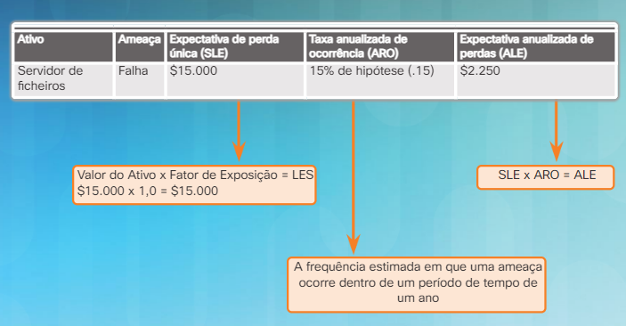
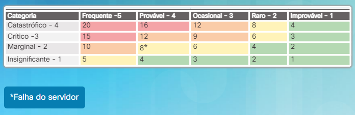
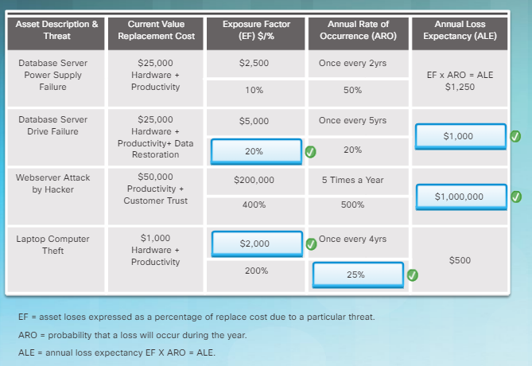
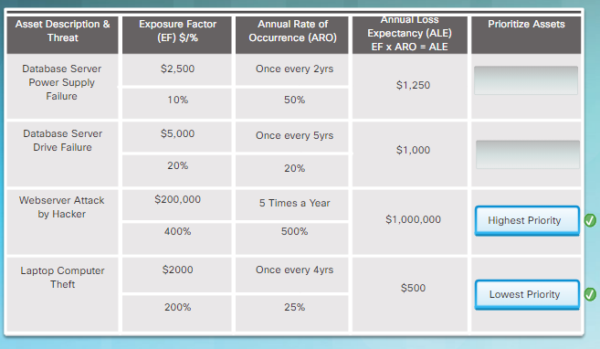
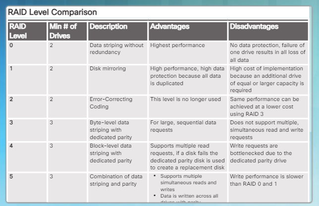
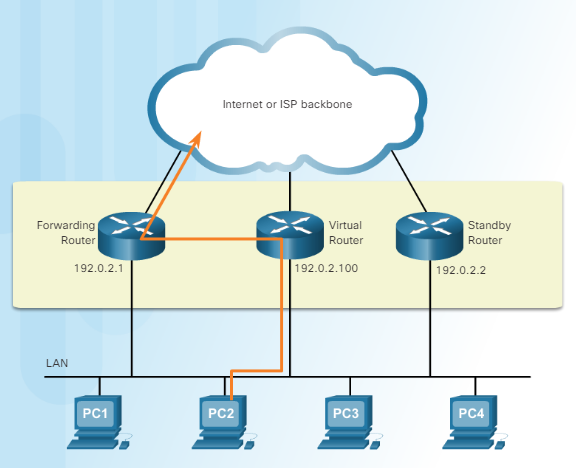
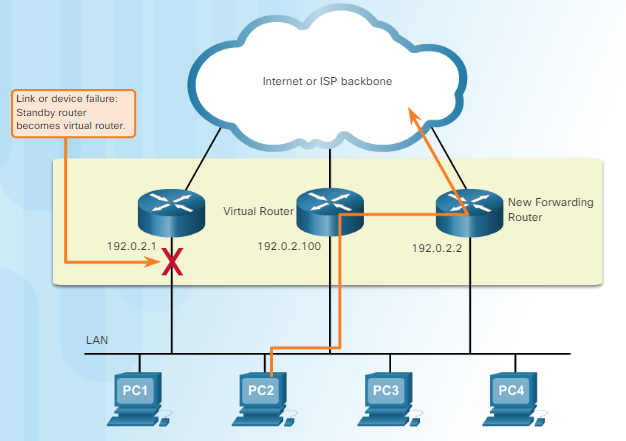
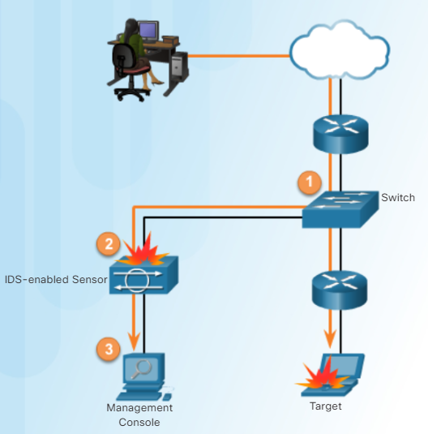
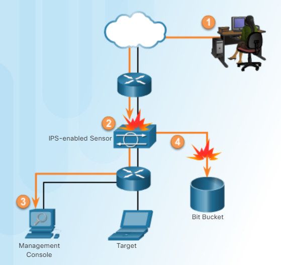

<datails>
Table of Contents 🔖

- [Capítulo 6: O Conceito de Cinco Noves](#capítulo-6-o-conceito-de-cinco-noves)
	- [6.1 Alta Disponibilidade](#61-alta-disponibilidade)
		- [6.1.1 Os Cinco Noves](#611-os-cinco-noves)
			- [6.1.1.1 O Que Significam os Cinco Noves?](#6111-o-que-significam-os-cinco-noves)
			- [6.1.1.2 Ambientes que Exigem Cinco Noves](#6112-ambientes-que-exigem-cinco-noves)
			- [6.1.1.3 Ameaças à Disponibilidade](#6113-ameaças-à-disponibilidade)
			- [6.1.1.4 Conexão de um Sistema de Alta Disponibilidade](#6114-conexão-de-um-sistema-de-alta-disponibilidade)
	- [6.2 Medidas para Melhorar a Disponibilidade](#62-medidas-para-melhorar-a-disponibilidade)
		- [6.2.1 Gestão de ativos](#621-gestão-de-ativos)
			- [6.2.1.1 Identificação de Ativos](#6211-identificação-de-ativos)
			- [6.2.1.2 Classificação de Ativos](#6212-classificação-de-ativos)
			- [6.2.1.3 Normalização de Ativos](#6213-normalização-de-ativos)
			- [6.2.1.4 Identificação de Ameaças](#6214-identificação-de-ameaças)
			- [6.2.1.5 Análise de Risco](#6215-análise-de-risco)
			- [6.2.1.6 Mitigação](#6216-mitigação)
			- [6.2.1.7 Atividade - Realizar uma Análise de Risco de Ativo](#6217-atividade---realizar-uma-análise-de-risco-de-ativo)
		- [6.2.2 Defesa em Profundidade](#622-defesa-em-profundidade)
			- [6.2.2.1 Organizar em Camadas](#6221-organizar-em-camadas)
			- [6.2.2.2 Limitando](#6222-limitando)
			- [6.2.2.3 Diversidade](#6223-diversidade)
			- [6.2.2.4 Obscuridade](#6224-obscuridade)
			- [6.2.2.5 Simplicidade](#6225-simplicidade)
			- [6.2.2.6 Atividade - Identificar a Camada de Defesa](#6226-atividade---identificar-a-camada-de-defesa)
		- [6.2.3 Redundância](#623-redundância)
			- [6.2.3.1 Pontos Únicos de Falha](#6231-pontos-únicos-de-falha)
			- [6.2.3.2 Redundância N+1](#6232-redundância-n1)
			- [6.2.3.3 RAID](#6233-raid)
			- [6.2.3.4 Spanning Tree](#6234-spanning-tree)
			- [6.2.3.5 Redundância de Encaminhadores](#6235-redundância-de-encaminhadores)
			- [6.2.3.6 Opções de Redundância de Encaminhador](#6236-opções-de-redundância-de-encaminhador)
			- [6.2.3.7 Redundância da Localização](#6237-redundância-da-localização)
			- [6.2.3.8 Packet Tracer - Redundância de Encaminhador e Comutador](#6238-packet-tracer---redundância-de-encaminhador-e-comutador)
		- [6.2.4 Resiliência do Sistema](#624-resiliência-do-sistema)
			- [6.2.4.1 Projeto Resiliente](#6241-projeto-resiliente)
			- [6.2.4.2 Resiliência de Aplicações](#6242-resiliência-de-aplicações)
			- [6.2.4.3 Resiliência de IOS](#6243-resiliência-de-ios)
			- [6.2.4.4 Packet Tracer - Resiliência de encaminhador e comutador](#6244-packet-tracer---resiliência-de-encaminhador-e-comutador)
	- [6.3 Resposta a incidentes](#63-resposta-a-incidentes)
		- [6.3.1 Fases da Resposta a Incidentes](#631-fases-da-resposta-a-incidentes)
			- [6.3.1.1 Preparação](#6311-preparação)
			- [6.3.1.2 Detecção e Análise](#6312-detecção-e-análise)
			- [6.3.1.3 Contenção, Erradicação e Recuperação](#6313-contenção-erradicação-e-recuperação)
			- [6.3.1.4 Acompanhamento Pós-Incidente](#6314-acompanhamento-pós-incidente)
			- [6.3.1.5 Atividade - Ordenar as Fases de Resposta a Incidentes](#6315-atividade---ordenar-as-fases-de-resposta-a-incidentes)
		- [6.3.2 Tecnologias de resposta a incidentes](#632-tecnologias-de-resposta-a-incidentes)
			- [6.3.2.1 Controlo da Admissão à Rede](#6321-controlo-da-admissão-à-rede)
			- [6.3.2.2 Sistemas de detecção de Intrusão](#6322-sistemas-de-detecção-de-intrusão)
			- [6.3.2.3 Sistema de Prevenção de Intrusão](#6323-sistema-de-prevenção-de-intrusão)
			- [6.3.2.4 NetFlow e IPFIX](#6324-netflow-e-ipfix)
			- [6.3.2.5 Inteligência Avançada de Ameaças](#6325-inteligência-avançada-de-ameaças)
	- [6.4 Recuperação de Desastres](#64-recuperação-de-desastres)
		- [6.4.1 Planeamento de recuperação de desastres](#641-planeamento-de-recuperação-de-desastres)
			- [6.4.1.1 Tipos de Desastres](#6411-tipos-de-desastres)
			- [6.4.1.2 Plano de Recuperação de Desastres](#6412-plano-de-recuperação-de-desastres)
			- [6.4.1.3 Implementação de Controlos de Recuperação de Desastres](#6413-implementação-de-controlos-de-recuperação-de-desastres)
		- [6.4.2 Planeamento de Continuidade de Negócio](#642-planeamento-de-continuidade-de-negócio)
			- [6.4.2.1 A Necessidade de Continuidade de Negócio](#6421-a-necessidade-de-continuidade-de-negócio)
			- [6.4.2.2 Considerações sobre continuidade de negócio](#6422-considerações-sobre-continuidade-de-negócio)
			- [6.4.2.3 Melhores práticas de continuidade de negócio](#6423-melhores-práticas-de-continuidade-de-negócio)
	- [6.5 Conclusão: Capítulo 6: O Conceito de Cinco Noves](#65-conclusão-capítulo-6-o-conceito-de-cinco-noves)

# Capítulo 6: O Conceito de Cinco Noves

As organizações que desejam maximizar a disponibilidade de seus sistemas e dados podem tomar medidas extraordinárias para minimizar ou eliminar a perda de dados. O objetivo é minimizar o tempo de inatividade dos processos críticos de missão. Se os funcionários não puderem desempenhar as suas funções regulares, a organização corre o risco de perder receitas.

As organizações medem a disponibilidade por percentagem de tempo de atividade. Este capítulo começa por explicar o conceito de cinco noves. Muitas indústrias devem manter os mais altos padrões de disponibilidade, porque o tempo de inatividade pode literalmente significar uma diferença entre a vida e a morte.

Este capítulo discute várias abordagens que as organizações podem seguir para ajudar a atingir as suas metas de disponibilidade. A redundância fornece backup e inclui componentes extra para computadores ou sistemas de rede para garantir que os sistemas permanecem disponíveis. Os componentes redundantes podem incluir hardware, como unidades de disco, servidores, comutadores e encaminhadores, ou software, como sistemas operativos, aplicações e bases de dados. O capítulo também discute a resiliência, a capacidade de um servidor, rede ou data center de recuperar rapidamente e continuar a operação.

As organizações devem estar preparadas para responder a um incidente, estabelecendo procedimentos a seguir após um evento ocorrer. O capítulo conclui com uma discussão sobre recuperação de desastres e planeamento da continuidade de negócio, que são essenciais para manter a disponibilidade dos recursos de uma organização.

## 6.1 Alta Disponibilidade

### 6.1.1 Os Cinco Noves

#### 6.1.1.1 O Que Significam os Cinco Noves?

Cinco noves **significam que os sistemas e serviços estão disponíveis 99,999% do tempo**. Isso também significa que o tempo de inatividade planeado e não planeado é inferior a 5,26 minutos por ano. O quadro a seguir fornece uma comparação do tempo de inatividade para várias porcentagens de disponibilidade.

| Disponibilidade | Tempo de inatividade por ano |
| --------------- | ---------------------------- |
| 99%             | 87 horas e 36 minutos        |
| 99,5%           | 43 horas e 48 minutos        |
| 99,95%          | 4 horas e 23 minutos         |
| 99 99%          | 53 minutos                   |
| 99,999%         | 5 min.                       |

A alta disponibilidade refere-se a um sistema ou componente que está continuamente operacional por um determinado período de tempo. Para ajudar a garantir alta disponibilidade, é essencial:

- Eliminar pontos únicos de falha
- Projetar para confiabilidade
- Detetar falhas à medida que ocorrem

**Sustentar a alta disponibilidade no padrão de cinco noves pode aumentar os custos e utilizar demasiados recursos**. O aumento dos custos é devido à compra de hardware adicional, como servidores e componentes. À medida que uma organização adiciona componentes, o resultado é um aumento na complexidade da configuração. Infelizmente, o aumento da complexidade da configuração aumenta os fatores de risco. Quanto mais partes móveis envolvidas, maior a probabilidade de falha em componentes.

#### 6.1.1.2 Ambientes que Exigem Cinco Noves

Embora o custo de sustentar a alta disponibilidade possa ser muito caro para algumas indústrias, vários ambientes exigem cinco noves.

- **O setor financeiro precisa manter alta disponibilidade para negociação contínua, conformidade e confiança do cliente**. Clique [aqui](http://www.datacenterdynamics.com/it-networks/new-york-stock-exchange-fails-due-to-configuration-problems/94401.article) para ler sobre a interrupção de quatro horas na Bolsa de Valores de Nova York em 2015.

- **As instalações de saúde exigem alta disponibilidade para fornecer cuidados 24 horas por dia aos pacientes**. Clique [aqui](http://www.fiercehealthit.com/story/data-center-downtime-cost-averages-7900-minute/2013-12-05) para ler sobre os custos médios associados ao tempo de inatividade do data center no setor de saúde.

- **O setor da segurança pública inclui agências que fornecem segurança e serviços a uma comunidade, estado ou nação**. Clique [aqui](http://www.nextgov.com/defense/2014/05/pentagon-police-agency-hit-catastrophic-network-outage/83842/) para ler sobre uma interrupção de rede na Agência de Polícia do Pentágono dos EUA.

- **A indústria de retalho depende de cadeias de fornecimento eficientes e da entrega de produtos aos clientes**. A interrupção pode ser devastadora, especialmente durante os horários de pico de procura, como feriados.

- **O público espera que o sector dos media noticiosos comunique informações sobre eventos à medida que acontecem**. O ciclo de notícias é agora 24 horas por dia, 7 dias por semana.

#### 6.1.1.3 Ameaças à Disponibilidade

As seguintes ameaças representam um alto risco para a disponibilidade de dados e informações:

- Um utilizador não autorizado penetra com sucesso e compromete a **base de dados** principal de uma organização
- Um ataque *DoS* bem-sucedido afeta significativamente as **operações**
- Uma organização sofre uma perda significativa de **dados confidenciais**
- Uma **aplicação de missão crítica** deixa de funcionar
- Ocorre o comprometimento do **utilizador administrador** ou **root**
- A detecção de um **cross-site script** ou **partilha ilegal de ficheiros**
- A desfiguração do site de uma organização tem impacto nas relações públicas
- Um evento catastrófico:
	- como uma tempestade severa, um furacão ou tornado
	- como um ataque terrorista, bombardeamento, ou incêndio do edifício
	- Em consequência secundária:
		- danos de água como resultado de inundações
		- falhas do sistema de supressão de incêndio
- Interrupção do **fornecimento** de serviços a longo prazo

A categorização do **nível de impacto** de cada ameaça ajuda uma organização a perceber o custo financeiro de uma ameaça.

#### 6.1.1.4 Conexão de um Sistema de Alta Disponibilidade

A alta disponibilidade incorpora três princípios principais para alcançar o objetivo de acesso ininterrupto a dados e serviços:

1. Eliminação ou redução de pontos únicos de falha
	O ponto numa operação crítica que, se falhar, provocará a falha de toda a operação
2. Resiliência do Sistema
	A capacidade para manter a disponibilidade durante eventos disruptivos
3. Tolerância a Falhas
	Permite que um sistema continue a operar, mesmo se um ou mais componentes falharem

É importante entender as formas de lidar com um **ponto único de falha**. Um ponto único de falha pode incluir encaminhadores centrais ou comutadores, serviços de rede e até mesmo uma equipe de TI altamente qualificada. O problema é que uma perda do sistema, processo ou pessoa pode ter um impacto muito disruptivo em todo o sistema.  
A chave é ter processos, recursos e componentes que reduzam os pontos únicos de falha. **Agrupamentos (clusters) de alta disponibilidade é uma maneira de fornecer redundância**. Esses agrupamentos consistem num grupo de computadores que têm acesso ao mesmo armazenamento partilhado e têm configurações de rede idênticas. Todos os servidores participam no processamento de um serviço simultaneamente. Do lado de fora, o grupo de servidores parece ser um único dispositivo. Se um servidor dentro do agrupamento falhar, os outros servidores continuarão a processar o mesmo serviço do dispositivo com falha, ou seja, micro-serviços.

**A resiliência geralmente requer sistemas redundantes, tanto em termos de energia como de processamento, de modo a que, se um sistema falhar, o outro pode assumir as operações sem qualquer interrupção no serviço**. A resiliência do sistema é mais do que proteger bem os dispositivos; requer que dados e serviços estejam disponíveis mesmo quando sob ataque.

O espelhamento de dados é um exemplo de **tolerância a falhas**. Caso ocorra uma “falha”, causando interrupção num dispositivo como um controlador de disco, o sistema espelhado fornece os dados solicitados ao utilizador, sem interrupção aparente no serviço .

## 6.2 Medidas para Melhorar a Disponibilidade

### 6.2.1 Gestão de ativos

#### 6.2.1.1 Identificação de Ativos

Uma organização precisa de saber que hardware e software estão presentes como um pré-requisito para saber quais serão os parâmetros de configuração. **A gestão de ativos inclui um inventário completo do hardware e software**. Isto significa que a organização precisa de conhecer todos os componentes que podem estar sujeitos a riscos de segurança, incluindo:

- Todos os sistemas de hardware
- Todos os sistemas operativos
- Cada dispositivo de rede de hardware
- Cada sistema operativo de dispositivos de rede
- Todas as aplicações de software
- Todos os firmwares
- Todos os ambientes de execução
- Todas as bibliotecas individuais

Uma organização pode escolher uma solução automatizada para rastrear os ativos. Um administrador deve investigar qualquer alteração numa configuração, porque isso pode significar que a configuração não está atualizada. Isso também pode significar que estão a acontecer mudanças não autorizadas.

#### 6.2.1.2 Classificação de Ativos

A classificação de ativos atribui todos os recursos de uma organização a um grupo com base em características comuns. **Uma organização deve aplicar um sistema de classificação de ativos a documentos, registos de dados, ficheiros e discos**. As informações mais críticas precisam de receber o mais alto nível de proteção e podem até exigir um manuseamento especial.

Uma organização pode adotar um sistema de rotulagem de acordo com o quão valiosa, delicada e crítica é a informação. Conclua as etapas a seguir para identificar e classificar os ativos de uma organização:

- Determine a **categoria** adequada de identificação de ativos.
	- Ativos de informação
	- Ativos de software
	- Ativos físicos
	- Serviços
- Estabeleça a **responsabilidade** de ativos identificando o proprietário de todos os ativos de informação e aplicações de software.
	- Identificar o proprietário de todos os ativos de informações
	- Identificar o proprietário de todas as aplicações de software
- Determine os **critérios** de classificação.
	- Confidencialidade
	- Valor
	- Hora
	- Direitos de acesso
	- Destruição
- Implemente um **esquema** de classificação.
	- Adotar uma maneira uniforme de identificar informações para garantir uma proteção uniforme

> Por exemplo, o governo dos EUA usa a sensibilidade para classificar os dados da seguinte forma: ultra secreto; secreto; confidencial; confiança pública; e não classificado.

#### 6.2.1.3 Normalização de Ativos

A **gestão de ativos gere o ciclo de vida e o inventário de ativos tecnológicos, incluindo dispositivos e software**. Como parte de um sistema de gestão de ativos de TI, uma organização especifica os ativos de TI aceitáveis que cumprem os objetivos. Essa prática reduz efetivamente os diferentes tipos de ativos.

> Por exemplo, uma organização só instalará aplicações que atendam às suas diretrizes. Quando os administradores eliminam aplicações que não cumprem as diretrizes, eles estão efetivamente a melhorar a segurança.

Os padrões de ativos identificam produtos específicos de hardware e software que a organização usa e suporta. Quando ocorre uma falha, a ação imediata ajuda a manter o acesso e a segurança. **Se uma organização não padronizar a sua seleção de hardware, torna-se mais difícil encontrar um componente de substituição**. Ambientes não padronizados exigem mais perícia para gerir e aumentam o custo de contratos de manutenção e inventário. Clique [aqui](http://mil-embedded.com/articles/the-cots-systems-play/) para ler sobre como os militares mudaram para hardware baseado em padrões para as suas comunicações militares.

#### 6.2.1.4 Identificação de Ameaças

O United States Computer Emergency Readiness Team (US-CERT) e o Departamento de Segurança Interna dos EUA patrocinam um **dicionário de vulnerabilidades comuns e exposição (CVE)**. O CVE contém um número de identificador padrão, com uma breve descrição e referências a relatórios da vulnerabilidade e aconselhamento. A MITRE Corporation mantém a lista CVE e o seu [site](https://www.cve.org).

A identificação de ameaças começa com o processo de criação de um identificador CVE para vulnerabilidades de cibersegurança de conhecimento público. Cada Identificador CVE inclui o seguinte:

- O número do identificador CVE
- Uma breve descrição da vulnerabilidade de segurança
- Quaisquer referências importantes

Clique [aqui](http://cve.mitre.org/cve/identifiers/) para saber mais sobre o Identificador CVE.

#### 6.2.1.5 Análise de Risco

A análise de risco é o **processo de análise dos perigos para os ativos de uma organização, provocados por eventos naturais ou causados pelo homem**.

Um utilizador executa uma identificação de ativos para ajudar a determinar quais os ativos a proteger. Uma análise de risco tem quatro objetivos:

- Identificar ativos e o seu valor
- Identificar vulnerabilidades e ameaças
- Quantificar a probabilidade e o impacto das ameaças identificadas
- Equilibrar o impacto da ameaça relativamente ao custo da contramedida

Existem duas abordagens para análise de risco.

**Análise quantitativa de risco**

Uma análise quantitativa atribui números ao processo de análise de risco (figura a seguir). O valor do ativo é o custo de substituição do ativo. O valor de um ativo também pode ser medido pela receita obtida através do uso do ativo. O fator de exposição (FE) é um valor subjetivo expresso como uma percentagem que um ativo perde devido a uma ameaça específica. 

> A organização pode escolher aceitar o risco, caso o custo das contramedidas seja superior às perdas potenciais

Se ocorrer uma perda total, o EF é igual a 1.0 (100%). No exemplo quantitativo, o servidor tem um valor de ativo de US $15.000. Quando o servidor falha, ocorre uma perda total (o EF é igual a 1.0). O valor do ativo de $15.000 multiplicado pelo fator de exposição de 1 resulta numa expectativa de perda única de US $15.000.

A taxa de ocorrência anualizada (ARO) é a probabilidade de ocorrer uma perda durante o ano (também expressa em percentagem). Uma ARO pode ser maior que 100% se uma perda pode ocorrer mais de uma vez por ano.

O cálculo da expectativa anual de perdas (ALE) dá à gestão algumas orientações sobre o que deve gastar para proteger o ativo.

**Análise qualitativa de risco**

A Análise Qualitativa de Risco utiliza opiniões e cenários. A figura a seguir fornece um exemplo de tabela usada na análise de risco qualitativa, que traça a probabilidade de uma ameaça relativamente ao seu impacto. Por exemplo, a ameaça de uma falha de servidor pode ser provável, mas o seu impacto pode ser apenas marginal.

Uma equipe avalia cada ameaça a um ativo e coloca-a na tabela. A equipe classifica os resultados e usa os resultados como um guia. Eles podem determinar a tomada de medidas apenas sobre ameaças que se enquadram na zona vermelha.

Os números utilizados na tabela não se relacionam diretamente com nenhum aspecto da análise. Por exemplo, um impacto catastrófico de 4 não é duas vezes pior que um impacto marginal de 2. Este método é naturalmente subjetivo.

#### 6.2.1.6 Mitigação

**Envolve a redução da gravidade da perda ou a probabilidade de a perda ocorrer**. Muitos controlos técnicos reduzem os riscos, incluindo sistemas de autenticação, permissões de ficheiros e firewalls. Os profissionais da organização e segurança devem entender que a mitigação de riscos pode ter impacto positivo e negativo na organização. **Uma boa mitigação dos riscos encontra um equilíbrio entre o impacto negativo das contramedidas e dos controlos e o benefício da redução do risco**. Existem quatro maneiras comuns de reduzir o risco:

- Aceitar o risco e reavaliar periodicamente
- Reduzir o risco implementando controlos
- Evitar o risco mudando totalmente a abordagem
- Transferir o risco para terceiros

Uma estratégia a curto prazo consiste em aceitar o risco, o que requer a criação de planos de contingência para esse risco. As pessoas e as organizações têm de aceitar o risco diariamente. As metodologias modernas reduzem o risco desenvolvendo software de forma incremental e fornecendo atualizações e remendos regulares para lidar com vulnerabilidades e configurações incorretas.

A contratação de especialistas para executar tarefas críticas para reduzir o risco pode ser uma boa decisão e gerar melhores resultados com menos investimento a longo prazo. Um bom plano de mitigação de riscos pode incluir duas ou mais estratégias.

> Serviços de terceirização, compra de seguros ou aquisição de contratos de manutenção são exemplos de transferência de risco. 

#### 6.2.1.7 Atividade - Realizar uma Análise de Risco de Ativo

### 6.2.2 Defesa em Profundidade

#### 6.2.2.1 Organizar em Camadas

A defesa em profundidade não fornecerá um escudo de cibersegurança impenetrável, mas ajudará uma organização a minimizar o risco, mantendo-a um passo à frente dos cibercriminosos.

Se houver apenas uma defesa para proteger dados e informações, os cibercriminosos só precisam de contornar essa única defesa. **Para garantir que os dados e as informações permanecem disponíveis, uma organização deve criar diferentes camadas de proteção**.

Uma abordagem em camadas fornece a proteção mais abrangente. Se os cibercriminosos penetram numa camada, eles ainda têm que lidar com várias camadas adicionais, sendo cada camada mais complicada do que a anterior.

Estruturar a defesa em camadas é criar uma barreira com várias defesas que se coordenam para evitar ataques.

> Por exemplo, uma organização pode armazenar os seus documentos secretos num servidor, num prédio protegido por uma cerca eletrônica.

#### 6.2.2.2 Limitando

**Limitar o acesso a dados e informações reduz a possibilidade de uma ameaça**. Uma organização deve restringir o acesso de modo a que os utilizadores tenham apenas o nível de acesso necessário para fazer o seu trabalho. 

> Por exemplo, as pessoas no departamento de marketing não precisam de acesso aos registos da folha de pagamentos, para executar os seus trabalhos.

Soluções baseadas em tecnologia, como o uso de permissões de ficheiros, são uma maneira de limitar o acesso; uma organização também deve implementar medidas procedimentais. Um procedimento deve estar em vigor para proibir um funcionário de remover documentos confidenciais das instalações.

#### 6.2.2.3 Diversidade

Se todas as camadas protegidas fossem as mesmas, não seria muito difícil para os cibercriminosos realizar num ataque bem-sucedido. Portanto, **as camadas devem ser diferentes**. Se os cibercriminosos penetram numa camada, a mesma técnica não funcionará em todas as outras camadas. A violação de uma camada de segurança não compromete todo o sistema. Uma organização pode usar diferentes algoritmos de criptografia ou sistemas de autenticação para proteger dados em diferentes estados.

Para atingir o objetivo da diversidade, as organizações podem usar produtos de segurança fabricados por diferentes empresas para a autenticação multifator.

> Por exemplo, o servidor que contém os documentos secretos está numa sala trancada, cujo acesso requer um cartão de identificação eletrônica de uma empresa e autenticação biométrica fornecida por outra empresa.

#### 6.2.2.4 Obscuridade

Obscurecer informações **também pode proteger dados e informações**. Uma organização não deve revelar nenhuma informação que os cibercriminosos possam usar para descobrir qual a versão do sistema operativo que um servidor está a executar ou o tipo de equipamento que ele usa.

> Por exemplo, as mensagens de erro não devem conter detalhes que os cibercriminosos possam usar para determinar quais as vulnerabilidades que estão presentes. Ocultar certos tipos de informações torna mais difícil para os cibercriminosos atacar um sistema.

#### 6.2.2.5 Simplicidade

A complexidade não garante necessariamente a segurança. Se uma organização implementa sistemas complexos que são difíceis de entender e solucionar problemas, o tiro pode sair pela culatra. Se os funcionários não entenderem como configurar corretamente uma solução complexa , isso pode na realidade facilitar aos cibercriminosos a tarefa de comprometer esses sistemas. Para manter a disponibilidade, **uma solução de segurança deve ser simples por dentro, mas complexa por fora**.

#### 6.2.2.6 Atividade - Identificar a Camada de Defesa

|Layer of Defense | Example|
|-|-|
|Simplicity | Avoiding complex solutions that users cannot understand or troubleshoot|
|Obscurity | Not revealing any information that cyber criminals can use to figure out what version of the operating system a server is running|
|Limiting | Not giving the people in the marketing department access to payroll records|
|Simplicity | Security solutions that are simple from the inside, but complex on the outside|
|Obscurity | Concealing certain types of information, like diagrams, user lists, organization charts, and building diagrams|
|Limiting | Prohibiting an employee from removing sensitive documents from the premises|
|Diversity | Using different encryption algorithms or authentication systems to protect data in different states|

### 6.2.3 Redundância

#### 6.2.3.1 Pontos Únicos de Falha

Um ponto único de falha **é uma operação crítica dentro da organização**, ou seja, **são os elos fracos na cadeia**. Outras operações podem depender dele e a falha interrompe essa operação crítica. Um ponto único de falha pode ser um componente especial de hardware, um processo, um bloco específico de dados ou até mesmo um serviço de fornecimento de energia.

Pontos únicos de falha podem causar interrupção das operações da organização. **Geralmente, a solução para um ponto único de falha é modificar a operação crítica para que ela não dependa de um único elemento**. A organização também pode criar componentes redundantes na operação crítica, para assumir o processo caso um desses pontos falhe.

#### 6.2.3.2 Redundância N+1

A redundância `N+1` **garante a disponibilidade do sistema em caso de falha de um componente**. Os componentes (`N`) precisam ter pelo menos um componente de backup (`+1`).

> Por exemplo, um carro tem quatro pneus (`N`) e um pneu sobressalente no porta-malas no caso de um furo (`+1`).

Num data center, a redundância `N+1` significa que o projeto do sistema pode suportar a perda de um componente. O N refere-se a muitos componentes diferentes que compõem o data center, incluindo servidores, fontes de alimentação, comutadores e encaminhadores. O `+1` é o componente ou sistema adicional que está pronto para substituir um componente que falhe, se necessário.

> Um exemplo de redundância `N+1` num data center é um gerador de energia que é ligado quando algo acontece com a fonte de energia principal.

Embora, como no exemplo acima, um sistema `N+1` contenha equipamento redundante, não é um sistema totalmente redundante.

#### 6.2.3.3 RAID

Uma **matriz redundante de discos independentes (RAID) combina vários discos rígidos físicos numa única unidade lógica para fornecer redundância de dados e melhorar o desempenho**. O RAID pega em dados que normalmente estão armazenados num único disco e espalha-os em várias unidades de disco. Se algum disco único for perdido, o utilizador poderá recuperar dados a partir dos outros discos onde os dados também residem.

O RAID também pode aumentar a velocidade de recuperação de dados. O uso de várias unidades torna mais rápida a recuperação de dados solicitados, comparativamente a usar apenas um disco para fazer o trabalho.

Uma solução RAID pode ser baseada em hardware ou baseada em software. Uma solução baseada em hardware requer um controlador de hardware especializado no sistema que contém as unidades RAID. Os termos a seguir descrevem como o RAID armazena dados nos vários discos:

- **Paridade** - Detecta erros de dados.
- **Estriamento** - Espalha os dados por várias unidades separadas.
- **Espelhamento** - Armazena dados duplicados numa segunda unidade.

Existem vários níveis de RAID disponíveis, como mostrado na figura.

Clique [aqui](http://www.acnc.com/raid) para ver um tutorial de nível RAID que explica a tecnologia RAID.

#### 6.2.3.4 Spanning Tree

A redundância aumenta a disponibilidade da infraestrutura, protegendo a rede de um ponto único de falha, como um cabo de rede com falha ou um comutador avariado. Quando os projetistas criam redundância física numa rede, ocorrem loops e frames duplicadas. **Os loops e as frames duplicadas têm consequências graves para uma rede comutada**.

O **Spanning Tree Protocol (STP)** resolve estes problemas. A função básica do STP é impedir loops numa rede quando os comutadores se ligam através de caminhos múltiplos. **O STP garante que os links físicos redundantes ficam sem loops. Garante que exista apenas um caminho lógico entre todos os destinos na rede**. Ele bloqueia intencionalmente caminhos redundantes que poderiam causar um loop.

Bloquear os caminhos redundantes é fundamental para evitar loops na rede. Os caminhos físicos ainda existem para fornecer redundância, mas o STP desativa esses caminhos para evitar que os loops ocorram. Se um cabo de rede ou um comutador falhar, o STP recalcula os caminhos e desbloqueia as portas necessárias para permitir que o caminho redundante se torne ativo.

- O PC1 envia uma difusão para a rede.
- A ligação de tronco entre S2 e S1 falha, resultando na interrupção do trajeto original.
- O S2 desbloqueia a porta previamente bloqueada para Trunk2 e permite que o tráfego de difusão atravesse o caminho alternativo em redor da rede, permitindo que a comunicação continue.
- Se a ligação entre S2 e S1 voltar a ficar ativa, o STP bloqueia novamente a ligação entre S2 e S3

#### 6.2.3.5 Redundância de Encaminhadores

O gateway padrão é tipicamente o encaminhador que fornece acesso de dispositivos ao resto da rede ou à Internet. Se houver apenas um encaminhador servindo como gateway padrão, é um ponto único de falha. A organização pode optar por instalar um encaminhador adicional em espera.

> Por exemplo, o encaminhador ativo e o encaminhador em espera usam um protocolo de redundância para determinar qual encaminhador deve assumir o papel ativo no encaminhamento de tráfego. Cada encaminhador é configurado com um endereço IP físico e um endereço IP virtual. Os dispositivos finais usam o endereço IP virtual como o gateway padrão. O encaminhador ativo está a escutar o tráfego dirigido a 192.0.2.100. O encaminhador ativo e o encaminhador em espera usam seus endereços IP físicos para enviar mensagens periódicas.
> 
> 
> 
> Se o encaminhador em espera deixar de receber estas mensagens periódicas do encaminhador ativo, o encaminhador em espera assumirá o papel ativo de encaminhamento, segundo as indicações da figura a seguir.
> 
> 

**O objetivo dessas mensagens é garantir que ambos ainda estejam online e disponíveis**. A capacidade de uma rede para recuperar dinamicamente da falha de um dispositivo que atua como um gateway padrão é conhecida como redundância de primeiro salto.

#### 6.2.3.6 Opções de Redundância de Encaminhador

A lista a seguir define as opções disponíveis para redundância de encaminhador, com base no protocolo que define a comunicação entre dispositivos de rede:

- **Hot Standby Router Protocol (HSRP)** - **assegura alta disponibilidade de rede, fornecendo redundância de encaminhamento de primeiro salto**. Um grupo de encaminhadores usa o HSRP para selecionar um dispositivo ativo e um dispositivo em espera. Num grupo de interfaces de dispositivo, o dispositivo ativo é o dispositivo que distribui pacotes; o dispositivo em espera é o dispositivo que assume esse papel quando o dispositivo ativo falha. A função do encaminhador em espera HSRP é monitorizar o estado operacional do grupo HSRP e assumir rapidamente a responsabilidade de encaminhamento de pacotes se o encaminhador ativo falhar.

- **Virtual Router Redundancy Protocol (VRRP)** - **executa o protocolo VRRP em conjunto com um ou mais outros encaminhadores ligados a uma LAN**. Numa configuração VRRP, o encaminhador eleito é o encaminhador virtual mestre, e os outros encaminhadores atuam como backups, caso o encaminhador virtual mestre falha.

- **Gateway Load Balancing Protocol (GLBP)** - **protege o tráfego de dados de um encaminhador ou circuito com falha**, tal como o HSRP e o VRRP, mas ao mesmo tempo que **permite o balanceamento de carga** (também chamado de partilha de carga) entre um grupo de encaminhadores redundantes.

#### 6.2.3.7 Redundância da Localização

Uma organização pode precisar de considerar a redundância de localização, dependendo das suas necessidades. A seguir são descritas três formas de redundância de localização.

**Síncrona**

- Sincroniza os dois locais em tempo real
- Requer elevada largura de banda
- Os locais devem estar próximos para reduzir a latência

**Replicação assíncrona**

- Não sincronizado em tempo real, mas quase
- Requer menos largura de banda
- Os sites podem ser mais separados porque a latência passa a ser um problema menor

**Replicação ponto-no-tempo**

- Atualiza os dados de backup periodicamente
- A largura de banda é conservada, pois não requer uma ligação constante
O equilíbrio correto entre custo e disponibilidade determinará a escolha correta para uma organização.

#### 6.2.3.8 Packet Tracer - Redundância de Encaminhador e Comutador

Nesta atividade do Packet Tracer, você completará os seguintes objetivos:

- Observe uma recuperação de falha de rede com encaminhadores redundantes
- Observe uma recuperação de falha de rede com comutadores redundantes

[Packet Tracer - Redundância de Encaminhador e Comutador.pdf](https://contenthub.netacad.com/legacy/CyberEss/1.1/pp/course/files/6.2.3.8%20Packet%20Tracer%20-%20Router%20and%20Switch%20Redundancy.pdf)
[Packet Tracer - Redundância de Encaminhador e Comutador.pka](https://contenthub.netacad.com/legacy/CyberEss/1.1/pp/course/files/6.2.3.8%20Packet%20Tracer%20-%20Router%20and%20Switch%20Redundancy.pka)

### 6.2.4 Resiliência do Sistema

#### 6.2.4.1 Projeto Resiliente

A resiliência **consiste nos métodos e configurações usados para tornar um sistema ou rede tolerante à falha**.

> Por exemplo, uma rede pode ter ligações redundantes entre comutadores executando o STP. Embora o STP forneça um caminho alternativo através da rede se um link falhar, a recuperação da falha pode não ser imediata se a configuração não for ótima.

Os protocolos de encaminhamento também fornecem resiliência, mas o ajuste fino pode melhorar a recuperação da falha de modo que os utilizadores de rede não percebam. Os administradores devem investigar configurações otimizadas numa rede de teste para ver se elas podem melhorar os tempos de recuperação da rede.

O projeto resiliente é mais do que apenas adicionar redundância. **É fundamental entender as necessidades de negócio da organização e, em seguida, incorporar redundância para criar uma rede resiliente**.

#### 6.2.4.2 Resiliência de Aplicações

A resiliência de aplicações **é a capacidade da aplicação de reagir a problemas num dos seus componentes enquanto ainda funciona**. O tempo de inatividade é devido a falhas provocadas por erros de aplicações ou falhas de infraestrutura. Um administrador eventualmente precisará de encerrar aplicações para aplicação de remendos, atualizações de versão ou implantar novos recursos. O tempo de inatividade também pode ser o resultado de corrupção de dados, falhas de equipamentos, erros de aplicações e erros humanos.

Muitas organizações tentam equilibrar o custo de alcançar a resiliência da infraestrutura de aplicações com o custo de perda de clientes ou negócios devido a uma falha no aplicação. A alta disponibilidade de aplicações é complexa e dispendiosa. 

| Solução                              | Descrição                                                                                      |
| ------------------------------------ | ---------------------------------------------------------------------------------------------- |
| Hardware tolerante a falhas          | Um sistema concebido com múltiplas cópias de todos os componentes críticos no mesmo computador |
| Arquitetura de agrupamento (cluster) | Um grupo de servidores que atuam como se fossem um único sistema                               |
| Backup e recuperação                 | Copiar ficheiros com o objetivo de permitir a sua recuperação se ocorrer perda de dados        |

O quadro (em ordem decrescent ) acima mostra três soluções de disponibilidade para lidar com a resiliência de aplicações. À medida que o fator de disponibilidade de cada solução aumenta, a complexidade e o custo também aumentam.

#### 6.2.4.3 Resiliência de IOS

O **Sistema Operativo Inter-work (IOS)** para encaminhadores Cisco e comutadores inclui um recurso de configuração resiliente. Ele permite uma recuperação mais rápida se alguém maliciosamente ou involuntariamente reformatar a memória flash ou apagar o ficheiro de configuração inicial. A funcionalidade mantém uma cópia de trabalho segura do ficheiro de imagem IOS do encaminhador e uma cópia do ficheiro de configuração da imagem em execução. O utilizador não pode remover esses ficheiros seguros também conhecidos como o `bootset` principal.

Os comandos mostrados na figura protegem a imagem IOS e o ficheiro de configuração da imagem em execução.

#### 6.2.4.4 Packet Tracer - Resiliência de encaminhador e comutador

Nesta atividade do Packet Tracer, você completará os seguintes objetivos:

- Blindar a configuração do IOS
- Ativar a funcionalidade de configuração resiliente do Cisco IOS

[Packet Tracer - Router and Switch Resilience.pdf](https://contenthub.netacad.com/legacy/CyberEss/1.1/pp/course/files/6.2.4.4%20Packet%20Tracer%20-%20Router%20and%20Switch%20Resilience.pdf)
[Packet Tracer - Router and Switch Resilience.pka](https://contenthub.netacad.com/legacy/CyberEss/1.1/pp/course/files/6.2.4.4%20Packet%20Tracer%20-%20Router%20and%20Switch%20Resilience.pka)

## 6.3 Resposta a incidentes

### 6.3.1 Fases da Resposta a Incidentes

**A resposta a incidentes são os procedimentos que uma organização segue depois de um evento que ocorre fora do intervalo normal**. Uma violação de dados liberta informações para um ambiente não confiável.

#### 6.3.1.1 Preparação

Uma violação de dados pode ocorrer como resultado de um ato acidental ou intencional, como uma pessoa não autorizada, copia, transmite, visualiza, rouba ou acede a informações confidenciais.

Quando ocorre um incidente, a organização deve saber como responder. Uma organização precisa de desenvolver um plano de resposta a incidentes e montar uma **equipe de resposta a incidentes de segurança do computador (CSIRT)** para gerir a resposta. A equipe executa as seguintes funções:

- Mantém o plano de resposta a incidentes
- Garante que os seus membros conhecem bem o plano
- Testa o plano
- Obtém a aprovação do plano pela gestão

O CSIRT pode ser um grupo estabelecido dentro da organização ou um grupo para isto. A equipe segue um conjunto de etapas predeterminadas para se certificar de que a sua abordagem é uniforme e que eles não saltam nenhuma etapa. Os CSIRTs nacionais supervisionam o tratamento de incidentes para um país.

#### 6.3.1.2 Detecção e Análise

A detecção **começa quando alguém descobre o incidente**. As organizações podem comprar os sistemas de detecção mais sofisticados; no entanto, se os administradores não analisarem os logs e monitorizarem os alertas, esses sistemas serão inúteis.

A detecção adequada inclui **como** o incidente ocorreu, **quais os dados** envolvidos e **que sistemas** implicados. A notificação da violação é enviada aos gestores superiores e aos gestores responsáveis pelos dados e sistemas, para envolvê-los na remediação e reparação. Detecção e análise incluem o seguinte:

- Alertas e Notificações
- Monitorização e acompanhamento

A análise de incidentes ajuda a identificar a **origem**, **extensão**, **impacto** e **detalhes** de uma violação de dados. A organização pode precisar de decidir se precisa chamar uma equipe de especialistas para realizar a investigação forense.

#### 6.3.1.3 Contenção, Erradicação e Recuperação

**Os esforços de contenção incluem as ações imediatas realizadas**, como desligar um sistema da rede para interromper o vazamento de informações.

Depois de identificar a violação, a organização precisa de a conter e erradicar. Isso pode exigir tempo de inatividade adicional para os sistemas. **O estágio de recuperação inclui as ações que a organização precisa de tomar para resolver a violação e restaurar os sistemas envolvidos**. Após a correção, a organização precisa de restaurar todos os sistemas para o seu estado original antes da violação.

#### 6.3.1.4 Acompanhamento Pós-Incidente

Depois de restaurar todas as operações para um estado normal, a organização deve olhar para a causa do incidente e fazer as seguintes perguntas:

- Que ações impedirão que o incidente volte a ocorrer?
- Que medidas preventivas precisam de fortalecimento?
- Como se pode melhorar a monitorização do sistema?
- Como se pode minimizar o tempo de inatividade durante as fases de contenção, erradicação e recuperação?
- Como poderá a gestão minimizar o impacto nos negócios?

Um olhar nas lições aprendidas pode ajudar a organização a preparar-se melhor, melhorando o seu plano de resposta a incidentes.

#### 6.3.1.5 Atividade - Ordenar as Fases de Resposta a Incidentes

Steps
1. Preparation
2. Detection and Analysis
3. Containment, Eradication, and Recovery
4. Post-incident Follow-up

### 6.3.2 Tecnologias de resposta a incidentes

#### 6.3.2.1 Controlo da Admissão à Rede

**A finalidade do Controlo da Admissão à Rede (NAC) é permitir que utilizadores autorizados com sistemas conformes possam aceder à rede** . Um sistema conforme, cumpre todos os requisitos da política de segurança da organização.

> Por exemplo, um laptop que faz parte de uma rede sem fio doméstica pode não conseguir ligar-se remotamente à rede corporativa. O NAC avalia um dispositivo entrante de acordo com as políticas da rede. O NAC também coloca em quarentena os sistemas que não cumprem e gere a remediação de sistemas não conformes.

Uma estrutura NAC pode usar a infraestrutura de rede existente e software externo, para impor a conformidade com a política de segurança a todos os dispositivos que se ligam à rede. Em alternativa, um dispositivo NAC controla o acesso à rede, avalia a conformidade e reforça a política de segurança. As verificações comuns dos sistemas NAC incluem:

1. Anti-vírus atualizado
2. Remendos e atualizações de sistemas operativos
3. Imposição do uso de senhas complexas

#### 6.3.2.2 Sistemas de detecção de Intrusão

**Os Sistemas de Detecção de Intrusão (IDS) monitorizam passivamente o tráfego numa rede**. 

A figura mostra que um dispositivo com IDS copia o fluxo de tráfego e analisa esse tráfego copiado em vez dos pacotes realmente encaminhados. Trabalhando offline, ele compara o fluxo de tráfego capturado com assinaturas maliciosas conhecidas, semelhante ao software que verifica se há vírus. Trabalhar offline significa várias coisas:

- O IDS funciona passivamente
- O dispositivo IDS é posicionado fisicamente na rede de modo a que o tráfego tem que ser espelhado a fim de o alcançar
- O tráfego de rede não passa pelo IDS, a menos que seja espelhado

**Passivo significa que o IDS monitoriza e relata sobre o tráfego. Ele não toma nenhuma ação**. Esta é a definição de operação em modo promíscuo.

A **vantagem** de operar com uma cópia do tráfego é que o IDS não afeta negativamente o fluxo de pacotes do tráfego encaminhado. A **desvantagem** de operar com uma cópia do tráfego é que o IDS não pode impedir ataques maliciosos de pacote único de alcançar o alvo antes de responder ao ataque. Um IDS geralmente requer assistência de outros dispositivos de rede, como encaminhadores e firewalls, para responder a um ataque.

Uma solução melhor é usar um dispositivo que possa detectar e parar imediatamente um ataque. Um **Sistema de Prevenção de Intrusão (IPS)** executa esta função.

#### 6.3.2.3 Sistema de Prevenção de Intrusão

Um IPS baseia-se na tecnologia IDS. No entanto, **um dispositivo IPS opera no modo inline**. Isso significa que **todo o tráfego de entrada e saída deve fluir através dele para processamento**. Como mostrado na figura, um IPS não permite que os pacotes entrem no lado confiável da rede a menos que os tenha analisado. Ele pode detetar e resolver imediatamente um problema de rede.

Um IPS monitoriza o tráfego de rede. **Ele analisa o conteúdo e a carga útil dos pacotes para ataques incorporados mais sofisticados que podem incluir dados maliciosos**. Alguns sistemas usam uma mistura de tecnologias de detecção, incluindo:

- a detecção de intrusão baseada em assinatura,
- baseada em perfil e
- análise de protocolos. 

Essa análise mais profunda permite que o IPS identifique, pare e bloqueie ataques que passariam por um dispositivo de firewall tradicional. Quando um pacote entra através de uma interface num IPS, a interface externa ou confiável não recebe esse pacote até que o IPS o analise.

A **vantagem** de operar no modo inline é que o IPS pode impedir que ataques de pacote único atinjam o sistema de destino. A **desvantagem** é que um IPS mal configurado pode afetar negativamente o fluxo de pacotes do tráfego encaminhado.

> [!INFO]
> A maior diferença entre o IDS e o IPS é que u**m IPS responde imediatamente e não permite que nenhum tráfego malicioso passe**, enquanto que **um IDS permite que o tráfego malicioso passe antes de abordar o problema**.

#### 6.3.2.4 NetFlow e IPFIX

**O NetFlow é uma tecnologia Cisco IOS que fornece estatísticas em pacotes que fluem através de um encaminhador Cisco ou um comutador multicamadas**. NetFlow é o padrão para recolher dados operacionais a partir de redes. A Internet Engineering Task Force (IETF) usou a versão 9 do NetFlow da Cisco como base para o **IP Flow Information Export (IPFIX)**.

IPFIX é um formato padrão para exportar informações baseadas em encaminhadores sobre fluxos de tráfego de rede para dispositivos de recolha de dados. O IPFIX funciona em encaminhadores e aplicações de gestão que suportam o protocolo. Os gestores de rede podem exportar informações de tráfego de rede de um encaminhador e usar essas informações para otimizar o desempenho da rede.

As aplicações que suportam IPFIX podem exibir estatísticas de qualquer encaminhador que suporte o padrão. Recolher, armazenar e analisar as informações agregadas fornecidas pelos dispositivos compatíveis com IPFIX oferece os seguintes benefícios:

- Protege a rede contra ameaças internas e externas
- Soluciona problemas de falhas de rede com rapidez e precisão
- Analisa fluxos de rede para planeamento de capacidade

Clique [aqui](http://video.cisco.com/detail/videos/products/video/2534277650001/cybersecurity-enabled-by-flexible-netflow-in-campus-access) para assistir ao vídeo sobre como o NetFlow da Cisco pode ajudar na detecção de ameaças de segurança.

#### 6.3.2.5 Inteligência Avançada de Ameaças

A inteligência avançada de ameaças **pode ajudar as organizações a detectar ataques durante um dos estágios do ciberataque e às vezes até antes, com as informações certas**.

As organizações podem ser capazes de detectar indicadores de ataque nos seus logs e relatórios do sistema, para os seguintes alertas de segurança:

- Bloqueios de conta
- Todos os eventos de bases de dados
- Criação e destruição de ativos
- Modificação de configuração de sistemas

A inteligência avançada de ameaças é um tipo de evento ou perfil que pode contribuir para a monitorização e a resposta de segurança. À medida que os cibercriminosos se tornam mais sofisticados, é importante entender as manobras do malware. Com maior visibilidade das metodologias de ataque, uma organização pode responder mais rapidamente aos incidentes.

## 6.4 Recuperação de Desastres

### 6.4.1 Planeamento de recuperação de desastres

#### 6.4.1.1 Tipos de Desastres

É fundamental manter uma organização a funcionar quando ocorre um desastre. **Um desastre inclui qualquer evento natural ou causado pelo homem que danifique ativos ou propriedades e prejudique a capacidade de a organização continuar a operar**.

**Desastres Naturais**

Os desastres naturais diferem dependendo da localização. Alguns desses eventos são difíceis de prever. Os desastres naturais enquadram-se nas seguintes categorias:

- Desastres geológicos incluem sismos, deslizamentos de terra, vulcões e tsunamis
- Os desastres meteorológicos incluem furacões, tornados, tempestades de neve, relâmpagos e granizo
- Os desastres de saúde incluem doenças generalizadas, quarentenas e pandemias
- Desastres diversos incluem incêndios, inundações, tempestades solares e avalanches

**Desastres causados pelo homem**

Os desastres causados pelo homem envolvem pessoas ou organizações e enquadram-se nas seguintes categorias:

- Eventos de trabalho incluem greves, paragens e lentidão
- Eventos socio-políticos incluem vandalismo, bloqueios, protestos, sabotagem, terrorismo e guerra
- Os eventos de materiais incluem derrames de matérias perigosas e incêndios
- As interrupções dos serviços públicos incluem falhas de energia, interrupções de comunicação, escassez de combustível e precipitação radioativa

Clique [aqui](http://www.nytimes.com/interactive/2011/03/13/world/asia/satellite-photos-japan-before-and-after-tsunami.html) para ver fotos de satélite do Japão antes e depois do Sismo e Tsunami de 2011.

#### 6.4.1.2 Plano de Recuperação de Desastres

Uma organização coloca o seu **plano de recuperação de desastres (DRP)** em ação enquanto o desastre está em andamento e os funcionários estão a lutar para garantir que os sistemas críticos estejam on-line. O DRP i**nclui as atividades que a organização realiza para avaliar, resgatar, reparar e restaurar instalações ou ativos danificados**.

Para criar o DRP, responda às seguintes perguntas:

- Quem é responsável por este processo?
- O que é que o indivíduo precisa para executar o processo?
- Onde é que o indivíduo executa esse processo?
- Qual é o processo?
- Por que é o processo crítico?

Um DRP precisa identificar quais os processos na organização que são os mais críticos. Durante o processo de recuperação, a organização restaura os seus sistemas de missão crítica primeiro.

#### 6.4.1.3 Implementação de Controlos de Recuperação de Desastres

Os controlos de recuperação de desastres **minimizam os efeitos de um desastre para garantir que os recursos e processos de negócios possam retomar a operação**.

Existem três tipos de controlos de recuperação de desastres de TI:

- As medidas preventivas incluem controlos que impedem que um desastre ocorra. Estas medidas visam identificar riscos.
- Medidas de deteção incluem controlos que descobrem eventos indesejados. Estas medidas revelam novas ameaças potenciais.
- As medidas corretivas incluem controlos que restauram o sistema após um desastre ou um evento.

| Controlos Preventivos                   | Controlos de Deteção                                      | Controlos Corretivos                                            |
| --------------------------------------- | --------------------------------------------------------- | --------------------------------------------------------------- |
| Manter o backup dos dados               | Usar software antivírus atualizado                        | Manter documentos críticos no plano de recuperação de desastres |
| Manter backups de dados fora do local   | Instalar o software de monitorização de rede e servidores |                                                                 |
| Usar protetores contra picos de energia |                                                           |                                                                 |
| Instalar geradores                      |                                                           |                                                                 |

### 6.4.2 Planeamento de Continuidade de Negócio

#### 6.4.2.1 A Necessidade de Continuidade de Negócio

**A continuidade do negócio é um dos conceitos mais importantes em segurança informática**. Mesmo que as empresas façam o que puderem para evitar desastres e perda de dados, é impossível prever todos os cenários possíveis. 

É importante que as empresas tenham planos em vigor que garantam a continuidade do negócio, independentemente do que possa ocorrer. **Um plano de continuidade de negócio é um plano mais amplo do que um DRP porque inclui a utilização de sistemas críticos noutro local enquanto a reparação da instalação original está em andamento**. O pessoal continua a executar todos os processos de negócio de forma alternativa até que as operações normais sejam retomadas.

A disponibilidade garante que os recursos necessários para manter a organização a funcionar continuarão disponíveis para o pessoal e os sistemas que dependem deles.

#### 6.4.2.2 Considerações sobre continuidade de negócio

Os controlos de continuidade de negócio são mais do que apenas fazer backup de dados e fornecer hardware redundante. **As organizações precisam que os funcionários configurem e operem adequadamente os sistemas**. Os dados podem ser inúteis até que forneçam informações. Uma organização deve olhar para o seguinte:

- Conseguir as pessoas certas para os lugares certos
- Documentar as configurações
- Estabelecer canais de comunicação alternativos para voz e dados
- Fornecimento de energia
- Identificar todas as dependências de aplicações e processos para que elas sejam devidamente compreendidas
- Entender como realizar tarefas automatizadas manualmente

#### 6.4.2.3 Melhores práticas de continuidade de negócio

Como mostrado na lista a seguir, o National Institute of Standards and Technology (NIST) desenvolveu as seguintes melhores práticas:

1. Escrever uma política que forneça orientações para desenvolver o plano de continuidade de negócio e atribuir funções para realizar as tarefas.
2. Identificar sistemas e processos críticos e priorizá-los com base na necessidade.
3. Identificar vulnerabilidades, ameaças e calcular riscos.
4. Identificar e implementar controlos e contramedidas para reduzir o risco.
5. Desenvolver métodos para recuperar sistemas críticos rapidamente.
6. Escrever procedimentos para manter a organização a funcionar, mesmo num estado caótico.
7. Testar o plano.
8. Atualizar o plano regularmente.

## 6.5 Conclusão: Capítulo 6: O Conceito de Cinco Noves

Este capítulo começou por explicar o conceito de **cinco noves**, um padrão de alta disponibilidade que permite 5,26 minutos de tempo de inatividade por ano. 

Discutiu as várias **abordagens** que as organizações adotam para garantir a **disponibilidade do sistema**. O projeto sólido do sistema inclui medidas adequadas que fornecem **redundância** e **resiliência** para que uma organização possa **recuperar** rapidamente e **continuar a operação**.

O capítulo também discutiu como uma organização responde a um incidente estabelecendo procedimentos que segue **após um evento ocorrer**.

Concluiu com uma discussão sobre recuperação de desastres e planeamento de continuidade de negócio.