<datails>
Table of Contents 🔖

- [Capítulo 7: Proteção de um Domínio de Cibersegurança](#capítulo-7-proteção-de-um-domínio-de-cibersegurança)
  - [7.1 Defesa de Sistemas e Dispositivos](#71-defesa-de-sistemas-e-dispositivos)
    - [7.1.1 Blindagem do Host](#711-blindagem-do-host)
      - [7.1.1.1 Segurança de Sistemas Operativos](#7111-segurança-de-sistemas-operativos)
      - [7.1.1.2 Antimalware](#7112-antimalware)
      - [7.1.1.3 Gestão de Patches](#7113-gestão-de-patches)
      - [7.1.1.4 Firewalls baseados no Anfitrião e Sistemas de Detecção de Intrusões](#7114-firewalls-baseados-no-anfitrião-e-sistemas-de-detecção-de-intrusões)
      - [7.1.1.5 Segurança de Comunicações](#7115-segurança-de-comunicações)
      - [7.1.1.6 Lab — Blindagem de um Sistema Linux](#7116-lab--blindagem-de-um-sistema-linux)
    - [7.1.2 Blindagem de Dispositivos Móveis e Sem fios](#712-blindagem-de-dispositivos-móveis-e-sem-fios)
      - [7.1.2.1 WEP](#7121-wep)
      - [7.1.2.2 WPA/WPA2](#7122-wpawpa2)
      - [7.1.2.3 Autenticação Mútua](#7123-autenticação-mútua)
      - [7.1.2.4 Atividade — Blindagem de Dispositivos Móveis e Sem fios](#7124-atividade--blindagem-de-dispositivos-móveis-e-sem-fios)
    - [7.1.3 Proteção de Dados nos Hosts](#713-proteção-de-dados-nos-hosts)
      - [7.1.3.1 Controlo de Acesso a Ficheiros](#7131-controlo-de-acesso-a-ficheiros)
      - [7.1.3.2 Cifragem de Ficheiros](#7132-cifragem-de-ficheiros)
      - [7.1.3.3 Backups de Dados e Sistema](#7133-backups-de-dados-e-sistema)
    - [7.1.4 Controlo de Imagens e Conteúdo](#714-controlo-de-imagens-e-conteúdo)
      - [7.1.4.1 Triagem e Bloqueio de Conteúdo](#7141-triagem-e-bloqueio-de-conteúdo)
      - [7.1.4.2 Clonagem de Disco e Congelamento Profundo](#7142-clonagem-de-disco-e-congelamento-profundo)
    - [7.1.5 Proteção Física das Estações de Trabalho](#715-proteção-física-das-estações-de-trabalho)
      - [7.1.5.1 Cabos e Cadeados de Segurança](#7151-cabos-e-cadeados-de-segurança)
      - [7.1.5.2 Temporizadores de Logout](#7152-temporizadores-de-logout)
      - [7.1.5.3 Rastreamento GPS](#7153-rastreamento-gps)
      - [7.1.5.4 Inventário e Etiquetas RFID](#7154-inventário-e-etiquetas-rfid)
      - [7.1.5.5 Atividade - Defesa de Sistemas e Dispositivos](#7155-atividade---defesa-de-sistemas-e-dispositivos)
  - [7.2 Blindagem do Servidor](#72-blindagem-do-servidor)
    - [7.2.1 Acesso Remoto Seguro](#721-acesso-remoto-seguro)
      - [7.2.1.1 Administração do Acesso Remoto](#7211-administração-do-acesso-remoto)
      - [7.2.1.2 Telnet, SSH e SCP](#7212-telnet-ssh-e-scp)
    - [7.2.2 Medidas Administrativas](#722-medidas-administrativas)
      - [7.2.2.1 Segurança de Portas e Serviços](#7221-segurança-de-portas-e-serviços)
      - [7.2.2.2 Contas Privilegiadas](#7222-contas-privilegiadas)
      - [7.2.2.3 Políticas de Grupo](#7223-políticas-de-grupo)
      - [7.2.2.4 Ativar os Registos e Alertas](#7224-ativar-os-registos-e-alertas)
    - [7.2.3 Proteção Física de Servidores](#723-proteção-física-de-servidores)
      - [7.2.3.1 Alimentação](#7231-alimentação)
      - [7.2.3.2 Aquecimento, Ventilação e Ar Condicionado (HVAC)](#7232-aquecimento-ventilação-e-ar-condicionado-hvac)
      - [7.2.3.3 Monitorização de Hardware](#7233-monitorização-de-hardware)
      - [7.2.3.4 Atividade - Blindagem de Servidores](#7234-atividade---blindagem-de-servidores)
  - [7.3 Blindagem da Rede](#73-blindagem-da-rede)
    - [7.3.1 Proteção de Dispositivos de Rede](#731-proteção-de-dispositivos-de-rede)
      - [7.3.1.1 Centros de Operação](#7311-centros-de-operação)
      - [7.3.1.2 Switches, Routers e Dispositivos de Rede](#7312-switches-routers-e-dispositivos-de-rede)
      - [7.3.1.3 Dispositivos Móveis e Sem fios](#7313-dispositivos-móveis-e-sem-fios)
      - [7.3.1.4 Serviços de Rede e Encaminhamento](#7314-serviços-de-rede-e-encaminhamento)
    - [7.3.2 Equipamento de Voz e Vídeo](#732-equipamento-de-voz-e-vídeo)
      - [7.3.2.1 Equipamento VoIP](#7321-equipamento-voip)
      - [7.3.2.2 Câmeras](#7322-câmeras)
      - [7.3.2.3 Equipamento de Videoconferência](#7323-equipamento-de-videoconferência)
      - [7.3.2.4 Sensores de Rede e IoT](#7324-sensores-de-rede-e-iot)
      - [7.3.2.5 Atividade - Blindagens de Redes](#7325-atividade---blindagens-de-redes)
  - [7.4 Segurança física](#74-segurança-física)
    - [7.4.1 Controlo de Acesso Físico](#741-controlo-de-acesso-físico)
      - [7.4.1.1 Cercas e Barricadas](#7411-cercas-e-barricadas)
      - [7.4.1.2 Biometria](#7412-biometria)
      - [7.4.1.3 Crachás e Logs de Acesso](#7413-crachás-e-logs-de-acesso)
    - [7.4.2 Videovigilância](#742-videovigilância)
      - [7.4.2.1 Seguranças e Escoltas](#7421-seguranças-e-escoltas)
      - [7.4.2.2 Vigilância Eletrónica e Videovigilância](#7422-vigilância-eletrónica-e-videovigilância)
      - [7.4.2.3 Vigilância RFID e Sem fios](#7423-vigilância-rfid-e-sem-fios)
      - [7.4.2.4 Packet Tracer – Firewalls de Servidor e ACLs do Router](#7424-packet-tracer--firewalls-de-servidor-e-acls-do-router)
  - [7.5 Conclusão: Capítulo 7: Proteção de um Domínio de Cibersegurança](#75-conclusão-capítulo-7-proteção-de-um-domínio-de-cibersegurança)

# Capítulo 7: Proteção de um Domínio de Cibersegurança

Proteger o seu domínio é um processo contínuo para proteger a infraestrutura de rede de uma organização. Requer que os indivíduos se mantenham permanentemente vigilantes a ameaças e tomem medidas para evitar qualquer comprometimento. **Este capítulo discute as tecnologias, processos e procedimentos** que os profissionais de cibersegurança usam **para defender os sistemas, dispositivos e dados que compõem a infraestrutura de rede**.

**Uma rede segura é tão forte quanto seu elo mais fraco**. É importante proteger os dispositivos finais que residem na rede. A **segurança do endpoint** inclui proteger os dispositivos de infraestrutura de rede na rede local (LAN) e os sistemas finais, como estações de trabalho, servidores, telefones IP e pontos de acesso.

A blindagem do dispositivo é uma tarefa crítica quando proteger a rede. Envolve a implementação de métodos de comprovados de proteção física de dispositivos de rede. Alguns desses métodos envolvem proteger o acesso administrativo, manter palavra-passe e implementar comunicações seguras.

## 7.1 Defesa de Sistemas e Dispositivos

### 7.1.1 Blindagem do Host

#### 7.1.1.1 Segurança de Sistemas Operativos

O sistema operativo desempenha um papel crítico na operação de um sistema computacional e é o alvo de muitos ataques. **A segurança do sistema operativo tem um efeito em cascata na segurança global de um sistema computacional**.

Um administrador blinda um sistema operativo modificando a configuração por padrão por forma a torná-lo mais seguro a ameaças externas. Este processo inclui a remoção dos programas e serviços desnecessários. Outro requisito crítico de blindagem dos sistemas operativo é a aplicação de patches e atualizações de segurança. Os patches e atualizações de segurança são correções que as empresas lançam num esforço para mitigar vulnerabilidades e corrigir falhas nos seus produtos.

Uma organização deve ter uma abordagem sistemática para **lidar com as atualizações do sistema** através do(a):

- Estabelecimento de procedimentos de monitorização das informações relacionadas com a segurança
- Avaliação das atualizações quanto à aplicabilidade
- Planeamento da instalação de atualizações e patches às aplicações
- Instalação de atualizações usando um plano documentado

Outro requisito crítico para a segurança de sistemas operativos é identificar as potenciais vulnerabilidades. Isso pode ser realizado estabelecendo uma referência base sobre o seu funcionamento normal. **Estabelecer uma referência base permite ao administrador fazer a comparação de como sistema está funcionando versus a sua expectável referência base de funcionamento**.

O Microsoft Baseline Security Analyzer (MBSA) avalia as atualizações de segurança ausentes e as configurações de segurança que estão incorretas no Microsoft Windows. **O MBSA verifica**:

- as palavras-passe ou senhas em branco,
- simples ou inexistentes,
- as configurações de firewall,
- o estado da conta de convidado, 
- os detalhes da conta de administrador,
- os registos de eventos de segurança,
- os serviços desnecessários,
- as partilhas de rede e
- as configurações do registo.

Depois de blindar o sistema operativo, o administrador cria as políticas e procedimentos para manter um elevado nível de segurança.

#### 7.1.1.2 Antimalware

O malware ou código malicioso inclui vírus, worms, cavalos de Tróia, keyloggers, spyware e adware. Todos invadem a privacidade, roubam informações, danificam o sistema ou excluem e corrompem dados.

É importante proteger os computadores e os dispositivos móveis usando software antimalware de origem respeitável. Estão disponíveis os seguintes tipos de programas antimalware, contra software malicioso:

- **Proteção antivírus** - O programa monitoriza continuamente a existência de vírus. Quando detecta um vírus, o programa alerta o utilizador e tenta colocar em quarentena ou excluir o vírus, como se mostra na Figura.
	
	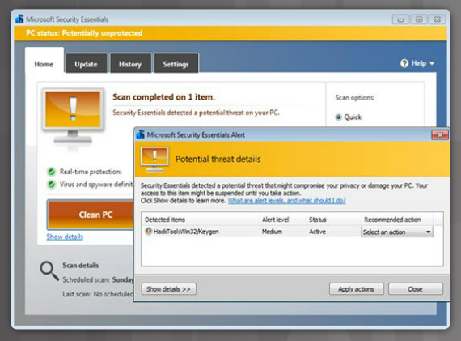

- **Proteção de Adware** — O programa procura continuamente por programas que exibem publicidade em um computador.

- **Proteção contra Phishing** — O programa bloqueia os endereços IP de websites de phishing conhecidos e alerta o utilizador sobre sites suspeitos.

- **Proteção contra Spyware** — O programa procura por keyloggers e outro software de espionagem (spyware).

- **Fontes confiáveis/não confiáveis** — O programa avisa o utilizador sobre programas inseguros que tentam instalar ou websites inseguros antes do utilizador os visitar.

Podem ser necessários vários programas diferentes e múltiplos scans para remover completamente todo o software malicioso. Execute apenas um programa de proteção contra malware de cada vez.

Várias organizações de segurança respeitáveis, como McAfee, Symantec e Kaspersky, oferecem proteção contra malware com tudo incluído para computadores e dispositivos móveis.

Seja cauteloso com os produtos antivírus falsos maliciosos que podem aparecer durante a navegação na Internet. A maioria desses produtos antivírus falsos exibe um anúncio ou pop-up que se parece com uma janela de alerta real do Windows, como se mostra na Figura a seguir. Geralmente, estes afirmam que tem malware a infectar o computador e pede ao utilizador para o remover. Clicando em qualquer lugar dentro da janela pode fazer começar o download e a instalação do malware.

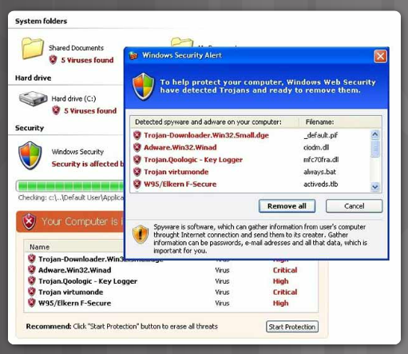

O software não aprovado ou não compatível não é apenas software que um utilizador instala involuntariamente num computador. Este também pode vir de utilizadores que o pretendem instalar. Pode não ser malicioso, mas ainda assim pode violar a política de segurança. Este tipo de sistema não compatível pode interferir com o software da empresa, ou com os serviços de rede. Os utilizadores devem remover imediatamente software não aprovado.

#### 7.1.1.3 Gestão de Patches

**Patches são atualizações de código que os fabricantes fornecem para prevenir que um vírus ou worm recém-descoberto realize um ataque bem-sucedido**. De tempos em tempos, os fabricantes combinam patches e upgrades numa atualização completa de uma aplicação chamado service pack. Muitos ataques devastadores de vírus poderiam ter sido muito menos graves se mais utilizadores tivessem descarregado e instalado o service pack mais recente.

O Windows procura regularmente no website do Windows Update por atualizações de alta prioridade que podem ajudar a proteger um computador contra as ameaças de segurança mais recentes. Estas atualizações incluem atualizações de segurança, atualizações críticas e service packs. Dependendo da configuração ativa, o Windows descarrega e instala automaticamente as atualizações de alta prioridade que o computador precisa ou notifica o utilizador à medida que essas atualizações se tornam disponíveis.

**Algumas organizações podem querer testar um patch antes do implantar em toda a organização**. A organização utilizaria um serviço para gerir os patches localmente em vez de usar o serviço de atualização on-line do fornecedor. Os benefícios do uso de um serviço automatizado de atualização de patches incluem o seguinte:

- Os administradores podem:
	- aprovar ou recusar atualizações
	- forçar a atualização de sistemas para uma data específica
	- obter relatórios sobre a atualização necessária para cada sistema
- Cada computador não precisa de se ligar ao serviço do fornecedor para descarregar os patches; um sistema obtém a atualização de um servidor local
- Os utilizadores não podem desativar ou contornar atualizações

Um serviço de patch automatizado fornece aos administradores uma configuração mais controlada.

#### 7.1.1.4 Firewalls baseados no Anfitrião e Sistemas de Detecção de Intrusões

Uma solução baseada no anfitrião é uma aplicação de software que é executada num computador anfitrião local para o proteger. O software opera conjuntamente com o sistema operativo para ajudar a prevenir ataques.

**Firewalls baseados no Anfitrião**

Um firewall por software é um programa que é executado num computador para permitir ou negar o tráfego entre o computador e outros computadores ligados. O firewall por software aplica um conjunto de regras às transmissões de dados por meio de inspeção e filtragem de pacotes de dados. O Firewall do Windows é um exemplo de um firewall por software. O sistema operativo Windows instala-o por padrão durante a sua instalação.

**O utilizador pode controlar o tipo de dados enviados de e para o computador abrindo ou bloqueando certas portas selecionadas**. Os firewalls bloqueiam as ligações de rede de entrada e saída, a menos que sejam definidas exceções para abrir e fechar certas portas requeridas por um programa.

Na Figura, o utilizador seleciona as **Regras de Direção de Entrada (Inbound Rules)** para configurar o tipo de tráfego permitido passar através do sistema. A configuração de Regras de Direção de Entrada ajudará a proteger o sistema contra tráfego indesejado.

**Sistemas de Deteção de Intrusão em Anfitriões**

Um sistema de detecção de intrusão de anfitrião (**HIDS**) **é um software que é executado num computador anfitrião que monitoriza atividades suspeitas**. Cada servidor ou sistema de desktop que requer proteção precisará ter o software instalado, conforme se mostra na Figura a seguir.

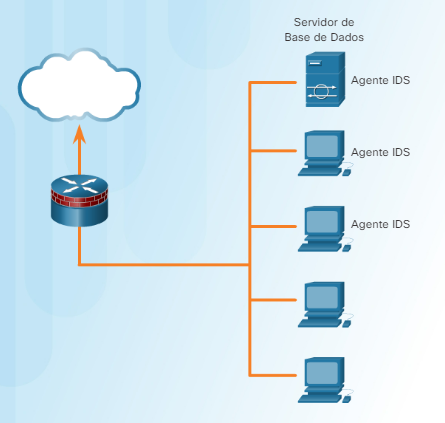

O HIDS monitoriza as chamadas do sistema e o acesso ao sistema de gestão de ficheiros para garantir que as solicitações não sejam o resultado de atividades maliciosas. Este pode **também monitorizar as configurações do registo do sistema**. O registro mantém informações de configuração sobre o computador.

O HIDS armazena localmente todos os dados de log. Este também **pode afetar o desempenho do sistema porque é exigente em termos de recursos**. Um sistema de detecção de intrusão em anfitrião não pode monitorizar o tráfego de rede que não atinja o sistema anfitrião, mas monitoriza o sistema operativo e os processos críticos do sistema específicos desse anfitrião.

#### 7.1.1.5 Segurança de Comunicações

Quando se ligam à rede local e a ficheiros partilhados, a comunicação entre computadores permanece dentro dessa rede. Os dados permanecem seguros porque estão fora de outras redes e da Internet. Para comunicar e partilhar recursos através de uma rede que não é segura, os utilizadores empregam uma Rede Privada Virtual (VPN).

Uma VPN é uma rede privada que liga sites remotos ou utilizadores através de uma rede pública, como a Internet. O tipo mais comum de VPN acede a uma rede privada empresarial. A VPN usa ligações seguras dedicadas, encaminhadas pela Internet, desde a rede privada empresarial até ao utilizador remoto. **Quando ligados à rede privada empresarial, os utilizadores tornam-se parte dessa rede e têm acesso a todos os serviços e recursos como se estivessem ligados fisicamente à LAN empresarial**.

Os utilizadores de acesso remoto devem ter um cliente VPN instalado nos seus computadores para estabelecer uma ligação segura com a rede privada empresarial:

1. o software cliente VPN cifra os dados 
2. enviam pela Internet para o gateway VPN na rede privada empresarial 
3. os gateways VPN estabelecem, gerem e controlam as ligações VPN, também conhecidas como túneis VPN.

Os sistemas operativos incluem um cliente VPN que o utilizador configura para uma ligação VPN.

#### 7.1.1.6 Lab — Blindagem de um Sistema Linux

Neste laboratório, irá demonstrar a utilização de uma ferramenta de registo de segurança (auditoria) para blindar um sistema Linux.

[Lab - Blindagem de um Sistema Linux](https://contenthub.netacad.com/legacy/CyberEss/1.1/pp/course/files/7.1.1.6%20Lab%20-%20Hardening%20a%20Linux%20System.pdf)

### 7.1.2 Blindagem de Dispositivos Móveis e Sem fios

#### 7.1.2.1 WEP

Um dos componentes mais importantes da computação moderna são os dispositivos móveis. A maioria dos dispositivos encontrados nas redes atuais são portáteis, tablets, smartphones e outros dispositivos sem fios. Os dispositivos móveis transmitem dados usando sinais de rádio que qualquer dispositivo com uma antena compatível pode receber. Por esta razão, a indústria de computadores desenvolveu um conjunto de normas de segurança sem fios ou móveis, produtos e dispositivos. **Estas normas cifram as informações transmitidas por dispositivos móveis através das ondas no ar**.

**Wired Equivalent Privacy (WEP)** é uma das primeiras e amplamente utilizadas normas de segurança WiFi. A norma WEP fornece proteção de autenticação e criptografia. As normas WEP estão obsoletas, mas muitos dispositivos ainda suportam WEP por questão de retro compatibilidade com versões anteriores. A norma WEP tornou-se um padrão de segurança WiFi em 1999, quando as comunicações sem fios estavam apenas na fase inicial. Apesar das revisões à norma e um aumento do tamanho da chave, a WEP sofreu de inúmeras vulnerabilidades de segurança. Os cibercriminosos podem quebrar palavras-passe WEP em minutos usando software gratuito disponível. Apesar das melhorias, **o WEP mantém-se altamente vulnerável e os utilizadores devem atualizar os sistemas que ainda dependem dele**.

#### 7.1.2.2 WPA/WPA2

A seguinte grande melhoria à segurança sem fios foi a introdução do WPA e WPA2. O **WiFi Protected Access (WPA)** foi a resposta da indústria de computadores às inseguranças do padrão WEP. A configuração mais comum de WPA é WPA-PSK (Chave Pré-partilhada).**As chaves usadas pelo WPA são de 256 bits, um aumento significativo sobre as chaves de 64 bits e 128 bits usadas no sistema WEP**.

A norma WPA forneceu várias melhorias de segurança. Primeiro, o WPA forneceu verificações de integridade de mensagem (MIC) que permitem **detetar se um invasor tinha capturado e alterado dados passados entre o ponto de acesso sem fios e um cliente sem fios**. Outra melhoria de segurança das chaves foi o protocolo Temporal Key Integrity Protocol (TKIP). **A norma TKIP forneceu a capacidade de melhor manipular, proteger e alterar chaves de criptografia**. O Advanced Encryption Standard (AES) substituiu o protocolo TKIP para uma melhor gestão de chaves e proteção de criptografia.

O WPA, tal como o seu antecessor WEP, incluia várias vulnerabilidades bastante conhecidas. Como resultado, em 2006 assistiu-se ao lançamento da norma WiFi Protected Access II (WPA2). **Uma das melhorias de segurança mais significativas do WPA face ao WPA2, foi o uso obrigatório dos algoritmos AES e a introdução do Protocolo de Código de Autenticação de Mensagens em Cadeia de Blocos de Cifra no Modo Contador ou o protocolo no modo CCM, como substituto do TKIP**.

#### 7.1.2.3 Autenticação Mútua

Uma das grandes vulnerabilidades das redes sem fios é o uso de pontos de acesso desonestos (**rogue access points**). Os Pontos de Acesso são os dispositivos que comunicam com os dispositivos sem fios e os ligam à rede cablada. **Qualquer dispositivo que tenha um transmissor sem fios e uma interface com fios a uma rede pode potencialmente atuar como um ponto de acesso não autorizado ou desonesto**. O ponto de acesso desonesto pode imitar um ponto de acesso autorizado. O resultado é que os dispositivos sem fios na rede estabelecem uma comunicação com o ponto de acesso desonesto em vez de com o ponto de acesso autorizado.

O impostor pode receber pedidos de ligação, copiar os dados contidos nos pedidos e encaminhá-los para o ponto de acesso de rede autorizado. Esse tipo de ataque man-in-the-middle é muito difícil de detectar e pode resultar no roubo de credenciais de login e dos dados transmitidos. Para evitar pontos de acesso desonestos, a indústria de computadores desenvolveu a autenticação mútua. A autenticação mútua, também chamada de autenticação bidireccional, é um processo ou tecnologia em que ambas as entidades envolvidas num link de comunicações se autenticam entre si. Num ambiente de rede sem fios, o cliente autentica-se no ponto de acesso e o ponto de acesso autentica-se no cliente. Essa melhoria dotou os clientes da capacidade de detectar pontos de acesso desonestos antes de se ligar ao dispositivo não autorizado.

#### 7.1.2.4 Atividade — Blindagem de Dispositivos Móveis e Sem fios

| Descrições de Contramedidas Sem Fios                                                                                                                                 | WEP | WPA/2 | Autenticação Mútua |
| -------------------------------------------------------------------------------------------------------------------------------------------------------------------- |:---:|:-----:|:------------------:|
| A norma de segurança Wi-Fi que exigia o uso obrigatório de algoritmos de criptografia AES.                                                                           |     |   x   |                    |
| Esta contra-medida foi desenvolvida para combater os problemas colocados pelos pontos de acesso náo autorizados.                                                     |     |       |         x          |
| Uma das primeiras normas de segurança Wi-Fi para autenticação e cifragem.                                                                                            |  x  |       |                    |
| Um tipo de contramedida de segurança Wi-Fi que incluía verificações de integridade de mensagens (MIC).                                                               |     |   x   |                    |
| Um tipo de contramedida de segurança Wi-Fi que sofreu com inúmeras vulnerabilidades de segurança.                                                                    |  x  |       |                    |
| Um tipo de contramedida de segurança Wi-Fi que requer autenticação bidirecional na qual ambas as entidades em uma ligaçào de comunicaçóes se autenticam uma à outra. |     |       |         x          |

### 7.1.3 Proteção de Dados nos Hosts
#### 7.1.3.1 Controlo de Acesso a Ficheiros

**As permissões são regras configuradas para limitar o acesso a pastas ou ficheiros a um utilizador individual ou a um grupo de utilizadores**. A figura lista as permissões disponíveis para os ficheiros e pastas.

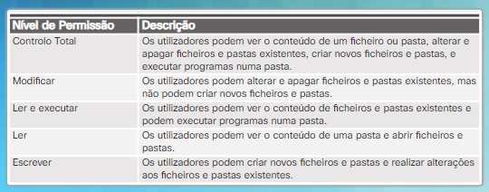

**Princípio do Menor Privilégio**

**Os utilizadores devem ser limitados apenas aos recursos que necessitem num sistema computacional ou numa rede**.

> Por exemplo, eles não devem ser capazes de aceder a todos os ficheiros num servidor se só precisam de acesso a uma única pasta.

Pode ser mais fácil fornecer aos utilizadores acesso a toda a unidade, mas é mais seguro limitar o acesso apenas à pasta que precisam para realizar o seu trabalho. Este é o princípio do menor privilégio.  
Limitar o acesso aos recursos também impede que programas maliciosos acedam a estes recursos se o computador do utilizador for infectado.

**Restringir as Permissões de Utilizador**

Se um administrador negar as permissões a uma partilha de rede a um utilizador ou grupo, essa negação substituirá quaisquer outras configurações de permissão.

> Por exemplo, se o administrador negar a permissão a alguém a uma partilha de rede, o utilizador não poderá aceder a essa partilha, mesmo que o utilizador seja o administrador ou faça parte do grupo de administradores. A política de segurança local deve descrever quais os recursos e o tipo de acesso permitidos para cada utilizador e grupo.

Quando um utilizador altera as permissões de uma pasta, ela tem a opção de aplicar as mesmas permissões a todas as subpastas. Esta é a **propagação de permissões**. A propagação de permissões é uma maneira fácil de aplicar permissões a vários ficheiros e pastas rapidamente. Depois das permissões da pasta primária (*parent*) tiverem sido definidas, as pastas e ficheiros criados dentro da pasta primária herdam as permissões da pasta primária.

Além disso, **a localização dos dados e a ação executada nos dados determinam a propagação da permissão**:

- Num mesmo volume:
	- Os dados movidos para o mesmo manterão as permissões originais
	- Os dados copiados para o mesmo herdarão novas permissões 
- Num volume diferente:
	- Os dados movidos herdarão novas permissões
	- Os dados copiados herdarão nova permissão

#### 7.1.3.2 Cifragem de Ficheiros

A Criptografia é uma ferramenta usada para proteger os dados. A criptografia transforma dados usando um algoritmo complicado para torná-los ilegíveis. Uma chave especial retorna as informações ilegíveis de volta em dados legíveis. Certos programas de software cifram ficheiros, pastas e até mesmo unidades de suporte de dados (drives) inteiras.

O Sistema de cifração ou **Encriptação de Ficheiros (EFS)**, é uma funcionalidade do Windows que pode cifrar os dados. A implementação Windows de EFS vincula-o diretamente a uma conta de utilizador específica. Só o utilizador que cifrou os dados poderá aceder aos ficheiros e pastas cifrados.

Um utilizador também pode optar por cifrar um disco rígido inteiro no Windows usando um recurso chamado **BitLocker**. **Para usar o BitLocker, pelo menos dois volumes devem estar presentes num disco rígido**.

Antes de usar o BitLocker, **o utilizador precisa de habilitar o Trusted Platform Module (TPM)** na BIOS. O TPM é um chip especializado instalado na placa-mãe. O TPM armazena informações específicas do sistema hospedeiro, como chaves de cifração, certificados digitais e senhas. Aplicações, como o BitLocker, que usam criptografia podem fazer uso do chip TPM.

**O BitLocker To Go cifra as unidades removíveis**. O BitLocker To Go não usa um chip TPM, mas continua a fornecer criptografia para os dados e requer uma senha.

#### 7.1.3.3 Backups de Dados e Sistema

Uma organização pode perder dados se os cibercriminosos roubarem os dados, o equipamento falhar ou ocorrer um desastre. Por esse motivo, é importante realizar um backup de dados regularmente.

**Um backup de dados armazena uma cópia das informações de um computador para um suporte de backup removível**. O operador armazena o suporte de backup num local seguro. A realização de backup de dados é uma das formas mais eficazes de proteção contra perda de dados. Se o hardware do computador falhar, o utilizador poderá restaurar os dados do backup logo que o sistema esteja novamente funcional.

A política de segurança da organização deve incluir backups de dados. Os utilizadores devem realizar backups de dados regularmente. Os backups de dados geralmente são armazenados fora do local atual para proteger o suporte de backup se algo acontecer à instalação principal.

Estas são algumas considerações para os backups de dados:

- **Frequência** - Os backups podem levar muito tempo a realizar. Por vezes, é mais fácil fazer um backup completo mensal ou semanal e, de seguida, fazer backups parciais frequentes de quaisquer dados que tenham sido alterados desde o último backup completo. No entanto, ter muitos backups parciais aumenta o tempo necessário para restaurar os dados.

- **Armazenamento** — Para maior segurança, transportar os backups para um local de armazenamento externo aprovado numa base diária, semanal ou mensal, conforme requerido pela política de segurança.

- **Segurança** — Proteger os backups com palavras-passe. De seguida, o operador insere a palavra-passe antes de restaurar os dados do suporte de backup.

- **Validação** — Validar os backups para garantir a integridade dos dados.

### 7.1.4 Controlo de Imagens e Conteúdo

#### 7.1.4.1 Triagem e Bloqueio de Conteúdo

O **software de controlo de conteúdo restringe o conteúdo que um utilizador pode aceder usando um navegador Web pela Internet**. Ele pode bloquear sites que contenham certos tipos de material, como pornografia ou conteúdo religioso ou político controversos. Um progenitor pode implementar software de controlo de conteúdo no computador usado por uma criança. As bibliotecas e escolas também implementam o software para impedir o acesso a conteúdos considerados censuráveis.

Um administrador pode implementar os seguintes tipos de filtros:

- **de navegador** através de uma extensão de navegador criada por terceiros
- **de email** através de um filtro num cliente ou servidor de email
- **do lado do cliente** instalados num computador específico
- **de conteúdo num router** que impedem a entrada de tráfego na rede
- **de conteúdo num dispositivo de rede** (appliance) semelhante ao de um router
- **de conteúdo na cloud**

Os mecanismos de busca, como o Google, oferecem a opção de ativar um filtro de segurança para excluir hiperligações inapropriadas nos resultados da pesquisa.

Clique [aqui](https://en.wikipedia.org/wiki/Comparison_of_content-control_software_and_providers) para ver uma comparação dos fornecedores de software de controlo de conteúdo.

#### 7.1.4.2 Clonagem de Disco e Congelamento Profundo

Estão disponíveis muitas aplicações de terceiros para restaurar um sistema de volta a um estado padrão. Isto permite que o administrador proteja o sistema operativo e os ficheiros de configuração de um sistema.

**A clonagem de disco copia o conteúdo do disco rígido do computador para um ficheiro imagem. **

> Por exemplo, um administrador cria as partições necessárias num sistema, formata a partição e instala de seguida o sistema operativo. Instala todo o software aplicacional necessário e configura todo o hardware. De seguida, o administrador usa o software de clonagem de disco para criar o ficheiro imagem.

O administrador pode usar a imagem clonada da seguinte forma:

- Para limpar automaticamente um sistema e restaurar uma imagem master limpa
- Para implantar novos computadores dentro da organização
- Para fornecer um backup completo do sistema

Clique [aqui](https://en.wikipedia.org/wiki/Comparison_of_disk_cloning_software) para uma comparação do software de clonagem de disco.

**Deep Freeze “congela” a partição do disco rígido**. Quando um utilizador reinicia o sistema, o sistema reverte para sua configuração congelada. O sistema não salva nenhuma alteração que o utilizador faz, portanto, todas as aplicações instaladas ou ficheiros salvos são perdidos quando o sistema é reiniciado.

Se o administrador precisar de alterar a configuração do sistema, este deve primeiro “descongelar” a partição protegida desativando o Deep Freeze. Depois de fazer as alterações, deve reativar o programa. O administrador pode configurar o Deep Freeze para reiniciar após um utilizador efetuar o logout, encerrar após um período de inatividade ou num horário agendado.

Estes produtos não oferecem proteção em tempo real. Um sistema permanece vulnerável até que o utilizador ou um evento agendado reinicie o sistema. Um sistema infectado com código malicioso, porém, obtém um arranque fresco assim que o sistema é reiniciado.

### 7.1.5 Proteção Física das Estações de Trabalho

#### 7.1.5.1 Cabos e Cadeados de Segurança

Existem vários métodos de proteção física de equipamento informático:

- Usar cadeados de cabos com equipamento.
- Manter as salas de telecomunicações trancadas.
- Colocar o equipamento em gaiolas de segurança.

Muitos dispositivos portáteis e monitores de computador caros têm um braço de segurança de aço especial construído para usar em conjunto com os cadeados de cabo.

O tipo mais comum de fechadura de porta é uma fechadura com uma chave. Esta não bloqueia automaticamente quando a porta se fecha. Além disso, um indivíduo pode colocar um cartão de plástico fino, como um cartão de crédito, entre a fechadura e o revestimento da porta para forçar a abertura da porta. As fechaduras das portas em edifícios comerciais são diferentes das fechaduras das portas residenciais. Para segurança adicional, uma trava de segurança fornece segurança extra. Qualquer bloqueio que exija uma chave, no entanto, representa uma vulnerabilidade se as chaves forem perdidas, roubadas ou duplicadas.

Uma fechadura com código de segurança, usa botões que um utilizador pressiona numa determinada sequência para abrir a porta. É possível programar uma fechadura com código de segurança. Isto significa que o código de um utilizador só pode funcionar durante determinados dias ou determinados horários. Por exemplo, uma fechadura com código de segurança só pode permitir o acesso do Bob à sala do servidor entre as 7h e as 18h de segunda a sexta-feira. Uma fechadura com código de segurança também pode manter um registro de quando a porta abriu, e o código usado para a abrir.

#### 7.1.5.2 Temporizadores de Logout

Um funcionário pode levantar-se e deixar o seu computador para fazer uma pausa. Se o funcionário não tomar nenhuma ação para proteger a sua estação de trabalho, qualquer informação nesse sistema fica vulnerável a um utilizador não autorizado. Uma organização pode tomar as seguintes medidas para impedir acessos não autorizados:

**Tempo de Inatividade e Bloqueio de Ecrã**

Os funcionários podem ou não fazer log out do computador quando deixam o local de trabalho. Portanto, **é uma prática recomendada de segurança configurar um temporizador de inatividade que, automaticamente, encerra a sessão do utilizador e/ou bloqueia o ecrã**. O utilizador deve fazer login novamente para desbloquear a tela.

**Horários de Login**

Nalgumas situações, uma organização pode querer que os funcionários façam login durante horários específicos, como das 7h às 18h. O sistema bloqueia logins durante as horas fora do horário permitido para login.

#### 7.1.5.3 Rastreamento GPS

O Sistema de Posicionamento Global (GPS) usa satélites e computadores para determinar a localização de um dispositivo. A tecnologia GPS é um recurso padrão nos smartphones que fornece o rastreamento da posição em tempo real. O rastreamento GPS pode identificar um local dentro de 100 metros. Esta tecnologia está disponível para rastrear crianças, idosos, animais de estimação e veículos. Utilizar o GPS para localizar um telemóvel sem a permissão do utilizador, é uma invasão de privacidade e é ilegal.

Muitas apps de telemóvel usam rastreamento GPS para rastrear a localização de um telefone.

> Por exemplo, o Facebook permite que os utilizadores façam check-in num local, que é depois visível às pessoas das suas redes sociais.

#### 7.1.5.4 Inventário e Etiquetas RFID

A **Identificação por Radiofrequência (RFID)** usa ondas de rádio para identificar e acompanhar objetos. Os sistemas de inventário RFID usam tags anexadas a todos os itens que uma organização deseja rastrear. As etiquetas contêm um circuito integrado que se liga a uma antena. As etiquetas RFID são pequenas e exigem muito pouca energia, portanto não precisam de uma bateria para armazenar a informação a trocar com um leitor. O RFID pode ajudar a automatizar o rastreamento de ativos ou bloquear, desbloquear ou configurar dispositivos eletrónicos sem fios.

Os sistemas RFID operam dentro de diferentes frequências. Os sistemas de baixa frequência têm uma faixa de leitura mais curta e taxas de leitura de dados mais lentas, mas não são tão sensíveis à interferência de ondas de rádio causadas por líquidos e metais que estejam presentes. Frequências mais altas têm uma taxa de transferência de dados mais rápida e intervalos de leitura mais longos, mas são mais sensíveis à interferência de ondas de rádio.

#### 7.1.5.5 Atividade - Defesa de Sistemas e Dispositivos

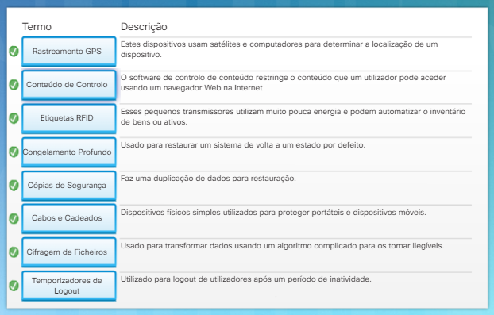

## 7.2 Blindagem do Servidor

### 7.2.1 Acesso Remoto Seguro

#### 7.2.1.1 Administração do Acesso Remoto

**Acesso remoto refere-se a qualquer combinação de hardware e software que permite aos utilizadores aceder remotamente a uma rede interna local**.

Com o sistema operativo Windows, os técnicos podem usar a Área de Trabalho Remota e a Assistência Remota para reparar e atualizar computadores. A Área de Trabalho Remota, como se mostra na figura, permite que os técnicos visualizem e controlem um computador a partir de um local remoto. A Assistência Remota permite que os técnicos assistam os clientes com problemas desde um local remoto. A Assistência Remota também permite que o cliente vejam no ecrã a reparação ou a atualização em tempo real.

O processo de instalação do Windows não habilita a área de trabalho remota por padrão. Habilitar esta funcionalidade abre a porta 3389 e pode resultar numa vulnerabilidade se um utilizador não necessitar deste serviço.

#### 7.2.1.2 Telnet, SSH e SCP

O **Secure Shell (SSH) é um protocolo que fornece uma ligação de administração segura (criptografada) a um dispositivo remoto**. O SSH deve substituir Telnet durantes as ligações de administração.

**O Telnet é um protocolo mais antigo que usa transmissão de texto claro inseguro tanto durante a autenticação de login** (nome de utilizador e palavra-passe) **como na transmissão de dados entre os dispositivos em comunicação**.

O SSH fornece segurança para ligações remotas, fornecendo criptografia forte quando um dispositivo se autentica (nome de utilizador e palavra-passe) e para transmitir dados entre os dispositivos em comunicação. O SSH usa a porta TCP 22. O Telnet usa a porta TCP 23.

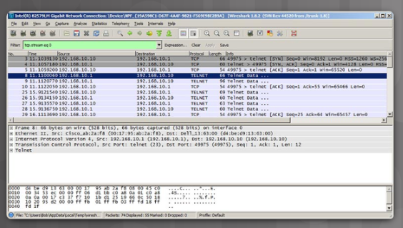

Na Figura acima, os cibercriminosos monitorizam os pacotes usando o Wireshark.

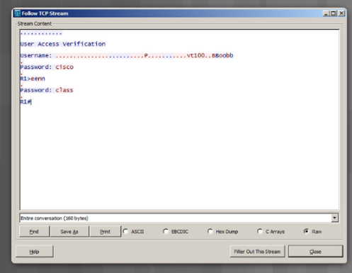

Na figura acima, os cibercriminosos capturam o nome de utilizador e a palavra-passe do administrador da sessão Telnet a partir do texto claro.

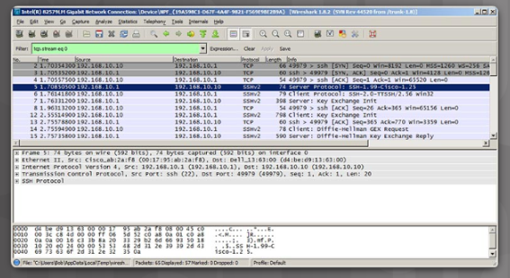

A Figura acima mostra a visão do Wireshark de uma sessão SSH. Os cibercriminosos seguem a sessão usando o endereço IP do dispositivo do administrador, mas na Figura abaixo, a sessão cifra o nome do utilizador e a sua palavra-passe.

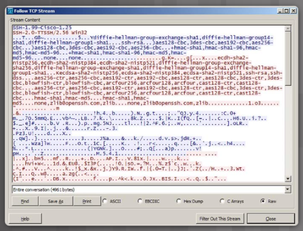

O **Secure Copy (SCP) transfere com segurança ficheiros de computador entre dois sistemas remotos**. O SCP usa o SSH para transferência de dados (incluindo o elemento de autenticação), de modo que o SCP garante a autenticidade e a confidencialidade dos dados durante o trânsito.

### 7.2.2 Medidas Administrativas

#### 7.2.2.1 Segurança de Portas e Serviços

Os cibercriminosos exploram os serviços em execução num sistema porque sabem que a maioria dos dispositivos executa mais serviços ou programas do que necessitam. **Um administrador deve examinar todos os serviços para verificar a sua necessidade e avaliar os seus riscos**. Remova quaisquer serviços desnecessários.

Um método simples que muitos administradores usam para ajudar a proteger a rede contra acesso não autorizado é desabilitar todas as portas não utilizadas num switch. 

> Por exemplo, se um switch tem 24 portas e há três ligações Fast Ethernet em uso, é uma boa prática desabilitar as 21 portas não utilizadas.

O processo de ativação e desativação de portas pode ser demorado, mas aumenta a segurança na rede e vale a pena o esforço.

#### 7.2.2.2 Contas Privilegiadas

Os cibercriminosos exploram as contas privilegiadas porque são as contas com mais poder da organização. **As contas privilegiadas têm as credenciais para obter acesso aos sistemas e fornecem acesso elevado e irrestrito**. Os administradores usam estas contas para implantar e gerir os sistemas operativos, aplicações e dispositivos de rede. 

> organizar em uma tabela

Contas de Adrrmmstrador Local
• Proporcionam acesso sem ao computador anfitrião local.
• Utilizadas para realizar manutenção em de trabalho, servidores,
bancos de dados e dispositivos de rede.
• Urna palavra-passe partilhada por muitos dispositivos anfitrião cria um
alvo.

Contas de Utilizador Privilegiado
• Credenciais para conceder privilégios administrativos em um ou mais sistemas.
• Utilizadas em todos os sistemas geridos.
• Prática comum para monitorizar a utilização destas contas.

Contas de Domínio Administrativo
• Proporcionam acesso administrativo privilegiado a estações de trabalho e servidores dentro de um domínio Windows,
• Fornecem acesso extensivo através da rede.
• Fornecem controlo sobre todos os controladores de domínio para modificar a adesão ao domínio.

Contas de Emergência
• Proporcionam aos utilizadores não privilegiados acesso administrativo a
sistemas seguros.
• Usadas em caso de uma emergência.

Contas de Serviço
• Utilizadas por uma aplicação ou serviço para interagir com o sistema operativo.
• Podem ter privilégios administrativos de domínio.
• Alterações de palavras-passe são um desafio, uma vez que estas contas interagem com muitos componentes do Windows.

Contas de Aplicação
• As contas de aplicações são usadas por para aceder a bases
de dados, executar scripts ou fornecer acesso a outras aplicações.
• Estas têm acesso amplo à informação da empresa que reside em aplicações e bases de dados.

A organização deve adotar as melhores práticas seguintes para proteger contas privilegiadas:

- Identificar e reduzir o número de contas privilegiadas
- Aplicar o princípio do menor privilégio
- Estabelecer um processo de revogação de direitos quando os funcionários saem ou mudam de emprego
- Eliminar contas partilhadas com palavras-passe que não expiram
- Armazenamento seguro de palavras-passe
- Eliminar credenciais partilhadas para vários administradores
- Alterar automaticamente palavras-passe de conta privilegiadas todos os 30 ou 60 dias
- Gravar sessões privilegiadas
- Implementar um processo para alterar palavras-passe embebidas para scripts e contas de serviço
- Registar todas as atividades do utilizador
- Gerar alertas para comportamento incomum
- Desativar contas privilegiadas inativas
- Usar autenticação multifator para todo o acesso administrativo
- Implementar um gateway entre o utilizador final e os ativos sensiveis para limitar a exposição da rede a malware

**Bloquear as contas privilegiadas é fundamental para a segurança da organização**. A proteção destas contas precisa de ser um processo contínuo. Uma organização deve avaliar este processo para fazer os ajustes necessários para melhorar a segurança.

#### 7.2.2.3 Políticas de Grupo

Na maioria das redes que usam computadores Windows, um administrador configura o **Active Directory** com Domínios num Windows Server. Os computadores Windows são membros de um domínio. O administrador configura uma Política de Segurança de Domínio que se aplica a todos os computadores que se associam. As políticas de conta são definidas automaticamente quando um utilizador faz login no Windows.

Quando um computador não faz parte de um domínio do Active Directory, o utilizador configura as políticas por meio da **Política de Segurança Local** do Windows. Em todas as versões do Windows exceto o Home edition, introduza **secpol.msc** no comando Executar para abrir a ferramenta da Política de Segurança Local.

Um administrador configura as políticas de conta de utilizador, como as políticas de palavra-passe e políticas de bloqueio, expandindo Diretivas de Conta > Política de Palavra-Passe. Com as configurações, os utilizadores devem alterar suas palavras-chave a cada 90 dias e usar a nova palavra-passe por pelo menos um (1) dia. As palavras-passe devem conter oito (8) caracteres e três das seguintes quatro categorias: letras maiúsculas, letras minúsculas, números e símbolos. Por fim, o utilizador pode reutilizar uma palavra-passe após 24 palavra-passes únicas.

Uma política de bloqueio de conta bloqueia um computador durante a duração configurada quando ocorrem muitas tentativas de login incorretas.

> Por exemplo, a política mostrada na Figura permite que o utilizador incorpore o nome de utilizador e/ou a palavra-passe errados cinco vezes. Após cinco tentativas, a conta bloqueia os utilizadores por 30 minutos. Após os 30 minutos, o número de tentativas é reposto a zero e o utilizador pode tentar fazer login novamente.
> 
> 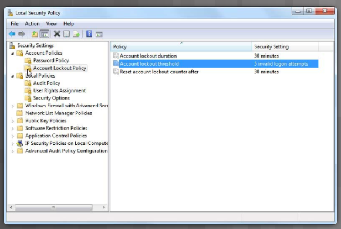

Mais configurações de segurança estão disponíveis expandindo a pasta **Políticas Locais.** Uma Política de Auditoria cria um ficheiro de log de segurança usado para rastrear os eventos apresentados na Figura a seguir.

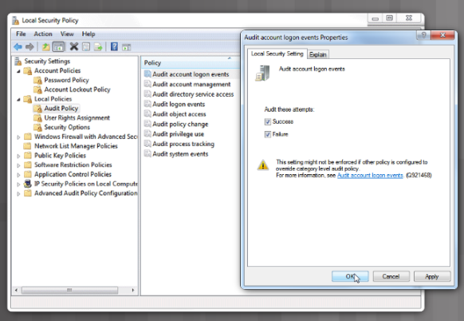

#### 7.2.2.4 Ativar os Registos e Alertas

**Um log regista todos os eventos à medida que estes ocorrem**. As entradas do registo compõem um ficheiro log, e uma entrada contém todas as informações relacionadas com um evento específico. Os registos relacionados com a segurança do computador têm crescido de importância.

> Por exemplo, um log de auditoria rastreia as tentativas de autenticação do utilizador e um log de acesso fornece todos os detalhes sobre pedidos por ficheiros específicos num sistema. Os logs do Sistema de Monitorização podem determinar como ocorreu um ataque e se as defesas implantadas foram bem-sucedidas.

Com o aumento do enorme número de ficheiros de log gerados para fins de segurança do computador, a organização deve considerar um processo de **gestão de logs**. A gestão de logs **determina o processo de geração, transmissão, armazenamento, análise e eliminação de dados de log de segurança do computador**.

**Logs dos Sistemas Operativos**

O sistema operativo registra eventos que ocorrem devido a ações operacionais executadas pelo sistema operativo. Os eventos do sistema incluem os seguintes:

- Os pedidos de clientes e as respostas do servidor, como as autenticações de utilizadores bem-sucedidas
- As informações de utilização que contêm o número e o dimensão das transações num determinado período de tempo

**Logs de Segurança Aplicacional**

As organizações usam software de segurança baseado em rede ou baseado num sistema para detectar atividades mal-intencionadas. Este software gera um registo de segurança para fornecer dados de segurança do computador. Os logs são úteis para realizar análises de auditoria e identificar tendências e problemas de longo prazo. Os logs também permitem que uma organização forneça documentação mostrando que está em conformidade com as leis e requisitos regulamentares.

### 7.2.3 Proteção Física de Servidores

#### 7.2.3.1 Alimentação

Um problema crítico na proteção dos sistemas de informação são os sistemas de energia elétrica e considerações de energia. Um fornecimento contínuo de energia elétrica é fundamental nas atuais enormes instalações de servidores e para armazenamento de dados. Algumas regras gerais na construção de sistemas de alimentação elétrica eficazes são:

- Os data centers devem estar numa fonte de alimentação diferente do resto do edifício
- Fontes de energia redundantes: duas ou mais alimentações provenientes de duas ou mais subestações elétricas
- Condicionamento de energia
- Os sistemas de energia de backup são frequentemente necessários
- UPS deve estar disponível para desligar os sistemas de forma normal

Uma organização deve-se proteger de vários problemas aquando o projeto dos seus sistemas de fornecimento de energia elétrica.

**O Excesso de Energia**

- *Spike*: sobretensão momentânea
- *Surge*: sobretensão prolongada

**Perda de Potência**

- *Falha*: perda momentânea de energia
- *Blackout*: perda completa de energia

**Degradação de Energia**

- *SAG/DIP*: queda de tensão momentânea
- *Brownout*: queda de tensão prolongada
- *Corrente de Inrush*: energia de arranque inicial

#### 7.2.3.2 Aquecimento, Ventilação e Ar Condicionado (HVAC)

Os sistemas HVAC são fundamentais para a segurança das pessoas e sistemas de informação nas instalações da organização. No projeto de modernas instalações TI, estes sistemas desempenham um papel muito importante na segurança global.

Os sistemas HVAC **controlam o ambiente (temperatura, humidade, fluxo de ar e filtragem de ar) e devem ser projetados e operados juntamente com outros componentes do data center**, como hardware computacional, cablagem, armazenamento de dados, proteção contra incêndios, sistemas de segurança física e energia. Quase todos os dispositivos de hardware de computador físico vêm com requisitos ambientais que incluem intervalos aceitáveis de temperatura e humidade. Os requisitos ambientais aparecem no documento das especificações de um produto ou num guia de planeamento físico. É fundamental manter esses requisitos ambientais para evitar falhas no sistema e prolongar a vida útil dos sistemas de TI. Sistemas de climatização comercial e outros sistemas de gestão de edifícios agora ligam-se à Internet para monitorização e controlo remoto. Eventos recentes mostraram que esses sistemas (muitas vezes chamados de “sistemas inteligentes”) também levantam grandes implicações de segurança.

Um dos riscos associados aos sistemas inteligentes é que os indivíduos que acedem e gerem ao sistema trabalham para uma entidade contratada ou para um fornecedor terceirizado. Como os técnicos de AVAC precisam de ser capazes de encontrar informações rapidamente, os dados cruciais tendem a ser armazenados em muitos lugares diferentes, tornando-os acessíveis a ainda mais pessoas. Tal situação permite que uma ampla rede de indivíduos, incluindo até mesmo associados de empreiteiros, ganhe acesso às credenciais de um sistema HVAC. A interrupção desses sistemas pode representar um risco considerável para a segurança da informação da organização.

#### 7.2.3.3 Monitorização de Hardware

A monitorização de hardware é **frequentemente encontrada em farms de grande servidores**. Um farm de servidores é uma instalação que aloja centenas ou milhares de servidores para empresas. O Google tem muitas farms de servidores em todo o mundo para fornecer serviços ideais. Mesmo empresas menores estão construindo farms de servidores locais para alojar o número crescente de servidores de que precisam para realizar os seus negócios. 

**Os sistemas de monitorização de hardware são usados para monitorizar a integridade desses sistemas e para minimizar o tempo de inatividade do servidor e da aplicação**. Os modernos sistemas de monitorização de hardware usam portas USB e de rede para transmitir a condição de temperatura do CPU, status da fonte de alimentação, velocidade e temperatura da ventoinha, status da memória, espaço em disco e status da placa de rede. Os sistemas de monitorização de hardware permitem que um técnico monitorize centenas ou milhares de sistemas a partir de um único terminal. Há medida que o número de farms de servidores continua a crescer, os sistemas de monitorização de hardware tornaram-se uma contramedida de segurança essencial.

#### 7.2.3.4 Atividade - Blindagem de Servidores

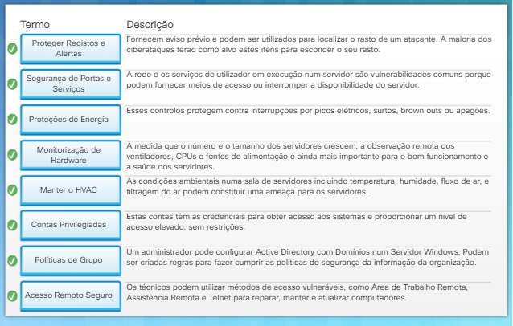

## 7.3 Blindagem da Rede

### 7.3.1 Proteção de Dispositivos de Rede

#### 7.3.1.1 Centros de Operação

O Centro de Operação de Rede (NOC) **é um ou mais locais que contêm as ferramentas que fornecem aos administradores um status detalhado da rede da organização**. O NOC é a base do alicerce para a depuração e solução de problemas de rede, monitorização de desempenho, distribuição e atualizações de software, administração de comunicações e administração de dispositivos.

**O Centro de Operações de Segurança (SOC) é um site dedicado que monitoriza, avalia e defende os sistemas de informação da organização**, como sites, aplicações, bases de dados, data centers, redes, servidores e sistemas de utilizadores. Um SOC é uma equipa de analistas de segurança que **detectam**, **analisam**, **respondem**, **relatam** e **evitam** incidentes de cibersegurança.

Ambas as entidades usam uma estrutura de camada hierárquica para manipular eventos. A primeira camada lida com todos os eventos e escala qualquer evento que não possa manipular para o segundo nível. A equipa do Nível 2 analisa o evento em detalhe e tentar resolvê-lo. Se não puderem, esta escala o evento para o Nível 3, os especialistas na matéria.

**Para medir a eficácia geral de um centro de operações, uma organização realizará simulacros e exercícios realistas**. Um exercício de simulação de mesa é um passo-a-passo estruturado por uma equipa para simular um evento e avaliar a eficácia do centro. Uma medida mais eficaz é simular uma intrusão de pleno direito sem aviso. Isto envolve o uso de uma Equipa Vermelha, ou Red Team, um grupo independente de indivíduos que desafia os processos dentro de uma organização, para avaliar a eficácia da organização. Por exemplo, a Equipa Vermelha deve atacar um sistema de missão crítica e incluir reconhecimento e ataque, escalonamento de privilégios e acesso remoto.

#### 7.3.1.2 Switches, Routers e Dispositivos de Rede

Os dispositivos de rede (**appliances**) são entregues sem palavras-passe ou senhas padrão. Altere as palavras-passe padrão antes de ligar qualquer dispositivo à rede. **Documente as alterações aos dispositivos de rede e registe as alterações**. Por fim, examine todos os logs de configuração.

As seções seguintes discutem várias medidas que um administrador pode tomar para proteger os vários dispositivos de rede.

**Switches**

Switches de rede **são o coração de uma rede moderna de comunicação de dados**. A principal ameaça aos switches de rede são o roubo, a invasão e acesso remoto, os ataques contra protocolos de rede como ARP/STP ou os ataques contra desempenho e disponibilidade.  
Várias contramedidas e controlos podem proteger os routers de rede, incluindo melhoria da segurança física, configurações avançadas, uso de protocolos de encaminhamento seguros com autenticação, e atualizações do sistemas e patches adequados, conforme necessário.  
Outro controlo efetivo é a implementação da segurança de portas. Um administrador deve proteger todas as portas do switch (interfaces) antes de colocar o switch para uso em produção. Uma forma de proteger portas é através da implementação de uma funcionalidade chamada segurança de porta, ou port-security. A segurança de portas limita o número de endereços MAC válidos permitidos numa porta. O switch permite o acesso de dispositivos com endereços MAC legítimos, enquando nega outros endereços MAC.

**VLANs**

As VLANs **forneçem uma forma de agrupar dispositivos de uma rede LAN e em switches individuais**. As VLANs **usam ligações lógicas em vez de ligações físicas**. As portas individuais de um switch podem ser atribuídas a uma VLAN específica. Outras portas podem ser usadas para interligar fisicamente switches e permitir o tráfego de multiplas VLAN entre switches. Estas portas são chamadas de troncos.

> Por exemplo, o departamento de RH pode precisar de proteger dados confidenciais. As VLAN permitem que um administrador segmente as redes com base em fatores como a função, equipa de projeto ou aplicação, sem considerar a localização física do utilizador ou dispositivo, conforme se mostra na Figura 1. Os dispositivos dentro de uma VLAN atuam como se estivessem na sua própria rede independente, mesmo que partilhem uma infraestrutura comum com outras VLANs. Uma VLAN pode separar grupos que têm dados confidenciais do resto da rede, diminuindo as possibilidades de violações de informações confidenciais. Os troncos permitem que os indivíduos na VLAN HR sejam ligados fisicamente aos vários switches.

Existem muitos diferentes tipos de vulnerabilidades e ataques às VLAN. Estes podem incluir atacar os protocolos VLAN e de Trucking. Os detalhes destes ataques estão além do âmbito deste curso. Os hackers também podem atacar o desempenho e a disponibilidade da VLAN. As contramedidas comuns incluem monitorização das alterações e desempenho das VLAN, configurações avançadas e patches regulares ao sistema e atualizações ao IOS.

**Firewalls**

Os Firewalls são soluções de hardware ou software que **aplicam políticas de segurança de rede. Filtra o tráfego não autorizado ou potencialmente perigoso de entrar na rede**.  
Um firewall simples fornece recursos básicos de filtragem de tráfego usando listas de controlo de acesso (ACLs). Os administradores usam ACLs para impedir o tráfego ou permitir somente o tráfego especificado nas suas redes. Uma ACL é uma lista sequencial de instruções de permissão ou negação que se aplicam a endereços ou protocolos. As ACLs fornecem uma forma poderosa de controlar o tráfego na direção de entrada ou de saída de uma rede. Os firewalls mantêm os ataques fora de uma rede privada e são um alvo comum de hackers para vencer as suas proteções. A principal ameaça aos firewalls são roubo, hacking e acesso remoto, ataques contra ACLs ou ataques contra desempenho e disponibilidade. Várias contramedidas e controlos podem proteger os firewalls, incluindo melhoria da segurança física, configurações avançadas, acessos remotos seguros com autenticação, e atualizações de sistema e patches adequados, conforme for necessário.

**Routers**

Os routers **formam a espinha dorsal da Internet e comunicações entre diferentes redes**. Os routers comunicam uns com os outros para identificar o melhor caminho possível para entregar o tráfego a redes diferentes. Os routers **usam protocolos de encaminhamento para tomar a decisão de encaminhamento**.  
Podem também integrar outros serviços, como recursos de comutação e firewall. Essas operações tornam os routers como alvos primordiais.  
A principal ameaça aos routers de rede são roubo, invasão e acesso remoto, ataques contra protocolos de encaminhamento como os protocolos RIP/OSPF ou ataques contra desempenho e disponibilidade. Várias contramedidas e controlos podem proteger os routers de rede, incluindo melhoria da segurança física, configurações avançadas, uso de protocolos de encaminhamento seguros com autenticação, e atualizações de sistemas e patches adequados, conforme necessário.

#### 7.3.1.3 Dispositivos Móveis e Sem fios

Os dispositivos móveis e sem fios tornaram-se o tipo de dispositivos predominante na maioria das redes modernas. Fornecem mobilidade e conveniência, mas representam uma série de vulnerabilidades. Como vulnerabilidades incluem o roubo, invasão e acesso remoto não autorizado, sniffing, ataques man-in-the-middle e ataques contra desempenho e disponibilidade. **A melhor maneira de proteger uma rede sem fios é usar autenticação e criptografia**. A norma original sem fios, a **802.11**, introduziu dois tipos de autenticação como se mostra na figura:

- **Autenticação de sistema aberto** - Qualquer dispositivo sem fios pode-se ligar à rede sem fios. Usar este método em situações em que a segurança não é motivo de preocupação.

- **Autenticação de chave partilhada** - Fornece mecanismos para autenticar e cifrar os dados entre um cliente sem fios e um AP ou router sem fios.

As três técnicas de autenticação por partilha de chave para WLAN são as seguintes:

- Wired Equivalent Privacy (**WEP**) - Esta era a especificação 802.11 original para a segurança de WLANs. No entanto, a chave de criptografia nunca muda ao trocar pacotes, facilitando a invasão.

- WiFi Protected Access (**WPA**) - Esta norma usa WEP, mas protege os dados com o algoritmo de criptografia TKIP (Temporal Key Integrity Protocol) muito mais forte. TKIP muda a chave para cada pacote, tornando muito mais difícil de hackear.

- **IEEE 802.11i**/**WPA2** - IEEE 802.11i é agora a norma da indústria usada para proteger as WLANs. O 802.11i e o WPA2 usam o Advanced Encryption Standard (AES) para criptografia, que é atualmente o protocolo de criptografia mais forte.

Desde 2006, qualquer dispositivo que ostente o logotipo WiFi Certified é certificado pela WPA2. Consequentemente, as modernas WLAN devem sempre usar a norma 802.11i/WPA2. Outras contramedidas incluem segurança física reforçada e atualizações regulares do sistema e patches de dispositivos.

#### 7.3.1.4 Serviços de Rede e Encaminhamento

Os cibercriminosos usam os serviços de rede vulneráveis para atacar um dispositivo ou usá-lo como parte do ataque. Para verificar se há serviços de rede inseguros, reveja se um dispositivo tem portas abertas usando um scanner de portas.

Um **port scanner é uma aplicação que prova um dispositivo quanto às portas abertas enviando uma mensagem para cada porta e aguardando por uma resposta**. A resposta indica como a porta é usada. Os cibercriminosos também usarão port scanners pelo mesmo motivo. A proteção dos serviços de rede garante que apenas as portas necessárias estejam expostas e disponíveis.

**Dynamic Host Control Protocol (DHCP)**

O DHCP **usa um servidor para atribuir automaticamente um endereço IP e outras informações de configuração aos dispositivos de rede**. Na verdade, o dispositivo está obtendo uma permissão do servidor DHCP para usar a rede. Os atacantes podem visar servidores DHCP para negar o acesso aos dispositivos na rede. Uma lista de verificação de segurança do DHCP:

1. Physically secure the DHCP server.
2. Apply any software patches.
3. Locate the DHCP server behind a firewall.
4. Monitor DHCP activity by reviewing DHCP logs.
5. Maintain a strong antivirus solution.
6. Uninstall any unused services and applications.
7. Close unused ports

**Domain Name System (DNS)**

O DNS resolve um Uniform Resource Locator (URL) ou endereço de site (http://www.cisco.com) para o endereço IP do site. Quando os utilizadores digitam um endereço web na barra de endereços, dependem dos servidores DNS para resolver o endereço IP real desse destino. Os invasores podem ter como alvo os servidores DNS para negar o acesso aos recursos da rede ou redirecionar o tráfego para sites desonestos. Uma lista de verificação de segurança do DNS:

1. Keep DNS software up to date.
2. Prevent version string from revealing information.
3. Separare internal and external DNS servers.
4. Restrict allowed transactions by client IP address.
5. Use transaction signature to authenticate transactions.
6. Disable or restrict zone transfers and dynamic updates as much as possible
7. Enable logging and analyze logs.
8. Use Domain Name System Security Extensiors (DNSSEC).
9. Sign Zones.

Utilize um serviço seguro e autenticação entre servidores DNS para protegê-los contra esses ataques.

**Internet Control Messaging Protocol (ICMP)**

**Os dispositivos de rede usam o ICMP para enviar mensagens de erro como um serviço solicitado não está disponível ou que o anfitrião não conseguiu alcançar o router**. O comando **ping** é um utilitário de rede que usa o ICMP para testar a conetividade de um anfitrião numa rede. O Ping envia mensagens ICMP ao anfitrião e aguarda por uma resposta. Os cibercriminosos podem alterar o uso do ICMP para os propósitos maléficos (Reconnaissance, Denial of Service, Convert Channel). Os ataques de negação de serviço usam ICMP, de modo que muitas redes filtram determinados pedidos ICMP para evitar tais ataques.

**Routing Information Protocol (RIP)**

**Limita o número de saltos permitidos num caminho numa rede desde o dispositivo de origem ao destino sendo o número máximo de saltos igual a quinze**. O RIP é um protocolo de encaminhamento usado para trocar informações de encaminhamento sobre quais as redes que cada router pode atingir e quão distantes tais redes estão. O RIP calcula a melhor rota baseada na contagem do número de saltos. 

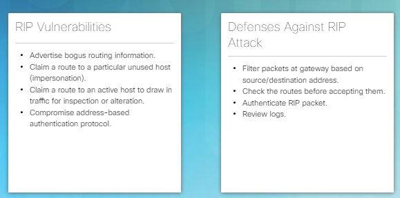

A Figura acima lista as vulnerabilidades RIP e as defesas do RIP contra ataques. Os hackers podem ter como alvos os routers e o protocolo RIP. Os ataques aos serviços de encaminhamento podem afetar o desempenho e a disponibilidade. Alguns ataques podem até resultar em redirecionamento de tráfego. Use serviços seguros com autenticação e implemente patches e atualizações do sistema para proteger serviços de encaminhamento, como o RIP.

**Protocolo de hora da rede (NTP)**

Ter o tempo correto dentro das redes é importante. As etiquetas temporais (timestamps) corretas rastreiam com precisão os eventos de rede, como as violações de segurança. Além disso, a sincronização do relógio é fundamental para a interpretação correta dos eventos dentro dos ficheiros de dados do syslog assim como para certificados digitais.

O protocolo Network Time Protocol (NTP) é um protocolo que sincroniza os relógios dos sistemas informáticos através de redes de dados. O NTP permite que os dispositivos de rede sincronizem as suas configurações de tempo com um servidor NTP. 

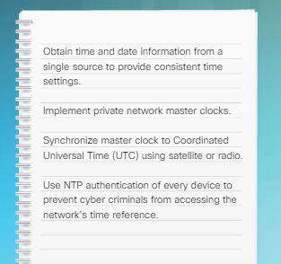

A Figura a cima lista os vários métodos usados para fornecer o clocking seguro para a rede. Os cibercriminosos atacam os servidores de tempo para interromper a comunicação segura que depende de certificados digitais e para ocultar informações de ataque, como timestamps precisos.

### 7.3.2 Equipamento de Voz e Vídeo

#### 7.3.2.1 Equipamento VoIP

Voz sobre IP (VoIP) **usa redes como a Internet para fazer e receber chamadas telefónicas**. O equipamento necessário para VoIP inclui uma ligação com a Internet e um telefone. Várias opções estão disponíveis para o dispositivo telefónico:

- Um telefone tradicional com um adaptador (o adaptador atua como uma interface de hardware entre um telefone analógico tradicional e uma linha VoIP digital)
- Um telefone habilitado para VoIP
- Software VoIP instalado num computador

A maioria dos serviços VoIP consumidor usa a Internet para realizar as chamadas telefónicas. Muitas organizações, no entanto, usam as suas redes privadas porque fornecem maior segurança e qualidade de serviço. A segurança VoIP é tão confiável quanto a segurança de rede subjacente. Os cibercriminosos visam esses sistemas para obter acesso a serviços telefónicos gratuitos, espiar chamadas telefônicas ou para afetar o desempenho e a disponibilidade do serviço.

Implemente as seguintes contramedidas para proteger o VoIP:

- Cifre os pacotes das mensagens de voz para proteger contra espionagem.
- Use SSH para proteger gateways e switches.
- Altere todas as palavras-passe por padrão.
- Use um sistema de deteção de intrusão para detetar ataques como envenenamento por ARP.
- Use a autenticação forte para mitigar a falsificação do registo (os cibercriminosos encaminham todas as chamadas recebidas para a vítima), o proxy representando (engana a vítima para esta comunicar com um proxy desonesto estabelecido pelos cibercriminosos), e o sequestro de chamada (a chamada é interceptada e redirecionada para um caminho diferente antes da chegada ao destino).
- Implemente firewalls que reconhecem VoIP para monitorar fluxos e filtrar sinais anormais.

Quando a rede vai a baixo, as comunicações de voz também vão a baixo.

#### 7.3.2.2 Câmeras

Uma câmera Internet envia e recebe dados através de uma rede LAN e/ou pela Internet. Um utilizador pode visualizar remotamente vídeo ao vivo usando um navegador Web numa ampla variedade de dispositivos, incluindo sistemas de computador, portáteis, tablets e smartphones.

As câmeras vêm em várias formas, incluindo a câmera de segurança tradicional. Outras opções incluem câmeras de Internet discretamente escondidas em rádios de relógio, livros ou leitores de DVD.

As câmeras de Internet transmitem vídeo digital através de uma ligação de dados. A câmera liga-se diretamente à rede e tem tudo o que é necessário para transferir as imagens através da rede. A figura lista as melhores práticas para os sistemas de câmera.

#### 7.3.2.3 Equipamento de Videoconferência

O equipamento de Videoconferência permite que dois ou mais locais comuniquem simultaneamente usando tecnologias de telecomunicações. Estas tecnologias tiram proveito das novas normas de vídeo de alta definição. Produtos como o Cisco TelePresence permitem que um grupo de pessoas num local possam conferenciar com um grupo de pessoas noutros locais em tempo real. A videoconferência é agora parte das operações normais do dia-a-dia em indústrias como a área médica. Os médicos podem rever os sintomas do paciente e consultar especialistas para identificar potenciais tratamentos.

Muitas farmácias locais empregam assistentes médicos que se podem ligar ao vivo a médicos usando videoconferência para agendar visitas ou respostas de emergência. Muitas organizações na área do fabrico manual estão usando a teleconferência para ajudar engenheiros e técnicos a executar operações complexas ou tarefas de manutenção. Os equipamentos de videoconferência podem ser extremamente caros e são alvos de constantes ataques por assaltantes e cibercriminosos. Clique [aqui](https://youtu.be/WlDkiwzzv3M) para assistir a um vídeo demonstrando o poder dos sistemas de videoconferência. Os cibercriminosos visam estes sistemas para espiar chamadas de vídeo ou afetar o desempenho e a disponibilidade.

#### 7.3.2.4 Sensores de Rede e IoT

Um dos setores que mais cresce na tecnologia da informação é o uso de dispositivos inteligentes e sensores. A indústria de computadores identifica este setor como a Internet das Coisas (IoT).

Empresas e consumidores usam dispositivos IoT para automatizar processos, monitorizar condições ambientais e alertar o utilizador sobre condições adversas. A maioria dos dispositivos IoT liga-se a uma rede via tecnologia sem fios, isto inclui câmeras, fechaduras de portas, sensores de proximidade, lâmpadas e outros tipos de sensores usados para recolher informações sobre um ambiente ou o status de um dispositivo. Vários fabricantes de aparelhos usam a IoT para informar os utilizadores sobre que peças precisam de substituição, que os componentes estão falhando ou que os consumíveis estão se esgotando.

As empresas usam estes dispositivos para rastrear o inventário, os veículos e as pessoas. Os dispositivos IoT contêm sensores geoespaciais. Um utilizador pode localizar globalmente, monitorizar e controlar variáveis ambientais, tais como a temperatura, humidade e iluminação. A indústria IoT representa um enorme desafio para os profissionais de segurança da informação, porque muitos dispositivos IoT capturam e transmitem informações confidenciais. Os cibercriminosos visam esses sistemas para interceptar dados ou afetar o desempenho e a disponibilidade.

#### 7.3.2.5 Atividade - Blindagens de Redes

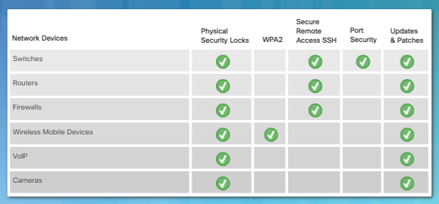

## 7.4 Segurança física

### 7.4.1 Controlo de Acesso Físico

#### 7.4.1.1 Cercas e Barricadas

**As barreiras físicas são a primeira coisa que vem à mente quando se pensa em segurança física.** Esta é a camada mais externa de segurança, e estas soluções são as mais visíveis publicamente. Um sistema de segurança de perímetro normalmente consiste nos seguintes componentes:

- Sistema de Vedação do Perímetro
- Sistema de porta de segurança
- Postes de amarração (um poste curto usado para proteger contra intrusões de veículos, como se mostra na Figura 2)
- Barreiras de entrada de veículos
- Abrigos de guarda

Uma cerca é uma barreira que envolve áreas seguras e designa os limites da propriedade. Todas as barreiras devem atender a requisitos específicos de projeto e especificações de fabrico. Áreas de alta segurança geralmente exigem um “protetor superior”, como arame farpado ou fio de concertina. Ao projetar o perímetro, os sistemas de cercas usam as seguintes regras:

- 1 metro (3-4 ft.) só irá dissuadir invasores casuais
- 2 metros (6-7 pés) são muito altos para se escalado por invasores casuais
- 2,5 metros (8 pés) oferecerão atraso limitado a um intruso determinado

Os seguranças superiores fornecem um dissuasor adicional e podem atrasar o intruso cortando severamente o intruso; no entanto, os atacantes podem usar um cobertor ou colchão para aliviar essa ameaça. Os regulamentos locais podem restringir o tipo de sistema de cercas que uma organização pode usar.

Cercas requerem manutenção regular. Os animais podem cavar sob a cerca ou a terra pode cair, deixando a cerca instável, proporcionando fácil acesso para um intruso. Inspecione sistemas de cercas regularmente. Não estacionar veículos perto de cercas. Um veículo estacionado perto da cerca pode ajudar o intruso a subir ou a danificar cerca. Clique [aqui](http://www.chainlinkinfo.org/security-fencing-guidelines/) para obter recomendações adicionais às cercas.

#### 7.4.1.2 Biometria

A Biometria **descreve os métodos automatizados de reconhecimento de um indivíduo baseados numa característica fisiológica ou comportamental**. Os sistemas de autenticação biométrica incluem medições da face, impressão digital, geometria manual, íris, retina, assinatura e voz. As tecnologias biométricas podem ser a base de soluções de identificação e verificação pessoal altamente seguras. A popularidade e o uso de sistemas biométricos aumentaram devido ao aumento do número de violações de segurança e fraude de transações. A Biometria fornece transações financeiras confidenciais e privacidade de dados pessoais. Por exemplo, a Apple usa tecnologia de impressão digital nos seus smartphones. A impressão digital do utilizador desbloqueia o dispositivo e permite o acesso a várias aplicações, como serviços bancários on-line ou aplicações de pagamento.

Quando se comparam os sistemas biométricos, existem vários fatores importantes a serem considerados, incluindo a precisão, a velocidade ou taxa de transmissão, aceitação pelos utilizadores, singularidade do órgão biométrico e ação, resistência à falsificação, confiabilidade, requisitos de armazenamento de dados, tempo de inscrição e intrusão do varrimento ou leitura. O fator mais importante é a precisão. A precisão é expressa em tipos e taxas de erro.

A primeira taxa de erros é Erros do Tipo I ou rejeições falsas. Um Erro Tipo I rejeita uma pessoa que se regista e é um utilizador autorizado. No controlo de acesso, se o requisito é manter os bandidos fora, falsa rejeição é o erro menos importante. No entanto, em muitas aplicações biométricas, falsas rejeições podem ter um impacto muito negativo no negócio. Por exemplo, o banco ou a loja de retalho precisa autenticar a identidade do cliente e o saldo da conta. Uma falsa rejeição significa que a transação ou venda é perdida e o cliente fica chateado. A maioria dos banqueiros e retalhistas estão dispostos a permitir que algumas falsas aceitações, desde que hajam falsas rejeições mínimas.

A **taxa de aceitação** é indicada como uma percentagem e é a taxa em que um sistema aceita indivíduos ou impostores não inscritos como utilizadores autênticos. A falsa aceitação é um erro de Tipo II. **Os erros do Tipo II permitem que os bandidos entrem, por isso são normalmente considerados como o erro mais importante para um sistema de controlo de acesso biométrico**.

O método mais utilizado para medir a precisão da autenticação biométrica é o ponto de equilíbrio CER (Crossover Error Rate). O CER é a taxa onde a taxa de rejeição falsa e a **taxa de aceitação falsa** são iguais como se observa na figura.

#### 7.4.1.3 Crachás e Logs de Acesso

Um cartão de acesso permite que um indivíduo obtenha acesso a uma área com **pontos de entrada** automatizados. Um ponto de entrada pode ser uma porta, um torniquete, um portão ou outra barreira. Os cráchás ou cartões de acesso usam várias tecnologias, como uma fita magnética, código de barras ou biometria.

Um leitor de cartão lê um número contido no cartão de acesso. O sistema envia o número para um computador que toma decisões de controlo de acesso com base na credencial fornecida. O sistema regista a transação para recuperação posterior. Os relatórios revelam quem entrou em quais pontos de entrada e a que horas.

### 7.4.2 Videovigilância

#### 7.4.2.1 Seguranças e Escoltas

**Todos os controlos de acesso físico, incluindo sistemas de dissuasão e detecção, em última análise, dependem de pessoal para intervir e parar o ataque real ou intrusão**. Em instalações de sistemas de informações altamente seguras, os seguranças controlam o acesso às áreas sensíveis da organização. O benefício de usar seguranças é que eles podem adaptar-se mais do que os sistemas automatizados. Os seguranças podem aprender e distinguir muitas diferentes condições e situações e tomar decisões no próprio local. Os guarda costas ou seguranças são a melhor solução para controlo de acesso quando a situação requer uma resposta instantânea e apropriada. No entanto, os seguranças nem sempre são a melhor solução. Existem inúmeras desvantagens no uso de guardas costas ou seguranças, incluindo o custo e a capacidade de monitorizar e registar um alto volume de tráfego. O uso de seguranças também introduz o erro humano à equação.

#### 7.4.2.2 Vigilância Eletrónica e Videovigilância

A Vigilância Eletrónica e Videovigilância pode complementar ou, em alguns casos, substituir os seguranças. O benefício da vigilância eletrónica e por vídeo é a capacidade de monitorizar áreas mesmo quando nenhum segurança ou pessoal está presente, a capacidade de gravar e registar vídeos e dados de vigilância por longos períodos e a capacidade de incorporar deteção de movimento e notificação.

A vigilância eletrónica e videovigilância também pode ser mais precisa na captura de eventos mesmo depois de ocorrerem. Outra grande vantagem da vigilância eletrónica e videovigilância é esta fornecer pontos de vista não facilmente obtidos com seguranças. Também pode ser muito mais económico usar câmeras para monitorizar todo o perímetro de uma instalação. Num ambiente altamente seguro, uma organização deve colocar vigilância eletrónica e por vídeo em todas as entradas, saídas, baías de carga, escadas e áreas de recolha de lixo. Na maioria dos casos, a vigilância elétronica e videovigilância complementam os seguranças.

#### 7.4.2.3 Vigilância RFID e Sem fios

Gerir e localizar ativos importantes do sistema de informação são um desafio fundamental para a maioria das organizações. O crescimento do número de dispositivos móveis e dispositivos IoT tornou esta tarefa ainda mais difícil. O tempo gasto na procura de equipamentos críticos pode levar a atrasos ou tempo de inatividade dispendiosos. O uso de etiquetas na identificação de ativos por radiofrequência (RFID) pode ser uma mais valia para a equipa de segurança. Uma organização pode colocar leitores RFID nos caixilhos das portas de áreas seguras para que não fiquem visíveis para os indivíduos.

O benefício das etiquetas de ativos RFID é que estas podem rastrear qualquer ativo que deixe fisicamente uma área segura. Os novos sistemas de etiquetas de ativos RFID podem ler várias etiquetas em simultâneo. Os sistemas RFID não exigem linha de vista para varrer as etiquetas. Outra vantagem do RFID é a capacidade de ler etiquetas que não são visíveis. Ao contrário dos códigos de barras e das etiquetas legíveis por seres humanos que devem estar fisicamente localizadas e visíveis para leitura, as etiquetas RFID não precisam de estar visíveis para se digitalizar. Por exemplo, etiquetar um PC por baixo de uma mesa exigiria que o pessoal rasteje sob a mesa para localizar fisicamente e visualizar a etiqueta ao usar um processo manual ou de código de barras. O uso de uma etiqueta RFID permitiria que o pessoal digitalizasse a etiqueta sem necessidade de a ver.

#### 7.4.2.4 Packet Tracer – Firewalls de Servidor e ACLs do Router

Nesta atividade Packet Tracer, vai completar os seguintes objetivos:

- Ligação ao Servidor Web
- Impedir Sessões HTTP Não Criptografadas
- Aceder ao Firewall no Servidor de Email

[Packet Tracer – Firewalls de Servidor e ACLs do Router - Instruções](https://contenthub.netacad.com/legacy/CyberEss/1.1/pp/course/files/7.4.2.4%20Packet%20Tracer%20-%20Server%20Firewalls%20and%20Router%20ACLs.pdf)
[Packet Tracer – Firewalls de Servidor e ACLs do Router - Atividade](https://contenthub.netacad.com/legacy/CyberEss/1.1/pp/course/files/7.4.2.4%20Packet%20Tracer%20-%20Server%20Firewalls%20and%20Router%20ACLs.pka)

## 7.5 Conclusão: Capítulo 7: Proteção de um Domínio de Cibersegurança

Este capítulo discutiu as tecnologias, processos e procedimentos que os profissionais de cibersegurança usam para defender os sistemas, dispositivos e dados que compõem a infraestrutura de rede.

A Blindagem de um dispositivo anfitrião inclui proteger o sistema operativo, implementar uma solução antivírus e usar soluções baseadas no computador anfitrião, como firewalls e sistemas de deteção de intrusões.

O Blindagem do servidor inclui a administração de acesso remoto, a proteção de contas privilegiadas e os serviços de monitorização.

A proteção de dados inclui controlo de acesso a ficheiros e implementação de medidas de segurança para garantir a confidencialidade, integridade e disponibilidade dos dados.

A Blindagem de dispositivos também envolve a implementação de métodos comprovados para proteger fisicamente dispositivos de rede. A Proteção de um domínio de cibersegurança é um processo contínuo para proteger a infraestrutura de rede de uma organização e requer uma vigilância constante contra ameaças.