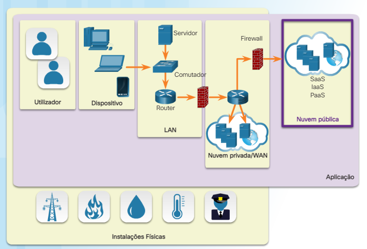
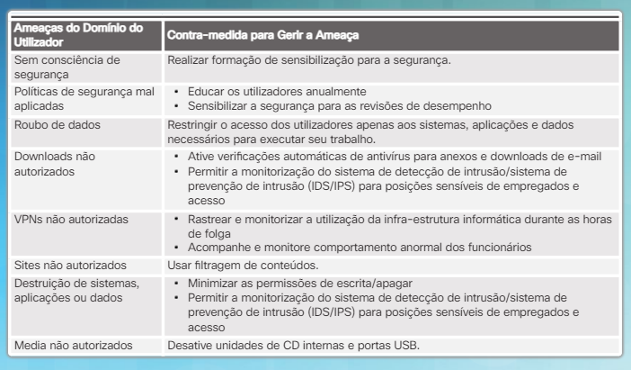
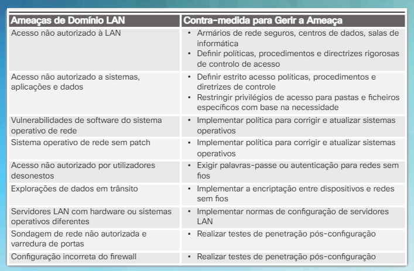
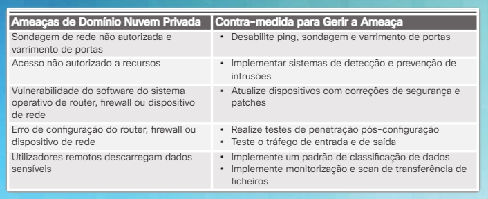
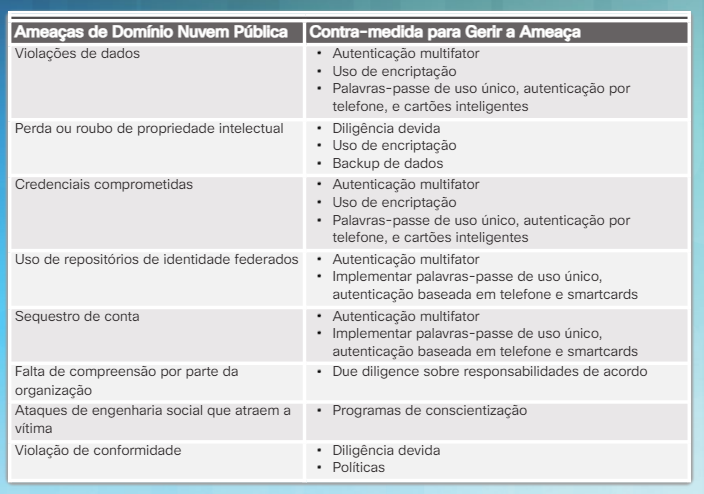
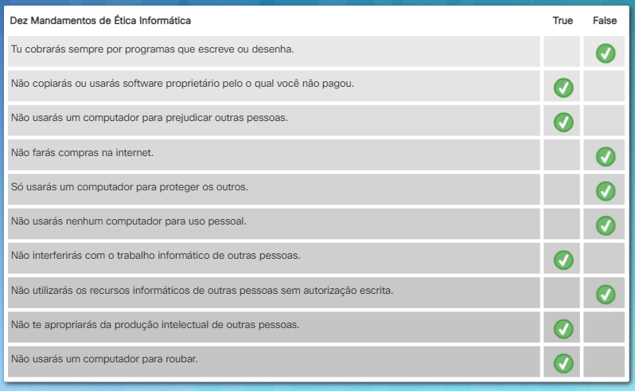
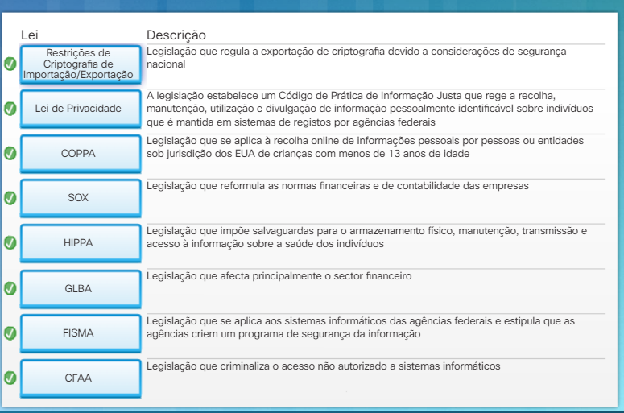
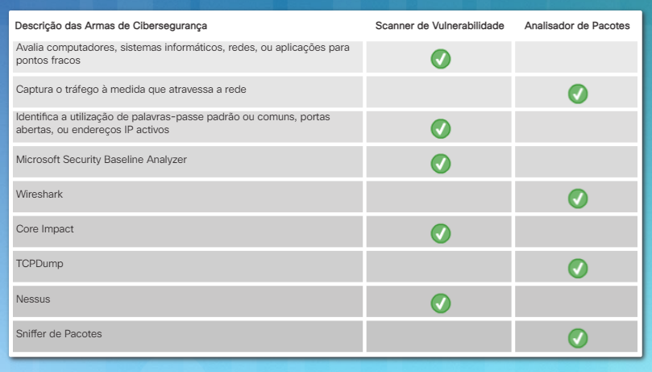

<datails>
Table of Contents 🔖

- [Capítulo 8: Tornar-se um Especialista em Cibersegurança](#capítulo-8-tornar-se-um-especialista-em-cibersegurança)
  - [8.1 Domínios de Cibersegurança](#81-domínios-de-cibersegurança)
    - [8.1.1 Domínio do Utilizador](#811-domínio-do-utilizador)
      - [8.1.1.1 Ameaças e Vulnerabilidades Comuns ao Utilizador](#8111-ameaças-e-vulnerabilidades-comuns-ao-utilizador)
      - [8.1.1.2 Gestão das ameaças do utilizador](#8112-gestão-das-ameaças-do-utilizador)
    - [8.1.2 Domínio do dispositivo](#812-domínio-do-dispositivo)
      - [8.1.2.1 Ameaças Comuns aos Dispositivos](#8121-ameaças-comuns-aos-dispositivos)
      - [8.1.2.2 Gestão de Ameaças ao Dispositivo](#8122-gestão-de-ameaças-ao-dispositivo)
    - [8.1.3 Domínio da Rede de Área Local](#813-domínio-da-rede-de-área-local)
      - [8.1.3.1 Ameaças Comuns à LAN](#8131-ameaças-comuns-à-lan)
      - [8.1.3.2 Gestão de ameaças à LAN](#8132-gestão-de-ameaças-à-lan)
    - [8.1.4 Domínio de Nuvem Privada (WAN)](#814-domínio-de-nuvem-privada-wan)
      - [8.1.4.1 Ameaças comuns à nuvem privada](#8141-ameaças-comuns-à-nuvem-privada)
      - [8.1.4.2 Gerir as ameaças à nuvem privada](#8142-gerir-as-ameaças-à-nuvem-privada)
    - [8.1.5 Domínio da Nuvem Pública](#815-domínio-da-nuvem-pública)
      - [8.1.5.1 Ameaças comuns à nuvem pública](#8151-ameaças-comuns-à-nuvem-pública)
      - [8.1.5.2 Gerir as ameaças à nuvem pública](#8152-gerir-as-ameaças-à-nuvem-pública)
    - [8.1.6 Domínio de Instalações Físicas](#816-domínio-de-instalações-físicas)
      - [8.1.6.1 Ameaças Comuns às Instalações Físicas](#8161-ameaças-comuns-às-instalações-físicas)
      - [8.1.6.2 Gestão de Ameaças a Instalações Físicas](#8162-gestão-de-ameaças-a-instalações-físicas)
    - [8.1.7 Domínio de Aplicação](#817-domínio-de-aplicação)
      - [8.1.7.1 Ameaças Comuns às Aplicações](#8171-ameaças-comuns-às-aplicações)
      - [8.1.7.2 Gestão de Ameaças a Aplicações](#8172-gestão-de-ameaças-a-aplicações)
      - [8.1.7.3 Atividade - Correspondência de domínios de segurança cibernética](#8173-atividade---correspondência-de-domínios-de-segurança-cibernética)
  - [8.2 Compreender a Ética do Trabalho em Segurança Cibernética](#82-compreender-a-ética-do-trabalho-em-segurança-cibernética)
    - [8.2.1 Ética e Princípios Orientadores](#821-ética-e-princípios-orientadores)
      - [8.2.1.1 Ética de um Especialista em Cibersegurança](#8211-ética-de-um-especialista-em-cibersegurança)
      - [8.2.1.2 Instituto de Ética Informática](#8212-instituto-de-ética-informática)
      - [8.2.1.3 Atividade - Explorando a Ética Cibernética](#8213-atividade---explorando-a-ética-cibernética)
    - [8.2.2 Leis Cibernéticas e Responsabilidade](#822-leis-cibernéticas-e-responsabilidade)
      - [8.2.2.1 Ciber-crime](#8221-ciber-crime)
      - [8.2.2.2 Leis Cibernéticas Civis, Criminais e Regulatórias](#8222-leis-cibernéticas-civis-criminais-e-regulatórias)
      - [8.2.2.3 Leis específicas do setor](#8223-leis-específicas-do-setor)
      - [8.2.2.4 Leis de notificação de violação de segurança](#8224-leis-de-notificação-de-violação-de-segurança)
      - [8.2.2.5 Proteção da Privacidade](#8225-proteção-da-privacidade)
      - [8.2.2.6 Leis Internacionais](#8226-leis-internacionais)
      - [8.2.2.7 Atividade - Correspondência de Leis Relacionadas à Segurança Cibernética](#8227-atividade---correspondência-de-leis-relacionadas-à-segurança-cibernética)
    - [8.2.3 Sites de informações de Segurança Cibernética](#823-sites-de-informações-de-segurança-cibernética)
      - [8.2.3.1 Base de Dados Nacional de Vulnerabilidades](#8231-base-de-dados-nacional-de-vulnerabilidades)
      - [8.2.3.2 CERT](#8232-cert)
      - [8.2.3.3 Internet Storm Center](#8233-internet-storm-center)
      - [8.2.3.4 O Centro Avançado de Segurança Cibernética](#8234-o-centro-avançado-de-segurança-cibernética)
    - [8.2.4 Armas de Cibersegurança](#824-armas-de-cibersegurança)
      - [8.2.4.1 Scanners de Vulnerabilidade](#8241-scanners-de-vulnerabilidade)
      - [8.2.4.2 Testes de Penetração](#8242-testes-de-penetração)
      - [8.2.4.3 Analisadores de Pacotes](#8243-analisadores-de-pacotes)
      - [8.2.4.4 Ferramentas de Segurança](#8244-ferramentas-de-segurança)
      - [8.2.4.5 Atividade - Usando a Ferramenta Apropriada](#8245-atividade---usando-a-ferramenta-apropriada)
  - [8.3 Próximo Passo](#83-próximo-passo)
    - [8.3.1 Explorando a Profissão de Segurança Cibernética](#831-explorando-a-profissão-de-segurança-cibernética)
      - [8.3.1.1 Definindo os Papéis dos Profissionais de Cibersegurança](#8311-definindo-os-papéis-dos-profissionais-de-cibersegurança)
      - [8.3.1.2 Ferramentas para Procura de Emprego](#8312-ferramentas-para-procura-de-emprego)
      - [8.3.1.3 Packet Tracer - Desafio de Integração de Habilidades](#8313-packet-tracer---desafio-de-integração-de-habilidades)
  - [8.4 Conclusão: Capítulo 8: Tornar-se num Especialista em Cibersegurança](#84-conclusão-capítulo-8-tornar-se-num-especialista-em-cibersegurança)

# Capítulo 8: Tornar-se um Especialista em Cibersegurança

O avanço da tecnologia forneceu uma série de dispositivos usados na sociedade numa base diária que interconecta o mundo. Esse aumento da conectividade, porém, resulta em maior risco de roubo, fraude e abuso em toda a infraestrutura tecnológica. Este capítulo categoriza a infraestrutura de tecnologia da informação em sete domínios. Cada domínio requer os controles de segurança adequados para atender aos requisitos da tríade CIA.

O capítulo discute as leis que afetam os requisitos de tecnologia e segurança cibernética. Muitas dessas leis concentram-se em diferentes tipos de dados encontrados em vários setores e contêm conceitos de privacidade e segurança da informação. Várias agências dentro do governo dos EUA regulam a conformidade de uma organização com esses tipos de leis. O especialista em segurança cibernética precisa entender como a lei e os interesses da organização ajudam a orientar decisões éticas. A ética cibernética analisa o efeito do uso de computadores e tecnologia nos indivíduos e na sociedade.

As organizações empregam especialistas em segurança cibernética em várias posições diferentes, como testadores de penetração, analistas de segurança e outros profissionais de segurança de rede. Especialistas em segurança cibernética ajudam a proteger os dados pessoais e a capacidade de usar serviços baseados em rede. O capítulo discute o caminho para se tornar um especialista em segurança cibernética. Finalmente, este capítulo discute várias ferramentas disponíveis para especialistas em segurança cibernética.

## 8.1 Domínios de Cibersegurança

### 8.1.1 Domínio do Utilizador

#### 8.1.1.1 Ameaças e Vulnerabilidades Comuns ao Utilizador

O Domínio do Utilizador inclui os utilizadores que acessam o sistema de informações da organização. Os utilizadores podem ser funcionários, clientes, donos de negócios e outros indivíduos que precisam de acesso aos dados. **Os utilizadores geralmente são o elo mais fraco nos sistemas de segurança da informação e representam uma ameaça significativa à confidencialidade, integridade e disponibilidade dos dados da organização**.

Práticas de utilizadores arriscadas ou insatisfatórias muitas vezes prejudicam até mesmo o melhor sistema de segurança. Veja a seguir as ameaças comuns de utilizador encontradas em muitas organizações:

- **Sem conhecimento da segurança** — os utilizadores devem estar cientes de dados confidenciais, políticas e procedimentos de segurança, tecnologias e contramedidas fornecidas para proteger os sistemas de informação e informação.

- **Políticas de segurança mal aplicadas** — todos os utilizadores devem estar cientes das políticas de segurança e das consequências do não cumprimento das políticas da organização.

- **Roubo de dados** — o roubo de dados pelos utilizadores pode custar às organizações financeiramente, resultando em danos à reputação de uma organização ou representando uma responsabilidade legal associada à divulgação de informações confidenciais.

- **Downloads não autorizados** — muitas infecções e ataques de rede e estações de trabalho remontam a utilizadores que descarregam e-mails, fotos, músicas, jogos, aplicações, programas e vídeos não autorizados para estações de trabalho, redes ou dispositivos de armazenamento.

- **Mídia não autorizada** — o uso de mídias não autorizadas como CDs, drives USB e dispositivos de armazenamento em rede pode resultar em infeções e ataques de malware.

- **VPNs não autorizadas** — VPNs podem ocultar o roubo de informações não autorizadas. A criptografia normalmente usada para proteger a confidencialidade cega a equipa de segurança de TI à transmissão de dados sem autoridade adequada.

- **Sites não autorizados** — o acesso a sites não autorizados pode representar um risco para os dados, dispositivos e a organização do utilizador. Muitos sites solicitam que os visitantes descarreguem scripts ou plugins que contêm código malicioso ou adware. Alguns desses sites podem assumir o controle de dispositivos como câmeras e aplicativos.

- **Destruição de sistemas, aplicações ou dados** — destruição acidental ou deliberada ou sabotagem de sistemas, aplicações e dados representam um grande risco para todas as organizações. Ativistas, funcionários insatisfeitos e concorrentes do setor podem excluir dados, destruir dispositivos ou configurar dispositivos incorretos para tornar os sistemas de dados e informações indisponíveis.

Nenhuma solução técnica, controles ou contramedidas tornam os sistemas de informação mais seguros do que os comportamentos e processos das pessoas que usam esses sistemas.

#### 8.1.1.2 Gestão das ameaças do utilizador

As organizações podem implementar várias medidas para gerir ameaças de utilizadores:

- Conduza um **treino de consciencialização** de segurança exibindo cartazes de consciencialização de segurança, inserindo lembretes em saudações de banner e enviando lembretes por e-mail aos funcionários.

- **Eduque** os utilizadores anualmente sobre políticas, manuais de equipe e atualizações de manuais.

- Vincule a **consciencialização** de segurança aos objetivos de análise de desempenho

- Ative a **filtragem de conteúdo** e a **verificação** antivírus para anexos de e-mail.

- Use a filtragem de conteúdo para permitir ou negar nomes de domínio específicos de acordo com as **Políticas de Uso Aceitável (AUP)**.

- Desative unidades de CD internas e portas USB.

- Ative verificações antivírus automáticas para unidades de mídia inseridas, ficheiros e anexos de e-mail.

- **Restrinja o acesso** dos utilizadores apenas aos sistemas, aplicações e dados necessários para executar seu trabalho.

- **Minimize as permissões** de gravação/exclusão apenas para o proprietário dos dados.

- Acompanhe e monitore o comportamento anormal dos funcionários, o desempenho errático do trabalho e o uso da infraestrutura de TI fora do horário de trabalho.

- Implemente **procedimentos de bloqueio** de controle de acesso com base no monitoramento e conformidade da AUP.

- Ative a **monitorização** do sistema de detecção de intrusões/sistema de prevenção de intrusões (IDS/IPS) para posições e acesso confidenciais dos funcionários.

A tabela mostrada na figura corresponde às ameaças do domínio do utilizador com as contramedidas usadas para geri-lo.

### 8.1.2 Domínio do dispositivo

#### 8.1.2.1 Ameaças Comuns aos Dispositivos

Um dispositivo é qualquer computador desktop, laptop, tablet ou smartphone que se conecte à rede.

Os seguintes representam uma ameaça para os dispositivos:

- **Estações de trabalho sem supervisão** — estações de trabalho deixadas ligadas e sem supervisão representam um risco de acesso não autorizado a recursos de rede

- **Downloads de utilizadores** — ficheiros descarregados, fotos, músicas ou vídeos podem ser um veículo para código malicioso

- **Software não corrigido** — vulnerabilidades de segurança de software fornecem fraquezas que os criminosos cibernéticos podem explorar

- **Malware** — novos vírus, worms e outros códigos maliciosos surgem diariamente

- **Mídia não autorizada** — os utilizadores que inserem unidades USB, CDs ou DVDs podem introduzir malware ou correr o risco de comprometer os dados armazenados na estação de trabalho

- **Violação de Política de Uso Aceitável** — políticas estão em vigor para proteger a infraestrutura de TI da organização

#### 8.1.2.2 Gestão de Ameaças ao Dispositivo

As organizações podem implementar várias medidas para gerir ameaças a dispositivos:

- Estabeleça políticas para proteção por palavra-passe e limites de bloqueio em todos os dispositivos.
- Ativar o bloqueio da tela durante períodos de inatividade.
- Desabilite direitos administrativos para utilizadores.
- Defina políticas, padrões, procedimentos e diretrizes de controle de acesso.
- Atualize e corrija todos os sistemas operativos e aplicações de software.
- Implemente soluções antivírus automatizadas que examinam o sistema e atualizam o software antivírus para fornecer proteção adequada.
- Desative todas as portas de CD, DVD e USB.
- Habilite verificações automáticas de antivírus para qualquer CD, DVD ou unidade USB inserida.
- Usar filtragem de conteúdos.
- Exigir treino anual de conscientização de segurança ou implementar campanhas e programas de conscientização de segurança que sejam executados ao longo do ano.

A tabela mostrada na figura corresponde às ameaças de domínio do dispositivo com as contramedidas usadas para geri-las.

### 8.1.3 Domínio da Rede de Área Local

#### 8.1.3.1 Ameaças Comuns à LAN

A rede local (LAN) é uma coleção de dispositivos interconectados usando cabos ou ondas de rádio. **Requer controles fortes de segurança e acesso, já que os utilizadores podem aceder os sistemas, aplicações e dados da organização a partir do domínio LAN**.

O seguinte representa uma ameaça para a LAN:

- **Acesso  não autorizado** — à LAN, sistemas, aplicações, dados, armários de rede, data centers e sala de computadores devem permanecer seguros
- **Vulnerabilidades de software** do sistema operativo de rede
- Atualizações do sistema operativo de rede
- **Acesso não autorizado** por utilizadores desonestos **em redes sem fios**
- **Exploração de dados em trânsito**
- **Servidores LAN com hardware ou sistemas operativos diferentes** — gerir e solucionar problemas de servidores torna-se mais difícil com configurações variadas
- **Sondagem de rede não autorizada e varredura de portas**
- **Firewall mal configurada**

#### 8.1.3.2 Gestão de ameaças à LAN

As organizações podem implementar várias medidas para gerir ameaças à rede local:

- Armários de rede seguros, centros de dados e salas de computadores. Negue acesso a qualquer pessoa sem as credenciais adequadas.
- Defina políticas, padrões, procedimentos e diretrizes rígidas de controle de acesso.
- Restringir privilégios de acesso para pastas e ficheiros específicos com base na necessidade.
- Exigir palavras-passe ou autenticação para redes sem fios.
- Implemente a criptografia entre dispositivos e redes sem fio para manter a confidencialidade.
- Implemente padrões de configuração do servidor LAN.
- Realizar testes de penetração pós-configuração.
- Desative o ping e a varredura de porta.

A tabela mostrada na figura corresponde acima de ameaças de domínio LAN com as contramedidas usadas para controlá-las.

### 8.1.4 Domínio de Nuvem Privada (WAN)

#### 8.1.4.1 Ameaças comuns à nuvem privada

O Domínio da Nuvem Privada inclui servidores privados, recursos e infraestrutura de TI disponíveis para membros de uma organização através da Internet.

O seguinte representa uma ameaça para a nuvem privada:

- Sondagem de rede não autorizada e varrimento de portas
- Acesso não autorizado a recursos
- Vulnerabilidade do software do sistema operativo de router, firewall ou dispositivo de rede
- Erro de configuração do router, firewall ou dispositivo de rede
- Utilizadores remotos que acessam a infraestrutura da organização e descarregam dados confidenciais

#### 8.1.4.2 Gerir as ameaças à nuvem privada

As organizações podem implementar várias medidas para gerir ameaças à nuvem privada:

- Desabilite ping, sondagem e varrimento de portas.
- Implementar sistemas de detecção e prevenção de intrusões.
- Monitore anomalias de tráfego IP de entrada.
- Atualize dispositivos com correções de segurança e patches.
- Realize testes de penetração após a configuração.
- Teste o tráfego de entrada e de saída.
- Implemente um padrão de classificação de dados.
- Implemente monitoramento de transferência de ficheiros e verificação para tipo de ficheiro desconhecido.

A tabela mostrada na figura corresponde às ameaças do Private Cloud Domain com as contramedidas usadas para geri-las.

### 8.1.5 Domínio da Nuvem Pública

#### 8.1.5.1 Ameaças comuns à nuvem pública

O Domínio da Nuvem Pública inclui serviços hospedados por um provedor de nuvem, provedor de serviços ou provedor de Internet. Os provedores de nuvem implementam controles de segurança para proteger o ambiente de nuvem, mas as organizações são responsáveis por proteger os seus recursos na nuvem. Existem três modelos de serviço diferentes a partir dos quais uma organização pode escolher:

- **Software como serviço (SaaS)** — um modelo baseado em assinatura que fornece acesso a software que é hospedado centralmente e acedido pelos utilizadores através de um navegador da web.

- **Plataforma como serviço (PaaS)** — fornece uma plataforma que permite que uma organização desenvolva, execute e gira as suas aplicações no hardware do serviço usando ferramentas que o serviço fornece.

- **Infraestrutura como serviço (IaaS)** — fornece recursos de computação virtualizados, como hardware, software, servidores, armazenamento e outros componentes de infraestrutura pela Internet.

O seguinte representa uma ameaça para a nuvem pública:

- Violações de dados
- Perda ou roubo de propriedade intelectual
- Credenciais comprometidas
- Repositórios de identidade federada são um alvo de alto valor
- Sequestro de conta
- Falta de compreensão por parte da organização
- Ataques de engenharia social que atraem a vítima
- Violação de conformidade

#### 8.1.5.2 Gerir as ameaças à nuvem pública

As organizações podem implementar várias medidas para gerir ameaças às instalações físicas:

- Autenticação multifator
- Uso de encriptação
- Implementar palavras-passe de uso único, autenticação baseada em telefone e smartcards
- Distribuição de dados e aplicações em várias zonas
- Procedimentos de backup de dados
- Diligência devida
- Programas de sensibilização para a segurança
- Políticas

A tabela mostrada na figura combina as ameaças do Domínio de nuvem pública com as contra-medidas usadas para as gerir.

### 8.1.6 Domínio de Instalações Físicas

#### 8.1.6.1 Ameaças Comuns às Instalações Físicas

O Domínio de Instalações Físicas inclui todos os serviços usados por uma organização, incluindo HVAC, água e detecção de incêndio. Este domínio também inclui medidas de segurança física utilizadas para salvaguardar a instalação.

Os seguintes representam uma ameaça para as instalações de uma organização:

- Ameaças naturais, incluindo problemas climáticos e riscos geológicos
- Acesso não autorizado às instalações
- Interrupções de energia
- Engenharia social para aprender sobre procedimentos de segurança e políticas de escritório
- Violação de defesas de perímetro eletrónico
- Roubo
- Um lobby aberto que permite a um visitante caminhar diretamente para as instalações internas
- Um data center desbloqueado
- Falta de vigilância

#### 8.1.6.2 Gestão de Ameaças a Instalações Físicas

As organizações podem implementar várias medidas para gerenciar ameaças às instalações físicas:

- Implementar controle de acesso e cobertura de TV de circuito fechado (CCTV) em todas as entradas.
- Estabelecer políticas e procedimentos para os visitantes que visitam a instalação.
- Testar a segurança do edifício usando meios cibernéticos e físicos para obter acesso secretamente.
- Implementar criptografia de crachá para acesso à entrada.
- Desenvolver um plano de recuperação em caso de catástrofe.
- Desenvolver um plano de continuidade de negócios.
- Realizar regularmente formação de sensibilização para a segurança.
- Implementar um sistema de etiquetagem de bens.

A tabela mostrada na figura corresponde às ameaças do domínio das facilidades físicas com as contramedidas usadas para as gerir.

### 8.1.7 Domínio de Aplicação

#### 8.1.7.1 Ameaças Comuns às Aplicações

O domínio da aplicação inclui todos os sistemas, aplicações e dados críticos. Além disso, inclui o hardware e qualquer projeto lógico necessário. As organizações estão movendo aplicações como e-mail, monitorização de segurança e gestão de base de dados para a nuvem pública.

Os seguintes representam uma ameaça para as aplicações:

- Acesso não autorizado a centros de dados, salas de computadores e armários de rede
- Tempo de inatividade do servidor para fins de manutenção
- Vulnerabilidade do software do sistema operativo de rede
- Acesso não autorizado aos sistemas
- Perda de dados
- Tempo de inatividade dos sistemas de TI por um período prolongado
- Vulnerabilidades de desenvolvimento de cliente/servidor ou aplicações da Web

#### 8.1.7.2 Gestão de Ameaças a Aplicações

As organizações podem implementar várias medidas para gerir ameaças ao Domínio da Aplicação:

- Implementar políticas, padrões e procedimentos para funcionários e visitantes para garantir que as instalações estejam seguras.
- Realizar testes de software antes do lançamento.
- Implementar padrões de classificação de dados.
- Desenvolver uma política para lidar com atualizações de software de aplicações e sistema operativo.
- Implementar procedimentos de backup.
- Desenvolver um plano de continuidade de negócios para aplicações críticas para manter a disponibilidade das operações.
- Desenvolver um plano de recuperação de desastres para aplicações e dados críticos.
- Implementar o log.

A tabela mostrada na figura corresponde às ameaças do Domínio de Aplicação com as contramedidas usadas para as gerir.

#### 8.1.7.3 Atividade - Correspondência de domínios de segurança cibernética

> Marcar os diferentes domínios de acordo com a imagem no início da sessão.

## 8.2 Compreender a Ética do Trabalho em Segurança Cibernética

### 8.2.1 Ética e Princípios Orientadores

#### 8.2.1.1 Ética de um Especialista em Cibersegurança

Ética **é a pequena voz em segundo plano que guia um especialista em segurança cibernética sobre o que ele deve ou não fazer, independentemente de ser legal**. A organização confia ao especialista em segurança cibernética os dados e recursos mais confidenciais. O especialista em segurança cibernética precisa entender como a lei e os interesses da organização ajudam a orientar as decisões éticas.

Os cibercriminosos que invadem um sistema, roubam números de cartão de crédito e libertam um worm, estão realizando ações antiéticas. Como uma organização visualiza as ações de um especialista em segurança cibernética se elas são semelhantes?

> Por exemplo, um especialista em segurança cibernética pode ter a oportunidade de impedir a disseminação de um worm de forma preventiva, aplicando um patch nele. Na verdade, o especialista em segurança cibernética está a lançar um worm. Este worm não é malicioso, então este caso é aprovado?

Os seguintes sistemas éticos olham para a ética a partir de várias perspectivas.

- **Ética Utilitária**
	
	Durante o século XIX, Jeremy Benthan e John Stuart Mill criaram Ética Utilitária. O princípio orientador é que **quaisquer ações que forneçam a maior quantidade de bem sobre o mal ou o mal são escolhas éticas**.

- **A abordagem dos direitos**
	
	O princípio orientador para a abordagem dos direitos é que **os indivíduos têm o direito de fazer suas próprias escolhas**. Esta perspectiva analisa como uma ação afeta os direitos dos outros para julgar se uma ação é certa ou errada. Esses direitos incluem o direito à verdade, privacidade, segurança e que a sociedade aplica leis justas a todos os membros da sociedade.

- **A Abordagem Common-Good**
	
	A Abordagem Common-Good **propõe que o bem comum seja o que beneficia a comunidade**. Neste caso, um especialista em segurança cibernética analisa como uma ação afeta o bem comum da sociedade ou da comunidade.

Nenhuma resposta clara fornece soluções óbvias para os problemas éticos que os especialistas em segurança cibernética enfrentam. **A resposta sobre o que é certo ou errado pode mudar dependendo da situação e da perspectiva ética**.

#### 8.2.1.2 Instituto de Ética Informática

O Computer Ethics Institute (CEI) é um recurso para identificar, avaliar e responder a questões éticas em todo o setor de tecnologia da informação. A CEI foi uma das primeiras organizações a reconhecer as questões éticas e políticas públicas decorrentes do rápido crescimento do campo da tecnologia da informação. A figura lista os Dez Mandamentos de Ética Informática criados pelo Instituto de Ética em Computação.

#### 8.2.1.3 Atividade - Explorando a Ética Cibernética

### 8.2.2 Leis Cibernéticas e Responsabilidade

#### 8.2.2.1 Ciber-crime

As leis proíbem comportamentos indesejados. Infelizmente, os avanços nas tecnologias de sistemas de informação são muito maiores do que o sistema legal de concessões e legislações. Uma série de leis e regulamentos afetam o ciberespaço. Várias leis específicas orientam as políticas e procedimentos desenvolvidos por uma organização para assegurar que eles estejam em conformidade.

- **Ciber-crime**
	
	Um computador pode estar envolvido em um crime cibernético de várias maneiras diferentes. Há crime assistido por computador, crime direcionado por computador e crime incidental por computador. A pornografia infantil é um exemplo de crime incidental por computador — o computador é um dispositivo de armazenamento e não é a ferramenta real usada para cometer o crime.
	
	O crescimento do cibercrime é devido a uma série de razões diferentes. Existem muitas ferramentas amplamente disponíveis na Internet agora, e os potenciais utilizadores não precisam de muita experiência para usar essas ferramentas.

- **Organizações criadas para combater o crime cibernético**
	
	Existem várias agências e organizações que ajudam na luta contra o cibercrime. Clique em cada um dos links para visitar os sites dessas organizações para ajudar a acompanhar as questões importantes.

- [Internet Crime Complaint Center (IC3)](https://www.ic3.gov)
- [InfraGard](https://www.infragard.org)
- [SIIA](https://www.siia.net)
- [NW3C](https://www.nw3c.org/UI/Index.html)
- [BJA](https://bja.ojp.gov)

#### 8.2.2.2 Leis Cibernéticas Civis, Criminais e Regulatórias

Nos Estados Unidos, existem três fontes primárias de leis e regulamentos: lei **estatutária**, direito **administrativo** e **direito comum**. Todas as três fontes envolvem segurança informática. O Congresso dos EUA estabeleceu agências administrativas federais e um quadro regulatório que inclui penalidades civis e criminais por não seguir as regras.

As leis penais aplicam um código moral comumente aceito apoiado pela autoridade do governo. Os regulamentos estabelecem regras destinadas a resolver as consequências numa sociedade em rápida mudança, aplicando sanções por violar essas regras. Por exemplo, a Lei de Fraude e Abuso de Computadores é uma lei legal. Administrativamente, a FCC e Federal Trade Commission têm se preocupado com questões como roubo de propriedade intelectual e fraude. Finalmente, os casos de direito comum funcionam através do sistema judicial fornecendo precedentes e bases constitucionais para as leis.

- **A Lei Federal de Gestão da Segurança da Informação (FISMA)**
	
	O Congresso criou a FISMA em 2002 para mudar a abordagem do governo dos EUA para a segurança da informação. Como o maior criador e utilizador de informações, os sistemas federais de TI são alvos de alto valor para criminosos cibernéticos. A FISMA se aplica aos sistemas de TI das agências federais e **estipula que as agências criem um programa de segurança da informação** que inclui o seguinte:

- Avaliação de risco
- Inventário anual de sistemas de TI
- Políticas e procedimentos para reduzir o risco
- Formação de consciencialização para a Segurança
- Teste e avaliação de todos os controles do sistema de TI
- Resposta a incidentes
- Plano de continuidade de operações

#### 8.2.2.3 Leis específicas do setor

Muitas leis específicas do setor têm um componente de segurança e/ou privacidade. O governo dos EUA exige a conformidade de organizações dentro desses setores. Especialistas em segurança cibernética devem ser capazes de traduzir os requisitos legais em políticas e práticas de segurança.

- **Lei Gramm-Leach-Bliley (GLBA)**
	
	A Lei Gramm-Leach-Bliley é uma peça legislativa que afeta principalmente a indústria financeira. Uma parte dessa legislação, no entanto, inclui disposições de privacidade para indivíduos. A provisão **prevê métodos de exclusão para que os indivíduos possam controlar o uso de informações fornecidas em uma transação comercial com uma organização que faz parte da instituição financeira**. O GLBA restringe o compartilhamento de informações com empresas terceirizadas.

- **Lei Sarbanes-Oxley (SOX)**
	
	Após vários escândalos contábeis corporativos de alto perfil nos EUA, o congresso aprovou a Lei Sarbanes-Oxley (SOX). O objetivo da SOX era a **revisão das normas financeiras e contabilísticas das empresas e visava especificamente as normas das empresas negociadas publicamente nos Estados Unidos**.

- **Norma de Segurança de Dados da Indústria de Cartões de Pagamento (PCI DSS)**
	
	A indústria privada também reconhece a importância das normas uniformes e executáveis. Um Conselho de Padrões de Segurança composto pelas principais corporações da indústria de cartões de pagamento projetou uma iniciativa do setor privado para melhorar a confidencialidade das comunicações de rede.
	
	O Padrão de Segurança de Dados da Indústria de Cartões de Pagamento (PCI DSS) **é um conjunto de regras contratuais que regem como proteger os dados do cartão de crédito à medida que comerciantes e bancos trocam a transação**. O PCI DSS é um padrão voluntário (em teoria) e comerciantes/vendedores podem escolher se desejam cumprir o padrão. No entanto, o não cumprimento do fornecedor pode resultar em taxas de transação significativamente mais altas, multas de até US$500.000 e, possivelmente, até mesmo a perda da capacidade de processar cartões de crédito.

- **Restrições de Criptografia de Importação/Exportação**
	
	Desde a Segunda Guerra Mundial, os Estados Unidos regularam a exportação de criptografia devido a considerações de segurança nacional. O Bureau of Industry and Security no Departamento de Comércio agora controla as exportações de criptografia não-militares. Ainda existem restrições à exportação para estados desonestos e organizações terroristas.
	
	Os países podem decidir restringir a importação de tecnologias de criptografia pelas seguintes razões:
	
	- A tecnologia pode conter uma vulnerabilidade de backdoor ou segurança.
	- Os cidadãos podem se comunicar anonimamente e evitar qualquer monitorização.
	- A criptografia pode aumentar os níveis de privacidade acima de um nível aceitável.

#### 8.2.2.4 Leis de notificação de violação de segurança

As empresas estão a recolher quantidades cada vez maiores de informações pessoais sobre seus clientes, desde palavras-passe de conta e endereços de e-mail a informações médicas e financeiras altamente sensíveis. Empresas grandes e pequenas reconhecem o valor do **big data** e da **análise de dados**. Isso incentiva as organizações a recolher e armazenar informações.

Os criminosos cibernéticos estão sempre a procurar maneiras de obter essas informações ou acessar e explorar os dados mais confidenciais e confidenciais de uma empresa. As organizações que recolhem dados confidenciais precisam ser boas guardiãs de dados.

Em resposta a esse crescimento na recolha de dados, várias leis exigem que as organizações que recolhem informações pessoais notifiquem os indivíduos se ocorrer uma violação dos seus dados pessoais. Para ver uma lista dessas leis, clique [aqui](http://www.ncsl.org/research/telecommunications-and-information-technology/security-breach-notification-laws.aspx).

- **Lei de Privacidade de Comunicações Eletrônicas (ECPA)**
	
	A Lei de Privacidade das Comunicações Eletrônicas (ECPA) aborda uma infinidade de questões legais de privacidade que resultaram do uso crescente de computadores e outras tecnologias específicas das telecomunicações. Secções desta lei abordam e-mail, comunicações celulares, privacidade no local de trabalho e uma série de outras questões relacionadas à comunicação eletrónica.

- **Lei de fraude e abuso informático (1986)**
	
	A Lei de Fraude e Abuso de Computadores (CFAA) está em vigor há mais de 20 anos. A CFAA fornece a base para as leis dos EUA que criminalizam o acesso não autorizado a sistemas informáticos. A CFAA **torna um crime aceder conscientemente a um computador considerado um computador do governo ou um computador usado no comércio interestadual, sem autorização**. O CFAA também criminaliza o uso de um computador em um crime de natureza interestadual.
	
	A Lei criminaliza o tráfico de palavras-passe ou informações de acesso semelhantes, e a lei torna crime a transmição de um programa, código ou um comando, que conscientemente, resulta em danos.

#### 8.2.2.5 Proteção da Privacidade

As leis dos EUA a seguir protegem a privacidade.

- **Lei de Privacidade de 1974**
	
	Este acto estabelece um Código de Prática de Informação Justa que rege a recolha, manutenção, utilização e divulgação de informação pessoalmente identificável sobre indivíduos que é mantida em sistemas de registos por agências federais.

- **Lei de Liberdade de Informação (FOIA)**
	
	A FOIA permite o acesso público aos registos do governo dos EUA. A FOIA tem a presunção de divulgação, portanto, o ónus recai sobre o governo quanto ao motivo pelo qual ele não pode divulgar a informação.
	
	Há nove isenções de divulgação relativas à FOIA.
	
	- Informações sobre segurança nacional e política externa
	- Regras e práticas de pessoal interno de uma agência
	- Informações especificamente isentas por estatuto
	- informação confidencial de negócio
	- Comunicação inter- ou intra-agência sujeita a processo deliberativo, litígio e outros privilégios
	- Informações que, se divulgadas, constituiriam uma invasão claramente injustificada da privacidade pessoal
	- Registos de aplicação da lei que implicam uma de um conjunto de preocupações enumeradas
	- Informações de agências de instituições financeiras
	- Informação geológica e geofísica sobre poços

- **Registos de Educação Familiar e Lei de Privacidade (FERPA)**
	
	Esta lei federal deu aos alunos acesso aos seus registos educacionais. A FERPA opera em uma base de opt-in, pois o aluno deve aprovar a divulgação de informações antes da divulgação efetiva. Quando um aluno completa 18 anos ou entra em uma instituição pós-secundária em qualquer idade, esses direitos sob a FERPA são transferidos dos pais do aluno para o aluno.

- **Lei de Fraude e Abuso de Computadores dos EUA (CFAA)**
	
	Esta alteração à Lei de Controlo do Crime Integral de 1984 proíbe o acesso não autorizado de um computador. A CFAA aumentou o escopo da Lei anterior para casos de grande interesse federal. Estes casos são definidos como envolvendo computadores pertencentes ao governo federal ou a algumas instituições financeiras ou onde o crime é de natureza interestadual.

- **Lei de Proteção de Privacidade Online para Crianças dos EUA (COPPA)**
	
	Esta lei federal aplica-se à recolha on-line de informações pessoais por pessoas ou entidades sob jurisdição dos EUA de crianças menores de 13 anos de idade. Antes de a informação poder ser recolhida e usada de crianças (menores de 13 anos), é necessário obter a permissão dos pais.

- **Lei de Proteção da Internet para Crianças dos EUA (CIPA)**

	O Congresso dos EUA aprovou a CIPA em 2000 para proteger crianças menores de 17 anos de exposição a conteúdo ofensivo da Internet e material obsceno.

- **Lei de Proteção de Privacidade de Vídeo (VPPA)**
	
	A Lei de Proteção de Privacidade de Vídeo protege um indivíduo de ter as fitas de vídeo, DVDs e jogos alugados divulgados a outra parte. O estatuto fornece as proteções por padrão, exigindo assim uma empresa de aluguer de vídeo para obter o consentimento do locatário para optar por não proteger as proteções se a empresa quiser divulgar informações pessoais sobre aluguer. Muitos defensores da privacidade consideram o VPPA como a mais forte lei de privacidade dos EUA.

- **Lei de Portabilidade e Responsabilidade de Seguro de Saúde**
	
	As normas obrigam a salvaguardas para armazenamento físico, manutenção, transmissão e acesso à informação sobre saúde dos indivíduos. A HIPAA exige que as organizações que usam assinaturas eletrónicas tenham que atender às normas que garantam a integridade das informações, a autenticação do signatário e o não repúdio.

- **Projeto de lei do Senado da Califórnia 1386 (SB 1386)**
	
	A Califórnia foi o primeiro estado a aprovar uma lei sobre a notificação da divulgação não autorizada de informações pessoalmente identificáveis. Desde então, muitos outros estados seguiram o exemplo. Cada uma destas leis de aviso de divulgação é diferente, o que justifica um estatuto federal unificador. Este ato exige que as agências informem os consumidores dos seus direitos e responsabilidades. Ele exige que o Estado notifique os cidadãos sempre que as PII forem perdidas ou divulgadas. Desde a aprovação do SB 1386, inúmeros outros estados modelaram a legislação sobre este projeto de lei.

- **Política de Privacidade**
	
	As políticas são a melhor maneira de garantir a conformidade em uma organização, e uma política de privacidade desempenha um papel importante dentro da organização, especialmente com as inúmeras leis promulgadas para proteger a privacidade. Um dos resultados diretos dos estatutos legais associados à privacidade tem sido o desenvolvimento de uma necessidade de políticas de privacidade corporativa associadas à recolha de dados.

- **Avaliação de Impacto de Privacidade (PIA)**
	
	Uma avaliação de impacto de privacidade garante que as informações de identificação pessoal (PII) sejam devidamente tratadas em toda a organização.
	
	- Estabelecer o âmbito de aplicação da PIA.
	- Identificar as principais partes interessadas.
	- Documente todo o contato com PII.
	- Rever os requisitos legais e regulamentares.
	- Documentar possíveis problemas encontrados ao comparar requisitos e práticas.
	- Rever os resultados com as principais partes interessadas.

#### 8.2.2.6 Leis Internacionais

Com o crescimento da Internet e conexões de rede global, a entrada não autorizada num sistema de computador, ou invasão de computador, surgiu como uma preocupação que pode ter consequências nacionais e internacionais. Existem leis nacionais para invasão de computador em muitos países, mas podem sempre haver lacunas na forma como essas nações lidam com esse tipo de crime.

- **Convenção sobre Cibercrime**
	
	A Convenção sobre Crimes Cibernéticos é o primeiro tratado internacional sobre crimes na Internet (UE, EUA, Canadá, Japão e outros). As políticas comuns lidam com a cibercriminalidade e abordam o seguinte: violação de direitos autorais, fraude relacionada com computador, pornografia infantil e violações da segurança da rede. Clique [aqui](https://en.wikipedia.org/wiki/Convention_on_Cybercrime) para ler mais sobre a Convenção sobre Cibercrime.

- **Centro de Informações de Privacidade Eletrónica (EPIC)**
	
	A EPIC promove a privacidade e as leis e políticas públicas abertas em todo o mundo e concentra-se nas relações UE-EUA. Clique [aqui](https://epic.org/privacy/intl/) para obter as últimas notícias.

#### 8.2.2.7 Atividade - Correspondência de Leis Relacionadas à Segurança Cibernética

### 8.2.3 Sites de informações de Segurança Cibernética

#### 8.2.3.1 Base de Dados Nacional de Vulnerabilidades

**O National Vulnerability Database (NVD) é um repositório governamental dos EUA de dados de gerenciamento de vulnerabilidades baseados em padrões que usa o Security Content Automation Protocol (SCAP)**. O SCAP é um método para usar padrões específicos para automatizar o gestão de vulnerabilidades, a medição e a avaliação da conformidade de políticas. Clique [aqui](https://nvd.nist.gov/home.cfm) para visitar o site da Base de Dados Nacional de Vulnerabilidades.

**SCAP usa padrões abertos para enumerar falhas de software de segurança e problemas de configuração**. As especificações organizam e medem as informações relacionadas à segurança de formas padronizadas. A comunidade SCAP é uma parceria entre o setor público e privado para promover a padronização das operações de segurança técnica. Clique [aqui](https://scap.nist.gov/) para visitar o site do Security Content Automation Protocol.

O NVD usa o **Common Vulnerability Scoring System** para avaliar o impacto das vulnerabilidades. Uma organização pode usar as pontuações para classificar a gravidade das vulnerabilidades que encontra dentro de sua rede. Isso, por sua vez, pode ajudar a determinar a estratégia de mitigação.

O site também contém uma série de listas de verificação que fornecem orientações sobre a configuração de sistemas operativos e aplicações para fornecer um ambiente protegido. Clique [aqui](https://web.nvd.nist.gov/view/ncp/repository) para visitar o Repositório Nacional do Programa Checklist.

#### 8.2.3.2 CERT

O **Instituto de Engenharia de Software (SEI)** da Universidade Carnegie Mellon ajuda organizações governamentais e industriais a desenvolver, operar e manter sistemas de software que sejam inovadores, acessíveis e confiáveis. É um Centro de Pesquisa e Desenvolvimento financiado pelo governo federal patrocinado pelo Departamento de Defesa dos EUA.

**A Divisão CERT de SEI estuda e resolve problemas na área de segurança cibernética, incluindo vulnerabilidades de segurança em produtos de software, mudanças nos sistemas em rede e formação para ajudar a melhorar a segurança cibernética**. A CERT fornece os seguintes serviços:

- Ajuda a resolver vulnerabilidades de software
- Desenvolve ferramentas, produtos e métodos para realizar exames forenses
- Desenvolve ferramentas, produtos e métodos para analisar vulnerabilidades
- Desenvolve ferramentas, produtos e métodos para monitorizar grandes redes
- Ajuda as organizações a determinar a eficácia de suas práticas relacionadas com a segurança

O CERT possui uma extensa base de dados de informações sobre vulnerabilidades de software e códigos maliciosos para ajudar a desenvolver soluções e estratégias de remediação. Clique [aqui](http://www.cert.org/) para visitar o site do CERT.

#### 8.2.3.3 Internet Storm Center

O Internet Storm Center (**ISC**) fornece um serviço gratuito de análise e alerta para utilizadores e organizações da Internet. Ele também trabalha com fornecedores de serviços de Internet para combater criminosos cibernéticos maliciosos. O Internet Storm Center reúne milhões de entradas de log de sistemas de detecção de intrusão todos os dias usando sensores que cobrem 500.000 endereços IP em mais de 50 países. O ISC identifica sites usados para ataques e fornece dados sobre os tipos de ataques lançados contra vários setores e regiões do mundo.

Clique [aqui](https://isc.sans.edu/) para visitar o Internet Storm Center . O site oferece os seguintes recursos:

- Um Arquivo de Blog do Diário InfoSec
- Podcasts que incluem o Daily Stormcasts, atualizações diárias de ameaças de segurança de informações de 5-10 minutos
- Publicações de emprego da InfoSec
- Notícias de segurança da informação
- Ferramentas InfoSec
- Relatórios InfoSec
- Fóruns SANS ISC InfoSec

O Instituto SANS apoia o Internet Storm Center. SANS é uma fonte confiável para formação, certificação e pesquisa em segurança da informação.

#### 8.2.3.4 O Centro Avançado de Segurança Cibernética

O Advanced Cyber Security Center (ACSC) **é uma organização sem fins lucrativos que reúne indústria, academia e governo para lidar com ameaças cibernéticas avançadas**. A organização compartilha informações sobre ameaças cibernéticas, envolve-se em pesquisa e desenvolvimento de segurança cibernética e cria programas educacionais para promover a profissão de segurança cibernética.

O ACSC definiu quatro desafios que ajudarão a moldar suas prioridades:

- Criar sistemas resilientes para recuperar de ataques e falhas.
- Aumentar a segurança móvel.
- Desenvolver compartilhamento de ameaças em tempo real.
- Integrar riscos cibernéticos com estruturas de risco empresarial.

Clique [aqui](http://www.acscenter.org/) para visitar o Advanced Cyber Security Center.

### 8.2.4 Armas de Cibersegurança

#### 8.2.4.1 Scanners de Vulnerabilidade

Um scanner de vulnerabilidade **avalia computadores, sistemas de computador, redes ou aplicações quanto a pontos fracos**. Os scanners de vulnerabilidade ajudam a automatizar a auditoria de segurança, verificando riscos de segurança na rede e produzindo uma lista priorizada para solucionar pontos fracos. Um scanner de vulnerabilidades procura os seguintes tipos de vulnerabilidades:

- Uso de palavras-passe padrão ou comuns
- Patches ausentes
- Portas abertas
- Configuração incorreta de sistemas operativos e software
- Endereços IP ativos

Ao avaliar um scanner de vulnerabilidade, observe como é classificado em termos de precisão, fiabilidade, escalabilidade e relatórios. Existem dois tipos de scanners de vulnerabilidade para escolher: baseados em software ou baseados na nuvem.

A verificação de vulnerabilidades é fundamental para organizações com redes que incluem um grande número de segmentos de rede, routers, firewalls, servidores e outros dispositivos de negócios. Clique [aqui](http://sectools.org/tag/vuln-scanners/) para ver várias opções disponíveis para versões comerciais e gratuitas.

#### 8.2.4.2 Testes de Penetração

O teste de penetração (pentesting) **é um método de testar as áreas de fraquezas nos sistemas usando várias técnicas maliciosas**. O teste de penetração não é o mesmo que o teste de vulnerabilidade. O teste de vulnerabilidade apenas identifica possíveis problemas. O teste de penetração envolve um especialista em segurança cibernética que invade um site, rede ou servidor com a permissão da organização para tentar obter acesso a recursos sem o conhecimento de nomes de utilizador, palavras-passe ou outros meios normais.

A importante diferenciação entre cibercriminosos e especialistas em cibersegurança é que os especialistas em segurança cibernética têm a permissão da organização para realizar os testes.

Uma das principais razões pelas quais uma organização usa testes de penetração é encontrar e corrigir qualquer vulnerabilidade antes que os criminosos cibernéticos façam. O teste de penetração também é conhecido como hacking ético.

#### 8.2.4.3 Analisadores de Pacotes

Os analisadores de pacotes (ou sniffers de pacotes) **interceptam e registram o tráfego de rede, capturam cada pacote, mostram os valores de vários campos no pacote e analisa o seu conteúdo**. Um sniffer pode capturar o tráfego de rede em redes com e sem fios. Os analisadores de pacotes executam as seguintes funções:

- Análise de problemas de rede
- Detecção de tentativas de intrusão de rede
- Isolamento do sistema explorado
- Registo de tráfego
- Detecção de uso indevido da rede

Clique [aqui](https://en.wikipedia.org/wiki/Comparison_of_packet_analyzers) para ver uma comparação de analisadores de pacotes.

#### 8.2.4.4 Ferramentas de Segurança

Não há uma ferramenta única quando se trata das melhores ferramentas de segurança. Muito vai depender da situação, circunstância e preferência pessoal. Um especialista em segurança cibernética deve saber onde ir para obter informação sólida.

- **Kali**
	
	Kali é uma distribuição de segurança Linux de código aberto. Os profissionais de TI usam o Kali Linux para testar a segurança das suas redes. O Kali Linux incorpora mais de 300 programas de teste de penetração e auditoria de segurança numa plataforma Linux. Clique [aqui](https://www.kali.org/) para visitar o site.

- **Consciência Situacional da Rede**
	
	Uma organização precisa da capacidade de monitorizar redes, analisar os dados resultantes e detectar atividades maliciosas. Clique [aqui](http://www.cert.org/netsa/tools/index.cfm) para acessar uma coleção de ferramentas de análise de tráfego desenvolvidas pelo CERT

#### 8.2.4.5 Atividade - Usando a Ferramenta Apropriada 

## 8.3 Próximo Passo

### 8.3.1 Explorando a Profissão de Segurança Cibernética

#### 8.3.1.1 Definindo os Papéis dos Profissionais de Cibersegurança

O padrão ISO define o papel dos profissionais de cibersegurança. **A estrutura ISO 27000 reque**r:

- Um gestor sénior responsável por TI e ISM (muitas vezes o patrocinador da auditoria)
- Profissionais de segurança da informação
- Administrador de segurança
- Contactos do site/gestor de segurança física e das instalações
- Contato de RH para assuntos de RH, como ação disciplinar e formação
- Gestores de sistemas e redes, arquitetos de segurança e outros profissionais de TI

Os tipos de posições de segurança da informação podem ser discriminados da seguinte forma:

- Os **definidores** fornecem políticas, diretrizes e padrões e incluem consultores que fazem avaliação de risco e desenvolvem arquiteturas técnicas e produtos e indivíduos de nível sénior dentro de uma organização que têm um amplo conhecimento, mas não muito conhecimento aprofundado.

- Os **construtores** são os verdadeiros técnicos que criam e instalam soluções de segurança.

- Os **monitores** administram as ferramentas de segurança, executam a função de monitorização de segurança e melhoram os processos.

A seguir, posições de segurança da informação que desempenham um papel fundamental em qualquer organização, e os principais componentes de cada uma.

> [!TODO]
> organizar numa tabela

Director de Segurança da Informação
• Responsável máximo de segurança da informação que reporta ao CIO • Gestor de empresas primeiro, tecnólogo segundo
• Conversante em todas as áreas da segurança da informação, incluindo tecnologia, planeamento e política
• CISSP, pós-graduação em justiça criminal, negócios, tecnologia ou outro campo relacionado
• Experiência em gestão, planeamento, políticas e orçamentos de segurança

Gestor de Segurança
• Experiente em atividades comerciais tradicionais, incluindo orçamento, gestão de projetos, gestão de pessoal, contratação e despedimento
• Elabora politicas, normas e directrizes de nível médio e inferior
• Mais especializado que o CISO e detém uma certificação CISSP

Analista de Segurança
• Configura firewalls e IDSS, implementa software de segurança, diagnostica e soluciona problemas e coordena com sistemas e administradores de rede para garantir a implementação adequada da tecnologia de segurança
• Posição de nível básico com conhecimento técnico e certificações da indústria Experiência com um pacote de hardware ou software específico

#### 8.3.1.2 Ferramentas para Procura de Emprego

Uma variedade de sites e aplicações móveis anunciam empregos em tecnologia da informação. Cada site tem como alvo diversos candidatos a empregos e fornece ferramentas diferentes para candidatos que pesquisam sua posição de trabalho ideal. Muitos sites são agregadores de sites de emprego, um site de procura de emprego que reúne listas de outros sites de emprego e de carreira da empresa e os exibe num único local.

- **Indeed.com**
	
	Anunciado como o site de trabalho nº1 do mundo, a Indeed.com atrai mais de 180 milhões de visitantes únicos todos os meses de mais de 50 países diferentes. O Indeed é realmente um local de trabalho a nível mundial.. O Indeed ajuda empresas de todos os tamanhos a contratar os melhores talentos e oferece a melhor oportunidade para candidatos a emprego.

- **CareerBuilder.com.br**
	
	CareerBuilder atende muitas empresas grandes e de prestígio. Como resultado, este site atrai candidatos específicos que normalmente têm mais educação e credenciais superiores. Os empregadores que postam no CareerBuilder geralmente recebem mais candidatos com diplomas universitários, credenciais avançadas e certificações da indústria.

- **UsaJobs.gov**
	
	O governo federal publica todas as vagas no USAJobs. Clique [aqui](https://www.usajobs.gov/Help/About/) para saber mais sobre o processo de inscrição usado pelo governo dos EUA.

#### 8.3.1.3 Packet Tracer - Desafio de Integração de Habilidades

Esta atividade culminante inclui muitas das habilidades que você adquiriu durante este curso. Você vai configurar um router sem fios, fazer upload e download de ficheiros usando FTP, conectar-se com segurança a um site remoto usando VPN e proteger um router Cisco IOS.

[Packet Tracer - Desafio Integrado de Habilidades - Instruções](https://contenthub.netacad.com/legacy/CyberEss/1.1/pp/course/files/8.3.1.3%20Packet%20Tracer%20-%20Skills%20Integrated%20Challenge.pdf)
[Packet Tracer - Desafio Integrado de Habilidades - Atividade](https://contenthub.netacad.com/legacy/CyberEss/1.1/pp/course/files/8.3.1.3%20Packet%20Tracer%20-%20Skills%20Integrated%20Challenge.pka)

## 8.4 Conclusão: Capítulo 8: Tornar-se num Especialista em Cibersegurança

Dessa vez não há um resumo do Capítulo, e sim direcionamentos para certos pontos como:

- Exames e certificações [🔗](https://www.netacad.com/careers/pathways-and-certifications)
- Aquisição de um novo emprego com o [Talent Bridge](https://www.netacad.com/careers/pathways-and-certifications)

> [!INFO]
> Muitos dos conceitos explicados e detalhados aqui não conhecia, as vezes acreditamos que estamos atrasados quando estudamos essa área e que deveríamos entrar logo na prática, mas é sempre bom ter embasamento para entender por onde está andando.

> Um [presente](https://www.youtube.com/watch?v=G4XXm3uMdyM) para você que chegou até aqui.