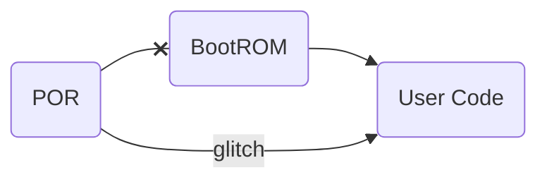
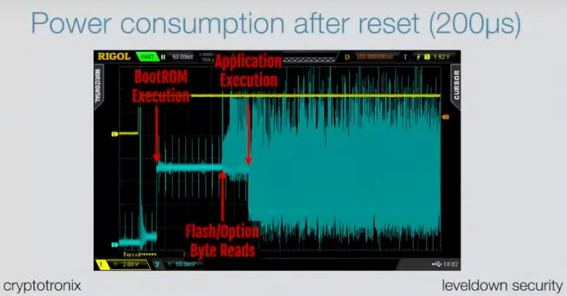
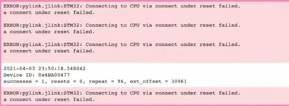
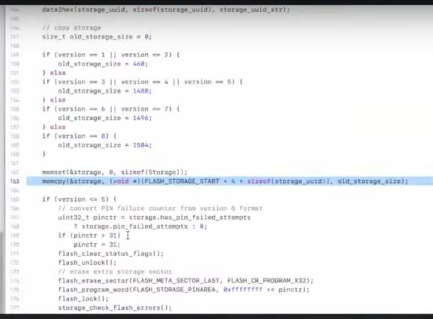

# 42 invites Joe Grand aka Kingpin
> @42TheNetwork | 24 de abr. de 2023
## ABSTRACT:

Hacking can be unpredictable, exciting, and educational, no matter how long you’ve been doing it. In this session, Joe shares his journey of experimentation, failures, successes, and heart-stopping moments as he attempted to recover $2 million worth of cryptocurrency from a Trezor One hardware wallet.

## ABOUT JOE GRAND

Joe Grand, also known as Kingpin, is a computer engineer, hardware hacker, teacher, advisor, daddy, honorary doctor, occasional video maker, member of legendary hacker group L0pht Heavy Industries, proprietor of Grand Idea Studio, and co-founder of offspec.io. He has been creating, exploring, and manipulating electronic systems since the 1980s.

## INTRO
uh so uh Joe we will let you start to do your famous to do this uh presentation to all our campuses around the world thank you so much

cool well yeah thank you for having me um my name is Joe Grant and I'm a hardware hacker I grew up in in the hacker world started hacking when I was seven years old uh in 1982 and um somehow have been able to kind of turn my my passion of hacking and my kind of traditional schooling of engineering into an actual career path so um uh mostly what I do now is teach about Hardware hacking and I'll travel around the world and do that and I was at 42 School in Paris to give a talk at a small event last last fall I think I can't even remember i've been to so many places but um it's fun to go and sort of share my experiences and let people realize um you know hacking uh really to me is kind of an extension of engineering or it's almost you know reverse engineering and looking at things kind of as as a way to undesign a system instead of Designing it um and a lot of times we're using kind of the same tools and stuff but it's really cool to be able to share this side um to show not only like how to hack something but also the challenges that go into it just like if you're designing something you know a lot of times uh we only see the good results that come out of a hack uh or we read about it in the news and whatever I mean we don't really see a lot of the challenges that go along with the two so that's really what I love to do this presentation is um about a process that I went through to hack a treasure Hardware wallet and we'll go into all of the background of that and kind of the process um but it shows some of the failures too and some of the stuff that you know even though I've been doing hacking on things my entire life uh there's always something to learn there's always something new to try you can never be good at everything um and it's sort of like once you acknowledge that like the whole world opens up of like different techniques you can try and not being afraid to try something new and stuff like that so it really is this talk you know is a technical talk to sort of go through the process but the goal is really to um just kind of open up options for you of things to do and um and and what can be done right so it's kind of like here's the here's the thing we hacked but there's more to the story than just showing off a hat

so let's see we are gonna have time for questions as well at the end so I think if you put them in the chat uh either on uh on Google meet or on YouTube I'm not seeing any of them because I have to share my screen uh to do the presentation so at the end we will uh answer questions so yeah definitely feel free to ask uh any anything related to the to the presentation or not um I'm happy to answer and uh let's give it a go all right so I can't see anybody um so uh Fabian or any uh Sebastian maybe can you see my screen are we good yes good okay um so here we go yeah

so this presentation is called the time I have to Hardware wallet and recover two million dollars um yes the kind of Sensational title but a true story and this is something that that came about um

I think it was yeah February 2021 and that was kind of like still during pandemic kind of not full lockdown but there wasn't a lot going on I wasn't traveling I didn't have any other projects and I just received this random email out of the blue uh that said I'm reaching out because of an issue I have with my treasure wallet uh in 2017 I bought some crypto and haven't touched the wallet since when I was moving earlier this year I think I accidentally threw out the recovery seat so that's what it started with and I was like all right that's interesting like I get a lot of emails and this one was really well written and I and I was like okay it's probably legit I haven't really been in the cryptocurrency world like I had a little bit of cryptocurrency that I that I was given as a tip for a project years ago actually for the [[jtagulator]] which is a tool that I designed um 10 years ago now to help you discover uh on-chip debug interfaces like [[JTAG]] and uart and zero wire debug on Hardware devices um and somebody had sent me some some Bitcoin for that years ago and I just set it up in a wallet and forgot about it uh and of course like most people in the tech world uh you know I regret not buying Bitcoin when it first started in 2009 2010 uh my wife was like you should buy some of this because all my friends were and I'm like whatever it's too confusing like even just getting the wallet set up and buying it or mining it like it was just too much I'm a hardware person so I kind of ignored it um so when I got this email I was like okay cryptocurrency and as you'll see in some of the previous work related to this project friends of mine had hacked cryptocurrency wallets and stuff but it just didn't it just didn't really occur to me as a as a thing that I would be interested in um

so once I got this email I'm like all right decided to have a zoom call uh with with the guy who turned out to be a guy named Dan and I was doing it to make sure like was he legit I want to learn his story is he trying to scam me um so I was kind of checking him out where at the same time as we learned later he was doing the call to kind of check me out make sure I wasn't going to do something because he just found me on a Google search of like some other Hardware hacking stuff I'd done um but it really ended up you know being a a phone call where I was like all right this seems cool and my wife was like you're not doing anything else right now you might as well work on this project and um as I started doing it uh as we'll go through sort of these steps she was also like you should be recording this process because a lot of videos I make at least up to that point where like engineering focused and how to make something or little videos about how to hack something you know kind of short little one technique or something she was like you should record the whole process and show people and um of course she was right so we kind of filmed the whole process as well which ended up being a YouTube video um

but it was really an interesting kind of learning process for everybody involved so anyway

the particular device he had uh is called a Trezor one and [[Trezor]] makes a bunch of different Hardware wallets uh they are open source so the Trezor one was their early version or their first model I guess you could say um they also now have a Trezor Model T and they're making a new one uh that I don't know much about but I've seen some mentions of it so you know sort of progressing as attacks happen on one device they'll make another device there are some fundamental problems with the existing trouser devices because they use the [[STM32 microcontroller]] which we'll talk about um but this is one of many types of Hardware wallets out there uh Charlie had mentioned [[Ledger]] which of course is a is a French company making Hardware wallets as well their design is much different is open source so they are showing everything about how their design Works they're showing their source code um which is great from a validation perspective so somebody uh worried about you know um uh trusting and putting their private key or their recovery seat or something on on an untrusted device they could at least go and scrutinize all the documentation on their own Ledger is is the opposite they're closed Source um and they're using oh also too Tresor is using a general purpose microcontroller so you can read all the documentation Ledger has chosen uh to go a closed Source option using a secure element to store things uh in really a completely different design model uh much harder to work with and there's a bunch of other Hardware wallet vendors as well that have now kind of started to poke around with uh but this one is one I would say Trezor and Ledger are the two um most popular wallets being used 

and this particular one with with the Trezor one um you have your recovery seed and your private key really that's generated inside the device that has recovery seed so if you have that recovery seed um which is uh basically you know written words corresponding to your private key if you can get that that gives you access to the cryptocurrency

so the hardware wallet really is like kind of a Secure Storage mechanism to store uh that private key so the goal of hacking these devices is getting access to that private key with the Trezor that's protected by a pin so in that email you know you couldn't remember his pin he must have thrown it out uh and then there's some number of guesses that you can enter before the contents get wiped

so in this situation I think they tried it a couple times to guess you know he tried to try to guess the pin a couple times and then started getting nervous because every time you get a wrong PIN it increases the time and then if you get to too many it's gonna wipe it so he decided to stop and then reach out and uh and see what we could do so the goal of the attack is to get access to the recovery seed uh which corresponds directly to the private key uh and then of course at the same time we would also get the PIN for this particular attack but that's sort of the main goal is the recovery seed because then from that you can set up a new wallet uh get access to your funds and do do what you need to do

in the design of the treasure it turns out the recovery seed and the pin is stored in um [[flash memory]] area of the microcontroller and we'll go through sort of those steps but the goal is to get those things

## PROCESS

1.  **Information Gathering** (obtain info about the target)
2.  **Teardown** (product disassembly, component/subsystem ID)
3.  **Buses & Interfaces** (signal monitoring/analysis/emulation/fault injection)
4.  **Memory & Firmware** (extract/modify/analyse/reprogram code or data)
5.  **Chip-Level** (silicon die modification/data extraction)

um but before we get into the actual process of hacking on the treasure I wanted to talk a little bit about kind of the hardware hacking process in general um I usually talk about this in any of my Hardware hacking um presentations just to sort of give us this overview of what happens in the steps that normally happen when you're when you're hacking on a piece of hardware and this is a process that I go through every single time uh I work on a project and it doesn't matter what it is I go through these steps sometimes you use more steps than others sometimes it's you know kind of uh as we get more towards the advanced things uh maybe they don't happen uh every time but it's good to kind of go through the process and it's sort of like even though I'm a hacker and you always hear oh hackers think outside the box and we look for Unique problems challenges or Solutions and all these things I'm still an engineer and I still have kind of this rigid process that I like to go through and I feel like it really helps because then I can digest the information as I go

### 1. Information Gathering
so we sort of go through this process of like information gathering so as soon as I found out that I was going to hack the treasure that I was you know asked to hack the treasure I did as much research as I could about that device um learning about it looking through the schematics and the source code seeing what other information had already been out there and as you'll see uh building on existing work is kind of what the hacker world is all about and the engineering world as well but it's sort of like using what's out there and then uh you know building on that and and kind of contributing back to the to the uh to the community I guess or to the world if you will

### 2. Teardown
so finding information about the device and then we get into the product teardown and that's where you have physical access to the device with the **goal of getting access to the circuitry** so you can then **identify the parts**, **decide where you want to do the attack** because the Trezor is open source I had access to the schematics uh which made it a lot easier so I could look at the schematic which is basically a graphical representation of the electrical design um so without having to do a lot of physical reverse engineering of the board I already kind of knew where I was going to go after um you know there's kind of a joke in the in the hardware hacking community of like everything is open source if you spend enough time reverse engineering it so even if you had a piece of Hardware that you didn't know the schematic for you can find the major components on the board you can trace things out and see how they connect and kind of take a guess at what's happening on the system it just meant in this case because Trezor is open source it it was just a little easier um also with Trezor

I'll talk about this they had uh their device was ultrasonically welded together so basically vibrated together two pieces of plastic so it created like a one-piece housing part of that product teardown process was to figure out how to open the device in a safe way that you weren't going to damage the circuitry inside and that's very product specific depending on how the product was assembled

### 3. Buses & Interfaces
the next step down from that is buses and interfaces so once you have access to the circuitry figuring out are there debug interfaces that are interesting that you get access to the chips um is there any sort of [[Chip to chip internship communication]] that's happening that maybe we'll monitor with an oscilloscope or logic analyzer maybe at that point that's where we decide to do um [[fault injection]] which we'll talk about as far as like **causing the system to do to do something that it wasn't intended to do kind of misbehave in a very controlled manner** sometimes you get down to like a memory and firmware level where your goal is to get access to data on the device or code on the device in our case because the goal was to get access to the recovery seed once we got access to the hardware we needed to get the contents off

### 4. Memory & Firmware
so that's in the memory and firmware section and sometimes you need to go to like the chip level so if you look at you know most devices like here is the [[jtagulator]] again there's a bunch of integrated circuits on here uh these black chips this one here is the main micro microprocessor and there's a little [[silicon die]] inside because all these integrated circuits are made of basically layers of of metal and then polysilicon for the transistors but they're essentially little I like to consider them *like little tiny circuit boards inside of each of those packages it's like its own little city*

### 5. Chip-Level
and sometimes you need to do things at a chip level not at a board level where we're dealing with the treasure at a board level we're attaching and we're kind of dealing with things without having to open up the chips

but there's a handful of people out there that actually do chip level modification as far as like removing the plastic housing or the cover from the chip getting access to the Silicon using really expensive tools to monitor signals kind of like what we would do at a board level but lower down um inject signals repair things like really wild

so that's something that most people don't do but if you know that it exists and you know that there's access out there and resources out there that you could possibly use it opens up an entirely new world of things to another process to hack but in our case we didn't have to do that we went down all the steps to memory and firmware uh is is all we needed because that was our goal to get access from memory

## MICROCONTROLLER SECURITY

-   Protects MCU internal memory, debug interfaces
-   Vendor-specific implementations
    -   May require fuse/register setting, password, challenge/response
    -   Reduce access (allow subset of functionality)
    -   "Permanently" disable access
-   Configured/checked during chip boot process

because the Trezor and most embedded systems which are electronic systems or IoT devices or whatever you want to call them um most devices are running um some sort of microcontroller so basically a CPU running some specialized code right a *general purpose computer* running some piece of code that somebody wrote which we would call the firmware um most devices are like that these days you used to have devices that were just discrete logic and and uh you know very large boards with which needed a lot of uh circuitry to do things but now we have the microcontroller kind of running everything running the show and then you just have your support circuitry that you need so it kind of makes things more integrated

most microcontrollers these days have some sort of security mechanism um usually that's to protect access to internal memory protect access to the [[debug interfaces]] which we would use with special types of debug Hardware like I happen to have one here to attach to certain types of devices the security because microcontroller vendors know okay a hacker is going to try to get access to my firmware it's going to try to get access to my debug interface let's provide some security to to prevent that from happening

it's very vendor specific every vendor has different security mechanisms that they implement but the main goal is to prevent somebody from getting access to memory

sometimes it's going to be a [[physical fuse]] that's blown on the Silicon so you have to go in and actually repair that uh maybe it's a password maybe it's a challenge response that the engineer needs to send the right values back to the chip in order for it to unlock sometimes you still get access to a system that has security enabled but it gives you like a subset of access so nothing as useful as if you had full access but there's benefits to that too because if you're trying to hack a chip uh and at least if you know you have some access to it then you know you're on the right track and you can try to kind of do [[privilege escalation]] to get more as opposed to some chips like the [[STM32]] that we're using or that is being used in the Trezor that **"permanently" disables access so depending on the security mode** the engineer and what they did in Trezor is there's one mode of the STM32 which we'll talk about later that basically makes the debug interface go away so if I connect up to that interface and try to communicate to it it just doesn't respond at all so you don't know it basically disappears um and **permanently is in quotes of course because nothing is a hundred percent unhackable nothing's 100 secure** um it just means that we have to figure out a way to defeat that and re-enable that debug interface

so usually regardless of what type of security is out there um it's usually something that gets checked as the chip boots up uh and that's something that that's where we kind of want to Target this is something that I didn't really think about until I started kind of learning about uh doing this type of attack on fault injection of this particular device

is we normally think about like systems powering up and then they're just running some user code but **the chips themselves microcontrollers will have their own code running in What's called the boot ROM** which is usually **a persistent hard-coded in Silicon set of instructions so the chip gets powered up it boots it configures itself and then maybe if there's a bootloader it loads the bootloader and then the bootloader runs the user code or maybe there is no bootloader and the chip just Powers up executes the boot ROM configures itself and then runs the user code**

but what's really interesting about that is yes **you can attack the user code as well which is a lot of times uh really useful** but in the case of defeating security usually that's done in that first stage of the boot wrong which is code so if we know if there's some vulnerability written in that code that the vendor doesn't know about but we know about it we could exploit that code and there's really no way to fix it **the only way to fix problems in boot ROM is to re-spin the Silicon**, redesign the silicon and manufacture new Chips *which is extremely expensive and usually that doesn't happen*

some chip vendors uh nowadays there's more like secure microcontrollers that are out there that have more security features and are really designed with security in mind um have different boot loaders and code signing options uh and they even have some like boot ROM patching mechanisms so if somebody does find a vulnerability in the boot ROM there's some other code that basically they can jump from the boot ROM to like this other memory region to fix the problem uh but those can be abused as well right

so it's kind of like security is always the cat and mouse game um but really stuff that happens at these early lowest levels like the boot ROM uh are really really hard to fix if not impossible to fix without a re-spin of the chip which is a great benefit to us

um so here's a data sheet of the STM32 which is used in the Trezor uh device [[STM32 f205]] and just basically just talked about you know it's a general purpose microcontroller arm core um some of the things that are interesting let's see if uh if it mentions it

yeah so down at the bottom left we see it says **debug mode serial wire debug [[JTAG]]** those are very very common debug interfaces for chips [[serial wire debug swd]] is uh for arm core types of devices arm architectures [[JTAG]] is more of an industry standard debug interface but basically looking at the data sheet and knowing that those functions are there tells us that's where we want to Target because **debug interfaces are what give us access to the memory** um if we have full debug access to a chip using our debug Hardware we can single step through the code we can view Memory we can set break points everything that we would do um like we would on the software side but doing it on actual Hardware so seeing that tells us okay that's going to be our Target because debug interfaces are so powerful that's what we're going to go for even if there's security we know it's there let's read about it let's figure out how we can defeat it

with the scm-32 uh they have a code protection called **RDP** read protection um and they basically have three levels of protection and **depending on the state of this one byte as the chip boots that's going to determine what level of security the chip is** in uh so you basically have **RDP level zero** which means everything is open unlocked essentially no security um you have **RDP level two** which is the maximum which means everything is frozen if the debug interface doesn't even show up if you try to communicate with it um it's really like makes any future debugging or development essentially impossible very very hard um and then you have this kind of medium state of **RDP level one** which gives you debug access but it limits what you can do you can view RAM but you cannot view Flash

so it's sort of like it would maybe be useful for development I haven't exactly figured out why RDP level one is kind of useful at all because if you're going to design something you're either going to have it completely open or you're going to want to have it as locked down as possible so level zero or one I'm not exactly sure why or level zero or two um not exactly sure why they have level one but maybe people use it um so level two is what the treasure is set up as and the chip boots up it reads the state of the byte whether it's if it's uh `CC` the byte `CC` that ends up saying okay the Chip is going to enter RDP level two it's going to lock down everything if it reads `AA` it's going to enter RDP level zero open everything up if it reads anything in that byte other than `CC` or `AA` to chip defaults essentially to RDP level one so somewhat open somewhat closed

so the concept that we want to go for when we talk about fault injection which we'll talk about next is if we can corrupt that memory read when that chip is reading the state of the RDP level on boot of the boot ROM if it's at RDP level 2 and it's reading `CC` all we need to do is change one bit to have it downgrade to RDP level one to give us access which is pretty cool

once we get access to RDP level one even though we can't read flash memory we could read RAM which in the case of this particular Trezor attack is all we needed

once we have access to the debug interface RDP level one it turns out also enables a different bootloader access through the STM32 which you can access through serial, can bus a bunch of other things which then gives us another entry point for future attacks which maybe I'll talk about at the end um so really it's like kind of kicking the door down to give you access and then from there you kind of get your fingers into whatever you need to do to control it so to do the downgrade we do what's called fault injection

### Fault Injection
and this is a technique that used to be really really complex to to to get access to or to to sort of um to Tool up and use uh but over time there's been more equipment more resources that we can use to make fault injection something that's very very powerful for everybody not just people with access to academic you know equipment um in an academic institution or uh you know a lot of times it was used for like pay TV smart card hacking back in the 90s but still more complicated to to implement

where now it's just another tool that we can use when we're *hacking Hardware* that it's something that if there is no mitigation intentionally made in the hardware itself of the chip to prevent against fault injection we can attack it that way which is really really cool

and because of the the difficulty in uh you know preventing the stuff and the length of time and the money it takes to design chips again if a chip is vulnerable it's probably going to remain vulnerable unless the vendor really puts in the effort to fix it re-spin it spend more money on that but we kind of know that most vendors don't want to spend money on security unless they absolutely have to

so fault injection is all about intentionally causing a fault in a device to get it to do something that's beneficial to you as the attacker most of the time if we if we do something um and we try to cause a failure the chip just halts or it resets or does something that is not useful **but if we can get it to change a decision in software maybe skip over an instruction um maybe do a computational fault like returning different data or corrupting the data read** then we have something to work with

so fault injection really comes down to a lot of fine tuning to figure out is the target chip vulnerable how do we do it what's the best method a lot of legwork uh to get to the point of abusing fault injection but once you know it's possible then again the world opens up

so how do we do this um I guess the simplest way to describe it is chips have [[defined operating parameters]] where the chip vendor so in our case St microelectronics who makes the STM32 but this is for every type of device out there in the world *chip vendors create their devices within a fixed set of parameters* and they'll say to the engineer or they'll put it in the data sheet **our chip is guaranteed to function within these parameters** 

so in this case on the slide if you operate the chip within the gray area we're going to guarantee functionality we don't know what's going to happen if you as the engineer operate the chip outside of that area so from a hacker perspective we go up okay if we know the Chip is going to behave normally in the gray area

what happens if we do something outside of that area what happens if we increase the clock speed of the device um outside of that area so going say from four megahertz to 20 megahertz or we drop the voltage below 2 volts what's going to happen or maybe we bring the voltage higher what's going to happen uh that's kind of how we think right if we know the fixed functionality let's operate outside of that with an intent of trying to get the system to fail

-   Requires precise tuning to determine ideal glitch parameters
    -   When to glith?
    -   Width of pulse
    -   Target preparation offten neederd
-   Usually triggered by external indicator of cycle counting
    -   Based on a known bus/signal output
    -   May require firmware/code analysis
-   Not a persistent attack (need to peform each time)

and that's what fault injection is all about um and we'll go into a couple different methods of you know there's timing there's voltage there's temperature there's um Optical types of techniques that you can use to cause failures

the one that we're using is voltage we're essentially going to cause a brown out bring the power down and then back up very quickly so kind of flipping the light switch on and off really fast and if we do that at the exact right time maybe that's going to cause something to happen

sometimes with fault injection usually with fault injection sometimes chips are super easy in it it'll happen you know the first time every time but usually you have to once you figure out all the different timing parameters and attack parameters you have to run things in a loop over and over and over and over again even if you hit the right spot every time you might not cause the fault so you have these Loops of trying stuff over and over and over again with the goal of having that happen once and as soon as it happened once and you get in that's all you need

so I mentioned before there's a lot of of work and research that have to go into the particular Target chip:

-   how do you know if the chip is susceptible to fault injection at all ?
-   how do you know what technique is the is the most beneficial um where do you do your glitch to cause something to happen ?
-   how wide or ?
-   how strong is your glitch ?
-   how long is it?

um there's all sorts of questions and it all is going to vary on the hardware itself usually you need to prepare the target Hardware in some way and we'll get into that I'll talk about it specifically for the Trezor

but it's a very long process and really the goal for us was to do it or for me to do it um in a way that was safe enough to not destroy this guy's device um so in some sort of reliable way that I could repeatedly do it

and I thought I got there I've been working on things since then with another colleague to try to fine-tune it even more which would eventually will release all of the the information about it but it's a constant process and a constant iteration

fault injection usually isn't persistent meaning you have to do it over and over and over again um or if you do it once and then you power cycle the device uh you have to do it again so it's like a one-time thing if you're successful and the goal again with fault injection is to usually bypass some sort of authentication check that's happening in our case we want to bypass that security check um sometimes you do it to affect some sort of cryptographic functionality

you can also do fault injection if the chip is susceptible not just on boot ROM code of the chip but user code of the product so if the if you're targeting like functionality of a product or maybe there's a security check uh that the that the engineer wrote in for that particular chip or sorry that particular product you can cause fault injection to affect user code also and that's what's so cool uh because even if the chip is actually like their boot ROM is is done well if it's still susceptible you affect something in user code so just yeah so many different ways to go

of course uh nothing exists in a vacuum and in this case there was existing work
> wallet.fail (Thomas Roth, Dimitry Nedospasov, Josh Datko)

that was already out there about fault injection even about hacking the Trezor one and the STM32 so I mentioned you know information gathering and kind of learning and building upon existing information this is no different um what I learned by these particular presentations is that it's very easy to do something once it's much harder to do something in a controlled way and in a safe way um and reduce the risk as much as you can because with Hardware hacking that it kind of depends but usually that's the goal is you want to be able to repeat it in a way that if something happens um you're not going to completely damage and destroy the device

there might be situations where you have multiple pieces of something like say you're trying to get the firmware out of a device and you have multiple units that you just buy on eBay or something so if you break one uh if you damage the chip if you erase the memory through fault injection whatever it is you just use the next one um but in the situation of hacking a customer's device with money on it you only have one chance to get it right uh and that was that was a big Challenge and still is a challenge and kind of makes you really nervous when you're doing this um so [[**wallet.fail**]] was a presentation given at [[CCC - Chaos Communication Congress]] in December 2018 followed up by [[**chip.fail**]] which talked about different fault injection techniques uh on different ships as well that was black hat same guys as well at .fail

so they basically proved the concept of fault injection on the STM32 it can be done um they even showed that particular versions of firmware you could uh get access to the uh to the recovery seed of the Trezor that was moved into RAM and I'll talk about that in a second so they kind of gave me this leg work to start with and this is when I started doing my information gathering um I had watched these presentations because friends of mine gave the talks uh and they were really cool attacks but they weren't relevant at that point to me until this guy contacted me so now I would like go head first into it to really learn those techniques

so these are some slides uh from uh **wallet.fail** and also **chipp.fail** they showed these so this is the process for the STM32 where the chip Powers up it reads the boot ROM it reads the uh the RDP State and that's where we want to do our fault injection

how do we know where we want to do that uh usually that's done with a lot of reverse engineering with something called uh either **power analysis** or other ways as well but this is showing side Channel power analysis of **basically measuring the power consumption of the chip as it boots to figure out the state of the of the chip on boot**

so in this case they they reset the chip and did a capture and just took some guesses of like all right the the boot ROM starts executing here which is `x` microseconds after the reset line goes High because the Chip is going to configure itself power up reset and then it's going to start executing so they can see boot ROMs executing that's executing low you know kind of low power consumption but when you read flash memory that requires more power so they could see like a little bit later on where it says flash slash option byte reads that's when the boot ROM is reading the flash memory and they took a guess of saying that's probably where the RDP check was happening and then a little bit later the power consumption gets much bigger that's their user code running

so a lot of times if you're trying to characterize the chip if it's susceptible to a fault injection attack you would run your own user code on it so you would kind of know uh when that user code starts running maybe you have it set in [[io pin]] and you're correlating the i o pin going high to where your power consumption Trace is a lot of work

and that's actually what I'm doing now uh is doing some side Channel power analysis to help characterize exactly where we want to do our fault injection because this at the time that kind of narrow space between flash slash option byte reads and application execution that's the range where the RDP check was happening and it was somewhat narrowed down but there's a lot of variation with different chips based on Silicon manufacturing and like the timing wasn't always the same which makes repeatability really hard

if you're doing it once fine you just run the loop for a long time and you'll hit it um so that's what I'm now looking into a lot more of like how narrow can we get that based on power consumption traces to narrow down where that best spot is but this was a huge breakthrough when they figured this out of like we know at some point within this range the RDP check is happening so if we can cause that fault injection at that point uh we we might downgrade and now we can get access to RAM and we'll talk about the significance of ram later on because we're only downgrading from *RDP level 2* to *RDP level one* we don't get straight flash memory access and we know that the recovery seed in the pin of the treasure is stored in flash memory so this attack isn't going to give us access to flash memory directly um but it gives us access to RAM and we'll talk about why that's relevant later

when you're doing fault injection especially voltage based fault injection um you need to usually modify the target device in some way to make it more susceptible to fault injection and that's going to vary depending on the design of the board it's going to vary depending on the type of the chip um usually what you need to do is remove a bunch of capacitors from the board I'll actually show you that later on of our Target board um because fault injection are very very short glitches where we're driving the power down uh and **capacitors are a type of device that basically smooth out the signals and absorb those glitches to give you clean power** so we need to remove the capacitors from our Target so it doesn't absorb those those signal

in the case of the STM32 we need to do that with the chip as well and this particular chip has an **internal voltage regulator to provide power to the CPU core** so we can see in this drawing that if you apply 3.3 volts which is a typical kind of voltage for chips that goes into the onboard voltage regulator um and then that provides usually `1.2 volts` to the CPU core that `3.3 volts` also is used in this particular device to power like [[Iopen]]

and other types of things so it's a very complicated power structure for this chip when you're doing fault injection your target is to mess up the execution of the CPU so we want to control the CPU core voltage not the `3.3 volt` system voltage with the way that the STM32 was designed it has an internal regulator so it makes it hard to adjust if we're glitching `3.3 volts` it's going to go through the regulator that regulator is going to clean up the power and still provide a good `1.2 volt` signal to the CPU core but it just so happens that **most microcontrollers with internal voltage Regulators still have an external pin for you to attach an external bypass capacitor usually that for stability of the regulator** and I don't know why it's not built onto the Silicon it might just be because external capacitors are bigger and better than doing it internal uh but whatever the reason if we follow that white line that goes to that external capacitor that's providing stability to the core regulator if we take that capacitor off and we apply our own voltage to that line we can not only override the core regulator to turn off the internal voltage regulator so now you basically are like disconnecting the internal voltage regulator and then you provide a glitch on that line now you're glitching directly to the core of the CPU and that's what we're doing

some chips are easier some chips you just uh you just glitch the the main voltage coming in you don't have to do stuff like this so it just kind of shows you like every system is different but it's really cool when you realize you can kind of turn off internal components and then you still have external control

## TRIAL AND ERROR
so when I started looking into the Trezor I kind of went a couple different options um with some trial and error and this is something like with any hacking right you kind of want to understand what the viability is what the best way to do it is what the safest way to do it is really hacking comes down to like what's the easiest way and the safest way to do your attack **you don't you don't have to be the greatest you know thing and have the coolest attack chain um it all comes down to like being successful**

so I wanted to kind of learn as much as I could about fault injection different techniques and um I thought it was a pretty steep learning curve to get involved but the documentation and the resources that are available now make it a lot easier to get get involved in I had mentioned uh voltage-based fault injection temperature based Optical what I didn't mention is something called [[**EMFI - electromagnetic fault injection**]] **where you can actually inject faults into a system without having physical contact to it or having to modify the board physically** which is really cool um [[Colin o' Flynn]] a friend of mine who runs a company called [[New AE]] which makes a bunch of different um devices like the [[Chip Whisperer]] which I'll talk about on the next slide um which is a tool that makes it much easier to do fault injection side Channel power analysis and things like that he had some attack work done on certain firmware versions of the Trezor uh that you could basically cause a fault while the Trezor was doing some USB enumeration so basically while the Trezor was communicating to the host computer if you injected a fault at just the right time you could basically make it just like throw up all of the the firmware inside of the device which was based on a vulnerability or a weakness I guess in the USB driver that they were using on that particular version of Trezor Hardware or Firmware

my target device so basically when Dan contacted me he said I'm using Trezor `version 1.6.0` so he knew exactly what firmware version was so I could take a Target kind of reference Trezor device and load that same version of firmware onto it so I could try my attacks with **EMFI** this attack was only that Colin did was for `version 1.7.3` so by that point they had actually patched the attack that I was trying to use um but this attack was using you the USB driver so I kind of just wanted to replicate Colin's attack to give me an idea of how does the mfi work if I could succeed with Collins attack then maybe I could downgrade you know use `1.6.0` firmware and find a vulnerability that way so just kind of exploring different ways um this was a little risky because I was getting a lot of uh like memory erasing uh so I would try to try to do a fault injection to to glitch the USB enumeration and the Chipley race so really cool um but also like not useful at all again for a device that has two million dollars on it

so you've got to see some of these screens I built this platform using a device called the [[Chip Shouter]] which is another tool that Colin designed to do uh the EMFI and you can see all these like crazy looking results on the LCD screens um as the chip was like getting corrupted at certain points

but it turns out for me for this project EMFI just wasn't practical uh though we do see it being used a lot nowadays especially for chips that have fixed or they they say they fixed their voltage fault injection Problems by implementing brownout detection and other things uh you could still bypass those possibly through EMFI so it's another attack in the in the toolbox but not practical for my particular attack um

so I basically said okay EMFI is cool but not going to be practical let's see if I can replicate the work that *wallet.fail* had done and *chip.fail* had done um their research was very very cool but they didn't really have enough information to like straight up take their stuff and run it so I still had to craft all of my own kind of hardware setup and write my own code to do it uh using their Clues and their information as a starting point um so here are some pictures of my setup as I like was studying the schematics and trying different methods of fault injection

but I just couldn't get stuff working like I spent probably a month learning about fault injection running through the resources and the uh the labs that um the chip Whisperer project had set up with known Hardware so I could verify that I knew how to do fault injection but when I tried to do it on my actual reference Trezor I just wasn't able to get it going

and again like the information I had from the presentations were a good starting point but it just wasn't enough to get me over that edge so I started thinking like why is this not working like is it me as a hacker like am I am I just like insufficient as a hacker um or is there something else going on so I thought maybe the devices that I was working with were newer revisions and maybe ST had fixed the problem um maybe they had you know fixed the fault injection problem so it just wouldn't be possible for me to do the fault injection so I said okay let's um let's reach out to St microelectronics let's ask them you know have they fixed these problems like what revisions are vulnerable um to The Fault injection work that had been proven already by wallet.fail by chip.fail and even some academic papers as well

so I sent them a message and um basically asked them and I said *hey I'm considering designing with your STM32F2 uh but are you aware of these vulnerabilities and have they been fixed* so they responded and saying *yeah we're aware of the vulnerabilities um we haven't revised the F2 series* there have been no fixed no fix for any of this stuff um Kraken by the way is another group uh a cryptocurrency exchange that has a research group that was hacking on these things as well so um lots of people kind of knew the Trezor was vulnerable uh and the STM32 was vulnerable and SC micr Electronics admitted they did not fix it which was great for me that was like kind of breaking the glass ceiling you know of like knowing that that wasn't the problem since I knew that the STM32 continued to be vulnerable that gave me a little more confidence in saying okay I know it can be done the problem is probably with my setup which it was

and I just kept trying kept trying kept trying trying different parameters different voltage settings as I was trying to override the regulator figure out different timings and just try as close as I could to getting it working eventually um I had some test code running and all I wanted to do is run this code to see if I could get anything on the STM32 to get corrupted um so I had some some custom code running on a chip not a Trezor just an STM32 with my own user code on it a very simple Loop that if you caused a fault in that user code it would break out of the loop so it would count as a as a uh as a corruption so you could tell that you're successful I had some code running over and over and over again and it was just like I wasn't getting results at all eventually after this this was like a three month long process by the way um eventually I got it working and I could prove that I could glitch the device and I was like yes um so this is a screenshot at like almost midnight that I took and uh you can see on the screen basically it's showing like how many successes there were and a success is a successful fault injection versus an error which is a an unsuccessful fault injection um and I was letting it run overnight lots of things there was a lot of sleepless nights and like having dreams about it working and stuff um but this was a screenshot I sent to my wife and I was like oh you know I did it it was successful um and that was a great point because then I knew that I could cause a fault in the STM32 basically proving what other people had already proved at that point um but then taking that a step further and now applying that directly to the STM32 in the Trezor device

and that's what brings me to The Next Step once I knew I could do it um then I started using the STM32 on the Tresor directly not running my own custom code but running Treasures code and then targeting um bypassing or downgrading the RDP to so modifying my code and uh and then proved that I could now unlock the device going from RDP level 2 to RDP level one um which would then give me access to RAM

so what we see here is there's a little screenshot of my results as I'm running the code because the RDP level 2 the debug interface doesn't exist so as I try to connect to it it says uh you know can't find it can't find it can't find it and then all of a sudden if you glitch it properly it says oh I see it here's my device ID which indicates that you've successfully communicated to the debug interface of the Chip and now it's there so this shows me okay I can downgrade from RDP level 2 where that's supposed to be a permanent downgrade where you don't get access to the debug interface now all of a sudden I get access to the debug interface and I kept track of um the width of my glitch so how long do I hold the voltage down and where the offset where do I do the glitch how many cycles after um the chip comes out of reset trying to kind of narrow down the range of this particular chip where it is vulnerable

but this was huge um and I was super super happy about that and uh and that gave me the confidence then to keep going and see if I could finally get to the point of of succeeding in the video it talks about you know more of this process

but basically I was just screwing around with bolt injection now that I could downgrade the chip I still couldn't get the contents out of the Trezor

I knew from um the wallet.fail work from their attack which basically they were able to get the Trezor to downgrade the Trezor to RDP level one and then start um a Trezor firmware update which would move the recovery sead information into RAM so the Trezor could update its firmware and then it would move the contents from RAM back into uh into the the flash of the Trezor so that's what those guys had done for their attack

I in theory I could have done that attack but that seemed really really risky to me right if you're moving contents out of flash into ram ram is volatile memory so if the power goes out or something happens those contents go away and they're never coming back um I just couldn't bring myself to do that I didn't have the stomach the tolerance for risk to try that um because if I had done that on a customer's device and something happened and this contents went away I was screwed so I wanted to try to figure out was there a way to keep the contents in flash memory no matter how many times I tried to do it and still get access to it so I was just kind of screwing around over and over again and one time I actually saw the recovery scene come up um in RAM I was basically you know power cycling the device glitching it getting access to the debug interface reading RAM trying that over and over and over again different timings to see what would happen and it came up one time and I'm like oh my God I could see the recovery seed but it wasn't consistent but I saw it and that's when I looked through the source codes to more and realized that for the version of firmware running on my target Trezor 1.6.0

this function was being called as the chip was powering up which basically is taking the metadata which is the recovery seed and the pin and some other information and copying it from flash memory into the volatile area of ram every time on power up once I saw that I said okay this is great if I can cause the fault injection at just the right time to get access to RAM if this function had already been run that's going to move their copy sorry that's going to copy the data into RAM now I can read the content out of RAM this particular attack has been fixed by Trezor they don't move the contents of the recovery seed in the pin into RAM anymore it's just in flash that's okay for future versions I'll mention another attack at the end but for our purposes it doesn't matter if it's been patched because this is version 1.6 a lot of people as it turns out um who have emailed me since the videos come out uh use older versions of of their device most people you know we say as security people oh keep your stuff updated patch it blah blah blah most people don't do that um so even though later versions are patched a lot of devices are still out there that are vulnerable and in fact a lot of these since you know in the past year and a half or two years since the video came out so that was my goal of like getting this whole attack chain working so the contents were moved into RAM copied into RAM and then I could read the contents out this is my ultimate setup for the fault injection um for the Trezor this has changed since then I've actually kind of fine-tuned it again I'm working with the colleague right now to make it more repeatable safer we've identified certain types of failures on the scm-32 and we're trying to figure out how can we either prevent those failures or recover from those failures to still get access to data um this was just my implementation at the time and again you're you know you're always learning as a hacker there's always this learning process um so this is my implementation at the time

I had the [[**ChipWhisperer**]] this is the device I used to do the fault injection um over here I had the [[**PhyWhisperer**]] this is a USB protocol analyzer also designed by uh Colonel Flynn and this lets you monitor USB communication so you could like you know Trigger or cause a trigger or cause an event to happen when certain data gets sent across the USB bus or you just use it if you're curious about how a device is communicating to a computer you use a PhyWhisperer I was using it solely just to turn on and off the Trezor because we know that the boot ROM of the scm-32 was only executing that power up so we use that to power cycle the device uh and then we monitored what was going on with my little interface board over to the right uh which would monitor the reset line and then that would be passed over to the ChipWhisperer the ChipWhisperer would basically trigger on the reset line try to do the fault injection and then we have the [[**Segger J-Link**]] which is an off-the-shelf standard type of debug interface communicating to the SDW serial wire debug interface um of the STM32

so basically we power cycle the device cause our glitch try to communicate to the Chip And we do this over and over and over again thousands and thousands of times until it gives us access once we can communicate to the chip now we have access to RAM um and again that also opens up bootloader functionality and other things uh then we can continue on with our attack

this is what the target Trezor looks like um so we have the microcontroller uh the mini micro USB connector some buttons the interface that we're interested in is the bottom those pins at the bottom there's one two three four five six that's the swd interface which Trezor I'm assuming uses during uh manufacturing to program the devices and then they enable security so because we knew that's where the interface was by looking at the schematic uh which in the upper right it actually shows us K2 there's the power line there's the SD swd iOS DVD clock um the optional swd or swo which is a debug output pin which isn't necessary um and then there's a ground pin and the reset pin so everything we need to do our fault injection is there except for where we're going to uh inject our fault to V core to the core CPU voltage

but this is a schematic of the Trezor hardware grab from their website and then modified with the with the modifications that I had to do to the hardware to make it uh ready to do our fault injection um so we attached the in the upper right we did the swd to the j-link the USB connection to the fire whisper um I did remove some capacitors one of them or two of them were on the core power line so that picture I showed earlier of the core voltage regulator there's actually two capacitors down on the on the bottom vss1 and vss2 also called like uh vcap one and vcap2 remove those because we don't want capacitors on the voltage regulator and that's where I attached my SMA connector which is the type of connector to attach to different types of test equipment um that's where I would provide my my glitch and I also removed the capacitor from the reset line um because that basically is used to kind of cause a nice slow gradual um come out of reset state but we didn't want that because we're monitoring the reset line as it goes from low to High when the chip is powered up and ready to go I removed that so we'd actually have a nice sharp edge that we could use as our trigger and I did put an external pull-up resistor on there to force it to go high as fast as possible but it turns out you don't actually need that because there is an internal pull-up resistor for the reset line in the scm-32

but that was basically my initial setup of modifying the board a little bit to prepare it for fault injection

## REAL DEAL
and then this was the real deal this is showing some screenshots of of the video so here I met Dan the customer with the two million dollars he flew to Portland um Oregon which is on the west coast of the United States he was on the east coast of the United States in New Jersey so this was you know a big deal um and we decided like after vetting him and making sure he wasn't gonna like you know do something bad if he came to meet me in person uh we decided to meet up in person and do this all in the lab and of course film it and all of that um this is something where the video was a little bit of kind of like all right now everybody thinks that they can come to my house and I'll do the attack for them in person so that's not actually true uh I don't normally like people coming to my house because this is like my sanctuary of doing Hardware hacking like I'm not a you know I don't have a a formal office and stuff like that like this is in my house um so this was a rare occurrence that somebody actually came but of course to make the video this this was natural and Dan was all for it and flew here hand carried uh the treasure handed it over to me I went through the steps of like opening it up so here basically was the ultrasonically welded housing and I used my knife to pry apart the housing and after doing it on a bunch of Target devices in advance you can see in the back kind of corner there's a bunch of devices that have already been modified I had done the attack uh four times with four different devices well multiple even more than four times multiple devices multiple times with four different devices to prove to Dan that I was ready to do it on the real thing uh before he came so that gave him some comfort that I was gonna do okay

it turns out that even though I had done it many many times on these other four devices um of how lucky we were to get it working on the first time um because even again even to this day uh you never know what's going to happen so it was just really really lucky and no we didn't fake anything like some of the comments on the video were like they were smiling right before the fault injection happened and it was like yeah because we were looking at like The Simpsons uh you know video clips um so this was all real so get the board out of the out of the housing the product tear down um the device had like this conformal coating so a coating over the circuitry to prevent it or to protect it from like moisture and dust and corrosion so I used some chemicals to clean that off so I could actually solder um to the to the header on the board or to the test points on the board here I'm soldering little tiny wires sector and then I plug that into my hardware and that's the setup that looks that looks familiar again this has changed over time um and then I kind of went went to work let it kind of do its thing of uh running the attack over and over again and and glitching and glitching and glitching until we had success I think this is a video so let's see what happens I think this is going to show the yeah so we see like it's very slow every second it's glitching glitch glitch and what we're seeing is the v-core is the core voltage that we have control of by removing that capacitor and attaching our SMA connector which connects the chip Whisperer we're causing that glitch it turns out with fault injection everything matters the length of your cables uh the quality of your glitch like how it how it how it's shaped um in this case we can see some ringing at the low and then some ringing at the top all of those things matter which is what makes it so hard to replicate in a really defined manner um and this at the time was very slow because I was doing it in a very slow way since then I've been able to speed it up significantly

but this is what I was comfortable with at the time and this you know gave me the confidence to do it on a customer's device even though it meant that we had to wait many hours uh for the attack to happen so this is um I think it was like three or four hours of waiting and we got pizza as every hacker you know of course that's the like hacker nourishment to eat pizza so we're sitting around waiting waiting waiting and eventually we had success uh fault injection success we could now communicate directly to the STM32 on his Target Trezor through the j-link and here we see open OCD which is a uh uh a software tool that uses [[JTAG]] Hardware a very powerful open source software tool to interface through uh [[JTAG]] and swd and things like that so we were using that as a way to connect to the device itself and then we could use that as well to read the contents of ram out of it um so this basically is showing okay we can connect to it uh and then we sent the command actually what I did there is um after connecting to it I then exited my python script went to the command line sent the open OCD command to read the RAM and then we came back here to actually run strings to see if the the contents we were looking for was actually in RAM

and we see it is in this version again this this has been fixed but in this version the recovery seed and the pin and other information about the device were in clear so it was just in clear text all we had to do was read it all we had to do you know still you could see it was a long process um more more current versions of the treasure they have encryption um to encrypt those content so even if you were able to get access to the flash memory those contents are encrypted uh there was some work that cracking came out with about decrypting that of course that was only a partial amount of the work so I now have code uh to be able to decrypt future versions of the of the flash but then you might be thinking well rdp1 doesn't give you access to flash um and that's where the STM32 bootloader functionality comes in which is different than the debug interface there's other methods you can connect to the bootloader in the bootloader there's a command that lets you read blocks of flash memory and it checks the RDP state every time you read from the flash for when you every time you execute that command so you basically have to do another glitch once you downgrade to get bootloader access then you do a glitch for every read memory command and you could do that over and over again to read the memory out and then you can decrypt it

so even though one thing has been fixed other things haven't um and that's completely irrespective of user code firmware code running on a device whether it's Trezor or otherwise that's purely at the STM32 level bootloader types of attacks any product that's using an STM32 is going to be vulnerable to that no matter what they do in the user code um which is kind of cool and that's something again that we hope to release more of this that that people can use and replicate this stuff much more easily soon I know it's been already like a year and a half or something but um I I'm not I'm not comfortable releasing something like half-assed I would rather have it be like really well done um that builds again build on existing work that's out there

so anyway we got his uh we got his pin we had his recovery seed we were happy um on the right that's our cameraman Chase he filmed the whole thing and then we turned it into a video uh that ultimately it went viral in Us on YouTube and you can see that if you just search like Joe Grand YouTube or whatever so success

## LESSONS LEARNED
this ended up turning into something where we realized okay if Dan had a problem with his device probably lots of other people were locked out of cryptocurrency as well so we kind of started this side business to help people recover cryptocurrency from Hardware wallets and we've teamed up with some software password crackers as well and we've seen some really interesting cases that are out there and it's cool to be able to use these skills in a way that helps other people um yeah which is you know kind of to me the the like the ethos of hacking right like it's really cool to to do something but then to help other people and apply it in other ways is cool so just at the end um before we open it up to questions some lessons learned

-   General purpose microcontroller - MCU security usually is not suitable
**general purpose microcontroller security usually is not suitable at all** it depends on the product it depends on what you're trying to prevent protect but usually somebody will be able to bypass security in some method if they're determined enough to do so

-   Fault Injection is dependent on external factors
fault injection is dependent on lots of different things so when you hear somebody say oh yeah this chip is vulnerable or you see an academic paper about you know some amazing laser-based fault injection multiple time thing that might use a lot more expensive equipment and months and months of work to get it there there are just so many things that vary

-   feels like magic
it's also very very cool once you know it works once you get it working it really feels like magic even if you know how the like what you're doing or how it works every single time and it's still to this day every single time it happens it's like this is freaking cool right like this is what Hardware hacking is all about, and it's just a cool like shot of adrenaline of like you have control of Hardware you can do something with the chip uh that people didn't know was possible and that's really cool

## RESOURCES
-   [Trezor]()
-   [wallet.fail]()
-   [chip.fail]()
-   [Kraken indentifies Critical Flaw in Trezor Hardware Wallets]()
-   [Sheeding too much light in a Microcontroller's Firmare Protection]()
-   [Trezor - Security giltches reaveal your private keys!]()
-   [Cracking a $2 mil cryopto wallet (The Verdge)]()
-   [How I cracked a hardware crypto wallet and recovered $2mil (Youtb)]()
-   [offspec.io]()

so here are some resources of course you can't click on the links um the uh PDF for these uh this presentation is on my website if you go to Grand ideastudio.com um you probably could just search for Trezor but I think if you go to the portfolio security section um you'll find it my website is is horribly broken right now uh I'm about to release a new version of the website uh so it's kind of like bits and pieces of it don't work but the information is there you can get it uh you can follow along you know with these slides you can click through some of these resources and like really go deep into uh into this world so that is it that's my presentation thank you for listening um and staying up late for most of you I know it's evening time uh but let's uh open up for questions and I'll stop sharing my screen so I can see everybody again

## QUESTIONS
so yes hello Joe for this uh great presentation very thorough um very interesting and very inspiring and I'm sure many people will have agreed with me on that um so we've had a few questions coming in um during that time we'll try to go over as many of them as we can

first question from Bad Wolf uh it's actually a two-parter:
    do you think Open Source Hardware is more or less safe than close to our hardware and would you have been able to hack that wallet if it was closed source
    
yeah great question so that's that's a that's a debate that has been has been raging since the existence of Open Source um it's a it's a double-edged sword like like I mentioned if the if the device was closed source I would still have physical access to it I could still reverse engineer it um physically I wouldn't have access to the code so then maybe I would have to go through fault injection to get access to the code to look at it to figure stuff out um it would be much much harder uh than compared to open source that doesn't mean Open Source Products are easier to hack in this situation it just means that I would have more information as a starting point to hack the device than I would if it was closed Source I would eventually have gotten the same information it would have just been significantly harder
so in that case open source does give you more information to start with uh if a system is designed properly like I would say in the case of Ledger I'm not going to endorse or not endorse different things but in the case of Ledger where they're using an off-the-shelf general purpose microcontroller for the user interface and then they're using a secure element specifically designed for security um to store the recovery seed the private key all of that stuff um technically it's a closed Source system but if I was going to reverse engineer the hardware which I have that's only part of it because that chip is still fairly well designed um so even though it's closed sorts you could still get some open source results from it you could still figure out how it was designed um but there's not a lot of information about that secure chip you'd have to do chip level attacks um so it's something where even if a secure design was open source that doesn't make it any less secure so really it comes down to like How well was the was the design implemented and how secure was the system because open source or not shouldn't uh determine your security so from an analysis point of view open source you know makes it easier for people to go and look at the code and scrutinize the code which I feel like happens a lot less than all of us like to think um but we know that there's a lot of problems that have been in open source software that people have found it also tells you that there's probably lots of problems in closed Source software that people haven't found um so it's definitely this debate but I'm I'm more on the side of Open Source transparency in design giving people insight into how things work um and I don't really design stuff that has to be secure but if I did uh you know I would do it in a way that the hardware elements are secure enough that even if somebody has open source access to it that's not going to make it more or less secure so definitely a complex question but hopefully that was a good enough answer

sure that was a pretty good answer thanks a lot um next question from Bruno:
    when you get down to work uh do you first create a test device or test environment and hack that and then move on to the real thing or do you go straight ahead for the for the main thing

yeah so almost always I'll have either a reference device that is exactly the same so I have just something that's not the actual thing I'm hacking on um or other times I will create a test interface it depends for something like fault injection against a particular chip if you're trying to understand how it uh how it works if it's susceptible usually you would do that on something you control so you would have your own test device running your own code um so you have more insight and you know what's going on in a better way uh if you're working at a system level say against like a router or something that's using a really complex microprocessor you might not be able to create your own test device but you might have access if it's an off-the-shelf piece of Hardware to many of those products that you can maybe try to uh use in different ways so it depends but yeah almost always you you want to start with a reference device or a test device or something other than the actual thing you're hacking

okay great um next question from Jane Novotny:
    have you ever tried to hack a device with [[enclaved processing]] so for example an Intel sjx, risby based Keystone, stuff like

yes yeah so for right so if I ever had to hack anything like secure Enclave types of things um so devices that have much more intentional security uh no and it's mostly just because I haven't had any kind of Interest or Reason in doing it there's a lot of work in that World um one that comes to mind is [Oxide Computing](https://oxide.computer/) uh is a company that uh some folks have set up to try to create more secure uh like servers so they've scrutinized a lot of these secure elements or chips that have secure features um nxp in particular the nxp I think is the LPC family um they found some vulnerabilities in in some of the secure Enclave types of stuff and then there's trusted execution environment in certain chips those are more like I like to deal with kind of uh micro controller based systems some more kind of mid-range where that stuff is a lot of times like microprocessor based higher end um I would say you know those types of chips have definitely taken security much more seriously um so it's probably significantly harder but that's not to say they're insecure it just might make it more difficult so if you're trying to design a secure system that's probably the way to go because it's going to raise that bar of how hard it is to do um even though there are known risks it's sort of like if you understand what those risks are maybe they don't apply to you or maybe you can uh you know work around those if you know that there are problems

oh I do see this comment by the way a correction here so it says from Max:
    Ledger is not fully closed Source Hardware and firmware are because they're using a secure element

right so Ledger made a conscious choice to use a secure element to have better you know physical security of the device um and in exchange for that that requires a non-disclosure agreement from the company uh they're not allowed to share information about that device the code that's running in there is is also now closed Source because it's in there so they intentionally went into more of a closed environment compared to Trezor which intentionally said we want to use chips that anybody can read the data sheets for um so Ledger is as I would say closed Source by proxy because the devices they chose require this confidentiality it also is a little bit of a black box because that means that people like me don't have an insight into those chips unless maybe I would get access to the data sheet through you know somebody leaking in or something like that um I would never sign a non-disclosure agreement on my own because I don't want to be limited um but that was an intentional choice

okay and thanks for taking the comments into into consideration as well making my job easier here then thanks a lot for that um we've got another question from Life on shuffle this time
    **what languages do you usually use on micro microcontrollers**
    
yeah so if **I'm designing something um usually it's in [[C]]** so I'll use like whatever off-the-shelf development tools there are for a microprocessor or microcontroller um usually I'm writing in C sometimes I'll write an [[Assembly]] Language **if I need to do like you know timing specific really low level stuff on the chip** sometimes it's a **combination of both um in the case of like the chip Whisperer and Hardware** hacking types of stuff a lot of hard Hacking tools are **Python based which is really awesome because now you have Hardware control over software** like over Python so you write your Python scripts to do stuff um see an Assembly Language really are my core competency and then Python I can get away with enough to craft stuff but I could never write like an actual tool in Python but from a chip level usually you're dealing with c um in Assembly Language

all right makes a lot of sense um next question from Mia:
    how long did this particular project take you to figure out from start to finish

yep so from start to finish of this one from like getting the email to doing all the research to hacking Dan's device was three months
um and it was really almost all I did um again because I wasn't traveling there wasn't a lot going on like um other than this I had no other projects so it was a very like obsessive of working on this um for three months and a huge amount of work right of trial and error and everything uh and then once I got to the point now that I that I you know did it we then edited the video released the video um and then I have done it on some other devices but I was never really happy with the the process that I put together um like I mentioned like it worked it was very slow but we were super lucky that it worked at all one of the things that I was still seeing um is I was getting a lot of crashes after a successful glitch so even though I could successfully downgrade the chip would then crash so I couldn't get access to it to let it continue executing to copy the contents into RAM um so I feel like there was still a lot of things to learn and progress on uh and that's what I've been doing since not full time like I was you know in those three months but constantly still trying to understand things better fine-tune things uh to understand why is the chip crashing how can I prevent that how can I make it more reliable in a safer way um and that's what we're hoping to do and eventually when when my colleague and I are done and we release some of the stuff uh you know it's just another set of lessons that people can use

all right thanks a lot um next question from Muhammad abir:
    are the bootloaders similar to [[Grub]] and what are the basic differences between bootloaders

yeah so grub being more I would say that's more of like um a bootloader when uh when a microprocessor might load right it loads up uh maybe it's low level boot code and then it reads A bootloader u-boot grub whatever um which then reads and loads the kernel which then reads and loads the file system like that's more of a higher level type of bootloader um that's executing I would say the bootloader really in that situation is user code it's just you know another step in the higher level boot process the bootloaders that I'm talking about and the boot ROM is the lowest level code that's running on the microcontroller besides like micro code um but it's code running on the microcontroller for itself to configure itself before it loads other things um so much different than grub I would say it's more similar to like um yeah I guess kind of lower level like if you interrupt the boot process of like a router or something right you have uart access and you have access to to uboot and you can do like a memory display or like update firmware through tftp or whatever like those types of things are similar to what you see at chip level bootloaders where it's much lower level and it's like read a block of data write a block of data um erase the chip so low level functions and those are the things that we want to try to get access to so I would say like kind of similar but more lower level types of behaviors at a chip level bootloader all right oh and the reason sorry and the reason those are hard coded into ROM is that way if there's user code that corrupts something and you brick your device there's always a recovery method of getting back into the bootloader unless of course you know you've enabled all the security features and then you have to go through and do the fault injection to get there but bootloaders um and boot ROMs on devices are meant so you don't so you don't completely corrupt and destroy the chip

we've got another another question from David Lima:
    **what advice would you give to newcomers** getting into the industry for people who basically want to do your job daily
    
yeah so um that's a good question uh you know when I started hacking on things there was no career path for it like it was purely just a side thing um and I was uh studying engineering and I knew I was going to be an engineer because I loved designing things as well and then hacking just happened to become something over time that was like a a a career that you could actually do
I think a lot of it just comes down to experimenting trying existing work that's out there not being afraid to fail uh and you know like one of the things I really enjoy about this particular work is for me it was a huge learning process like I'm never gonna claim that I'm an expert in anything but this was such a new process for me that I felt completely overwhelmed you know imposter syndrome um I'm not smart enough to do this why is why are other people able to do it and I can't like that happens all throughout life um so that was a real learning process for me of like if you focus enough um on something you know you'll be able to learn about it and uh I would just say like you know I have a [Discord server](https://t.co/OzBuXpy8OR) by the way that my son put up for me uh if you go to my Twitter which is twitter.com like I'm at Jill Grand on Twitter you can join my Discord uh it's not Super Active but I would like it to be more active and we have a couple hundred I think 600 people on there right now um so far but I was hoping that would be sort of a community point for people to learn about Hardware hacking and stuff not just to come and ask me a question about something but for people to communicate to each other so you can go there um actually on my Discord server there's one of the frequently asked questions there's links to a bunch of other Hardware hacking resources out there but **it really just comes down to like finding something you love to do and doing it** and not really chasing the uh the money but doing it because you feel like you have a purpose doing it and then the success that comes from that and how you feel about it and maybe the money um comes later uh but you want to follow what you love and uh and a lot of times with any sort of hacking and engineering and stuff like there are many days where I don't like it and I would rather like retire and do nothing or like you know just only work on my own stuff and it's just like it this stuff is hard right and like it's it's mentally taxing it's emotionally taxing especially when you're doing it on a product that someone's relying on you to do it for it's really really challenging um so you have to love it but there's a lot of resources out there and yeah you just kind of do it and see what what really resonates with you

so next question from Silas Reef:
    **is it possible to exploit Hardware vulnerabilities with software or do you always have to have an electro an electronic device to help you out**

yeah that's a great question so a lot of times when we're doing Hardware hacking besides physical things like fault injection um we're kind of using Hardware to give us some advantage or some stepping stone that we then use software attacks to do so say if it's a Linux system maybe we get Hardware access to then let us patch something in memory that gives us access to something else or whatever it is **Hardware is really a stepping stone to get into software**
we've seen some software types of attacks that affect Hardware oh I can't remember it's uh *there was something that was changing memory accesses in Hardware That Was Then basically doing fault injection over software* there was *another attack that was running software changing the CPU core voltage so kind of glitching through software affecting like motherboards* um yeah I can't remember the names offhand but there there have been um cases of that so using so **if you have software control then you use that to manipulate the hardware** which is kind of cool as opposed to the more commonly thing of using Hardware to Control software um so yeah really neat types of stuff that you could do depending on the system
oh [[**Row Hammer**]] was one of them that *was the one of the kind of affecting memory and reading kind of glitching memory and getting access to memory* that you shouldn't normally have

okay um another question from Bad Wolf:
    can fault injections harm your device or the device you're trying to hack in that case
    
yeah for sure um depending on the type of fault injection you do yeah you could like completely kill your device um if you're doing like electromagnetic fault injection you might damage something on the chip if you're doing voltage fault injection you might physically damage something you really don't know uh you can try to like fine tune and characterize what you want to do um but again it's you know the the more fine-tuned you are the better chances you have of like not destroying something um but besides physically destroying something in some of this the serial bootloader types of attacks I'm working on now I've encountered trying to downgrade that read memory command that I was talking about um to give you these little chunks of flash memory I've encountered erasing the device so like I'm glitching and all of a sudden the contents go away uh sometimes you're corrupting configuration bytes so now you've like clobbered the chip so you can't re-configure it to get it to execute your code anymore um it really depends on the Chip And that's usually why you start with like a Target test device so you can kind of understand some of the failures uh but there's nothing more terrifying than than wiping memory I would say unless you happen to have like you know if you could just buy the devices off the shelf and you're trying to get the firmware out you could just read different chunks and if you erase the device you just go to the next one you get the next section um but in a situation of like a hardware wallet or something it's like my heart sinks every time I see a a memory erase happening on test devices like there are certain attacks I won't even try on a customer's device um and I won't until I'm like much more confident about preventing damage to the chip but yeah 100 possible and that's what makes it so interesting but also so terrifying

moving on to the next question another one from Life on shuffle:
    when you went to court in 1998 uh how difficult was it to make people understand that hacking could be done for good purposes.
    do you feel that since then young Generations worry more about security than at the time
    
yeah that's another great question so in 1998 um I was part of a hacker group called [[**The Loft**]] which was a one of the first publicly facing hacker groups so we would try to share this good side of like what can hackers do we were basically seven guys in a warehouse um kind of hacking on stuff on nights and weekends uh just as as a hobby um we eventually all quit our jobs and started a company a consulting company around security and then and then a couple years later I left to go independent because I didn't like how that was turning out but in 1998 when we were still part of the Loft we were invited to testify in front of the United States government about the state of security um and how you know potential things that could happen like worst case scenarios of um what could happen with like the internet which was just really becoming more more public uh and other sort of network connected computers and things um you know and it was basically like what could we do as seven people uh and what could possibly other countries do other adversaries do it was very very hard um it was basically like talking trying to explain like a technical concept to your grandparents uh is the is the best way I could describe it right um even to this day um it's it's the level of complexity where older people just don't get it and I'm I'm kind of in the same situation like I'm now like middle-aged which is crazy um even though I still feel like a punk you know hacker kid which I still am um but my kids are explaining stuff to me about you know what's common in in their world uh but it's like explaining technical things to politicians that have no idea about technical things that are are really old um was a challenge I would say that one person on the panel that we testified to was John Glenn who before he was the senator before he was a politician was an astronaut he was like one of the first to go into space um I think he was one of the first to uh go around go around the earth um so he was very technical he was actually I think an engineer by trade so he was the one asking like really technical questions but I didn't really realize at the time because I was only 22 21 22 that was like my first public speaking event uh pretty much ever um I didn't realize the significance of what we were doing until like 20 something years later where people still talk about it but it was the first time that hackers were going and saying um you know this is what could be done you guys need to start protecting yourselves uh and of course you know that's where the phrase like hackers can take down the internet 30 minutes came from um but that was really the first time where the mainstream public and the government really opened their eyes to like what hackers could do and things have gotten better since then uh but things have gotten worse since then also because like way more people are online uh even as technology gets better you still have the human weaknesses that you could take advantage of and the scams and the phishing and all of that um so yeah it's it's been interesting and I would say like computer security as a career path uh is never going away it's like being a doctor um and it's something where there's there's always going to be security problems there's always going to be something interesting to study as long as you don't get discouraged by things not changing as fast as you would hope and like some of the stuff I teach and I talk about I've been talking about for for decades um but that's okay like to me it's kind of like being in a band where you go on tour you spread your songs you spread your message and every time you go there's going to be some subset of new people getting involved so it takes that repeated sharing of information even if things aren't you know changing as fast as you would hope the more people you can educate about it you hope eventually these things little by little by little will get better and in Hardware we're seeing that with like secure elements and secure chips uh it's just it takes a long time and that's just the nature of it

okay uh so this is going to be one of our last questions here uh from Mohammed adir again:
    is there any possibility to replace firmwares with your own design firmware and those wallets the wallets that you hacked and if so are there any resources that you can follow
    
yes so um it depends on the design uh if the system is like if you have access to the code in some way then yeah for sure you can you know load your own program into it uh which depending on what you're doing maybe would be called like a [[supply chain attack]] with the ledgers is a great example of that um you know they have their general purpose microcontroller running like the user interface so the display and the buttons and then they have their secure element for the for the for the crypto uh kind of related stuff cryptocurrency related stuff um there's been some examples of like people uh uh either wiping the contents of the existing microcontroller and loading their own code on or removing physically removing the chip that's on there putting their own code own chip on there with their own code and now they control the front-end user interface for whatever types of attacks they want um but if you have debug access to a piece of hardware that's sort of the equivalent of having root access so you can kind of do whatever you want um and you can load your own code onto it and it might be something like if you're trying to hack a device maybe you want to add additional functionality so you modify the code to maybe add in like some malicious functionality or change the behavior of something um whether it's the hardware wallet or a router or anything um because again these these systems are microcontrollers usually or microprocessor which sometimes have external memory but they're all just general purpose computers running code so if we can get to them and yeah like someone said run doom on a device for sure you could do that on a ledger for sure because it's the microcontroller that's connecting to uh the buttons on the screen even though you're you're like bypassing all of the the core functionality of the device it's a general purpose computer so you can do that yeah um and that's kind of the fun of it right it's like you get Hardware access um and again it comes down to like using once you get Hardware access then you can do whatever you want in the software in the firmware uh and yeah everything is a tiny computer these days

last question but not least uh this is like the most popular one like I had to ask you uh because it's been voted up so many times uh it's the big question going back to the the wallet that you hacked uh
    did you guys end up splitting 50 50
    
um no not quite uh yeah so I'll say that it was it was definitely worth the effort to do um and and and a great learning process as well and it sort of opened up this whole path for me to go down but yeah I mean I treated it like any other Consulting type of project and made sure that um you know if I was successful it was going to be worth it and uh and it was and everybody was happy at the end and um you know it's uh yeah again it's cool to be able to like use use my skills in a way that helps people and and hopefully you know we're gonna release more information about this and um I haven't discovered any other you know vulnerabilities and other things yet that I've been looking at but um yeah I know it's all about just like learning and sharing and just continuing that you know iteration for like the Next Generation like you guys and then you guys do it to teach other people and that's what keeps this hacker mindset going um which is what's so important

---

okay well that was our last question on here uh once again thanks a lot for your time and for your great presentation it was amazing to have you on here yes thank you yeah thank you again for having me and also like again if you have more questions you can go to um go to go to my Discord uh I don't really answer emails so Discord is is probably the best way and everybody can communicate um yeah Twitter at [joegrand](https://twitter.com/joegrand) my [website](http://www.grandideastudio.com/) um for [wallet hacking stuff](offspec.io) which is another you know not great website but good enough and uh yeah thanks again for for coming and joining and hope that was uh inspiring and and yeah feel free to join the Discord and hopefully we can get like a lot of good you know Community conversation going over there