#to_review

<details> <summary>Table of Contents</summary>

- [Intro](#intro)
  - [LDAP vs Kerberos](#ldap-vs-kerberos)
    - [Key difference: access to the credentials](#key-difference-access-to-the-credentials)
    - [Why not use ldap auth](#why-not-use-ldap-auth)
  - [what is `pg_hba.conf`](#what-is-pg_hbaconf)
    - [controls how users are authenticated](#controls-how-users-are-authenticated)
  - [what is `pg_ident.conf`](#what-is-pg_identconf)
    - [defines mapping from system user to PostgreSQL user](#defines-mapping-from-system-user-to-postgresql-user)
  - [what is `saslauthd`](#what-is-saslauthd)
  - [what is `pam.sasl`](#what-is-pamsasl)
- [How Kerberos works](#how-kerberos-works)
  - [Running PostgreSQL on \*nix in Active Directory](#running-postgresql-on-nix-in-active-directory)
  - [Creating service principle on windows](#creating-service-principle-on-windows)
  - [Runnig PostegreSQL on \*nix with MIT KDC](#runnig-postegresql-on-nix-with-mit-kdc)
- [Installing keytab](#installing-keytab)
    - [Configuring pg\_hba.conf](#configuring-pg_hbaconf)
- [How does AD work](#how-does-ad-work)
- [Using Domain Account for PostgreSQL server](#using-domain-account-for-postgresql-server)
- [How does SSL/TLS work](#how-does-ssltls-work)
- [Setting up a Certificate Authority](#setting-up-a-certificate-authority)
  - [OpenSSL based CA](#openssl-based-ca)
  - [OpenSSL based root CA](#openssl-based-root-ca)
  - [OpenSSL based intermediate CAs for server](#openssl-based-intermediate-cas-for-server)
  - [OpenSSL based intermediate CAs for client](#openssl-based-intermediate-cas-for-client)
  - [OpenSSL based server certificate](#openssl-based-server-certificate)
- [Setting up the PG server](#setting-up-the-pg-server)
  - [Put certificate and keys in place](#put-certificate-and-keys-in-place)
  - [Set the correct parameters in postgresql.conf](#set-the-correct-parameters-in-postgresqlconf)
  - [Set the correct parameters in pg\_hba.conf](#set-the-correct-parameters-in-pg_hbaconf)
- [Cofigure PG client](#cofigure-pg-client)
  - [Copy files into place](#copy-files-into-place)
  - [use `verify-full`](#use-verify-full)
- [Workflow](#workflow)

</details>

---

# Intro
> https://www.youtube.com/watch?v=puOdjchhEa0

<details> <summary>Types</summary>

- peer
  - seucre, unix-socket
  - unox user connected
- gss (kerberos) / sspi (windows)
  - integração MIT
  - integr. AD
  - recomendada para empresas
- auth baseada em certificados (SSL)
  - client-side
  - mapear CNs p/ Pg (`pg.ident.conf`)
> Não ideal
- scram
  - salted challenge / response auth method
  - pass-based
- pam (pluggable auth method)
  - PAM modules
  - `saslauthd` run as root with `pam.sasl`
  - SSL -> network security
- radius
  - integrates with enterprise RAIDIUS servers
  - use with SSL for network security
- password
  - traditional pass-based auth
  - use with SSL for network security
> to avoid
- md5
  - pass-based
  - old
  - move to SCRAM
- ldap
  - uses simple bind/connect to LDAP server
  - proxies credentials provided by client
  - use GSSAPI/SSPI instead
- ident
  - network-based like peer
  - no auth of remote server
  - insecure, deprecated
- trust
  - bypasses all auth

</details>


## LDAP vs Kerberos

- LDAP
  - Lightweight Directory Access Protocol
  - open and cross-platform
  - provides auth and directory services (user and computer info tipicaly)

- Kerberos
  - provides secure auth services
  - open and cross-platform
  - utilizes tickets to indentify users and services

### Key difference: access to the credentials

- LDAP
  - **client** that provides credentials to LDAP server
  - **LDAP server** that proxies credentials to PostgreSQL server
  - **PostgreSQL server** that authenticates client

- Kerberos
  - **client** that provides credentials to PostgreSQL server
  - The **ticket granting server** that authenticates the client

### Why not use ldap auth

The LDAP authentication method is not recommended for use with PostgreSQL, as it does not provide any security benefits over the password authentication method. It is important to ensure that the LDAP authentication method is not used to prevent unauthorized access to the database. This method can be disabled by setting the `ldapserver` parameter to `0` in the `postgresql.conf` file, and changes will take effect after the PostgreSQL server is restarted.

But if still want to use it, [configure](https://www.youtube.com/watch?v=cQj6sQakSLs) proper parameters in `postgresql.conf` and `pg_hba.conf` files, such as:
  
  ```conf
  # in postgresql.conf
  ldapserver = 0
  ldapprefix = "cn="
  ldapsuffix = ",ou=users,dc=example,dc=com"
  ldapport = 389
  ldapserver = "ldap.example.com"
  ldapbinddn = "cn=postgres,ou=users,dc=example,dc=com"
  ldapbindpasswd = "password"
  ldapsearchattribute = "uid"
  ldapbasedn = "ou=users,dc=example,dc=com"
  ldapbindscope = "subtree"
  ldaptls = 0
  ldaptlscafile = "/etc/ssl/certs/ca-certificates.crt"
  ldaptlskeyfile = ""
  ldaptlscertfile = ""
  ldaptlsprotocolmin = "3.1"
  ldaptlsprotocolmax = "3.3"
  ldaptlsciphers = "HIGH:MEDIUM:+3DES:!aNULL"
  ldapscope = "subtree"
  ldapreferrals = 0
  ldapstarttls = 0
  ldapservers = "ldap.example.com"
  ldaptimeout = 15
  ldapsessionsetup = 0
  ldapsessionsetupwrapper = ""
  ```

  ```conf
  # in pg_hba.conf
  
  # LDAP
  host    all             all

  # LDAP with TLS
  hostssl all             all
  ```

## what is `pg_hba.conf`

The `pg_hba.conf` file is an important configuration file for PostgreSQL, as it controls client authentication. It specifies which hosts are allowed to connect to the PostgreSQL server, which users are allowed to connect, and what authentication methods are used for each user. 

It is important to ensure that the `pg_hba.conf` file is properly configured to prevent unauthorized access to the database. This file can be edited using a text editor, such as Visual Studio Code, and changes will take effect after the PostgreSQL server is restarted.

Overall, the `pg_hba.conf` file is a crucial component of PostgreSQL's security infrastructure, and it is important for developers and administrators to understand its purpose and how to properly configure it.

### controls how users are authenticated

```conf
local  DATABASE  USER  METHOD  [OPTIONS]
host   DATABASE  USER  ADDRESS  METHOD  [OPTIONS]
hostssl  DATABASE  USER  ADDRESS  METHOD  [OPTIONS]
hostnossl  DATABASE  USER  ADDRESS  METHOD  [OPTIONS]
```

- real in order, top-to-bottom, first match used
- `hostssl` matches if SSL is used
- special DBs- `all`, `sameuser`, `replication`, `reject`
- special users- `all`, `+role` for membership 
- address can be ipv4 or ipv6 can include CIDR mask
- `reject` is like `deny` but gives error msg

## what is `pg_ident.conf`

The `pg_ident.conf` file is an optional configuration file for PostgreSQL, as it allows for mapping of database users to system users. This file can be edited using a text editor, such as Visual Studio Code, and changes will take effect after the PostgreSQL server is restarted.

Overall, the `pg_ident.conf` file is a useful tool for mapping database users to system users, and it is important for developers and administrators to understand its purpose and how to properly configure it.

### defines mapping from system user to PostgreSQL user

```conf
map-name   auth-user   auth-system   [pg-user]
peermap    joe         joe           joe
certname   joe.crt     joe           joecrt
kerbnames  joe.crt@domain.com        postgres
kerbnames  /^(.*)@domain.com$        \1
```
- regexps can be used- but use with care and anchor
- unix user 'joe' can connect in PG as 'joe' or joe.crt'
- client certificate can connect name 'joe.crt' as 'joecrt'
- kerberos principal 'joe.crt@domain.com' as 'postgres'
- kerberos principal '*@domain.com' as 'joe' (user)
- maps pecified in `pg_hba.conf` with `map=map-name` as option

## what is `saslauthd`

The `saslauthd` daemon is an authentication daemon that is used by PostgreSQL to authenticate users using the SASL framework. It is important to ensure that the `saslauthd` daemon is properly configured to prevent unauthorized access to the database. This daemon can be configured using a text editor, such as Visual Studio Code, and changes will take effect after the PostgreSQL server is restarted.

Overall, the `saslauthd` daemon is a crucial component of PostgreSQL's security infrastructure, and it is important for developers and administrators to understand its purpose and how to properly configure it.

## what is `pam.sasl`

The `pam.sasl` module is a PAM module that is used by PostgreSQL to authenticate users using the SASL framework. It is important to ensure that the `pam.sasl` module is properly configured to prevent unauthorized access to the database. This module can be configured using a text editor, such as Visual Studio Code, and changes will take effect after the PostgreSQL server is restarted.

Overall, the `pam.sasl` module is a crucial component of PostgreSQL's security infrastructure, and it is important for developers and administrators to understand its purpose and how to properly configure it.

# How Kerberos works

- kdc (key distribution center)
  - authentication server
  - ticket granting server
- tgt (ticket granting ticket)
  - issued by kdc
  - used to get service tickets
- Principals
  - users
  - services
  - hosts
- keytab
  - file with keys for principals
  - used by services

A payload is encrypted with a key, and the encrypted payload is sent to the KDC. The KDC decrypts the payload using the key, and then verifies that the payload is valid. If the payload is valid, the KDC sends a ticket granting ticket (TGT) to the client. The client then uses the TGT to request a service ticket from the KDC. The KDC verifies that the client is authorized to access the requested service, and then sends a service ticket to the client. The client then uses the service ticket to access the requested service.

A ticket is a data structure that contains information about the client, the service, and the time that the ticket was issued. A ticket granting ticket (TGT) is a ticket that is used to request a service ticket from the KDC. A service ticket is a ticket that is used to access a service.

## Running PostgreSQL on *nix in Active Directory

- need a user account in AD
- service needs to exist in AD
- have to map user account to service account
- *nix systems need a keytab file with the principal in it
- last:
  - export keytab and copy to *nix system
  - simple windows commando to do all that keypass
  - kerberos on *nix typcally means MIT kerberos or heimdal

## Creating service principle on windows
> fqdn: fully qualified domain name

ktpass
- /out "C:\path\to\postgres.keytab" output path name
- /princ "postgres/server.fqdn.com@REALM.COM" principal name
- /mapuser "pgserver" windows user name
- /pass "password" password for windows user
- /crypto AES256-SHA1 encryption type
  - suported by win, MIT, Kerberos, Heimdal
> other
- /ptype KRB5_NT_PRINCIPAL principal type
- /mapop setpass map password

## Runnig PostegreSQL on *nix with MIT KDC
- need a service principal in the mit kdc
- kadmin - connection to kdc for creating principals
- create the principal
  - addprinc -randkey postgres/server.fqdn.com
  - create/export the keytab file:
    - kadd -k /path/to/postgres.keytab -e aes256-cts-hmac-sha1-96 postgres/server.fqdn.com (SENSITIVE)
    - copy postgres.keytab to PG server

# Installing keytab

- configure /etc/krb5.conf
  - [libdefaults]
    - default_realm = REALM.COM
    - dns_lookup_realm = false
    - dns_lookup_kdc = false
    - ticket_lifetime = 24h
    - renew_lifetime = 7d
    - forwardable = true
  - [realms]
    - REALM.COM = {
      - kdc = kdc.realm.com
      - admin_server = kdc.realm.com
    - }
  - [domain_realm]
    - .realm.com = REALM.COM
    - realm.com = REALM.COM
- copy keytab to PG *nix server
> note that keytab is a binary file and should be protected
- specify location in postgresql.conf with krb_server_keyfile
  - krb_server_keyfile = '/path/to/postgres.keytab' 
- could be stored in PGDATA dir
- must be readable only by PostgreSQL
- can be user by multiple instances of PG

### Configuring pg_hba.conf

- with server on *nix host
  - host all all 0.0.0.0.0/0 gss include_realm=0
- with server on windows platform
  - host all all 0.0.0.0.0/0 sspi include_realm=0

> News in PG12 for pg_hba.conf
> GSSAPI Encryption support
> - only available when using GSS client and server
> - will work with keys provided by AD
> - Will only match connections using GSS encryption:
>   - hostssl and hostnossl are not supported
>   - hostgss all all 0.0.0.0.0/0 gss include_realm=0 encrypt=1
> - will only match connections not using GSS encryption:
>   - hostnogss all all 0.0.0.0.0/0 gss include_realm=0 encrypt=0

# How does AD work

- AD is a directory service
  - stores info about objects
  - users, computers, printers, etc
- Domain Controller is a KDC (key distribution center)
  - authenticates users
  - issues tickets
  - stores info about objects
- TGT (ticket granting ticket)
  - issued by KDC
  - used to get service tickets
- Principals (users, services, hosts)
- service principal comes from SSPI interface

# Using Domain Account for PostgreSQL server

Running PG with a dedicated domain account for SSPI
- Stop PG
- Create an explicit domain account for PG
- Change the ownership for everything to be owned by the new account
- Change the service log on credentials, so PG runs as the new account
- start up PG
- inform AD admin that you are using a domain account for PG
  - `setspn -S postgres/server.fqdn.com pgserver`(domain account)

Running PG as network service with SSPI
- Not as secure due to the use of a shared account
- default of some of the installers
- simpler setup, simply inform AD admin that you are using a domain account for PG
  - `setspn -S postgres/server.fqdn.com server_name`

# How does SSL/TLS work

Public key infrastructure (PKI)
- Based on public/private key cryptography
- certificates are public keys signed by a trusted authority (tird party)
- each certificate has a private key
- root certificate authority (CA) self-signs the certificate
- intermediate ca - but signed by root ca
- server certificate - signed by root or intermediate ca
- client certificate - signed by root or intermediate ca

# Setting up a Certificate Authority

## OpenSSL based CA

- Create a self-signed CA
- create an intermediate CA to issue server certificates
- create an intermediate CA to issue client certificates
- create server certificate and sign it with the intermediate CA
- create client certificate and sign it with the intermediate CA
- install server certificate and configure PG to use it
- install client certificate and configure PG to use it
- configure PG to require client certificates
- configure PG to verify client certificates

## OpenSSL based root CA

- make sure keyUsage is uncommented in `openssl.cnf` under `[v3_ca]`
  - keyUsage = keyCertSign, cRLSign
  - create a self-signed CA:
    - create a key for the CA
      - openssl genrsa -aes256 -out ca.key 4096
    - create a self-signed certificate for the CA
      - openssl req -new -x509 -days 3650 -key ca.key -out ca.crt

```cnf
[ v3_ca ]
# Generates the private key for the CA
openssl genrsa -aes256 -out ca.key 4096

# Creates the request so the key is validated
openssl req -new -x509 -sha256 -days 1825 -key ca.key -out ca.crt -subj "/C=US/ST=CA/L=San Francisco/O=My Company, Inc./OU=IT/CN=root-ca"
```
> genrsa: generate an RSA private key
> -aes256: encrypt the private key with AES-256
> -out ca.key: output the private key to the file ca.key
> 4096: use a key length of 4096 bits
> 
> req: use the req program to create a certificate signing request > (CSR)
> -new: generate a new certificate signing request
> -x509: generate a self-signed certificate instead of a > certificate signing request
> -sha256: use 256-bit SHA (Secure Hash Algorithm) for the > signature digest
> -days 1825: make the certificate valid for 1825 days (5 years)
> -key ca.key: use the private key in the file ca.key to sign the > certificate
> -out ca.crt: output the certificate to the file ca.crt
> -subj: set the subject of the certificate to the specified value

##  OpenSSL based intermediate CAs for server

  - key for server intermed CA
    - `openssl genrsa -aes256 -out server-intermed.key 4096`
  - create a Certificate Signing REquest (CSR) for the server intermed CA signed by the root CA
    - `openssl req -new -sha256 -days 1825 -key server-intermed.key -out server-intermed.csr -subj "/C=US/ST=CA/L=San Francisco/O=My Company, Inc./OU=IT/CN=server-intermed-ca"`
  - create the server intermediate certificate by signing with the CA certificate
    - `openssl x509 -extfile /etc/ssl/openssl.cnf -extensions v3_ca -req -days 1825 -CA ca.crt -CAkey ca.key -CAcreateserial -in server-intermed.csr -out server-intermed.crt`

## OpenSSL based intermediate CAs for client

- Create the client intermediate CA
  - Key for client inter CA
    - `openssl genrsa -aes256 -out client-intermed.key 4096`
  - Create certificate signing request (CSR) for client intermed CA signed by root CA
    - `openssl req -new -sha256 -days 1825 -key client-intermed.key -out client-intermed.csr -subj "/C=US/ST=CA/L=San Francisco/O=My Company, Inc./OU=IT/CN=client-intermed-ca"`
  - create the client interm certificate by signing with the CA certificate
    - `openssl x509 -extfile /etc/ssl/openssl.cnf -extensions v3_ca -req -days 1825 -CA ca.crt -CAkey ca.key -CAcreateserial -in client-intermed.csr -out client-intermed.crt`

## OpenSSL based server certificate

- create the server certificate
  - create a key and Certificate Signing Request (CSR) for the intermediate server CA
    - `openssl req -nodes -new -newkey rsa:4096 -sha256 -keyout server.key -out server.csr -subj "/C=US/ST=CA/L=San Francisco/O=My Company, Inc./OU=IT/CN=server"`
  - create the server certificate by signing with the intermediate server CA
    - `openssl x509 -extfile /etc/ssl/openssl.cnf -extensions usr_cert -req -days 1825 -CA server-intermed.crt -CAkey server-intermed.key -CAcreateserial -in server.csr -out server.crt`


# Setting up the PG server

## Put certificate and keys in place

- need the root CA certificate
  - `cp ca.crt /var/lib/pgsql/13/data/root-ca.crt`
- need the serever key
  - `cp server.key /var/lib/pgsql/13/data/server.key`
- have to combine the certificates togheder (order matters)A
  - `cat server.crt server-intermed.crt client-intermed.crt > /var/lib/pgsql/13/data/server.crt`
- set up proper permissions
  - `chown postgres:postgres /var/lib/pgsql/13/data/server.key`
  - `chmod 0600 /var/lib/pgsql/13/data/server.key`

> whats the certificate file is used for:
> is used for the server to identify itself to the client and to encrypt the communication between the server and the client (SSL/TLS).  
> Is what PG sends to the client when the client conects to the server.

## Set the correct parameters in postgresql.conf

- ssl = true
- ssl_cert_file = 'server.crt'
- ssl_key_file = 'server.key'
- ssl_ca_file = 'root-ca.crt'

## Set the correct parameters in pg_hba.conf

- Client-certificate used directly in auth
  - `hostssl all all 0.0.0.0.0/0 cert clientcert=1`
- Client-certificate required but scram is used for auth
  - `hostssl all all 0.0.0.0.0/0 cert clientcert=1,scram-sha-256`
- New options in v12
  - `hostssl all all 0.0.0.0/0 scram clientcert=verify-ca`
  - `hostssl all all 0.0.0.0/0 scram clientcert=verify-full`

# Cofigure PG client

## Copy files into place

- copy root CA certificate to client, have to be on both sides
  - `cp ca.crt ~/.postgresql/root-ca.crt`
- copy the client key
  - `cp client.key ~/.postgresql/client.key`
- put the certificates into the cert file (order matters)
  - `cat client.crt client-intermed.crt server-intermed.crt > ~/.postgresql/client.crt`
- set up proper permissions
  - `chmod 0600 ~/.postgresql/root-ca.crt ~/.postgresql/client.key ~/.postgresql/client.crt`

## use `verify-full`

- `psql "postgresql://server.crunchydata.com/db?sslmode=verify-full"`
- alternative is to use enviroment variable
  - `export PGSSLMODE=verify-full`
  - `psql -h server.crunchydata.com -d db`
- other options but less secure
  - verify-ca: only checks that the server certificate is signed by a trusted CA
  - verify-full: checks that the server **certificate is signed by a trusted** CA and that **the server host name matches the certificate's** common name (CN) or subject alternative name (SAN)


# Workflow

```mermaid
graph TD
  subgraph Setting up a Certificate Authority
    A[Create a self-signed CA] --> B[Create an intermediate CA to issue server certificates]
    A --> C[Create an intermediate CA to issue client certificates]
    B --> D[Create server certificate and sign it with the intermediate CA]
    C --> E[Create client certificate and sign it with the intermediate CA]
    D --> F[Install server certificate and configure PG to use it]
    E --> G[Install client certificate and configure PG to use it]
    G --> H[Configure PG to require client certificates]
    H --> I[Configure PG to verify client certificates]
  end
  subgraph OpenSSL based CA
    J[Create a self-signed CA] --> K[Create a key for the CA]
    K --> L[Create a self-signed certificate for the CA]
  end
  subgraph OpenSSL based intermediate CAs for server
    M[Create the server intermediate CA] --> N[Key for server intermed CA]
    N --> O[Create a Certificate Signing Request CSR for the server intermed CA signed by the root CA]
    O --> P[Create the server intermediate certificate by signing with the CA certificate]
  end
  subgraph OpenSSL based intermediate CAs for client
    Q[Create the client intermediate CA] --> R[Key for client inter CA]
    R --> S[Create certificate signing request CSR for client intermed CA signed by root CA]
    S --> T[Create the client interm certificate by signing with the CA certificate]
  end
  subgraph OpenSSL based server certificate
    U[Create the server certificate] --> V[Create a key and Certificate Signing Request CSR for the intermediate server CA]
    V --> W[Create the server certificate by signing with the intermediate server CA]
  end
  subgraph Setting up the PG server
    X[Put certificate and keys in place] --> Y[Need the root CA certificate]
    Y --> Z[Need the server key]
    Z --> AA[Have to combine the certificates together order matters]
    AA --> AB[Set up proper permissions]
  end
  subgraph How does SSL/TLS work
    AC[Public key infrastructure PKI] --> AD[Based on public/private key cryptography]
    AD --> AE[Certificates are public keys signed by a trusted authority third party]
    AE --> AF[Each certificate has a private key]
    AF --> AG[Root certificate authority CA self-signs the certificate]
    AG --> AH[Intermediate CA - but signed by root CA]
    AH --> AI[Server certificate - signed by root or intermediate CA]
    AI --> AJ[Client certificate - signed by root or intermediate CA]
  end
  subgraph Running PG as network service with SSPI
    AK[Not as secure due to the use of a shared account] --> AL[Default of some of the installers]
    AL --> AM[Simpler setup, simply inform AD admin that you are using a domain account for PG]
    AM --> AN[setspn -S postgres/server.fqdn.com server_name]
  end
  subgraph Inform AD admin that you are using a domain account for PG
    AO[setspn -S postgres/server.fqdn.com pgserver domain account]
  end
  AO --> AK
  AN --> AK
  subgraph Configure PG client
    AP[Copy files into place] --> AQ[Copy root CA certificate to client, have to be on both sides]
    AQ --> AR[Copy the client key]
    AR --> AS[Put the certificates into the cert file order matters]
    AS --> AT[Set up proper permissions]
    AT --> AU[Use `verify-full`]
    AU --> AV[`psql 'postgresql://server.crunchydata.com/db?sslmode=verify-full'`]
    AU --> AW[Alternative is to use environment variable]
    AW --> AX[`export PGSSLMODE=verify-full`]
    AX --> AY[`psql -h server.crunchydata.com -d db`]
    AU --> AZ[Other options but less secure]
    AZ --> BA[verify-ca: only checks that the server certificate is signed by a trusted CA]
    AZ --> BB[verify-full: checks that the server certificate is signed by a trusted CA and that the server host name matches the certificate's common name CN or subject alternative name SAN]
  end
```



