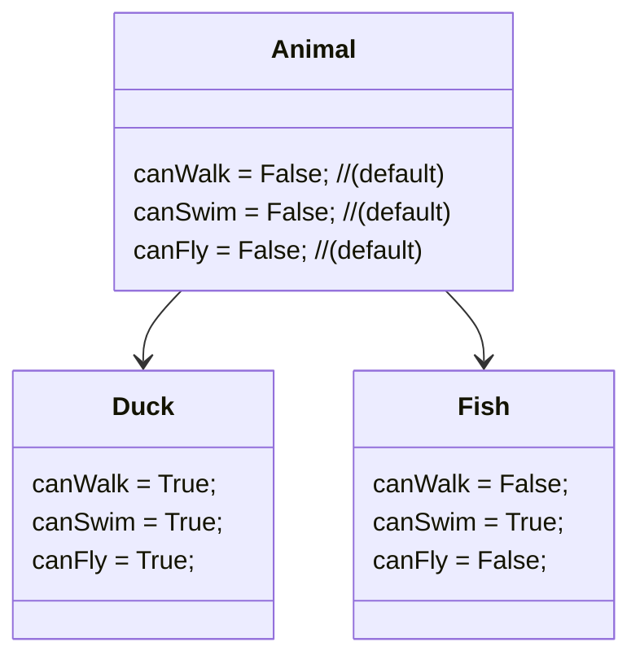

<details> <summary>Table of Contents 🔖</summary>

- [Object-oriented Programming - OOP #](#object-oriented-programming---oop-)
  - [Concepts](#concepts)
    - [Abstraction](#abstraction)
    - [Encapsulation](#encapsulation)
    - [Inheritance](#inheritance)
    - [Polymorphism](#polymorphism)
    - [Methods](#methods)
    - [Classes](#classes)
    - [Dunder Method](#dunder-method)
    - [Instances list](#instances-list)

</details>

---

# Object-oriented Programming - OOP [#](https://www.youtube.com/watch?v=Ej_02ICOIgs)

## Concepts

There's two big branches in programming, they're called Programming Paradigms.
> Paradigm is a way/method to do some task. A programming paradigm is a style/way of programming and not referring to a specific language.
> by [Gopi Gorantala](https://dev.to/ggorantala/functional-programming-and-programming-paradigms-in-java-323f)


And as you can see (*if the image was not removed*) OOP belongs to the Imperative Paradigm, but what does it mean?
>  **imperative programming** is a [programming paradigm](https://en.wikipedia.org/wiki/Programming_paradigm "Programming paradigm") of software that uses statements that change a program's state. In much the same way that the imperative mood in natural languages expresses commands, an imperative program consists of commands for the computer to perform. Imperative programming focuses on describing _how_ a program operates step by step.
>  *Jain, Anisha (2022-12-10). ["Javascript Promises— Is There a Better Approach?"](https://medium.datadriveninvestor.com/javascript-promises-is-there-a-better-approach-dd6a0a329131). Medium. Retrieved 2022-12-20.*

---

The pillars, or main principles, of OOP are:
- **Abstraction**
- **Encapsulation**
- **Inheritance**
- **Polymorphism**

### Abstraction 

The Objects translate to a imaginable entity that have an Identity, Characteristics and can perform actions.
The first one gives the recognition of a unique element in the code. The characteristics are the atributes of the Object and, the actions are the methods of the Object.
> e.g. a bank account
```js
class Account {
	// attributes
	constructor() {
		this.id = 001;
		this.user = '...';
		this.agency = '...';
		this.balance = 1000.0;
	}
	// methods
	deposit(...) {...}
	withdraw(...) {...}
}
```

This `constructor` element (*the syntax changes from each programming language*) has the builtin attributes that define the object, it can receive methods too, but this is just a representation.

### Encapsulation 

This principle states that all important information is contained inside an object and only select information is exposed. The implementation and state of each object are privately held inside a defined class. Other objects do not have access to this class or the authority to make changes. They are only able to call a list of public functions or methods.

### Inheritance 

A class can be created from another, thus receiving its information. When this happens, we say that the new Object is a child of the previous one, receiving the characteristics of the "parent" by inheritance. Note that this newly attributes belongs now to the "child", so it may have be different from other "brothers" and even the "parent".



In this example:

```js
class Duck extends Animal {...}
class Fish extends Animal {...}
```

### Polymorphism 

Allows different types of objects to pass through the same interface. This grants the possibility that "child's" can have different behaviours of the "parents".


### Methods 

Are functions that are defined inside a class that describe the behaviors of an object. Each method contained in class definitions starts with a reference to an instance object. Additionally, the subroutines contained in an object are called instance methods. Programmers use methods for reusability or keeping functionality encapsulated inside one object at a time.

### Classes

A class is a user-defined blueprint or prototype from which objects are created. Classes provide a means of bundling data and functionality together. Creating a new class creates a new type of object, allowing new instances of that type to be made. Each class instance can have attributes attached to it for maintaining its state. Class instances can also have methods (defined by their class) for modifying their state.

Visit the following resources to learn more:

-   [Classes in Python](https://docs.python.org/3/tutorial/classes.html)
-   [Python Classes and Objects](https://www.geeksforgeeks.org/python-classes-and-objects/)
-   [Python Classes and Objects](https://www.w3schools.com/python/python_classes.asp)

---


- `<class 'int'>` cada variável é uma instancia de uma classe de data type, esse é o resultado de

    ```python
    item = 7
    print(type(item))
    ```


    ```python
    class Item:
        def calculate_price(): # method
            pass

    item1 = Item() # create instance
    print(type(item)) # <class '__main__.Item'>
    ```

- `<class '__main__.Item'>`
- `self` parametro de um metodo que é autogerado, ele passa o próprio objeto (no caso a instancia da classe) como argumento quando o método é chamado.
    Se nenhum parametro for passado `TypeError: calculate_ price() takes 0 positional arguments but 1 was given`


### Dunder Method 

**Are methods that allow instances of a class to interact with the built-in functions and operators** of the language. The word “dunder” comes from “double underscore”, because the names of dunder methods start and end with two underscores, for example `__str__` or `__add__`. Typically, dunder methods are not invoked directly by the programmer, making it look like they are called by magic. That is why dunder methods are also referred to as “magic methods” *sometimes*.

Dunder methods are not called magically, though. They are just called implicitly by the language, at specific times that are well-defined, and that depend on the dunder method in question.

> The dunder method everyone knows

If you have defined classes in Python, you are bound to have crossed paths with a dunder method: `__init__`. **It's responsible for initialising your instance of the class** (like the `constructor` in JS, which is why it is in there that you usually set a bunch of attributes related to arguments the class received.

For example, if you were creating an instance of a class `Square`, you would create the attribute for the side length in `__init__`:

```python
>>> class Square:
	    def __init__(self, side_length):
	        """__init__ is the dunder method that INITialises the instance.

	        To create a square, we need to know the length of its side,
	        so that will be passed as an argument later, e.g. with Square(1).
	        To make sure the instance knows its own side length,
	        we save it with self.side_length = side_length.
	        """
	        print("Inside init!")
	        self.side_length = side_length

>>> sq = Square(1)
# Inside init!
```

Like any other constructor it receives the argument (if needed), at the creation of their instance, including `self`.
> como qualquer função pode ser definido um valor `defaut` para algum parâmetro recebido

```python
class Item:
    def __init__(self, name, price, qtd=0):
        print(F"Instance created - {name}")
        self.name = name
        self.price = price
        self.qtd = qtd
        
    def calculate_price(self): # method
        return self.price * self.qtd

item = Item("pen", 1.5, 2) # create instance and recieve arguments
print(item.name, item.price, item.qtd)
print(item.calculate_price())
```

- para restringir o argumento recebido pelo metodo, pode ser tipando o parametro na definição do metodo
    `def __init__(self, name: str, price: float, qtd=0):`
    caso o parametro tenha um valor defaut python ja reconhece o tipo daquele atributo

- `assert` statement
    é outra forma de restingir a entrada de dados através dos parametros `assert price >= 0`

    caso a determinação nao seja atendida sera retornado `AssertionError` por defaut, mas essa mensagem pode ser editada
    
    ```python
    class Item:
        def __init__(self, name: str, price: float, qtd=0):
            # validations
            assert price >= 0, F"Price {price} lesser than zero."
            assert qtd >= 0,  F"Quantity {qtd} lesser than zero."

            # atributes
            self.name = name
            self.price = price
            self.qtd = qtd
        
        def calculate_price(self): # method
            return self.price * self.qtd
    ```

- Class Atributes, funciona como uma variável local que pode ser acessada através da instancia de um objeto (lembra a ligação `__proto__` em JS)

    ```python
    class Item:
        discount: 0.8 # 20%

        def __init__(self, name: str, price: float, qtd=0):
            # validations
            assert price >= 0, F"Price {price} lesser than zero."
            assert qtd >= 0,  F"Quantity {qtd} lesser than zero."

            # atributes
            self.name = name
            self.price = price
            self.qtd = qtd
        
        def calculate_price(self): # method
            return self.price * self.qtd
    ```

    - `__dict__` (dictionary) lista todos os atributos do objeto seja ele uma classe ou uma instancia da classe

- chamando a própria classe (`Item.`) pode-se acessar os atibutos que pertencem somente a ela, porem, como boa pratica aconselha-se usilizar `self` para se referir ao atributo pertencido pela propria instancia

    ```python
    class Item:
        discount: 0.8 # 20%

        def __init__(self, name: str, price: float, qtd=0):
            # validations
            assert price >= 0, F"Price {price} lesser than zero."
            assert qtd >= 0,  F"Quantity {qtd} lesser than zero."

            # atributes
            self.name = name
            self.price = price
            self.qtd = qtd
        
        def calculate_price(self): # method
            return self.price * self.qtd

        def apply_discount(self):
            self.price = self.price * self.discount

    item = Item("pen", 1.5, 2) # instance
    item.apply_discount()
    print(item.price())
    ```

    porem se chamarmos o atributo da classe e modificar seu valor, esse novo valor será aplicado somente para aquela instancia

    ```python
    # [...]
    item2 = Item("rubber", 0.5, 1) # instance
    item2.discount = 0.9
    item2.apply_discount()
    print(item2.price)
    ```

### Instances list

```python
    class Item:
        discount: 0.8 # 20%
        all = []
        
        def __init__(self, name: str, price: float, qtd=0):
            # validations
            assert price >= 0, F"Price {price} lesser than zero."
            assert qtd >= 0,  F"Quantity {qtd} lesser than zero."
            
            # atributes
            self.name = name
            self.price = price
            self.qtd = qtd
            
            # actions
            Item.all.append(self) # record created instances
        
        def calculate_price(self): # method
            return self.price * self.qtd
		
        def apply_discount(self):
            self.price = self.price * self.discount
		
    item1 = Item("Phone", 100, 1)
    item2 = Item("Notebook", 1000, 3)
    item3 = Item("Mouse", 10, 5)
    item4 = Item("Keyboard", 75, 5)
	
    #print(Item.all)
    for instance in Item.all:
        print(instance.name)
```

- `__repr__` (represent) retorna o objeto com a formatação desejada
    uma boa prática é retornar da forma mais parecedia com a que foi criada:
    ```python
    def __repr__(self):
        return F"Item('{self.name}', {self.price}, {self.qtd})"
    ```

- instanciar a partir de um `.csv` (usando `decorators`)

    ```python
    import csv
    #[...]
    @classmethod
    def import_csv(cls):
        #[...]
    ```

   `@classmethod` ([`decorator`](../Languages/PYTHON/README.md#decorators) [ver também](https://docs.python.org/3/library/dataclasses.html))modifica o contexto do metodo, de forma que seu parametro não é mais `self` e sim `cls` que representa a propria classe a ser recebida como argumento.
   Porem esse metodo especifico sera acessado a partir da propria classe

   ```python
   Item.import_csv()
   ```

   dessa forma, o codigo ficara assim:

    ```python
    import csv
	
    class Item:
        discount: 0.8 # 20%
        all = []
		
        def __init__(self, name: str, price: float, qtd=0):
            # validations
            assert price >= 0, F"Price {price} lesser than zero."
            assert qtd >= 0,  F"Quantity {qtd} lesser than zero."
			
            # atributes
            self.name = name
            self.price = price
            self.qtd = qtd
			
            # actions
            Item.all.append(self) # record created instances
        
        def calculate_price(self): # method
            return self.price * self.qtd
		
        def apply_discount(self):
            self.price = self.price * self.discount
		
        @classmethod
        def import_csv(cls): # this uses csv lib
            # get the info
            with open('items.csv', 'r') as file:
                reader = csv.DictReader(file)
                items = list(reader)
			
            # create new instances
            for item in items:
                Item(
                    name = item.get('name'),
                    price = float(item.get('price')),
                    qtd = int(item.get('qtd'))
                )
		
        def __repr__(self):
            return F"Item('{self.name}', {self.price}, {self.qtd})"
	
    #print(Item.all)
    for instance in Item.all:
        print(instance.name)
    
    ```
