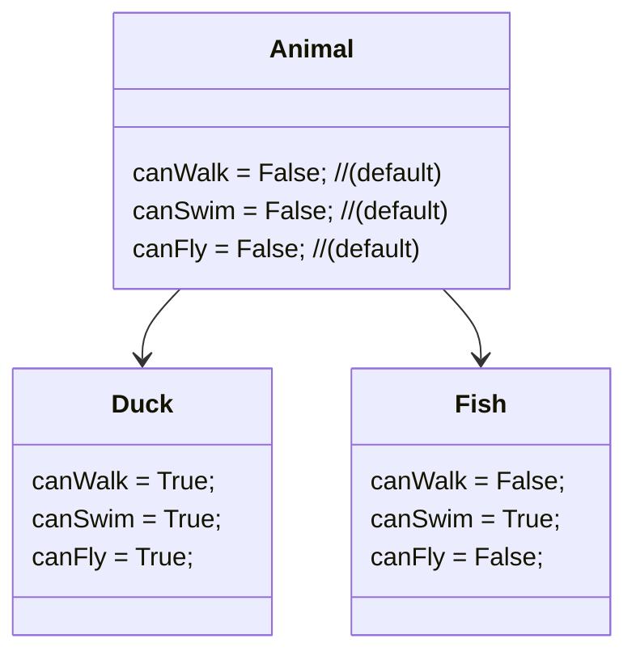

<details> <summary>Table of Contents 🔖</summary>

- [Object-oriented Programming - OOP #](#object-oriented-programming---oop-)
  - [Concepts](#concepts)
    - [Language Support](#language-support)
    - [Benefits and Advantages](#benefits-and-advantages)
  - [Core OOP Principles](#core-oop-principles)
    - [Abstraction](#abstraction)
    - [Encapsulation](#encapsulation)
    - [Inheritance](#inheritance)
    - [Polymorphism](#polymorphism)
      - [Compile-time Polymorphism](#compile-time-polymorphism)
      - [Runtime Polymorphism](#runtime-polymorphism)

</details>

---

# Object-oriented Programming - OOP [#](https://www.youtube.com/watch?v=Ej_02ICOIgs)

## Concepts
There's two big branches in programming, they're called Programming Paradigms.
> Paradigm is a way/method to do some task. A programming paradigm is a style/way of programming and not referring to a specific language.
> by [Gopi Gorantala](https://dev.to/ggorantala/functional-programming-and-programming-paradigms-in-java-323f)


And as you can see (*if the image was not removed*) OOP belongs to the Imperative Paradigm, but what does it mean?
>  **Imperative programming** is a [programming paradigm](https://en.wikipedia.org/wiki/Programming_paradigm "Programming paradigm") of software that uses statements that change a program's state. In much the same way that the imperative mood in natural languages expresses commands, an imperative program consists of commands for the computer to perform. Imperative programming focuses on describing _how_ a program operates step by step.
>  *Jain, Anisha (2022-12-10). ["Javascript Promises— Is There a Better Approach?"](https://medium.datadriveninvestor.com/javascript-promises-is-there-a-better-approach-dd6a0a329131). Medium. Retrieved 2022-12-20.*

Object-Oriented Programming (OOP) ==is designed around **objects** – self-contained entities that bundle data and behaviour==. Instead of writing one long list of instructions, developers define **classes** (blueprints) and create **objects** (instances) that interact to perform the program's tasks. These objects mirrors real-world systems by breaking complex problems into smaller pieces and blocks.

Throughout, we'll highlight *why* OOP is so widely used in modern software development by correlating its principles with real-world development practices such as code reuse, modular design, and adaptability to change.
### Language Support
OOP is supported (to varying degrees) by many popular programming languages such as Python, Java, C++, C#, Ruby, and JavaScript.

### Benefits and Advantages
Improved code organization, reuse, and maintainability. By following OOP principles, teams can build modular programs that are easier to extend and reason about, which is crucial for large or evolving codebases.

## Core OOP Principles
At its core, OOP revolves around a few **basic principles** – commonly listed as **abstraction, encapsulation, inheritance,** and **polymorphism**.

### Abstraction 
The Objects translate to a imaginable entity that have an Identity, Characteristics and can perform actions. With this is possible to (*“ignore the details”*) ==**hide the complexity by focusing on the essential features of an object** relevant to the context==.
The first one gives the recognition of a unique element in the code. The characteristics are the atributes of the Object and, the actions are the methods of the Object.
> e.g. a bank account
```js
class Account {
	// attributes
	constructor() {
		this.id = 001;
		this.user = '...';
		this.agency = '...';
		this.balance = 1000.0; // private attribute
	}
	// public methods
	deposit(...) {...}
	withdraw(...) {...}
}
```

This `constructor` element (*the syntax changes from each programming language*) has the built-in attributes that define the object, it can receive methods too, but this is just a representation.

### Encapsulation
This principle refers to bundling data with the methods that operate on that data, this means that ==**all important information is contained inside an object and only select information is exposed**==.
The implementation and state (fields/properties/attributes) of each object are privately held inside a defined class. Other objects do not have access to this class or the authority to make changes. They are only able to call a list of public functions or methods, the behaviour.
This leads to better data integrity, when the object acts as a single unit with clear role, relating with the **S** letter – Single Responsibility Principle (SRP), of the [SOLID](solid.md) acronym.

### Inheritance 
==A class can be created from another, thus receiving its information==. When this happens, we say that the new Object is a child of the previous one, receiving the characteristics of the "parent" by inheritance. Note that this newly attributes belongs now to the "child", so it may have be different from other "brothers" and even the "parent".


```mermaid
classDiagram
	Animal --> Duck
	Animal --> Fish
	
	class Animal {
		canWalk = False; // (default)
		canSwim = False; // (default)
		canFly = False;  // (default)
	}

	class Duck {
		canWalk = True;
		canSwim = True;
		canFly = True;
	}
	
	class Fish {
		canWalk = False;
		canSwim = True;
		canFly = False;
	}
```

In this example:
```js
class Duck extends Animal {...}
class Fish extends Animal {...}
```

This makes reusing and organizing code by establishing an “is-a” relationship between classes more easy, by promoting codebase reuse – common functionality is defined once in the base class and shared with all derived classes.

>[!NOTE]
> In languages like Java and C#, inheritance is **single-root** (each class has one parent, ultimately inheriting from a common base like Java’s `Object`[docs.oracle.com](https://docs.oracle.com/javase/specs/jls/se12/html/jls-1.html#:~:text=Reference%20types%20are%20the%20class,which)). **C++ allows multiple inheritance** (a class can inherit from several classes), though this adds complexity and potential pitfalls like the **“diamond problem”.**

Also many languages mitigate this by offering *interfaces or mixins* ([django-mixins](../Languages/Python/Django/django-mixins.md)) – allowing a class to implement multiple sets of behaviors without multiple concrete inheritance. **Proper use of inheritance can make code more extensible:** new subclasses can be added to extend behavior with minimal changes to existing code (an application of the *Open-Closed Principle - OCP*, refer to [SOLID](solid.md)).

> [!WARNING]
> The misuse of inheritance (e.g. deep inheritance chains or inheriting just to reuse code where a different relationship is more appropriate) can lead to brittle designs. Modern best practices often advise to **favor composition over inheritance** for greater flexibility.

### Polymorphism 
 Means exactly "many forms" and allows different types of objects to pass through the same (and uniform) interface. This ==**grants the possibility that "child's" can have different behaviours of the "parents"**== typically via subclassing or interface implementation.


For example, if `Car` and `Bicycle` both inherit from `Vehicle` (or implement a `VehicleInterface`), you can write a function that takes a `Vehicle` reference and calls `vehicle.drive()` without caring whether it’s a Car or Bicycle. Each class implements `drive()` in its own way – this is called *dynamic dispatch* or *method overriding*. The correct method is called based on the actual object’s class at runtime (this is *subtype polymorphism*).

Another form is *parametric polymorphism* (generics or templates) where the same class or function can operate on many types. The key benefit is **flexibility and extensibility**: polymorphism, especially via interfaces/abstract classes.

#### Compile-time Polymorphism
This is resolved during compilation and includes:
- **Function Overloading**: Multiple functions with the same name but different parameter types or counts.
```cpp
class Printer {
public:
    void print(int i) { std::cout << "Printing int: " << i << std::endl; }
    void print(double d) { std::cout << "Printing double: " << d << std::endl; }
};
```

- **Operator Overloading**: Defining custom behavior for operators with user-defined types
```cpp
class Complex {
public:
    double real, imag;
    Complex(double r, double i) : real(r), imag(i) {}
	
    Complex operator+(const Complex& other) {
        return Complex(real + other.real, imag + other.imag);
    }
};
```

> [!NOTE]
> Not all languages support compile-time polymorphism directly. For example, Python and JavaScript do not support true function overloading.

#### Runtime Polymorphism
Resolved during execution, typically via:
- **Virtual Functions**: In C++, a base class can declare a function as `virtual`, allowing derived classes to override it. Calls to the function on base class pointers will invoke the derived class implementation if overridden.
```cpp
class Animal {
public:
    virtual void speak() { std::cout << "Animal sound" << std::endl; }
};

class Dog : public Animal {
public:
    void speak() override { std::cout << "Bark" << std::endl; }
};

void makeSound(Animal* a) {
    a->speak(); // will call Dog::speak if a is Dog*
}
```

- **Method Overriding**: In Java, Python, C#, and others, a child class can override methods defined in a parent class to change behavior.
```python
# Parent class
class Animal:
    def speak(self):
        print("The animal makes a sound")

# Child class
class Dog(Animal):
    # Overriding the speak method
    def speak(self):
        print("The dog barks")

# Another child class
class Cat(Animal):
    # Overriding the speak method
    def speak(self):
        print("The cat meows")

# Usage
animal = Animal()
dog = Dog()
cat = Cat()

animal.speak()  # Output: The animal makes a sound
dog.speak()     # Output: The dog barks
cat.speak()     # Output: The cat meows
```
