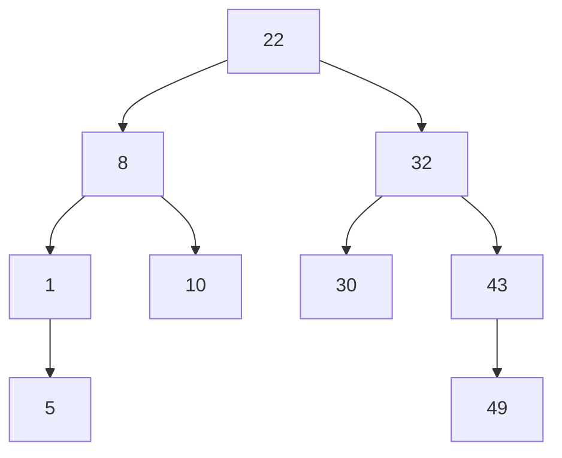

<details> <summary>Table of Contents</summary>

- [Intro](#intro)
- [Operations](#operations)
- [Types of Tree](#types-of-tree)
	- [Binary Tree #](#binary-tree-)
	- [Binary Search Trees](#binary-search-trees)
- [A **real-world** example is...](#a-real-world-example-is)
- [References](#references)

</details>

---

# Intro

A Tree, is a data structure that stores strings as data items that can be organized in a visual graph.

# Operations
> `h` as tree height 
- Create new tree `O(1)`
- Insert `O(h)` / `O(log h)`
- Seach `O(h)` / `O(log h)`
- Peek() `O(1)`
- Traverse
	- inorder `O()` (left > root > ritght)
	- preorder `O()` (root > left > right) 
	- prostorder `O()` (left > right > root)
- Remove `O(h)`
	1.  No subtree (no children): This one is the easiest one. You can simply just delete the node, without any additional actions required.
	2.  One subtree (one child): You have to make sure that after the node is deleted, its child is then connected to the deleted node's parent.
	3.  Two subtrees (two children): You have to find and replace the node you want to delete with its inorder successor (the leftmost node in the right subtree).`O()`
- Reverse `O(h)`

# Types of Tree

1.  [Binary Tree](#binary-tree) [#](https://www.programiz.com/dsa/binary-tree)
2.  [Binary Search Tree (BST)](#search-trees) [#](https://www.programiz.com/dsa/binary-search-tree)
3.  Adelson-Velsky and Landis - AVL Tree [#](https://www.programiz.com/dsa/avl-tree)
4.  B-Tree [#](https://www.programiz.com/dsa/b-tree)

## Binary Tree [#](https://www.techtarget.com/searchdatamanagement/definition/tree-structure)

<details> <summary>Implementations</summary>

[`C`](../Languages/C/binary_tree_implementation.md) | [`Python`](../Languages/PYTHON/binary_tree_implementation.md) | [`JavaScript`](../Front_End/JS/binary_tree_implementation.md)

</details>

A tree stores a collection of items in an abstract, hierarchical way. 
**The elements of a Tree are Nodes, the path between Nodes are Edges**. The first Node is called **Root Node**.
The Node located above other is called *Parent Node*, and the last Nodes, with no *children* are called *Leaf Nodes*.

In terms of size, the **Height** of a Tree is the distance between the Root and the farest Leaf. The **Node Size** is the distance starting from the Node to the last children.

The Tree is Binary if each Node has a maximum of two children, as shown in the image below.


> A binary search tree is a set of nodes where each has a value and can point to two child nodes.

## Binary Search Trees 

<details> <summary>Implementations</summary>

[`C`](../C/bst_implementation.md) | [`Python`](../PYTHON/bst_implementation.md) | [`JavaScript`](../Front_End/JS/bst_implementation.md)

</details>

In order to implement a Search Tree, the Nodes must follow a pathern: **the Nodes in the left must have a key value less than the Nodes located in the right positions**.



There're two types of BST:


To insert and element in the Tree `i.e.` a Node (`index = 0`) in the above structure:
1. `0 < 22 ? left : right`
2. `0 < 8 ? left : right`
3. `0 < 1 ? left : right`
4. as `1` don't have nodes in the `left`:
	```mermaid
	graph TD

	22 --> 8
	22 --> 32

	8 --> 1
	8 --> 10

	1 --> 0
	1 --> 5

	32 --> 30
	32 --> 43

	43 --> 49
	```

# A **real-world** example is...
- Trees
	- **File system:** The files and folders in your windows explorer are stored in the tree format.
	- **Webpage Layout**: The layout of a webpage is designed in the tree structure. 
- BInary Trees 
	- **Decision Tree – Machine learning Algorithm**: is used both in the case of a classification or regression-based problem.
	- **Working with Morse Code**: The organization of Morse code is done in the form of a binary tree.
	- **Binary Expression Trees**: used to evaluate an math expression.
- BST
	-   Used to efficiently store data in the sorted form to quickly access and search stored elements.
	-   Given ‘A’ a sorted array, determine how many times x occurs in ‘A’.
	-   Player ‘A’ chooses a secret number `n`. Player ‘B’ can guess a number `x` and A replies how `x`
	-   compares to `n` (equal, larger, smaller). What’s an efficient strategy for B to guess `n`?
- AVL-trees
	-   In-memory sorts of sets and dictionaries
	-   Database applications that require frequent lookups for data
- B-Trees
	-   Databases and file systems
	-   Multilevel indexing
	-   For quick access to the actual data stored on the disks
	-   To store blocks of data

---

# References

- https://www.techtarget.com/searchdatamanagement/definition/tree-structure
- https://www.programiz.com/dsa/binary-tree
- https://en.wikipedia.org/wiki/Tree_(data_structure)