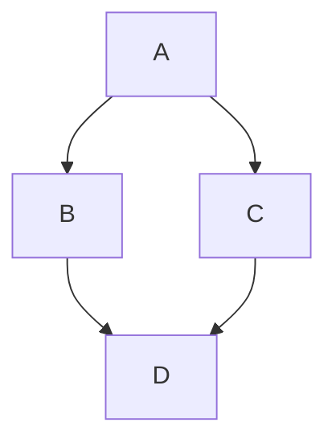

<details> <summary>Table of Contents 🔖</summary>

- [Method Resolution Order (MRO): A Language-Agnostic Deep Dive](#method-resolution-order-mro-a-language-agnostic-deep-dive)
  - [Introduction](#introduction)
  - [Why MRO Matters](#why-mro-matters)
  - [The Diamond Problem](#the-diamond-problem)
  - [Language Comparisons](#language-comparisons)
    - [🐍 Python (C3 Linearization)](#-python-c3-linearization)
    - [☕ Java (Single Inheritance + Interfaces)](#-java-single-inheritance--interfaces)
    - [🦀 Rust (Traits \& Explicit Dispatch)](#-rust-traits--explicit-dispatch)
    - [C++ (Multiple Inheritance)](#c-multiple-inheritance)
  - [MRO in Practice](#mro-in-practice)
    - [What to watch for:](#what-to-watch-for)
  - [Related Concepts](#related-concepts)
    - [Linearization](#linearization)
    - [Super() Call Semantics](#super-call-semantics)
    - [Polymorphism](#polymorphism)
    - [Interface vs Implementation Inheritance](#interface-vs-implementation-inheritance)
  - [Design Insights](#design-insights)
- [References](#references)

</details>

---

# Method Resolution Order (MRO): A Language-Agnostic Deep Dive

## Introduction
**Method Resolution Order (MRO)** is the sequence in which methods are looked up when a class inherits from multiple classes. This mechanism is crucial in resolving **ambiguity**, especially in **multiple inheritance** hierarchies. MRO determines _which method gets called first_ when a method exists in more than one parent class.

Understanding MRO helps prevent hard-to-debug behavior and ensures consistent, predictable object-oriented design.

## Why MRO Matters
When using inheritance in object-oriented programming, especially **multiple inheritance**, it's common for different parent classes to define the same method. Without a well-defined MRO:
- Conflicts arise over which method to use.
- Maintenance becomes harder as code scales.
- Superclass logic can be unintentionally overridden.

## The Diamond Problem
Consider the classic **diamond inheritance (problem**:


- Class `B` and `C` inherit from `A`.
- Class `D` inherits from both `B` and `C`.

If `A` defines a method `do_something()`, which version does `D` inherit? The MRO determines this.

## Language Comparisons

### 🐍 Python (C3 Linearization)
Python uses the **C3 linearization algorithm** ([more here](https://en.wikipedia.org/w/index.php?fulltext=1&search=C3+linearization&title=Special%3ASearch&ns0=1)),
which:
- Preserves local precedence order.
- Ensures monotonicity.
- Merges parent MROs while keeping the derived class closer.

```python
class A: pass
class B(A): pass
class C(A): pass
class D(B, C): pass

print(D.__mro__)
# Output: (<class '__main__.D'>, <class '__main__.B'>, <class '__main__.C'>, <class '__main__.A'>, <class 'object'>)
```
> **Insight**: Python avoids ambiguity by traversing parents **left-to-right** and applying C3 rules to keep inheritance predictable.

### ☕ Java (Single Inheritance + Interfaces)
Java does **not** support multiple class inheritance but does allow implementing multiple interfaces. Method conflicts are resolved by:
- Prioritizing the most specific class in the hierarchy.
- Requiring manual override if multiple interfaces define the same default method.

```java
interface A { default void greet() { System.out.println("A"); } }
interface B { default void greet() { System.out.println("B"); } }

class C implements A, B {
    public void greet() { A.super.greet(); } // Must resolve explicitly
}
```
> **Insight**: Java pushes responsibility to the developer when multiple interfaces define the same method.

### 🦀 Rust (Traits & Explicit Dispatch)
Rust avoids inheritance entirely in favor of **traits**. If multiple traits define methods with the same name, **explicit disambiguation** is required.

```rust
trait A { fn say() { println!("A"); } }
trait B { fn say() { println!("B"); } }

struct MyStruct;

impl A for MyStruct {}
impl B for MyStruct {}

fn main() {
    A::say(&MyStruct); // Must specify trait
}
```
> **Insight**: Rust avoids MRO complexities by **removing implicit method resolution** entirely.

### C++ (Multiple Inheritance)
C++ supports multiple inheritance and uses **depth-first, left-to-right** order, unless `virtual` inheritance is specified.

```cpp
class A { public: void say() { cout << "A"; } };
class B: virtual public A {};
class C: virtual public A {};
class D: public B, public C {};

D obj;
obj.say(); // Ambiguity avoided due to virtual inheritance
```
> **Insight**: C++ allows multiple inheritance but introduces **virtual inheritance** to solve the diamond problem explicitly.

## MRO in Practice

### What to watch for:
- **Ambiguity**: If two parent classes define the same method, MRO determines which one wins.
- **Order of inheritance**: In Python and C++, the order matters.
- **Explicit resolution**: In Rust and Java, developers must choose.
- **Design caution**: Overusing multiple inheritance can create tightly coupled and brittle hierarchies.

## Related Concepts

### Linearization
How a class hierarchy is "flattened" into a linear list (Python C3 is a form of this).

### Super() Call Semantics
Languages like Python and Java allow `super()` to refer to the next class in MRO.

### Polymorphism
The use of MRO is deeply connected to **runtime polymorphism** ([OOP](OOP.md)), where the actual method executed depends on the object’s class.

### Interface vs Implementation Inheritance
Languages like Java and Go favor interfaces to reduce inheritance complexity.

## Design Insights
- Use **[composition over inheritance](inheritance-vs-composition.md)** when possible.
- When using multiple inheritance:
    - Be aware of how your language resolves methods.
    - Document base class responsibilities.
    - Avoid deep or wide inheritance trees.

---

# References
1. Python documentation on MRO: [https://docs.python.org/3/glossary.html#term-method-resolution-order](https://docs.python.org/3/glossary.html#term-method-resolution-order)
2. Java documentation on interfaces: [https://docs.oracle.com/javase/tutorial/java/IandI/defaultmethods.html](https://docs.oracle.com/javase/tutorial/java/IandI/defaultmethods.html)
3. C++ Virtual Inheritance - [https://en.cppreference.com/w/cpp/language/virtual_inheritance](https://en.cppreference.com/w/cpp/language/virtual_inheritance)
4. Rust Traits - [https://doc.rust-lang.org/book/ch10-02-traits.html](https://doc.rust-lang.org/book/ch10-02-traits.html)
5. Python C3 Linearization - [https://www.python.org/download/releases/2.3/mro/](https://www.python.org/download/releases/2.3/mro/)
6. “Super Considered Harmful?” - [https://fuhm.net/super-harmful/](https://fuhm.net/super-harmful/)
7. “Inheritance Is the Base Class of Evil” (James O. Coplien) – on object design patterns.
