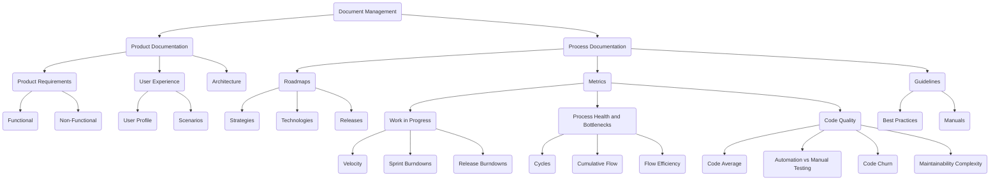

# 12 Principles of the Agile Manifesto

1. Our highest priority is to satisfy the customer through early and continuous delivery of valuable software.
   

2. Welcome changing requirements, even late in development. Agile processes harness change for the customer's competitive advantage.
   

3. Deliver working software frequently, with a preference for the shorter timescale.
   

4. Business people and developers must work together daily throughout the project.
   

5. Build projects around motivated individuals. Give them the environment and support they need, and trust them to get the job done.

6. The most efficient and effective method of conveying information to and within a development team is face-to-face conversation.

7. Working software is the primary measure of progress.
   

8. Agile processes promote sustainable development. The sponsors, developers, and users should be able to maintain a constant pace indefinitely.

9. Continuous attention to technical excellence and good design enhances agility.

10. Simplicity – the art of maximizing the amount of work not done – is essential.
    

11. The best architectures, requirements, and designs emerge from self-organizing teams.
    

    > The architecture of the product, which is the underlying structure and approach to delivering the product, emerges along with the delivery of features. Adhering to this principle means the team doesn't disappear for six months while figuring out the best long-term architecture. Instead, team members decide the best way to build the product as they create it.

12. At regular intervals, the team reflects on how to become more effective, then adjusts its behavior accordingly.
    

## Conclusion
Revisiting the manifesto regularly is a useful exercise for teams as an additional layer of accountability. If you're wondering how your team can better embody these agile principles, discuss it at the next [Sprint Retrospective](https://www.scrum.org/resources/blog/ideas-scrums-sprint-retrospective-event).

One way to do this is by putting the 12 agile principles on a shared whiteboard. Then, ask Scrum Team members to brainstorm how to better incorporate these principles into their work and interactions with the parent organization or business stakeholders. Then, vote on one or two actionable improvements and implement them as quickly as possible.

# [Software Planning and Technical Documentation](https://www.youtube.com/watch?v=2qlcY9LkFik)

1.	Product Documentation
    1.	Product Requirements
        1.	Functional (user capabilities)
        2.	Non-Functional (product capabilities)
    2.	User Experience (UX - User profile and needs)
    3.	Architecture
        1.	Interface
        2.	Business Logic
        3.	Database
    
    > from [AltexSoft](https://www.youtube.com/@AltexSoft)

    4.	Testing Plans (assigning responsible parties for each case and the cases themselves)
        1.	Test Cases (description of how each feature should be tested)

    
    > from [AltexSoft](https://www.youtube.com/@AltexSoft)

2.	Process Documentation
    1.	Roadmap (Gantt Chart)
        1.	Strategy
        2.	Technologies
        3.	Releases
    2.	Metrics
	 
    > from [AltexSoft](https://www.youtube.com/@AltexSoft)
    
     3.	Guidelines
        1.	Best Practices
        2.	Manuals

---

# Software Design Document Template
> Made by [ArjanCodes © 2023](https://www.arjancodes.com/designguide)

## About 

-   What is the software application or feature? 
-   Who’s it intended for? 
-   What problem does the software solve? 
-   How is it going to work? 
-   What are the main concepts that are involved and how are they related?

> When you define what a software application or feature does, what concepts are involved and how everything is related, I often follow a “zoom out and zoom in” approach. As a first step, I try to think as broadly as possible about the software and what it would entail (“zoom out”). The funny thing that I’ve noticed over the years is that as I’ve become a more experienced software designer and developer, I’m spending more and more time in this conceptual stage, and less time implementing it. The implementation almost becomes an afterthought: it’s simply the final step of translating the concepts and relationships that I wrote down into code that a computer can understand and run. After zooming out, you need to zoom in again. What should we do first? Are there parts we can delay building? What’s the low hanging fruit? How does the order of building things impact the complexity of the work? Are there parts we should build first so we can test everything quicker, leading to more efficient development later? 

## User Interface

-   What are the main user stories (happy flows + alternative flows)?
-   If you’re adding a new feature to an existing software application, what impact does the feature have on the overall structure of the interface? (are there big changes in the organization of menus, navigation, and so on?) 

> You can also provide UI mockups or wireframes here as a part of the user stories to clarify what the flows are going to look like. When I design software, I always must remind myself that I’m doing this for someone else, not for me to pat myself on the back for finding such a nice design. What you design must make sense to the user. Sometimes, that means you need to introduce an extra concept to clarify how your system works. And sometimes the most generic solution is not the best solution for the user. 
 
## Technical Specification

-   What technical details need developers to know to develop the software or new feature?
-   Are there new tables to add to the database? What fields?
-   How will the software technically work? Are there particular algorithms or libraries that are important?
-   What will be the overall design? Which classes are needed? What design patterns are used to model the concepts and relationships?
-   What third-party software is needed to build the software or feature? 4 

> You can use UML to draw out the main classes that will be added and how they fit into the rest of the system. When you design your classes and methods, consider design principles such as SOLID. Design principles are the foundation of software design. Going through all of the principles is out of scope for this document, but I have several videos on my YouTube channel where I talk about them, so check those out if you’re not yet comfortable with the principles. On top of the principles are the design patterns, which are standardized solutions to particular software design problems. There are also quite a few videos about those on my channel. This is also a good section to describe specific edge cases that you want the system to handle correctly, for example what should happen in case of a network connection error.

## Testing and Security

-   Are there specific coverage goals for the unit tests?
-   What kinds of tests are needed (unit, regression, end-to-end, etc)?
-   (new feature only) Are there any potential side-effects on other areas of the application when adding this feature?
-   What security checks need to be in place to allow the software to ship?
-   (new feature only) How does the feature impact the security of the software? Is there a need for a security audit before the feature is shipped? 

> Everybody always talks about how important testing is. One of the main reasons people mention is that it helps you find bugs and produce better, more reliable code. That’s part of it, 5 but there’s a way more important reason to make testing part of how you operate though: by designing and writing code that is easy to test, you develop a tester’s mindset. A mindset that every piece of code potentially breaks something. A mindset that takes edge cases into account by default. If you adopt this mindset, you’ll start to automatically organize your code such that edge cases are handled almost automatically. Design interfaces, classes and methods in such a way that they nudge the users into following the happy flow. For example, suppose you’re writing a function that retrieves users from your database with a particular role. You could use a string argument to specify the name of the role. The problem is that you open the possibility of calling that function with roles that don’t exist. And then you’d have to write extra code to handle that edge case, as well as extra tests to make sure you are actually handling it correctly. Another option is to use an Enum instead. Then, you’re relying on the typing system to handle the edge case for you, saving you a lot of extra work. Write your tests with the assumption that you’re going to change things during your development process: don’t focus too much on reaching 100% test coverage in the beginning but focus on getting a basic version of the feature done so you can evaluate whether this is really what you or your users want. In fact, assume that every line of code you write you’re going to throw away at some point: don’t get attached to the code you write.

## Deployment

-   Are there any architectural or DevOps changes needed (e.g. adding an extra microservice, changes in deployment pipelines, adding secrets to services)?
-   Are there any migration scripts that need to be written? 

Especially if you create a tool that runs in the cloud, it’s useful to have some kind of staging environment that closely mimics the production environment. In my company, we have four different environments (this is also called a DTAP street):
    
-   Develop: this is normally the version of the code running on your local development machine.
-   Test: this is a version of the application that runs in the cloud, similar to the production environment.
-   Acceptance (also called Staging): version of the application that runs in the cloud, as close as possible to the production environment, often using a copy of the production database.
-   Production: the actual production environment. My team and I use the Develop version on our local machines for actual feature development. The Test version is used to make sure the feature we build works in the cloud (often, things break because of issues with configuration, connection with other services, and so on). The Acceptance version is only used to do final tests before releasing a new version. Here we verify that existing users will still be able to log in and have access to their data.

## Planning

-   How much time will developing the software or feature cost?
-   What are the steps and how much time does step take?
-   What are the developmental milestones and in what order?
-   What are the main risk factors and are there any alternative routes to take if you find out something isn’t feasible?
-   What parts are absolutely required, and what parts can optionally be done at a later stage? (i.e. the Definition of Done) 

Especially if you’re a beginning developer, it’s hard to estimate how much time developing a piece of software takes. You will get better at this after doing it a couple of times. What helps me is first figuring out what the main risk factors are. For example, if you want to add a feature that allows users to integrate your app with Microsoft Teams, the main risk factor is the process of building the actual integration code (which will probably reside partly in the Teams App store), and not the user interface additions in your app to set it up. The more risk factors you have in the software design, the more time you need to reserve for nasty surprises.

## Broader Context

-   What are limitations of the current design?
-   What are possible extensions to think about for the future?
-   Any other considerations? 

> Whenever I design software, I always like to include a few “moonshot” ideas: “It would be really cool if the software could also do X”. The reason this is useful is that this puts you in a very open mindset that sometimes leads to new insights. Also, when you’re developing the software, it’s possible that you get an epiphany that allows you to add one of these moonshot ideas. It’s really awesome when that happens!