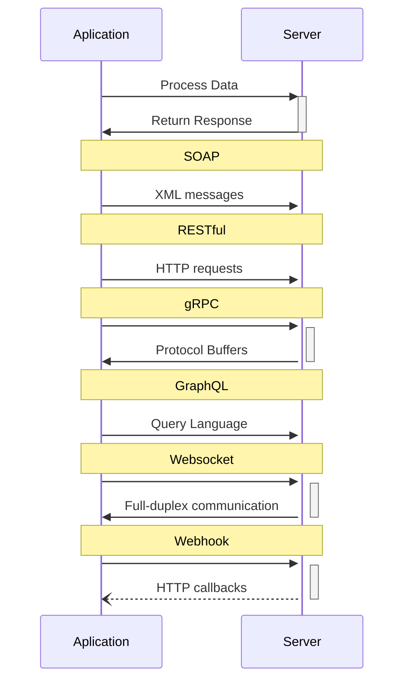

<details> <summary>Table of Contents 🔖</summary>

- [NEW INFO (#to\_review) # Application Architecture](#new-info-to_review--application-architecture)
    - [A developer's perspective](#a-developers-perspective)
    - [A user's perspective](#a-users-perspective)
    - [Scaling our server](#scaling-our-server)
    - [Logging and Metrics](#logging-and-metrics)
    - [Alerts](#alerts)
  - [Closing Notes](#closing-notes)
- [What is software architecture?](#what-is-software-architecture)
- [Some software srchitecture concepts](#some-software-srchitecture-concepts)
  - [What's the Client-server Model?](#whats-the-client-server-model)
  - [What are APIs?](#what-are-apis)
  - [What is Modularity?](#what-is-modularity)
- [Structuring a new software application](#structuring-a-new-software-application)
  - [Abstractions](#abstractions)
  - [Behaviour](#behaviour)
  - [OOD Realtionships](#ood-realtionships)
  - [Physical Mapping](#physical-mapping)
  - [Code / Test](#code--test)
- [What's Your Infrastructure Like?](#whats-your-infrastructure-like)
  - [Monolithic Architecture](#monolithic-architecture)
  - [Microservices Architecture](#microservices-architecture)
    - [What is back-end for front-end (BFF)?](#what-is-back-end-for-front-end-bff)
    - [How to use load balancers and horizontal scaling](#how-to-use-load-balancers-and-horizontal-scaling)
- [Where Your Infrastructure Lives](#where-your-infrastructure-lives)
  - [On-Premise Hosting](#on-premise-hosting)
  - [Traditional Server Providers](#traditional-server-providers)
  - [Hosting on the Cloud](#hosting-on-the-cloud)
    - [Traditional](#traditional)
    - [Elastic](#elastic)
    - [Serverless](#serverless)
    - [Lots of other services](#lots-of-other-services)
- [Different Folder Structures to Know](#different-folder-structures-to-know)
  - [All in One Place Folder Structure](#all-in-one-place-folder-structure)
  - [Layers Folder Structure](#layers-folder-structure)
  - [MVC Folder Structure](#mvc-folder-structure)
- [References](#references)

</details>

---

> [!QUOTE]
> If you 're a software architect who was never programmed is kinda like a priest in a wedding, he performs the service but he can only imagine what comes next.
> -*Ron Kleinman*

# NEW INFO (#to_review) # Application Architecture

In this high-level overview, we'll explore the architecture of a production-grade application. This will serve as a foundation for the rest of the course, allowing us to delve into each component in more detail later on.

Within a production application architecture, various components work together to create a robust system. While we'll provide a brief introduction to these components here, we'll cover each one extensively in separate chapters throughout the course.

___

### A developer's perspective

We can start viewing this application architecture from the perspective of a developer, which will be familiar to most of you. Developers write code that is **deployed** to a **server**. For now, let's define a **server** as a computer that handles requests from another computer. This server also requires **persistent storage** to store the application's data. A server may have built-in storage, but that has its limitations in terms of size. As such, a server may talk to an external storage system (database, cloud etc). This storage may not be part of the same server, and is instead connected through a **network**.

### A user's perspective

A user is someone who makes a request from the server, usually through a web browser. In this case, the web browser is the **client** to whom the server responds to.

If a user wanted to use a front-end feature, the server will respond with the necessary JavaScript/HTML/CSS code, compiled to display what the user requested. But, what if we have a lot of users and the single server cannot handle all of the requests on its own? There is bound to be a bottleneck, either through our RAM or our CPU. To maintain performance while dealing with multiple users, we will need to scale our server.

### Scaling our server

To handle multiple requests, it might be a good idea to add more RAM or upgrade to a CPU with more cores and higher clocking speed. However, every computer has a limitation in terms of upgrades. Upgrading components _within_ the same computer is referred to as **vertical scaling**.

We can also have multiple servers running our code, and we can distribute the user requests among these servers. This way, not all users are talking to one server, which ensures that the speed of each server remains intact. This also ensures that if one server were to go down, we can direct our traffic to one of our other servers. This is known as **horizontal scaling**.

Generally, in large systems, we prefer horizontal scaling, as it is much more powerful, and can be achieved with commodity hardware (i.e., relatively inexpensive, standard hardware). However, it also requires much more engineering effort, as we need to ensure that the servers are communicating with each other, and that the user requests are being distributed evenly.

For simple applications however, vertical scaling may be sufficient and the easier solution to implement. Even some services within [Amazon Prime Video](https://www.primevideotech.com/video-streaming/scaling-up-the-prime-video-audio-video-monitoring-service-and-reducing-costs-by-90) were recently migrated from a microservice architecture to a monolithic architecture.

> But with multiple servers, what determines which requests go to which server? This is achieved through a **load balancer**. A load balancer will evenly distribute the incoming requests across a group of servers.

It's also important to remember that servers don't exist in isolation. It is highly likely that servers are interacting with external servers, through APIs. For example, the neetcode.io website interacts with other services like Stripe, through an API.

### Logging and Metrics

Servers also have **logging** services, which gives the developer a log of all the activity that happened. Logs can be written to the same server, but for better reliability they are commonly written to _another_ external server.

This gives developers insight into how the requests went, if any errors occured, or what happened before a server crashed. However, logs don't provide the complete picture. If our RAM has become the bottleneck of our server, or our CPU resources are restricting the requests being handled efficiently, we require a **metrics** service. A metric service will collect data from different sources within our server environment, such as CPU usage, network traffic etc. This allows developers to gain insights into server's behavior and identify potential bottlenecks.

### Alerts

As developers, we wouldn't want to keep checking metrics to see if any unexpected behavior exhibits itself. This would be like checking your phone every 555 minutes for a notification. It is more ideal to receive a push notification. We can program alerts so that whenever a certain metric fails to meet the target, the developers receive a push notification. For example, if 100%100\\%100% of the user requests receive successful responses, we could set an alert to be notified if this metric dips under 95%95\\%95%.


> The visual above demonstrates (on a very high level) how the components interact with each other, and what components the users interacts with and what components the developer interacts with.

## Closing Notes

What we discussed above is a gentle introduction, and there is a lot more that goes into application architecture than what we just talked about. For example, how do all of these components communicate with each other. What protocols do they need to abide by? Are there ways to optimize these protocols? These components could very well be scattered across different computers, so networking is required. We will discuss all this in detail in the upcoming chapters.

---

# What is software architecture?

According to [this source](https://www.sei.cmu.edu/our-work/software-architecture/):

> The software architecture of a system represents the design decisions related to overall system structure and behaviour.

That's quite generic, right? Absolutely. And that's exactly what used to confuse me so much when researching about software architecture. It's a topic that encompasses a lot and the term is used to talk about many different things.

The simplest way I can put it is, software architecture refers to how you organize stuff in the process of creating software. And "stuff" here can refer to:

-   **Implementation details** (that is, the folder structure of your repo)
-   **Implementation** **design** decisions (Do you use server side or client side rendering? Relational or non-relational databases?)
-   The **technologies** you choose (Do you use REST or GraphQl for your API? Python with Django or Node with Express for your back end?)
-   **System** **design** decisions (like is your system a monolith or is it divided into microservices?)
-   **Infrastructure** decisions (Do you host your software on premise or on a cloud provider?)

In order to materialize these principles, the architect uses a documentation model called [Unified Modeling Language - UML](https://en.wikipedia.org/wiki/Unified_Modeling_Language). The one that realy matter are the one that don't document what you thought but actually help you think about the problem. 
Another big benefit of using UML is that is easy comprehensible to everyone within the project.

That's a lot of different choices and possibilities. And what complicates this a tiny bit more, is that within these 5 divisions, different patterns can be combined. Meaning, I can have a monolith API that uses REST or GraphQL, a microservices-based app hosted on-premise or on the cloud, and so on.

To better explain this mess, first we're going to explain some basic generic concepts. And then we're going to go through some of these divisions, explaining the most common architecture patterns or choices used nowadays to build apps.


# Some software srchitecture concepts

## What's the Client-server Model?


**Client-server** is a model that structures the tasks or workloads of an application between a resource or service **provider** (server) and a service or resource requester (client).

Put simply, the client is the application that requests some kind of information or performs actions, and the server is the program that sends information or performs actions according to what the client does.

We can imagine as a portal, from yours (the client) side, is the front-end: applications that run either on the web or mobile apps (although other platforms exist too and back-end applications can act as clients as well). In the other side of the Network there's the back-end where, servers are "located".

To illustrate this with an example, imagine you're entering your favorite social network. When you enter the URL on your browser and hit enter, your browser is acting as the client app and **sending a request** to the social network server, which **responds** by sending you the content of the website.

Most applications nowadays use a client-server model. The most important concept to remember about it is that **clients request resources or services** that **the server delivers (serves)** and that's why the name.

Another important concept to know is that clients and servers are part of the same system, but each is an application/program on its own. Meaning they can be developed, hosted, and executed separately.

> If you're not familiar with the difference between front and back ends, [here's a cool article that explains it](https://www.freecodecamp.org/news/frontend-vs-backend-whats-the-difference/). And here's [another article](https://www.freecodecamp.org/news/how-the-web-works-part-ii-client-server-model-the-structure-of-a-web-application-735b4b6d76e3/) that expands upon the concept of client-server.

## What are APIs?

We just mentioned that clients and servers are entities that communicate with each other to request things and respond to things. The way in which these two parts usually communicate is through an API (application programming interface).

An API is nothing more than a set of defined rules that establishes how an application can communicate with another. It's like a contract between the two parts that says "If you send A, I'll always respond B. If you send C, I'll always respond D..." and so on.

Having this set of rules, the client knows exactly what it has to require in order to complete a certain task, and the server knows exactly what the client will require when a certain action has to be performed.

There're different ways in which an API can be implemented. Some of them:



Regarding how APIs communicate, most often the HTTP protocol or [HTTP Requests]() is used and the content is exchanged in JSON or XML format. But other protocols and content formats are perfectly possible.

> If you'd like to expand upon this topic, [here's a nice article](https://www.freecodecamp.org/news/http-request-methods-explained/) for you to read.

## What is Modularity?

When we talk about "modularity" in software architecture, we refer to the practice of dividing big things into smaller pieces. This practice of breaking things down is performed to simplify big applications or codebases.

Modularity has the following advantages:

-   It's good for dividing concerns and features, which helps with the visualization, understanding, and organization of a project.
-   The project tends to be easier to maintain and less prone to errors and bugs when it's clearly organized and subdivided.
-   If your project is subdivided into many different pieces, each can be worked on and modified separately and independently, which is often very useful.

I know this sounds a bit generic, but modularity or the practice of subdividing things (micro-services!) is a very big part of what software architecture is all about. So just keep this concept in the back of your mind – it'll become more clear and apparent as we go through some examples. ;)

If you'd like a bit more info about this topic, I recently wrote [an article about the use of modules in JS](https://www.freecodecamp.org/news/modules-in-javascript/) that you might find useful.


# Structuring a new software application

Following the Feature Driven Design model, this are the main roles that will come in place during the development of an system:

- Domain Expert, the person or group that has the understanding the area that the program will be designed for.
- Software Architect (UML Artifacts)
- Software Architect/Designer (Data Store, Security)
- Software Developer/Programmer (Code)

The first step is to require direct interaction with the "Domain Expert" to identify and document the problem (requirements & constraints) that must be solved by the new system, i.e. define the project scope.

## Abstractions

With this information we can start to abstract the core elements, an academic schedule application will have *Students*, *Courses*, *Teachers* and so on. An important point is that the names of these abstractions have to be as clear as possible, in terms of referring to the project spec.

## Behaviour 

With the Objects, created after the abstractions, is time to study the relationship between them, and like a road that links a point A to point B, we need to specify the attributes of the elements (in the road example, the pavement type, the number of cars, the direction, etc). To jump into examples for different kinds of relationships, see:

- [_One-to-many relationships_](https://learn.microsoft.com/en-us/ef/core/modeling/relationships/one-to-many) (`1:N`), in which a single entity is associated with any number of other entities.
- [_One-to-one relationships_](https://learn.microsoft.com/en-us/ef/core/modeling/relationships/one-to-one) (`1:1`), in which a single entity is associated with another single entity.
- [_Many-to-many relationships_](https://learn.microsoft.com/en-us/ef/core/modeling/relationships/many-to-many) (`N:N`), in which any number of entities are associated with any number of other entities.


> *Ron Kleinman*

If you face objects that have similar concepts, common in a many-to-many relationship, how to avoid duplicating the come multiple times? **Use Design Patterns**, the objective is to reduce the many-to-many relationships as much as we could.

> Look for Collection and Junction Classes definitions

## OOD Realtionships

## Physical Mapping

## Code / Test


# What's Your Infrastructure Like?

Ok, let's get to the good stuff now. We'll start talking about the many different ways in which you can organize a software application, starting with how can you organize the infrastructure behind your project.

To make all this less abstract, we'll use an hypothetical app we'll call Notflix.🤔🤫🥸

Side comment: keep in mind this example might not be the most realistic one and that I'll be assuming/forcing situations in order to present certain concepts. The idea here is to help you understand core architecture concepts through an example, not to perform a real world analysis.

## Monolithic Architecture

So Notflix will be a typical video streaming application, in which the user will be able to watch movies, series, documentaries and so on. The user will be able to use the app in web browsers, in a mobile app, and on a TV app, too.

The main services included in our app will be **authentication** (so people can create accounts, login, and so on), **payments** (so people can subscribe and access the content... cause you didn't think this was all for free, right? 😑) and **streaming** of course (so people can actually watch what they're paying for).

A quick sketch of our architecture might look like this:


A classic monolithic architecture

At the left we have our three different front-end apps that will act as clients in this system. They might be developed with React and React-native, for example.

We have a single server that will receive requests from all three client apps, communicate with the database when necessary, and respond to each front-end accordingly. The back-end could be developed with Node and Express, let's say.

This kind of architecture is called a **monolith** because there's a single server application that is responsible for all the features of the system. In our case, if a user wants to authenticate, pay us, or watch one of our movies, all the requests are going to be sent to the same server application.

The main benefit of a monolithic design is its simplicity. The functioning of it and the set up required is simple and easy to follow, and this is why most applications start out in this way.

## Microservices Architecture

So turns out Notflix is totally rocking it. We just released the latest season of "Stranger thugs", which is an awesome science fiction series about teenage rappers, and our movie "Agent 404" (about a secret agent that infiltrates in a company simulating being a senior programmer but actually doesn't know a thing about code) is breaking all records...

We're getting tens of thousands of new users every month from all over the world, which is great for our business but not so much for our monolithic app.

Lately we've been experiencing delays in server response times, and even though we've **vertically scaled** the server (put more RAM and GPU into it) the poor thing just doesn't seem to be able to bear the load it's taking.

Moreover, we've kept developing new features into our system (such as a recommendation tool that reads the user's preferences and recommends movies that suit the user profile) and **our codebase is starting to look huge and very complex** to work with.

Analyzing this problem in depth, we've found the feature that takes the most resources is streaming, while other services such as authentication and payments don't represent a very big load.

To solve this problem, we'll implement a **microservices architecture** that will look something like this:


Our first microservices implementation

So if you're new to all this you might be thinking "what on earth is a microservice", right? Well, we could define it as the concept of dividing server side features into many small servers that are responsible for only one or a few specific features.

Following our example, before we only had a single server responsible for all features (a monolithic architecture). After implementing microservices we'll have a server responsible for authentication, another responsible for payments, another for streaming, and the last one for recommendations.

The client-side apps will communicate with the authentication server when a user wants to login, with the payments server when the user wants to pay, and with the streaming server when the user wants to watch something.

All **this communication happens through APIs** just like with a regular monolithic server (or through other communication systems like [Kafka](https://kafka.apache.org/) or [RabbitMQ](https://www.rabbitmq.com/)). The only difference is that now we have different servers responsible for different actions instead of a single one that does it all.

This sounds a bit more complex, and it is, but microservices offer us the following benefits:

-   You can **scale particular services as needed**, instead of scaling the whole back end at once. Following our example, when we started to experience performance issues we vertically scaled our whole server – but actually the feature that requested the more resources was only the streaming. Now that we have the streaming feature separated into a single server, we can scale only that one and leave the rest alone as long as they keep working right.
-   Features will be more **loosely coupled**, which means we'll be able to develop and deploy them independently.
-   The **codebase** for each server will be much smaller and **simpler**. Which is nice for the dev folks that have been working with us from the start, and also easier and quicker for new developers to understand.

Microservices is an architecture that is more complex to set up and manage, which is why it makes sense only for very big projects. Most projects will start out as monoliths and migrate to microservices only when needed for performance reasons.

If you'd like to know more about microservices, [here's a very nice explanation](https://www.youtube.com/watch?v=CdBtNQZH8a4).

### What is back-end for front-end (BFF)?

One problem that comes up when implementing microservices is that the communication with front-end apps gets more complex. Now we have many servers responsible for different things, which means front-end apps would need to keep track of that info to know who to make requests to.

Normally this problem gets solved by implementing an intermediary layer between the front-end apps and the microservices. This layer will receive all the front-end requests, redirect them to the corresponding microservice, receive the microservice response, and then redirect the response to the corresponding front-end app.

The benefit of the BFF pattern is that we get the benefits of the microservices architecture, without over complicating the communication with front-end apps.


Our BFF implementation

Here's a [video explaining the BFF pattern](https://www.youtube.com/watch?v=SSo-z16wEnc) if you'd like to know more about it.

### How to use load balancers and horizontal scaling

So our streaming app keeps growing and growing at an exponential rate. We have millions of users around the world watching our movies 24/7, and sooner than we expected we start experiencing performance issues again.

Once again we've found that the streaming service is the one under most stress, and we've **vertically scaled** that server all we could. Further subdividing that service into more microservices doesn't make sense, so we've decided to **horizontally scale** that service.

Before we mentioned that **vertically scaling** means adding more resources (RAM, disk space, GPU, and so on) to a single server/computer. **Horizontally scaling** on the other hand, means setting up more servers to perform the same task.

Instead of having a single server responsible for streaming we'll now have three. Then the requests performed by the clients will be balanced between those three servers so that all handle an acceptable load.

This distribution of requests is normally performed by a thing called a **load balancer**. Load balancers act as **[reverse proxys](https://www.strongdm.com/blog/difference-between-proxy-and-reverse-proxy#:~:text=A%20traditional%20forward%20proxy%20server,on%20behalf%20of%20multiple%20servers.)** to our servers, intercepting client requests before they get to the server and redirecting that request to the corresponding server.

While a typical client-server connection might look like this:


This is what we had before

Using a load balancer we can distribute client requests across multiple servers:


This is what we want now

You should know that horizontal scaling is also possible with databases as it's possible with servers. One way of implementing this is with a source-replica model, in which one particular source DB will receive all write queries and replicate it's data along one or more replica DBs. Replica DBs will receive and respond to all read queries.

The advantages of DB replication are:

-   Better performance: This model improves performance allows more queries to be processed in parallel.
-   Reliability and availability: If one of your database servers is destroyed or inaccessible for any reason, data is still preserved in other DBs.

So after implementing a load balancer, horizontal scaling and DB replication, our architecture might look like this:


Our horizontally scaled architecture

Here's [an awesome video explanation of load balancers](https://www.youtube.com/watch?v=sCR3SAVdyCc) if you're interested in knowing more.

Side comment: when we talk about microservices, load balancers, and scaling we're likely always talking about back-end apps. For front-end apps, they're mostly always developed as monoliths, though there's also a weird interesting thing called [micro-frontends](https://www.youtube.com/watch?v=w58aZjACETQ) as well.🧐

# Where Your Infrastructure Lives

Now that we have a basic idea of how an application infrastructure might be organized, the next thing to think about is where we're going to put all this stuff.

As we're going to see, there're mainly three options when deciding where and how to host an application: on premise, on traditional server providers, or on the cloud.

## On-Premise Hosting

On premise means you own the hardware in which your app is running. In the past this used to be the most traditional way of hosting applications. Companies used to have dedicated rooms for servers to be in and teams dedicated to the set up and maintenance of the hardware.

The good thing about this option is that the company gets total control over the hardware. The bad thing is it requires space, time, and money.

Imagine if you wanted to horizontally scale a certain server, that would mean buying more equipment, setting it up, supervising it constantly, repairing whatever gets broken... And if you later on need to scale down that server, well, normally you're not able to return these things after buying them.🥲

For most companies, having on premise servers means dedicating lots of resources to a task not directly related to the company's goals.


How we imagined our server room at Notflix


How it ended up

One situation in which on premise servers still make sense is when dealing with very delicate or private information. Think about the software that runs a power plant, or private banking information, for example. Many of these organizations decide to have on premise servers as a way to have complete control over their software and hardware.

## Traditional Server Providers

A more comfortable option for most companies are traditional server providers. These are companies that have servers of their own and they just rent them. You decide what kind of hardware you'll need for your project and pay a monthly fee for it (or some amount based on other conditions).

What's great about this option is that you don't need to worry about anything hardware-related anymore. The provider takes care of it, and as a software company you only worry about your main goal, the software.

Another cool thing is that scaling up or down is easy and risk free. If you need more hardware, you pay for it. And if you don't need it anymore, you just stop paying.

An example of a well known server provider is [hostinger](https://www.hostinger.com).

## Hosting on the Cloud

If you've been around technology for a little while you've probably heard the word "cloud" more than once. At first it sounds as something abstract and kind of magical, but actually what's behind it is nothing more than huge data centers owned by companies like Amazon, Google, and Microsoft.

At some point these companies found out they had huuuuuuuuge computing power they weren't using all of the time. And as all this hardware still represents a cost whether you're using it or not, the clever thing to do is to commercialize that computing power to others.

And that's what cloud computing is. Using different services like **AWS** (Amazon web services), **Google Cloud**, or Microsoft **Azure**, we're able to host our applications in these companies' data centers and take advantage of all that computing power.


What a "cloud" might actually look like

When getting to know cloud services, it's important to notice that there are many different ways in which you can use them:

### Traditional

The first way is to use them in a similar way you'd use a traditional server provider. You select the kind of hardware you want and pay exactly for that on a monthly basis.

### Elastic

The second way is to take advantage of the "elastic" computing offered by most providers. "Elastic" means that the hardware capacity of your application will automatically grow or shrink depending on the usage your app has.

For example, you could start out with a server that has 8gb of RAM and 500gb of disk space. If your server starts getting more and more request and these capacities are no longer enough to provide good performance, the system can automatically perform vertical or horizontal scaling.

The awesome thing about this is you can configure all this beforehand and not have to worry about it again. As the servers scale up and down automatically, you pay only for the resources you consume.

### Serverless

Another way in which you can use cloud computing is with a serverless architecture.

Following this pattern, you wont have a server that receives all requests and responds to them. Instead you'll have individual functions mapped to an access point (similar to an API endpoint).

These functions will execute each time they receive a request and perform whatever action you programmed them for (connecting to a database, performing CRUD operations or whatever else a you could do in a regular server).

What's very nice about serverless architecture is that you forget all about server maintenance and scaling. You just have functions that get executed when you need them, and each function is scaled up and down automatically as needed.

As a costumer, you pay only for the amount of times the function gets executed and the amount of processing time each execution lasts.

If you'd like to learn more, here's an [explanation of the serverless pattern.](https://www.youtube.com/watch?v=vxJobGtqKVM)

### Lots of other services

You can probably see how elastic and serverless services offer a very simple and convenient alternative for setting up software infrastructure.

And besides server-related services, cloud providers offer tons of other solutions such as relational and non-relational databases, file storage services, caching services, authentication services, machine learning and data processing services, monitoring and performance analysis, and more. With everything hosted in the cloud.

Through tools like [Terraform](https://www.terraform.io/) or AWS [Cloud formation](https://aws.amazon.com/es/cloudformation/) we can even set up our infrastructure as code. Meaning we can write a script that sets up a server, database, and whatever else we might need on the cloud just in a matter of minutes.

This is mind-blowing from an engineering point of view, and really convenient for us as developers. Cloud computing nowadays offers a very complete set of solutions that can easily adapt from tiny small projects to the biggest digital products on earth. This is why more and more software projects nowadays choose to host their infrastructure in the cloud.

As previously mentioned, the most used and well known cloud providers are [AWS](https://aws.amazon.com/), [Google Cloud](https://cloud.google.com/) and [Azure](https://azure.microsoft.com/). Though there are other options too like [IBM](https://www.ibm.com/cloud), [DigitalOcean](https://www.digitalocean.com/), and [Oracle](https://www.oracle.com/cloud/).

Most of these providers offer the same kind of services, though they might have different names. For example, serverless functions are called "lambdas" on AWS and "cloud functions" on Google cloud.

# Different Folder Structures to Know

Ok, so far we've seen how architecture can refer to infrastructure organization and hosting. Now let's see some code and how architecture can refer to folder structures and code modularity.

## All in One Place Folder Structure

To illustrate why folder structures are important, let's build a dummy example API. We'll have a mock database of rabbits 🐰🐰 and the API will perform [CRUD](https://www.freecodecamp.org/news/crud-operations-explained/) actions on it. We'll build this with Node and Express.

Here's our first approach, with no folder structure at all. Our repo will be composed of the `node modules` folder, and the `app.js`, `package-lock.json` and `package.json` files.


Within our app.js file we'll have our tiny server, our mock DB, and two endpoints:

```javascript
// App.js
const express = require('express');

const app = express()
const port = 7070

// Mock DB
const db = [
    { id: 1, name: 'John' },
    { id: 2, name: 'Jane' },
    { id: 3, name: 'Joe' },
    { id: 4, name: 'Jack' },
    { id: 5, name: 'Jill' },
    { id: 6, name: 'Jak' },
    { id: 7, name: 'Jana' },
    { id: 8, name: 'Jan' },
    { id: 9, name: 'Jas' },
    { id: 10, name: 'Jasmine' },
]

/* Routes */
app.get('/rabbits', (req, res) => {
    res.json(db)
})

app.get('/rabbits/:idx', (req, res) => {
    res.json(db[req.params.idx])
})

app.listen(port, () => console.log(`⚡️[server]: Server is running at http://localhost:${port}`))
```

If we test the endpoints we'll see they work perfectly fine:

```
http://localhost:7070/rabbits

# [
#   {
#     "id": 1,
#     "name": "John"
#   },
#   {
#     "id": 2,
#     "name": "Jane"
#   },
#   {
#     "id": 3,
#     "name": "Joe"
#   },
#   ....
# ]

###

http://localhost:7070/rabbits/1

# {
#   "id": 2,
#   "name": "Jane"
# }
```

So what's the problem with this? Nothing, actually, it works just fine. The problem will only arise when the codebase gets bigger and more complex, and we start adding new features to our API.

Similarly to what we talked about before when explaining monolithic architectures, having everything in a single place is nice and easy at first. But when things start getting bigger and more complex, this is a confusing and hard to follow approach.

Following the modularity principle, a better idea is to have different folders and files for the different responsibilities and actions we need to perform.

To better illustrate this, let's add new features to our API and see how we can take a modular approach with the help of a layers architecture.

## Layers Folder Structure

Layers architecture is about dividing concerns and responsibilities into different folders and files, and allowing direct communication only between certain folders and files.

The matter of how many layers should your project have, what names should each layer have, and what actions should it handle is all a matter of discussion. So let's see what I think is a good approach for our example.

Our application will have five different layers, which will be ordered in this way:


Application layers

-   The application layer will have the basic setup of our server and the connection to our routes (the next layer).
-   The routes layer will have the definition of all of our routes and the connection to the controllers (the next layer).
-   The controllers layer will have the actual logic we want to perform in each of our endpoints and the connection to the model layer (the next layer, you get the idea...)
-   The model layer will hold the logic for interacting with our mock database.
-   Finally, the persistence layer is where our database will be.

You can see this approach is much more structured and has a clear division of concerns. This may sound like lots of boilerplate. But after setting it up, this architecture will allow us to clearly know where each thing is and which folders and files are responsible for each action our application executes.

An important thing to keep in mind is that in these kind of architectures **there's a defined communication flow** between the layers that has to be followed for it to make sense.

This means that a request first has to go through the first layer, then the second, then the third and so on. No request should skip layers because that would mess with the logic of the architecture and the benefits of organization and modularity it gives us.


Another way to picture our architecture

Let's see some code now. Using the layers architecture, our folder structure might look like this:


-   We have a new folder called `db` that will hold our database file.
-   And another folder called `rabbits` that will hold the routes, controllers and models related to that entity.
-   `app.js` sets up our server and connects to the routes.

```
// App.js
const express = require('express');

const rabbitRoutes = require('./rabbits/routes/rabbits.routes')

const app = express()
const port = 7070

/* Routes */
app.use('/rabbits', rabbitRoutes)

app.listen(port, () => console.log(`⚡️[server]: Server is running at http://localhost:${port}`))
```

-   `rabbits.routes.js` holds each of the endpoints related to this entity and links them to the corresponding controller (the function we want to execute when the request hits that endpoint).

```
// rabbits.routes.js
const express = require('express')
const bodyParser = require('body-parser')

const jsonParser = bodyParser.json()

const { listRabbits, getRabbit, editRabbit, addRabbit, deleteRabbit } = require('../controllers/rabbits.controllers')

const router = express.Router()

router.get('/', listRabbits)

router.get('/:id', getRabbit)

router.put('/:id', jsonParser, editRabbit)

router.post('/', jsonParser, addRabbit)

router.delete('/:id', deleteRabbit)

module.exports = router
```

-   `rabbits.controllers.js` holds the logic corresponding to each endpoint. Here is where we program what the function should take as input, what process should it perform and what should it return. 😉 Moreover, each controller links to the corresponding model function (which will perform database related operations).

```
// rabbits.controllers.js
const { getAllItems, getItem, editItem, addItem, deleteItem } = require('../models/rabbits.models')

const listRabbits = (req, res) => {
    try {
        const resp = getAllItems()
        res.status(200).send(resp)

    } catch (err) {
        res.status(500).send(err)
    }
}

const getRabbit = (req, res) => {
    try {
        const resp = getItem(parseInt(req.params.id))
        res.status(200).send(resp)

    } catch (err) {
        res.status(500).send(err)
    }
}

const editRabbit = (req, res) => {
    try {
        const resp = editItem(req.params.id, req.body.item)
        res.status(200).send(resp)
    } catch (err) {
        res.status(500).send(err)
    }
}

const addRabbit = (req, res) => {
    try {
        console.log( req.body.item )
        const resp = addItem(req.body.item)
        res.status(200).send(resp)
    } catch (err) {
        res.status(500).send(err)
    }
}

const deleteRabbit = (req, res) => {
    try {
        const resp = deleteItem(req.params.idx)
        res.status(200).send(resp)
    } catch (err) {
        res.status(500).send(err)
    }
}

module.exports = { listRabbits, getRabbit, editRabbit, addRabbit, deleteRabbit }
```

-   `rabbits.models.js` is where we define the functions that will perform CRUD actions on our database. Each function represents a different type of action (reading one, reading all, editing, deleting, and so on). This file is the one that connects to our DB.

```
// rabbits.models.js
const db = require('../../db/db')

const getAllItems = () => {
    try {
        return db
    } catch (err) {
        console.error("getAllItems error", err)
    }
}

const getItem = id => {
    try {
        return db.filter(item => item.id === id)[0]
    } catch (err) {
        console.error("getItem error", err)
    }
}

const editItem = (id, item) => {
    try {
        const index = db.findIndex(item => item.id === id)
        db[index] = item
        return db[index]
    } catch (err) {
        console.error("editItem error", err)
    }
}

const addItem = item => {
    try {
        db.push(item)
        return db
    } catch (err) {
        console.error("addItem error", err)
    }
}

const deleteItem = id => {
    try {
        const index = db.findIndex(item => item.id === id)
        db.splice(index, 1)
        return db
        return db
    } catch (err) {
        console.error("deleteItem error", err)
    }
}

module.exports = { getAllItems, getItem, editItem, addItem, deleteItem }
```

-   Finally, `db.js` hosts our mock database. In a real project, this is where your actual database connection might be.

```
// db.js
const db = [
    { id: 1, name: 'John' },
    { id: 2, name: 'Jane' },
    { id: 3, name: 'Joe' },
    { id: 4, name: 'Jack' },
    { id: 5, name: 'Jill' },
    { id: 6, name: 'Jak' },
    { id: 7, name: 'Jana' },
    { id: 8, name: 'Jan' },
    { id: 9, name: 'Jas' },
    { id: 10, name: 'Jasmine' },
]

module.exports = db
```

As we can see, there're a lot more folders and files under this architecture. But as a consequence, our codebase is much more structured and clearly organized. Everything has its own place and the communication between different files is clearly defined.

This kind of organization greatly facilitates the addition of new features, code modifications, and bug fixing.

Once you become familiar with the folder structure and know where to find each thing, you'll see it's very convenient to work with this shorter and smaller files instead of having to scroll through one or two huge files where everything is put together.

I'm also a supporter of having a folder for each of the main entities in your application (rabbits in our case). This allows to even more clearly understand what each file relates to.

Say we now want to add new features to add/edit/delete cats and dogs too. We would create new folders for each of them, and each with their own routes, controllers, and model files. The idea is to separate concerns and have each thing in its own place.👌👌

## MVC Folder Structure

MVC is an architecture pattern that stands for **Model View Controller**. We could say the MVC architecture is like a simplification of the layers architecture, incorporating the front-end side (UI) of the application as well.

Under this architecture, we'll have only three main layers:

-   The view layer will be responsible for rendering the UI.
-   The controllers layer will be responsible for defining routes and the logic for each of them.
-   The model layer will be responsible for interacting with our database.


Same as before, each layer will interact only with next one so we have a clearly defined communication flow.


Another way of picturing our architecture

There're many frameworks that allow you to implement MVC architecture out of the box (like [Django](https://www.djangoproject.com/) or [Ruby on Rails](https://rubyonrails.org/) for example). To do this with Node and Express we'll need a template engine like [EJS](https://ejs.co/).

If you're not familiar with template engines, they are just a way to easily render HTML while taking advantage of programmatic features such as variables, loops, conditionals, and so on (very similar to what we'd do with JSX in React).

As we're going to see in a sec, we'll create EJS files for each kind of page we'd like to render, and from each controller we're going to render those files as our response, passing them the corresponding response as variables.

Our folder structure will look like this:


-   See that we got rid of most of some of the folders we had before and kept the `db`, `controllers` and `models` folders.
-   We added a `views` folders that corresponds with each of the pages/responses we'd like to render.
-   `db.js` and `models.js` files stay exactly the same.
-   Our `app.js` would look like this:

```
// App.js
const express = require("express");
var path = require('path');

const rabbitControllers = require("./rabbits/controllers/rabbits.controllers")

const app = express()
const port = 7070

// Ejs config
app.set("view engine", "ejs")
app.set('views', path.join(__dirname, './rabbits/views'))

/* Controllers */
app.use("/rabbits", rabbitControllers)

app.listen(port, () => console.log(`⚡️[server]: Server is running at http://localhost:${port}`))
```

-   `rabbits.controllers.js` changes to define the routes, connect to the corresponding model function, and render the corresponding view for each request. See that in the render method we're passing the request response as a parameter to the view. 😉

```
// rabbits.controllers.js
const express = require('express')
const bodyParser = require('body-parser')

const jsonParser = bodyParser.json()

const { getAllItems, getItem, editItem, addItem, deleteItem } = require('../models/rabbits.models')

const router = express.Router()

router.get('/', (req, res) => {
    try {
        const resp = getAllItems()
        res.render('rabbits', { rabbits: resp })

    } catch (err) {
        res.status(500).send(err)
    }
})

router.get('/:id', (req, res) => {
    try {
        const resp = getItem(parseInt(req.params.id))
        res.render('rabbit', { rabbit: resp })

    } catch (err) {
        res.status(500).send(err)
    }
})

router.put('/:id', jsonParser, (req, res) => {
    try {
        const resp = editItem(req.params.id, req.body.item)
        res.render('editRabbit', { rabbit: resp })

    } catch (err) {
        res.status(500).send(err)
    }
})

router.post('/', jsonParser, (req, res) => {
    try {
        const resp = addItem(req.body.item)
        res.render('addRabbit', { rabbits: resp })

    } catch (err) {
        res.status(500).send(err)
    }
})

router.delete('/:id', (req, res) => {
    try {
        const resp = deleteItem(req.params.idx)
        res.render('deleteRabbit', { rabbits: resp })

    } catch (err) {
        res.status(500).send(err)
    }
})

module.exports = router
```

-   Finally, in the view files we take the variable received as parameter and render it as HTML.

```
<!-- Rabbits view -->
<!DOCTYPE html>
<html lang="en">
    <body>
        <header>All rabbits</header>
        <main>
            <ul>
                <% rabbits.forEach(function(rabbit) { %>
                    <li>
                        Id: <%= rabbit.id %>
                        Name: <%= rabbit.name %>
                    </li>
                <% }) %>
            </ul>
        </main>
    </body>
</html>
```

```
<!-- Rabbit view -->
<!DOCTYPE html>
<html lang="en">
    <body>
        <header>Rabbit view</header>
        <main>
                <p>
                    Id: <%= rabbit.id %>
                    Name: <%= rabbit.name %>
                </p>
        </main>
    </body>
</html>
```

Now we can go to our browser, hit [`http://localhost:7070/rabbits`](http://localhost:7070/rabbits) and get:


Or `[http://localhost:7070/rabbits](http://localhost:7070/rabbits)/2` and get:


And that's MVC!

---

# References

- https://www.freecodecamp.org/news/an-introduction-to-software-architecture-patterns/ by [Germán Cocca](https://www.freecodecamp.org/news/author/gercocca/)
- https://www.youtube.com/watch?v=mCM6QVHD08c by Ron Kleinman
- https://neetcode.io/courses/system-design-for-beginners/1