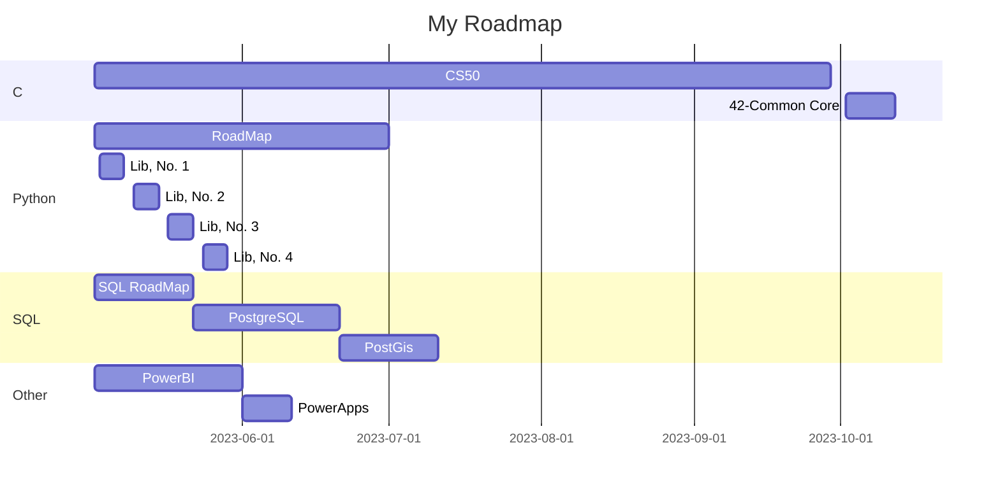

<table>
    <thead>
        <tr>
            <th>HORÁRIO (18h ~ 19:30)</th>
            <th>Segunda</th>
            <th>Terça</th>
            <th>Quarta</th>
            <th>Quinta</th>
            <th>Sexta</th>
        </tr>
    </thead>
    <tbody>
        <tr>
            <td>1ª Parte</td>
            <td rowspan=3>(C) CS50</td>
            <td rowspan=2>(Python) Roadmap</td>
            <td rowspan=2>(SQL)/(PQSL) Roadmap</td>
            <td>(Python) Libraries</td>
            <td rowspan=3>(C) CS50</td>
        </tr>
        <tr>
            <td>2ª Parte</td>
            <td rowspan=2>(Python) Roadmap</td>
        </tr>
        <tr>
            <td>3ª Parte</td>
            <td>(Python) Libraries</td>
            <td>PowerBI / Powerapps</td>
        </tr>
    </tbody>
</table>

# PROGRAMAÇÃO
## [Lista - Studies](./README.md)

Basicamente separei os dias que tenho mais tempo para estudar C e Python, que são as grandes demandas. Em seguida, vem SQL (Postgre e PostGis) junto com PowerBI e PowerApps, para aplicação na empresa.

Sobre o tempo, se conseguir conciliar entre os intervalos das demandas, ótimo, se não... Usar o tempo reservado por dia mesmo.

