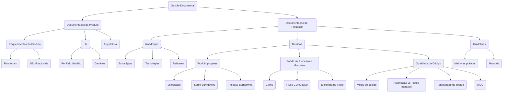

# 12 princípios do Manifesto Ágil

1. Nossa maior prioridade é satisfazer o cliente por meio da entrega antecipada e contínua de software valioso. 

2. Aceitar mudanças nos requisitos, mesmo no final do desenvolvimento. Os processos ágeis aproveitam a mudança para a vantagem competitiva do cliente. 

3. Entregue o software funcionando com frequência, de algumas semanas a alguns meses, com preferência para a escala de tempo mais curta. 

4. Clientes e desenvolvedores devem trabalhar juntos diariamente ao longo do projeto. 

5. Construir projetos em torno de indivíduos motivados. Dê a eles o ambiente e o suporte de que precisam e confie neles para fazer o trabalho.

6. O método mais eficiente e eficaz de transmitir informações para e dentro de uma equipe de desenvolvimento é a conversa face a face.

7. O software funcionando é a principal medida de progresso. 

8. Processos ágeis promovem o desenvolvimento sustentável. Os patrocinadores, desenvolvedores e usuários devem ser capazes de manter um ritmo constante indefinidamente.

9. A atenção contínua à excelência técnica e ao bom design aumenta a agilidade.

10. Simplicidade – a arte de maximizar a quantidade de trabalho não feito – é essencial. 

11. As melhores arquiteturas, requisitos e designs surgem de equipes auto-organizadas. 

>A arquitetura do produto, que é a estrutura subjacente e a abordagem para entrega do produto, surge junto com a entrega de recursos. Aderir a esse princípio significa que a equipe não desaparece por seis meses enquanto descobre a melhor arquitetura de longo prazo. Em vez disso, os membros da equipe decidem a melhor forma de construir o produto enquanto criam o produto.

12. Em intervalos regulares, a equipe reflete sobre como se tornar mais eficaz, então ajusta seu comportamento de acordo. 

## Conclusão
Revisitar o manifesto regularmente é um exercício útil para as equipes como uma camada adicional de responsabilidade. Se você está se perguntando como sua equipe pode viver melhor esses princípios ágeis, discuta isso na próxima [Sprint Retrospective](https://www.scrum.org/resources/blog/ideas-scrums-sprint-retrospective-event).

Uma maneira de fazer isso é colocar os 12 princípios ágeis em um quadro branco compartilhado. Em seguida, peça aos membros do Time Scrum que façam um brainstorming sobre como incorporar melhor esses princípios em seu trabalho e interações com a organização-mãe ou partes interessadas do negócio. Em seguida, vote em uma ou duas melhorias acionáveis e implemente-as o mais rápido possível.

# [Planejamento de Software e Documentação Técnica](https://www.youtube.com/watch?v=2qlcY9LkFik)

1.	Documentação do produto
    1.	Requerimentos do produto
        1.	 funcionais (capacidades do usuário)
        2.	não funcionais (capacidades do produto)
    2.	UX - Experiencias dos usuários (perfil e necessidades do usuário)
    3.	[Arquitetura](https://www.youtube.com/watch?v=BrT3AO8bVQY) 
        1.	Interface
        2.	Logica de negocio
        3.	Database

    
    >from [AltexSoft]( https://www.youtube.com/@AltexSoft)
     

    4.	Testing plans (define os responsáveis por cada caso e os casos)
        1.	Casos (descrição de como cada feature deve ser testada)

    
    >from [AltexSoft]( https://www.youtube.com/@AltexSoft)
     

2.	Documentação do Processo
    1.	Roadmap (Gannt)
        1.	Estratégia 
        2.	Tecnologias
        3.	Releases
    2.	Métricas

    
    >from [AltexSoft]( https://www.youtube.com/@AltexSoft)
     

    3.	Guidelines
        1.	Melhores práticas
        2.	Manuais

---
