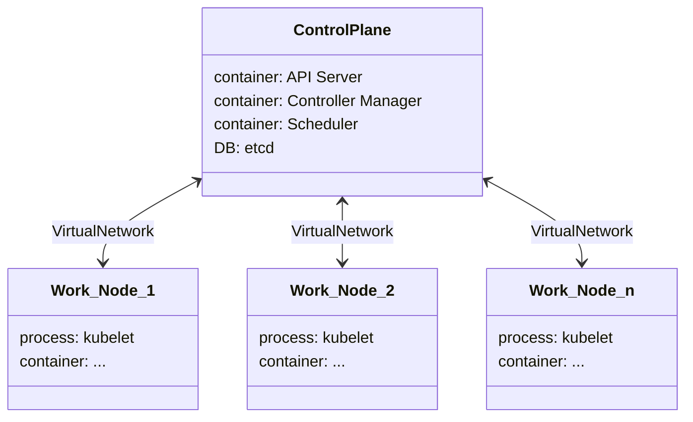

 
Table of Contents 🔖

- [#]()

---

# Kubernetes - Basics
> Kubernetes is an open source container orchestration engine for automating deployment, scaling, and management of containerized applications. The open source project is hosted by the Cloud Native Computing Foundation ([CNCF](https://www.cncf.io/about)).

## Main Components
- Pod
- Volume
- Service
- Ingress
- ConfigMap
- Deployment
- Secret
- StatefulSet
- DaemonSet

## Architecture

## Control Plane
**API Server**: is the entry point of the K8s Cluster, will direct the requests for each manager
**Controller Manager**: keeps an overview of the status of the K8s Clust
**Scheduler**: ensures the pods placement and decides on which node a new pod should be scheduled
**etcd**: internal database to hold the backing history of the Cluster, has configurations and status data of the cluster nodes, pods and managers, its snapshots are used in the backup processes

## Pods
Pod is the smallest unit inside a K8s Clust, its an abstraction for a Container, serving the environment for the container as a wrapper or a layer on top of the container. This removes the need to interact directly with the container itself.
**Each Kubernetes Pod is meant to have only one application (container) inside**.

About the communication, through the Virtual Network of the cluster, each Pod will receive a different IP address.

## Nodes
Are the elements that holds the Pods inside.

## Service
