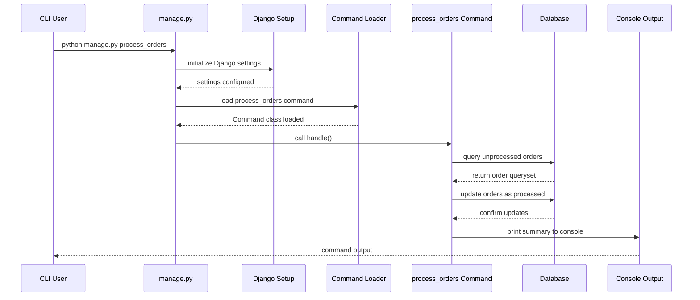

<details> <summary>Table of Contents 🔖</summary>

- [Creating Django CLI Applications](#creating-django-cli-applications)
  - [Understanding Django Management Commands](#understanding-django-management-commands)
    - [The Foundation: `BaseCommand` Architecture](#the-foundation-basecommand-architecture)
  - [Advanced Command Development Patterns](#advanced-command-development-patterns)
    - [Argument Handling and Validation](#argument-handling-and-validation)
    - [Error Handling and User Feedback](#error-handling-and-user-feedback)
    - [Database Integration](#database-integration)
  - [Testing Django Management Commands](#testing-django-management-commands)
    - [Using `call_command` for Testing](#using-call_command-for-testing)
    - [Testing with Mock Objects](#testing-with-mock-objects)
  - [Packaging Django Commands for Distribution](#packaging-django-commands-for-distribution)
    - [Project Structure for Distribution](#project-structure-for-distribution)
    - [Creating `setup.py` for Django Commands](#creating-setuppy-for-django-commands)
    - [Modern Packaging with `pyproject.toml`](#modern-packaging-with-pyprojecttoml)
      - [`uv` integration](#uv-integration)
  - [Publishing to PyPI](#publishing-to-pypi)
    - [Preparing for Publication](#preparing-for-publication)
    - [Building and Uploading](#building-and-uploading)
    - [Automated Publishing with GitHub Actions](#automated-publishing-with-github-actions)
  - [Best Practices and Design Patterns](#best-practices-and-design-patterns)
    - [Command Organization](#command-organization)
    - [Configuration Management](#configuration-management)
    - [Error Handling and Logging](#error-handling-and-logging)
  - [Real-World Applications](#real-world-applications)
    - [Data Processing and Migration](#data-processing-and-migration)
    - [Integration with External Services](#integration-with-external-services)
- [References](#references)

</details>

---
# Creating Django CLI Applications
>From Development to Distribution

Building command-line tools for Django applications is a powerful way to **extend your project's capabilities** and **create reusable utilities**. This comprehensive guide explores the full lifecycle of Django CLI development, from creating custom management commands to distributing them as installable packages.

## Understanding Django Management Commands
Django's management command system provides a structured way to create command-line tools that integrate seamlessly with your Django project. Unlike standalone scripts, these commands have full access to Django's ecosystem, including models, settings, and the [ORM](../../../Docs/orm.md)[^1][^2].
Heres an example of the internal calls for the `process_orders` command.



> [!INFO]
> **Explanation of Steps**
> 1. **User executes** `python manage.py process_orders`.
> 2. **manage.py** sets up Django environment (`DJANGO_SETTINGS_MODULE`).
> 3. **Django Setup** configures settings, apps, etc.
> 4. **Command Loader** finds `process_orders.py` in `management/commands/`.
> 5. **Command Class** (`BaseCommand` subclass) is instantiated.
> 6. **handle()** runs business logic:
>     - Queries the database
>     - Updates data
>     - Outputs results.
> 7. **Console Output** is shown to the user.

### The Foundation: `BaseCommand` Architecture
Every Django management command inherits from `BaseCommand`, which provides the essential framework for command-line interaction[^3][^4]. The class structure follows a consistent pattern:

```python
from django.core.management.base import BaseCommand

class Command(BaseCommand):
    help = 'Description of what this command does'
    
    def add_arguments(self, parser):
        pass # Define command-line arguments
    
    def handle(self, *args, **options):
        pass # Main command logic
```

This architecture ensures that all commands follow Django's conventions while providing flexibility for custom functionality[^2][^3].

## Advanced Command Development Patterns

### Argument Handling and Validation
Modern Django commands support sophisticated argument parsing through the `add_arguments` method[^5][^4]:

```python
def add_arguments(self, parser):
    parser.add_argument('required_arg', type=str, help='Required argument')
    parser.add_argument('--optional-flag', action='store_true', help='Optional flag')
    parser.add_argument('--with-default', type=int, default=10, help='With default value')
    parser.add_argument('multiple_args', nargs='+', type=str, help='Multiple arguments')
```

### Error Handling and User Feedback
Professional commands provide clear feedback and handle errors gracefully[^3][^4]:

```python
def handle(self, *args, **options):
    try:
        # Command logic here
        self.stdout.write(
            self.style.SUCCESS('Operation completed successfully')
        )
    except Exception as e:
        self.stdout.write(
            self.style.ERROR(f'Error: {str(e)}')
        )
        raise CommandError('Command failed')
```

### Database Integration
Commands can interact with Django models and perform complex database operations[^6][^3]:

```python
def handle(self, *args, **options):
    from myapp.models import MyModel
    
    # Query the database
    objects = MyModel.objects.filter(active=True)
    
    for obj in objects:
        # Process each object
        self.stdout.write(f'Processing {obj.name}')
```

## Testing Django Management Commands
Testing is crucial for maintaining reliable CLI tools. Django provides several approaches for testing management commands[^7][^8]:

### Using `call_command` for Testing

```python
from django.core.management import call_command
from django.test import TestCase
from io import StringIO

class CommandTestCase(TestCase):
    def test_my_command(self):
        out = StringIO()
        call_command('mycommand', '--option', 'value', stdout=out)
        self.assertIn('Expected output', out.getvalue())
```

### Testing with Mock Objects
For commands that interact with external systems, mocking ensures reliable tests[^7][^9]:

```python
from unittest.mock import patch, MagicMock

class CommandTestCase(TestCase):
    @patch('myapp.external_service.api_call')
    def test_external_integration(self, mock_api):
        mock_api.return_value = {'status': 'success'}
        call_command('sync_data')
        mock_api.assert_called_once()
```

## Packaging Django Commands for Distribution

### Project Structure for Distribution
When preparing a Django command for distribution, **proper project structure is essential**[^10][^11]:

```
django-cli-tool/
├── src/
│   └── django_cli_tool/
│       ├── __init__.py
│       ├── management/
│       │   └── commands/
│       │       └── mycli.py
│       └── apps.py
├── setup.py
├── pyproject.toml # or other dependency list
├── README.md
└── tests/
```

### Creating `setup.py` for Django Commands
The `setup.py` file must properly declare Django as a dependency and include the management command structure[^12][^13], similar to a manifest document:

```python
from setuptools import setup, find_packages

setup(
    name="django-cli-tool",
    version="1.0.0",
    packages=find_packages(where="src"),
    package_dir={"": "src"},
    install_requires=[
        "Django>=3.2",
    ],
    entry_points={
        "console_scripts": [
            "django-cli-tool=django_cli_tool.cli:main",
        ],
    },
    include_package_data=True,
    python_requires=">=3.8",
    classifiers=[
        "Framework :: Django",
        "Development Status :: 5 - Production/Stable",
        "Environment :: Console",
        "Intended Audience :: Developers",
        "License :: OSI Approved :: MIT License",
        "Programming Language :: Python :: 3",
        "Programming Language :: Python :: 3.8",
        "Programming Language :: Python :: 3.9",
        "Programming Language :: Python :: 3.10",
        "Programming Language :: Python :: 3.11",
    ],
)
```

### Modern Packaging with `pyproject.toml`
The newer `pyproject.toml` format provides a cleaner alternative to setup.py[^13][^14]:

```toml
[build-system]
requires = ["setuptools>=45", "wheel"]
build-backend = "setuptools.build_meta"

[project]
name = "django-cli-tool"
version = "1.0.0"
description = "A Django CLI tool for managing UML diagrams"
dependencies = [
    "Django>=3.2",
]
requires-python = ">=3.8"

[project.scripts]
django-cli-tool = "django_cli_tool.cli:main"
```

#### [`uv`](https://github.com/astral-sh/uv) integration
Additionally is possible to integrate `.toml` dependency list with the modern package manager written in Rust:

1. *Install `uv`* (if you haven’t yet) with `curl -LsSf https://astral.sh/uv/install.sh | sh`  
2. **Install your project in editable mode** (like pip -e) with  `uv pip install --editable .` this will read `pyproject.toml` dependencies and installs them.
3. Run your CLI `django-cli-tool --help`

> [!NOTE]
> - The `[project]` section is **[PEP 621](https://peps.python.org/pep-0621/)** compliant.
> - `uv` will automatically detect dependencies and install them.
> - If you prefer a declarative backend (e.g., Hatchling or Flit), just replace `[build-system]`:
>   **Example with Hatchling:**
>   ```toml
>   [build-system]
>   requires = ["hatchling"]
>   build-backend = "hatchling.build"
>   ```
>   Then `uv pip install .` works the same way.

## Publishing to PyPI

### Preparing for Publication
Before publishing, ensure your package meets PyPI standards[^15][^16]:
1. **Unique naming**: Choose a name that isn't already taken on PyPI
2. **Proper versioning**: Follow semantic versioning principles
3. **Complete documentation**: Include comprehensive README and documentation
4. **Testing**: Ensure all tests pass across supported Python versions

### Building and Uploading
The modern approach uses the `build` and `twine` tools[^15][^17]:

```bash
# Install build tools
pip install build twine

# Build the package
python -m build

# Upload to Test PyPI first
twine upload --repository testpypi dist/*

# After verification, upload to PyPI
twine upload dist/*
```

### Automated Publishing with GitHub Actions
Setting up automated publishing ensures consistent releases[^18][^17]:

```yaml
name: Publish to PyPI

on:
  release:
    types: [created]

jobs:
  publish:
    runs-on: ubuntu-latest
    environment:
      name: pypi
      url: https://pypi.org/p/django-cli-tool
    permissions:
      id-token: write
    steps:
    - uses: actions/checkout@v4
    - name: Set up Python
      uses: actions/setup-python@v4
      with:
        python-version: '3.x'
    - name: Install dependencies
      run: |
        python -m pip install --upgrade pip
        pip install build
    - name: Build package
      run: python -m build
    - name: Publish to PyPI
      uses: pypa/gh-action-pypi-publish@release/v1
```

## Best Practices and Design Patterns

### Command Organization
For complex CLI tools, organize commands using clear hierarchies[^19][^20]:

```python
# commands/base.py
class BaseCustomCommand(BaseCommand):
    def __init__(self, *args, **kwargs):
        super().__init__(*args, **kwargs)
        self.setup_logging()
    
    def setup_logging(self):
        pass # Common logging configuration

# commands/sync.py
class Command(BaseCustomCommand):
    help = 'Synchronize data from external source'
    
    def handle(self, *args, **options):
        pass # Implementation
```

### Configuration Management
To make the command program configurable, providing dynamic operations is possible to use Django settings to define constants[^21][^22]:

```python
# settings.py
CLI_TOOL_SETTINGS = {
    'API_ENDPOINT': 'https://api.example.com',
    'TIMEOUT': 30,
    'BATCH_SIZE': 100,
}

# In command
from django.conf import settings

class Command(BaseCommand):
    def handle(self, *args, **options):
        config = settings.CLI_TOOL_SETTINGS
        # Use configuration
```

### Error Handling and Logging
Is also important to implement comprehensive error handling and logging[^23][^24], providing clear indication in case of issues and failiures:

```python
import logging
from django.core.management.base import BaseCommand, CommandError

logger = logging.getLogger(__name__)

class Command(BaseCommand):
    def handle(self, *args, **options):
        try:
            self.process_data()
        except Exception as e:
            logger.error(f"Command failed: {str(e)}")
            raise CommandError(f"Processing failed: {str(e)}")
    
    def process_data(self):
        pass # Implementation with proper error handling
```

## Real-World Applications

### Data Processing and Migration
Django commands excel at data processing tasks[^6][^25]:

```python
class Command(BaseCommand):
    help = 'Migrate legacy data to new format'
    
    def add_arguments(self, parser):
        parser.add_argument('--batch-size', type=int, default=1000)
        parser.add_argument('--dry-run', action='store_true')
    
    def handle(self, *args, **options):
        batch_size = options['batch_size']
        dry_run = options['dry_run']
        
        # Process in batches
        for batch in self.get_batches(batch_size):
            if not dry_run:
                self.process_batch(batch)
            self.stdout.write(f'Processed batch of {len(batch)} items')
```

### Integration with External Services
Commands can integrate with APIs and external systems[^26][^25]:

```python
class Command(BaseCommand):
    help = 'Sync data with external API'
    
    def handle(self, *args, **options):
        api_client = self.get_api_client()
        
        for item in self.get_local_items():
            try:
                response = api_client.sync_item(item)
                self.update_local_item(item, response)
            except APIError as e:
                self.stdout.write(
                    self.style.ERROR(f'Failed to sync {item}: {e}')
                )
```

---

Creating professional Django CLI applications involves understanding the **management command architecture**, implementing proper testing, and following modern **packaging practices**. By leveraging Django's built-in command system, developers can create powerful, reusable tools that integrate seamlessly with Django projects.

The key to success lies in following established patterns, implementing comprehensive testing, and properly packaging the application for distribution. Whether you're building internal tools or open-source utilities, these practices ensure your CLI applications are maintainable, reliable, and easy to use.

Modern deployment practices, including automated testing and publishing through GitHub Actions, further streamline the development process, allowing developers to focus on building features rather than managing infrastructure, providing continuous Integrations and Delivery that scales from simple utilities to complex enterprise tools.

# References
[^1]: https://testdriven.io/tips/dbc14e1f-1231-4761-8ed4-3c82f8b16c08/
[^2]: https://simpleisbetterthancomplex.com/tutorial/2018/08/27/how-to-create-custom-django-management-commands.html
[^3]: https://docs.djangoproject.com/en/5.2/howto/custom-management-commands/
[^4]: https://django-chinese-doc.readthedocs.io/zh_CN/1.10.x/howto/custom-management-commands.html
[^5]: https://stackoverflow.com/questions/27611468/django-management-command-argument
[^6]: https://www.geeksforgeeks.org/python/custom-django-management-commands/
[^7]: https://stackoverflow.com/questions/1286700/how-to-test-custom-django-admin-commands
[^8]: https://www.geeksforgeeks.org/python/running-custom-django-managepy-commands-in-tests/
[^9]: https://wersdoerfer.de/blogs/ephes_blog/til-testing-django-management-commands-with-pytest/
[^10]: https://realpython.com/installable-django-app/
[^11]: http://django-best-practices.readthedocs.io/en/latest/apps/distribution.html
[^12]: https://pythonhosted.org/an_example_pypi_project/setuptools.html
[^13]: https://setuptools.pypa.io/en/latest/userguide/quickstart.html
[^14]: https://simonwillison.net/2024/Jan/16/python-lib-pypi/
[^15]: https://packaging.python.org/tutorials/packaging-projects/
[^16]: https://www.pyopensci.org/python-package-guide/tutorials/publish-pypi.html
[^17]: https://packaging.python.org/guides/publishing-package-distribution-releases-using-github-actions-ci-cd-workflows/
[^18]: https://www.paigeniedringhaus.com/blog/automatically-publish-a-repo-as-a-py-pi-library-with-git-hub-actions
[^19]: https://github.com/paduszyk/django-management-commands
[^20]: https://python.plainenglish.io/django-management-commands-tutorials-deep-dive-72a497f86f05
[^21]: https://itnext.io/best-practices-for-structuring-a-django-project-23b8c1181e3f
[^22]: https://www.hostinger.com/tutorials/django-best-practices
[^23]: https://dev.to/champsoft/best-practices-for-django-software-development-4ngo
[^24]: https://www.freecodecamp.org/news/django-project-best-practices-for-happy-developers/
[^25]: https://bastakiss.com/blog/django-6/mastering-django-management-commands-what-they-are-and-how-to-write-new-commands-640
[^26]: https://aisaastemplate.com/blog/django-management-commands/

