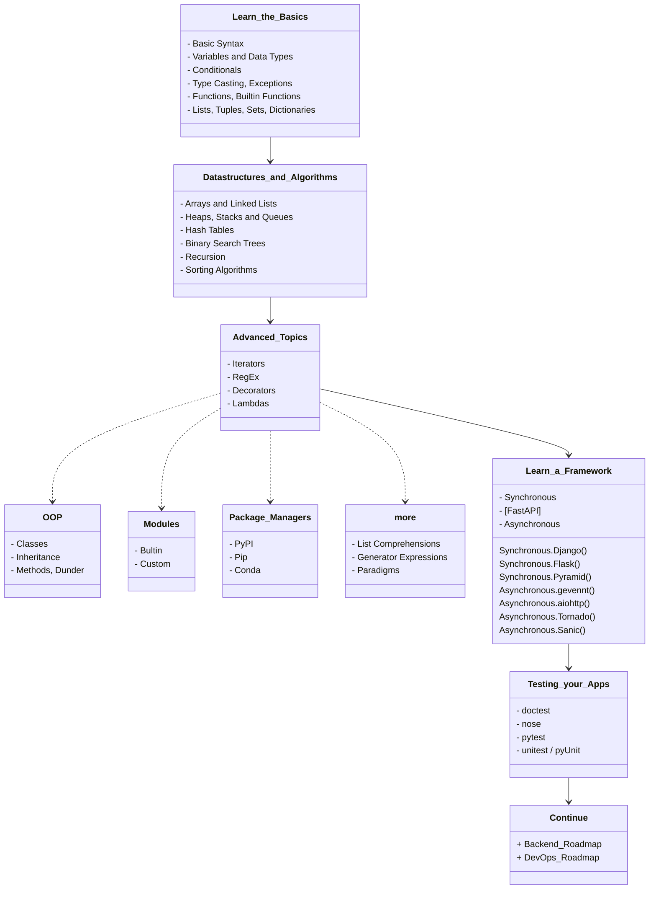
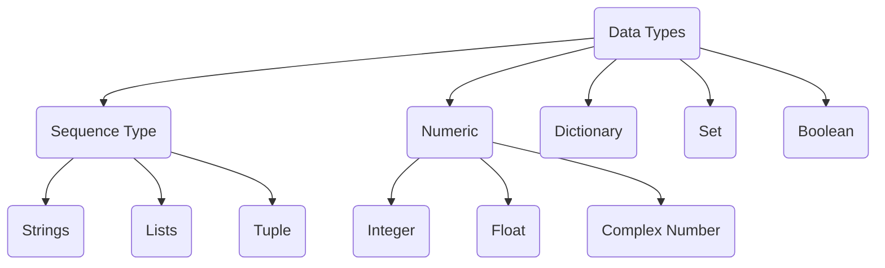

<details> <summary>Table of Contents</summary>

- [RoadMap](#roadmap)
- [Learn\_the\_Basics](#learn_the_basics)
	- [Basic Syntax](#basic-syntax)
	- [Variables and Data Types](#variables-and-data-types)
	- [Conditionals](#conditionals)
	- [Typecasting](#typecasting)
		- [Errors and Exceptions #](#errors-and-exceptions-)
	- [Functions](#functions)
		- [Argument x Parameter](#argument-x-parameter)
		- [Return](#return)
	- [Lists, Tuples, Sets, and Dictionaries](#lists-tuples-sets-and-dictionaries)
- [Data Structures and Algorithms](#data-structures-and-algorithms)
	- [Arrays and Linked Lists](#arrays-and-linked-lists)
	- [Heaps, Stacks and Queues](#heaps-stacks-and-queues)
	- [Hash Tables](#hash-tables)
	- [Binary Search Trees](#binary-search-trees)
	- [Recursion](#recursion)
	- [Sorting Algorithms](#sorting-algorithms)
- [Advanced Topics](#advanced-topics)
	- [Object-oriented Programming - OOP](#object-oriented-programming---oop)
		- [Dunder Methods #](#dunder-methods-)
	- [Iterators](#iterators)
	- [RegEx - Regular Expressions](#regex---regular-expressions)
	- [Decorators](#decorators)
	- [Lambdas](#lambdas)
	- [Modules](#modules)
		- [Builtin](#builtin)
		- [Custom](#custom)
	- [Package Managers](#package-managers)
		- [Pip](#pip)
		- [PyPi](#pypi)
		- [Conda](#conda)
	- [Comprehensions](#comprehensions)
		- [List Comprehensions](#listcomprehensions)
		- [Generator Expressions](#generator-expressions)
		- [Paradigms](#paradigms)
- [Learn a Framework](#learn-a-framework)
	- [Synchronous Frameworks](#synchronous-frameworks)
		- [Django](#django)
		- [Flask](#flask)
		- [Pyramid](#pyramid)
	- [Asynchronous](#asynchronous)
		- [gevent](#gevent)
		- [AIOHTTP](#aiohttp)
		- [Tornado](#tornado)
		- [Sanic](#sanic)
	- [FastAPI](#fastapi)
- [Testing your Apps](#testing-your-apps)
- [Continue](#continue)
	- [Libraries](#libraries)

</details>

---

# RoadMap
> Edited from [© roadmap.sh](https://roadmap.sh/python)


---

# Learn_the_Basics

Python is a high-level, interpreted, general-purpose programming language. Its design philosophy emphasizes code readability with the use of significant indentation. Python is dynamically-typed and garbage-collected.

## Basic Syntax

Setup the environment for python and get started with the basics.

Visit the following resources to learn more:
-	[W3Schools - Python](https://www.w3schools.com/python/)
-	[Python for Beginners - Learn Python in 1 Hour](https://www.youtube.com/watch?v=kqtD5dpn9C8)
-	[Python Basics](https://www.tutorialspoint.com/python/python_basic_syntax.htm)
-	[Learn X in Y Minutes / Python](https://learnxinyminutes.com/docs/python/)

## Variables and Data Types

Variables are used to store information to be referenced and manipulated in a computer program. They also provide a way of labeling data with a descriptive name, so our programs can be understood more clearly by the reader and ourselves. It is helpful to think of variables as containers that hold information. Their sole purpose is to label and store data in memory. This data can then be used throughout your program.

And a bit more intricate: each variable is an instance of a data type class (e.g. `<class 'int'>`)

```python
item = 7
print(type(item))
```



Visit the following resources to learn more:
-	[Variables in Python](https://realpython.com/python-variables)
-	[W3Schools — Python Variables](https://www.w3schools.com/python/python_variables.asp)
-	[Python Variables - Geeks for Geeks](https://www.geeksforgeeks.org/python-variables/)
-	[Python Data Types](https://www.w3schools.com/python/python_datatypes.asp)
-	[Basic Data Types in Python](https://realpython.com/python-data-types/)
-	[Python for Beginners: Data Types](https://thenewstack.io/python-for-beginners-data-types/)

## Conditionals

Conditional Statements in Python perform different actions depending on whether a specific condition evaluates to true or false. Conditional Statements are handled by `IF`-`ELIF`-`ELSE` statements and `MATCH`-`CASE` statements in Python.

Visit the following resources to learn more:
-	[Python Conditional Statements: IF…Else, ELIF & Switch Case](https://www.guru99.com/if-loop-python-conditional-structures.html)
-	[Conditional Statements in Python](https://realpython.com/python-conditional-statements/)
-	[How to use a match statement in Python](https://learnpython.com/blog/python-match-case-statement/)

## Typecasting

The process of converting the value of one data type (integer, string, float, etc.) to another data type is called type conversion. Python has two types of type conversion:

-	**Implicit** - in this, method, Python converts the datatype into another datatype automatically. In this process, users don’t have to involve in this process.

```python
# Python program to demonstrate
# implicit type Casting

# Python automatically converts
# a to int
>>> a = 7
>>> print(type(a))

# Python automatically converts
# b to float
>>> b = 3.0
>>> print(type(b))

# Python automatically converts
# c to float as it is a float addition
>>> c = a + b
>>> print(c)
>>> print(type(c))

# Python automatically converts
# d to float as it is a float multiplication
>>> d = a * b
>>> print(d)
>>> print(type(d))
```

-	**Explicit** - in this method, Python needs user involvement to convert the variable data type into a certain data type in order to the operation required.
	-   **Int():** [Python Int()](https://www.geeksforgeeks.org/python-int-function/) function take float or string as an argument and returns int type object.
	-   **float():** [Python float()](https://www.geeksforgeeks.org/float-in-python/) function take int or string as an argument and return float type object.
	-   **str():** [Python str()](https://www.geeksforgeeks.org/python-str-function/) function takes float or int as an argument and returns string type object.

### Errors and Exceptions [#](https://docs.python.org/3/tutorial/errors.html)

There are (at least) two distinguishable kinds of errors: **syntax errors** and **exceptions**.

Eventualy you'll elaborate a code that [handle with it's own exceptions](https://www.programiz.com/python-programming/exception-handling), using generaly `try` and `except` comands.

Visit the following resources to learn more:
-	[Type Conversion and Casting](https://www.programiz.com/python-programming/type-conversion-and-casting)
-	[Type Casting in Python with Examples](https://www.geeksforgeeks.org/type-casting-in-python-implicit-and-explicit-with-examples/)
-	[Python Exceptions: An Introduction](https://realpython.com/python-exceptions/)
-	[Python Try Except](https://www.w3schools.com/python/python_try_except.asp)

## Functions

In programming, a function is a reusable block of code that executes a certain functionality when it is called. Functions are integral parts of every programming language because they help make your code more modular and reusable.

In Python, you *define* a function with the `def` keyword, then write the function identifier (*name*) followed by parentheses (*parameters*) and a colon, like:

```python
def function_name(parameter1, parameter2):
	#do something
	return something #optional
```

### Argument x Parameter

"*A parameter is the variable listed inside the parentheses in the function definition. An argument is the value that is sent to the function when it is called.*" [_font_](https://stackoverflow.com/questions/156767/whats-the-difference-between-an-argument-and-a-parameter#:~:text=A%20parameter%20is%20the%20variable,function%20when%20it%20is%20called.)


### Return

The use of a function can be only for processing algorithms or just to print an information:
```python
>>> def my_function():
...		print("Hello friend, from a function")

>>> my_function()
```

Or to `return` a value, like a math operation:
```python
>>> def sum(a, b)
...		return (a + b)

>>> print(sum(3, 4))
```

Visit the following resources to learn more:
-	[Python Functions - W3Schools](https://www.w3schools.com/python/python_functions.asp)
-	[Python Functions – How to Define and Call a Function](https://www.freecodecamp.org/news/python-functions-define-and-call-a-function/)
-	[Python Functions](https://www.geeksforgeeks.org/python-functions/)
-	[Built-in Functions in Python](https://docs.python.org/3/library/functions.html)

## Lists, Tuples, Sets, and Dictionaries

-	**Lists**: are just like dynamic sized arrays, declared in other languages (vector in C++ and ArrayList in Java).  *Represented with* `[]`.
	They're non-homogeneous (allows multitype and duplicate elements) and ordered (*index* starts with `0`) data structure that stores the elements in single row and multiple rows and columns, is mutable.
	
	-	The `append()` method adds a single item at the end of the list without modifying the original list.
	-	The `pop()` method removes the item at the given index (*defaut last*) from the list and returns it.
	-	The `sort()` method sorts the elements of a given list in a specific ascending or descending order.
	-	`index()` searches for a given element from the start of the list and returns the lowest index where the element appears.
	-	The `count()` method returns the number of times the specified element appears in the list.
	-	The `reverse()` method reverses the elements of the list.

	```python
	#definition
	>>> lst = list()
	
	#example
	#index 0 1 2  3  4  5
	>>> lst = [1,1,2,'c',4,'e']
	>>> print(lst)
	
	#index/element
	>>> print(lst.index('c'))
	>>> print(lst[3])
	
	#can be modified
	>>> lst.append('f')	#builtin add method
	>>> print(lst)
	>>> lst.pop()	#builtin remove method
	>>> print(lst)
	```
	Aplications:
	-   Used in `JSON` format
	-   Useful for Array operations
	-   Used in Databases

-	**Tuple**: is a collection of Python objects separated by commas. *Represented by* `()`.
	In some ways, a tuple is similar to a list in terms of indexing, nested objects, and repetition but **a tuple is immutable**, unlike lists that are mutable.
	-	The `count()` method returns the number of times a specified value occurs in a tuple.
	-	The `reverse()` method is **not defined** in tuples, as they are unchangeable

	```python
	#definition
	>>> tpl = tuple()
	
	#example
	#index 0 1 2  3  4  5
	>>> tpl = (1,1,2,'c',4,'e')
	>>> print(tpl)
	```
	Aplications
	-	Used to insert records in the database through `SQL` query at a time.
	-	Used in parentheses checker

-	**Set**: is an unordered collection data type that is iterable, mutable, and has no duplicate elements.
	-	The set `add()` method adds a given element to a set.
	-	The `pop()` method removes a random item from the set.
	-	There `count()` method is **not defined** in sets, as they do not allow any duplicates.
	-	The `reverse()` method is **not defined** in sets, they're unordered, which restricts from applying.

	```python
	#definition
	>>> st = set()
	
	#example
	>>> st = (1,1,2,'c',4,'e')
	>>> print(st)
	
	#can be modified
	>>> st.add('f')	#builtin add method
	>>> print(st)
	>>> st.pop()	#builtin remove method
	>>> print(st)
	```
	Aplications
	-   Finding unique elements
	-   Join operations

-	**Dictionary**: In python, Dictionary is a non-homogeneous ordered (since Py 3.7 *[unordered (Py 3.6 & prior)]*) collection of data values, used to store data values like a map, which, unlike other Data Types that hold only a single value as an element, Dictionary holds `key:value` pair. Key-value is provided to make it more optimized. **Note that the Dictionary is mutable. But Keys are not duplicated**.
	-	The `update()` method updates *at the end* the Dictionary with the specified `key-value` pairs.
	-	The `pop()` method removes the specified (*by the key*) item from the dictionary.
	-	`sorted()` method is used to sort the keys in the dictionary by default.
	-	The `get()` method returns the value of the item with the specified key.
	-	The `count()` method is not defined in the dictionary.
	-	The elements cannot be reversed, as the items in the dictionary are in the form of `key-value` pairs

	```python
	#definition
	>>> dic = dict()
	
	#example
	>>> dic={
	...		"key1": 1,
	...		"key3": 2,
	...		"key2": 3
	}
	>>> print(dic)

	#element
	>>> print(dic.get("key2"))

	#can be modified
	>>> dic.update("key4":4)	#builtin add method
	>>> print(dic)
	>>> dic.pop("key4")	#builtin remove method
	>>> print(dic)
	```
	Aplications
	-	Used to create a data frame with lists
	-	Used in `JSON`

Visit the following resources to learn more:
- [Difference Between List, Tuple, Set and Dictionary in Python](https://www.youtube.com/watch?v=n0krwG38SHI)
- [Differences and Applications of List, Tuple, Set and - Dictionary in Python](https://www.geeksforgeeks.org/differences-and-applications-of-list-tuple-set-and-dictionary-in-python/)
- [Tuples vs. Lists vs. Sets in Python](https://jerrynsh.com/tuples-vs-lists-vs-sets-in-python/)
- [Python for Beginners: Lists](https://thenewstack.io/python-for-beginners-lists/)
- [Python for Beginners: When and How to Use Tuples](https://thenewstack.io/python-for-beginners-when-and-how-to-use-tuples/)

# Data Structures and Algorithms

A [Data Structure](data_structure.md) is a named location that can be used to store and organize data. And, an algorithm is a collection of steps to solve a particular problem. Learning data structures and algorithms allow us to write efficient and optimized computer programs. There're a main division in the pattern:
- **Linear** (Arrays, Linked Lists, Stacks, Queues and Hash Tables)
- **Non-linear** (Binary Tree (hierarchical), Graphs)

## Arrays and Linked Lists

Arrays store elements in contiguous memory locations, resulting in easily calculable addresses for the elements stored and this allows faster access to an element at a specific index. [Linked lists](linked_list.py) are less rigid in their storage structure and elements are usually not stored in contiguous locations, hence they need to be stored with additional tags giving a reference to the next element. *This difference in the data storage scheme decides which data structure would be more suitable for a given situation*. **Needs to be imported with `import array`**. 

Arrays of the array module are a thin wrapper over C arrays, and are useful when you want to work with homogeneous data. They are also more compact and take up less memory and space which makes them more size efficient compared to lists.

If you want to perform mathematical calculations, then you should use [**NumPy**](numpy.md) (https://www.w3schools.com/python/numpy/numpy_getting_started.asp) arrays (be sure to install [`pip install numpy`]). Besides that, you should just use Python arrays when you really need to, as lists work in a similar way and are more flexible to work with.

Visit the following resources to learn more:

-	[Linked Lists vs Arrays](https://www.geeksforgeeks.org/linked-list-vs-array/)
-	[Python Array Tutorial](https://www.freecodecamp.org/news/python-array-tutorial-define-index-methods/)
-	[Python Arrays](https://www.geeksforgeeks.org/python-arrays/)
-	[Arrays in Python](https://www.edureka.co/blog/arrays-in-python/)
-	[Array Data Structure | Illustrated Data Structures](https://www.youtube.com/watch?v=QJNwK2uJyGs)
-	[Linked List Data Structure | Illustrated Data Structures](https://www.youtube.com/watch?v=odW9FU8jPRQ)

## Heaps, Stacks and Queues

-	**Stacks:** Operations are performed [`LIFO`](lifo_fifo.md) (last in, first out), which means that the last element added will be the first one removed. A stack can be implemented using an array or a linked list. If the stack runs out of memory, it’s called a stack overflow.

-	**Queue:** Operations are performed [`FIFO`](lifo_fifo.md) (first in, first out), which means that the first element added will be the first one removed. A queue can be implemented using an array.

-	**Heap:** A tree-based data structure in which the value of a parent node is ordered in a certain way with respect to the value of its child node(s). A heap can be either a min heap (the value of a parent node is less than or equal to the value of its children) or a max heap (the value of a parent node is greater than or equal to the value of its children).

Visit the following resources to learn more:

-   [Heaps, Stacks, Queues](https://stephanosterburg.gitbook.io/scrapbook/coding/coding-interview/data-structures/heaps-stacks-queues)
-   [Python Stacks, Queues, and Priority Queues in Practice](https://realpython.com/queue-in-python/)
-   stacks
	-   [Stack Data Structure | Illustrated Data Structures](https://www.youtube.com/watch?v=I5lq6sCuABE)
	-   [Stack in Python](https://www.geeksforgeeks.org/stack-in-python/)
	-   [How to Implement Python Stack?](https://realpython.com/how-to-implement-python-stack/)
-   heaps
	-   [Heap Implementation in Python](https://www.educative.io/answers/heap-implementation-in-python)
-   queues
	-   [Queue Data Structure | Illustrated Data Structures](https://www.youtube.com/watch?v=mDCi1lXd9hc)
	-   [Queue in Python](https://www.geeksforgeeks.org/queue-in-python/)

## Hash Tables

Hash Table, Map, HashMap, Dictionary or Associative are all the names of the same data structure. It is a data structure that implements a set abstract data type, a structure that can map keys to values.

Visit the following resources to learn more:

-   [Hash Table Data Structure | Illustrated Data Structures](https://www.youtube.com/watch?v=jalSiaIi8j4)
-   [Hash Tables and Hashmaps in Python](https://www.edureka.co/blog/hash-tables-and-hashmaps-in-python/)
-   [Build a Hash Table in Python](https://realpython.com/python-hash-table/)

## Binary Search Trees

A binary search tree, also called an ordered or sorted binary tree, is a rooted binary tree data structure with the key of each internal node being greater than all the keys in the respective node’s left subtree and less than the ones in its right subtree

Visit the following resources to learn more:

-   [Tree Data Structure | Illustrated Data Structures](https://www.youtube.com/watch?v=S2W3SXGPVyU)
-   [How to Implement Binary Search Tree in Python](https://www.section.io/engineering-education/implementing-binary-search-tree-using-python/)
-   [Problem Set](https://www.geeksforgeeks.org/binary-search-tree-data-structure/?ref=gcse)

## Recursion

[Recursion](recursion.md) is a method of solving a computational problem where the solution depends on solutions to smaller instances of the same problem. Recursion solves such recursive problems by using functions that call themselves from within their own code.

Visit the following resources to learn more:

-   [Recursion in Python](https://www.geeksforgeeks.org/recursion/)
-   [Recursion in Python: An Introduction](https://realpython.com/python-recursion/)

## Sorting Algorithms

[Sorting](sorting_algo.md) refers to arranging data in a particular format. Sorting algorithm specifies the way to arrange data in a particular order. Most common orders are in numerical or lexicographical order.

The importance of sorting lies in the fact that data searching can be optimized to a very high level, if data is stored in a sorted manner.

Visit the following resources to learn more:

-   [Sorting Algorithms in Python](https://realpython.com/sorting-algorithms-python/)
-   [Python - Sorting Algorithms](https://www.tutorialspoint.com/python_data_structure/python_sorting_algorithms.htm)

# Advanced Topics

## Object-oriented Programming - OOP

In Python, [Object-oriented Programming (OOP)](OOP.md) is a programming paradigm that uses objects and classes in programming. It aims to implement real-world entities like inheritance, polymorphisms, encapsulation, etc. in the programming. The main concept of OOP is to bind the data and the functions that work on that together as a single unit so that no other part of the code can access this data.

The classes are modules appended in `__main__`, **the environment where top-level code runs**.

```python
class Item:
	def calculate_price(self): # method
		pass

item1 = Item() # create instance
print(type(item)) # <class '__main__.Item'>
```
> in this case `<class '__main__.Item'>`

`self` is a parameter in a method that is automatically passed and refers to the object itself (in this case, the instance of the class) when the method is called. If no parameter is passed, it will result in a `TypeError: calculate_price() takes 0 positional arguments but 1 was given`.

> An alternative to OOP is [Function Programming](https://www.youtube.com/watch?v=ph2HjBQuI8Y)

Visit the following resources to learn more:

-   [Object Oriented Programming in Python](https://realpython.com/python3-object-oriented-programming/)
-   [Python OOP Concepts](https://www.geeksforgeeks.org/python-oops-concepts/)
-   [Object Oriented Programming (OOP) In Python - Beginner Crash Course](https://www.youtube.com/watch?v=-pEs-Bss8Wc/)
-   [OOP in Python One Shot](https://www.youtube.com/watch?v=Ej_02ICOIgs)

### Dunder Methods [#](https://mathspp.com/blog/pydonts/dunder-methods)

Dunder methods, also known as magic methods, are special methods in Python classes that allow instances of a class to interact with built-in functions and operators of the language. The names of dunder methods start and end with two underscores, such as `__str__` or `__add__`. Dunder methods are not invoked directly by the programmer but are called implicitly by the language at specific times.

One commonly used dunder method is `__init__`, which is responsible for initializing an instance of a class. It is similar to a constructor in other programming languages. For example:

```python
class Square:
	def __init__(self, side_length):
		self.side_length = side_length

sq = Square(1)
```

In this example, the `__init__` method initializes the instance of the `Square` class with the provided `side_length` argument.

Dunder methods can also be used to override the behavior of built-in functions and operators. For example, the `__str__` method can be defined to return a string representation of an object when `str()` is called on it:

```python
class Item:
	def __init__(self, name, price, qtd=0):
		self.name = name
		self.price = price
		self.qtd = qtd
	
	def __str__(self):
		return f"Item: {self.name}, Price: {self.price}, Quantity: {self.qtd}"

item = Item("pen", 1.5, 2)
print(str(item))  # Output: Item: pen, Price: 1.5, Quantity: 2
```

By defining the `__str__` method, we can control the string representation of the object.

Regarding class attributes, they are variables defined within a class and can be accessed through instances of the class. Class attributes are shared among all instances of the class. To access a class attribute, you can use the class name followed by a dot (`.`) notation or `self` within an instance method. Modifying the value of a class attribute for a specific instance will only affect that instance. Here's an example:

```python
class Item:
	discount = 0.8  # 20% discount
	
	def __init__(self, name, price, qtd=0):
		self.name = name
		self.price = price
		self.qtd = qtd
	
	def apply_discount(self):
		self.price = self.price * self.discount

item1 = Item("pen", 1.5, 2)
item2 = Item("rubber", 0.5, 1)
item2.discount = 0.9
item2.apply_discount()
print(item1.price)  # Output: 1.2
print(item2.price)  # Output: 0.45
```

In this example, the `discount` attribute is a class attribute shared among all instances of the `Item` class. However, when we modify the `discount` attribute for the `item2` instance, it only affects that instance.

You can also use the `__dict__` attribute to list all the attributes of an object, whether it's a class or an instance.

The `assert` statement is used to perform a runtime check on a condition. If the condition is `False`, it raises an `AssertionError` with an optional error message. It's a way to validate inputs or ensure certain conditions are met. For example:

```python
class Item:
	def __init__(self, name, price, qtd=0):
		assert price >= 0, f"Price {price} is less than zero."
		assert qtd >= 0, f"Quantity {qtd} is less than zero."
		
		self.name = name
		self.price = price
		self.qtd = qtd

item = Item("pen", -1.5, 2)  # Raises AssertionError with the error message
```

In this example, the `assert` statements check if the price and quantity are greater than or equal to zero. If any of these conditions are `False`, an `AssertionError` is raised with the specified error message.

Finally, the concept of instance list refers to a list that keeps track of all instances created from a class. This can be achieved by adding a class attribute that is a list and appending each new instance to that list within the `__init__` method. Here's an example:

```python
class Item:
	all_instances = []
	
	def __init__(self, name, price, qtd=0):
		self.name = name
		self.price = price
		self.qtd = qtd
		Item.all_instances.append(self)

item1 = Item("pen", 1.5, 2)
item2 = Item("notebook", 10, 1)
print(Item.all_instances)  # Output: [item1, item2]
```

In this example, the `all_instances` class attribute is a list that keeps track of all instances created from the `Item` class. Each instance is appended to the list within the `__init__` method.

Inheritance is a fundamental concept in object-oriented programming (OOP) that allows classes to inherit attributes and methods from other classes. It enables the creation of a hierarchy of classes, where a subclass can inherit and extend the functionality of a superclass.

Here's an example to illustrate inheritance:

```python
class Shape:
	def __init__(self, color):
		self.color = color
	
	def display_color(self):
		print(f"The color of the shape is {self.color}.")

class Circle(Shape):
	def __init__(self, color, radius):
		super().__init__(color)
		self.radius = radius
	
	def calculate_area(self):
		return 3.14 * self.radius ** 2

circle = Circle("red", 5)
circle.display_color()  # Output: The color of the shape is red.
print(circle.calculate_area())  # Output: 78.5
```

In this example, we have a `Shape` superclass with an `__init__` method and a `display_color` method. The `Circle` class is a subclass of `Shape` and inherits its `color` attribute and `display_color` method. The `Circle` class also defines its own `__init__` method to initialize the `radius` attribute and a `calculate_area` method to calculate the area of the circle.

The `super()` function is used in the `__init__` method of the `Circle` class to call the superclass's `__init__` method and initialize the `color` attribute. This allows us to reuse code from the superclass while adding specific attributes and behavior in the subclass.

Polymorphism is another key concept in OOP that allows objects of different classes to be treated as objects of a common superclass. Polymorphism enables code to be written that can work with objects of different types, as long as they share a common interface or inherit from the same superclass.

Here's an example to illustrate polymorphism:

```python
class Animal:
	def speak(self):
		pass

class Dog(Animal):
	def speak(self):
		return "Woof!"

class Cat(Animal):
	def speak(self):
		return "Meow!"

def make_animal_speak(animal):
	print(animal.speak())

dog = Dog()
cat = Cat()

make_animal_speak(dog)  # Output: Woof!
make_animal_speak(cat)  # Output: Meow!
```

In this example, we have an `Animal` superclass with a `speak` method. The `Dog` and `Cat` classes are subclasses of `Animal` and override the `speak` method with their own implementation. The `make_animal_speak` function accepts an `Animal` object as a parameter and calls its `speak` method. Since `Dog` and `Cat` are subclasses of `Animal`, they can be passed to `make_animal_speak` and their respective `speak` methods will be invoked polymorphically.

Polymorphism allows us to write more flexible and reusable code by treating objects of different classes in a uniform way, as long as they adhere to a common interface or superclass.

## Iterators

An iterator is an object that contains a countable number of values. An iterator is an object that can be iterated upon, meaning that you can traverse through all the values. Technically, in Python, an iterator is an object which implements the iterator protocol, which consist of the methods `iter()` and `next()`.
This Objects can be elevated to a god level using the [Itertools]() package.

- iterables, allows to restart the iterators,
- iterators, the actual `iter()` object
- sentinels
	```python
	with open("file.txt") as fille:
		for line in iter(fill. readline, "")
			print(line, end="")
	```

> Replacing loops with combinations of iterators is where they really shine. 

Visit the following resources to learn more:
-   [Iterators in Python](https://www.w3schools.com/python/python_iterators.asp)
-   [Python Iterators](https://www.geeksforgeeks.org/iterators-in-python/)
- [A Deep Dive Into Iterators and Itertools in Python](https://www.youtube.com/watch?v=aumxFs2DO5o)

## RegEx - Regular Expressions

A regular expression is a sequence of characters that specifies a search pattern in text. Usually such patterns are used by string-searching algorithms for “find” or “find and replace” operations on strings, or for input validation. The library used for these methods is `re`.

A userfull example is to verify a email, using the `search()` method.

```python
import re

pattern = "[a-zA-Z0-9]+@+[a-zA-Z]+\.(com|edu|net)"

email = input("Email: ")
if(re.search(pattern, email)):
	print("Valid Email")
else:
	print("Invalid Email")
```
-   `[a-zA-Z0-9]+`: This part matches one or more alphanumeric characters (a-z, A-Z, 0-9). It ensures that the email address contains at least one character before the `@` symbol.
-   `@+`: The `@` symbol indicates the separator between the username and the domain in an email address. The `+` quantifier means that there can be one or more `@` symbols present.
-   `[a-zA-Z]+`: This part matches one or more alphabetic characters (a-z, A-Z) immediately after the `@` symbol. It ensures that the domain name contains at least one character.
-   `\.`: The backslash `\` is an escape character, and it is used to escape the period symbol `.` because in regular expressions, the period has a special meaning (matches any character). So, `.` matches a literal period symbol.
-   `(com|edu|net)`: This part specifies the valid domain extensions. The parentheses `(` and `)` create a group, and the vertical bar `|` acts as an OR operator within the group. The group matches one of the specified options: com, edu, or net.


For groups you can implement the following and replacement:

```python
import re
pttrn = "(\d\d\d)-(\d\d\d)-(\d\d\d)"
new_pttrn = r"\1\2\3"

u_input = input("Enter number: ")
number = re.sub(pttrn, new_pttrn, u_input)
print(number)
```

- `\d` represents a numeric

Visit the following resources to learn more:

-   [Regular Expressions in Python](https://docs.python.org/3/library/re.html)
-   [Python Regular Expressions](https://developers.google.com/edu/python/regular-expressions)
-   [Python - Regular Expressions](https://www.tutorialspoint.com/python/python_reg_expressions.htm)

## Decorators

Is a design pattern in Python that allows a user to add new functionality to an existing object without modifying its structure. Decorators are usually called before the definition of a function you want to decorate. Can be created using two types:
- Function decorators
	```python
	import functools
	
	def my_decorator(func):
		
		@functools.wraps(func)
		def wrapper(*args, **kwargs):
			# do...
			result = func(*args, **kwargs)
			# do...
			return result
		return wrapper
	
	@my_decorator
	def print_name(name):
		print(name)
	
	name = 'See7e'
	#decorated_print = my_decorator(print_name)
	#decorated_print(name)
	print_name(name)
	```
	-   The `my_decorator` function defines a nested function `wrapper` that wraps around the original function `func`. It prints 'Start', calls `func()`, and then prints 'End'. When you call `my_decorator(print_name)`, it returns the `wrapper` function, which now incorporates the functionality of the decorator. We assign the returned function to the variable `decorated_print`. Calling `decorated_print()` executes the decorated version of `print_name`. It first prints 'Start', then calls `print_name()`, which prints 'Alex', and finally prints 'End'.
	- Using `@my_decorator`, the entire (commented) block above will be implicitly reproduced. We only have to call the decorated function, and it will output the same result.

- Class decorators
	```python
	class CountCall:
	def __init__(self, func):
		self.func = func
		self.num_calls = 0
	
	def __call__(self, *args, **kwargs):
		self.num_calls += 1
		print(f'This is executed {self.num_calls} times')
		return self.func(*args, **kwargs)
	
	@CountCall
	def function():
		print('Executed')

	function()
	```

	When `function()` is called, it is actually calling an instance of the `CountCall` class, which in turn calls the wrapped function. Each time `function()` is called, the decorator increments the `num_calls` attribute and prints the number of times it has been executed.

Decorators are commonly implemented to calculate the running time of a function, to debug the function processing, to check the arguments received by the function or it's return values.

Visit the following resources to learn more:

-   [Python Decorators](https://www.datacamp.com/tutorial/decorators-python)
-   [Decorators in Python](https://www.geeksforgeeks.org/decorators-in-python/)
-   [Decorators in Python](https://www.youtube.com/watch?v=FXUUSfJO_J4)

## Lambdas 

Python Lambda Functions are anonymous function means that the function is without a name. As we already know that the `def` keyword is used to define a normal function in Python. Similarly, the `lambda` keyword is used to define an anonymous function in Python.

```python
print((lambda x,y: x+y)(4,3))
```

What's the point? The idea is to reduce a function as much as possible to be part (argument) of a lager (ample) function. A more consistent use:

```python
def my_map(func, iter):
    result = []
    for item in iter:
        new_item = func(item)
        result.append(new_item)
    return(result)
  
nums = [3, 4, 5, 6, 7]
  
cubed = my_map(lambda x: x**3, nums)
print(cubed)
```

Visit the following resources to learn more:

-   [Lambdas in Python](https://www.w3schools.com/python/python_lambda.asp)
-   [How to use Lambda functions](https://realpython.com/python-lambda/)
-   [Python Lambda Functions??](https://www.youtube.com/watch?v=KR22jigJLok)

## Modules 

Modules refer to a file containing Python statements and definitions. A file containing Python code, for example: `example.py`, is called a module, and its module name would be example. We use modules to break down large programs into small manageable and organized files. Furthermore, modules provide re-usability of code.

Visit the following resources to learn more:

-   [Python Modules](https://docs.python.org/3/tutorial/modules.html)
-   [Python Modules - Geeks for Geeks](https://www.geeksforgeeks.org/python-modules/)
-   [Modules in Python](https://www.programiz.com/python-programming/modules)

### Builtin 

Python interpreter has a number of built-in functions. They are always available for use in every interpreter session. Many of them have been discussed in previously. For example:
- `print()` and,
- `input()` for I/O,
- number conversion functions (`int()`, `float()`, `complex()`),
- data type conversions (`list()`, `tuple()`, `set()`) etc.

Visit the following resources to learn more:

-   [Python Modules](https://www.digitalocean.com/community/tutorials/python-modules)
-   [Python - Built-In Modules](https://www.knowledgehut.com/tutorials/python-tutorial/python-built-in-modules)

### Custom 

Modules refer to a file containing Python statements and definitions. A file containing Python code, for example: `example.py`, is called a module, and its module name would be example. We use modules to break down large programs into small manageable and organized files. Furthermore, modules provide re-usability of code. Here's an example:

```python
# main.py
import example
# ...
```

In this example, the `example.py` file is imported as the `example` module using the `import example` statement. The functions defined in `example.py`, such as `greet` and `add_numbers`, can then be accessed using the `example` module name.

By running the `main.py` script, you will see the respective outputs.

If the Python file you want to import is located in a different directory, you can add the directory to the Python path using the `sys` module. Here's an example:

```python
# main.py
import sys
sys.path.append('/path/to/directory')  # The actual directory path

import example
# ...
```

By appending the directory path to `sys.path`, you ensure that Python can find and import the `example.py` file from that directory. Replace `/path/to/directory` with the actual path to the directory containing the `example.py` file.

Visit the following resources to learn more:

-   [Python Modules](https://docs.python.org/3/tutorial/modules.html)
-   [Python Modules - Geeks for Geeks](https://www.geeksforgeeks.org/python-modules/)
-   [Modules in Python](https://www.programiz.com/python-programming/modules)


## Package Managers

Package managers allow you to manage the dependencies (external code written by you or someone else) that your project needs to work correctly.

`PyPI` and `Pip` are the most common contenders but here are some other options available as well:

-   [**Poetry**](https://python-poetry.org/) : Manages dependencies via isolation
-   [**PIPX**](https://github.com/pypa/pipx) : Isolation-based app deployment, so you don’t have to affect the system or user PIP libraries. It enables you to try individual python CLI tools without affecting other dependencies.

### Pip

The standard package manager for Python is `pip`. It allows you to install and manage packages that aren’t part of the Python standard library. During an execution it tries to locate an existing package using [PyPi](#pypi) index.

To upgrade `pip`:

```bash
python -m pip install --upgrade pip
```

And to confirm:

```bash
pip list
```

Visit the following resources to learn more:

-   [Using Pythons pip to Manage Your Projects Dependencies](https://realpython.com/what-is-pip/)
-   [Python PIP Introduction](https://www.w3schools.com/python/python_pip.asp)

### PyPi

PyPI, *typically pronounced pie-pee-eye*, is a repository containing several hundred thousand packages. These range from trivial `Hello, World` implementations to advanced deep learning libraries.

Visit the following resources to learn more:

-   [PyPI Official Website](https://pypi.org/)
-   [Getting Started with Pip and PyPI in Python](https://www.youtube.com/watch?v=bPSfNKvhooA) - YouTube
-   [How to Publish an Open-Source Python Package to PyPI](https://realpython.com/pypi-publish-python-package/)

### Conda

Conda is an open source package management system and environment management system that runs on Windows, macOS, and Linux. Conda quickly installs, runs and updates packages and their dependencies. Conda easily creates, saves, loads and switches between environments on your local computer. It was created for Python programs, but it can package and distribute software for any language.

Conda as a package manager helps you find and install packages. If you need a package that requires a different version of Python, you do not need to switch to a different environment manager, because conda is also an environment manager. With just a few commands, you can set up a totally separate environment to run that different version of Python, while continuing to run your usual version of Python in your normal environment.

Visit the following resources to learn more:

-   [Conda Docs](https://docs.conda.io/en/latest/)

## Comprehensions

> List comprehension creates iterables and generator excretions create iterators, furthermore using generators leads to better memory management.

### List Comprehensions

List comprehensions are a concise way to create a list using a single line of code in Python. They are a powerful tool for creating and manipulating lists, and they can be used to simplify and shorten code. E.g.:

```python
# with no `if` statement
newlist = [x for x in fruits]

# range() function to create an iterable
newlist2 = [x for x in range(10)]

# accept only numbers lower than 5
newlist3 = [x for x in range(10) if x < 5]
```

Visit the following resources to learn more:

-   [Python - List Comprehension](https://www.w3schools.com/python/python_lists_comprehension.asp)
-   [Python List Comprehensions](https://docs.python.org/3/tutorial/datastructures.html#list-comprehensions)

### Generator Expressions 

Generator comprehensions are a concise way to create a generator using a single line ("*one liner*") of code in Python. They are similar to list comprehensions, but instead of creating a list, they create a generator object that produces the values on-demand, as they are needed.

Generator comprehensions are a useful tool for creating generators that generate a large sequence of values, as they allow you to create the generator without creating the entire sequence in memory at once. This can be more efficient and use less memory, especially for large sequences.

**Generators expressions yield back elements one by one, i.e., are lazily evaluated** hence using generator functions using generators does leads to efficient memory management.

Visit the following resources to learn more:

-   [Python Generator Expressions](https://www.pythontutorial.net/advanced-python/python-generator-expressions/)
-   [List Comprehensions in Python and Generator Expressions](https://djangostars.com/blog/list-comprehensions-and-generator-expressions/)
-   [Python | Generator Expressions](https://www.geeksforgeeks.org/generator-expressions/)
- [Python generator expressions explained step by step](https://youtu.be/eF9Rt3Pw2zE)

### Paradigms 

Python is a multi-paradigm programming language, which means that it supports several programming paradigms. Some of the main paradigms supported by Python are:

-   Imperative programming: This paradigm focuses on telling the computer what to do, step by step. Python supports imperative programming with features such as variables, loops, and control structures.
-   [Object-oriented programming (OOP)](OOP.md): This paradigm is based on the idea of objects and their interactions. Python supports OOP with features such as classes, inheritance, and polymorphism.
-   Functional programming: This paradigm is based on the idea of functions as first-class citizens, and it emphasizes the use of pure functions and immutable data. Python supports functional programming with features such as higher-order functions, lambda expressions, and generators.
-   Aspect-oriented programming: This paradigm is based on the idea of separating cross-cutting concerns from the main functionality of a program. Python does not have built-in support for aspect-oriented programming, but it can be achieved using libraries or language extensions.

Python’s support for multiple paradigms makes it a versatile and flexible language, and it allows developers to choose the paradigm that best fits their needs.

Visit the following resources to learn more:

-   [Programming Paradigms in Python](https://www.geeksforgeeks.org/programming-paradigms-in-python/)


# Learn a Framework

Frameworks automate the common implementation of common solutions which gives the flexibility to the users to focus on the application logic instead of the basic routine processes.

Frameworks make the life of web developers easier by giving them a structure for app development. They provide common patterns in a web application that are fast, reliable and easily maintainable. Visit the following resources to learn more:

-   [Pyscript: A Browser-Based Python Framework for the 99%](https://thenewstack.io/pyscript-a-browser-based-python-framework/)

## Synchronous Frameworks

Synchronous frameworks in python handle the flow of data in a synchronous manner. On a synchronous request, you make the request and stop executing your program until you get a response from the HTTP server (or an error if the server can’t be reached, or a timeout if the sever is taking way, way too long to reply) The interpreter is blocked until the request is completed (until you got a definitive answer of what happened with the request: did it go well? was there an error? a timeout?… ).

Visit the following resources to learn more:

-   [Sync vs. Async Python: What is the Difference?](https://blog.miguelgrinberg.com/post/sync-vs-async-python-what-is-the-difference)

### Django

Django is a free and open-source, Python-based web framework that follows the model–template–views architectural pattern. It is maintained by the Django Software Foundation, an independent organization established in the US as a 501 non-profit

Visit the following resources to learn more:

-   [Django Official Website](https://www.djangoproject.com/)
-   [Official Getting Started Guide](https://www.djangoproject.com/start/)
-   [Python Django Tutorial for Beginners](https://www.youtube.com/watch?v=rHux0gMZ3Eg)
-   [Is Django synchronous or asynchronous?](https://stackoverflow.com/questions/58548089/django-is-synchronous-or-asynchronous)

### Flask

Flask is a micro web framework written in Python. It is classified as a microframework because it does not require particular tools or libraries. It has no database abstraction layer, form validation, or any other components where pre-existing third-party libraries provide common functions.

Visit the following resources to learn more:

-   [Flask - Official Website](https://flask.palletsprojects.com/)
-   [Flask - Official Tutorial](https://flask.palletsprojects.com/en/2.2.x/tutorial/)

### Pyramid

Pyramid is a general, open source, web application development framework built in python. It allows python developer to create web applications with ease. Pyramid is backed by the enterprise knowledge Management System KARL (a George Soros project).

Visit the following resources to learn more:

-   [Pyramid - Official Website](https://trypyramid.com/)
-   [Pyramid Documentation](https://docs.pyramid.com/en/latest/)
-   [Pyramid Framework Introduction](https://www.tutorialspoint.com/python_web_development_libraries/python_web_development_libraries_pyramid_framework.htm)

## Asynchronous

Asynchronous programming is a type of parallel programming in which a unit of work is allowed to run separately from the primary application thread. When the work is complete, it notifies the main thread about completion or failure of the worker thread. This style is mostly concerned with the asynchronous execution of tasks. Python has several asynchronous frameworks that are used to implement asynchronous programming.

Visit the following resources to learn more:

-   [Top 5 Asynchronous Web Frameworks for Python](https://geekflare.com/python-asynchronous-web-frameworks/)

### gevent

gevent is a Python library that provides a high-level interface to the event loop. It is based on non-blocking IO (libevent/libev) and lightweight greenlets. Non-blocking IO means requests waiting for network IO won’t block other requests; greenlets mean we can continue to write code in synchronous style.

Visit the following resources to learn more:

-   [gevent — Official Website](http://www.gevent.org/)
-   [GitHub Repository](https://github.com/gevent/gevent)
-   [gevent For the Working Python Developer](https://sdiehl.github.io/gevent-tutorial/)

### AIOHTTP

aiohttp is a Python 3.5+ library that provides a simple and powerful asynchronous HTTP client and server implementation.

Visit the following resources to learn more:

-   [Official Docs](https://docs.aiohttp.org/en/stable/)
-   [Python Asyncio, Requests, Aiohttp | Make faster API Calls](https://www.youtube.com/watch?v=nFn4_nA_yk8)
-   [Creating a RESTful API with Python and aiohttp](https://tutorialedge.net/python/create-rest-api-python-aiohttp/)

### Tornado

Tornado is a scalable, non-blocking web server and web application framework written in Python. It was developed for use by FriendFeed; the company was acquired by Facebook in 2009 and Tornado was open-sourced soon after.

Visit the following resources to learn more:

-   [Tornado — Official Website](https://www.tornadoweb.org/)
-   [A Step-by-Step Tutorial on Python Tornado](https://phrase.com/blog/posts/tornado-web-framework-i18n/)
-   [Tornado Python Framework](https://www.youtube.com/watch?v=-gJ21qzpieA)


### Sanic

Sanic is a Python 3.7+ web server and web framework that’s written to go fast. It allows the usage of the async/await syntax added in Python 3.5, which makes your code non-blocking and speedy.

Visit the following resources to learn more:

-   [Sanic Official Website](https://sanic.dev/en/)
-   [Introduction to Sanic Web Framework – Python](https://www.geeksforgeeks.org/introduction-to-sanic-web-framework-python/)


## FastAPI

FastAPI is a Web framework for developing RESTful APIs in Python. FastAPI is based on Pydantic and type hints to validate, serialize, and deserialize data and automatically auto-generate OpenAPI documents.

-   [Official Documentation](https://fastapi.tiangolo.com/)


# Testing your Apps


# Continue 
- [DevOps Roadmap]()
- [Backend Roadmap]()

## Libraries
- [openpyxl](openpyxl.md)
- [pandas e geopandas](geo-pandas.md)
- [numpy](numpy.md)
- re
- functools