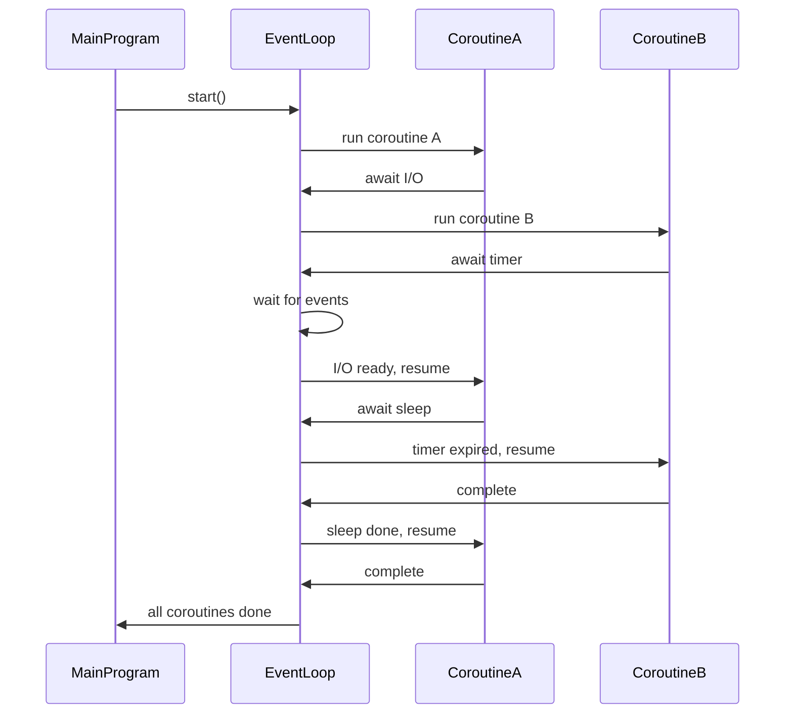

<details> <summary>Table of Contents 🔖</summary>

- [Python Async Capabilities](#python-async-capabilities)
  - [Understanding Asynchronous Programming](#understanding-asynchronous-programming)
  - [Core Concepts and Architecture](#core-concepts-and-architecture)
    - [Event Loop: The Heart of Async Programming](#event-loop-the-heart-of-async-programming)
    - [Coroutines and Tasks](#coroutines-and-tasks)
    - [Async/Await Syntax](#asyncawait-syntax)
  - [Performance Benefits and Optimization](#performance-benefits-and-optimization)
    - [Concurrency vs. Parallelism](#concurrency-vs-parallelism)
  - [Real-World Applications and Use Cases](#real-world-applications-and-use-cases)
    - [Web Development and API Calls](#web-development-and-api-calls)
    - [Database Operations](#database-operations)
    - [File I/O Operations](#file-io-operations)
  - [Advanced Async Patterns and Techniques](#advanced-async-patterns-and-techniques)
    - [Async Context Managers](#async-context-managers)
    - [Async Generators](#async-generators)
    - [Concurrency Control](#concurrency-control)
  - [Error Handling and Debugging](#error-handling-and-debugging)
    - [Exception Handling Patterns](#exception-handling-patterns)
    - [Debugging Async Code](#debugging-async-code)
  - [Performance Considerations and Best Practices](#performance-considerations-and-best-practices)
    - [When to Use Asyncio](#when-to-use-asyncio)
    - [Asyncio vs. Threading vs. Multiprocessing](#asyncio-vs-threading-vs-multiprocessing)
    - [Optimization Strategies](#optimization-strategies)
- [References](#references)

</details>

---
# Python Async Capabilities
>A Comprehensive Guide to Asynchronous Programming

Asynchronous programming capabilities have revolutionized how we write concurrent code, *enabling developers to build high-performance applications that can handle thousands of simultaneous operations without the overhead of traditional threading*. This comprehensive guide explores the fundamentals of async programming in Python, connecting **key concepts**, examining **related topics**, and providing **practical insights** for real-world applications.

## Understanding Asynchronous Programming
**The fundamental principle** behind async programming is **cooperative multitasking**[^1]. ==Tasks must cooperate by announcing when they are ready to be switched out, typically when they encounter an `await` expression==.

> [!INFO]
> Unlike traditional synchronous programming where tasks execute sequentially, asynchronous programming enables tasks to pause and resume their execution, allowing other operations to proceed while waiting for I/O operations to complete [^2].

This approach is particularly **beneficial for I/O-bound operations** such as *network requests*, *file operations*, or *database queries*, where the program would otherwise spend most of its time **waiting for external resources**[^3].

## Core Concepts and Architecture

### Event Loop: The Heart of Async Programming
Is the ==**central coordinator**== of asynchronous operations in Python[^4]. It maintains a queue of tasks and **continuously monitors for events** that trigger these tasks. When an event occurs, the event loop executes the corresponding task, and if a task is waiting for an I/O operation, the event loop can pause that task and execute other tasks in the meantime[^5].

> [!TIP]
> In _spirit_, the event loop **is like the kernel's scheduling mechanism** — just a simpler, user-space cooperative scheduler.

The event loop operates on a simple principle: "Don't call us, we'll call you"[^5]. Instead of the program calling a function when needed, *the program registers a callback with the event loop, which calls the function when the event occurs*. This mechanism **enables non-blocking I/O operations** and efficient resource utilization[^6].



### Coroutines and Tasks
**Coroutines** are the fundamental building blocks of asyncio programming[^7]. Defined with the `async def` syntax, coroutines are special functions that can suspend and resume their execution, making them ideal for I/O-bound operations. *When a coroutine encounters an `await` expression, it effectively signals the event loop to pause its execution and resume later*[^7].

**Tasks** are wrappers around coroutines that facilitate their management and execution in the event loop[^7]. Created by calling `asyncio.create_task(coroutine)`, tasks **are scheduled to run on the event loop and can be awaited or used to obtain results and handle exceptions**[^7].

### Async/Await Syntax
The `async` and `await` keywords form the foundation of asynchronous programming in Python[^4]. The `async` keyword converts a Python function into a coroutine, while `await` suspends the currently executing coroutine until the awaited operation completes[^4].

```python
import asyncio

async def fetch_data():
    print("Fetching data...")
    await asyncio.sleep(2)  # Simulate async operation
    return "Data received!"

async def main():
    result = await fetch_data()
    print(result)

asyncio.run(main())
```

This way one coroutine is tied to the other, once it finishes the execution the other will then execute, but you may think:

> [!QUESTION] Calling an async function (fetch_data) will make the caller (main) also async?
> **No**, simply _calling_ an `async` function does **not** make the caller itself `async`.  
What _does_ force you to mark the caller as `async` is **awaiting** the coroutine it returns.
> 
> But is important to notice that:
> - **Calling an async function (`fetch_data()`) produces a coroutine object**, this means that the function won't be executed.
> - **Awaiting that coroutine** requires your caller to be `async`.
> - Therefore, if you want to await it directly, you must make the caller `async`.
> - But calling alone doesn’t automatically make the caller `async`.

## Performance Benefits and Optimization
Research shows that applications utilizing asyncio can exhibit up to **30% improved throughput** compared to traditional approaches[^8]. For I/O-bound workloads, applications leveraging non-blocking I/O can experience performance improvements of up to **300%** compared to synchronous approaches[^8].
Statistical data indicates that *optimal* coroutine management can decrease response times by as much as **70%**[^8]. Developers have reported that refactoring to async/await structure not only reduces code complexity but also leads to fewer bugs, with a noted reduction in debugging time by **40%**[^8].

### Concurrency vs. Parallelism
It's crucial to understand that asyncio provides **concurrency** rather than true **parallelism**[^1]. Asyncio operates on a single thread and uses cooperative multitasking to handle multiple tasks concurrently. The performance advantage comes from efficiently managing tasks that involve waiting, such as I/O operations, rather than utilizing multiple CPU cores[^1].


> Comparisons of Python concurrency models showing their characteristics and use cases

## Real-World Applications and Use Cases

### Web Development and API Calls
Asyncio **shines in web development scenarios** where applications need to handle multiple HTTP requests simultaneously[^9]. Web scraping applications can perform multiple requests in parallel, dramatically reducing the time required to gather data from multiple sources[^9].

```python
import aiohttp
import asyncio

async def fetch_url(session, url):
    async with session.get(url) as response:
        return await response.text()

async def main():
    urls = ["https://example.com", "https://httpbin.org/delay/1"]
    
    async with aiohttp.ClientSession() as session:
        tasks = [fetch_url(session, url) for url in urls]
        results = await asyncio.gather(*tasks)
        print(f"Fetched {len(results)} pages")

asyncio.run(main())
```
> Find more about [`httpbin`](https://github.com/postmanlabs/httpbin) here.

### Database Operations
Asyncio is particularly valuable for database applications that need to handle multiple queries simultaneously[^9]. By using async database drivers, applications can perform multiple database operations concurrently without blocking the main thread[^10].

### File I/O Operations
For applications that need to read or write multiple files, asyncio can perform these operations concurrently, improving performance and reducing the time required to complete file operations[^9].

## Advanced Async Patterns and Techniques

### Async Context Managers
Enable proper resource management in async environments[^11]. They implement the `__aenter__()` and `__aexit__()` methods, allowing for asynchronous setup and teardown logic[^11].

```python
class AsyncContextManager:
    async def __aenter__(self):
        print("Entering context: Setup logic here...")
        return self
    
    async def __aexit__(self, exc_type, exc_val, exc_tb):
        print("Exiting context: Teardown logic here...")

async def main():
    async with AsyncContextManager():
        print("Inside context: Your async code here...")
```

### Async Generators
Combine the power of generators with asynchronous programming [^12]. They **enable the creation of asynchronous iterators that can yield values on demand** while performing asynchronous operations[^12].

```python
import asyncio

async def async_range(start, end):
    for i in range(start, end):
        await asyncio.sleep(0.5)
        yield i

async def main():
    async for i in async_range(0, 5):
        print(i)

asyncio.run(main())
```

### Concurrency Control
Managing the number of concurrent operations is crucial for preventing **resource exhaustion**[^13]. Asyncio provides **semaphores** and other synchronization primitives to control concurrency:

```python
async def gather_with_concurrency(n, *coros):
    semaphore = asyncio.Semaphore(n)
    
    async def sem_coro(coro):
        async with semaphore:
            return await coro
    
    return await asyncio.gather(*(sem_coro(c) for c in coros))
```

> [!TIP]
> Let’s say you have 10 coroutines and `n=3`.
> - Gather starts them all.
> - First 3 acquire the semaphore (count goes from 3 → 0).
> - Others wait.
> - As soon as any of the first 3 finishes:
>     - The semaphore releases (count increments).
>     - One waiting coroutine acquires the semaphore and starts running.
> This continues until all are done.

## Error Handling and Debugging

### Exception Handling Patterns
Proper error handling is crucial in asynchronous applications[^14]. Asyncio provides several mechanisms for handling exceptions within coroutines and tasks:

```python
async def main():
    try:
        task1 = asyncio.create_task(risky_operation())
        task2 = asyncio.create_task(another_operation())
        
        results = await asyncio.gather(task1, task2, return_exceptions=True)
        
        for result in results:
            if isinstance(result, Exception):
                print(f"Handled exception: {result}")
            else:
                print(f"Result: {result}")
    except Exception as e:
        print(f"Unhandled exception: {e}")
```

### Debugging Async Code
Debugging asynchronous code requires special techniques due to the concurrent nature of task execution[^14]. Enable asyncio debug mode to get detailed logs and warnings:

```python
import asyncio
import logging

logging.basicConfig(level=logging.DEBUG)

async def main():
    pass # Your async code here

asyncio.run(main(), debug=True) # Enable debug mode
```

## Performance Considerations and Best Practices

### When to Use Asyncio
Asyncio is most effective for **I/O-bound tasks** where the performance bottleneck is waiting for external resources rather than CPU computations[^7]. Common use cases include:
- Web servers handling multiple concurrent requests
- Database applications performing multiple queries
- Network applications managing multiple connections
- File processing applications working with multiple files

### Asyncio vs. Threading vs. Multiprocessing
Understanding when to use each concurrency model is crucial[^15]:
- **Asyncio**: Best for I/O-bound tasks with high concurrency requirements
- **Threading**: Suitable for I/O-bound tasks with moderate concurrency
- **Multiprocessing**: Ideal for CPU-intensive tasks requiring true parallelism

Performance comparisons show that asyncio can be **3.5 times faster** than threading for I/O-bound operations[^16]. This performance advantage comes from the elimination of **context switching overhead** and the **Global Interpreter Lock (GIL)** limitations that affect threading[^16].

### Optimization Strategies
1. **Use async/await consistently**: Maintain the async context throughout your application to avoid blocking the event loop[^17]
2. **Limit concurrency**: Use semaphores to prevent overwhelming external resources[^8]
3. **Optimize I/O operations**: Use async-compatible libraries like `aiohttp` for HTTP requests and `aiofiles` for file operations[^8]
4. **Monitor performance**: Use profiling tools (table below) to identify bottlenecks and optimize accordingly[^8]

| Tool                  | What it does                                    |
| --------------------- | ----------------------------------------------- |
| `cProfile` (built-in) | Measures function call times and counts         |
| `timeit` (built-in)   | Measures execution time of a small code snippet |
| `line_profiler`       | Measures execution time per line in a function  |
| `memory_profiler`     | Measures memory usage line by line              |
| `py-spy`              | Sampling profiler, good for production          |
| `asyncio debug mode`  | Checks for slow coroutines and blocking calls   |
| `tracemalloc`         | Tracks memory allocations                       |

---

The Python asyncio ecosystem continues to evolve rapidly, with new libraries and frameworks being developed to support asynchronous programming[^18]. Popular frameworks like [FastAPI](https://fastapi.tiangolo.com), [Sanic](https://sanic.dev/en/), and [Quart](https://quart.palletsprojects.com/en/latest/) leverage asyncio to provide high-performance web applications[^19].

The integration of asyncio with other Python features, such as type hints and `dataclasses`, continues to improve the developer experience. Modern Python versions have refined `asyncio`'s API, making it more intuitive and powerful for building concurrent applications[^18].

While asyncio excels at I/O-bound tasks, it's important to **recognize its limitations** and choose the right **concurrency model** for your specific use case. With proper implementation and optimization, asyncio can deliver significant performance improvements and enable the development of highly scalable Python applications.

# References
[^1]: https://www.theserverside.com/tutorial/Asynchronous-programming-in-Python-tutorial
[^2]: https://raccoon.ninja/pt/post/dev/basics-of-asyncio-in-python/
[^3]: https://www.geeksforgeeks.org/python/python-async/
[^4]: https://www.geeksforgeeks.org/python/asyncio-in-python/
[^5]: https://www.patricksoftwareblog.com/introduction_to_asyncio_in_python.html
[^6]: https://www.reddit.com/r/Python/comments/16z1mpy/seasoned_python_developer_no_understanding_of/
[^7]: https://30dayscoding.com/blog/asynchronous-programming-in-python-mastering-async-and-await
[^8]: https://www.lambdatest.com/blog/python-asyncio/
[^9]: https://www.velotio.com/engineering-blog/async-features-in-python
[^10]: https://daily.dev/blog/get-to-know-asynchio-multithreaded-python-using-asyncawait
[^11]: https://superfastpython.com/python-asyncio/
[^12]: https://www.youtube.com/watch?v=Qb9s3UiMSTA
[^13]: https://bbc.github.io/cloudfit-public-docs/asyncio/asyncio-part-1.html
[^14]: https://docs.python.org/3/library/asyncio.html
[^15]: https://www.reddit.com/r/Python/comments/yqrr94/python_asyncio_the_complete_guide/
[^16]: https://realpython.com/python-async-features/
[^17]: https://realpython.com/async-io-python/
[^18]: https://discuss.python.org/t/what-are-the-advantages-of-asyncio-over-threads/2112
[^19]: https://stackoverflow.com/questions/48483348/how-to-limit-concurrency-with-python-asyncio
