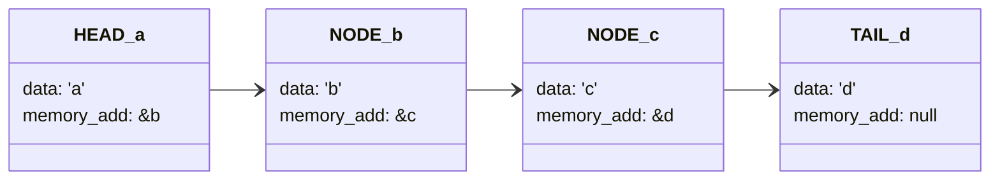

- [Definition](#definition)
- [Characteristics of data structures](#characteristics-of-data-structures)
- [Why are data structures important?](#why-are-data-structures-important)
- [How are data structures used?](#how-are-data-structures-used)
- [Data types](#data-types)
- [How to choose a data structure](#how-to-choose-a-data-structure)
- [Types of data structures](#types-of-data-structures)
	- [Arrays](#arrays)
	- [Linked list.](#linked-list)
	- [Stack#](#stack)
	- [Queue#](#queue)
	- [Hash Table (or Map)](#hash-table-or-map)
		- [Hashing (Hash Function)](#hashing-hash-function)
		- [Good Hash Functions](#good-hash-functions)
	- [Binary Tree#](#binary-tree)
	- [Heap#](#heap)
	- [Graph](#graph)
	- [Trie](#trie)
- [Some real-world examples include:](#some-real-world-examples-include)

## Definition

A data structure is a specialized format **for organizing, processing, retrieving and storing data**. There are several basic and advanced types of data structures, all designed to arrange data to suit a specific purpose. Data structures make it easy for users to access and work with the data they need in appropriate ways. Most importantly, data structures frame the organization of information so that machines and humans can better understand it.

In computer science and computer programming, a data structure may be selected or designed to store data for the purpose of using it with various [algorithms](https://www.techtarget.com/whatis/definition/algorithm). In some cases, the algorithm's basic operations are tightly coupled to the data structure's design. Each data structure contains information about the data values, relationships between the data and -- in some cases -- functions that can be applied to the data.

For instance, in an [object-oriented programming](https://www.techtarget.com/searchapparchitecture/definition/object-oriented-programming-OOP) language, the data structure and its associated methods are bound together as part of a class definition. In non-object-oriented languages, there may be functions defined to work with the data structure, but they are not technically part of the data structure.

## Characteristics of data structures

Data structures are often classified by their characteristics. The following three characteristics are examples:

1.  **Linear or non-linear.** This characteristic describes whether the data items are arranged in sequential order. Describles *cronological* and *unordered* data respectivily. Such as with an array, or in an unordered sequence, such as with a graph.

2.  **Homogeneous or heterogeneous.** This characteristic describes whether all data items in a given repository *are of the same type or not*. One example is a collection of elements in an array, or of various types, such as an abstract data type defined as a structure in C or a class specification in Java.

3.  **[Static or dynamic](https://www.techtarget.com/searchnetworking/definition/dynamic-and-static).** This characteristic *describes how the data structures are compiled*.
	-  Static data structures have **fixed** sizes, structures and memory locations at compile time.
	-  Dynamic data structures have sizes, structures and memory locations that **can shrink or expand**, depending on the use.


## Why are data structures important?

Typical base [data types](https://www.techtarget.com/searchapparchitecture/definition/data-type), such as integers or floating-point values, that are available in most computer programming languages are generally insufficient to capture the logical intent for data processing and use. Yet applications that ingest, manipulate and produce information must understand how data should be organized to simplify processing. Data structures bring together the data elements in a logical way and facilitate the effective use, persistence and sharing of data. They provide a formal model that describes the way the data elements are organized.

Data structures are the [building blocks for more sophisticated applications](https://www.techtarget.com/searchdatamanagement/feature/Why-understanding-data-structures-is-so-important-to-coders). They are designed by composing data elements into a logical unit representing an abstract data type that has relevance to the algorithm or application. An example of an abstract data type is a "customer name" that is composed of the character strings for "first name," "middle name" and "last name."

It is not only important to use data structures, but it is also important to choose the proper data structure for each task. Choosing an ill-suited data structure could result in slow [runtimes](https://www.techtarget.com/searchsoftwarequality/definition/runtime) or unresponsive code. Five factors to consider when picking a data structure include the following:

1.  What kind of information will be stored?
2.  How will that information be used?
3.  Where should data persist, or be kept, after it is created?
4.  What is the best way to organize the data?
5.  What aspects of memory and storage reservation management should be considered?

## How are data structures used?

In general, data structures are used to implement the physical forms of abstract [data types](https://www.techtarget.com/searchapparchitecture/definition/data-type). Data structures are a crucial part of designing efficient software. They also play a critical role in algorithm design and how those algorithms are used within computer programs.

Early programming languages -- [such as Fortran, C and C++](https://www.techtarget.com/searchwindowsserver/definition/C) -- enabled programmers to define their own data structures. Today, many programming languages include an extensive collection of built-in data structures to organize code and information. For example, [Python](https://www.techtarget.com/whatis/definition/Python) lists and dictionaries, and [JavaScript](https://www.theserverside.com/definition/JavaScript) arrays and objects are common coding structures used for storing and retrieving information.

Software engineers use algorithms that are tightly coupled with the data structures -- such as lists, queues and mappings from one set of values to another. This approach can be fused in a variety of applications, including managing collections of records in a [relational database](https://www.techtarget.com/searchdatamanagement/definition/relational-database) and creating an index of those records using a data structure called a binary tree.

Some examples of how data structures are used include the following:

-   **Storing data.** Data structures are used for [efficient data persistence](https://www.techtarget.com/searchapparchitecture/answer/What-is-the-best-pattern-to-use-for-data-persistence), such as specifying the collection of attributes and corresponding structures used to store records in a database management system.
-   **Managing resources and services.** Core operating system (OS) resources and services are enabled through the use of data structures such as linked lists for memory allocation, file directory management and file structure trees, as well as process scheduling queues.
-   **Data exchange.** Data structures define the organization of information shared between applications, such as TCP/IP packets.
-   **Ordering and sorting.** Data structures such as binary search trees -- also known as an ordered or sorted binary tree -- provide efficient methods of sorting objects, such as character strings used as tags. With data structures such as [**priority queues**](./priority_list.md), programmers can manage items organized according to a specific priority.
-   **Indexing**. Even more sophisticated data structures such as B-trees are used to index objects, such as those stored in a database.
-   **Searching.** Indexes created using binary search trees, B-trees or hash tables speed the ability to find a specific sought-after item.
-   **Scalability.** Big data applications use data structures for allocating and managing data storage across distributed storage locations, ensuring scalability and performance. Certain big data programming environments -- such as [Apache Spark](https://www.techtarget.com/searchdatamanagement/definition/Apache-Spark) -- provide data structures that mirror the underlying structure of database records to simplify querying.

## Data types

If data structures are the building blocks of algorithms and computer programs, the primitive -- or base -- data types are the building blocks of data structures. The typical base data types include the following:

-   **[Boolean](https://www.techtarget.com/whatis/definition/Boolean)**, which stores logical values that are either true or false.
-   **integer**, which [stores a range on mathematical integers](https://www.theserverside.com/blog/Coffee-Talk-Java-News-Stories-and-Opinions/int-vs-Integer-java-difference-comparison-primitive-object-types) -- or counting numbers. Different sized integers hold a different range of values -- e.g., a signed 8-bit integer holds values from -128 to 127, and an unsigned long 32-bit integer holds values from 0 to 4,294,967,295.
-   **Floating-point numbers**, which store a formulaic representation of real numbers.
-   **Fixed-point numbers**, which are used in some programming languages and hold real values but are managed as digits to the left and the right of the decimal point.
-   **Character**, which uses symbols from a defined mapping of integer values to symbols.
-   **Pointers,** which are reference values that point to other values.
-   **String**, which is an array of characters followed by a stop code -- usually a "0" value -- or is managed using a length field that is an integer value.


> The data structure hierarchy shows how data types and data structures are related.

## How to choose a data structure

When choosing a data structure for a program or application, developers should consider the answers to the following three questions:

1.  **Supported operations.** What functions and operations does the program need?
2.  **Computational complexity.** What level of computational performance is tolerable? For speed, a data structure whose operations execute in time linear to the number of items managed -- using [Big O Notation: O(n)](./big_o_notation.md) (https://lankydan.dev/2017/04/23/learning-big-o-notation-with-on-complexity) -- will be faster than a data structure whose operations execute in time proportional to the square of the number of items managed -- O(n^2).
3.  **Programming elegance.** Are the organization of the data structure and its functional interface easy to use?


## Types of data structures

The data structure type used in a particular situation is determined by the type of operations that will be required or the kinds of algorithms that will be applied. The various data structure types include the following:

### Arrays

An array stores a collection of items at adjoining memory locations. Items that are the same type are stored together so the position of each element can be calculated or retrieved easily by an index. Arrays can be fixed or flexible in length depending of the language.


> An array can hold a collection of integers, floating-point numbers, stings or even other arrays.

To define an Array in `C`:
```c
>>> int numbers[3] = {1, 2, 3};
```

But in some languages like `JavaScript`, the size of these elements can be mofified with the `.push()` method. Behind the scenes what the program will do is:
	1. Check if there's space for the new feature in the next block of memory. 
	2. If not possible,
		1. The program will allocate a new space in memory where the Array fits.
		2. Move all the features to each new space.
		3. Free the previous allocated space.
		4. Push (or append) the newly feature into the Array. 


For the Mixed Type Arrays, the program will verify the maximum length (bites) of the elements and alocate this amount of bits for the others.

```javascript
>>> const mixed = [true, 7, "druid"];
//			       1bite,2b, 5bites
```

The "problem" is that it will store more space in memory that it actually needs.

**Operations**:
- Add new element `O(n)`
- Remove element `O(n)`
- Accessing an element `O(1)`

### Linked list.

A linked list stores a collection of items in a linear order. Each element, or **node**, in a linked list contains a data item, as well as a reference ([pointer](../C/Pointers.md)), or link, to the next item in the list. **Please see [code example](../PYTHON/code/linked_list.py) made in Python.**


> Linked list data structures are a set of nodes that contain data and the address or a pointer to the next node.

	Imagine you have a lot of cards and you want to put them in order. A linked list is like having all your cards on a table, and each card has an arrow pointing to the next card. The first card is special because it doesn't have an arrow pointing to it.
	In this program, we have a special card called LinkedListNode. Each card has a "key" and a "value" written on it, like a word and its definition. When we create a new card, we give it a key and a value.
	We can add new cards to the list using the "insert" function. When we add a new card, we look at the first card on the table and follow its arrow to the next card. If there isn't a next card, we add our new card there. If there is a next card, we go to that card and repeat the process until we find a place to put our new card.
	We can also add a new card after a specific index in the list using the "insertAfterIndex" function. This function looks at each card in the list until it finds the card at the given index. It then puts the new card after that card.
	We can remove a card from the list using the "removeAtIndex" function. This function also looks at each card in the list until it finds the card at the given index. It then removes that card from the list.
	Finally, we can print out all the cards in the list using the "printList" function. This function looks at each card in the list and prints out its key and value.

The advantage is that Linked List don't use consecutive slots of memory, making them easier to manuplulate. They're faster, and the nodes can have multiple types of elemnts.



**Operations:**
- Add new element `O(1)`
- Remove element `O(1)`
- Accessing an element `O(n)`

### Stack[#](https://www.techtarget.com/whatis/definition/stack)

Commonly used in algorithms such as depth-first search, expression evaluation, and backtracking. *A stack stores a collection of items in the linear order* that operations are applied. The order is generaly reffered as **Last-in-Fisrt-Out ([`LIFO`](../Other/lifo_fifo.md))**. You can relate as a pile of plates, one on top of another.
> could be first in, first out ([FIFO](https://www.techtarget.com/whatis/definition/FIFO-first-in-first-out))?

 The basic **operations** that can be performed on a stack include **push**, **pop**, **peek**, and **is_empty**.
 - `is_empty()` operation is used to check if the stack is empty. `O(1)`
 - `push(value)` operation is used to add an element to the top of the stack. `O(1)`
 - `pop()` operation is used to remove the top element from the stack. `O(1)`
 - `peek()` operation is used to view the top element without removing it. `O(1)`
 - `size()` returns the current size of the Stack. `O(1)`

In pure `C` we need to create every method as a function that will be called in `main()`. Please see the [full code](../C/code/stack_implementation.c).
Other difference the need to create the space in the memory before allocating the element.

```c
// Stack implementation in C
// [...]
// Main
int	main()
{
	int ch;
	st *s = (st *)malloc(sizeof(st));

	createEmptyStack(s);

	push(s, 1);
	push(s, 2);
	push(s, 3);
	push(s, 4);

	printStack(s);

	pop(s);

	printf("\nAfter popping out\n");
	printStack(s);
}
```

For Python is quite simpler:

```python
class Stack:  
	def __init__(self):
		self.items = []
	def push(self, item):
		self.items.append(item)
	def pop(self):
		return self.items.pop()
	def peek(self):
		return self.items[-1]
	def is_empty(self):
		return len(self.items) == 0
```

A **real-world** example is
- an `undo / redo` feature, that stores a stack list of every action or command executed and in a moment of need, the program can retrive the steps in a reverse order 
- to do a backtrack, like a make solve program that count the steps taken if it hits a dead end. 

### Queue[#](https://www.techtarget.com/whatis/definition/queue)

Commonly used in algorithms such as breadth-first search, scheduling, and simulations. *A queue stores a collection of items like a stack*; however, **the operation order can only be first in, first out (*FIFO*)**. You can relate as a row of people to buy some tickets, the first to arrive is the first to leave.
https://www.programiz.com/dsa
There are four different types of queues:
-   Simple Queue
-   Circular Queue
-   Priority Queue
-   Double Ended Queue

The basic operations that can be performed on a queue include **enqueue**, **dequeue**, **peek**, and **is_empty**.
- `enqueue()` operation is used to add an element to the back of the queue. `O()`
- `dequeue()` operation is used to remove the front element from the queue. `O()`
- `peek()` now sees the **first** element. `O()`
- `size()`: returns the size of the Queue. `O()`
- `isEmpty()`: check if the queue is empty. `O()`
- `isFull()`: check if the queue is full. `O()`

In pure `C` we need to create every method as a function that will be called in `main()`. Please see the [full code](../C/code/queue_implementation.c).

```c
// Queue implementation in C
// [...]
// Main
int main()
{
  // Try to deQueue from an empty queue.
  deQueue();
  // Enqueue 5 elements to the queue.
  enQueue(1);
  enQueue(2);
  enQueue(3);
  enQueue(4);
  enQueue(5);
  // Try to enqueue a 6th element, which won't be possible because the queue is full.
  enQueue(6);
  // Display the elements of the queue.
  display();
  // Dequeue the first element from the queue, which is 1.
  deQueue();
  // Display the updated elements of the queue.
  display();
  // Return 0 to indicate successful execution of the program.
  return (0);
}
```

To create a Queue in Python is "simpler":

```python
class Queue:  
	def __init__(self):
		self.items = []
	def enqueue(self, item):
		self.items.append(item)
	def dequeue(self):
		return self.items.pop(0)
	def peek(self):
		return self.items[0]
	def is_empty(self):
		return len(self.items) == 0
```

A **real-world** example is
- an application that handles booking reservations, or tickets, each new ticket enters in a line of precedence.

### Hash Table (or Map)

A hash table -- also known as a hash map -- stores a collection of items in an associative array that plots keys to values. A hash table uses a hash function to convert an index into an array of buckets that contain the desired data item.


> Hashing is a data structure technique where key values are converted into indexes of an array where the data is stored.

These are considered complex data structures as they can store large amounts of interconnected data.

**Operations**
- Search `O(1)`
- Insert `O(1)`
- Delete `O(1)`

https://www.programiz.com/dsa/hash-table

The Hash table data structure stores elements in key-value pairs where

-   **Key**\- unique integer that is used for indexing the values
-   **Value** - data that are associated with keys.


#### Hashing (Hash Function)

In a hash table, a new index is processed using the keys. And, the element corresponding to that key is stored in the index. This process is called **hashing**.

Let k be a key and h(x) be a hash function.

Here, h(k) will give us a new index to store the element linked with k.


To learn more, visit [Hashing](https://www.programiz.com/dsa/hashing "Hashing").

#### Good Hash Functions

A good hash function may not prevent the collisions completely however it can reduce their number.

Here, we will look into different methods to find a good hash function

1. Division Method
	If `k` is a key and `m` is the size of the hash table, the hash function `h()` is calculated as:
	`h(k) = k mod m`
	For example, If the size of a hash table is `10` and `k = 112` then `h(k) = 112` mod `10 = 2`. The value of `m` must not be the powers of `2`. This is because the powers of `2` in binary format are `10, 100, 1000, …`. When we find `k mod m`, we will always get the lower order p-bits.

	```
	if m = 22, k = 17, then h(k) = 17 mod 22 = 10001 mod 100 = 01
	if m = 23, k = 17, then h(k) = 17 mod 22 = 10001 mod 100 = 001
	if m = 24, k = 17, then h(k) = 17 mod 22 = 10001 mod 100 = 0001
	if m = 2p, then h(k) = p lower bits of m
	```

2. Multiplication Method
	`h(k) = ⌊m(kA mod 1)⌋`
	where,
	-   `kA mod 1` gives the fractional part `kA`,
	-   `⌊ ⌋` gives the floor value
	-   `A` is any constant. The value of `A` lies between 0 and 1. But, an optimal choice will be `≈ (√5-1)/2` suggested by Knuth.

3. Universal Hashing
	In Universal hashing, the hash function is chosen at random independent of keys.


### Binary Tree[#](https://www.techtarget.com/whatis/definition/heap)

A tree stores a collection of items in an abstract, hierarchical way. Each node is associated with a key value, with parent nodes linked to child nodes -- or subnodes. There is one root node that is the ancestor of all the nodes in the tree.


> A binary search tree is a set of nodes where each has a value and can point to two child nodes.

### Heap[#](https://www.techtarget.com/whatis/definition/heap)
A heap is a tree-based structure in which each parent node's associated key value is greater than or equal to the key values of any of its children's key values.

### Graph
A graph stores a collection of items in a nonlinear fashion. Graphs are made up of a finite set of nodes, also known as vertices, and lines that connect them, also known as edges. These are useful for representing real-world systems such as computer networks.

### Trie
A trie, also known as a keyword tree, is a data structure that stores strings as data items that can be organized in a visual graph.


--- 
## Some real-world examples include:

-   **Linked lists** are best if a program is managing a collection of items that don't need to be ordered, constant time is required for adding or removing an item from the collection and increased search time is OK.
-   **Stacks** are best if the program is managing a collection that needs to support a LIFO order.
-   **Queues** should be used if the program is managing a collection that needs to support a FIFO order.
-   **Binary trees** are good for managing a collection of items with a parent-child relationship, such as a family tree.
-   **Binary search trees** are appropriate for managing a sorted collection where the goal is to optimize the time it takes to find specific items in the collection.
-   **Graphs** work best if the application will analyze connectivity and relationships among a collection of individuals in a social media network.