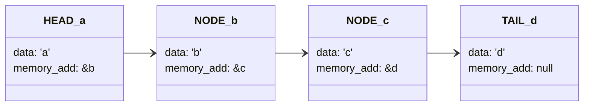

 
Table of Contents

- [Intro](#intro)
- [Operations:](#operations)
- [Code](#code)

---

# Intro

A linked list stores a collection of items in a linear order. Each element, or **node**, in a linked list contains a data item, as well as a reference ([pointer](../C/Pointers.md)), or link, to the next item in the list. **Please see [code example](../PYTHON/code/linked_list.py) made in Python.**

> Linked list data structures are a set of nodes that contain data and the address or a pointer to the next node.

	Imagine you have a lot of cards and you want to put them in order. A linked list is like having all your cards on a table, and each card has an arrow pointing to the next card. The first card is special because it doesn't have an arrow pointing to it.
	In this program, we have a special card called LinkedListNode. Each card has a "key" and a "value" written on it, like a word and its definition. When we create a new card, we give it a key and a value.
	We can add new cards to the list using the "insert" function. When we add a new card, we look at the first card on the table and follow its arrow to the next card. If there isn't a next card, we add our new card there. If there is a next card, we go to that card and repeat the process until we find a place to put our new card.
	We can also add a new card after a specific index in the list using the "insertAfterIndex" function. This function looks at each card in the list until it finds the card at the given index. It then puts the new card after that card.
	We can remove a card from the list using the "removeAtIndex" function. This function also looks at each card in the list until it finds the card at the given index. It then removes that card from the list.
	Finally, we can print out all the cards in the list using the "printList" function. This function looks at each card in the list and prints out its key and value.

The advantage is that Linked List don't use consecutive slots of memory, making them easier to manuplulate. They're faster, and the nodes can have multiple types of elemnts.

# Operations:
- Add new element `O(1)`
- Remove element `O(1)`
- Accessing an element `O(n)`

# Code
