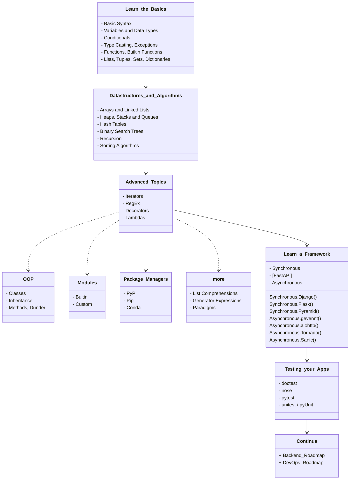
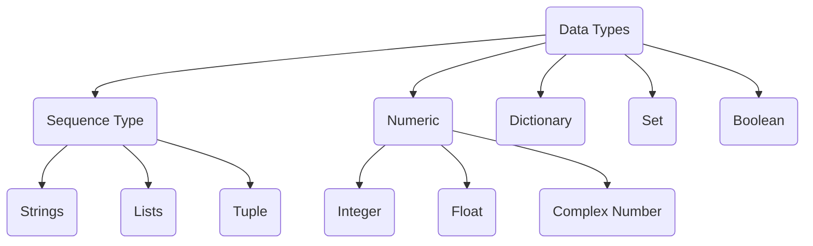

<details> <summary>Table of Contents</summary>

- [RoadMap](#roadmap)
- [Learn\_the\_Basics](#learn_the_basics)
	- [Basic Syntax](#basic-syntax)
	- [Variables and Data Types](#variables-and-data-types)
	- [Conditionals](#conditionals)
	- [Typecasting](#typecasting)
		- [Errors and Exceptions #](#errors-and-exceptions-)
	- [Functions](#functions)
		- [Argument x Parameter](#argument-x-parameter)
		- [Return](#return)
	- [Lists, Tuples, Sets, and Dictionaries](#lists-tuples-sets-and-dictionaries)
- [Datastructures and Algorithms](#datastructures-and-algorithms)
	- [Arrays and Linked Lists](#arrays-and-linked-lists)
	- [Heaps, Stacks and Queues](#heaps-stacks-and-queues)
	- [Hash Tables](#hash-tables)
	- [Binary Search Trees](#binary-search-trees)
	- [Recursion](#recursion)
	- [Sorting Algorithms](#sorting-algorithms)
- [Advanced Topics](#advanced-topics)
	- [Object-oriented Programming - OOP](#object-oriented-programming---oop)
	- [Iterators](#iterators)
	- [RegEx](#regex)
	- [Decorators](#decorators)
	- [Lambdas](#lambdas)
	- [Modules](#modules)
		- [Builtin](#builtin)
		- [Custom](#custom)
	- [Package Managers](#package-managers)
		- [PyPi](#pypi)
		- [Pip](#pip)
		- [Conda](#conda)
	- [Other](#other)
		- [List Comprehensions](#listcomprehensions)
		- [Generator Expressions](#generator-expressions)
		- [Paradigms](#paradigms)
- [Learn a Framework](#learn-a-framework)
- [Testing your Apps](#testing-your-apps)
- [Continue](#continue)
	- [Libraries](#libraries)

</details>

---

# RoadMap
> Edited from [© roadmap.sh](https://roadmap.sh/python)


---

# Learn_the_Basics

Python is a high-level, interpreted, general-purpose programming language. Its design philosophy emphasizes code readability with the use of significant indentation. Python is dynamically-typed and garbage-collected.

## Basic Syntax

Setup the environment for python and get started with the basics.

Visit the following resources to learn more:
-	[W3Schools - Python](https://www.w3schools.com/python/)
-	[Python for Beginners - Learn Python in 1 Hour](https://www.youtube.com/watch?v=kqtD5dpn9C8)
-	[Python Basics](https://www.tutorialspoint.com/python/python_basic_syntax.htm)
-	[Learn X in Y Minutes / Python](https://learnxinyminutes.com/docs/python/)

## Variables and Data Types

Variables are used to store information to be referenced and manipulated in a computer program. They also provide a way of labeling data with a descriptive name, so our programs can be understood more clearly by the reader and ourselves. It is helpful to think of variables as containers that hold information. Their sole purpose is to label and store data in memory. This data can then be used throughout your program.

And a bit more intricate: each variable is an instance of a data type class (e.g. `<class 'int'>`)

```python
item = 7
print(type(item))
```



Visit the following resources to learn more:
-	[Variables in Python](https://realpython.com/python-variables)
-	[W3Schools — Python Variables](https://www.w3schools.com/python/python_variables.asp)
-	[Python Variables - Geeks for Geeks](https://www.geeksforgeeks.org/python-variables/)
-	[Python Data Types](https://www.w3schools.com/python/python_datatypes.asp)
-	[Basic Data Types in Python](https://realpython.com/python-data-types/)
-	[Python for Beginners: Data Types](https://thenewstack.io/python-for-beginners-data-types/)

## Conditionals

Conditional Statements in Python perform different actions depending on whether a specific condition evaluates to true or false. Conditional Statements are handled by `IF`-`ELIF`-`ELSE` statements and `MATCH`-`CASE` statements in Python.

Visit the following resources to learn more:
-	[Python Conditional Statements: IF…Else, ELIF & Switch Case](https://www.guru99.com/if-loop-python-conditional-structures.html)
-	[Conditional Statements in Python](https://realpython.com/python-conditional-statements/)
-	[How to use a match statement in Python](https://learnpython.com/blog/python-match-case-statement/)

## Typecasting

The process of converting the value of one data type (integer, string, float, etc.) to another data type is called type conversion. Python has two types of type conversion:

-	**Implicit** - in this, method, Python converts the datatype into another datatype automatically. In this process, users don’t have to involve in this process.

```python
# Python program to demonstrate
# implicit type Casting

# Python automatically converts
# a to int
>>> a = 7
>>> print(type(a))

# Python automatically converts
# b to float
>>> b = 3.0
>>> print(type(b))

# Python automatically converts
# c to float as it is a float addition
>>> c = a + b
>>> print(c)
>>> print(type(c))

# Python automatically converts
# d to float as it is a float multiplication
>>> d = a * b
>>> print(d)
>>> print(type(d))
```

-	**Explicit** - in this method, Python needs user involvement to convert the variable data type into a certain data type in order to the operation required.
	-   **Int():** [Python Int()](https://www.geeksforgeeks.org/python-int-function/) function take float or string as an argument and returns int type object.
	-   **float():** [Python float()](https://www.geeksforgeeks.org/float-in-python/) function take int or string as an argument and return float type object.
	-   **str():** [Python str()](https://www.geeksforgeeks.org/python-str-function/) function takes float or int as an argument and returns string type object.

### Errors and Exceptions [#](https://docs.python.org/3/tutorial/errors.html)

There are (at least) two distinguishable kinds of errors: **syntax errors** and **exceptions**.

Eventualy you'll elaborate a code that [handle with it's own exceptions](https://www.programiz.com/python-programming/exception-handling), using generaly `try` and `except` comands.

Visit the following resources to learn more:
-	[Type Conversion and Casting](https://www.programiz.com/python-programming/type-conversion-and-casting)
-	[Type Casting in Python with Examples](https://www.geeksforgeeks.org/type-casting-in-python-implicit-and-explicit-with-examples/)
-	[Python Exceptions: An Introduction](https://realpython.com/python-exceptions/)
-	[Python Try Except](https://www.w3schools.com/python/python_try_except.asp)

## Functions

In programming, a function is a reusable block of code that executes a certain functionality when it is called. Functions are integral parts of every programming language because they help make your code more modular and reusable.

In Python, you *define* a function with the `def` keyword, then write the function identifier (*name*) followed by parentheses (*parameters*) and a colon, like:

```python
def function_name(parameter1, parameter2):
	#do something
	return something #optional
```

### Argument x Parameter

"*A parameter is the variable listed inside the parentheses in the function definition. An argument is the value that is sent to the function when it is called.*" [_font_](https://stackoverflow.com/questions/156767/whats-the-difference-between-an-argument-and-a-parameter#:~:text=A%20parameter%20is%20the%20variable,function%20when%20it%20is%20called.)


### Return

The use of a function can be only for processing algorithms or just to print an information:
```python
>>> def my_function():
...		print("Hello friend, from a function")

>>> my_function()
```

Or to `return` a value, like a math operation:
```python
>>> def sum(a, b)
...		return (a + b)

>>> print(sum(3, 4))
```

Visit the following resources to learn more:
-	[Python Functions - W3Schools](https://www.w3schools.com/python/python_functions.asp)
-	[Python Functions – How to Define and Call a Function](https://www.freecodecamp.org/news/python-functions-define-and-call-a-function/)
-	[Python Functions](https://www.geeksforgeeks.org/python-functions/)
-	[Built-in Functions in Python](https://docs.python.org/3/library/functions.html)

## Lists, Tuples, Sets, and Dictionaries

-	**Lists**: are just like dynamic sized arrays, declared in other languages (vector in C++ and ArrayList in Java).  *Represented with* `[]`.
	They're non-homogeneous (allows multitype and duplicate elements) and ordered (*index* starts with `0`) data structure that stores the elements in single row and multiple rows and columns, is mutable.
	
	-	The `append()` method adds a single item at the end of the list without modifying the original list.
	-	The `pop()` method removes the item at the given index (*defaut last*) from the list and returns it.
	-	The `sort()` method sorts the elements of a given list in a specific ascending or descending order.
	-	`index()` searches for a given element from the start of the list and returns the lowest index where the element appears.
	-	The `count()` method returns the number of times the specified element appears in the list.
	-	The `reverse()` method reverses the elements of the list.

	```python
	#definition
	>>> lst = list()
	
	#example
	#index 0 1 2  3  4  5
	>>> lst = [1,1,2,'c',4,'e']
	>>> print(lst)
	
	#index/element
	>>> print(lst.index('c'))
	>>> print(lst[3])
	
	#can be modified
	>>> lst.append('f')	#builtin add method
	>>> print(lst)
	>>> lst.pop()	#builtin remove method
	>>> print(lst)
	```
	Aplications:
	-   Used in `JSON` format
	-   Useful for Array operations
	-   Used in Databases

-	**Tuple**: is a collection of Python objects separated by commas. *Represented by* `()`.
	In some ways, a tuple is similar to a list in terms of indexing, nested objects, and repetition but **a tuple is immutable**, unlike lists that are mutable.
	-	The `count()` method returns the number of times a specified value occurs in a tuple.
	-	The `reverse()` method is **not defined** in tuples, as they are unchangeable

	```python
	#definition
	>>> tpl = tuple()
	
	#example
	#index 0 1 2  3  4  5
	>>> tpl = (1,1,2,'c',4,'e')
	>>> print(tpl)
	```
	Aplications
	-	Used to insert records in the database through `SQL` query at a time.
	-	Used in parentheses checker

-	**Set**: is an unordered collection data type that is iterable, mutable, and has no duplicate elements.
	-	The set `add()` method adds a given element to a set.
	-	The `pop()` method removes a random item from the set.
	-	There `count()` method is **not defined** in sets, as they do not allow any duplicates.
	-	The `reverse()` method is **not defined** in sets, they're unordered, which restricts from applying.

	```python
	#definition
	>>> st = set()
	
	#example
	>>> st = (1,1,2,'c',4,'e')
	>>> print(st)
	
	#can be modified
	>>> st.add('f')	#builtin add method
	>>> print(st)
	>>> st.pop()	#builtin remove method
	>>> print(st)
	```
	Aplications
	-   Finding unique elements
	-   Join operations

-	**Dictionary**: In python, Dictionary is a non-homogeneous ordered (since Py 3.7 *[unordered (Py 3.6 & prior)]*) collection of data values, used to store data values like a map, which, unlike other Data Types that hold only a single value as an element, Dictionary holds `key:value` pair. Key-value is provided to make it more optimized. **Note that the Dictionary is mutable. But Keys are not duplicated**.
	-	The `update()` method updates *at the end* the Dictionary with the specified `key-value` pairs.
	-	The `pop()` method removes the specified (*by the key*) item from the dictionary.
	-	`sorted()` method is used to sort the keys in the dictionary by default.
	-	The `get()` method returns the value of the item with the specified key.
	-	The `count()` method is not defined in the dictionary.
	-	The elements cannot be reversed, as the items in the dictionary are in the form of `key-value` pairs

	```python
	#definition
	>>> dic = dict()
	
	#example
	>>> dic={
	...		"key1": 1,
	...		"key3": 2,
	...		"key2": 3
	}
	>>> print(dic)

	#element
	>>> print(dic.get("key2"))

	#can be modified
	>>> dic.update("key4":4)	#builtin add method
	>>> print(dic)
	>>> dic.pop("key4")	#builtin remove method
	>>> print(dic)
	```
	Aplications
	-	Used to create a data frame with lists
	-	Used in `JSON`

Visit the following resources to learn more:
- [Difference Between List, Tuple, Set and Dictionary in Python](https://www.youtube.com/watch?v=n0krwG38SHI)
- [Differences and Applications of List, Tuple, Set and - Dictionary in Python](https://www.geeksforgeeks.org/differences-and-applications-of-list-tuple-set-and-dictionary-in-python/)
- [Tuples vs. Lists vs. Sets in Python](https://jerrynsh.com/tuples-vs-lists-vs-sets-in-python/)
- [Python for Beginners: Lists](https://thenewstack.io/python-for-beginners-lists/)
- [Python for Beginners: When and How to Use Tuples](https://thenewstack.io/python-for-beginners-when-and-how-to-use-tuples/)

# Data Structures and Algorithms

A [Data Structure](../Other/data_structure.md) is a named location that can be used to store and organize data. And, an algorithm is a collection of steps to solve a particular problem. Learning data structures and algorithms allow us to write efficient and optimized computer programs. There're a main division in the pattern:
- **Linear** (Arrays, Linked Lists, Stacks, Queues and Hash Tables)
- **Non-linear** (Binary Tree (hierarchical), Graphs)

## Arrays and Linked Lists

Arrays store elements in contiguous memory locations, resulting in easily calculable addresses for the elements stored and this allows faster access to an element at a specific index. [Linked lists](./code/linked_list.py) are less rigid in their storage structure and elements are usually not stored in contiguous locations, hence they need to be stored with additional tags giving a reference to the next element. *This difference in the data storage scheme decides which data structure would be more suitable for a given situation*. **Needs to be imported with `import array`**. 

Arrays of the array module are a thin wrapper over C arrays, and are useful when you want to work with homogeneous data. They are also more compact and take up less memory and space which makes them more size efficient compared to lists.

If you want to perform mathematical calculations, then you should use [**NumPy**](./numpy.md) (https://www.w3schools.com/python/numpy/numpy_getting_started.asp) arrays (be sure to install [`pip install numpy`]). Besides that, you should just use Python arrays when you really need to, as lists work in a similar way and are more flexible to work with.

Visit the following resources to learn more:

-	[Linked Lists vs Arrays](https://www.geeksforgeeks.org/linked-list-vs-array/)
-	[Python Array Tutorial](https://www.freecodecamp.org/news/python-array-tutorial-define-index-methods/)
-	[Python Arrays](https://www.geeksforgeeks.org/python-arrays/)
-	[Arrays in Python](https://www.edureka.co/blog/arrays-in-python/)
-	[Array Data Structure | Illustrated Data Structures](https://www.youtube.com/watch?v=QJNwK2uJyGs)
-	[Linked List Data Structure | Illustrated Data Structures](https://www.youtube.com/watch?v=odW9FU8jPRQ)

## Heaps, Stacks and Queues

-	**Stacks:** Operations are performed [`LIFO`](../Other/lifo_fifo.md) (last in, first out), which means that the last element added will be the first one removed. A stack can be implemented using an array or a linked list. If the stack runs out of memory, it’s called a stack overflow.

-	**Queue:** Operations are performed [`FIFO`](../Other/lifo_fifo.md) (first in, first out), which means that the first element added will be the first one removed. A queue can be implemented using an array.

-	**Heap:** A tree-based data structure in which the value of a parent node is ordered in a certain way with respect to the value of its child node(s). A heap can be either a min heap (the value of a parent node is less than or equal to the value of its children) or a max heap (the value of a parent node is greater than or equal to the value of its children).

Visit the following resources to learn more:

-   [Heaps, Stacks, Queues](https://stephanosterburg.gitbook.io/scrapbook/coding/coding-interview/data-structures/heaps-stacks-queues)
-   [Python Stacks, Queues, and Priority Queues in Practice](https://realpython.com/queue-in-python/)
-   stacks
	-   [Stack Data Structure | Illustrated Data Structures](https://www.youtube.com/watch?v=I5lq6sCuABE)
	-   [Stack in Python](https://www.geeksforgeeks.org/stack-in-python/)
	-   [How to Implement Python Stack?](https://realpython.com/how-to-implement-python-stack/)
-   heaps
	-   [Heap Implementation in Python](https://www.educative.io/answers/heap-implementation-in-python)
-   queues
	-   [Queue Data Structure | Illustrated Data Structures](https://www.youtube.com/watch?v=mDCi1lXd9hc)
	-   [Queue in Python](https://www.geeksforgeeks.org/queue-in-python/)

## Hash Tables

Hash Table, Map, HashMap, Dictionary or Associative are all the names of the same data structure. It is a data structure that implements a set abstract data type, a structure that can map keys to values.

Visit the following resources to learn more:

-   [Hash Table Data Structure | Illustrated Data Structures](https://www.youtube.com/watch?v=jalSiaIi8j4)
-   [Hash Tables and Hashmaps in Python](https://www.edureka.co/blog/hash-tables-and-hashmaps-in-python/)
-   [Build a Hash Table in Python](https://realpython.com/python-hash-table/)

## Binary Search Trees

A binary search tree, also called an ordered or sorted binary tree, is a rooted binary tree data structure with the key of each internal node being greater than all the keys in the respective node’s left subtree and less than the ones in its right subtree

Visit the following resources to learn more:

-   [Tree Data Structure | Illustrated Data Structures](https://www.youtube.com/watch?v=S2W3SXGPVyU)
-   [How to Implement Binary Search Tree in Python](https://www.section.io/engineering-education/implementing-binary-search-tree-using-python/)
-   [Problem Set](https://www.geeksforgeeks.org/binary-search-tree-data-structure/?ref=gcse)

## Recursion

[Recursion](../Other/recursion.md) is a method of solving a computational problem where the solution depends on solutions to smaller instances of the same problem. Recursion solves such recursive problems by using functions that call themselves from within their own code.

Visit the following resources to learn more:

-   [Recursion in Python](https://www.geeksforgeeks.org/recursion/)
-   [Recursion in Python: An Introduction](https://realpython.com/python-recursion/)

## Sorting Algorithms

[Sorting](../Other/sorting_algo.md) refers to arranging data in a particular format. Sorting algorithm specifies the way to arrange data in a particular order. Most common orders are in numerical or lexicographical order.

The importance of sorting lies in the fact that data searching can be optimized to a very high level, if data is stored in a sorted manner.

Visit the following resources to learn more:

-   [Sorting Algorithms in Python](https://realpython.com/sorting-algorithms-python/)
-   [Python - Sorting Algorithms](https://www.tutorialspoint.com/python_data_structure/python_sorting_algorithms.htm)

# Advanced Topics

## Object-oriented Programming - OOP

In Python, [Object-oriented Programming (OOP)](../Other/OOP.md) is a programming paradigm that uses objects and classes in programming. It aims to implement real-world entities like inheritance, polymorphisms, encapsulation, etc. in the programming. The main concept of OOP is to bind the data and the functions that work on that together as a single unit so that no other part of the code can access this data.

The classes are modules appended in `__main__`, **the environment where top-level code runs**.

```python
class Item:
	def calculate_price(self): # method
		pass

item1 = Item() # create instance
print(type(item)) # <class '__main__.Item'>
```
> in this case `<class '__main__.Item'>`

`self` is a parameter in a method that is automatically passed and refers to the object itself (in this case, the instance of the class) when the method is called. If no parameter is passed, it will result in a `TypeError: calculate_price() takes 0 positional arguments but 1 was given`.

> An alternative to OOP is [Function Programming](https://www.youtube.com/watch?v=ph2HjBQuI8Y)

Visit the following resources to learn more:

-   [Object Oriented Programming in Python](https://realpython.com/python3-object-oriented-programming/)
-   [Python OOP Concepts](https://www.geeksforgeeks.org/python-oops-concepts/)
-   [Object Oriented Programming (OOP) In Python - Beginner Crash Course](https://www.youtube.com/watch?v=-pEs-Bss8Wc/)
-   [OOP in Python One Shot](https://www.youtube.com/watch?v=Ej_02ICOIgs)

### Dunder Methods [#](https://mathspp.com/blog/pydonts/dunder-methods)

Dunder methods, also known as magic methods, are special methods in Python classes that allow instances of a class to interact with built-in functions and operators of the language. The names of dunder methods start and end with two underscores, such as `__str__` or `__add__`. Dunder methods are not invoked directly by the programmer but are called implicitly by the language at specific times.

One commonly used dunder method is `__init__`, which is responsible for initializing an instance of a class. It is similar to a constructor in other programming languages. For example:

```python
class Square:
    def __init__(self, side_length):
        self.side_length = side_length

sq = Square(1)
```

In this example, the `__init__` method initializes the instance of the `Square` class with the provided `side_length` argument.

Dunder methods can also be used to override the behavior of built-in functions and operators. For example, the `__str__` method can be defined to return a string representation of an object when `str()` is called on it:

```python
class Item:
    def __init__(self, name, price, qtd=0):
        self.name = name
        self.price = price
        self.qtd = qtd
	
    def __str__(self):
        return f"Item: {self.name}, Price: {self.price}, Quantity: {self.qtd}"

item = Item("pen", 1.5, 2)
print(str(item))  # Output: Item: pen, Price: 1.5, Quantity: 2
```

By defining the `__str__` method, we can control the string representation of the object.

Regarding class attributes, they are variables defined within a class and can be accessed through instances of the class. Class attributes are shared among all instances of the class. To access a class attribute, you can use the class name followed by a dot (`.`) notation or `self` within an instance method. Modifying the value of a class attribute for a specific instance will only affect that instance. Here's an example:

```python
class Item:
    discount = 0.8  # 20% discount
	
    def __init__(self, name, price, qtd=0):
        self.name = name
        self.price = price
        self.qtd = qtd
	
    def apply_discount(self):
        self.price = self.price * self.discount

item1 = Item("pen", 1.5, 2)
item2 = Item("rubber", 0.5, 1)
item2.discount = 0.9
item2.apply_discount()
print(item1.price)  # Output: 1.2
print(item2.price)  # Output: 0.45
```

In this example, the `discount` attribute is a class attribute shared among all instances of the `Item` class. However, when we modify the `discount` attribute for the `item2` instance, it only affects that instance.

You can also use the `__dict__` attribute to list all the attributes of an object, whether it's a class or an instance.

The `assert` statement is used to perform a runtime check on a condition. If the condition is `False`, it raises an `AssertionError` with an optional error message. It's a way to validate inputs or ensure certain conditions are met. For example:

```python
class Item:
    def __init__(self, name, price, qtd=0):
        assert price >= 0, f"Price {price} is less than zero."
        assert qtd >= 0, f"Quantity {qtd} is less than zero."
		
        self.name = name
        self.price = price
        self.qtd = qtd

item = Item("pen", -1.5, 2)  # Raises AssertionError with the error message
```

In this example, the `assert` statements check if the price and quantity are greater than or equal to zero. If any of these conditions are `False`, an `AssertionError` is raised with the specified error message.

Finally, the concept of instance list refers to a list that keeps track of all instances created from a class. This can be achieved by adding a class attribute that is a list and appending each new instance to that list within the `__init__` method. Here's an example:

```python
class Item:
    all_instances = []
	
    def __init__(self, name, price, qtd=0):
        self.name = name
        self.price = price
        self.qtd = qtd
        Item.all_instances.append(self)

item1 = Item("pen", 1.5, 2)
item2 = Item("notebook", 10, 1)
print(Item.all_instances)  # Output: [item1, item2]
```

In this example, the `all_instances` class attribute is a list that keeps track of all instances created from the `Item` class. Each instance is appended to the list within the `__init__` method.

Inheritance is a fundamental concept in object-oriented programming (OOP) that allows classes to inherit attributes and methods from other classes. It enables the creation of a hierarchy of classes, where a subclass can inherit and extend the functionality of a superclass.

Here's an example to illustrate inheritance:

```python
class Shape:
    def __init__(self, color):
        self.color = color
	
    def display_color(self):
        print(f"The color of the shape is {self.color}.")

class Circle(Shape):
    def __init__(self, color, radius):
        super().__init__(color)
        self.radius = radius
	
    def calculate_area(self):
        return 3.14 * self.radius ** 2

circle = Circle("red", 5)
circle.display_color()  # Output: The color of the shape is red.
print(circle.calculate_area())  # Output: 78.5
```

In this example, we have a `Shape` superclass with an `__init__` method and a `display_color` method. The `Circle` class is a subclass of `Shape` and inherits its `color` attribute and `display_color` method. The `Circle` class also defines its own `__init__` method to initialize the `radius` attribute and a `calculate_area` method to calculate the area of the circle.

The `super()` function is used in the `__init__` method of the `Circle` class to call the superclass's `__init__` method and initialize the `color` attribute. This allows us to reuse code from the superclass while adding specific attributes and behavior in the subclass.

Polymorphism is another key concept in OOP that allows objects of different classes to be treated as objects of a common superclass. Polymorphism enables code to be written that can work with objects of different types, as long as they share a common interface or inherit from the same superclass.

Here's an example to illustrate polymorphism:

```python
class Animal:
    def speak(self):
        pass

class Dog(Animal):
    def speak(self):
        return "Woof!"

class Cat(Animal):
    def speak(self):
        return "Meow!"

def make_animal_speak(animal):
    print(animal.speak())

dog = Dog()
cat = Cat()

make_animal_speak(dog)  # Output: Woof!
make_animal_speak(cat)  # Output: Meow!
```

In this example, we have an `Animal` superclass with a `speak` method. The `Dog` and `Cat` classes are subclasses of `Animal` and override the `speak` method with their own implementation. The `make_animal_speak` function accepts an `Animal` object as a parameter and calls its `speak` method. Since `Dog` and `Cat` are subclasses of `Animal`, they can be passed to `make_animal_speak` and their respective `speak` methods will be invoked polymorphically.

Polymorphism allows us to write more flexible and reusable code by treating objects of different classes in a uniform way, as long as they adhere to a common interface or superclass.

## Iterators

An iterator is an object that contains a countable number of values. An iterator is an object that can be iterated upon, meaning that you can traverse through all the values. Technically, in Python, an iterator is an object which implements the iterator protocol, which consist of the methods `iter()` and `next()`.
This Objects can be elevated to a god level using the [Itertools]() package.

- iterables, allows to restart the iterators,
- iterators, the actual `iter()` object
- sentinels
	```python
	with open("file.txt") as fille:
		for line in iter(fill. readline, "")
			print(line, end="")
	```

> Replacing loops with combinations of iterators is where they really shine. 

Visit the following resources to learn more:
-   [Iterators in Python](https://www.w3schools.com/python/python_iterators.asp)
-   [Python Iterators](https://www.geeksforgeeks.org/iterators-in-python/)
- [A Deep Dive Into Iterators and Itertools in Python](https://www.youtube.com/watch?v=aumxFs2DO5o)

## RegEx

## Decorators
> trazer de [OOP](OOP.md)

## Lambdas 

## Modules 

### Builtin 

### Custom 

## Package Managers

### PyPi

### Pip

### Conda

## Other

### List Comprehensions

### Generator Expressions 

### Paradigms 

# Learn a Framework

# Testing your Apps

# Continue 

## Libraries
- [openpyxl](./openpyxl.md)
- [pandas e geopandas](./geo-pandas.md)
- [numpy](./numpy.md)