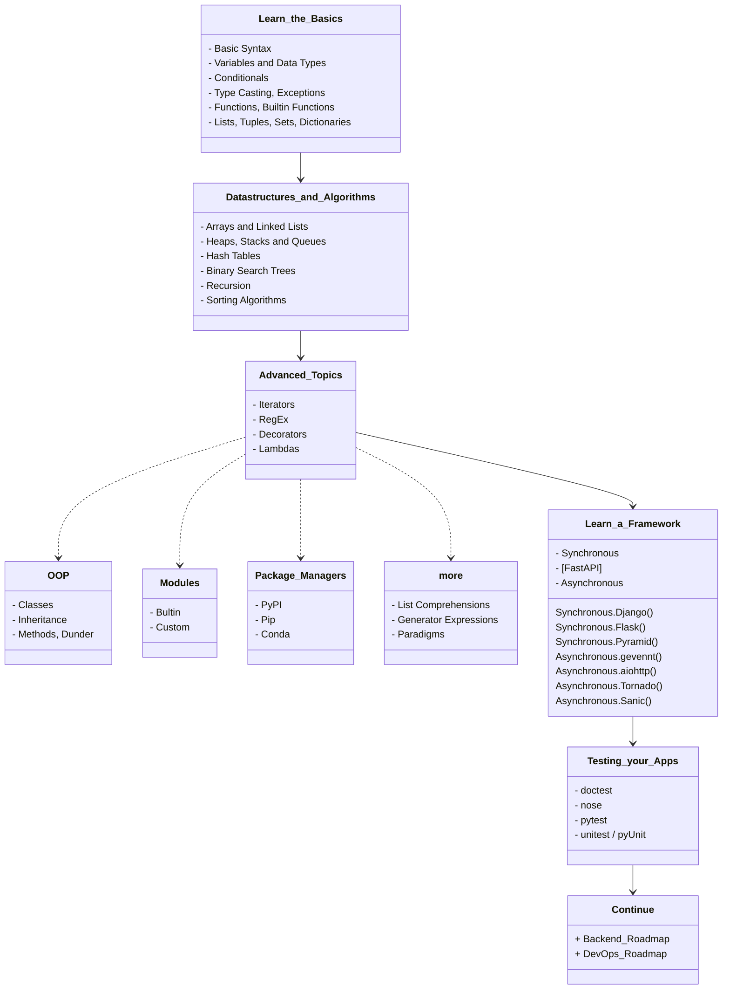
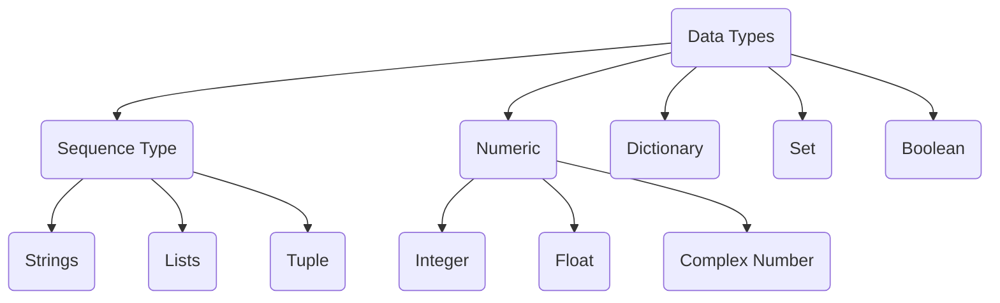

# RoadMap
> Edited from [© roadmap.sh](https://roadmap.sh/python)

# Learn_the_Basics
## Basic Syntax
Setup the environment for python and get started with the basics.

Visit the following resources to learn more:
- [W3Schools - Python](https://www.w3schools.com/python/)
- [Python for Beginners - Learn Python in 1 Hour](https://www.youtube.com/watch?v=kqtD5dpn9C8)
- [Python Basics](https://www.tutorialspoint.com/python/python_basic_syntax.htm)
- [Learn X in Y Minutes / Python](https://learnxinyminutes.com/docs/python/)

## Variables and Data Types
Variables are used to store information to be referenced and manipulated in a computer program. They also provide a way of labeling data with a descriptive name, so our programs can be understood more clearly by the reader and ourselves. It is helpful to think of variables as containers that hold information. Their sole purpose is to label and store data in memory. This data can then be used throughout your program.

Visit the following resources to learn more:
- [Variables in Python](https://realpython.com/python-variables)
- [W3Schools — Python Variables](https://www.w3schools.com/python/python_variables.asp)
- [Python Variables - Geeks for Geeks](https://www.geeksforgeeks.org/python-variables/)
- [Python Data Types](https://www.w3schools.com/python/python_datatypes.asp)
- [Basic Data Types in Python](https://realpython.com/python-data-types/)
- [Python for Beginners: Data Types](https://thenewstack.io/python-for-beginners-data-types/)



## Conditionals
Conditional Statements in Python perform different actions depending on whether a specific condition evaluates to true or false. Conditional Statements are handled by `IF`-`ELIF`-`ELSE` statements and `MATCH`-`CASE` statements in Python.

Visit the following resources to learn more:
- [Python Conditional Statements: IF…Else, ELIF & Switch Case](https://www.guru99.com/if-loop-python-conditional-structures.html)
- [Conditional Statements in Python](https://realpython.com/python-conditional-statements/)
- [How to use a match statement in Python](https://learnpython.com/blog/python-match-case-statement/)

## Typecasting
The process of converting the value of one data type (integer, string, float, etc.) to another data type is called type conversion. Python has two types of type conversion:

- **Implicit** - in this, method, Python converts the datatype into another datatype automatically. In this process, users don’t have to involve in this process.

```py
# Python program to demonstrate
# implicit type Casting

# Python automatically converts
# a to int
a = 7
print(type(a))

# Python automatically converts
# b to float
b = 3.0
print(type(b))

# Python automatically converts
# c to float as it is a float addition
c = a + b
print(c)
print(type(c))

# Python automatically converts
# d to float as it is a float multiplication
d = a * b
print(d)
print(type(d))
```

- **Explicit** - in this method, Python needs user involvement to convert the variable data type into a certain data type in order to the operation required.
	-   **Int():** [Python Int()](https://www.geeksforgeeks.org/python-int-function/) function take float or string as an argument and returns int type object.
	-   **float():** [Python float()](https://www.geeksforgeeks.org/float-in-python/) function take int or string as an argument and return float type object.
	-   **str():** [Python str()](https://www.geeksforgeeks.org/python-str-function/) function takes float or int as an argument and returns string type object.

### [Errors and Exceptions](https://docs.python.org/3/tutorial/errors.html)
There are (at least) two distinguishable kinds of errors: **syntax errors** and **exceptions**.

Eventualy you'll elaborate a code that [handle with it's own exceptions](https://www.programiz.com/python-programming/exception-handling), using generaly `try` and `except` comands.

Visit the following resources to learn more:
- [Type Conversion and Casting](https://www.programiz.com/python-programming/type-conversion-and-casting)
- [Type Casting in Python with Examples](https://www.geeksforgeeks.org/type-casting-in-python-implicit-and-explicit-with-examples/)
- [Python Exceptions: An Introduction](https://realpython.com/python-exceptions/)
- [Python Try Except](https://www.w3schools.com/python/python_try_except.asp)

## Functions
In programming, a function is a reusable block of code that executes a certain functionality when it is called. Functions are integral parts of every programming language because they help make your code more modular and reusable.

In Python, you *define* a function with the `def` keyword, then write the function identifier (*name*) followed by parentheses (*parameters*) and a colon, like:

```py
def function_name(parameter1, parameter2):
	#do something
	return something #optional
```

### Argument x Parameter
"*A parameter is the variable listed inside the parentheses in the function definition. An argument is the value that is sent to the function when it is called.*" [_font_](https://stackoverflow.com/questions/156767/whats-the-difference-between-an-argument-and-a-parameter#:~:text=A%20parameter%20is%20the%20variable,function%20when%20it%20is%20called.)


### Return
The use of a function can be only for processing algorithms or just to print an information:
```py
def my_function():
	print("Hello friend, from a function")

my_function()
```

Or to `return` a value, like a math operation:
```py
def sum(a, b)
	return (a + b)

print(sum(3, 4))
```

Visit the following resources to learn more:
- [Python Functions - W3Schools](https://www.w3schools.com/python/python_functions.asp)
- [Python Functions – How to Define and Call a Function](https://www.freecodecamp.org/news/python-functions-define-and-call-a-function/)
- [Python Functions](https://www.geeksforgeeks.org/python-functions/)
- [Built-in Functions in Python](https://docs.python.org/3/library/functions.html)

## Lists, Tuples, Sets, and Dictionaries
Lists: are just like dynamic sized arrays, declared in other languages (vector in C++ and ArrayList in Java). Lists need not be homogeneous always which makes it the most powerful tool in Python.

Tuple: A Tuple is a collection of Python objects separated by commas. In some ways, a tuple is similar to a list in terms of indexing, nested objects, and repetition but a tuple is immutable, unlike lists that are mutable.

Set: A Set is an unordered collection data type that is iterable, mutable, and has no duplicate elements. Python’s set class represents the mathematical notion of a set.

Dictionary: In python, Dictionary is an ordered (since Py 3.7) [unordered (Py 3.6 & prior)] collection of data values, used to store data values like a map, which, unlike other Data Types that hold only a single value as an element, Dictionary holds key:value pair. Key-value is provided in the dictionary to make it more optimized.

Visit the following resources to learn more:
- [Difference Between List, Tuple, Set and Dictionary in Python](https://www.youtube.com/watch?v=n0krwG38SHI)
- [Differences and Applications of List, Tuple, Set and - Dictionary in Python](https://www.geeksforgeeks.org/differences-and-applications-of-list-tuple-set-and-dictionary-in-python/)
- [Tuples vs. Lists vs. Sets in Python](https://jerrynsh.com/tuples-vs-lists-vs-sets-in-python/)
- [Python for Beginners: Lists](https://thenewstack.io/python-for-beginners-lists/)
- [Python for Beginners: When and How to Use Tuples](https://thenewstack.io/python-for-beginners-when-and-how-to-use-tuples/)

# Datastructures_and_Algorithms
# Advanced_Topics
# Learn_a_Framework
# Testing_your_Apps
# Continue
	