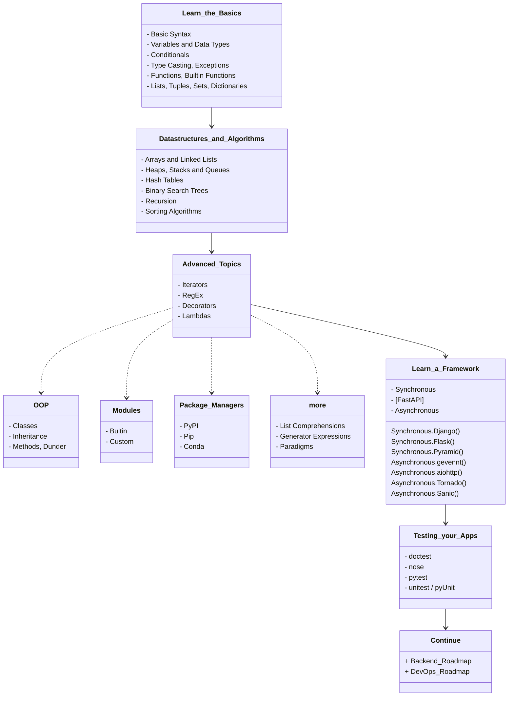
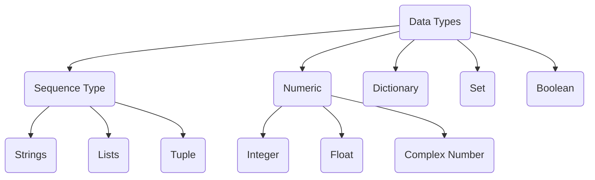

- [RoadMap](#roadmap)
- [Learn\_the\_Basics](#learn_the_basics)
	- [Basic Syntax](#basic-syntax)
	- [Variables and Data Types](#variables-and-data-types)
	- [Conditionals](#conditionals)
	- [Typecasting](#typecasting)
		- [Errors and Exceptions](#errors-and-exceptions)
	- [Functions](#functions)
		- [Argument x Parameter](#argument-x-parameter)
		- [Return](#return)
	- [Lists, Tuples, Sets, and Dictionaries](#lists-tuples-sets-and-dictionaries)
- [Datastructures\_and\_Algorithms](#datastructures_and_algorithms)
	- [Arrays and Linked Lists](#arrays-and-linked-lists)
	- [Heaps, Stacks and Queues (Data Structures)](#heaps-stacks-and-queues-data-structures)
	- [Hash Tables](#hash-tables)
	- [Binary Search Trees](#binary-search-trees)
	- [Recursion](#recursion)
	- [Sorting Algorithms](#sorting-algorithms)
- [Advanced\_Topics](#advanced_topics)
- [Learn\_a\_Framework](#learn_a_framework)
- [Testing\_your\_Apps](#testing_your_apps)
- [Continue](#continue)
	- [Libraries](#libraries)


# RoadMap
> Edited from [© roadmap.sh](https://roadmap.sh/python)

# Learn_the_Basics
Python is a high-level, interpreted, general-purpose programming language. Its design philosophy emphasizes code readability with the use of significant indentation. Python is dynamically-typed and garbage-collected.

## Basic Syntax
Setup the environment for python and get started with the basics.

Visit the following resources to learn more:
-	[W3Schools - Python](https://www.w3schools.com/python/)
-	[Python for Beginners - Learn Python in 1 Hour](https://www.youtube.com/watch?v=kqtD5dpn9C8)
-	[Python Basics](https://www.tutorialspoint.com/python/python_basic_syntax.htm)
-	[Learn X in Y Minutes / Python](https://learnxinyminutes.com/docs/python/)

## Variables and Data Types
Variables are used to store information to be referenced and manipulated in a computer program. They also provide a way of labeling data with a descriptive name, so our programs can be understood more clearly by the reader and ourselves. It is helpful to think of variables as containers that hold information. Their sole purpose is to label and store data in memory. This data can then be used throughout your program.

Visit the following resources to learn more:
-	[Variables in Python](https://realpython.com/python-variables)
-	[W3Schools — Python Variables](https://www.w3schools.com/python/python_variables.asp)
-	[Python Variables - Geeks for Geeks](https://www.geeksforgeeks.org/python-variables/)
-	[Python Data Types](https://www.w3schools.com/python/python_datatypes.asp)
-	[Basic Data Types in Python](https://realpython.com/python-data-types/)
-	[Python for Beginners: Data Types](https://thenewstack.io/python-for-beginners-data-types/)



## Conditionals
Conditional Statements in Python perform different actions depending on whether a specific condition evaluates to true or false. Conditional Statements are handled by `IF`-`ELIF`-`ELSE` statements and `MATCH`-`CASE` statements in Python.

Visit the following resources to learn more:
-	[Python Conditional Statements: IF…Else, ELIF & Switch Case](https://www.guru99.com/if-loop-python-conditional-structures.html)
-	[Conditional Statements in Python](https://realpython.com/python-conditional-statements/)
-	[How to use a match statement in Python](https://learnpython.com/blog/python-match-case-statement/)

## Typecasting
The process of converting the value of one data type (integer, string, float, etc.) to another data type is called type conversion. Python has two types of type conversion:

-	**Implicit** - in this, method, Python converts the datatype into another datatype automatically. In this process, users don’t have to involve in this process.

```python
# Python program to demonstrate
# implicit type Casting

# Python automatically converts
# a to int
>>> a = 7
>>> print(type(a))

# Python automatically converts
# b to float
>>> b = 3.0
>>> print(type(b))

# Python automatically converts
# c to float as it is a float addition
>>> c = a + b
>>> print(c)
>>> print(type(c))

# Python automatically converts
# d to float as it is a float multiplication
>>> d = a * b
>>> print(d)
>>> print(type(d))
```

-	**Explicit** - in this method, Python needs user involvement to convert the variable data type into a certain data type in order to the operation required.
	-   **Int():** [Python Int()](https://www.geeksforgeeks.org/python-int-function/) function take float or string as an argument and returns int type object.
	-   **float():** [Python float()](https://www.geeksforgeeks.org/float-in-python/) function take int or string as an argument and return float type object.
	-   **str():** [Python str()](https://www.geeksforgeeks.org/python-str-function/) function takes float or int as an argument and returns string type object.

### [Errors and Exceptions](https://docs.python.org/3/tutorial/errors.html)
There are (at least) two distinguishable kinds of errors: **syntax errors** and **exceptions**.

Eventualy you'll elaborate a code that [handle with it's own exceptions](https://www.programiz.com/python-programming/exception-handling), using generaly `try` and `except` comands.

Visit the following resources to learn more:
-	[Type Conversion and Casting](https://www.programiz.com/python-programming/type-conversion-and-casting)
-	[Type Casting in Python with Examples](https://www.geeksforgeeks.org/type-casting-in-python-implicit-and-explicit-with-examples/)
-	[Python Exceptions: An Introduction](https://realpython.com/python-exceptions/)
-	[Python Try Except](https://www.w3schools.com/python/python_try_except.asp)

## Functions
In programming, a function is a reusable block of code that executes a certain functionality when it is called. Functions are integral parts of every programming language because they help make your code more modular and reusable.

In Python, you *define* a function with the `def` keyword, then write the function identifier (*name*) followed by parentheses (*parameters*) and a colon, like:

```py
def function_name(parameter1, parameter2):
	#do something
	return something #optional
```

### Argument x Parameter
"*A parameter is the variable listed inside the parentheses in the function definition. An argument is the value that is sent to the function when it is called.*" [_font_](https://stackoverflow.com/questions/156767/whats-the-difference-between-an-argument-and-a-parameter#:~:text=A%20parameter%20is%20the%20variable,function%20when%20it%20is%20called.)


### Return
The use of a function can be only for processing algorithms or just to print an information:
```python
>>> def my_function():
...		print("Hello friend, from a function")

>>> my_function()
```

Or to `return` a value, like a math operation:
```python
>>> def sum(a, b)
...		return (a + b)

>>> print(sum(3, 4))
```

Visit the following resources to learn more:
-	[Python Functions - W3Schools](https://www.w3schools.com/python/python_functions.asp)
-	[Python Functions – How to Define and Call a Function](https://www.freecodecamp.org/news/python-functions-define-and-call-a-function/)
-	[Python Functions](https://www.geeksforgeeks.org/python-functions/)
-	[Built-in Functions in Python](https://docs.python.org/3/library/functions.html)

## Lists, Tuples, Sets, and Dictionaries
-	**Lists**: are just like dynamic sized arrays, declared in other languages (vector in C++ and ArrayList in Java).  *Represented with* `[]`.
	They're non-homogeneous (allows multitype and duplicate elements) and ordered (*index* starts with `0`) data structure that stores the elements in single row and multiple rows and columns, is mutable.

	-	The `append()` method adds a single item at the end of the list without modifying the original list.
	-	The `pop()` method removes the item at the given index (*defaut last*) from the list and returns it.
	-	The `sort()` method sorts the elements of a given list in a specific ascending or descending order.
	-	`index()` searches for a given element from the start of the list and returns the lowest index where the element appears.
	-	The `count()` method returns the number of times the specified element appears in the list.
	-	The `reverse()` method reverses the elements of the list.

	```python
	#definition
	>>> lst = list()
	
	#example
	#index 0 1 2  3  4  5
	>>> lst = [1,1,2,'c',4,'e']
	>>> print(lst)
	
	#index/element
	>>> print(lst.index('c'))
	>>> print(lst[3])

	#can be modified
	>>> lst.append('f')	#builtin add method
	>>> print(lst)
	>>> lst.pop()	#builtin remove method
	>>> print(lst)
	```
	Aplications:
	-   Used in `JSON` format
	-   Useful for Array operations
	-   Used in Databases

-	**Tuple**: is a collection of Python objects separated by commas. *Represented by* `()`.
	In some ways, a tuple is similar to a list in terms of indexing, nested objects, and repetition but **a tuple is immutable**, unlike lists that are mutable.
	-	The `count()` method returns the number of times a specified value occurs in a tuple.
	-	The `reverse()` method is **not defined** in tuples, as they are unchangeable

	```python
	#definition
	>>> tpl = tuple()
	
	#example
	#index 0 1 2  3  4  5
	>>> tpl = (1,1,2,'c',4,'e')
	>>> print(tpl)
	```
	Aplications
	-	Used to insert records in the database through `SQL` query at a time.
	-	Used in parentheses checker

-	**Set**: is an unordered collection data type that is iterable, mutable, and has no duplicate elements.
	-	The set `add()` method adds a given element to a set.
	-	The `pop()` method removes a random item from the set.
	-	There `count()` method is **not defined** in sets, as they do not allow any duplicates.
	-	The `reverse()` method is **not defined** in sets, they're unordered, which restricts from applying.

	```python
	#definition
	>>> st = set()
	
	#example
	>>> st = (1,1,2,'c',4,'e')
	>>> print(st)

	#can be modified
	>>> st.add('f')	#builtin add method
	>>> print(st)
	>>> st.pop()	#builtin remove method
	>>> print(st)
	```
	Aplications
	-   Finding unique elements
	-   Join operations

-	**Dictionary**: In python, Dictionary is a non-homogeneous ordered (since Py 3.7 *[unordered (Py 3.6 & prior)]*) collection of data values, used to store data values like a map, which, unlike other Data Types that hold only a single value as an element, Dictionary holds `key:value` pair. Key-value is provided to make it more optimized. **Note that the Dictionary is mutable. But Keys are not duplicated**.
	-	The `update()` method updates *at the end* the Dictionary with the specified `key-value` pairs.
	-	The `pop()` method removes the specified (*by the key*) item from the dictionary.
	-	`sorted()` method is used to sort the keys in the dictionary by default.
	-	The `get()` method returns the value of the item with the specified key.
	-	The `count()` method is not defined in the dictionary.
	-	The elements cannot be reversed, as the items in the dictionary are in the form of `key-value` pairs

	```python
	#definition
	>>> dic = dict()
	
	#example
	>>> dic={
	...		"key1": 1,
	...		"key3": 2,
	...		"key2": 3
	}
	>>> print(dic)

	#element
	>>> print(dic.get("key2"))

	#can be modified
	>>> dic.update("key4":4)	#builtin add method
	>>> print(dic)
	>>> dic.pop("key4")	#builtin remove method
	>>> print(dic)
	```
	Aplications
	-	Used to create a data frame with lists
	-	Used in `JSON`

Visit the following resources to learn more:
- [Difference Between List, Tuple, Set and Dictionary in Python](https://www.youtube.com/watch?v=n0krwG38SHI)
- [Differences and Applications of List, Tuple, Set and - Dictionary in Python](https://www.geeksforgeeks.org/differences-and-applications-of-list-tuple-set-and-dictionary-in-python/)
- [Tuples vs. Lists vs. Sets in Python](https://jerrynsh.com/tuples-vs-lists-vs-sets-in-python/)
- [Python for Beginners: Lists](https://thenewstack.io/python-for-beginners-lists/)
- [Python for Beginners: When and How to Use Tuples](https://thenewstack.io/python-for-beginners-when-and-how-to-use-tuples/)

# Datastructures_and_Algorithms
A data structure is a named location that can be used to store and organize data. And, an algorithm is a collection of steps to solve a particular problem. Learning data structures and algorithms allow us to write efficient and optimized computer programs.

## Arrays and Linked Lists
Arrays store elements in contiguous memory locations, resulting in easily calculable addresses for the elements stored and this allows faster access to an element at a specific index. [Linked lists](./code/linked_list.py) are less rigid in their storage structure and elements are usually not stored in contiguous locations, hence they need to be stored with additional tags giving a reference to the next element. *This difference in the data storage scheme decides which data structure would be more suitable for a given situation*. **Needs to be imported with `import array`**. 

Arrays of the array module are a thin wrapper over C arrays, and are useful when you want to work with homogeneous data. They are also more compact and take up less memory and space which makes them more size efficient compared to lists.

If you want to perform mathematical calculations, then you should use [**NumPy**](./numpy.md) (https://www.w3schools.com/python/numpy/numpy_getting_started.asp) arrays (be sure to install [`pip install numpy`]). Besides that, you should just use Python arrays when you really need to, as lists work in a similar way and are more flexible to work with.

Visit the following resources to learn more:

-	[Linked Lists vs Arrays](https://www.geeksforgeeks.org/linked-list-vs-array/)
-	[Python Array Tutorial](https://www.freecodecamp.org/news/python-array-tutorial-define-index-methods/)
-	[Python Arrays](https://www.geeksforgeeks.org/python-arrays/)
-	[Arrays in Python](https://www.edureka.co/blog/arrays-in-python/)
-	[Array Data Structure | Illustrated Data Structures](https://www.youtube.com/watch?v=QJNwK2uJyGs)
-	[Linked List Data Structure | Illustrated Data Structures](https://www.youtube.com/watch?v=odW9FU8jPRQ)

## Heaps, Stacks and Queues ([Data Structures](../Other/data_structure.md))
-	**Stacks:** Operations are performed [`LIFO`](../Other/lifo_fifo.md) (last in, first out), which means that the last element added will be the first one removed. A stack can be implemented using an array or a linked list. If the stack runs out of memory, it’s called a stack overflow.

-	**Queue:** Operations are performed [`FIFO`](../Other/lifo_fifo.md) (first in, first out), which means that the first element added will be the first one removed. A queue can be implemented using an array.

-	**Heap:** A tree-based data structure in which the value of a parent node is ordered in a certain way with respect to the value of its child node(s). A heap can be either a min heap (the value of a parent node is less than or equal to the value of its children) or a max heap (the value of a parent node is greater than or equal to the value of its children).

Visit the following resources to learn more:

-   [Heaps, Stacks, Queues](https://stephanosterburg.gitbook.io/scrapbook/coding/coding-interview/data-structures/heaps-stacks-queues)
-   [Python Stacks, Queues, and Priority Queues in Practice](https://realpython.com/queue-in-python/)
-   stacks
	-   [Stack Data Structure | Illustrated Data Structures](https://www.youtube.com/watch?v=I5lq6sCuABE)
	-   [Stack in Python](https://www.geeksforgeeks.org/stack-in-python/)
	-   [How to Implement Python Stack?](https://realpython.com/how-to-implement-python-stack/)
-   heaps
	-   [Heap Implementation in Python](https://www.educative.io/answers/heap-implementation-in-python)
-	queues
	-   [Queue Data Structure | Illustrated Data Structures](https://www.youtube.com/watch?v=mDCi1lXd9hc)
	-   [Queue in Python](https://www.geeksforgeeks.org/queue-in-python/)

## Hash Tables
## Binary Search Trees
## Recursion
## Sorting Algorithms

# Advanced_Topics
# Learn_a_Framework
# Testing_your_Apps
# Continue 
## Libraries
- [openpyxl](./openpyxl.md)
- [numpy](./numpy.md)