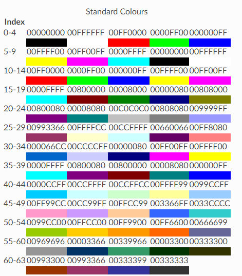

> [Python Roadmap](./README.md)

- [Installation](#installation)
- [Workbook](#workbook)
- [Worksheets](#worksheets)
- [Managing data](#managing-data)
  - [Accessing one cell](#accessing-one-cell)
  - [Accessing many cells](#accessing-many-cells)
  - [Insert rows](#insert-rows)
  - [Moving ranges of cells](#moving-ranges-of-cells)
  - [Merge / Unmerge cells](#merge--unmerge-cells)
  - [Values only](#values-only)
- [Assign values](#assign-values)
- [Save file](#save-file)
- [Loading from a file](#loading-from-a-file)
- [Working with styles](#working-with-styles)
  - [Introduction](#introduction)
  - [Colors](#colors)
  - [Applying Styles](#applying-styles)
  - [Styling Merged Cells](#styling-merged-cells)
- [Using number formats](#using-number-formats)
- [Working with Pandas and NumPy](#working-with-pandas-and-numpy)
  - [NumPy Support](#numpy-support)
  - [Working with Pandas Dataframes](#working-with-pandas-dataframes)
  - [Converting a worksheet to a Dataframe](#converting-a-worksheet-to-a-dataframe)
- [References](#references)

## Installation

Install openpyxl using pip. It is advisable to do this in a Python virtualenv without system packages:

```bash
$ pip install openpyxl
```

## Workbook

> Workbook is the file, worksheets are the tabs.

There is no need to create a file on the filesystem to get started with openpyxl. Just import the `Workbook` class and start work:

```python
>>> from openpyxl import Workbook
>>> wb = Workbook()
```

This will create the file in memory and w**hen a worksheet is created in memory, it contains no cells. They are created when first accessed.**

A workbook is always created with at least one worksheet. You can get it by using the `Workbook.active` property:

```python
>>> ws = wb.active
```

> This wil retrieve the first worksheet.

---

## Worksheets

In order to *select > rename*, sometimes is just more pratical to delete and create a new one along other atributtes as `position`.

You can create new worksheets using the `Workbook.create_sheet()` method:

```python
>>> ws1 = wb.create_sheet("Mysheet") # insert at the end (default)
# or
>>> ws2 = wb.create_sheet("Mysheet", 0) # insert at first position
# or
>>> ws3 = wb.create_sheet("Mysheet", -1) # insert at the penultimate position
```

Sheets are given a name automatically when they are created. They are numbered in sequence (Sheet, Sheet1, Sheet2, …). You can change this name at any time with the `Worksheet.title` property:

```python
ws.title = "New Title"
```

You can review the names of all worksheets of the workbook with the `Workbook.sheetname` attribute, this method returns a list of the names, that can be verified in a loop.

```python
>>> print(wb.sheetnames)
###	['Sheet2', 'New Title', 'Sheet1']
```

Once you gave a worksheet a name, you can get it as a key of the workbook, like `getElelemntById`:

```python
>>> ws3 = wb["New Title"]
```

Talking about *loops*, you can loop through worksheets

```python
>>> for sheet in wb:
...     print(sheet.title)
```

You can create copies of worksheets **within a single workbook**:

- `Workbook.copy_worksheet()` method:

```python
>>> source = wb.active
>>> target = wb.copy_worksheet(source)
```

> **Only cells (including values, styles, hyperlinks and comments) and certain worksheet attributes (including dimensions, format and properties) are copied**. All other workbook / worksheet attributes are not copied - e.g. Images, Charts.
>
> **You also cannot copy worksheets between workbooks**. You cannot copy a worksheet if the workbook is open in read-only or write-only mode.

---

## Managing data

### Accessing one cell

Cells can be accessed directly as keys of the worksheet. This will return the cell at A4, or create one if it does not exist yet. Values can be directly assigned:

```python
>>> c = ws['A4'] # *A4* follows the Excel's grid system.
>>> ws['A4'] = 4
```

There is also the `Worksheet.cell()` method.

This provides access to cells using **row** and **column** notation:
> A4 (row=4 colum=1)

```python
>>> d = ws.cell(row=4, column=2, value=10)
```

Just to fixate, rows and columns starts in `1` value.

Taking in consideration that in a creation of a worksheet, there's no cell created, looping through a range will initialize them, even if no value is asigned.
This example will create a matrix of `100x100` cells.

```python
>>> for x in range(1,101):
...        for y in range(1,101):
...            ws.cell(row=x, column=y)
```

### Accessing many cells

Ranges of cells can be accessed using slicing:

```python
>>> cell_range = ws['A1':'C2']
```

Ranges of rows or columns can be obtained similarly:

```python
>>> colC = ws['C']
>>> col_range = ws['C:D']
>>> row10 = ws[10]
>>> row_range = ws[5:10]
```

You can also use the `Worksheet.iter_rows()` method:

```python
>>> for row in ws.iter_rows(min_row=1, max_col=3, max_row=2):
...    for cell in row:
...        print(cell)
###	<Cell Sheet1.A1>
###	<Cell Sheet1.B1>
###	<Cell Sheet1.C1>
###	<Cell Sheet1.A2>
###	<Cell Sheet1.B2>
###	<Cell Sheet1.C2>

```

Likewise the `Worksheet.iter_cols()` (*not available in read-only mode*) method will return columns:

```python
>>> for col in ws.iter_cols(min_row=1, max_col=3, max_row=2):
...     for cell in col:
...         print(cell)
###	<Cell Sheet1.A1>
###	<Cell Sheet1.A2>
###	<Cell Sheet1.B1>
###	<Cell Sheet1.B2>
###	<Cell Sheet1.C1>
###	<Cell Sheet1.C2>
```

The `inter_*` method needs an instance of a worksheet
```python
>>> import openpyxl as op
>>> ms = op.load_workbook('xxxx.xlsx')
>>> ws = ms.active
>>> # op.worksheet.Worksheet.iter_rows() # type object 'Worksheet' has no attribute 'iter_rows'

# correct way
>>> for row in ws.iter_rows('A1:C2'):
...        for cell in row:
...            print cell
```

As *error message* states, you are calling it on the `Worksheet` *type*, which won't work; it needs to be called on an *object*.

### Insert rows

You can insert new rows and coluns with these methods below. Every single one of those methods can receive two arguments (`idx` and `amount`).
-   `.insert_rows()`
-   `.delete_rows()`
-   `.insert_cols()`
-   `.delete_cols()`

```python
# A1('hello')
# B1('friend!')
# Insert a column before the existing column 1 ("A")
>>> sheet.insert_cols(idx=1)
>>> print_rows()
### (None, 'hello', 'friend!')

# Insert 5 columns between column 2 ("B") and 3 ("C")
>>> sheet.insert_cols(idx=3, amount=5)
>>> print_rows()
### (None, 'hello', None, None, None, None, None, 'friend!')

# Delete the created columns
>>> sheet.delete_cols(idx=3, amount=5)
>>> sheet.delete_cols(idx=1)
>>> print_rows()
### ('hello', 'friend!')

# Insert a new row in the beginning
>>> sheet.insert_rows(idx=1)
>>> print_rows()
### (None, None)
### ('hello', 'friend!')

# Insert 3 new rows in the beginning
>>> sheet.insert_rows(idx=1, amount=3)
>>> print_rows()
### (None, None)
### (None, None)
### (None, None)
### (None, None)
### ('hello', 'friend!')

# Delete the first 4 rows
>>> sheet.delete_rows(idx=1, amount=4)
>>> print_rows()
### ('hello', 'friend!')
```

### Moving ranges of cells

You can also move ranges of cells within a worksheet:

```python
>>> ws.move_range("D4:F10", rows=-1, cols=2)
```

This will move the cells in the range `D4:F10` up one row, and right two columns. The cells will overwrite any existing cells.

If cells contain formulae you can let openpyxl translate these for you, but as this is not always what you want it is disabled by default. Also only the formulae in the cells themselves will be translated. References to the cells from other cells or defined names will not be updated; you can use the [Parsing Formulas](https://openpyxl.readthedocs.io/en/stable/editing_worksheets.htmlformula.html) translator to do this:

```python
>>> ws.move_range("G4:H10", rows=1, cols=1, translate=True)
```

This will move the relative references in formulae in the range by one row and one column.

### Merge / Unmerge cells

When you merge cells all cells but the top-left one are **removed** from the worksheet. To carry the border-information of the merged cell, the boundary cells of the merged cell are created as MergeCells which always have the value None. See [Styling Merged Cells](https://openpyxl.readthedocs.io/en/stable/editing_worksheets.htmlstyles.html#styling-merged-cells) for information on formatting merged cells.

```python
>>> from openpyxl.workbook import Workbook
>>>
>>> wb = Workbook()
>>> ws = wb.active
>>>
>>> ws.merge_cells('A2:D2')
>>> ws.unmerge_cells('A2:D2')
>>>
# or equivalently
>>> ws.merge_cells(start_row=2, start_column=1, end_row=4, end_column=4)
>>> ws.unmerge_cells(start_row=2, start_column=1, end_row=4, end_column=4)
```

### Values only

If you just want the values from a worksheet you can use the `Worksheet.values` property. This iterates over all the rows in a worksheet but returns just the cell values:

Both `Worksheet.iter_rows()` and `Worksheet.iter_cols()` can take the `values_only` parameter to return just the cell’s value:

```python
>>> for row in ws.iter_rows(min_row=1, max_col=3, max_row=2, values_only=True):
...   print(row)

### (None, None, None)
### (None, None, None)
```

## Assign values

Once we have a `Cell`, we can assign it a value:

```python
>>> c.value = 'hello, friend'
>>> print(c.value)
### 'hello, friend'

>>> d.value = 3.14
>>> print(d.value)
### 3.14
```

Or you can iterate through cells within Worksheets:
>[stack](https://stackoverflow.com/questions/31395058/how-to-write-to-a-new-cell-in-python-using-openpyxl)
```python
for ws in wb.worksheets:
	for index, row in enumerate(ws.rows, start=1):
        print row # optional
        ws.cell(row=index, column=2).value = 7
```

## Save file

The simplest and safest way to save a workbook is by using the `Workbook.save()` method of the `Workbook` object, but will overwrite existing files. 

```python
>>> wb = Workbook()
>>> wb.save('file.xlsx')
```

Remember to set the proper `.extension`, or may cause problems to open the file in other applications.

## Loading from a file

You can use the `openpyxl.load_workbook()` to open an existing workbook. 

```python
>>> wb = load_workbook(filename = 'empty_book.xlsx')
```

There are several flags that can be used in load_workbook.
-   `data_only` controls whether cells with formulae have either the formula (default) or the value stored the last time Excel read the sheet.
-   `keep_vba` controls whether any Visual Basic elements are preserved or not (default). If they are preserved they are still not editable.

---

## Working with styles

### Introduction

For this importing `openpyxl.styles` will be required.

Styles can be applied to the following aspects:
 -   font to set font size, color, underlining, etc.
 -   fill to set a pattern or color gradient
 -   border to set borders on a cell
 -   cell alignment
 -   protection

```python
>>> from openpyxl.styles import PatternFill, Border, Side, Alignment, Protection, Font
# font
>>> font = Font(name='Calibri',
...                 size=11,
...                 bold=False,
...                 italic=False,
...                 vertAlign=None,
...                 underline='none',
...                 strike=False,
...                 color='FF000000')
# fill
>>> fill = PatternFill(fill_type=None,
...                 start_color='FFFFFFFF',
...                 end_color='FF000000')
# border
>>> border = Border(left=Side(border_style=None, color='FF000000'),
...                 right=Side(border_style=None, color='FF000000'),
...                 top=Side(border_style=None, color='FF000000'),
...                 bottom=Side(border_style=None, color='FF000000'),
...                 diagonal=Side(border_style=None, color='FF000000'),
...                 diagonal_direction=0,
...                 outline=Side(border_style=None, color='FF000000'),
...                 vertical=Side(border_style=None, color='FF000000'),
...                 horizontal=Side(border_style=None, color='FF000000')
...                )
# alignment
>>> alignment=Alignment(horizontal='general',
...                     vertical='bottom',
...                     text_rotation=0,
...                     wrap_text=False,
...                     shrink_to_fit=False,
...                     indent=0)
# format
>>> number_format = 'General'
# protection
>>> protection = Protection(locked=True,
...                         hidden=False)
```

**From now on, consider this:**

```python
 >>> import openpyxl.styles as ops
```

### Colors

You may have noticed that the collors are defined in Hexadecimal values. But there's support for legacy indexed colours as well as themes and tints. 

So colours for fonts, backgrounds, borders, etc. can be set in three ways:
- Indexed.
- aRGB.
- Themes.

The **alpha (`a`RGB)** value refers in theory to the transparency of the colour but this is not relevant for cell styles. The default of `00` will prepended to any simple `RGB` value:

```python
>>> font = ops.Font(color="00FF00")
>>> font.color.rgb
### '0000FF00'
```

For **legacy indexed colours**:

```python
>>> c = ops.Color(indexed=32)
```

For **themes and tints**:

```python
>>> c = ops.Color(theme=6, tint=0.5)
```

You can refer to the image below:



### Applying Styles

**Styles are applied directly to cells**:

```python
>>> from openpyxl import Workbook
>>> import openpyxl.styles as ops
>>> wb = Workbook()
>>> ws = wb.active
>>> c = ws['A1']
>>> c.font = ops.Font(size=12)
```

Styles can also applied to columns and rows but note that this applies only to cells created (in Excel) after the file is closed. If you want to apply styles to entire rows and columns then you must apply the style to each cell yourself. This is a restriction of the file format:

```python
>>> col = ws.column_dimensions['A']
>>> col.font = ops.Font(bold=True)
>>> row = ws.row_dimensions[1]
>>> row.font = ops.Font(underline="single")
```

### Styling Merged Cells

The merged cell behaves similarly to other cell objects. Its value and format is defined in its top-left cell. In order to change the border of the whole merged cell, change the border of its top-left cell. The formatting is generated for the purpose of writing.

```python
>>> from openpyxl import Workbook
>>> import openpyxl.styles as ops
>>>
>>> wb = Workbook()
>>> ws = wb.active
>>> ws.merge_cells('B2:F4')
>>>
>>> top_left_cell = ws['B2']
>>> top_left_cell.value = "My Cell"
>>>
>>> thin = Side(border_style="thin", color="000000")
>>> double = Side(border_style="double", color="ff0000")
>>>
>>> top_left_cell.border = ops.Border(top=double, left=thin, right=thin, bottom=double)
>>> top_left_cell.fill = ops.PatternFill("solid", fgColor="DDDDDD")
>>> top_left_cell.fill = fill = ops.GradientFill(stop=("000000", "FFFFFF"))
>>> top_left_cell.font  = ops.Font(b=True, color="FF0000")
>>> top_left_cell.alignment = ops.Alignment(horizontal="center", vertical="center")
>>>
>>> wb.save("styled.xlsx")
```

## Using number formats

You can specify the number format for cells, or for some instances (ie datetime) it will automatically format.

```python
>>> import datetime
>>> from openpyxl import Workbook
>>>
>>> wb = Workbook()
>>> ws = wb.active
# set date using a Python datetime
>>> ws['A1'] = datetime.datetime(2010, 7, 21)
>>>
>>> ws['A1'].number_format
### 'yyyy-mm-dd h:mm:ss'
>>>
>>> ws["A2"] = 0.123456
>>> ws["A2"].number_format = "0.00" # Display to 2dp
```

---

## Working with Pandas and NumPy

*openpyxl* is able to work with the popular libraries:
- [Pandas](./(geo)pandas.md) (http://pandas.pydata.org) 
- [NumPy](./numpy.md) (http://numpy.org)

### NumPy Support

openpyxl has builtin support for the *NumPy* types float, integer and boolean. DateTimes are supported using the *Pandas*’ Timestamp type.

### Working with Pandas Dataframes

The [`openpyxl.utils.dataframe.dataframe_to_rows()`](https://openpyxl.readthedocs.io/en/stable/pandas.htmlapi/openpyxl.utils.dataframe.html#openpyxl.utils.dataframe.dataframe_to_rows "openpyxl.utils.dataframe.dataframe_to_rows") function provides a simple way to work with *Pandas* Dataframes:

```python
from openpyxl.utils.dataframe import dataframe_to_rows
wb = Workbook()
ws = wb.active

for r in dataframe_to_rows(df, index=True, header=True):
    ws.append(r)
```

While *Pandas* itself supports conversion to Excel, this gives client code additional flexibility including the ability to stream dataframes straight to files.

To convert a dataframe into a worksheet highlighting the header and index:

```python
wb = Workbook()
ws = wb.active

for r in dataframe_to_rows(df, index=True, header=True):
    ws.append(r)

for cell in ws['A'] + ws[1]:
    cell.style = 'Pandas'

wb.save("pandas_openpyxl.xlsx")
```

Alternatively, if you just want to convert the data you can use write-only mode:

```python
from openpyxl.cell.cell import WriteOnlyCell
wb = Workbook(write_only=True)
ws = wb.create_sheet()

cell = WriteOnlyCell(ws)
cell.style = 'Pandas'

 def format_first_row(row, cell):

    for c in row:
        cell.value = c
        yield cell

rows = dataframe_to_rows(df)
first_row = format_first_row(next(rows), cell)
ws.append(first_row)

for row in rows:
    row = list(row)
    cell.value = row[0]
    row[0] = cell
    ws.append(row)

wb.save("openpyxl_stream.xlsx")
```

This code will work just as well with a standard workbook.

### Converting a worksheet to a Dataframe

To convert a worksheet to a Dataframe you can use the values property. This is very easy if the worksheet has no headers or indices:

```python
df = DataFrame(ws.values)
```

If the worksheet does have headers or indices, such as one created by *Pandas*, then a little more work is required:

```python
from itertools import islice
data = ws.values
cols = next(data)[1:]
data = list(data)
idx = [r[0] for r in data]
data = (islice(r, 1, None) for r in data)
df = DataFrame(data, index=idx, columns=cols)
```

---

## References

- [Full Documentation](https://openpyxl.readthedocs.io/en/stable/tutorial.html)
- [Real Python](https://realpython.com/openpyxl-excel-spreadsheets-python/)
