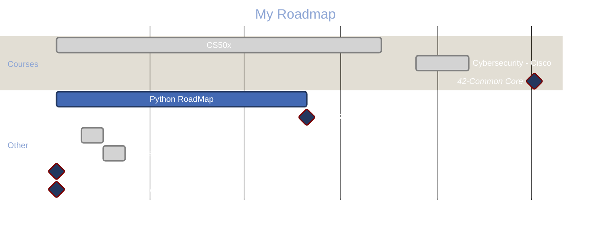

> [!INFO] 
> The links are built for the obsidian branch, i was working in main but now i'll split correctly and after that update all the inter document links over the main branch

---

> This is a list of interesting documents gathered during development studies
# The Big Picture 🌌

This repo is divided in two branches, [main](https://github.com/see7e/programming-studies) has common links and [obsidian](https://github.com/see7e/programming-studies/tree/obsidian) links follow a Zettelkasten adapted model along with Obsidian to map the network of documents. If you want to set up in you computer, [click here](obisidian_init.md).

	
If you want to know the history, click here.

	

		I've started using Obsidian and found very userfull to see how my brain works, and all its connections. Sometime after stumbled with the Zettelkasten method, it fits right into the philosophy of the program.

    

	    But the problem is that all my information was divided in a big folder structure, so I took my time and started thinking about how to conciliate both methods, PARA and Zettel.
    

    

	    The links, the special <code>[[]]</code> Obsidian type and the common <code></code>. The first one don't work in GitHub, and the second one if is a web url Obsidian won't link the way we expect. So what I will do/did is put altogether in one folder, and set <code>.gitignore</code> for exclude the independent sub-folders which are individual repositories, and with that Git won't create a mess during the commits and pushes.
    

 

# [List of Documents](DIRECTORY.md) 📜

> [!QUOTE] 
> If I have seen further, it is by standing on the shoulders of giants.
> *Isaac Newton*

## [A Fresh start](./Docs/fresh_start.md) 🛣️

Sometimes in the rush to resolve the problems that we face, the learn only to fill the gap that is presented by the obstacle. So I'll try to visit the core/basic concepts of CS, using some guidelines.

## Progress 🏗️

Basically, I set aside the days when I have more time to study C and Python, which are the biggest demands. Then comes SQL (Postgre and PostGis) along with PowerBI and PowerApps, for application in the company.

About the time, if you manage to reconcile between demands intervals, great, if not... Use the reserved time per day.

## First time with Markdown? 📑
> Enter [here](first-time.md)

## Some useful links [🔗](links.md) 

## Readings 📚

- make it stick - The Science of Successful Learning - Peter Brown, Henry L. Roediger III, Mark A. McDaniel
- Statistical Learning - Trevor Hastie, Robert Tibshirani
- Design Patterns: Elements of Reusable Object-Oriented Software - Gang of Four

> [!NOTE]
> Currently listing all that I want to read before writing
> - code cohesion
> - code coupling
> - project documentation
> 	- Code should be written in a way that promotes `readability` and is easy to understand for > other developers.
> 	- Good documentation can take different forms such as comments, documentation sites, and API > documentation.
> 	- Comments should provide meaningful explanations and not simply describe the syntax of the code.
> 	- Using `type-hints` in Python code improves clarity and understanding.
> 	- `docstrings` can be used to document functions, methods, classes, and modules, and tools like > Auto `docstring` can assist in generating them.
> 	- use of `mkdocs` alongside of `docstrings`
> - code diagnosis
> - UML
> - SOLID
> - CRUD
> - Programming Patterns
> 	- Collection Classes 
> 	- Junction Classes 
> - Object structure
> 	- Service
> 	- Interface
> 	- Implementation (data and code)
> - OOD Object Oriented Design
> - OOA Object Oriented Analysis
> - pcre [re(oniguruma), re2] / icu - regex
> - .strftime() `C`
> - numpy - scipy
> - tensorflow - machine learning
> - pytorch
> - cpython q= `ifdef MS_WINDOWS` > `PYErr_SetFromWindosErr(err.ws);`
> - preprocessamento em C
> - libuv (node.js)
> - deno x node.js
> - openjdk/jdk(java/c)
> - openssl
> - elixir
> - sistemas distribuídos
> - kernel, driver de dispositivos
> - userland
> - entender a compilação em C
> - abi - applcation bin interface
> - xml <-> jsn (marcheling / unmarsh)
> - estudar duplicação de memória
> - jni
> - cyton (.pyx) - FFI function interface
> - PONTOS FORTES LIGUAGES
>   - lowlevel/tcp/... - C/Rust/Nin/D
>   - construção de ferramentas de adm/infra - C++/Py/Go/Rust
>   - Alacritty
> -  SISTEMAS DISTRIBUÍDOS
>  - ffi
>  - avx / ssi
