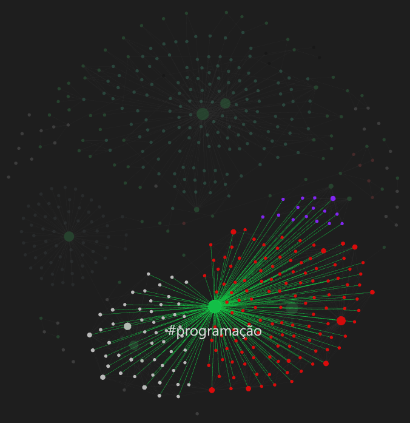
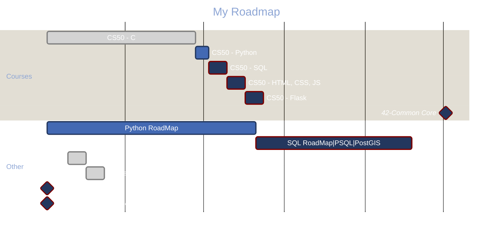

> [!INFO] 
> The links are built for the obsidian branch, i was working in main but now i'll split correctly and after that update all the inter document links 

---

> This is a list of interesting documents gathered during development studies
# The Big Picture

This repo is divided in two branches, [main](https://github.com/see7e/programing-studies) has common links and [obsidian](https://github.com/see7e/programing-studies/tree/obsidian) links follow a Zettelkasten adapted model along with Obsidian to map the network of documents. If you want to set up in you computer, [click here](./obisidian_init.md).

	
If you want to know the history, click here.

	

		I've started using Obsidian and found very userfull to see how my brain works, and all its connections. Sometime after stumbled with the Zettelkasten method, it fits right into the philosophy of the program.

    

	    But the problem is that all my information was divided in a big folder structure, so I took my time and started thinking about how to conciliate both methods, PARA and Zettel.
    

    

	    The links, the special <code>[[]]</code> Obsidian type and the common <code></code>. The first one don't work in GitHub, and the second one if is a web url Obsidian won't link the way we expect. So what I will do/did is put altogether in one folder, and set <code>.gitignore</code> for exclude the independent sub-folders which are individual repositories, and with that Git won't create a mess during the commits and pushes.
    

 

  <picture>
    
  </picture>

# [List of Documents](./DIRECTORY.md)

## Progress

    <table>
        <thead>
            <tr>
                <th>HOURS (18h ~ 19:30)</th>
                <th>Monday</th>
                <th>Tuesday</th>
                <th>Wednesday</th>
                <th>Thursday</th>
                <th>Friday</th>
            </tr>
        </thead>
        <tbody>
            <tr>
                <td>1ª Part</td>
                <td rowspan=3>(C) CS50</td>
                <td rowspan=3>(Python) Roadmap / Libs</td>
                <td rowspan=2>Revisão</td>
                <td rowspan=3>(Python) Roadmap / Libs</td>
                <td rowspan=3>(C) CS50</td>
            </tr>
            <tr>
                <td>2ª Part</td>
            </tr>
            <tr>
                <td>3ª Part</td>
                <td>PowerBI / Powerapps</td>
            </tr>
        </tbody>
    </table>

Basically, I set aside the days when I have more time to study C and Python, which are the biggest demands. Then comes SQL (Postgre and PostGis) along with PowerBI and PowerApps, for application in the company.

About the time, if you manage to reconcile between demands intervals, great, if not... Use the reserved time per day.

## First time with Markdown?
> Enter [here](./src/first-time.md)

## Some userfull [links](links.md) 