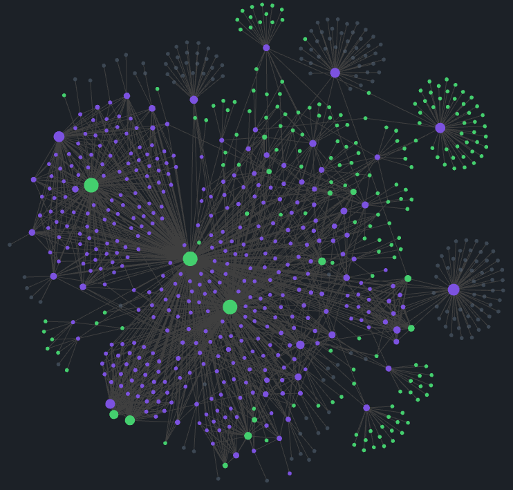
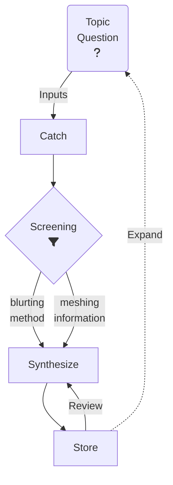

****
> [!INFO] 
> - If you're coming from the [GitHub repo](https://github.com/see7e/programming-studies), some of the links are built for Obsidian, this means that you'll either have to access the [Page implementation]() or store everything locally.
> - If you like the information and want to add/update with yours insights go to the [CONTRIBUTING](Courses/CPQD_private-networks-5G/CONTRIBUTING.md) document.

---

> This is a list of interesting documents gathered during development studies
# The Big Picture 🌌
Links follow a Zettelkasten adapted model along with Obsidian to map the network of documents.

	
If you want to know the history, click here.

	

		I've started using Obsidian and found very userfull to see how my brain works, and all its connections. Sometime after stumbled with the Zettelkasten method, it fits right into the philosophy of the program.

    

	    But the problem is that all my information was divided in a big folder structure, so I took my time and started thinking about how to conciliate both methods, PARA and Zettel.
    

    

	    The links, the special <code>[[]]</code> Obsidian type and the common <code></code>. The first one don't work in GitHub, and the second one if is a web url Obsidian won't link the way we expect. So what I will do/did is put altogether in one folder, and set <code>.gitignore</code> for exclude the independent sub-folders which are individual repositories, and with that Git won't create a mess during the commits and pushes.
    

 

# Process 🧩
As any (very) systematic person and with a great chance of my mind to escape the focus state, that is to me a very challenging task, I need a flow to guide me through the process of learning.

```mermaid
flowchart TD
    A(Topic \n Question \n fa:fa-question) -->|Inputs| B
    B[Catch] --> C{Screening \n fa:fa-filter}
    C -->|blurting \n method| D[Synthesize]
    C -->|meshing \n information| D[Synthesize]
    D --> E[Store]
    E -->|Review| D
    E -.->|Expand| A
```

When a question or topic of interest shows up, they're added in a list, during the *Catch* process. This is just a big queue of elements that will be analysed (*Screening*) later. When this time comes a element (or group of elements), will be selected, to be studied this can be divided into two groups depending on the available time to be spent:

- Using the Blurting method: The element will be studied, and a draft will be created in a sketchbook using only the recalled information. This is similar to the [Feynman techniche](feynman_techniche.md).
- Using the directly information of the gathered articles creating a mesh of information, and a draft will be created.

With the draft created, the information will be translated to a document located in this vault, and the information will be stored in a way that can be easily retrieved. Here the process can run in a loop, until the document has a good quality, there's a possibility of the document receive a `#toreview` tag, and the review process will be triggered later.

Other possibility is the *Expand* process, where the previous steps may revialed and unlisted topic, and the process will start again.

## [List of Documents](DIRECTORY.md) 📜

> [!QUOTE] 
> If I have seen further, it is by standing on the shoulders of giants.
> *Isaac Newton*

## [A Fresh start](Docs/roadmaps/fresh_start.md) 🛣️
Sometimes in the rush to resolve the problems that we face, the learn only to fill the gap that is presented by the obstacle. So I'll try to visit the core/basic concepts of CS, using some guidelines.

## Progress 🏗️
This graph reflects the themes that I'm studying, and the progress of each one. The tree divisions will follow the three different contexts (work and personal).

> [!NOTE]
> The priorities are changing quickly, and in the moment i cannot follow the original plan, so I'll just put a list of the topics that i'm studying.
> - Backend (webserver, testings)
>   - Django [work]
>   - ~~Go [personal]~~
> - Homelab (networking, services) [personal]
> - Theorical topics (Fresh start roadmap) [personal]
> Here's the [archive](./src/progress_archive.md) of Gannt charts. 

Also I'm now tracking the "TODOs" and implementation ideas with `- [i]` this uses [Tasks Plugin](https://publish.obsidian.md/tasks/Introduction) and some theming ([Status Collections](https://publish.obsidian.md/tasks/Reference/Status+Collections/About+Status+Collections)) to format, query and sort the needed changes at the Vault.

## [First time with Markdown? 📑](first-time.md)

## [Some useful links🔗](links.md) 

## Readings 📚
- Pragmatic Programmer - From Journeyman to Master - Andrew Hunt, David Thomas
- Make it stick - The Science of Successful Learning - Peter Brown, Henry L. Roediger III, Mark A. McDaniel
- Modern Operating Systems - Andrew S. Tanenbaum, Herbert Bos
- Code Complete 2nd Edition - Steve McConnell
- Competitive Programming - Steven Halim, Felix Halim, Suhendry Effendy
- Software Engineering at Google - Titus Winters, Tom Manshreck, Hyrum Wright
- Refactoring - Martin Fowler, Kent Beck, John Brant, William Opdyke, Don Roberts
- Groking Algorithms - Aditya Y. Bhargava
- Intro to Algorithms - Thomas H. Cormen, Charles E. Leiserson, Ronald L. Rivest, Clifford Stein
- Designing Data-Intensive Applications - Martin Kleppmann
- Growing Object-Oriented Software, Guided by Tests - Steve Freeman, Nat Pryce
- Unit Testing Principles, Practices, and Patterns - Vladimir Khorikov
- Art of Unit Testing - Roy Osherove
- Fundamentals of Software Architecture - Mark Richards, Neal Ford
- Software Architecture - The Hard Parts - Neal Ford, Mark Richards
- Domain Driven Design Quickly - Abel Avram, Floyd Marinescu
- A Philosophy of Software Design - John Ousterhout
- C4 Model - Simon Brown
- Design Patterns: Elements of Reusable Object-Oriented Software - Erich Gamma, Richard Helm, Ralph Johnson, John Vlissides
--
- Learning SQL - Alan Beaulieu
- Statistical Learning - Trevor Hastie, Robert Tibshirani
- Computer Networking - Andrew S. Tanenbaum, David J. Wetherall
- Compilers - Alfred V. Aho, Monica S. Lam, Ravi Sethi, Jeffrey D. Ullman
- Clean Code - Robert C. Martin

---
