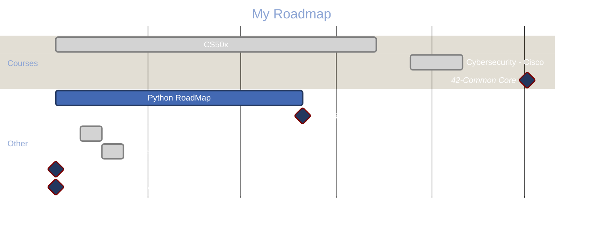

# 2023-06 to 2023-10

```mermaid
%%{
  init: {
    'theme': 'base',
    'themeVariables': {
      'primaryColor': '#23375E',
      'primaryTextColor': '#FFF',
      'primaryBorderColor': '#7C0000',
      'lineColor': '#F8B229'
    }
  }
}%%

gantt
	title My Roadmap
    dateFormat  DD-MM-YYYY

    section Courses
    CS50x                       :done, c1, 02-05-2023, 14-08-2023
    Cybersecurity - Cisco       :done, c7, 25-08-2023, 11-09-2023
    42-Common Core              :milestone, 42, 02-10-2023, 0d

    section Other
    Python RoadMap              :active, a1, 02-05-2023, 80d
    SQL RoadMap|PSQL|PostGIS    :milestone, after a1, 0d
    OpenPyXL                    :done, a5, 10-05-2023, 7d 
    Pandas                      :done, after a5, 7d
    PowerBI (not started)       :milestone, 02-05-2023, 0d
    PowerApps (not started)     :milestone, 0d
```

# 2023-10 ~ 2023-12

Will try using tree months timespan next year.

