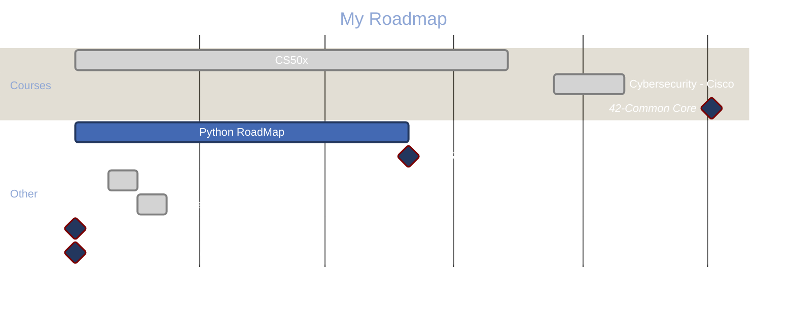
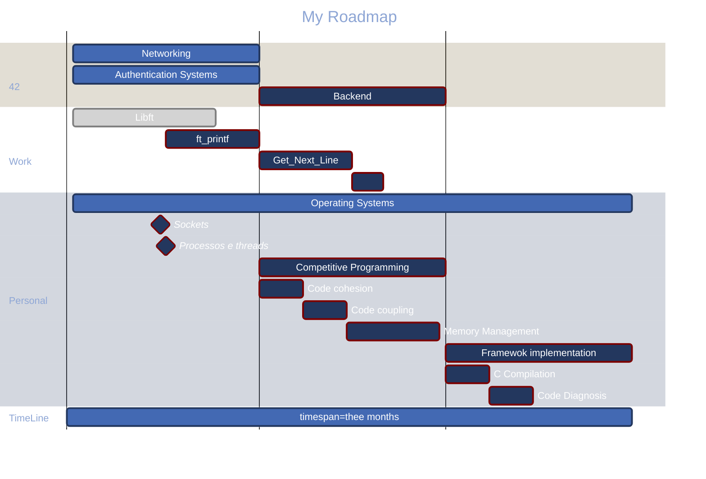

> Will try using tree months timespan next year.

# 2023-06 to 2023-10

```mermaid
%%{
  init: {
    'theme': 'base',
    'themeVariables': {
      'primaryColor': '#23375E',
      'primaryTextColor': '#FFF',
      'primaryBorderColor': '#7C0000',
      'lineColor': '#F8B229'
    }
  }
}%%

gantt
	title My Roadmap
    dateFormat  DD-MM-YYYY

    section Courses
    CS50x                       :done, c1, 02-05-2023, 14-08-2023
    Cybersecurity - Cisco       :done, c7, 25-08-2023, 11-09-2023
    42-Common Core              :milestone, 42, 02-10-2023, 0d

    section Other
    Python RoadMap              :active, a1, 02-05-2023, 80d
    SQL RoadMap|PSQL|PostGIS    :milestone, after a1, 0d
    OpenPyXL                    :done, a5, 10-05-2023, 7d 
    Pandas                      :done, after a5, 7d
    PowerBI (not started)       :milestone, 02-05-2023, 0d
    PowerApps (not started)     :milestone, 0d
```

# 2023-10 ~ 2023-12

```mermaid
%%{
  init: {
    'theme': 'base',
    'themeVariables': {
      'primaryColor': '#23375E',
      'primaryTextColor': '#FFF',
      'primaryBorderColor': '#7C0000',
      'lineColor': '#F8B229'
    }
  }
}%%

gantt
  title My Roadmap
  dateFormat DD-MM-YYYY
  tickInterval 1month

  section Work
    %% October
    Networking              :active, 02-10-2023, 30d
    Authentication Systems  :active, 02-10-2023, 01-11-2023
    %% November
    Backend                 :30d

  section 42
    %% October
    Libft                   :done, 02-10-2023, 25-10-2023
    ft_printf               :17-10-2023, 15d
    %% November
    Get_Next_Line           :15d
    Born2beroot             :5d
    %% December

  section Personal
    %% October
    Operating Systems       :active, 02-10-2023, 31-12-2023
    Sockets                 :milestone, 16-10-2023, 0d
    Processos e threads     :milestone, 17-10-2023, 0d
    %% November
    Competitive Programming :01-11-2023, 30d
    Code cohesion           :01-11-2023, 7d
    Code coupling           :7d
    Memory Management       :15d
    %% December
    Framewok implementation :01-12-2023, 30d
    C Compilation           :01-12-2023, 7d
    Code Diagnosis          :7d

  section TimeLine
    timespan=thee months :active, 01-10-2023, 31-12-2023
```
