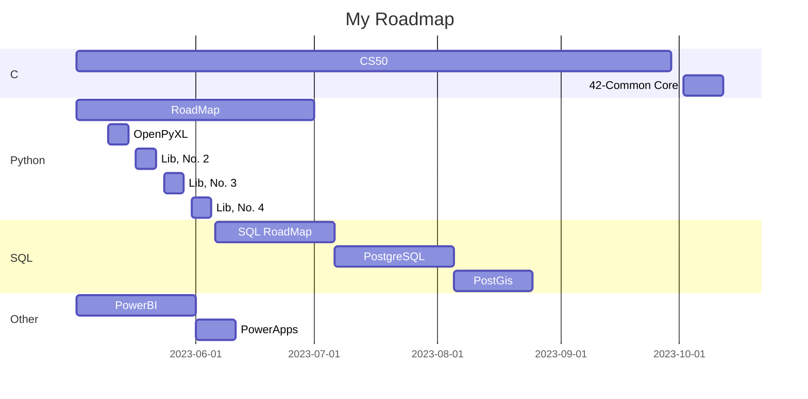

<table>
    <thead>
        <tr>
            <th>HOURS (18h ~ 19:30)</th>
            <th>Monday</th>
            <th>Tuesday</th>
            <th>Wednesday</th>
            <th>Thursday</th>
            <th>Friday</th>
        </tr>
    </thead>
    <tbody>
        <tr>
            <td>1ª Part</td>
            <td rowspan=3>(C) CS50</td>
            <td rowspan=2>(Python) Roadmap</td>
            <td rowspan=2>Revisão</td>
            <td>(Python) Libraries</td>
            <td rowspan=3>(C) CS50</td>
        </tr>
        <tr>
            <td>2ª Part</td>
            <td rowspan=2>(Python) Roadmap</td>
        </tr>
        <tr>
            <td>3ª Part</td>
            <td>(Python) Libraries</td>
            <td>PowerBI / Powerapps</td>
        </tr>
    </tbody>
</table>

# PROGRAMING
## [List - Studies](./README.md)

Basically, I set aside the days when I have more time to study C and Python, which are the biggest demands. Then comes SQL (Postgre and PostGis) along with PowerBI and PowerApps, for application in the company.

About the time, if you manage to reconcile between demands intervals, great, if not... Use the reserved time per day.

